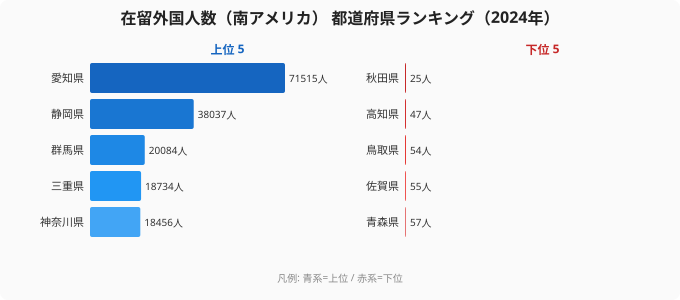

なぜ[愛知県](/areas/23000)豊田市や静岡県浜松市には日系ブラジル人が多く、秋田や高知にはほとんどいないのでしょうか。2024年の在留外国人（南アメリカ出身）データを見ると、愛知県**71,515人**に対し[秋田県](/areas/05000)は**25人**で、その差は約2,861倍に達しています。

この分布は「近い国からの移民が多い」という地理的な論理とは無関係です。答えは1990年の**出入国管理及び難民認定法（入管法）改正**にあります。この法改正で日系3世まで就労制限なしの「定住者」資格が創設された瞬間、**自動車産業が集積する地域**で日系南米人の大量雇用が始まりました。それから30年以上が経過した今も、分布の輪郭はほとんど変わっていません。

> [!NOTE]
> 出入国在留管理庁「在留外国人統計」（2024年12月末時点）。集計対象は在留資格を有する南アメリカ出身者で、主にブラジル人・ペルー人・コロンビア人を含む。不法滞在者は含まれない。「南アメリカ系」の大半は日系ブラジル人だが、非日系のブラジル人・ペルー人も含まれる点に留意。

## TOP10 ── 自動車産業ベルトに集中する南米系コミュニティ

上位10県は、1位 愛知県 71,515人、2位 静岡県 38,037人、3位 群馬県 20,084人、4位 三重県 18,734人、5位 神奈川県 18,456人、6位 岐阜県 13,423人、7位 滋賀県 11,657人、8位 埼玉県 11,655人、9位 東京都 8,842人、10位 茨城県 7,909人と続きます。

<source-link href="/ranking/resident-foreigner-south-america">在留外国人（南アメリカ）ランキングをもっと見る</source-link>

上位10県を地図で見ると、東海3県（愛知・静岡・三重）、北関東〜首都圏外縁部（群馬・神奈川・埼玉・茨城）、琵琶湖周辺（岐阜・滋賀）に強く偏っています。この3エリアは**主要自動車メーカーとその一次サプライヤーが立地するエリア**と重なります。なぜ上位がここまで産業立地に従うのかというと、南米系住民の主要な就労先が派遣・請負を含む製造業の現業職であり、職がある場所にしか居住が成立しないからです。地理的な距離ではなく「工場の有無」が分布を決めている、というのがこのデータの核心です。

- **愛知**：トヨタ自動車（豊田市）、デンソー（刈谷市）、アイシン（刈谷市）
- **静岡**：スズキ（浜松・湖西）、ヤマハ発動機（磐田）
- **群馬**：SUBARU（太田市）など北関東の製造業集積

首位の愛知と2位の静岡だけで、全国総数（27万8,695人）の約39%を占めています。東京が9位と意外に低いのは、製造業の現業職ではなくサービス業が中心の労働市場では、南米系の主要な就労先がもともと薄かったことを示しています。人口で圧倒する東京が、人口の少ない三重・滋賀より下位に沈むという逆転現象こそ、この指標が「人口の多さ」ではなく「産業構造」を映していることの証拠だと言えます。

## なぜ30年間、分布が変わらないのか

### 第1層：1990年入管法改正が分布の起点を決めた

1990年改正入管法は、日系3世以下に「定住者」資格を与えました。就労制限のないこの資格は、当時のバブル崩壊前後で深刻な人手不足に悩んでいた製造業に刺さりました。自動車・電機工場が集積する東海・北関東で、派遣・請負形態での大量雇用が一気に始まったのです。

初期に雇用された地域が、現在の分布の基盤になっています。**「最初に雇用された場所」**が長期的な居住地を決定する傾向が強かったのです。逆に言えば、最初の雇用の波が届かなかった県は、その後も追い上げる起点を持てませんでした。

### 第2層：チェーンマイグレーションが分布を強化した

群馬県大泉町では、一時期、町民の20%超をブラジル系が占めました。ポルトガル語学校・ブラジル食材スーパー・カトリック教会といった**生活インフラが整備されると**、後続の移住者が同じ地域を選び続ける自己強化ループが生まれます。コミュニティが生活を支えるから集中が続き、集中が続くからコミュニティが充実する、というサイクルです。

このループがあるため、上位県は新規の流入が起きやすく、下位県は流入の入口すら持てません。同じ就労ビザを持つ人が日本に来るとき、すでに同郷コミュニティがある県を選ぶのは合理的な判断であり、結果として上位と下位の差は時間とともに開いていきます。

> [!TIP]
> この指標は「南米系コミュニティの厚み」を測る代理指標として読めます。上位県の自治体ではポルトガル語の行政文書・多言語相談窓口の整備が進んでおり、絶対数だけでなく「生活インフラの充実度」も上位ほど高い傾向があります。順位を見るときは、人口比ではなく絶対数のコミュニティ規模に注目すると実態をつかみやすくなります。

### 第3層：製造業空白地ではコミュニティが未形成のまま30年

秋田（25人）・高知（47人）・鳥取（54人）など最下位グループには、**完成車工場を持たない地域**が並んでいます。1990年代に雇用の波が届かなかった地域には初期コミュニティが形成されず、チェーンマイグレーションも起きませんでした。30年後の今も「コミュニティ未形成」の状態が続いています。

> [!WARNING]
> 「南米系が少ない＝外国人が少ない」と読み違えないよう注意が必要です。製造業空白地でも、農業・水産業の現場では東南アジア系の技能実習生・特定技能外国人が増えています。本指標は南アメリカ出身者だけを数えたものであり、下位県の数字が小さいことは、その県に外国人労働者そのものが少ないことを意味しません。産業の種類によって、集まる国籍・在留資格は大きく異なります。

## 最下位グループ ── 製造業空白地の共通項

最下位グループは、43位 青森県（57人）・44位 佐賀県（55人）・45位 鳥取県（54人）・46位 高知県（47人）・47位 秋田県（25人）と続きます。秋田の25人は、人口100万人規模の県としては事実上「コミュニティ未形成」と言える水準です。

これらの県に共通するのは、完成車工場という「引力」を持たないことです。観光や農業では一定の存在感を持つ県もありますが、南米系住民を引き寄せる製造業の現業雇用がなかったため、30年間の分布から取り残されてきました。下位県の数字がほぼ二桁にとどまっているのは、新規流入がないだけでなく、いったん来た人が職を求めて上位県へ移っていくためでもあります。

<source-link href="/ranking/resident-foreigner-south-america">在留外国人（南アメリカ）全47都道府県ランキングを確認する</source-link>

南米系の分布は[国際分野のカテゴリ](/category/international)で扱う他の在留外国人指標とあわせて見ると、国籍ごとに集積地がまったく異なることがよくわかります。

## まとめ

南米系在留外国人の分布は、「どこに移民が来たか」ではなく「どこに工場があったか」で決まりました。制度（1990年入管法改正）×産業立地（自動車産業ベルト）×チェーンマイグレーションの3層構造が、30年以上にわたって格差を約2,861倍に固定してきたのです。

- **1位愛知71,515人〜47位秋田25人で約2,861倍の偏在**
- **上位は自動車産業集積地が独占**：愛知・静岡・群馬・三重・神奈川・岐阜
- **首位2県（愛知・静岡）だけで全国の約39%**を占める一極集中
- **東京が9位**という意外な低位は、製造業以外の労働市場では南米系雇用が少ない構造を反映
- **製造業空白地はコミュニティ未形成のまま**：東北・四国・九州北部で30年間変わらず

## データ出典

- 出入国在留管理庁「在留外国人統計」2024年12月末時点（e-Stat 経由）
- 集計対象：在留資格を有する南アメリカ出身者
- 取得：[e-Stat 政府統計の総合窓口](https://www.e-stat.go.jp/)
