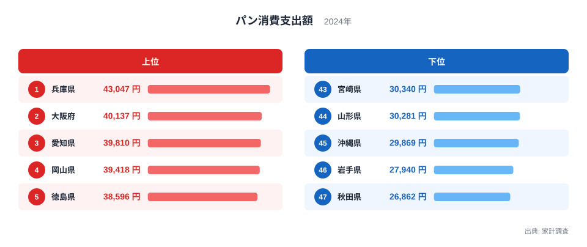
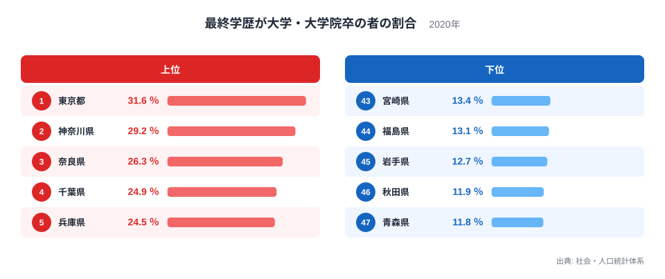
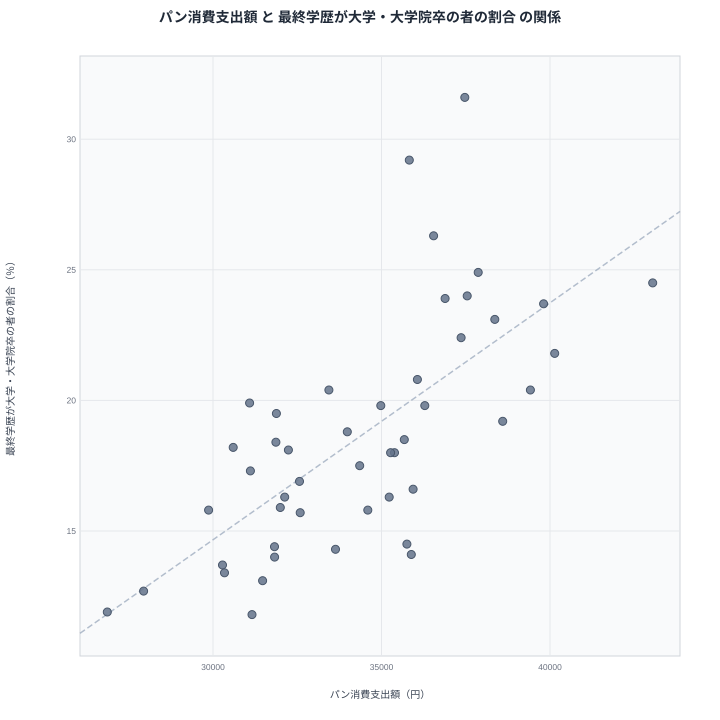

同じ日本の47都道府県でも、家計調査でパンにかけるお金は県によって大きく違います。総務省の家計調査によると、2024年のパン消費支出額は、最も多い県と最も少ない県のあいだで約1.6倍の開きがあります。

一方で、社会・人口統計体系が示す最終学歴が大学・大学院卒の者の割合も、県によって大きな差があります。この記事で気になったのは、パンをよく買う県の顔ぶれと、大学・大学院卒の割合が高い県の顔ぶれが、どこか重なって見えることです。パンが好きな県は学歴も高いのか、それとも別の理由で二つの数字がたまたま似た動きをしているだけなのか、47都道府県のデータから確かめていきます。

## パン消費支出額が高い県はどこか

総務省の家計調査による2024年のパン消費支出額を見ると、兵庫県は43,047円で1位です。大阪府は40,137円で2位、愛知県は39,810円で3位、岡山県は39,418円で4位、徳島県は38,596円で5位と続き、上位には関西と中部、瀬戸内の県が並びます。

<source-link href="/ranking/bread-consumption-expenditure">パン消費支出額ランキングをもっと見る</source-link>

下位に目を移すと、秋田県は26,862円で47位、岩手県は27,940円で46位、沖縄県は29,869円で45位、山形県は30,281円で44位、宮崎県は30,340円で43位と、東北と沖縄の県が並びます。1位の兵庫県と47位の秋田県を比べると、支出額には約1.6倍の開きがあります。

> [!NOTE]
> パン消費支出額は、二人以上の世帯が1年間に買ったパンの金額の平均です。パンをどれだけ食べているかではなく、家計としてパンにいくら使ったかを示す数字なので、単価の高いパンを少量買う県と、安いパンを多く買う県が同じような支出額になることもあります。

パン消費支出額が多い県には、パンの製造や販売が生活に根づいた都市部や、洋食文化が広がりやすい地域が目立ちます。逆に下位の県では、米や地元産の穀物を使った食文化が根強く、パンよりもご飯を中心とした食生活が続いている可能性があります。[兵庫県のデータ](/areas/28000)を見ると、他の家計関連の指標でも都市部らしい消費行動が見られます。

## 最終学歴が大学・大学院卒の割合が高い県はどこか

社会・人口統計体系が集計した2020年の最終学歴が大学・大学院卒の者の割合では、東京都が31.6％で1位です。神奈川県は29.2％で2位、奈良県は26.3％で3位、千葉県は24.9％で4位、兵庫県は24.5％で5位と、上位には大都市圏やその近郊に位置する県が並びます。

下位を見ると、青森県は11.8％で47位、秋田県は11.9％で46位、岩手県は12.7％で45位、福島県は13.1％で44位、宮崎県は13.4％で43位と、東北の県が並びます。この下位グループの顔ぶれは、パン消費支出額の下位グループとほぼ同じです。

とくに秋田県はパン消費支出額で47位、最終学歴が大学・大学院卒の割合で46位、岩手県はパン消費支出額で46位、同割合で45位、宮崎県にいたってはどちらの指標でも43位と、順位までそろっています。全47都道府県の値は[最終学歴が大学・大学院卒の者の割合ランキング](/ranking/final-education-university-graduate-school-ratio)で確認できます。

## 二つのランキングを重ねてみると

パン消費支出額が多い上位の県と、最終学歴が大学・大学院卒の割合が高い上位の県を見比べると、重なりが目立ちます。兵庫県はパン消費支出額で1位、同割合で5位です。愛知県はパン消費支出額3位、同割合8位、千葉県はパン消費支出額7位、同割合4位、京都府はパン消費支出額8位、同割合6位、埼玉県はパン消費支出額11位、同割合7位と、順位の高さがほぼそろっている県が目立ちます。滋賀県にいたっては、パン消費支出額でも同割合でも10位と、順位まで一致しています。

一方で、神奈川県は最終学歴が大学・大学院卒の割合で2位という高さですが、パン消費支出額では17位までで、大阪府もパン消費支出額では2位ですが、同割合では11位までで、完全に順位が一致するわけではありません。

散布図では、パン消費支出額が多い県ほど、最終学歴が大学・大学院卒の割合も高くなる傾向が見て取れます。点の並びはおおむね右肩上がりで、二つの指標が同じ方向に動く、いわゆる正の相関の形をしています。ただし点は一直線には並ばず、神奈川県や大阪府のように、片方の指標だけが突出している県も含まれています。

> [!TIP]
> 散布図を読むときは、点が右肩上がりに並んでいるかどうかだけでなく、線から大きく外れている県にも注目してみてください。神奈川県や大阪府のように片方の指標だけが高い県は、都市化以外の要因が働いている可能性を教えてくれます。

## 相関はあるが、原因ではない

ここまで見てきた正の相関は、パンを食べると大学に進学しやすくなる、あるいは大学を出るとパンをよく買うようになる、という直接の因果関係を意味しません。もっとも考えやすいのは、都市化や所得水準といった、二つの指標の背後にある共通の要因です。

大都市圏やその近郊は、大学や短期大学へのアクセスが良く、進学率が高くなりやすい環境にあります。同時に、こうした地域では洋食文化が広がりやすく、共働き世帯や単身世帯を中心にパンを買う機会も多いと考えられます。パン消費支出額と最終学歴が大学・大学院卒の割合は、それぞれ別の理由で都市化と結びついていて、その結果として二つの数字が似た動きをしている、という見方ができます。

たとえば、都市部では共働き世帯や単身世帯が多く、朝食や昼食を手早く済ませられるパンが選ばれやすい一方で、進学率の高さは、大学までの通学のしやすさや、身近に大学へ進む人が多い環境そのものからも後押しされます。パン消費支出額と最終学歴が大学・大学院卒の割合は、どちらも都市部という同じ土壌から育った、別々の果実だと考えるとわかりやすいかもしれません。

> [!WARNING]
> パン消費支出額は2024年、最終学歴が大学・大学院卒の者の割合は2020年の集計で、同じ年の値を比べているわけではありません。また、二つの指標が同じ方向に動いて見えても、それは片方がもう片方の原因になっているという意味ではなく、都市化や所得水準など別の要因を介した見かけの関係である可能性があります。

家計にまつわる他の指標は[同じカテゴリの統計一覧](/category/economy)からたどれます。大阪府のように、パン消費支出額と最終学歴が大学・大学院卒の割合の順位が離れている県を詳しく見たい場合は、[大阪府のデータ](/areas/27000)もあわせて参考にしてください。

## まとめ

- パン消費支出額は2024年時点で、1位が兵庫県の43,047円、47位が秋田県の26,862円です。
- 最終学歴が大学・大学院卒の者の割合は2020年時点で、1位が東京都の31.6％、47位が青森県の11.8％です。
- 二つのランキングの上位には都市部の県が、下位には東北の県が共通して並びます。
- 散布図では二つの指標が同じ方向に動く緩やかな正の相関が見られますが、点は一直線には並びません。
- この相関は都市化や所得水準など共通の背景要因を介したものと考えられ、パン消費と学歴のあいだに直接の因果関係があるとは言えません。

## データ出典

- 総務省 家計調査（2024年、パン消費支出額）
- 社会・人口統計体系（2020年、最終学歴が大学・大学院卒の者の割合）
