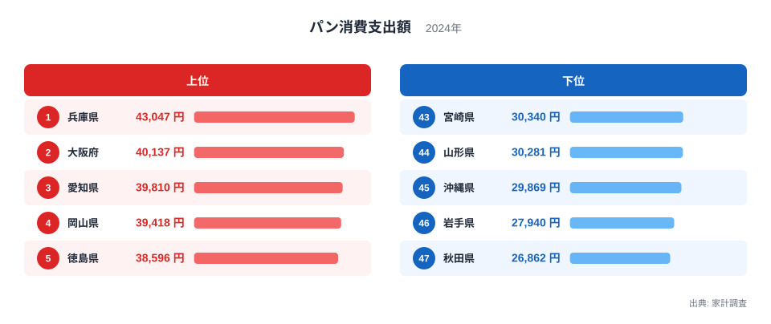
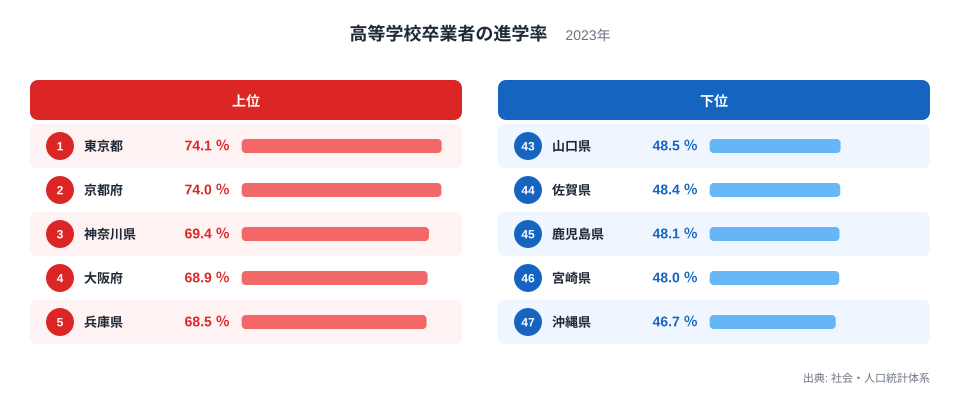
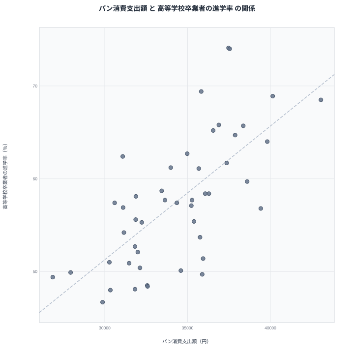

兵庫県はパンの消費支出額で全国1位、そして高等学校卒業者の進学率でも全国5位に入っています。反対に、パン消費支出額が最下位の秋田県は、進学率でも42位と低い順位に位置しています。まったく関係のなさそうな「パン」と「進学率」ですが、都道府県ごとのデータを並べてみると、ある程度似た地域が浮かび上がってくるのです。この記事では、家計調査によるパン消費支出額と、社会・人口統計体系による高等学校卒業者の進学率を比較し、両者がどこまで重なり、どこで外れるのかを確認します。単なる偶然の一致なのか、それとも共通の背景があるのか、順を追って見ていきます。

家計調査は本来、暮らしの中の消費行動を記録するための統計で、進学率とは調査の目的も対象もまったく異なります。それでも都道府県という同じ単位で並べてみると、両者の間に無視できない重なりが見えてくることがあります。この記事では、上位・下位それぞれの顔ぶれを確認したうえで、2つの指標の関係を散布図で可視化し、そこから読み取れることと読み取ってはいけないことを整理します。

## パン消費支出額、1位は兵庫県で最下位の1.6倍

家計調査による2024年のパン消費支出額を見ると、全国で最も金額が大きいのは兵庫県です。反対に、金額が最も小さいのは秋田県で、両者の差は1.6倍にのぼります。上位を見ると、兵庫県に続いて大阪府、愛知県、岡山県、徳島県が並び、関西・中部・中国・四国の各地域から満遍なく顔を出しています。

<source-link href="/ranking/bread-consumption-expenditure">パン消費支出額ランキングをもっと見る</source-link>

上位5県のうち兵庫県と大阪府は、後述する高等学校卒業者の進学率でもそれぞれ5位・4位という高い順位に入っています。一方で4位の岡山県は進学率で27位、5位の徳島県は16位にとどまり、パン消費支出額の上位すべてが進学率の上位と重なるわけではありません。下位を見ると、46位の岩手県と47位の秋田県、44位の山形県は東北勢がそろって並んでいます。43位の宮崎県は九州から、45位の沖縄県とあわせると、下位5県は東北・九州・沖縄という、大都市圏から離れた地域に集中している点が特徴です。なお37位の北海道は下位5県には入らず、順位のうえでは中位寄りに位置しています。

中位に目を移すと、11位の埼玉県から15位の鳥取県までの間に、関東・近畿・北陸・中国の県が入り混じっており、上位・下位ほど際立った地域のまとまりは見られません。それでも全体を通して見ると、関西や中部、四国にかけての県でパン消費支出額が大きくなりやすく、東北や北海道、沖縄では小さくなりやすいという緩やかな傾向がうかがえます。

> [!NOTE]
> パン消費支出額は「家計調査」による2人以上の世帯を対象とした年間支出額で、購入した金額の合計です。パンを焼く量や食べる量そのものではなく、あくまで店舗などで購入した金額である点に注意してください。

## 高等学校卒業者の進学率、東京都と京都府が上位を占める

続いて、社会・人口統計体系による2023年の高等学校卒業者の進学率を見ます。1位は東京都で74.1パーセント、2位は京都府で74パーセントと、上位2都府県だけが突出して高い水準です。3位の神奈川県、4位の大阪府、5位の兵庫県と続き、上位5都府県のうち4つが三大都市圏に含まれています。

最下位は沖縄県で46.7パーセント、46位は宮崎県で48パーセント、45位は鹿児島県で48.1パーセントと、九州・沖縄の各県が下位に並びます。[高等学校卒業者の進学率ランキング](/ranking/high-school-advancement-rate)の全体を見渡すと、上位は関東・関西の都市圏、下位は九州・沖縄・東北という地域構造がはっきり表れています。大学や短期大学、専門学校といった進学先が都市部に集中しやすいことや、通学圏内に選べる学校の数が地域によって異なることが、この差の背景にあると考えられます。

中位を見ると、11位の石川県から15位の岐阜県までの間に北陸・中部・近畿の県が固まっており、続く16位の徳島県、17位の福岡県あたりから徐々に順位が下がっていきます。上位2都府県が突出して高く、そこから緩やかに下がっていく形は、パン消費支出額の分布とは少し異なる特徴です。

> [!WARNING]
> 高等学校卒業者の進学率は、卒業した都道府県で集計された値であり、実際にその都道府県内の学校へ進学したかどうかは示していません。地元を離れて都市部の大学へ進学するケースも数多く含まれています。

## パン消費支出額と進学率の関係を散布図で確認する

2つの指標を散布図に重ねると、右上がりの緩やかな傾向が見えてきます。パン消費支出額が多い県は進学率も高めで、パン消費支出額が少ない県は進学率も低めになる、という関係です。[大阪府のデータ](/areas/27000)や[兵庫県のデータ](/areas/28000)のように、パン消費支出額と進学率がともに上位に入る県がある一方で、先ほど触れた岡山県や徳島県のように、パン消費支出額は上位でも進学率はそれほど高くない県も存在し、きれいな直線には乗りません。

実際に相関係数を計算すると約0.69で、中程度からやや強めの正の相関がみられます。この緩やかな関係は、パンを食べることが進学率を押し上げているという意味ではありません。[仮説]としては、都市化の度合いや世帯の所得水準が、パン消費支出額と進学率の両方に影響を与えている可能性が考えられます。都市部では食生活が洋風化しやすく、パンを購入する機会も増えます。同時に都市部は大学や専門学校の選択肢が多く、通学の負担も小さいため、進学率が高くなりやすい環境にあります。つまり、パン消費支出額と進学率という一見無関係な2つの指標が、都市化という共通の土台の上でともに動いている可能性があるということです。実際に、人口規模という都市化の目安になる要素を統制したうえで相関係数を計算しなおしても、値は約0.60までしか下がりません。単純な人口の大小だけでは説明しきれない結びつきが両者の間になお残っていることになり、都市化以外にも所得水準や食文化の広がり方といった、パンと進学率の両方に共通して働く要因がある可能性を示しています。

先ほど触れた岡山県と徳島県は、この仮説が単純には当てはまらないことも示しています。どちらもパン消費支出額では上位5県に入る一方、進学率では中位から下位寄りにとどまっており、都市化だけでは説明しきれない地域差が残っています。散布図の中でこうした点から外れた県を1つずつ確認していくことは、パンと進学率という組み合わせを超えて、地域データを読み解くうえで役に立つ視点です。

> [!TIP]
> 2つの指標が同じ方向に動いて見えるときは、片方がもう片方の原因だと決めつける前に、両方に影響を与えている別の要因がないかを考えると、データの読み方が一段深くなります。[同じカテゴリの統計一覧](/category/economy)から、所得や物価など関連する指標もあわせて確認してみてください。

## まとめ

パン消費支出額と高等学校卒業者の進学率を都道府県別に比較すると、上位・下位ともに一定の重なりが見られました。兵庫県や大阪府のように両方の指標で上位に入る県がある一方、岡山県や徳島県のようにパン消費支出額は高くても進学率はそれほど高くない県もあり、両者の関係は一様ではありません。背景には、パンという食品そのものよりも、都市化や所得水準といった、両方の指標に共通して影響する要因がある可能性があります。相関が見えたときほど、そこに因果関係があるのかどうかを一歩引いて確かめる姿勢が大切です。

## データ出典

パン消費支出額は総務省統計局「家計調査」(2024年)、高等学校卒業者の進学率は「社会・人口統計体系」(2023年)によるものです。いずれもe-Stat経由で公開されているデータをもとに集計しています。
