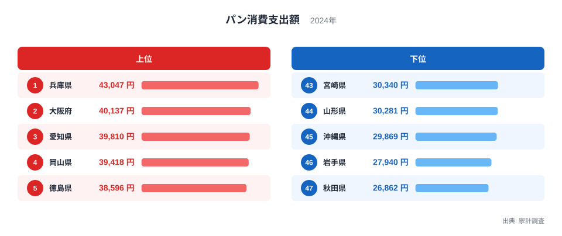
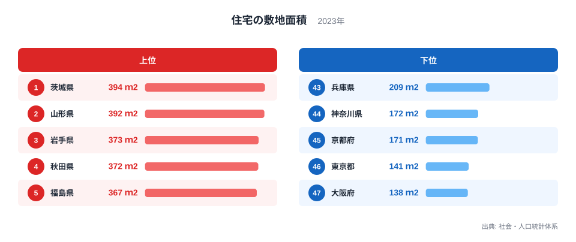
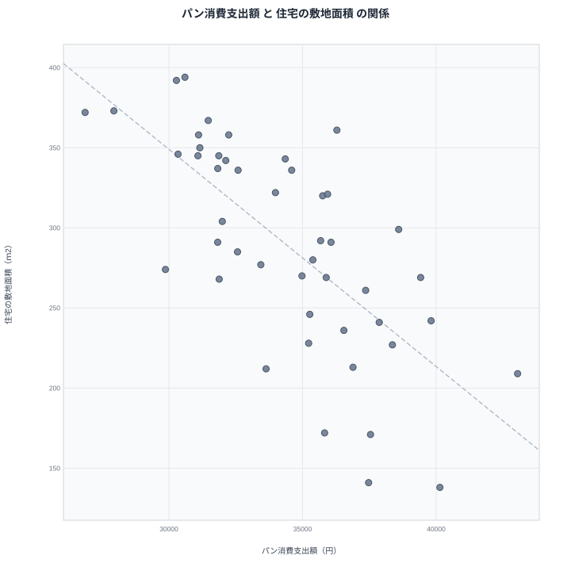

日本の食卓では、米だけでなくパンも身近な主食になりました。とはいえ、パンをよく食べる県と、あまり食べない県のあいだには、はっきりとした地域差があります。今回は、家計調査が示すパン消費支出額と、社会・人口統計体系が示す住宅の敷地面積を都道府県別に重ねてみます。すると、パンをよく食べる県ほど住宅の敷地が狭く、パンをあまり食べない県ほど住宅の敷地が広いという、ゆるやかな関係が見えてきます。

この記事では、まずパン消費支出額のランキングと、住宅の敷地面積のランキングをそれぞれ確認します。そのうえで、二つの指標を散布図で重ね合わせ、なぜこのような関係が生まれるのかを考えます。ただし、二つの指標が同時に動いているからといって、片方を原因、もう片方を結果と決めつけることはできません。その点にも触れながら、数字の奥にある背景を探っていきます。

## パン消費支出額の地域差

総務省の家計調査によると、2024年のパン消費支出額は都道府県ごとに大きく異なります。上位と下位の県を並べたものが次の図です。

<source-link href="/ranking/bread-consumption-expenditure">パン消費支出額ランキングをもっと見る</source-link>

パン消費支出額の1位は兵庫県で、43,047円です。2位は大阪府で40,137円、3位は愛知県で39,810円と続きます。4位の岡山県は39,418円、5位の徳島県は38,596円です。上位には近畿と中国・四国の県が目立ち、東京都も37,470円で9位に入っています。

一方、パン消費支出額が少ない県を見ると、43位の宮崎県は30,340円、44位の山形県は30,281円、45位の沖縄県は29,869円です。46位の岩手県は27,940円、そして47位の秋田県は26,862円と、東北の県が下位に集まっています。1位の兵庫県と47位の秋田県を見比べると、パンにかける金額の違いがはっきりと表れています。

このランキングだけを見ると、なぜ近畿の県でパンがよく買われ、東北の県ではあまり買われないのか、疑問がわきます。次に、住宅の敷地面積のランキングを確認し、その手がかりを探してみます。

## 住宅の敷地面積の地域差

総務省の社会・人口統計体系によると、2023年の住宅の敷地面積にも、都道府県ごとに大きな違いがあります。詳しい数字は[住宅の敷地面積ランキング](/ranking/site-area-per-dwelling)で確認できます。次の図は、敷地面積が広い県と狭い県を並べたものです。

敷地面積の1位は茨城県で、394平方メートルです。2位は山形県で392平方メートル、3位は岩手県で373平方メートル、4位は秋田県で372平方メートル、5位は福島県で367平方メートルです。上位には東北や北関東の県が並んでいます。

反対に、敷地面積が狭い県を見ると、43位の兵庫県は209平方メートル、44位の神奈川県は172平方メートル、45位の京都府は171平方メートルです。46位の東京都は141平方メートル、47位の大阪府は138平方メートルで、大都市を抱える府県が下位に集まっています。

ここで気づくのは、パン消費支出額で上位だった兵庫県と大阪府が、敷地面積では下位に入っていることです。[兵庫県のデータ](/areas/28000)と[大阪府のデータ](/areas/27000)を見比べると、パンをよく買う県ほど住宅の敷地が狭いという傾向が具体的に確認できます。反対に、パン消費支出額で下位だった秋田県と岩手県、山形県は、敷地面積では上位に入っています。二つの指標のあいだに、何らかの関係がありそうです。次の図で、この関係を確かめてみます。

> [!NOTE]
> 家計調査のパン消費支出額は、二人以上の世帯のうち、県庁所在市（政令指定都市の場合はその市）に住む世帯を対象に集計した値です。県内全域の平均ではなく、県庁所在市の暮らしぶりを映した数字であることに気をつけてください。

## 2つの指標を重ねると見える関係

パン消費支出額と住宅の敷地面積を、都道府県ごとに散布図で重ねてみます。

散布図を見ると、パン消費支出額が多い県ほど、住宅の敷地面積が狭い側に集まる傾向が見て取れます。パン消費支出額1位の兵庫県と2位の大阪府は、住宅の敷地面積でも43位と47位という下位に位置しています。京都府もパン消費支出額8位の37,542円とパンをよく買う一方、敷地面積は45位の171平方メートルと狭い部類に入ります。

反対に、パン消費支出額が少ない県は、住宅の敷地面積が広い側に集まっています。秋田県はパン消費支出額47位の26,862円で最も少なく、敷地面積は4位の372平方メートルと広い側にあります。山形県もパン消費支出額44位の30,281円と少なく、敷地面積は2位の392平方メートルと広い側です。岩手県も同じように、パン消費支出額46位の27,940円に対して、敷地面積は3位の373平方メートルとなっています。

ただし、すべての県がこの関係にきれいに当てはまるわけではありません。愛知県はパン消費支出額3位の39,810円と多い一方、敷地面積は36位の242平方メートルで、極端に狭い下位グループには入っていません。二つの指標には、ゆるやかな関係はあっても、例外もあることがわかります。

## 相関の裏にある本当の理由

パン消費支出額と住宅の敷地面積のあいだに関係が見えても、パンを食べると敷地が狭くなる、あるいは敷地が狭いからパンを食べる、という単純な因果関係を結論づけることはできません。二つの指標の背後には、都市部か地方かという共通の条件が隠れていると考えられます。

大阪府や兵庫県、京都府、東京都のように大都市を抱える地域では、住宅地の地価が高く、一戸あたりの敷地面積は自然と狭くなります。同時に、こうした都市部ではパン屋やコンビニエンスストアが多く、忙しい暮らしのなかでパンを主食に選ぶ機会も増えやすいと考えられます。一方、秋田県や岩手県、山形県のように敷地に余裕がある地方では、住宅の敷地は広く取れますが、米を中心とした食生活が根強く残っている可能性があります。

> [!WARNING]
> この記事で示した関係は、あくまで都道府県単位で見た傾向です。パン消費支出額と住宅の敷地面積のあいだに直接の因果関係があると断定するものではありません。都市化の度合いなど、両方の指標に影響する別の要因が働いている可能性があります。

つまり、都市化の度合いが、パン消費支出額と住宅の敷地面積の両方に影響しているという[仮説]が考えられます。ここでは家計調査と社会・人口統計体系の数字を照らし合わせただけで、都市化そのものを示す指標を検証したわけではありません。今後、人口密度など別の指標とあわせて確かめる必要があります。

> [!TIP]
> 二つのランキングを見比べるときは、県名だけでなく「大都市を抱える県か、広い土地を持つ地方の県か」という軸で並べ替えると、パンと敷地面積の関係がつかみやすくなります。[同じカテゴリの統計一覧](/category/economy)から、暮らしに関わる他の指標もあわせて確認してみてください。

## まとめ

- パン消費支出額の1位は兵庫県で、43,047円です。
- パン消費支出額の47位は秋田県で、26,862円です。
- 住宅の敷地面積の1位は茨城県で、394平方メートルです。
- 住宅の敷地面積の47位は大阪府で、138平方メートルです。
- パン消費支出額が多い都市部の県ほど、住宅の敷地面積は狭い傾向にあります。

## データ出典

パン消費支出額は総務省の家計調査（2024年）による都道府県別の値です。住宅の敷地面積は総務省の社会・人口統計体系（2023年）による都道府県別の値です。
