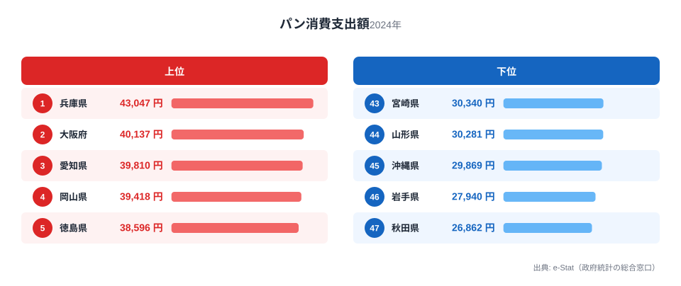
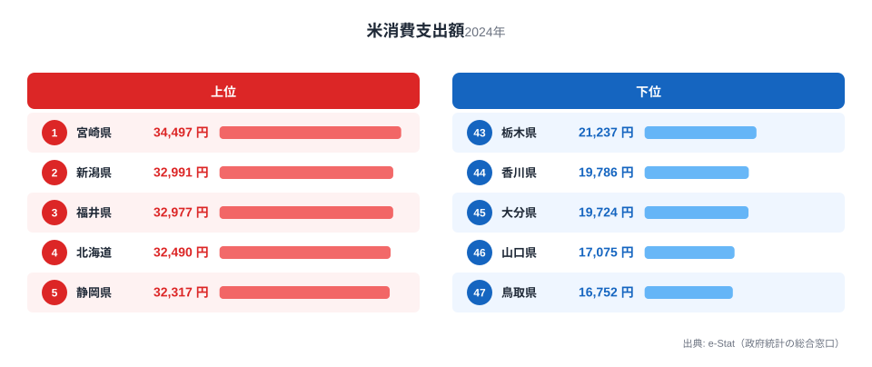

「ご飯派」か「パン派」か。朝食の好みは個人差の話に思えますが、総務省の家計調査を都道府県別に見ると、支出額には明確な地域差があります。2024年の1世帯あたり年間支出額で、パンは兵庫県が43,047円で1位、米は宮崎県が34,497円で1位です。

さらに面白いのは、パンをよく買う県ほど米をあまり買わず、米をよく買う県ほどパンをあまり買わない、という**逆相関の傾向**が見えることです。兵庫県はパン消費額で全国1位でありながら、米消費額では19位まで順位を落とします。逆に米1位の宮崎県は、パン消費額では43位まで沈みます。

この記事では、パンと米という「主食の座を争う」2つの支出額ランキングを重ね合わせ、なぜ同じ県が一方では上位、もう一方では下位になるのかを、地理と食文化の観点から掘り下げます。

> [!NOTE]
> この数値は総務省「家計調査」の1世帯（2人以上）あたり年間支出金額（品目別）です。購入量ではなく金額のため、価格差（高級食パン専門店の増減など）も反映されます。原則として都道府県庁所在市＋政令指定都市の調査値であり、県全体の平均ではありません。

## パン消費額ランキング — 西日本、特に近畿が上位を独占

<source-link href="/ranking/bread-consumption-expenditure">パン消費支出額ランキングをもっと見る</source-link>

パン消費額の上位を見ると、1位兵庫県（43,047円）、2位大阪府（40,137円）、3位愛知県（39,810円）、4位岡山県（39,418円）、5位徳島県（38,596円）と、近畿・山陽・東海が上位を固めています。8位京都府、10位滋賀県も加わり、近畿2府4県のうち4府県がトップ10入りするという偏りの強さです。

兵庫県が1位である背景としてよく語られるのが、神戸のパン食文化です。[兵庫県](/areas/28000)は開港以来、海外の食文化が早くから根付いた土地で、パン屋・洋菓子店・喫茶店の密度が高いことで知られます。[京都府](/areas/26000)・[大阪府](/areas/27000)も、朝食に喫茶店のモーニングセット（トースト・ゆで卵・コーヒー）を利用する習慣が根強く、これが世帯の食パン・調理パン支出を押し上げていると考えられます。東京都も9位（37,470円）と上位に入っており、パン支出が高いのは西日本に限った現象ではなく、大都市圏に共通する傾向とも読み取れます。

一方、下位を見ると状況は一変します。47位秋田県（26,862円）、46位岩手県（27,940円）、45位沖縄県（29,869円）、44位山形県（30,281円）、43位宮崎県（30,340円）と、東北勢が最下位グループの大半を占めます。1位兵庫県との差は1.6倍です。

> [!TIP]
> パンの支出額には「食パン」だけでなく「他のパン」（菓子パン・調理パン・惣菜パンなど）も含まれます。コンビニや量販店での調理パン購入頻度も金額に反映されるため、都市部で数値が高くなりやすい面があります。

## 米消費額ランキング — 主要産地と東北・北陸の一部が上位に

<source-link href="/ranking/rice-consumption-expenditure">米消費支出額ランキングをもっと見る</source-link>

米消費額のトップ5は、1位[宮崎県](/areas/45000)（34,497円）、2位[新潟県](/areas/15000)（32,991円）、3位福井県（32,977円）、4位北海道（32,490円）、5位静岡県（32,317円）です。2位新潟県は言わずと知れたコシヒカリの本場であり、「米どころ＝新潟」のイメージ通りの結果と言えます。一方1位の宮崎県は、必ずしも全国屈指の米どころとして語られる県ではなく、意外性のある1位です。米の消費量（金額ではなく購入量ベース）の詳細は[米消費量ランキング](/ranking/rice-consumption-quantity)でも確認できます。

下位側を見ると、47位鳥取県（16,752円）、46位山口県（17,075円）、45位大分県（19,724円）、44位香川県（19,786円）、43位栃木県（21,237円）と、山陰・山陽・四国・北関東が並びます。1位宮崎県との差は2.1倍で、パンの1.6倍よりも格差が大きいのが特徴です。特に43位から47位までの5県中3県を四国・山陰が占めており、瀬戸内海沿岸から山陰にかけて米消費額が低い帯ができています。

> [!WARNING]
> 家計調査は「購入した金額」を集計したものであり、農家の自家消費米（贈答や縁故米を含む）は対象外です。米どころとして知られる県でも、自給率が高く「買わない」ために支出額ランキングでは中位以下に沈むケースがある点に注意が必要です。

## 発見: パン高消費県は米消費額で沈み、米高消費県はパンで沈む

同じ県の順位を2つのランキングで突き合わせると、逆相関がはっきり見えます。

- **兵庫県**: パン1位（43,047円）→ 米19位（27,253円）
- **大阪府**: パン2位（40,137円）→ 米28位（25,965円）
- **京都府**: パン8位（37,542円）→ 米29位（25,814円）
- **岡山県**: パン4位（39,418円）→ 米35位（23,503円）
- **東京都**: パン9位（37,470円）→ 米31位（24,438円）

逆に米側の上位県を見ると:

- **宮崎県**: 米1位（34,497円）→ パン43位（30,340円）
- **鳥取県**: パン15位（35,936円）→ 米は最下位（16,752円）
- **山口県**: パン30位（32,567円）→ 米46位（17,075円）
- **福井県**: 米3位（32,977円）→ パン26位（33,985円、中位）
- **新潟県**: 米2位（32,991円）→ パン18位（35,754円、中位よりやや上）

近畿圏（兵庫・大阪・京都）は「パン高・米低」の典型で、宮崎・山口・鳥取は「米高（または低）・パン逆」の関係がくっきり出ています。ただし新潟・福井のように、米が上位でもパンが極端に低いわけではない県もあり、**すべての県できれいな西高東低・東高西低に分かれるわけではありません**。[仮説] 近畿圏は都市化と喫茶・洋食文化の定着度が高く、パン支出を押し上げる一方で家庭での米飯回数が相対的に減っている可能性があります。これを検証するには、外食・中食（コンビニ弁当等）への支出額もあわせて比較する必要があります。

> [!NOTE]
> 「パンが多い＝米を食べない」と単純に因果づけることはできません。この記事で示せるのはあくまで支出額の相関（同時に観測される傾向）であり、原因と結果を証明するものではない点にご留意ください。

## まとめ

- パン消費支出額1位は兵庫県（43,047円）、最下位は秋田県（26,862円）で1.6倍差
- 米消費支出額1位は宮崎県（34,497円）、最下位は鳥取県（16,752円）で2.1倍差
- パン上位は近畿・山陽・東海の都市圏に集中し、米上位は新潟・福井などの伝統的米どころに加え宮崎・北海道が意外な顔ぶれ
- 兵庫・大阪・京都はパン上位＆米下位、宮崎・山口はその逆という対照的な組み合わせが目立つ
- 米とパンの格差（2.1倍 vs 1.6倍）を比べると、地域による差は米の方が大きい

## データ出典

総務省「家計調査」（2024年、1世帯（2人以上）あたり年間支出金額）をもとに、e-Stat（政府統計の総合窓口）経由で整備したデータです。
