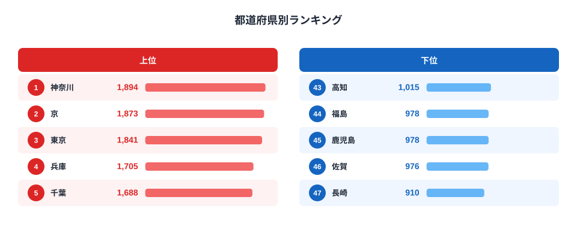
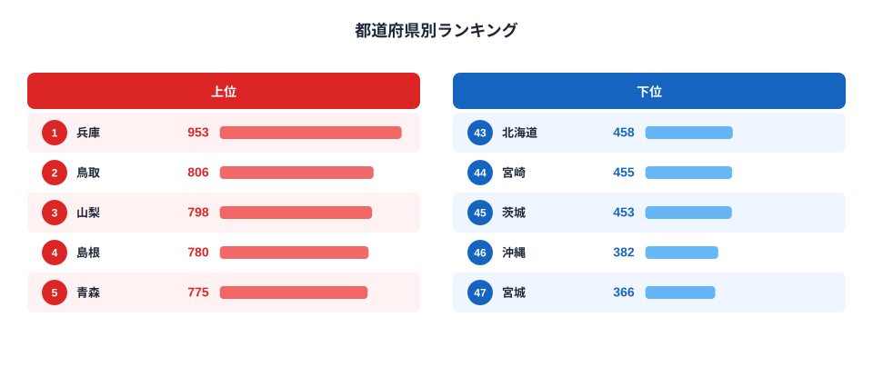

同じ「パンに塗るもの」でも、バターとマーガリンでは家計が支出する県がまったく違います。2024年の家計調査（二人以上世帯）を都道府県庁所在市別に見ると、バター消費支出額は神奈川県が1,894円で1位、マーガリンは兵庫県が953円で1位でした。1位の顔ぶれからしてすでに別物です。

バターの上位には神奈川・京都・東京・兵庫・千葉と、大都市圏や歴史的な洋食文化圏が並びます。一方マーガリンの上位は兵庫・鳥取・山梨・島根・青森と、地方の県が目立ちます。同じ「牛乳から作る油脂」と「植物油から作る油脂」なのに、なぜ買う顔ぶれがこれほど分かれるのでしょうか。この記事では、両者の支出額ランキングを重ね合わせることで、価格帯・所得水準・食文化という3つの軸が透けて見えることを示します。

> [!NOTE]
> 家計調査は都道府県庁所在市（および政令指定都市）の二人以上世帯が対象です。県全体の平均ではなく「県庁所在市」の消費傾向である点に注意してください。

## バター消費支出額ランキング

バター消費支出額の1位は神奈川県で1,894円、最下位は長崎県の910円でした。倍率にすると2.1倍です。上位5県は神奈川・京都・東京・兵庫・千葉で、いずれも人口の多い大都市圏、あるいは京都のように洋菓子・洋食文化が根付いた地域です。バターは牛乳を原料とする動物性油脂で、マーガリンより単価が高く、製菓・製パンでの風味の良さから「こだわりの調理」に使われる傾向があります。都市部で洋菓子店やベーカリーの消費文化が強い地域ほど、家庭でもバターを買う土壌があると考えられます。

下位5県は長崎・佐賀・鹿児島・福島・高知で、九州が3県を占めています。九州は伝統的に豚肉や魚を使った和食中心の食文化が強く、パン食・洋菓子文化の浸透がバター消費額の低さに表れている可能性があります。

<source-link href="/ranking/butter-consumption-expenditure">バター消費支出額ランキングをもっと見る</source-link>

## マーガリン消費支出額ランキング

マーガリン消費支出額の1位は兵庫県で953円、最下位は宮城県の366円でした。倍率は2.6倍で、バターより格差が大きくなっています。上位5県は兵庫・鳥取・山梨・島根・青森で、バターの上位県とはほぼ入れ替わっています。共通するのは兵庫県だけです。

マーガリンはバターより単価が安く、日常的にパンへ塗る「実用品」としての性格が強い油脂です。上位に地方県が並ぶ背景には、植物油ベースで価格が手頃なマーガリンが、都市部より地方の家庭で日常使いされている可能性があります。下位5県は北海道・宮崎・茨城・沖縄・宮城で、こちらは地理的なまとまりが見えにくく、単純な都市・地方の二分法では説明しきれません。

<source-link href="/ranking/margarine-consumption-expenditure">マーガリン消費支出額ランキングをもっと見る</source-link>

## バターとマーガリンで上位県が入れ替わる理由

バターとマーガリンの上位5県を比べると、共通するのは兵庫県のみです。兵庫県はバターで4位（1,705円）、マーガリンで1位（953円）と、どちらも高水準という珍しい県です。一方で愛知県はバター9位・マーガリン10位と、どちらも上位10位以内に入っています。

[仮説] バターとマーガリンは「価格の異なる代替財」の関係にあると考えられます。バターは高価格帯の嗜好品的な油脂、マーガリンは低価格帯の日用品的な油脂という位置づけです。所得水準の高い都市部ではバターへの支出割合が相対的に高まり、地方ではマーガリンが選ばれやすいという構図です。ただしこの仮説はあくまで支出額の地理的分布から読み取れる傾向であり、世帯所得データとの突き合わせによる検証が必要です。

> [!WARNING]
> バターとマーガリンの支出額は「購入量」ではなく「金額」です。バターは単価がマーガリンの2倍以上高いため、同じグラム数を買っても支出額はバターの方が大きくなります。ここでの県間格差は、購入量の差と単価の差の両方を反映した数字である点に注意してください。

宮城県はもうひとつ興味深い例です。バター消費支出額は7位（1,592円）と上位に入る一方、マーガリンは47位（366円）で全国最下位でした。同じ県でこれほど両極端な結果になるのは、宮城県の家庭がバターを明確に選好していることを示唆しています。

> [!TIP]
> 油脂の消費傾向をより立体的に見るには、食用油全体の消費額や、[パンの消費額ランキング](/blog/bread-vs-rice-expenditure)と合わせて確認すると、地域の食文化がより見えてきます。マーガリンはパンに塗る用途が中心のため、パン消費額の地域差と重ねると見え方が変わります。

兵庫県の家庭を詳しく知りたい場合は[兵庫県のエリアページ](/areas/28000)、宮城県は[宮城県のエリアページ](/areas/04000)もあわせてご覧ください。

## まとめ

- バター消費支出額1位は神奈川県1,894円、最下位は長崎県910円で2.1倍差
- マーガリン消費支出額1位は兵庫県953円、最下位は宮城県366円で2.6倍差
- バター上位は都市部・洋食文化圏（神奈川・京都・東京・兵庫・千葉）
- マーガリン上位は地方県が中心（兵庫・鳥取・山梨・島根・青森）、共通するのは兵庫県のみ
- 宮城県はバター7位・マーガリン47位と、同一県内で対照的な結果

## データ出典

総務省統計局「家計調査」（二人以上の世帯、都道府県庁所在市及び政令指定都市）を e-Stat 経由で集計。集計年は2024年。
