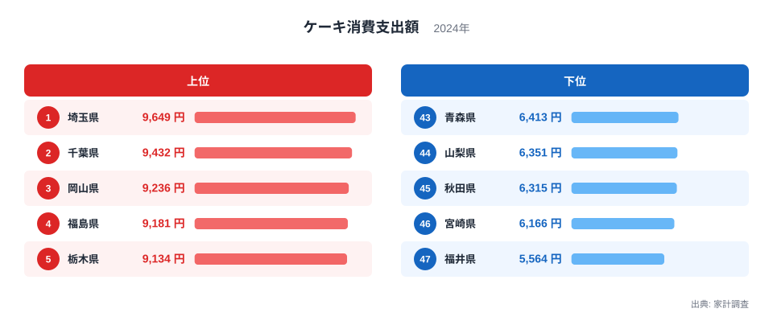
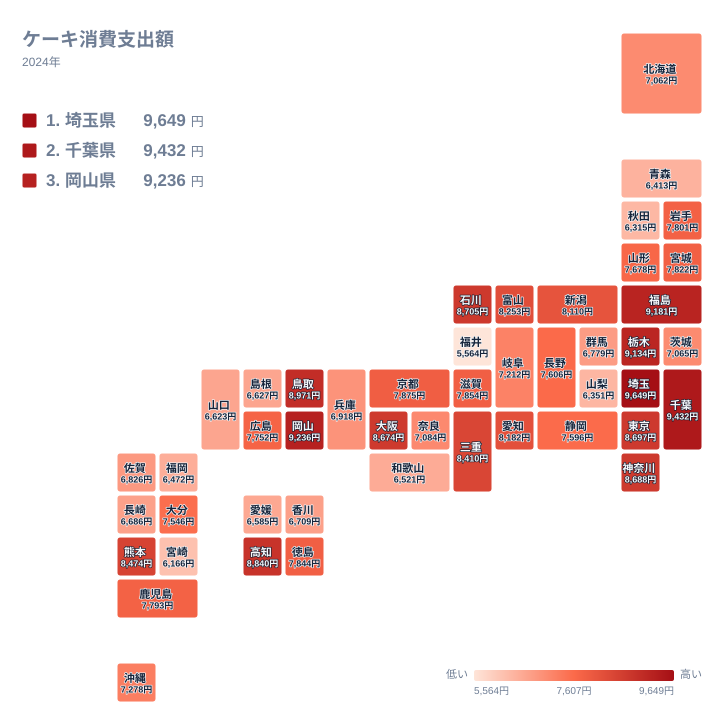

ケーキにどれくらいお金を使うかは、住んでいる都道府県によって差があります。家計調査に基づくケーキ消費支出額を見ると、最も支出額が多い都道府県と最も少ない都道府県の間には4千円を超える開きがあります。この記事では、その地域差がどのような要因から生まれているのかを、ランキングとタイルマップから確認していきます。

## 支出額の上位と下位を見る

<source-link href="/ranking/cake-consumption-expenditure">ケーキ消費支出額ランキングをもっと見る</source-link>

ランキングを見ると、埼玉県が9,649円で1位となり、千葉県が9,432円で2位、岡山県が9,236円で3位に続きます。4位は福島県で9,181円、5位は栃木県で9,134円です。上位5県のうち埼玉県と千葉県は首都圏に位置しながらも東京都自体よりも高い水準にあり、これは首都圏のベッドタウンとして家族世帯が多く、誕生日や記念日などの家庭内消費が活発であることが影響していると考えられます。栃木県や福島県が上位に入っているのは、地元の洋菓子店の存在や贈答文化の広がりが関係している可能性があります。

一方、下位を見ると福井県が5,564円で最も少なく、次いで宮崎県6,166円、秋田県6,315円、山梨県6,351円、青森県6,413円と続きます。福井県は2位に低い宮崎県と比べても600円ほどの差があり、47都道府県の中で最も支出額が抑えられています。これらの下位県には共通して、和菓子や地域固有の菓子文化が根強く残っている地域が含まれており、洋菓子であるケーキへの支出が相対的に少なくなっている可能性があります。

首都圏の内訳を見ると、埼玉県と千葉県が1位と2位を占める一方で、東京都は8,697円で9位、神奈川県は8,688円で10位となっています。同じ首都圏に位置していても、東京都と神奈川県は埼玉県や千葉県よりもやや低い水準にとどまっており、都心部よりも郊外の家族世帯が多い県のほうがケーキへの支出が大きい傾向がうかがえます。誕生日や記念日の家庭内消費が世帯人数の多さと結びついているとすれば、この違いにも説明がつきます。

## 地理分布のタイルマップで確認する

タイルマップで全国の分布を見ると、支出額が多い都道府県は関東地方から中国地方にかけて広く分布しており、特定の地方に極端に偏っているわけではないことが分かります。埼玉県、千葉県、栃木県といった関東地方の県に加え、岡山県や鳥取県といった中国地方の県も上位に位置しており、地理的な近接性だけでは説明しきれない多様な要因が背景にあると考えられます。

一方で九州地方と東北地方の一部には支出額が低めの県が目立ちます。宮崎県、秋田県、青森県、山形県はいずれも下位10県に入っており、これらの地域では祝い事に和菓子や地域特有の菓子を用いる慣習が比較的残っていることが、ケーキ消費の少なさにつながっている可能性があります。ただし東北地方でも福島県は9,181円で4位に入っており、同じ東北の中でも地域によって傾向が大きく異なる点は注目に値します。福島県は洋菓子店の集積や消費文化の違いによって、他の東北各県とは異なる消費パターンを示していると考えられます。

九州地方に目を向けると、福岡県が6,472円で42位、長崎県が6,686円で37位、鹿児島県が7,793円で22位と、九州7県の中でも順位に幅があります。同じ地方の中でも県庁所在地の都市規模や近隣県との経済的なつながりによって消費行動に違いが生まれており、地方単位でひとくくりに語るよりも、都道府県ごとの事情を踏まえて読み解くほうが実態に近いと言えます。

> [!NOTE]
> この記事のケーキ消費支出額は、家計調査における1世帯当たりの年間支出額を都道府県別に集計したもので、購入頻度や単価の違いは反映されていません。世帯人数や年齢構成が異なる都道府県間の単純比較には注意が必要です。

> [!WARNING]
> 家計調査は調査対象となる世帯数が都道府県ごとに限られているため、都市部に比べて人口の少ない県ではサンプル数が少なく、年による変動が大きくなりやすい点に留意が必要です。この記事のデータは2024年の単年の値であり、複数年の平均とは異なります。

> [!TIP]
> ケーキの消費支出額を読み解く際は、和菓子や地域特有の菓子の消費額と合わせて見ると、洋菓子と和菓子のどちらが好まれる地域かという視点が得られやすくなります。

上位と下位を通してみると、支出額の差は決して小さくないものの、順位が一つ変わるごとの変動幅はおおむね数十円から数百円と穏やかです。この点は、突出した1県だけが極端に高い、あるいは低いという構造ではなく、全国的になだらかな地域差が積み重なって上位と下位の開きを生んでいることを示しています。特定の県だけの特殊事情ではなく、関東地方と中国地方の一部で家庭消費が盛んである一方、東北地方や北陸地方、九州地方の一部で控えめであるという、広い地域単位の傾向として捉えるほうが実態に近いといえます。同じ関東地方の中でも埼玉県と千葉県が上位に、東京都と神奈川県がやや控えめな中位に位置しているように、都道府県単位で見ると地方区分だけでは説明しきれない細かな凹凸も残されており、単一の要因に還元せず複数の視点から読み解く姿勢が求められます。

ケーキ以外の家計消費に関する統計をまとめて見たい場合は[同じカテゴリの統計一覧](/category/economy)が参考になります。1位となった[埼玉県のデータ](/areas/11000)や、2位の[千葉県のデータ](/areas/12000)もあわせてご覧ください。

## まとめ

ケーキ消費支出額は、埼玉県の9,649円から福井県の5,564円まで、両者の差は4,085円に達します。上位には埼玉県、千葉県、岡山県、福島県、栃木県が並び、首都圏の家族世帯の多さや地域の洋菓子文化が支出額を押し上げていると考えられます。下位には福井県、宮崎県、秋田県、山梨県、青森県が並んでおり、和菓子や地域固有の菓子文化が根強い地域では相対的に洋菓子の支出が抑えられている可能性があります。

## データ出典

ケーキ消費支出額は家計調査(2024年)による集計です。
