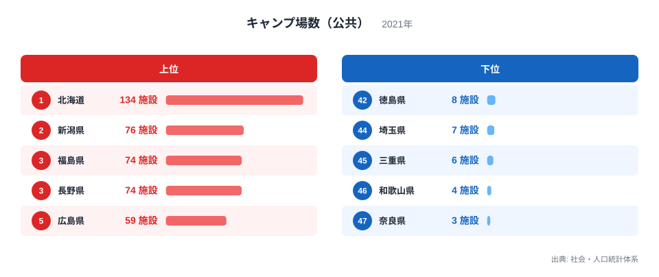
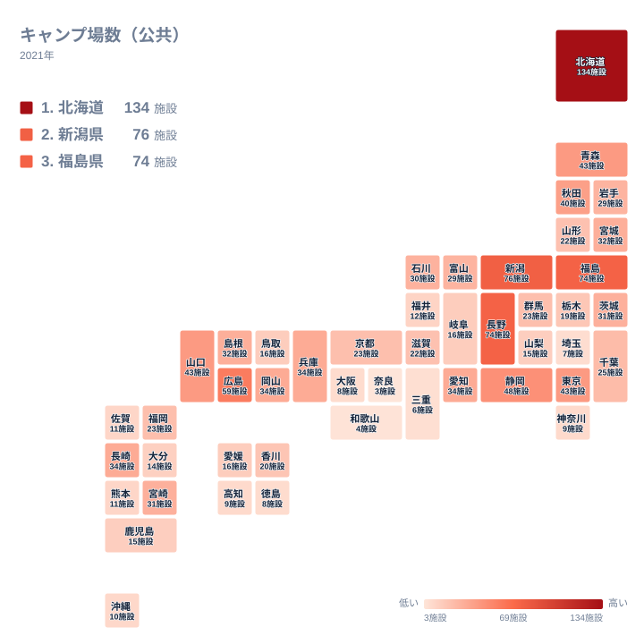

日本にはたくさんのキャンプ場がありますが、そのうち都道府県や市区町村などの自治体が運営する公共のキャンプ場に絞ると、数には都道府県で大きな差が生まれています。社会・人口統計体系の2021年のデータによると、公共キャンプ場が最も多いのは北海道で134施設です。一方で最も少ないのは奈良県で、わずか3施設しかありません。40倍以上もの開きがあるこの差は、いったい何が生み出しているのでしょうか。この記事では、上位と下位のそれぞれの県に注目しながら、地理条件や自治体の観光政策の違いから理由を探っていきます。

## 上位5県と下位5県のひらき

<source-link href="/ranking/campsite-public">キャンプ場数（公共）ランキングをもっと見る</source-link>

上位を見ると、北海道が134施設で突出しており、新潟県の76施設や、福島県と長野県のそれぞれ74施設を大きく引き離しています。5番目には広島県が59施設で入っています。北海道は面積が広く、山岳や湖沼、海岸線など多様な自然環境に恵まれているため、地域ごとに公共のキャンプ場を整備しやすい土地条件がそろっていると考えられます。[仮説] また、冷涼な気候で夏の観光需要が高まりやすいことも、自治体が観光施設としてキャンプ場を整備する動機になっている可能性があります。

新潟県、福島県、長野県はいずれも山間部を多く抱える県で、豪雪地帯としても知られています。これらの県では、夏場の高原や渓谷の涼しさを生かした観光振興の一環として、公共キャンプ場が整備されてきた面があると考えられます。[仮説] 特に長野県は避暑地としての知名度が高く、自治体による観光インフラ整備が長年にわたって進められてきた歴史があります。広島県についても、瀬戸内海沿岸と山間部の両方を抱えるという地理条件が、公共キャンプ場の整備しやすさにつながっているのかもしれません。

一方、下位を見ると状況は大きく異なります。徳島県は8施設、埼玉県は7施設、三重県は6施設、和歌山県は4施設、奈良県は3施設です。これらの県に共通するのは、必ずしも自然環境に乏しいわけではないという点です。奈良県や和歌山県、三重県は山地や海岸線を持ちますが、公共キャンプ場の数としては少数にとどまっています。[仮説] 民間の宿泊施設や観光資源がすでに充実している地域では、自治体が新たに公共のキャンプ場を整備する優先度が相対的に低くなっている可能性があります。また、埼玉県のように都市部への近さから宿泊を伴わない日帰り型の観光需要が中心になっている地域では、公共キャンプ場という形態そのものの必要性が薄いとも考えられます。

> [!NOTE]
> この指標は公共キャンプ場、つまり都道府県や市区町村などの自治体が運営するキャンプ場の施設数を数えたものです。民間企業や個人が経営するキャンプ場は含まれていません。また、区画数やテントサイトの規模ではなく、施設そのものの数を表している点にも注意してください。

## 地理分布から見える偏り

地理分布を見ると、公共キャンプ場が多い県は北海道や東北地方、中部地方の山間部に偏っていることが分かります。青森県が43施設、秋田県が40施設、岩手県が29施設と、東北地方全体で公共キャンプ場が比較的多い傾向にあります。これらの地域は森林や高原など、キャンプに適した自然環境が広く分布していることに加えて、人口減少や過疎化が進む地域で、公共施設を通じた交流人口の拡大を図る政策的な動機があると考えられます。[仮説] 公共キャンプ場は、民間投資が集まりにくい地方において、自治体が観光振興や地域活性化の手段として整備してきた面があるのかもしれません。

対照的に、近畿地方や四国地方では公共キャンプ場の数が少ない県が目立ちます。奈良県、和歌山県、三重県、徳島県はいずれも下位に入っており、この地域全体で公共キャンプ場の整備が進んでいない傾向がうかがえます。近畿地方や四国地方は歴史的な観光資源や温泉地など、キャンプ以外の観光インフラがすでに発達している地域が多く、自治体が新たにキャンプ場を公共施設として整備する優先度が下がっている可能性があります。[仮説] こうした地域差は、それぞれの地方が観光振興のためにどのようなインフラを重視してきたかという政策の違いを映し出しているとも読み取れます。

> [!WARNING]
> このデータは2021年時点での一時点の集計です。近年は指定管理者制度によって民間事業者が運営を委託されているキャンプ場も増えていますが、施設の設置主体が自治体であれば公共に区分される場合があります。休業中や老朽化によって利用できない施設が含まれている可能性もあるため、実際に訪問可能な施設数とは異なることがあります。

## 意外な共通点と地域差

上位県と下位県を比べると、単純に人口の多さや面積の大きさだけでは説明がつかない部分があります。例えば東京都は都市部でありながら43施設と、8番目という上位に入っています。[仮説] これは奥多摩など東京都西部の山間地域に多くの公共キャンプ場が整備されていることが背景にあると考えられ、大都市であっても山間部を抱える自治体は公共キャンプ場を整備しやすいことを示しているのかもしれません。一方で埼玉県は7施設と少なく、同じ首都圏に位置していても県によって整備状況が大きく異なることが分かります。

また、上位10県には北海道、東北地方の複数の県、中部地方の県が多く含まれており、地方色の強い地域ほど公共キャンプ場の整備に積極的な傾向がうかがえます。[仮説] これは民間の宿泊業が少ない地域で、自治体が観光や交流の受け皿を自ら用意してきた結果とも解釈できます。逆に、大阪府が8施設、神奈川県が9施設と、大都市を抱える府県で公共キャンプ場が少ない傾向があるのは、民間の観光・宿泊施設がすでに充実しているためだと考えられます。

より詳しく地域の特徴を知りたい場合は、[北海道のデータ](/areas/01000)や[新潟県のデータ](/areas/15000)から、人口や産業構造など他の指標もあわせて確認できます。また、[同じカテゴリの統計一覧](/category/educationsports)では、教育・スポーツ分野に含まれる他の統計を見ることができます。

> [!TIP]
> 施設数だけでは、1つのキャンプ場あたりの区画数や収容人数までは分かりません。同じ施設数でも県によって規模に差がある可能性があるため、実際に訪れる際は個々の施設の情報もあわせて確認することをおすすめします。

## まとめ

- 1位は北海道で134施設、47位は奈良県で3施設と、40倍以上の開きがあります
- 上位には北海道、新潟県、福島県、長野県、広島県が入り、いずれも自然環境が豊かな県です
- 下位には奈良県、和歌山県、三重県、埼玉県、徳島県が入り、近畿地方や四国地方、首都圏近郊に偏っています
- 東北地方全体で公共キャンプ場が多い傾向がある一方、近畿地方や四国地方では少ない傾向があります
- 東京都のように都市部でも山間地域を抱える自治体では、公共キャンプ場が多く整備されている例もあります

## データ出典

出典は社会・人口統計体系（2021年）です。都道府県が集計した公共キャンプ場の施設数をもとに、e-Stat経由で整備されたデータを使用しています。
