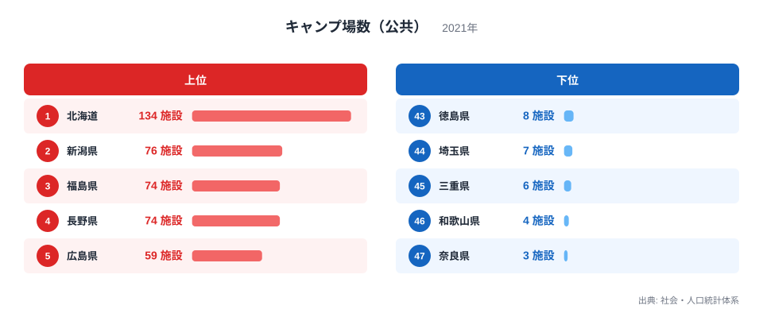
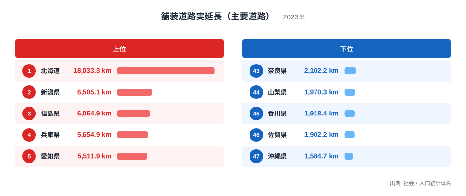
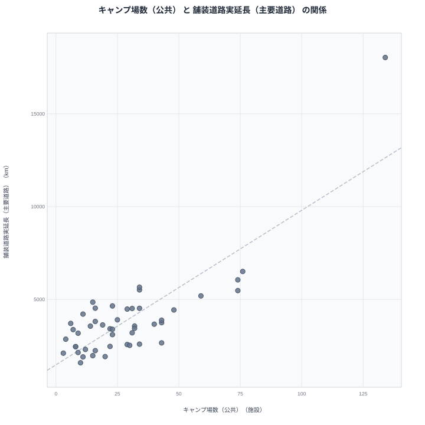

北海道は公共キャンプ場が134施設で全国1位です。そして舗装道路の実延長でも18,033.3キロメートルで全国1位となっています。この2つの指標は本当に関係しているのでしょうか。それとも偶然の一致でしょうか。

キャンプ場数（公共）と舗装道路実延長（主要道路）を都道府県別に比較すると、データの上ではかなり強い相関が確認できます。しかし、道路が長いからキャンプ場が増えるわけでも、キャンプ場が多いから道路が延びるわけでもありません。この記事では、両指標のランキングと散布図を通して、見かけの相関の背後にある共通要因を探っていきます。

## キャンプ場数（公共）の上位と下位

<source-link href="/ranking/campsite-public">キャンプ場数（公共）ランキングをもっと見る</source-link>

キャンプ場数（公共）は北海道が134施設で全国1位です。2位は新潟県で76施設、3位は福島県で74施設、4位は長野県も74施設で並び、5位は広島県で59施設となっています。上位には広い面積と豊かな自然環境を持つ道県が並んでいます。

一方で下位を見ると、奈良県が3施設で最下位です。46位は和歌山県で4施設、45位は三重県で6施設、44位は埼玉県で7施設、43位は徳島県で8施設となっています。これらの県はいずれも面積が比較的小さく、大都市圏に近い立地であることが特徴です。

キャンプ場数は自治体が公共施設として整備する数を反映しているため、県土の広さと自然資源の豊かさが多いほど整備される候補地も増える傾向にあります。北海道のように広大な面積を持つ地域では、キャンプ場だけでなく道路網も長く整備される必要があり、この点が後述する相関の背景の一つになっています。

## 舗装道路実延長（主要道路）の上位と下位

あわせて見る: [舗装道路実延長（主要道路）ランキング](/ranking/paved-road-main-length)

舗装道路実延長（主要道路）も北海道が18,033.3キロメートルで全国1位です。2位は新潟県で6,505.1キロメートル、3位は福島県で6,054.9キロメートル、4位は兵庫県で5,654.9キロメートル、5位は愛知県で5,511.9キロメートルとなっています。この値は他県と比べても際立って大きく、県土面積の広さがそのまま道路延長に反映されていることが分かります。

下位に目を移すと、沖縄県が1,584.7キロメートルで最下位です。46位は佐賀県で1,902.2キロメートル、45位は香川県で1,918.4キロメートル、44位は山梨県で1,970.3キロメートル、43位は奈良県で2,102.2キロメートルとなっています。面積の小さい県や離島県が下位に集まる傾向が見て取れます。

道路実延長は県土面積とほぼ比例して増える性質を持つ指標です。広い県ほど集落と集落を結ぶための道路網が長くなり、逆に面積の小さい県では同じ人口密度でも道路の総延長は短く済みます。この構造は、キャンプ場数のランキングで見た上位・下位の顔ぶれと大きく重なっています。

## 2つの指標の相関を見る

散布図では、キャンプ場数（公共）が多い県ほど舗装道路実延長（主要道路）も長い傾向がはっきりと見えます。北海道は両指標とも突出した値を持ち、右上の離れた位置にプロットされています。新潟県や福島県、長野県といった県も、両指標でともに上位に位置しており、右上方向に集まる分布になっています。

一方で奈良県や和歌山県、埼玉県のように、キャンプ場数も道路実延長も少ない県は、散布図の左下にまとまっています。これらの県は面積が比較的小さいか、市街地の割合が高いという共通点を持っています。

> [!WARNING]
> この相関は「キャンプ場を増やせば道路が延びる」「道路を延ばせばキャンプ場が増える」という因果関係を示すものではありません。両指標がともに強く連動している背景には、県土面積という別の要因が存在すると考えられます。相関係数が高いことは、2つの指標が同じ方向に動く傾向があることを示すだけで、原因と結果の関係を証明するものではない点に注意してください。

キャンプ場も道路も、実際に整備するのは都道府県ではなく市町村です。面積が広い都道府県ほど市町村の数も多くなりやすく、それぞれの自治体が観光振興や地域振興の一環としてキャンプ場を整備すれば、県全体の施設数は自然と積み上がっていきます。道路についても同様に、集落の数が多いほど各地を結ぶ道路網が必要になり、整備区間の合計が長くなるという構造があります。

## なぜこの相関が生まれるのか

県土面積の広さは、キャンプ場と道路が同じ方向に増える理由の一つに過ぎません。もう一つの視点として、観光振興という政策目的の連動が挙げられます。地方自治体が観光資源としてキャンプ場を整備する際には、そこへのアクセスを確保するための道路整備もあわせて計画に組み込まれることが少なくありません。

[仮説] キャンプ場のような観光施設と、そこへ至る道路の整備が同じ地域振興計画の中で進められている場合、施設数と道路延長は連動しやすくなります。ただし、この点は今回のデータだけでは検証できないため、あくまで仮説にとどまります。観光予算や道路整備計画のデータと突き合わせることができれば、より確からしい説明に近づけられるでしょう。

> [!TIP]
> このような「見かけの相関」を読み解くときは、両指標に共通して影響しそうな第三の要因（この場合は県土面積）を考えてみると、因果関係の誤解を避けやすくなります。面積で正規化した指標（人口当たり・面積当たり）と比較すると、また違った順位になる可能性があります。

## まとめ

キャンプ場数（公共）と舗装道路実延長（主要道路）は、都道府県別に見ると強い相関を示す2つの指標です。北海道が両方で1位、新潟県や福島県、長野県も両方で上位に入る一方、奈良県や埼玉県は両方で下位に位置しています。

> [!NOTE]
> キャンプ場数（公共）は自治体が設置した公共施設のみが対象で、民間事業者が運営するキャンプ場は含まれていません。舗装道路実延長は「主要道路」に限定した集計であり、市町村道などの生活道路は含まれていません。また両指標は調査年（2021年と2023年）が異なるため、厳密な同時点比較ではない点にもご留意ください。

今回見たように、一見無関係な2つの指標が同じ方向に動く背景には、県土面積だけでなく、整備を担う市町村の数や観光振興という政策目的の連動といった複数の要因が重なっている可能性があります。数字の関係だけを見るのではなく、その裏にある構造にも目を向けることが大切です。

より詳しいデータを確認したい場合は、[舗装道路実延長（主要道路）ランキング](/ranking/paved-road-main-length)や[同じカテゴリの統計一覧](/category/educationsports)もあわせてご覧ください。両指標でともに上位となった[北海道のデータ](/areas/01000)や[新潟県のデータ](/areas/15000)では、他の統計との関係もさらに詳しく見ることができます。

## データ出典

キャンプ場数（公共）は社会・人口統計体系の2021年データ、舗装道路実延長（主要道路）は社会・人口統計体系の2023年データを使用しています。
