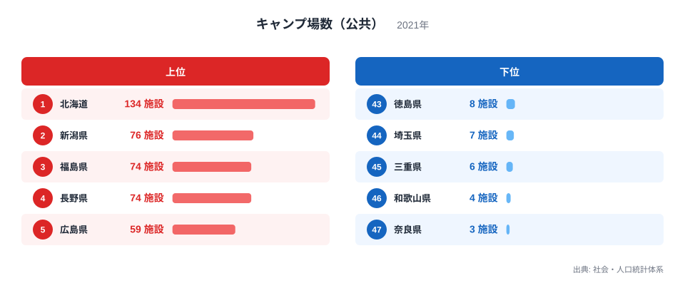
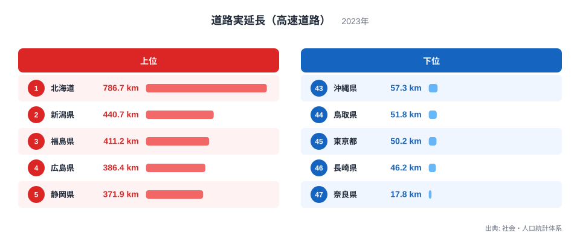
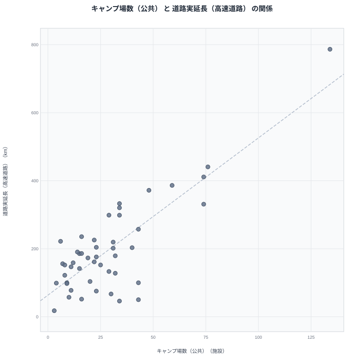

公共のキャンプ場が多い県と、高速道路が長く延びている県には、重なりがあるように見えます。実際に社会・人口統計体系のデータで確認すると、両方の指標で1位に立つのは同じ北海道です。ただし、この重なりを「高速道路が延びるとキャンプ場が増える」というふうに読んでしまうのは早計です。この記事では2つのランキングを並べ、見かけの相関の裏にある事情を整理します。

## 公共キャンプ場数が多い県、少ない県

<source-link href="/ranking/campsite-public">キャンプ場数（公共）ランキングをもっと見る</source-link>

2021年の公共キャンプ場数を見ると、北海道が134施設で1位です。2位は新潟県で76施設、3位は福島県で74施設、4位は長野県も同じく74施設、5位は広島県で59施設と続きます。上位には広い山林や高原を抱える県が並んでおり、公有地を活用した公共施設としてのキャンプ場整備が進んでいる様子がうかがえます。

下位を見ると、奈良県は3施設で47位、46位は和歌山県で4施設、45位は三重県で6施設、44位は埼玉県で7施設、43位は徳島県と大阪府がともに8施設です。近畿地方の県が下位に集中している点が目を引きます。都市化が進み平地の少ない地域では、公共のキャンプ場を新たに整備できる用地そのものが限られている可能性があります。

6位以降を見ると、静岡県は48施設で6位、青森県と東京都と山口県がいずれも43施設で並び7位から9位に入っています。東京都が上位10県に入っているのは意外に思えますが、これは離島や多摩地域の山間部を含む広い行政区域が影響していると考えられます。10位は秋田県で40施設です。

> [!NOTE]
> この指標は「公共」のキャンプ場数に限定した集計です。民間事業者が運営するキャンプ場や、いわゆるグランピング施設は含まれていません。全体のキャンプ場数とは別物として読む必要があります。

## 高速道路の実延長が長い県、短い県

続いて、2023年の高速道路の実延長を見てみます。北海道は786.7キロメートルで1位です。2位は新潟県で440.7キロメートル、3位は福島県で411.2キロメートル、4位は広島県で386.4キロメートル、5位は静岡県で371.9キロメートルと続きます。

下位に目を移すと、奈良県は17.8キロメートルで47位です。46位は長崎県で46.2キロメートル、45位は東京都で50.2キロメートル、44位は鳥取県で51.8キロメートル、43位は沖縄県で57.3キロメートルとなっています。東京都のように面積が狭い都市部では、そもそも高速道路を延ばす余地が限られていることが影響しています。奈良県は面積の割に山地が多く、道路整備そのものが難しい地形が背景にあると考えられます。

> [!WARNING]
> 高速道路の実延長は都道府県の面積の大小に強く左右される指標です。面積が広い北海道が上位に来やすいのは自然な結果であり、この数値だけを整備の進み具合として比較するのは適切ではありません。

## 2つの指標の関係を散布図で見る

散布図を見ると、北海道が両方の指標で突出しており、新潟県と福島県も両方の上位に入っています。全体としては、キャンプ場数が多い県ほど高速道路も長い、という緩やかな右肩上がりの傾向が見て取れます。ただし、これは相関であって因果関係ではありません。

この見かけの相関には、もっと単純な説明があります。両方の指標に共通しているのは「都道府県の面積」という土台です。面積が広い県ほど山林や高原などキャンプ場に適した土地が多く、同時に高速道路を延ばす物理的な余地も大きくなります。つまり、キャンプ場が高速道路を呼び込んでいるのでも、その逆でもなく、面積という共通の要因が両方の数値を押し上げていると考えるほうが自然です。[道路実延長（高速道路）ランキング](/ranking/road-expressway-length)を単独で見ると、この面積との関係がより明確に確認できます。

> [!TIP]
> 2つの指標が同時に上位・下位に並ぶときは、まず両方に影響する共通の背景がないかを疑うと読み違いを防げます。今回のケースでは都道府県の面積が、その共通要因にあたります。

散布図の下方には、キャンプ場数も高速道路実延長もともに低い県が集まっています。奈良県や大阪府、埼玉県のように都市部が多く平地の少ない県がここに位置しており、面積の狭さがそのまま両方の指標を押し下げていることが見て取れます。逆に散布図の上方には北海道が単独で離れて位置しており、他県とは水準そのものが大きく異なることも確認できます。

## 面積を考慮すると見え方が変わる

[北海道のデータ](/areas/01000)は面積が突出して広いため、キャンプ場数と高速道路実延長のどちらでも1位になるのは自然な結果と言えます。一方で[新潟県のデータ](/areas/15000)も面積が広い県のひとつであり、両方の指標で2位に入っている点は北海道と同じ理由で説明がつきます。もし面積あたりの密度で比較したなら、順位はまったく違う顔ぶれになる可能性が高く、今回のランキングだけで「キャンプ場が多いから道路も整備される」と結論づけることはできません。[同じカテゴリの統計一覧](/category/educationsports)から関連する指標もあわせて確認すると、この2つの数字の位置づけがより見えやすくなります。

上位と下位の県を見比べると、面積の大小という共通の物差しが2つの指標を同じ方向に動かしていることがわかります。因果関係を疑う前に、まず共通の背景要因を確認する読み方が、この種のランキング比較では欠かせません。

もう一つ注意したいのは、キャンプ場数が「公共」に限定されている点です。民間キャンプ場を含めた全体像では、順位が大きく変わる可能性があります。観光需要の高い県では民間事業者による施設整備が進んでいるケースも多く、公共施設の数だけを見ていては地域全体のキャンプ需要を見誤ることになりかねません。今回のランキングはあくまで公共施設に限った切り口として捉え、民間データとあわせて確認することをおすすめします。

## データ出典

出典: 社会・人口統計体系（総務省統計局）
キャンプ場数（公共）: 2021年
道路実延長（高速道路）: 2023年
