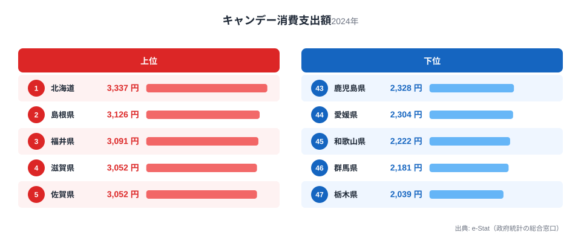
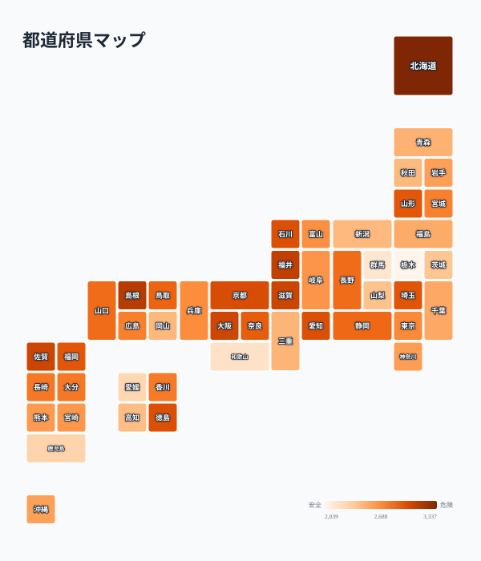

飴やキャンデーは、のどの乾燥対策や気分転換として、地域を問わず日常的に消費される菓子です。総務省の家計調査によると、1世帯当たりのキャンデー消費支出額は都道府県で差があり、2024年の全国データでは1位の北海道が3,337円、最下位の栃木県が2,039円と、その差は1.6倍にとどまります。

「寒い地域ほど飴をよく舐める」というイメージを持つ人は多いはずです。実際に1位は北海道でした。ところが2位は島根県、3位は福井県と、必ずしも冷涼な東北・北海道が並ぶわけではありません。この記事では上位・下位の顔ぶれと47都道府県の分布を確かめながら、「北ほど強い」という単純な図式では説明しきれない地域パターンを探ります。

> [!NOTE]
> 家計調査の都道府県別数値は、各都道府県庁所在市（または政令指定都市）の世帯を対象にした調査に基づきます。県内の農村部や離島まで含めた「県全体の消費傾向」ではなく、都市部の家計を代表値として見ている点に注意してください。

## 上位と下位

<source-link href="/ranking/candy-consumption-expenditure">キャンデー消費支出額ランキングをもっと見る</source-link>

1位は北海道の3,337円です。広い土地と寒冷な気候から冬場の外出時にのど飴を携帯する習慣が根付いているという見方ができますが、2位は島根県の3,126円、3位は福井県の3,091円と、日本海側の県が続きます。4位滋賀県と5位佐賀県はどちらも3,052円で同値となり、近畿・北陸だけでなく九州の県も上位に入ってきます。

6位大阪府、7位京都府と、近畿圏がまとまって上位に顔を出しているのも見逃せない特徴です。北海道を除くと、上位10県のうち島根・福井・滋賀・佐賀・大阪・京都・徳島・石川と、日本海側や近畿・四国・九州北部に分散しており、「東北・北海道が強い」という単純な寒冷地仮説だけでは説明がつきません。

一方、下位を見ると46位群馬県が2,181円、47位栃木県が2,039円で、いずれも関東の内陸県です。42位茨城県も2,406円と全国平均を下回り、北関東３県がそろって下位グループに入っています。関東圏は東京24位・神奈川30位・埼玉11位・千葉33位と幅がありますが、内陸の北関東だけが際立って低い点は、気候というより地域ごとの菓子文化・購買習慣の違いを示唆しています。

> [!WARNING]
> ここで扱う数値は「消費支出額」であり「消費量」ではありません。同じ量のキャンデーを買っても地域や店舗によって単価が違えば支出額は変わります。高価格帯の飴を好む地域では、消費量が少なくても支出額が高く出ることがあります。

## なぜ北海道だけが突出するのか

北海道が1位である背景には、広域移動に伴う車内・機内でのど飴を携帯する習慣や、冬季の乾燥した室内環境で飴を口にする機会が多いことが考えられます。ただし北海道と2位以下の差はわずか211円で、突出しているというよりは「僅差の1位」に近い分布です。1.6倍という全体の格差幅を踏まえると、北海道の特異性よりも、上位グループ全体がなだらかに並んでいる点のほうが特徴的です。

## 発見: 上位は北日本より近畿・日本海側に集まる

<source-link href="/ranking/candy-consumption-expenditure">キャンデー消費支出額の全47都道府県を見る</source-link>

地図で見ると、濃い色（支出額が高い県）は北海道を除けば近畿・北陸・山陰・九州北部に集まっており、東北地方はむしろ中間色が目立ちます。青森35位、秋田39位、岩手31位と、東北3県は上位には入っていません。宮城県も23位で中位にとどまります。「北ほど飴をよく買う」という直感的な仮説は、少なくともこの家計調査のデータでは支持されにくいということです。

代わりに浮かび上がるのは、近畿圏（大阪・京都・滋賀）の集積と、日本海側（島根・福井・石川）の高さです。[仮説] 内陸性の気候で空気が乾燥しやすい地域や、都市部特有の購買習慣が支出額を押し上げている可能性がありますが、これは家計調査の品目データだけでは検証できません。気温・湿度データとの突き合わせが必要な仮説として留めておきます。

> [!TIP]
> のど飴を含む「キャンデー類」は家計調査では菓子類の一部として集計されています。関連する菓子の消費支出額と合わせて見ると、地域の菓子文化全体の傾向がより立体的に見えてきます。[チョコレート消費支出額ランキング](/blog/chocolate-expenditure-ranking)や[チーズ消費支出額ランキング](/blog/cheese-expenditure-ranking)など、他の菓子・食品の消費支出額ランキングもチェックしてみてください。

1位の[北海道](/areas/01000)と最下位の[栃木県](/areas/09000)、それぞれの地域の特徴も合わせて確認すると、支出額の背景にある暮らしぶりが見えてきます。家計調査に関連する他の品目のデータは[経済・家計カテゴリ](/category/economy)からまとめて探せます。

## まとめ

- 1位は北海道（3,337円）、47位は栃木県（2,039円）で、格差は1.6倍
- 2位島根県、3位福井県と、北海道以外の上位は日本海側や近畿圏に集中
- 大阪・京都など近畿圏が6位・7位に入り、都市部でも支出額が高い
- 下位は群馬・栃木・茨城の北関東3県が集中しており、東北勢は中位が中心
- 「寒冷地ほど強い」という単純な仮説は、このデータからは裏付けられない

## データ出典

このランキングは総務省「家計調査」の品目別データを基に作成しています。都道府県庁所在市（または政令指定都市）の1世帯当たり年間支出額を集計したもので、2024年の最新データを使用しています。県民全体の消費傾向ではなく、都市部の家計を代表する数値である点にご留意ください。
