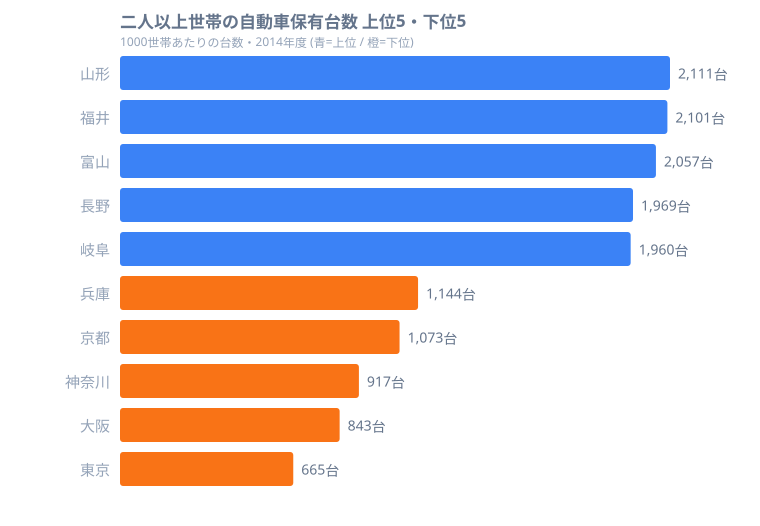

「家に車が2台あるのは普通」という地方の感覚と、「車を持たないのが普通」という都心の感覚。この差は、データではっきり数値化できます。

総務省「全国消費実態調査」(2014年度) の **二人以上世帯における1000世帯あたりの自動車保有台数** を見ると、1位の[山形県](/areas/06000)は2111台でした。これは1世帯あたり約2.1台、つまり「世帯に2台以上」が平均的な姿です。一方、最下位の[東京都](/areas/13000)は665台で、1世帯あたり約0.67台。世帯の3軒に1軒は車を持っていない計算になります。その差は **約3.2倍** です。

> [!NOTE]
> 本記事の数値は「1000世帯あたりの保有台数(台)」です。例えば2111台なら、1000世帯で2111台 = 1世帯あたり約2.11台を意味します。対象は単身を除く「二人以上の世帯」で、調査は5年ごとの全国消費実態調査(2014年度)に基づきます。

この記事では、保有台数の上位・下位を整理したうえで、「なぜ大都市ほど車が減るのか」という構造を、[交通カテゴリ](/category/transport)の公共交通や所得のランキングと照らし合わせて読み解いていきます。

## 保有台数の上位5と下位5

まず上位5県と、対照的な下位5県の分布を見ていきます。単位はすべて「1000世帯あたりの台数(台)」です。

上位を占めるのは、山形(2111台)・福井(2101台)・富山(2057台)・長野(1969台)・岐阜(1960台)といった、日本海側・内陸の県です。1位の山形県(2111台)はもちろん、2位の福井県(2101台)・3位の富山県(2057台)まで、上位3県はいずれも1世帯あたり約2.0台以上で、「ほぼ2台持ち」が標準になっています。4位の長野県(1969台)・5位の岐阜県(1960台)も1世帯あたり約1.96台と、ほとんど差がありません。

これらの県に共通するのは、鉄道網が薄く、店舗や職場が分散していることです。駅まで歩くより車に乗るほうが速く、大人1人につき1台に近い保有が生活の前提になります。買い物・通勤・通院といった日常の移動が、そもそも車を持っていないと成立しにくい地域構造になっているのです。日本海側・内陸という地理は、積雪や山がちな地形とも重なり、徒歩・自転車での移動が現実的でない場面を増やします。

<source-link href="/ranking/car-ownership-multi-person-households-per-1000">二人以上世帯の自動車保有台数ランキングをもっと見る</source-link>

## 下位は大都市圏が独占する

図の右側(下位グループ)には、上位とは正反対に三大都市圏が並びます。下位5県を1世帯あたりに換算すると、43位の兵庫県(1144台＝約1.14台)・44位の京都府(1073台＝約1.07台)・45位の神奈川県(917台＝約0.92台)・46位の大阪府(843台＝約0.84台)・最下位の東京都(665台＝約0.67台)となります。

最下位は東京都(665台)で、次いで大阪府(843台)、神奈川県(917台)と続きます。京都府(1073台)・兵庫県(1144台)を含めて、下位5県はすべて大都市を抱える地域です。神奈川県(917台)以下は1世帯あたり換算で1台を下回り、東京都では世帯の約3分の1が車を持たない水準まで落ちます。同じ「二人以上世帯」を比べても、山形と東京では1世帯あたりの台数が1.4台以上ちがう計算です。

> [!TIP]
> 鉄道・バスが密に走り、徒歩や自転車で買い物が完結する都市では、車は「必需品」から「任意の選択肢」に変わります。加えて駐車場代が高く、保有コストが地方より重いことも、保有率を押し下げる要因になります。下位の並びを「車が嫌われている地域」ではなく「車がなくても困らない地域」と読むのがコツです。

大都市圏が下位を独占する一方で、地方の県は40位より上に厚く分布します。この並びから読み取れるのは、地域差が「車が好きかどうか」ではなく、**公共交通の密度と生活動線の広がり** で決まっているという事実です。下位5県がそろって人口集中地域であることは、保有台数が「住む場所のインフラの写し鏡」であることを示しています。

## 倍率3.2倍は「都市化」の物差しになる

1位の山形県(2111台)と最下位の東京都(665台)の差は約3.2倍。これは保有のしやすさの差というより、**都市の成り立ちそのものの差** を映しています。

下位に並ぶ東京都・大阪府・神奈川県・京都府・兵庫県は、いずれも鉄道網が発達し人口が集中する地域です。逆に上位の山形県・福井県・富山県は、鉄道の駅が少なく移動距離が長くなります。つまりこのランキングは「車社会の濃淡マップ」として、都市化の度合いを裏側から測る指標になっているのです。人口が集中して鉄道が密な都市ほど保有台数が少なく、人口が散らばる地方ほど保有台数が多い、という対応関係がこの並びには表れています。

<source-link href="/ranking/railway-station-count">鉄道駅数ランキングで公共交通の充実度を比べる</source-link>

「車が減る」のは豊かさの問題ではなく、車を使わずに暮らせるインフラがあるかどうかの問題です。だからこそ、保有台数の少なさをそのまま「不便」や「貧しさ」と結びつけるのは適切ではありません。

## 所得が高い大都市で車が少ないという逆説

ここで注目したいのは、保有台数が少ない地域が「車を買えない地域」ではないという点です。

> [!WARNING]
> 「保有台数が少ない=家計が苦しい」と読むのは誤りです。下位の東京都・神奈川県・大阪府・京都府には、世帯所得では上位に入る地域が多く含まれます。保有台数の少なさは購買力の低さではなく、車を持たない選択ができる環境の表れと考えるのが妥当です。

[仮説] 所得が高い大都市ほど保有台数が少ないのは、(1) 公共交通で代替できる、(2) 駐車場・維持費が高く保有の機会費用が大きい、という2点が重なるためと考えられます。ただし本ランキング単体では因果は確定できず、所得・鉄道網・ガソリン消費などの各データと突き合わせた検証が必要です。実際、保有台数が多い地方の県ほどガソリンを多く消費する傾向は、別データでも確認できます。

<source-link href="/ranking/gasoline-sales-volume">ガソリン販売量ランキングで車社会度を確かめる</source-link>

この逆説は、地方在住者が大都市の生活コストを考えるとき、あるいは大都市在住者が地方移住を検討するときに、見落としやすいポイントです。「車が必要かどうか」は、住む場所の交通インフラで大きく変わります。地方へ移れば家賃が下がる一方で、世帯に2台分の車を維持する費用が新たに乗ってくる、という生活コストの組み替えが起こるのです。

## まとめ

- **1位は山形県(2111台/1000世帯、1世帯あたり換算で約2.1台)** ― 上位は山形・福井・富山・長野・岐阜と日本海側・内陸の県が占めます
- **最下位は東京都(665台/1000世帯、1世帯あたり換算で約0.67台)** ― 世帯の約3分の1が車を持たない水準です
- **上位と下位の差は約3.2倍** ― 倍率は購買力差ではなく都市化・公共交通密度の差を映します
- **下位5県(東京・大阪・神奈川・京都・兵庫)は三大都市圏に集中** ― 大都市ほど車が減る構造が鮮明です
- **所得が高い大都市で保有が少ない逆説** ― 車は必需品ではなく、インフラ次第で選べる選択肢になります

## データ出典

- 総務省統計局「全国消費実態調査」(2014年度)、二人以上の世帯の自動車保有台数(1000世帯あたり)
- e-Stat(政府統計の総合窓口)経由で整備した47都道府県データに基づく
