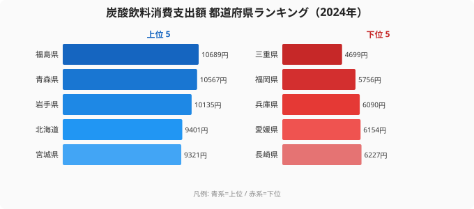

「炭酸飲料に一番お金を使う県は、暑い南国だろう」──そう思った人は、データを見ると裏切られる。2024年の家計調査（都道府県庁所在市・二人以上世帯）で、炭酸飲料消費支出額のトップに立ったのは**[福島県](/areas/07000)の10,689円**。2位青森県、3位岩手県と続き、上位はまるごと**東北勢**が占めた。一方で最下位は**[三重県](/areas/24000)の4,699円**。1位と最下位の差は**2.27倍**にもなる。

炭酸飲料消費支出額とは、コーラやサイダーなどの炭酸入り飲料に1世帯が年間で支出した金額のこと。同じ日本でも、住む県によって倍以上の開きがある。なぜ「寒い東北」が炭酸飲料にこれほど使い、「三重・近畿」が使わないのか。この記事では47都道府県の地図から、その意外な構造を読み解く。

> [!NOTE]
> 本データは総務省「家計調査」の品目別支出額で、各都道府県の**県庁所在市**における二人以上世帯の年間支出額です。県全体の平均ではなく、調査対象市の傾向を示す点に注意してください。金額には価格差も含まれるため、「飲んだ本数」そのものではなく「炭酸飲料に振り向けたお金」を表します。

## 炭酸飲料消費支出額ランキング 上位10と最下位

まずは2024年の全体像から。上位10県と最下位を並べると、東北・北海道が上位に固まり、最下位に三重県が沈む構図がはっきり見える。

上位の顔ぶれは驚くほど偏っている。**1位福島県（10,689円）・2位青森県（10,567円）・3位岩手県（10,135円）の3県だけが1万円超え**で、4位北海道（9,401円）、5位宮城県（9,321円）、6位[秋田県](/areas/05000)（9,004円）まで含めると、トップ6のうち5つが東北、残り1つが北海道。北日本が炭酸飲料の「支出地帯」を形成していることがわかる。

<source-link href="/ranking/carbonated-drink-consumption-expenditure">炭酸飲料消費支出額ランキングをもっと見る</source-link>

## 最下位グループ なぜ西日本・近畿が並ぶのか

下位5県を見ると、上位とはまったく違う地域が並ぶ。長崎県（6,227円・43位）・愛媛県（6,154円・44位）・兵庫県（6,090円・45位）・福岡県（5,756円・46位）・三重県（4,699円・47位）で、冒頭チャートの下端にこの並びが表れている。

最下位の三重県（4,699円）は、46位福岡県（5,756円）に1,000円以上の差をつけて単独最下位に沈んでいる。トップの福島県と比べると、年間で約6,000円、率にして2.27倍の開きだ。

下位グループの特徴は、近畿・西日本に寄っていること。兵庫県は6,090円（45位）、和歌山県は6,310円（41位）、京都府は6,655円（37位）と、**近畿圏がそろって下位**に位置する。「南北格差」という言葉で語られがちだが、正確には**「北日本が高く、近畿が低い」**という非対称な分布で、単純な南北の温度差では説明しきれない。

> [!WARNING]
> 上位・下位の解釈には、価格水準や世帯構成、地元飲料メーカーの存在など複数の要因が絡みます。家計調査は標本調査のため、年によって順位が入れ替わることもあります。ここでの分布は2024年単年のスナップショットとして読んでください。

## 発見1 大都市は意外と「中位」に沈む

炭酸飲料というと若者や都市の消費イメージが強いが、データは逆を示す。**東京都は25位（7,638円）、神奈川県は28位（7,443円）、愛知県は31位（7,084円）**と、三大都市圏の中心が軒並み中位に沈んでいる。

例外は**大阪府で13位（8,523円）**。同じ近畿でも大阪は比較的高く、京都府（37位・6,655円）とは大きく離れている。隣接する近畿圏のなかで、大阪と京都でこれだけ差が開くのは興味深い。

[仮説] 上位の東北・北海道で支出が大きい背景には、地元の炭酸飲料文化（ご当地サイダーや乳性炭酸など）や、寒冷地ほど自宅でまとめ買いする習慣がある可能性が考えられる。ただし本データは支出額のみで、購入動機までは特定できないため、検証には消費数量データや品目内訳との突き合わせが必要だ。

## 発見2 1位福島と最下位三重で2.3倍 ── 食の地図は気候だけでは決まらない

「暑い地域ほど炭酸飲料を飲む」という直感は、このデータでは成り立たない。最も使うのは寒い福島県（10,689円）で、暑い沖縄県は20位（8,278円）にとどまる。むしろ**北日本がまとめて上位**を占め、温暖な近畿・三重が下位に並ぶ。

つまり炭酸飲料の支出地図は、気温よりも**地域ごとの嗜好と買い物文化**に強く規定されている。1位福島県と最下位三重県の2.27倍差は、同じ商品に対する「お金の使い方の地域差」がいかに大きいかを物語っている。

## まとめ

- **1位は福島県（10,689円）**。2位青森県（10,567円）、3位岩手県（10,135円）と、上位は東北が独占した
- **最下位は三重県（4,699円）**。46位福岡県（5,756円）に大差をつけて単独最下位
- 1位と最下位の差は**2.27倍**。同じ炭酸飲料への支出が県で倍以上違う
- 上位は東北・北海道、下位は近畿・西日本という非対称な分布。「南北格差」というより「北日本が高く近畿が低い」構図
- 東京25位・愛知31位と**大都市は中位**。一方で大阪は13位と近畿のなかでは高い

## データ出典

総務省統計局「家計調査」（品目別支出額・都道府県庁所在市・二人以上世帯）。集計年は2024年。e-Stat（政府統計の総合窓口）経由で整備したデータをもとに作成しています。
