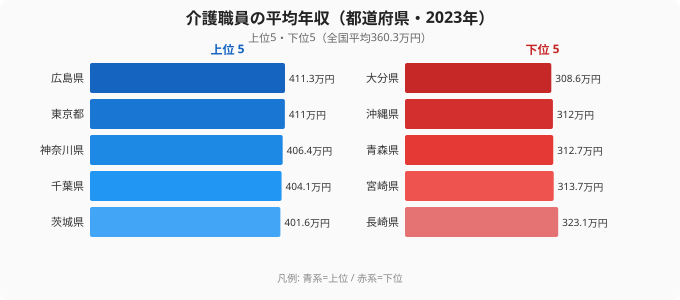
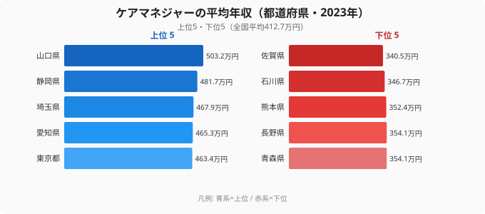
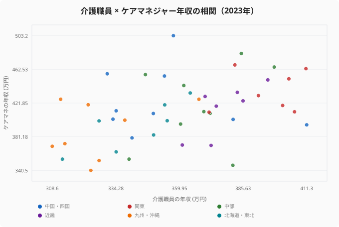

「介護職は給料が低い」とよく言われます。けれども、その「低い」は全国一律ではありません。2023年の賃金構造基本統計調査をもとに介護職員（介護福祉士など、施設・在宅で直接ケアにあたる職員）の平均年収を都道府県別に並べると、最も高い広島県は411.3万円、最も低い大分県は308.6万円。同じ仕事でも県をまたぐと**102.7万円**、倍率にして**1.3倍**の差がつきます。月収に直せば毎月8万円以上の違いです。

この記事の問いは2つあります。1つめは「どの県で介護職員の年収が高く、なぜそうなるのか」。2つめは、転職や職場選びを考えるうえでより実利的な問い──「介護福祉士からケアマネジャー（介護支援専門員）へ資格を上げると、年収はどれだけ動くのか。それは県によってどう違うのか」です。実は、職員年収が全国1位の広島県は、ケアマネに変わると年収が下がる珍しい県でした。資格と地域の組み合わせで手取りがどう変わるのか、データで見ていきます。

> [!NOTE]
> ここでの「年収」は賃金構造基本統計調査の「きまって支給する現金給与額×12＋年間賞与その他特別給与額」で推計した額面（税・社会保険料を引く前）です。手取りではなく、また個々の事業所の処遇改善加算の取得状況や夜勤回数までは反映しません。同じ県内でも、加算を多く取る法人と取らない法人で年収は十数万円単位で変わり得ます。順位は「県の平均的な水準」を示すものと読んでください。

## 介護職員の年収が高いのは関東圏、低いのは九州・沖縄

まず介護職員そのものの年収を見ます。上位は広島県を例外として、東京・神奈川・千葉・茨城と関東圏が固めました。下位は大分・沖縄・青森・宮崎・長崎と、九州と地方圏に集中しています。

上位の顔ぶれには素直な理由と意外な点が混在しています。東京411.0万円・神奈川406.4万円・千葉404.1万円が上位に来るのは、地価や生活費が高い都市部ほど賃金の底上げが効くためで、これは想像どおりです。意外なのは1位の[広島県](/areas/34000)411.3万円です。広島は三大都市圏ではありませんが、医療・福祉法人の集積と製造業を中心とした地域の賃金水準の高さが、介護分野の処遇にも波及していると考えられます。茨城401.6万円が5位に入るのも、首都圏に隣接しながら人手不足が深刻で、賃金を上げないと人が集まらない構図を映していそうです。いずれも[仮説]の域を出ないため、地域別の有効求人倍率などとの突き合わせが必要ですが、「都市近接 × 人手不足」が上位の共通項であることはデータから読み取れます。介護以外の職種でも同じ傾向が出るのかは、[39職種の年収を住む県で比べた記事](/blog/job-salary-39-comparison)とあわせて読むと立体的に見えてきます。

<source-link href="/ranking/care-worker-annual-income">介護職員の平均年収ランキング（全47都道府県）を見る</source-link>

> [!WARNING]
> このランキングは「県の平均」であって「あなたの手取り保証」ではありません。介護職員の給与は、勤め先が処遇改善加算・特定処遇改善加算をどこまで取得しているか、夜勤専従かどうか、サービス種別（特養・老健・訪問・デイ）によって大きく振れます。下位県でも加算をフルに取る大規模法人なら全国平均を超えることがあり、上位県でも無加算の小規模事業所ならこの数字を下回ります。県の順位は「相場の目安」、最後は事業所単位で確認するのが鉄則です。

## 下位グループ──九州・沖縄に集中する構造

最下位の[大分県](/areas/44000)308.6万円から、沖縄312.0万円、青森312.7万円、宮崎313.7万円、長崎323.1万円までが下位5県です。地理的に九州・沖縄と東北の一部に偏っているのが特徴です。

この偏りには2つの構造が重なっています。1つは地域全体の賃金水準の低さです。介護報酬は全国共通の単価をベースに地域区分による上乗せ（地域加算）がつきますが、その上乗せ率は都市部ほど高く、九州・沖縄や東北の多くは最も低い「その他」区分に置かれます。同じ介護報酬制度のもとでも、制度設計の時点で地方ほど受け取れる単価が低くなる仕組みです。もう1つは、競合する他産業の賃金が低いと介護の賃金もその水準に引っ張られやすいことです。県内に高賃金の雇用が少ない地域では、介護職を相対的に高く設定する圧力が働きにくくなります。

つまり下位県の低さは「介護業界だけが特別に冷遇されている」というより、**地域の賃金構造ごと低い**ことの反映に近い、と読むのが妥当です。逆に言えば、生活費も同時に低い県が多いため、額面の順位がそのまま暮らし向きの順位になるわけではない点には注意が必要です。

> [!TIP]
> 年収の額面だけで「この県は損」と判断するのは早計です。同じ300万円台でも、家賃相場が東京の半額以下の県では可処分所得（自由に使えるお金）の体感はむしろ高くなることがあります。職場選びでは「年収 ÷ その地域の生活費」、つまり実質の手元に残る額で比べると、ランキングとは違う風景が見えてきます。

## ケアマネに上がると年収はどう動くか──全国平均で+52.5万円、でも県差が激しい

ここからがこの記事の核心です。介護福祉士として現場で経験を積んだ後の代表的なキャリアアップが、ケアマネジャー（介護支援専門員）への資格取得です。ケアマネはケアプランの作成やサービス調整を担う、いわば介護のマネジメント職です。では、ケアマネに変わると年収は上がるのでしょうか。

まずケアマネ単体のランキングを見ます。

ケアマネの全国平均は412.7万円で、介護職員の全国平均360.3万円より**52.5万円高い**。資格を上げれば平均的には年収が上がる、という常識はデータでも裏づけられます。ただし顔ぶれは介護職員ランキングと大きく入れ替わります。ケアマネ1位は山口県503.2万円で、介護職員では山口は26位357.5万円にすぎませんでした。2位静岡481.7万円、3位埼玉467.9万円と続き、介護職員1位だった広島はケアマネでは35位395.5万円まで沈みます。下位は佐賀340.5万円・石川346.7万円・熊本352.4万円と、こちらも介護職員とは別の県が並びます。

<source-link href="/ranking/care-manager-annual-income">ケアマネジャーの平均年収ランキング（全47都道府県）を見る</source-link>

職員ランキングとケアマネランキングがこれほど別物になるのはなぜでしょうか。両者の関係を1枚の散布図で重ねると、構造が見えてきます。

点がきれいな右肩上がりの直線に乗っていれば「職員が高い県はケアマネも高い」となりますが、実際の散らばりはかなり緩く、47都道府県で計算した両者の相関係数は**+0.44**（弱〜中程度の正の相関）にとどまります。これは重要な示唆を含みます。**介護職員の賃金が高い県だからといって、ケアマネの賃金まで高いとは限らない**のです。ケアマネの平均年収は事業所側の管理職比率や、居宅介護支援事業所の経営体力、サンプル数の少なさにも左右されやすく、職員の相場とは別の力学で決まります。

> [!WARNING]
> 散布図が示すのは相関であって因果ではありません。「ケアマネになれば必ず年収が上がる」のではなく、「平均すると上がる傾向がある」だけです。さらにケアマネは介護職員に比べて母数（調査対象人数）が小さいため、年ごとの順位変動が大きく出ます。実際、山口県は2020年のケアマネ年収では中位以下でしたが2023年に1位へ跳ね上がっており、単年の順位を過度に信用するのは危険です。キャリア判断には複数年の傾向で見るべきです。

## 発見1──資格を上げても「下がる県」がある

ケアマネに上がれば年収が上がるのは平均の話で、県単位では例外が存在します。介護職員の年収からケアマネの年収を引いた「上乗せ幅」を県ごとに計算すると、最も大きいのは山口県で**+145.7万円**（職員357.5万円→ケアマネ503.2万円）。鳥取+126.4万円、沖縄+114.4万円、新潟+110.0万円と続き、地方県ほど資格による上乗せが大きい傾向があります。介護職員の相場が低い県ほど、ケアマネになったときの「伸びしろ」が大きい、と言い換えられます。

逆に、ケアマネに変わると年収が**下がってしまう**県もあります。石川県は職員381.5万円に対しケアマネ346.7万円で**−34.8万円**、介護職員1位の広島県も職員411.3万円・ケアマネ395.5万円で**−15.8万円**、滋賀県も−2.0万円とわずかに逆転します。広島と石川は「現場の介護職員の処遇が手厚い県」であり、その県でケアマネ（とくに居宅の小規模事業所勤務）に移ると、かえって年収が下がり得るのです。「資格を上げれば収入が増える」という一般論が、地域によっては成り立たないことをこのデータははっきり示しています。

> [!TIP]
> キャリアアップを年収だけで考えるなら、「自分が働く県で、職員とケアマネのどちらの相場が高いか」を先に確認するのが合理的です。広島・石川のように現場職員の処遇が厚い県では、ケアマネ資格を急いで取るより現場で加算の手厚い法人を選ぶほうが手取りが伸びることもあります。資格取得は年収以外（働き方・夜勤の有無・身体的負担）のメリットも大きいので、年収はあくまで判断材料の1つとして扱ってください。

## 発見2──「全国の相場」より「自分の県の相場」で動くべき理由

ここまでの2つのランキングと散布図から導ける結論はシンプルです。介護・福祉の年収は、職種（介護職員かケアマネか）と地域の掛け合わせで決まり、その組み合わせ次第で年収のレンジは300万円台前半から500万円台まで、200万円近い幅で動きます。「介護職の平均年収は◯◯万円」という全国一律の数字は、転職判断にはほとんど役に立ちません。

実際に意味があるのは、(1) 自分が働く県で介護職員の相場がどのあたりか、(2) その県でケアマネへ上がると年収が伸びるのか縮むのか、(3) 同じ県内でも処遇改善加算をしっかり取る法人かどうか──この3点の組み合わせです。県の平均を出発点に、最後は事業所単位の条件で詰めるのが、年収を最大化する現実的な道筋になります。なお、地域差が極端に出る医療系の職種としては[医師の年収（最高は沖縄の1853万円）](/blog/doctor-income-prefecture-gap)があり、同じ「医療・福祉」でも職種によって地域差の出方がまったく違うことがわかります。労働・賃金の指標を横断で見たい場合は[賃金・労働カテゴリ](/category/laborwage)もあわせてどうぞ。

## まとめ

- 2023年の介護職員の平均年収は**1位広島県411.3万円・最下位大分県308.6万円**で、差は102.7万円・**1.3倍**。全国平均は360.3万円。
- 上位は広島を例外として東京・神奈川・千葉・茨城と関東圏に、下位は大分・沖縄・青森・宮崎・長崎と九州・沖縄に集中。地域加算と地域全体の賃金水準が背景にある。
- ケアマネの全国平均は412.7万円で、介護職員より**+52.5万円**高い。ただしケアマネ1位は山口県503.2万円で、介護職員26位の山口がトップに躍り出るなど顔ぶれは大きく入れ替わる。
- 職員年収とケアマネ年収の相関は弱く、**職員が高い県＝ケアマネも高い県、ではない**。
- 山口+145.7万円のように地方県ほど資格の上乗せが大きい一方、**広島−15.8万円・石川−34.8万円とケアマネで逆転する県もある**。年収アップは「全国平均」でなく「自分の県の相場」で判断すべき。

## データ出典

厚生労働省「賃金構造基本統計調査」（2023年）をもとに、e-Stat 経由で整備したデータを集計。年収は「きまって支給する現金給与額×12＋年間賞与その他特別給与額」で推計した額面値。ケアマネジャーの年収は調査対象人数が介護職員より少なく、年次変動が大きい点に留意してください。
