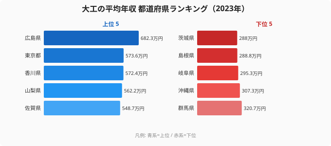

「腕のいい大工は稼げる」とよく言われます。では、その年収がいちばん高いのはどこの県でしょうか——多くの人は東京や大阪のような大都市を思い浮かべるはずです。ところが2023年のデータは、その直感を裏切ります。

賃金構造基本統計調査をもとにした都道府県別の大工の平均年収で、1位は**[広島県](/areas/34000)の682.3万円**でした。2位の東京都(573.6万円)を100万円以上引き離しています。さらに3位は香川県、4位は山梨県、5位は佐賀県と、上位には地方の県がずらりと並びます。最下位の[茨城県](/areas/08000)(288.0万円)とは**2.37倍**もの開きがあります。

なぜ「都会のほうが稼げる」が大工には当てはまらないのでしょうか。この記事では、データに即してその構造を読み解きます。

> [!NOTE]
> ここでいう「大工の平均年収」は、賃金構造基本統計調査(厚生労働省)の職種別データから「きまって支給する現金給与額×12＋年間賞与」で推計した値です。サンプル数が限られる職種のため、年や県によってデータが得られないケースがあります。2023年は47都道府県のうち**40都道府県**で値が得られており、本記事のランキングはその40県を対象としています。

## 大工の年収トップ5と最下位5

2023年の都道府県別・大工の平均年収について、上位5県と下位5県を1枚にまとめたのが次のチャートです(左が上位、右が下位)。

最大の特徴は、トップに大都市が並んでいないことです。1位の広島県は2位の東京都を108.7万円も上回り、3位香川県(572.4万円)・4位山梨県(562.2万円)・5位佐賀県(548.7万円)と続く上位グループは、いずれも人口規模では中位以下の県でした。大都市圏でトップ5に入ったのは東京都(2位)だけで、大阪府は15位(458.4万円)、愛知県は24位(417.0万円)にとどまっています。

ここで注目したいのは、上位5県のうち東京以外の4県(広島・香川・山梨・佐賀)が、いずれも「全国的な知名度のわりに大工の絶対数が多くない県」である点です。住宅やインフラの補修需要は全国どこにでも一定量があるため、職人の供給が薄い地域ほど、一人あたりの仕事量と単価が押し上げられやすくなります。広島が東京を約19%上回るという結果は、こうした「需要は残るが担い手が薄い」という地方の構図と整合的に読めます。逆に、大都市圏で唯一上位に残った東京は、全国から大型工事の発注が集中する特殊な市場であり、上位の例外として扱うのが妥当でしょう。

<source-link href="/ranking/carpenter-annual-income">大工の平均年収ランキングをもっと見る</source-link>

> [!TIP]
> 上位に地方の県が並ぶ背景には、「需要に対して職人が少ない地域ほど単価が上がりやすい」という建設業特有の事情があります。この記事の後半で、その構造をさらに掘り下げます。

## 最下位グループに見える共通点

下位5県は、最下位の茨城県(288.0万円)を筆頭に、島根県(288.8万円)・岐阜県(295.3万円)・沖縄県(307.3万円)・群馬県(320.7万円)が並びます(上のチャート右側が下位)。

最下位の茨城県(288.0万円)は、トップの広島県(682.3万円)の約42%にすぎません。隣の群馬県(320.7万円)や、東海の岐阜県(295.3万円)も下位に沈んでいます。

ここで注意したいのは、下位グループが必ずしも「地方=低い」という単純な図式ではない点です。同じ地方でも香川県(3位)・佐賀県(5位)・富山県(6位)は上位に入っており、島根県(39位)・沖縄県(37位)とは大きく差がついています。つまり「都会か地方か」よりも、**県ごとの需給バランスや工事単価のほうが効いている**可能性が高いといえます。茨城・群馬・岐阜のように、東京や名古屋といった大都市圏に隣接する県が下位に来ている点も示唆的です。大都市の周縁では職人が都市部の現場へ流動しやすく、地元単価が抑えられやすいという見方ができますが、これはデータだけからは断定できないため後述します。

> [!WARNING]
> 賃金構造基本統計調査の職種別データはサンプル数の影響を受けやすく、年ごとの変動が大きい職種です。2023年は神奈川県・青森県・秋田県・石川県・徳島県・愛媛県・宮崎県の7県で値が得られておらず、この7県は本ランキングに含まれていません。単年の順位は「その年の傾向」として読み、複数年で確認するのが安全です。下位だからといって「その県では大工が稼げない」と一般化しないよう注意してください。

## なぜ大都市より地方が上位なのか

大工の年収で大都市が必ずしも上位に来ない——この一見意外な結果には、いくつかの構造的な説明が考えられます。

**1. 職人の希少性と需給バランス**

地方では高齢化や担い手不足で大工そのものが減っています。一方で住宅の新築・改修やインフラ補修の需要は残るため、限られた職人に仕事が集中し、単価が上がりやすくなります。広島県(682.3万円)・香川県(572.4万円)・佐賀県(548.7万円)が上位に来るのは、こうした「人手が薄い地域ほど稼げる」構図と整合的です。

**2. 大都市は「雇われ」が多く、賃金が頭打ちになりやすい[仮説]**

[仮説] 東京・大阪・愛知のような大都市では、大手ゼネコンや工務店に雇用される大工の比率が高く、組織内の賃金体系に収まりやすいと考えられます。一方、地方では独立した一人親方や小規模事業者の比率が高く、繁忙期の単価上昇が年収に反映されやすい——という見方ができます。ただし本データには雇用形態の内訳が含まれないため、これは検証が必要な仮説です(就業構造基本調査などとの突合で確認できます)。

> [!NOTE]
> 1位の広島県は682.3万円で、2位の東京都(573.6万円)を約19%上回っています。3位香川県(572.4万円)は東京とほぼ並んでおり、上位では「大都市=高年収」という関係が崩れていることがわかります。年収の絶対額だけでなく、後述の生活コストも合わせて見ると、地方上位の意味がより鮮明になります。

**3. 大都市は生活コストも高い**

仮に大都市の大工年収が地方並みでも、家賃や物価が高い分、可処分所得では見劣りします。「東京のほうが稼げる」という直感は、こうした名目額と実質額の混同から生まれている面もあります。広島(682.3万円)のように地方で名目年収まで高い県は、生活コストの低さと合わせると実質的な余裕がさらに大きくなる、という読み方もできるでしょう。

<source-link href="/ranking/carpenter-annual-income">都道府県別の大工年収を地図・グラフで比較する</source-link>

## まとめ

2023年の大工の平均年収(40都道府県)から見えたポイントは次のとおりです。

- **1位は広島県(682.3万円)で大都市ではありません**。2位の東京都(573.6万円)を100万円以上引き離しました。
- **トップ5は広島・東京・香川(572.4万円)・山梨(562.2万円)・佐賀(548.7万円)**で、東京以外は地方の県が占めます。
- **最下位は茨城県(288.0万円)**で、1位広島県との差は**2.37倍**でした。
- 大阪府(15位・458.4万円)・愛知県(24位・417.0万円)など大都市圏は中位に沈み、「都会ほど稼げる」は当てはまりません。
- 上位・下位ともに地方の県が混在しており、勝敗を分けるのは「都会か地方か」より**県ごとの需給と工事単価**だと考えられます。

大工の年収は、建設業全体の人手不足や地域ごとの工事量と密接につながっています。電気工事士や左官など、他の[建設関連の職種別ランキング](/category/construction)と合わせて見ると、地域による稼ぎやすさの違いがより立体的に見えてきます。

## データ出典

本記事のデータは、厚生労働省「賃金構造基本統計調査」の職種別データ(2023年)をもとに、e-Stat 経由で整備した値を使用しています。大工の平均年収は「きまって支給する現金給与額×12＋年間賞与」で推計しており、サンプル数の制約により値が得られない都道府県があります。
