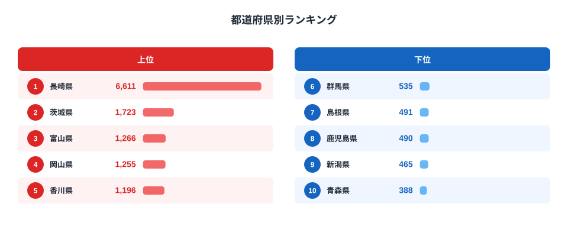

「カステラと言えば長崎」というイメージは、単なる観光地のブランディングではありません。総務省「家計調査」の品目別データを見ると、長崎県の1世帯あたり年間カステラ消費支出額は6,611円で、全国47都道府県平均965.6円の実に6.9倍に達しています。2位の茨城県（1,723円）とも約3.8倍の開きがあり、「2位以下の横並び」に「長崎だけが突き抜ける」という一極集中型の分布になっているのです。

この記事では、2024年の最新データをもとに、なぜ長崎だけがここまで飛び抜けているのか、そしてカステラという菓子がどのようにして「一つの県の名物」として定着したのかを、地理・歴史・食文化の観点から掘り下げます。

## 上位と下位の格差

まず全体像を数字で押さえます。1位長崎県6,611円に対し、最下位47位の青森県はわずか388円。その開きは17.0倍にのぼります。同じ「ご当地菓子」でも、消費量が特定の県に集中する品目とそうでない品目がありますが、カステラは家計調査の菓子類の中でもかなり偏りが大きい部類に入ります。

[カステラ消費支出額ランキングをもっと見る](/ranking/castella-consumption-expenditure)

上位を見ると、2位茨城県（1,723円）、3位富山県（1,266円）、4位岡山県（1,255円）、5位香川県（1,196円）と続きますが、いずれも長崎の3分の1にも届きません。茨城県が2位に入る理由の一つに、水戸市を含む県庁所在地の消費傾向として洋菓子全般への支出が比較的高いことが挙げられますが、長崎のような「一つの菓子への集中」とは性格が異なります。3位以下の県には、カステラ以外にも饅頭や羊羹など複数の郷土菓子が並立しており、支出が特定の品目に偏りにくい構造があると考えられます。

> [!NOTE]
> このデータは総務省「家計調査」の品目別支出額で、都道府県庁所在市（政令指定都市含む）の二人以上世帯が対象です。県内全域の消費実態ではなく、県庁所在市の世帯調査である点に注意してください。長崎市内の消費が県全体の数値を強く牽引している可能性があります。

長崎県内には「福砂屋」「文明堂」「松翁軒」といった創業100年を超える老舗カステラ店が今も本店を構えており、贈答用・慶事用に加えて日常のお茶菓子としても定着しています。観光客向けの土産需要だけでなく、地元住民自身が普段からカステラを購入する習慣があることが、県庁所在市の世帯調査である家計調査の数値にも色濃く反映されていると考えられます。

## 最下位グループの特徴

下位5県（群馬県535円、島根県491円、鹿児島県490円、新潟県465円、青森県388円）に共通するのは、地理的に長崎から遠いことに加え、それぞれの地域に別の主力菓子が存在することです。青森県はりんご菓子、新潟県は米菓（せんべい）、鹿児島県は「かるかん」など、地域ごとに異なる郷土菓子の消費が家計の菓子支出を分け合っています。

興味深いのは、鹿児島県が下位に沈んでいる点です。鹿児島は長崎と同じ九州で、かつ江戸時代に南蛮貿易・海外交易の窓口として栄えた歴史を持ちますが、カステラの支出額では45位にとどまっています。地理的な近さや歴史的な共通点があっても、菓子文化として定着するかどうかは別の要因（藩政期の献上文化や贈答習慣の継承など）に左右されることがうかがえます。鹿児島には「かるかん」「あくまき」といった独自の郷土菓子が江戸期から根付いており、洋菓子由来のカステラが入り込む余地が相対的に小さかった可能性があります。

## 発見: 「南蛮貿易由来」でも定着度に大きな差

カステラは16世紀にポルトガル人によって長崎に伝えられた南蛮菓子です。江戸時代の鎖国下でも長崎・出島はオランダとの交易窓口として開かれ続け、そこで卵と小麦粉と砂糖という当時の貴重な材料をふんだんに使う洋菓子が独自の発展を遂げました。出島を通じた交易の窓口として栄えた長崎では、カステラが贈答品・慶事の菓子として日常生活に深く根付き、老舗が数百年にわたり地元の消費を支えてきました。単に発祥地というだけでなく、贈答文化・観光土産としての需要が積み重なり、家計調査の数字にも反映されていると考えられます。

[仮説] 2位茨城県の水準の高さは、県庁所在地（水戸市）における洋菓子全般への支出傾向の高さが影響している可能性があります。検証には家計調査の他の洋菓子品目（ケーキ・チョコレート菓子など）との相関を見る必要があり、本記事のデータだけでは断定できません。

> [!TIP]
> カステラだけでなく、同じ家計調査の品目別データで[チョコレート菓子の支出額ランキング](/ranking/chocolate-consumption-expenditure)や[羊羹の消費支出額ランキング](/ranking/yokan-consumption-expenditure)、[まんじゅうの消費支出額ランキング](/ranking/manju-consumption-expenditure)と比較すると、「発祥地に支出が集中する菓子」と「全国に広く定着した菓子」の違いが見えてきます。長崎県の他の指標は[長崎県の地域プロフィール](/areas/42000)でも確認できます。

## まとめ

- 1位は長崎県6,611円で、全国平均965.6円の6.9倍
- 最下位は青森県388円で、1位との差は17.0倍
- 2位茨城県（1,723円）以下は僅差の横並びで、長崎だけが突出する一極集中型の分布
- 下位県はそれぞれ別の郷土菓子（米菓・りんご菓子等）に消費が分散している
- 同じ九州の鹿児島県は45位と低く、地理的近さと消費定着度は必ずしも一致しない

> [!WARNING]
> 家計調査は調査世帯数が限られるサンプル調査のため、支出額の少ない品目（カステラ含む）は年によって振れ幅が大きくなることがあります。単年の数値だけでなく、複数年の推移とあわせて解釈することをおすすめします。

## データ出典

総務省統計局「家計調査」（品目別支出額、都道府県庁所在市）2024年調査より作成。e-Stat経由でデータを取得・整備しています。
