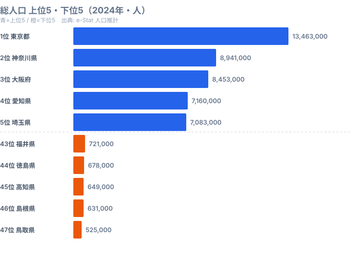

「Claude Code が便利らしい」「e-Stat で日本の公的統計が取れるらしい」——この 2 つを掛け算すると、47 都道府県の経済・人口・社会データを **自然言語で叩いて即可視化** できるようになります。本記事はその第一歩、**環境構築と API キー取得だけ** に集中した連載 Part 1 です。

連載全体では、Claude Code を使った e-Stat データ分析の実例を 20 本に渡って紹介します。Part 1 のゴールは、お手元のターミナルから `claude` コマンドを叩き、Claude Code に「e-Stat の API キーは取った。動作確認のリクエストを投げて」と頼んで、JSON が返ってくるまでです。所要時間は 30 分。この記事を終えれば Part 2 以降の実装パートに、地に足のついた状態で進めます。


## なぜ Claude Code × e-Stat なのか

e-Stat（[政府統計の総合窓口](https://www.e-stat.go.jp/)）は、総務省統計局が運営する日本の公的統計のハブです。国勢調査・人口推計・家計調査・経済センサス・賃金構造基本統計調査など、**3 万を超える統計表が無料で API 経由で取得** できます。学術研究・行政資料・ジャーナリズム・SaaS のダッシュボード——使い道は無限にあります。

ところが、e-Stat API を直接叩こうとすると最初の壁が高いです。統計表 ID（`statsDataId`）の探し方、カテゴリコード（`cdCat01` 等）のメタ情報照会、ページネーション、レスポンス JSON の入れ子構造——全部覚えないとデータに辿り着けません。**ドキュメントを読み始めて 30 分後にはタブが 20 個開いている**、そんな API です。

ここに Claude Code が刺さります。Claude Code は Anthropic 公式の CLI 型 AI コーディングエージェントで、「e-Stat の人口推計の最新年データを取って CSV にして」と日本語で頼めば、メタ情報の検索 → API 呼び出し → JSON パース → CSV 出力までを **コードを書いて実行までしてくれる** のが特徴です。手書きスクリプトなら API ドキュメント 200 ページを読み、統計表 ID をブラウザで探し、`getMetaInfo` を別途叩き、エラー時はスタックトレースを自分で読む必要があります。Claude Code なら「2020 年の国勢調査の世帯数」と言えば統計表 ID の特定もメタ情報照会も自動でやり、エラーが出てもそのまま見せれば直してくれます。試行錯誤の 1 サイクルが 5〜10 分から 30 秒へ縮むのが、この組み合わせの本質的な価値です。

もちろん Claude Code は万能ではありません。**頻出する処理はスキル化（手順書化）してコードに落とす** のがベストプラクティスです。連載後半でその話もします。Part 1 では「まず動かす」ところまでに集中します。

> [!NOTE]
> 本連載が前提とする e-Stat API は REST 版（`api.e-stat.go.jp/rest/3.0/`）です。同じ e-Stat でも「データベース」「ファイル」「グラフ」など UI 機能とは別系統で、ここで取得するのは構造化された統計値の生データになります。CSV ダウンロード UI とは取れる粒度が違う点に注意してください。


## Step 1: Claude Code のインストール

Claude Code は Node.js 製の CLI です。Node.js 18 以上が入っていれば、npm 1 行でインストールできます。

### macOS / Linux

```bash
# Node.js が入っていなければ Homebrew で
brew install node

# Claude Code 本体
npm install -g @anthropic-ai/claude-code

# バージョン確認
claude --version
```

`brew install node` で Node.js 20 系（LTS）が入ります。`nvm` 派の人は `nvm install --lts && nvm use --lts` でも同じです。

### Windows

Windows は WSL2（Ubuntu）経由で入れるのが事故が少ないです。PowerShell に直に入れることもできますが、後で git や bash 連携で詰まる人が多いので WSL を推奨します。

```bash
# WSL Ubuntu の中で
sudo apt update && sudo apt install -y nodejs npm
npm install -g @anthropic-ai/claude-code
claude --version
```

### 初回ログイン

インストール後、ターミナルで `claude` と打つと初回はブラウザが開き、Anthropic アカウントでログインを求められます。

```bash
claude
```

ログインすると料金プランの選択画面に進みます。本連載では **Pro プラン（月額 $20）** を前提とします。Pro プランなら Claude Sonnet を一定量まで追加料金なしで使えるので、e-Stat の試行錯誤には十分です。本格的に長文コードベースを扱うなら Max プラン（$100/月）も視野に入ります。

> [!TIP]
> Claude Code には対話モードと非対話モード（`claude -p "プロンプト"`）があります。普段は対話モードで十分です。CI/CD に組み込んで定期実行したいときだけ非対話モードを使うと覚えておくと、最初は対話モードに集中できます。

ここまで終わったら、適当な作業ディレクトリ（例: `~/estat-playground`）を作って `cd` で移動し、再び `claude` を起動しておいてください。

```bash
mkdir -p ~/estat-playground && cd ~/estat-playground
claude
```


## Step 2: e-Stat API の appId を取得

e-Stat API は **無料・無申請** で誰でも使えます。必要なのはメール認証のユーザー登録だけです。手順は以下の通りです。

1. [e-Stat API 機能 利用ガイド](https://www.e-stat.go.jp/api/) にアクセスします
2. 右上「ログイン」→「新規ユーザ登録」へ進みます
3. メールアドレス・パスワード・利用目的（「個人での学習」等）を入力します
4. 確認メールのリンクをクリックして本登録を完了します
5. マイページの「アプリケーション ID 発行」から **appId** を取得します

appId は 40 文字程度の英数字文字列です。これが API リクエストの認証鍵になります。

### 利用範囲と制限

e-Stat API の利用条件は、2026 年 5 月時点では以下の通りです。料金は無料で、商用利用も出典明示を前提に可能です。リクエスト数は明文化されていないものの、運用上の目安として概ね 100,000 回 / 日とされています。短時間に大量リクエストを送ると一時的に 503 が返るレート制限があり、データ利用は公的統計の二次利用ガイドラインに準拠（出典明示が必要）します。普通の分析・サイト掲載・社内資料用途であれば、まず引っかかることはありません。**stats47.jp も同じ API で 47 都道府県 × 300 ランキング超を毎日更新** しています。

> [!WARNING]
> 公的統計の二次利用は「出典明示」が原則です。記事やダッシュボードに掲載する際は「出典: 政府統計の総合窓口（e-Stat）国勢調査」のように出典を明示しましょう。無料・無申請だからといって出典を省くと規約違反になります。詳細は [政府統計の総合窓口（e-Stat）利用規約](https://www.e-stat.go.jp/terms-of-use) を確認してください。


## Step 3: .env ファイルに appId を保存

取得した appId を、コード内にベタ書きするのは NG です。Git にコミットしてしまうと公開リポジトリ経由で漏洩します。**`.env` ファイルに格納し、`.gitignore` で Git 管理対象から外す** のが鉄則です。

### .env と .gitignore の作成

```bash
# 作業ディレクトリの直下で
echo 'ESTAT_APP_ID=ここに取得したappIdを貼り付け' > .env
echo '.env' >> .gitignore
```

`.gitignore` には `.env` を必ず先に追加しておきます。順序を逆にすると 1 度ステージングされた `.env` が、後から無視されないままになります。

### dotenv の導入（Node.js の場合）

`.env` の値を読み込むには [dotenv](https://www.npmjs.com/package/dotenv) が定番です。

```bash
npm init -y
npm install dotenv axios
```

`package.json` に `"type": "module"` を追加しておくと、後で ES modules が使えて便利です。

### Python の場合

Python 派の人は `python-dotenv` を使います。

```bash
python -m venv .venv
source .venv/bin/activate   # Windows は .venv\Scripts\activate
pip install python-dotenv requests
```

### .env 動作確認

簡単に読めるかだけ確認しておきます。

```javascript
// check-env.mjs
import "dotenv/config";
console.log("appId 先頭 8 文字:", process.env.ESTAT_APP_ID?.slice(0, 8));
```

```bash
node check-env.mjs
# => appId 先頭 8 文字: abc12345
```

`undefined` と出たら `.env` のパスかキー名を見直してください。


## Step 4: 動作確認 — 最初のリクエストを Claude Code に頼む

ここからが本番です。Claude Code に **「e-Stat に最初のリクエストを投げて」** と日本語で頼んでみます。

### 自然言語プロンプト例

`claude` を起動した状態で、以下のように頼みます。

```text
.env の ESTAT_APP_ID を使って、e-Stat API の動作確認をしたい。
統計表 ID は 0003448237（人口推計 2020 年・都道府県別）を使い、
レスポンスの先頭 5 件だけ整形して console.log で表示する
Node.js スクリプト test-estat.mjs を作って、最後に実行して。
```

Claude Code はこの依頼を受けて、概ね以下のようなコードを書いて実行します。

```javascript
// test-estat.mjs（Claude Code が生成）
import "dotenv/config";
import axios from "axios";

const APP_ID = process.env.ESTAT_APP_ID;
const STATS_DATA_ID = "0003448237";
const ENDPOINT = "https://api.e-stat.go.jp/rest/3.0/app/json/getStatsData";

const { data } = await axios.get(ENDPOINT, {
  params: {
    appId: APP_ID,
    statsDataId: STATS_DATA_ID,
    limit: 5,
  },
});

const values = data.GET_STATS_DATA?.STATISTICAL_DATA?.DATA_INF?.VALUE ?? [];
console.log("取得件数:", values.length);
console.log(JSON.stringify(values, null, 2));
```

### 期待されるレスポンス JSON

うまく行くと、ターミナルにこんな出力が出ます（抜粋）。

```json
{
  "取得件数": 5,
  "values": [
    { "@tab": "00", "@cat01": "0", "@area": "00000", "@time": "2020000000", "@unit": "人", "$": "126146000" },
    { "@tab": "00", "@cat01": "0", "@area": "01000", "@time": "2020000000", "@unit": "人", "$": "5224614" },
    { "@tab": "00", "@cat01": "0", "@area": "02000", "@time": "2020000000", "@unit": "人", "$": "1237984" },
    { "@tab": "00", "@cat01": "0", "@area": "03000", "@time": "2020000000", "@unit": "人", "$": "1210534" },
    { "@tab": "00", "@cat01": "0", "@area": "04000", "@time": "2020000000", "@unit": "人", "$": "2301996" }
  ]
}
```

`@area` が `01000`〜`47000` の **5 桁地域コード**、`$` フィールドが実測値です。`@time` は年度コード（`2020000000` は 2020 年）になります。先頭の `00000` は全国合計です。

ここまで動けば **Part 1 のゴール達成** です。Claude Code 経由で e-Stat の生 JSON が手元に届いたことになります。

### Python 派向けのスクリプト例

参考までに、同じことを Python でやるとこうなります。

```python
# test_estat.py
import os
import json
import requests
from dotenv import load_dotenv

load_dotenv()
APP_ID = os.environ["ESTAT_APP_ID"]
ENDPOINT = "https://api.e-stat.go.jp/rest/3.0/app/json/getStatsData"

resp = requests.get(
    ENDPOINT,
    params={"appId": APP_ID, "statsDataId": "0003448237", "limit": 5},
    timeout=10,
)
data = resp.json()
values = data["GET_STATS_DATA"]["STATISTICAL_DATA"]["DATA_INF"]["VALUE"]
print(json.dumps(values, indent=2, ensure_ascii=False))
```

Claude Code に「Python 版にして」と頼めば、JS 版から自動で書き直してくれます。


## 取得したデータがどう化けるか — 人口で見る完成形

Step 4 で手に入れた生 JSON は、ただの数字の羅列です。これを Claude Code に「47 都道府県分を取って棒グラフにして」と頼むと、最終的に stats47.jp のランキングのような形に化けます。連載のゴールイメージとして、同じ人口推計データから作った「総人口 上位5・下位5（2024年）」を先に見ておきましょう。



上位は東京都が 13,463,000 人で突き抜けており、神奈川県 8,941,000 人・大阪府 8,453,000 人・愛知県 7,160,000 人・埼玉県 7,083,000 人と、首都圏と関西・中京の三大都市圏がそのまま並びます。なぜ上位がこの顔ぶれになるかというと、人口推計は住民票ベースの居住人口を集計するため、雇用と進学で人が流入し続ける大都市圏が機械的に上に来るからです。とくに東京都の 1,346 万人は 2 位の神奈川県の約 1.5 倍で、首都一極集中がこのデータからもはっきり読み取れます。一方で下位は鳥取県 525,000 人を最下位に、島根県 631,000 人・高知県 649,000 人・徳島県 678,000 人・福井県 721,000 人と、日本海側と四国の県が並びます。下位がこうなるのは、地形的に可住地が限られ、若年層が進学・就職のたびに都市圏へ流出して人口の自然減・社会減が重なるためです。東京都と鳥取県を比べると、同じ「都道府県」という単位でも人口規模が桁違いに開いていることが分かります。Part 1 ではこの完成形を目標として頭に入れておき、Step 4 で取得した生 JSON が最終的にここまで整形されるという全体像をつかんでください。全 47 都道府県の順位は [総人口ランキング](/ranking/japanese-population) で確認できます。実際の整形手順は Part 3「人口で棒グラフを作る」で扱います。

<source-link href="/ranking/japanese-population">総人口ランキングをもっと見る</source-link>

> [!TIP]
> 人口推計のような「全国合計を含む」統計表では、`@area` が `00000`（全国）の行を必ず除外してから 47 都道府県でランキング化してください。除外を忘れると全国合計が「1 位」として混ざり、グラフが破綻します。Claude Code に「全国合計（00000）は除いて」と一言添えると安全です。


## つまずきポイント Top 5

ここまでスムーズに動いたあなたは幸運です。実際は以下 5 つのどこかで必ず引っかかります。**先回りで覚えておくと事故が半分になります**。

### 1. 認証エラー — appId が空 / 改行混入

```json
{"GET_STATS_DATA":{"RESULT":{"STATUS":"403","ERROR_MSG":"APIキーが不正です。"}}}
```

`.env` に貼り付けた appId の末尾に **改行や半角スペースが混入** しているケースが最多です。`echo 'ESTAT_APP_ID=...'` で書くとシェルが余計な文字を入れることもあります。`cat -A .env` で `$` 以外の制御文字が見えないか確認してください。

### 2. JSON 構造の罠 — 入れ子が深すぎる

e-Stat の JSON は **5 段ネスト** が当たり前です。

```text
GET_STATS_DATA > STATISTICAL_DATA > DATA_INF > VALUE > [配列]
```

しかも `VALUE` は **1 件しかないとオブジェクト、複数あると配列** という、JSON あるあるの罠付きです。Claude Code に「VALUE を必ず配列として扱って」と一言添えると安全になります。

### 3. cdTimeFrom の地雷 — キャッシュ分断

e-Stat API には `cdTimeFrom` `cdTimeTo`（年度範囲指定）パラメータがありますが、**これを使うと R2/CDN キャッシュが指定値ごとに分断** されます。stats47 のローカル規約では「全年度取得 → メモリで年度フィルタ」を原則にしています。

詳細は **Part 5 のキャッシュ設計編** で解説します。Part 1 では「`cdTimeFrom` は安易に使うな」とだけ覚えておけば十分です。

### 4. 地域コードは 5 桁 — 2 桁ではない

`01`（北海道）と書いたら 0 件返ってきた——あるあるです。**e-Stat の都道府県コードは `01000`〜`47000` の 5 桁** が正です。2 桁 + 3 桁ゼロパディングと覚えてください。市区町村まで降りるときは下 3 桁が市区町村コードになります。具体的には、全国が `00000`、北海道が `01000`、東京都が `13000`、東京都新宿区が `13104`、沖縄県が `47000` という対応です。

### 5. レート制限 — 同時並列は 5 本まで

公式アナウンスはないものの、**同時 10 本以上のリクエスト** で 503 が返ってくることがあります。並列処理するときは `p-limit` などで concurrency=5 を上限にしておくと安全です。Claude Code に「同時 5 並列で 47 都道府県を回して」と頼めば対応してくれます。


## 次回予告

Part 2 では、Claude Code の **「スキル化」** を扱います。今回手書きした `test-estat.mjs` のような単発スクリプトは便利ですが、毎回 Claude Code に同じ依頼を繰り返すのは非効率です。

Part 2 で作る `/search-estat` スキルを使うと、たとえば「賃金構造基本統計調査の最新年・職種別年収を取って」と頼むだけで、

1. e-Stat の `getStatsList` を叩いて統計表 ID を検索します
2. `getMetaInfo` でメタ情報を取得します
3. 適切な `cdCat01` を推論します
4. `getStatsData` で値を取得します
5. CSV / JSON / Markdown 表に整形します

を **1 コマンド** でやってくれるようになります。Claude Code × e-Stat が真価を発揮するのはここからです。

本連載と同じ「Claude Code で 47 都道府県を分析する」テーマは、公務員向けの視点でも [Claude Code で47都道府県分析を自動化｜公務員のための AI × 統計 7 ステップ](https://stats47.jp/blog/ai-claude-code-pref-analysis) でまとめています。本記事が「エンジニア向けの環境構築の徹底解説」なのに対し、そちらは「現場で使う 7 ステップ」という住み分けなので、合わせて読むと全体像がつかめます。Claude Code で取得した結果をどう見せるかは、[情報通信業（ICT）カテゴリのランキング一覧](https://stats47.jp/category/ict) を眺めて完成イメージの参考にしてください。


## データ出典

- 政府統計の総合窓口（e-Stat）人口推計（総務省統計局）
- 本記事のランキング図は e-Stat 経由で整備した 2024 年の都道府県別総人口（stats47.jp）
- e-Stat API 機能 利用ガイド（[https://www.e-stat.go.jp/api/](https://www.e-stat.go.jp/api/)）
