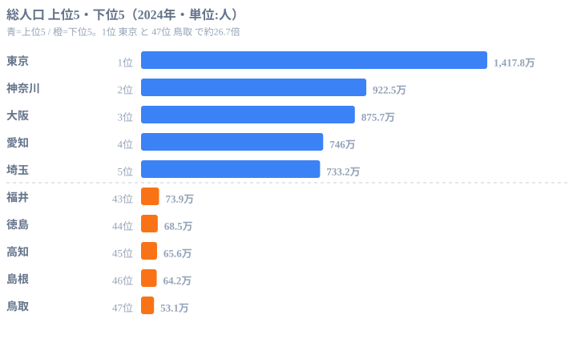

前回（Part 1）で Claude Code と e-Stat API の初期セットアップを終えました。`appId` を取得し、`curl` で軽く叩いてレスポンスが返ってくることまで確認できたはずです。

ここまで来て最初にぶつかる壁が **「目的の統計表 ID（statsDataId）が見つからない」** という問題です。e-Stat には 8,000 を超える統計表が登録されており、UI で探すには分類体系が大きすぎます。API の `getStatsList` を毎回叩くスクリプトを書くのも面倒です。

本記事では、この **「統計表 ID 探し」を Claude Code のスキル機能で自動化** する手順を解説します。一度 `SKILL.md` を書いてしまえば、以降は `/search-estat 人口` のような自然な指示で Claude が候補を絞り込んでくれる状態になります。

筆者は元県庁職員で、現在は[stats47.jp](https://stats47.jp/)（47 都道府県の統計サイト）を 1 人で運営しています。サイトには 530 を超えるランキングがありますが、その全てを支えているのが本記事で紹介する「スキル化」の発想です。実例集の Part 2 として、Claude Code 未経験のソフトウェアエンジニア向けに、再利用可能な手順書としてのスキルを書く流れを共有します。


## e-Stat の統計表 ID 探しはなぜ難しいか

e-Stat（政府統計の総合窓口）は、国勢調査・住民基本台帳・経済センサスなど、府省庁が公表する統計を一元的に集約したポータルです。データはほぼ全てが API 経由でも取得できるため、エンジニアにとっては最高クラスのオープンデータ供給源と言えます。

ただし「最高クラス」と「使いやすい」は別問題です。具体的なつらみは次の 3 つです。

1. **統計表が 8,000 件超**: 同じ「人口」というキーワードでも、国勢調査・住民基本台帳・推計人口・将来推計人口とソースが複数あります
2. **公式 UI の検索が階層型**: 分野 → 統計調査 → 統計表 → 表番号、と 4 段階のドリルダウンが必要です。1 統計表に辿り着くまでに 10 クリックかかることもあります
3. **statsDataId の命名規則が不透明**: `0003448237` のような数字 ID なので、人間が見ても何のデータか判別できません

API 側で用意されているのが `getStatsList` というエンドポイントです。キーワード検索もできますが、生のレスポンス JSON は数千行になることもあり、目視で「これだ」と決めるには疲れます。

```bash
curl "https://api.e-stat.go.jp/rest/3.0/app/json/getStatsList?appId=$ESTAT_APP_ID&searchWord=人口&limit=5"
```

このレスポンスをそのまま読むのではなく、**「AI に要約させて候補リストにする」** のがスキル化の出発点です。

> [!NOTE]
> e-Stat の「統計表 ID（statsDataId）」と「政府統計コード（statsCode）」は別物です。statsDataId は表 1 枚ごとに振られる 10 桁の ID、statsCode は調査単位（国勢調査・人口推計など）に振られる 8 桁のコードです。`/search-estat` が返すのは前者で、データ取得時にそのまま `getStatsData` に渡せます。後者は絞り込みの軸として使います。混同すると「ID を渡したのに 0 件」というハマりに繋がるので、最初に押さえておくと安全です。


## Claude Code のスキル機能とは

Claude Code には **「スキル（Skill）」** という機能があります。ざっくり言うと、**プロジェクト固有の手順書を Markdown ファイルで書いておき、slash command として呼び出せる仕組み** です。

特徴は次の 3 つにまとめられます。

- **ファイルベース**: `.claude/skills/<name>/SKILL.md` に書きます。バイナリ依存なし、Git で管理できます
- **slash command**: `/<skill-name>` で呼び出せます。Claude Code セッション内で自然に使えます
- **引数フリー**: プロンプトは自然言語のまま渡せます。`/search-estat 人口の年次推移` のような書き方ができます

スキルの実体は SKILL.md という Markdown ファイルです。冒頭に YAML frontmatter で `name` と `description` を書き、本文に手順を書きます。それだけです。

Claude Code は session 開始時に `.claude/skills/` 配下を走査し、見つかった SKILL.md を「呼び出し可能なツール」として認識します。利用者が `/search-estat` と打つと、その SKILL.md の本文が Claude のシステムプロンプトに合流し、本文に従って動作する流れになります。

> [!TIP]
> スキル機能は Claude Code 公式の機能です（2025 年後半に正式リリース）。Anthropic のドキュメント上は "Skills" と表記されています。プロジェクト個別のスキルは `.claude/skills/` に、グローバル（ユーザー全体）で使うものは `~/.claude/skills/` に置くのが基本構成です。両方に同名スキルがある場合はプロジェクト側が優先されるので、共通スキルをグローバルに、案件固有の上書きをプロジェクト側に置くと運用しやすくなります。


## SKILL.md の書き方｜テンプレート

最小構成の SKILL.md はこんな形になります。

```markdown
---
name: search-estat
description: e-Stat API の getStatsList を呼び出し、キーワードに一致する統計表の候補を要約して返す。
---

# /search-estat

ユーザーから渡されたキーワードを `searchWord` として e-Stat API に投げ、上位 5 件の統計表を「statsDataId・統計表名・公表機関・調査年」の表形式で返却する。

## 手順

1. ユーザーのプロンプトからキーワードを抽出する（例: 「人口の年次推移」→ `人口`）
2. 環境変数 `ESTAT_APP_ID` を確認する。未設定ならエラーとして停止する
3. `getStatsList` を `searchWord=<キーワード>&limit=5` で呼び出す
4. レスポンス JSON の `LIST_INF` 配列から各表の `@id` / `TITLE` / `GOV_ORG` / `SURVEY_DATE` を抽出する
5. Markdown 表として整形し、最後に「次のアクション例: `/fetch-estat-data <id>` で取得」と添える

## エラー処理

- API がエラーステータスを返した場合は `RESULT.STATUS` と `RESULT.ERROR_MSG` をそのまま提示する
- 該当 0 件の場合は別のキーワード候補を 3 つ提案する（同義語・上位概念・関連分野）
```

YAML frontmatter の `description` は、Claude が「いつこのスキルを呼ぶべきか」を判断する材料になります。**動詞を含めて、利用シーンが想像できる文章にする** のが鉄則です。「e-Stat に関する何か」のような曖昧な記述だと呼び出し精度が落ちます。

本文側は普通の Markdown で構いません。装飾やコードブロックも自由に書けます。手順を箇条書きで明文化しておくと、Claude が手順スキップを起こしにくくなります。


## /search-estat スキルを書く 5 ステップ

実際に手を動かして `/search-estat` を作る流れを 5 ステップで追います。

### Step 1: スキル用ディレクトリを切る

プロジェクトルートで以下を実行します。

```bash
mkdir -p .claude/skills/search-estat
touch .claude/skills/search-estat/SKILL.md
```

Claude Code は `.claude/skills/<name>/SKILL.md` という配置を期待します。`<name>` がそのまま slash command 名になるので、ハイフン区切りで分かりやすい名前を付けます。今回は `search-estat` としました。

### Step 2: frontmatter を書く

エディタで SKILL.md を開き、まず frontmatter から書きます。

```markdown
---
name: search-estat
description: e-Stat API の getStatsList を呼び出し、キーワードに一致する統計表 ID 候補を要約して返す。データ取得前の調査ステップで使う。
---
```

`description` は 1〜2 文で具体的に書きます。「データ取得前の調査ステップで使う」のように利用シーンを添えると、Claude が自動でスキルを選んでくれるシーンが増えます。

### Step 3: 検索フローを設計する

スキル本文に書く手順を整理します。今回のフローは次の 5 アクションです。

1. プロンプトからキーワード抽出
2. `ESTAT_APP_ID` の存在確認
3. `getStatsList` 呼び出し（`searchWord`, `limit=5`）
4. レスポンスから必要フィールド抽出
5. Markdown 表に整形して返却

この各ステップを SKILL.md の `## 手順` セクションに書いていきます。

### Step 4: 利用する API パラメータを明文化する

スキル内でどの API パラメータを使うかを書いておくと、後から読み返したときに分かりやすくなります。`getStatsList` の主要パラメータは次のとおりです。

- `appId`（必須・string）: e-Stat が発行する API キー
- `searchWord`（任意・string）: 検索キーワード。スペース区切りで AND 検索になります
- `statsCode`（任意・string）: 政府統計コード（8 桁）。府省庁単位で絞り込む際に使います
- `surveyYears`（任意・string）: 調査年。`YYYY` または `YYYYMM-YYYYMM` のレンジ指定です
- `openYears`（任意・string）: 公開年。新しいデータだけ欲しいときに有効です
- `limit`（任意・int）: 返却件数上限。デフォルトは大きいので、検索用途なら 5〜20 程度に絞ります
- `startPosition`（任意・int）: ページネーション用の開始位置。1 起点です

レスポンス側で抽出するフィールドも整理しておきます。

- `GET_STATS_LIST.DATALIST_INF.LIST_INF[].@id`: statsDataId（10 桁の数字 ID）
- `GET_STATS_LIST.DATALIST_INF.LIST_INF[].TITLE.$`: 統計表名
- `GET_STATS_LIST.DATALIST_INF.LIST_INF[].GOV_ORG.$`: 公表機関名（例: 総務省統計局）
- `GET_STATS_LIST.DATALIST_INF.LIST_INF[].SURVEY_DATE`: 調査年（YYYY または YYYYMM）
- `GET_STATS_LIST.DATALIST_INF.LIST_INF[].STATISTICS_NAME`: 統計調査名（例: 国勢調査）

### Step 5: 完成版 SKILL.md を書く

ここまでの設計をまとめると、最終的な SKILL.md は次のようになります。

```markdown
---
name: search-estat
description: e-Stat API の getStatsList を呼び出し、キーワードに一致する統計表 ID 候補を要約して返す。データ取得前の調査ステップで使う。
---

# /search-estat

## 目的

ユーザーが指定したキーワードに対して、e-Stat の統計表 ID（statsDataId）を上位 5 件まで提案する。データ取得スキル（/fetch-estat-data）の前段として使う。

## 前提

- 環境変数 `ESTAT_APP_ID` に有効な API キーが設定されていること
- Node.js 18 以上（fetch 標準搭載）または Python 3.9 以上

## 手順

1. ユーザーのプロンプトからキーワードを抽出する。複数語ある場合はスペース区切りで連結（例: 「県民所得 最新」→ `searchWord=県民所得 最新`）
2. `ESTAT_APP_ID` を `process.env` から取得。未設定なら以下を出力して終了:
   - `Error: ESTAT_APP_ID が未設定です。https://www.e-stat.go.jp/api/ で取得し、.env に追記してください。`
3. 以下の Node.js コードを実行する:

   const url = new URL("https://api.e-stat.go.jp/rest/3.0/app/json/getStatsList");
   url.searchParams.set("appId", process.env.ESTAT_APP_ID);
   url.searchParams.set("searchWord", keyword);
   url.searchParams.set("limit", "5");
   const res = await fetch(url);
   const json = await res.json();

4. `json.GET_STATS_LIST.RESULT.STATUS` を確認し、0 以外ならエラーメッセージ（`ERROR_MSG`）をユーザーに提示して停止
5. `json.GET_STATS_LIST.DATALIST_INF.LIST_INF` を最大 5 件まで取り出し、statsDataId・統計表名・公表機関・調査年を Markdown 表にまとめる
6. 表の末尾に次のフォローアップを追加: `次のアクション例: /fetch-estat-data <statsDataId> で実データを取得できます。`

## エラー処理

- ネットワークエラー時はリトライせず、エラー内容をそのまま出力する
- 検索結果が 0 件の場合は、同義語・上位概念・関連分野のキーワード候補を 3 つ提案する（例: 「賃金」が 0 件なら「給与」「所得」「報酬」）
- API のレートリミット（HTTP 429）に当たった場合は 60 秒待機を提案し、自動リトライは行わない
```

これで `/search-estat` の準備は完了です。Claude Code セッションを再起動するか、スキル一覧を更新すれば呼び出せるようになります。


## getStatsList のレスポンス構造

スキル本文に書いた `LIST_INF` の構造を、もう少し具体的に確認しておきます。`getStatsList?searchWord=人口&limit=2` を叩いた場合、概ね次のような JSON が返ります。

```json
{
  "GET_STATS_LIST": {
    "RESULT": {
      "STATUS": 0,
      "ERROR_MSG": "正常に終了しました。",
      "DATE": "2026-05-19T10:00:00.000+09:00"
    },
    "DATALIST_INF": {
      "NUMBER": 2,
      "LIST_INF": [
        {
          "@id": "0003448237",
          "STAT_NAME": { "@code": "00200524", "$": "人口推計" },
          "GOV_ORG": { "@code": "00200", "$": "総務省" },
          "STATISTICS_NAME": "人口推計 都道府県、年齢階級別人口",
          "TITLE": { "@no": "01", "$": "都道府県、年齢階級別人口" },
          "SURVEY_DATE": "202410",
          "OPEN_DATE": "2025-04-15"
        },
        {
          "@id": "0003410379",
          "STAT_NAME": { "@code": "00200521", "$": "国勢調査" },
          "GOV_ORG": { "@code": "00200", "$": "総務省" },
          "STATISTICS_NAME": "令和2年国勢調査",
          "TITLE": { "@no": "1-1", "$": "男女別人口・世帯数及び世帯人員" },
          "SURVEY_DATE": "202010",
          "OPEN_DATE": "2021-11-30"
        }
      ]
    }
  }
}
```

特徴的なのは、テキスト値が `{ "@code": "...", "$": "..." }` のような構造で返ってくる点です。これは XML 由来の名残で、`$` が値本体、`@xxx` が属性に相当します。慣れないとアクセスパスを間違えやすいので、要約スクリプトを書くときは慎重に進めます。

Python で同じ呼び出しをする場合は次のようになります。

```python
import os
import requests

APP_ID = os.environ["ESTAT_APP_ID"]
url = "https://api.e-stat.go.jp/rest/3.0/app/json/getStatsList"
params = {"appId": APP_ID, "searchWord": "人口", "limit": 5}
res = requests.get(url, params=params, timeout=30)
data = res.json()

list_inf = data["GET_STATS_LIST"]["DATALIST_INF"]["LIST_INF"]
for item in list_inf:
    print(f"{item['@id']} | {item['STATISTICS_NAME']} | {item['GOV_ORG']['$']}")
```

このスニペットは SKILL.md の手順 3 に Python 版として併記しておくと、Python 派の開発者でも同じスキルを再利用できます。

> [!WARNING]
> `SURVEY_DATE` は `202410` のような 6 桁、あるいは `2024100000` のような長いコードで返ることがあります。先頭 4 桁を「年」として正規化せずにそのまま保存すると、年フィルタが効かなくなったり、年セレクタにコードが丸見えになったりします。要約段階で 4 桁年（`2024`）に整えておくと、後段の取得スキルでハマりにくくなります。e-Stat の「年」表現は一様ではない、と覚えておくのが安全です。


## /search-estat の出口で出会う、人口データの中身

`/search-estat 人口` を実行すると、候補の先頭に「人口推計」や「国勢調査」が並びます。では、その先で取れる人口データは実際どんな分布になっているのでしょうか。`/search-estat` の出口イメージを掴むために、stats47 に取り込んだ都道府県別の総人口（2024 年）を見てみます。



上位 5 は東京 1,417.8 万人、神奈川 922.5 万人、大阪 875.7 万人、愛知 746.0 万人、埼玉 733.2 万人です。首都圏（東京・神奈川・埼玉）と二大都市圏（大阪・愛知）で上位が固まっているのが分かります。これは産業と雇用の集積が人を引き寄せ、そこに住宅・交通インフラが集中し、さらに人を呼ぶという都市集積の構造を素直に反映しています。下位 5 は福井 73.9 万人、徳島 68.5 万人、高知 65.6 万人、島根 64.2 万人、鳥取 53.1 万人で、いずれも大都市圏から離れた地方県です。最上位の東京と最下位の鳥取では、同じ「1 都道府県」という単位でありながら総人口に約 26.7 倍の開きがあります。この一覧だけでも「人口」というキーワードが指すデータがどれだけ県差を抱えているかが伝わるはずで、それを 10 秒で候補化してくれるのが `/search-estat` の価値です。検索スキルは単に ID を返すだけでなく、「次にどの分布と向き合うことになるか」を先に見せてくれる入り口でもあります。

<source-link href="/ranking/total-population">都道府県別 総人口ランキングをもっと見る</source-link>

> [!NOTE]
> 上のグラフは「総人口」（日本人＋外国人を含む常住人口）で、e-Stat では人口推計や国勢調査として公表されています。`/search-estat 人口` が返す候補のうち、住民基本台帳人口（日本人のみ・1 月 1 日基準）や将来推計人口（推計値）は定義も基準日も異なります。同じ「人口」でも数字が一致しないのは当然なので、候補リストでは統計表名と公表機関を必ず突き合わせて選びます。


## 実行例｜「人口」で検索してみる

実際に Claude Code 上で `/search-estat` を呼び出すと、こんな対話になります。

```
あなた: /search-estat 人口

Claude: getStatsList を searchWord=人口, limit=5 で実行します。

  statsDataId  統計表名                              公表機関   調査年
  0003448237   人口推計 都道府県、年齢階級別人口      総務省     2024-10
  0003410379   国勢調査 男女別人口・世帯数及び世帯人員  総務省     2020-10
  0003448239   人口推計 年齢（5歳階級）、男女別人口    総務省     2024-10
  0004021907   住民基本台帳人口・世帯数、人口動態      総務省     2024-01
  0003337392   将来推計人口（都道府県・市区町村別）    国立社人研  2018

次のアクション例: /fetch-estat-data 0003448237 で実データを取得できます。
```

5 件並べてみると、それぞれが微妙に違うデータセットだと一目で分かります。直近の都道府県別が欲しいなら `0003448237`、5 年に 1 度の悉皆調査なら `0003410379`、将来推計が欲しいなら `0003337392` といった具合です。**「人間が選ぶ判断材料」だけを AI に整形してもらう** という分業が綺麗にできています。

仮にこれを毎回手で `curl` していたら、JSON を読むのに 5 分、表に整形するのに 5 分かかります。スキル化すれば 10 秒で同じアウトプットが得られます。


## スキル化の効果｜なぜ毎回 prompt を書かないのか

「同じことを長いプロンプトで毎回頼めばいいのでは？」という疑問はもっともです。それでも筆者がスキル化に手間をかける理由は次の 3 つです。

1. **プロンプトの揺れがなくなる**: 自然言語で毎回頼むと、「上位 5 件で」を書き忘れて 20 件返ってきたり、表でなく箇条書きになったりします。SKILL.md に手順を固定すると出力が安定します
2. **チームで共有できる**: SKILL.md は Git にコミットすればチーム全員が同じスキルを使えます。「あの分析、誰々さんのプロンプトじゃないと再現できない」問題が消えます
3. **改善が積み上がる**: 「該当 0 件のときは同義語を 3 つ提案する」のような細かい工夫を SKILL.md に書き加えていけます。プロンプトをコピペし続ける運用だと、こうした学びが個人の中に閉じてしまいます

特に 3 つ目が大きいです。stats47.jp では現在 60 以上のスキルを運用していますが、それぞれが「過去のミスを踏まないためのチェックリスト」になっています。例えば `/search-estat` であれば「statsCode を指定すれば府省庁単位で絞れる」「surveyYears で古い表を除外できる」といった改善を、SKILL.md に追記していくだけで全員が恩恵を受けられます。


## つまずきポイント 3 選

最後に、初めて SKILL.md を書く人が踏みやすい地雷を 3 つだけ挙げます。

### 1. slash command が認識されない

SKILL.md を作ったのに `/search-estat` がサジェストに出てこない場合、9 割は次のどれかが原因です。

- ディレクトリ名と frontmatter の `name` が不一致（`search-estat` と `search_estat` の混在など）です
- SKILL.md が `.claude/skills/search-estat/` 直下ではなくサブディレクトリに入っています
- Claude Code セッションを再起動していません（スキル一覧は session 起動時にスキャンされます）

ディレクトリ構造を `ls .claude/skills/search-estat/` で確認し、`SKILL.md` がトップにあることを確認してください。

### 2. `ESTAT_APP_ID` が未設定でエラー

スキル本文に「環境変数を確認する」と書いてあっても、Claude が確認をスキップして API を叩き、401 が返るケースがあります。対策は次の 2 つです。

- `.env` ファイルに `ESTAT_APP_ID=xxxx` を書いておき、shell 側で `source .env` します
- SKILL.md 冒頭に **太字で** 「実行前に必ず `echo $ESTAT_APP_ID` で値を確認する」と明記します

文章を太字や警告ブロックで強調すると、Claude のスキップ率が体感で半減します。

### 3. 件数が多すぎてレスポンスが切れる

`limit` を指定せず叩くと、`getStatsList` は非常に多くの件数を返してきます。Claude のコンテキスト窓を圧迫してその先の処理が破綻するので、**スキル本文に必ず `limit=5` を書き込む** のが安全です。多めに見たいときだけ `limit=20` などに上書きする運用にします。

仮に検索結果が多すぎて目的の表が下位に埋もれる場合は、`statsCode`（府省庁コード）か `surveyYears`（年）で絞り込みを掛けます。SKILL.md に「結果が広すぎる場合は statsCode を聞き返す」のような分岐を書いておくと、対話がさらに賢くなります。


## 次回予告｜取得した ID で人口データを棒グラフ化する

ここまでで「目的の statsDataId を Claude に探させる」が完了しました。次回 Part 3 では、**取得した ID を使って `getStatsData` を呼び、47 都道府県の人口データを D3.js で棒グラフに変換する** ところまでをやります。

- `/fetch-estat-data` スキルの設計
- レスポンス JSON から都道府県別配列を作る整形ロジック
- D3.js での横棒グラフ実装（SVG 出力）
- 棒グラフを記事に貼るための画像化（puppeteer / sharp）

Claude Code を「データの検索」だけでなく「可視化までの一気通貫」に育てていく流れを共有します。シリーズの全体像は[元県庁職員が Claude Code で 47 都道府県分析を自動化した手順](https://stats47.jp/blog/ai-claude-code-pref-analysis)、前段のセットアップは[Claude Code × e-Stat API 環境構築](https://stats47.jp/blog/cc-estat-01-setup)、可視化に踏み込む続編は[Claude Code で人口データを棒グラフ化する](https://stats47.jp/blog/cc-estat-03-population-bar)にまとめてあります。こうした AI × 統計の活用例は[情報通信（ICT）カテゴリ](https://stats47.jp/category/ict)からも辿れます。引き続きお付き合いください。


## データ出典

- 総人口（都道府県別・2024 年）: 総務省「人口推計」（e-Stat 政府統計の総合窓口経由で整備）
- API 仕様: e-Stat API（政府統計の総合窓口）`getStatsList` / `getStatsData`（バージョン 3.0）
- 数値は stats47 が e-Stat から取得・整備した値（単位: 人）
