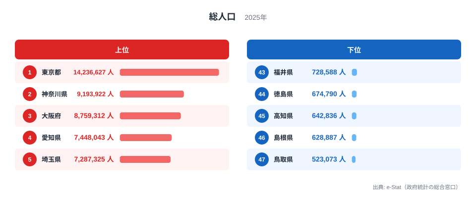

前回（Part 1）で Claude Code と e-Stat API の初期セットアップを終えました。`appId` を取得し、`curl` で軽く叩いてレスポンスが返ってくることまで確認できたはずです。

ここまで来て最初にぶつかる壁が 「**目的の統計表 ID（statsDataId）が見つからない**」という問題です。e-Stat に登録されている統計表は、2026 年 10 月 7 日の時点で 20 万件を超えています（件数の数え方は次の節に書きました）。分野から辿る導線だけでは、目的の表に着くまでに手間がかかります。API の `getStatsList` を毎回叩くスクリプトを書くのも面倒です。

本記事では、この **「統計表 ID 探し」を Claude Code のスキル機能で自動化** する手順を解説します。一度 `SKILL.md` を書いてしまえば、以降は `/search-estat 人口` のような自然な指示で Claude が候補を絞り込んでくれる状態になります。

筆者は元県庁職員で、現在は[stats47.jp](https://stats47.jp/)（47 都道府県の統計サイト）を 1 人で運営しています。サイトには 2,400 を超えるランキングページがあり（2026 年 10 月 7 日にサイトマップの `/ranking/` の URL を数えた件数です）、その制作を支えているのが本記事で紹介する「スキル化」の発想です。実例集の Part 2 として、Claude Code 未経験のソフトウェアエンジニア向けに、再利用可能な手順書としてのスキルを書く流れを共有します。


## e-Stat の統計表 ID 探しはなぜ難しいか

e-Stat（政府統計の総合窓口）は、国勢調査・住民基本台帳・経済センサスなど、府省庁が公表する統計を一元的に集約したポータルです。データはほぼ全てが API 経由でも取得できるため、エンジニアにとっては最高クラスのオープンデータ供給源と言えます。

ただし「最高クラス」と「使いやすい」は別問題です。具体的なつらみは次の 3 つです。

1. **統計表の数が桁違いに多い**: `getStatsList` に検索語を付けず `limit=1` で呼ぶと、該当件数の `NUMBER` は 2026 年 10 月 7 日 16 時 23 分（JST）の時点で 238,712 件でした。件数は日々動きます。しかも同じ「人口」というキーワードでも、人口推計・国勢調査・住民基本台帳人口移動報告・人口動態調査のように調査が複数あります
2. **分野から辿る導線が階層型**: 分野から統計調査、統計表へと段階を踏んで絞り込むため、目的の表に着くまでにクリックの回数がかさみます
3. **statsDataId の命名規則が不透明**: `0003448237` のような数字 ID なので、人間が見ても何のデータか判別できません

件数は、次のコマンドで返ってくる JSON の `GET_STATS_LIST.DATALIST_INF.NUMBER` で確かめられます。

```bash
curl -G "https://api.e-stat.go.jp/rest/3.0/app/json/getStatsList" \
  --data-urlencode "appId=$ESTAT_APP_ID" \
  --data-urlencode "limit=1"
```

API 側で用意されているのが `getStatsList` というエンドポイントです。キーワード検索もできますが、生のレスポンス JSON は数千行になることもあり、目視で「これだ」と決めるには疲れます。

```bash
curl "https://api.e-stat.go.jp/rest/3.0/app/json/getStatsList?appId=$ESTAT_APP_ID&searchWord=人口&limit=5"
```

このレスポンスをそのまま読むのではなく、「**AI に要約させて候補リストにする**」のがスキル化の出発点です。

> [!NOTE]
> e-Stat の「統計表 ID（statsDataId）」と「政府統計コード（statsCode）」は別物です。statsDataId は表 1 枚ごとに振られる 10 桁の ID です。statsCode は絞り込みに使うコードで、5 桁なら府省庁（総務省は `00200`）、8 桁なら調査（人口推計は `00200524`）を指します。`/search-estat` が返すのは前者で、データ取得時にそのまま `getStatsData` に渡せます。混同すると「ID を渡したのに 0 件」というハマりに繋がるので、最初に押さえておくと安全です。


## Claude Code のスキル機能とは

Claude Code には 「**スキル**（Skill）」という機能があります。ざっくり言うと、**プロジェクト固有の手順書を Markdown ファイルで書いておき、slash command として呼び出せる仕組み** です。

特徴は次の 3 つにまとめられます。

- **ファイルベース**: `.claude/skills/<name>/SKILL.md` に書きます。バイナリ依存なし、Git で管理できます
- **slash command**: `/<skill-name>` で呼び出せます。Claude Code セッション内で自然に使えます
- **引数フリー**: プロンプトは自然言語のまま渡せます。`/search-estat 人口の年次推移` のような書き方ができます

スキルの実体は SKILL.md という Markdown ファイルです。冒頭に YAML frontmatter で `name` と `description` を書き、本文に手順を書きます。それだけです。

Claude Code は `.claude/skills/` 配下のファイルを監視していて、見つかった SKILL.md を呼び出せるスキルとして認識します。利用者が `/search-estat` と打つか、Claude が必要だと判断して呼び出すと、SKILL.md の本文が会話の中の 1 つのメッセージとして入り、以降のターンでも残ります。Claude はその本文に従って動作します。

スキルは置き場所で使える範囲が変わります。個人用は `~/.claude/skills/<skill-name>/SKILL.md` に置くと、この PC のすべてのプロジェクトで使えます。プロジェクト用は `.claude/skills/<skill-name>/SKILL.md` に置くと、そのリポジトリのセッションで使え、コミットすればチームにも渡ります。

同名のスキルが複数の場所にあるときの優先順位は、公式ドキュメントでは「Enterprise over personal, and personal over project」、つまりエンタープライズ、個人、プロジェクトの順です。たとえば `~/.claude/skills/` とプロジェクトの `.claude/skills/` の両方に `deploy` があると、`/deploy` で動くのは個人用のほうです。プロジェクト側に同名で置いても、個人用スキルは上書きできません。案件固有の版を作りたいときは、同名にせず `search-estat-myproject` のように別名で置きます。（出典: Claude Code 公式ドキュメント https://code.claude.com/docs/en/skills、2026 年 10 月 7 日に確認）


## SKILL.md の書き方｜テンプレート

最小構成の SKILL.md はこんな形になります。

```markdown
---
name: search-estat
description: e-Stat API の getStatsList を呼び出し、キーワードに一致する統計表の候補を要約して返す。
---

# /search-estat

ユーザーから渡されたキーワードを `searchWord` として e-Stat API に投げ、上位 5 件の統計表を「statsDataId・統計名・統計表名・公表機関・調査年」の表形式で返却する。

## 手順

1. ユーザーのプロンプトからキーワードを抽出する（例: 「人口の年次推移」→ `人口`）
2. 環境変数 `ESTAT_APP_ID` を確認する。未設定ならエラーとして停止する
3. `getStatsList` を `searchWord=<キーワード>&limit=5` で呼び出す
4. `RESULT.STATUS` を確認する。`0` なら続行、`1` は「該当なし」（`TABLE_INF` が無い）としてエラー処理の 0 件の手順へ、それ以外はエラーとして停止する
5. `TABLE_INF` を配列に揃えて（1 件のときは配列でなくオブジェクトで返る）、各表の `@id` / `STAT_NAME` / `TITLE` / `GOV_ORG` / `SURVEY_DATE` を抽出する
6. Markdown 表として整形し、最後に「次のアクション例: `/fetch-estat-data <id>` で取得」と添える

## エラー処理

- `STATUS` が 0 でも 1 でもない場合は、`RESULT.STATUS` と `RESULT.ERROR_MSG` をそのまま提示して停止する
- `STATUS` が 1（該当 0 件）の場合は、別のキーワード候補を 3 つ提案する（同義語・上位概念・関連分野）
```

YAML frontmatter の `description` は、Claude が「いつこのスキルを呼ぶべきか」を判断する材料になります。**動詞を含めて、利用シーンが想像できる文章にする** のが鉄則です。「e-Stat に関する何か」のような曖昧な記述だと呼び出し精度が落ちます。

本文側は普通の Markdown で構いません。装飾やコードブロックも自由に書けます。手順を箇条書きで明文化しておくと、Claude が手順スキップを起こしにくくなります。


## /search-estat スキルを書く 5 ステップ

実際に手を動かして `/search-estat` を作る流れを 5 ステップで追います。

### Step 1: スキル用ディレクトリを切る

プロジェクトルートで以下を実行します。

```bash
mkdir -p .claude/skills/search-estat
touch .claude/skills/search-estat/SKILL.md
```

Claude Code は `.claude/skills/<name>/SKILL.md` という配置を期待します。`<name>` がそのまま slash command 名になるので、ハイフン区切りで分かりやすい名前を付けます。今回は `search-estat` としました。

### Step 2: frontmatter を書く

エディタで SKILL.md を開き、まず frontmatter から書きます。

```markdown
---
name: search-estat
description: e-Stat API の getStatsList を呼び出し、キーワードに一致する統計表 ID 候補を要約して返す。データ取得前の調査ステップで使う。
---
```

`description` は 1〜2 文で具体的に書きます。「データ取得前の調査ステップで使う」のように利用シーンを添えると、Claude が自動でスキルを選んでくれるシーンが増えます。

### Step 3: 検索フローを設計する

スキル本文に書く手順を整理します。今回のフローは次の 6 アクションです。

1. プロンプトからキーワード抽出
2. `ESTAT_APP_ID` の存在確認
3. `getStatsList` 呼び出し（`searchWord`, `limit=5`）
4. `STATUS` の確認（`0` は続行、`1` は該当なし、それ以外はエラー）
5. レスポンスから必要フィールド抽出
6. Markdown 表に整形して返却

この各ステップを SKILL.md の `## 手順` セクションに書いていきます。4 番目を入れておかないと、該当なしの検索がエラー扱いで止まってしまいます。理由は次の「getStatsList のレスポンス構造」の節で確かめます。

### Step 4: 利用する API パラメータを明文化する

スキル内でどの API パラメータを使うかを書いておくと、後から読み返したときに分かりやすくなります。`getStatsList` の主要パラメータは次のとおりです。

- `appId`（必須・string）: e-Stat が発行する API キー
- `searchWord`（任意・string）: 検索キーワード。スペース区切りで AND 検索になります
- `statsCode`（任意・string）: 政府統計コード。5 桁なら府省庁単位（総務省は `00200`）、8 桁なら調査単位（人口推計は `00200524`）で絞り込めます
- `surveyYears`（任意・string）: 調査年。`YYYY` または `YYYYMM-YYYYMM` のレンジ指定です
- `openYears`（任意・string）: 公開年。新しいデータだけ欲しいときに有効です
- `limit`（任意・int）: 返却件数上限。デフォルトは大きいので、検索用途なら 5〜20 程度に絞ります
- `startPosition`（任意・int）: ページネーション用の開始位置。1 起点です

レスポンス側で抽出するフィールドも整理しておきます。

- `GET_STATS_LIST.RESULT.STATUS`: 処理結果の状態。`0` は正常終了、`1` は正常に終了したものの該当データがなかった場合です。ほかの値はエラーとして扱います
- `GET_STATS_LIST.RESULT.ERROR_MSG`: STATUS に対応するメッセージ
- `GET_STATS_LIST.DATALIST_INF.NUMBER`: `limit` で切る前の該当件数
- `GET_STATS_LIST.DATALIST_INF.TABLE_INF[].@id`: statsDataId（10 桁の数字 ID）
- `GET_STATS_LIST.DATALIST_INF.TABLE_INF[].STAT_NAME.$`: 統計名（調査名。例: 人口推計）
- `GET_STATS_LIST.DATALIST_INF.TABLE_INF[].TITLE.$`: 統計表名
- `GET_STATS_LIST.DATALIST_INF.TABLE_INF[].GOV_ORG.$`: 公表機関名（例: 総務省）
- `GET_STATS_LIST.DATALIST_INF.TABLE_INF[].SURVEY_DATE`: 調査年月（`202510` のような YYYYMM、`202001-202012` のような期間、調査年を持たない表では `0`）
- `GET_STATS_LIST.DATALIST_INF.TABLE_INF[].STATISTICS_NAME`: 統計名に集計区分を添えた名称（例: 人口推計 各年10月1日現在人口 令和２年国勢調査基準 統計表）

### Step 5: 完成版 SKILL.md を書く

ここまでの設計をまとめると、最終的な SKILL.md は次のようになります。コードブロックを SKILL.md の中に入れ子で書くため、外側のフェンスは `~~~` にしています。

~~~markdown
---
name: search-estat
description: e-Stat API の getStatsList を呼び出し、キーワードに一致する統計表 ID 候補を要約して返す。データ取得前の調査ステップで使う。
---

# /search-estat

## 目的

ユーザーが指定したキーワードに対して、e-Stat の統計表 ID（statsDataId）を上位 5 件まで提案する。データ取得スキル（/fetch-estat-data）の前段として使う。

## 前提

- 環境変数 `ESTAT_APP_ID` に有効な API キーが設定されていること
- Node.js 18 以上（fetch 標準搭載）または Python 3.9 以上

## 手順

1. ユーザーのプロンプトからキーワードを抽出する。複数語ある場合はスペース区切りで連結（例: 「国勢調査 男女別人口」→ `searchWord=国勢調査 男女別人口`）。統計名や表題に出てこない語（「最新」など）は足さない
2. `ESTAT_APP_ID` を `process.env` から取得。未設定なら以下を出力して終了:
   - `Error: ESTAT_APP_ID が未設定です。https://www.e-stat.go.jp/api/ で取得し、.env に追記してください。`
3. 以下の Node.js コードを `.mjs` ファイル（例: `/tmp/search-estat.mjs`）に保存して `node` で実行する。トップレベル `await` を使うため、拡張子は `.mjs` にする。`keyword` は手順 1 で決めた文字列に置き換える:

   ```js
   const keyword = "人口"; // 手順 1 で決めたキーワードに置き換える
   const url = new URL("https://api.e-stat.go.jp/rest/3.0/app/json/getStatsList");
   url.searchParams.set("appId", process.env.ESTAT_APP_ID);
   url.searchParams.set("searchWord", keyword);
   url.searchParams.set("limit", "5");

   const res = await fetch(url);
   if (!res.ok) {
     console.error(`HTTP ${res.status}`);
     process.exit(1);
   }
   const list = (await res.json()).GET_STATS_LIST;

   // 該当なし（STATUS=1）では TABLE_INF が無く、1 件のときは配列でなくオブジェクトで返る。
   // どちらも配列に揃えてから渡す。
   const raw = list.DATALIST_INF?.TABLE_INF;
   const tables = raw === undefined ? [] : Array.isArray(raw) ? raw : [raw];

   console.log(
     JSON.stringify(
       {
         status: list.RESULT.STATUS,
         message: list.RESULT.ERROR_MSG,
         total: list.DATALIST_INF?.NUMBER ?? 0,
         tables,
       },
       null,
       2,
     ),
   );
   ```

4. 出力の `status` で分岐する:
   - `0`: 手順 5 へ進む
   - `1`: 該当なし（正常終了）。`tables` は空になる。エラー処理の「該当 0 件」に従う
   - それ以外: `message` をユーザーに提示して停止する
5. `tables` の各表から、statsDataId（`@id`）・統計名（`STAT_NAME.$`）・統計表名（`TITLE.$`）・公表機関（`GOV_ORG.$`）・調査年を取り出して Markdown 表にまとめる。調査年は `SURVEY_DATE` を 4 桁年に整える（`202001-202012` は `2020`、開始年と終了年が違う期間は `2020〜2024`、`0` は「なし」）
6. 表の末尾に次のフォローアップを追加: `次のアクション例: /fetch-estat-data <statsDataId> で実データを取得できます。`

## エラー処理

- ネットワークエラー時はリトライせず、エラー内容をそのまま出力する
- `status` が 1（該当 0 件）の場合は、同義語・上位概念・関連分野のキーワード候補を 3 つ提案する（例: 「県民所得 最新」が 0 件なら、「最新」を外した「県民所得」や、上位概念の「県民経済計算」）
- API のレートリミット（HTTP 429）に当たった場合は 60 秒待機を提案し、自動リトライは行わない
~~~

これで `/search-estat` の準備は完了です。`.claude/skills/` がすでにあるセッションなら、SKILL.md を保存した時点で同じセッションの中から呼び出せます。Claude Code がファイルの変更を監視していて、再起動は要りません。ただし Step 1 の `mkdir` で `.claude/skills/` をセッションの開始後に初めて作った場合は、Claude Code がそのディレクトリをまだ監視していないので、`/reload-skills` を一度実行します（出典: Claude Code 公式ドキュメント https://code.claude.com/docs/en/skills、2026 年 10 月 7 日に確認）。


## getStatsList のレスポンス構造

スキル本文に書いた `TABLE_INF` の構造を、もう少し具体的に確認しておきます。`getStatsList?searchWord=人口&limit=2` を 2026 年 10 月 7 日に叩くと、次のような JSON が返りました（主なフィールドだけを抜粋しています）。

```json
{
  "GET_STATS_LIST": {
    "RESULT": {
      "STATUS": 0,
      "ERROR_MSG": "正常に終了しました。",
      "DATE": "2026-10-07T16:10:39.639+09:00"
    },
    "DATALIST_INF": {
      "NUMBER": 26947,
      "RESULT_INF": { "FROM_NUMBER": 1, "TO_NUMBER": 2, "NEXT_KEY": 3 },
      "TABLE_INF": [
        {
          "@id": "0000150041",
          "STAT_NAME": { "@code": "00200524", "$": "人口推計" },
          "GOV_ORG": { "@code": "00200", "$": "総務省" },
          "STATISTICS_NAME": "人口推計 平成5年10月1日現在推計人口",
          "TITLE": { "@no": "003", "$": "人口及び人口増加（２９），男女別（３）人口数－総人口，日本人人口，外国人人口，全国" },
          "SURVEY_DATE": 199310,
          "OPEN_DATE": "2007-10-03"
        },
        {
          "@id": "0000150062",
          "STAT_NAME": { "@code": "00200524", "$": "人口推計" },
          "GOV_ORG": { "@code": "00200", "$": "総務省" },
          "STATISTICS_NAME": "人口推計 平成6年10月1日現在推計人口",
          "TITLE": { "@no": "003", "$": "人口及び人口増加（２９），男女別（３）人口数－総人口，日本人人口，外国人人口，全国" },
          "SURVEY_DATE": 199410,
          "OPEN_DATE": "2007-10-03"
        }
      ]
    }
  }
}
```

`NUMBER` は `limit` で切る前の該当件数で、この日の「人口」は 26,947 件でした。`limit=2` で返ってくるのは `TABLE_INF` の 2 件だけで、続きは `NEXT_KEY` を `startPosition` に渡して取ります。

返り方は件数によって変わります。ここが SKILL.md の分岐に効いてくる部分です。

- **複数件のとき**: 上の JSON のように、`TABLE_INF` が配列で返ります
- **該当が 1 件だけのとき**: `TABLE_INF` は配列ではなく、1 つのオブジェクトで返ります（`limit=1` で確認しました）
- **該当がないとき**: HTTP は 200 のまま、`STATUS` が 1、`ERROR_MSG` が「正常に終了しましたが、該当データはありませんでした。」、`DATALIST_INF.NUMBER` が 0 で返り、`TABLE_INF` は丸ごとありません。2026 年 10 月 7 日に `searchWord=県民所得 最新` と、存在しない語で確認しました。「最新」のように統計名や表題に出てこない語を足すと、この状態になることがあります

`STATUS` が 0 以外でも、エラーとは限りません。`STATUS` が 0 以外なら止まる、とだけ書いた SKILL.md では、該当なしのときに「別のキーワードを提案する」処理へ進めません。`STATUS` が 0 なら続行、1 なら 0 件の処理、それ以外はエラーとして停止、と分けて書きます。`TABLE_INF` は配列に揃えてから回します。

特徴的なのは、テキスト値が `{ "@code": "...", "$": "..." }` のような構造で返ってくる点です。これは XML 由来の名残で、`$` が値本体、`@xxx` が属性に相当します。慣れないとアクセスパスを間違えやすいので、要約スクリプトを書くときは慎重に進めます。

Python で同じ呼び出しをする場合は次のようになります。

```python
import os
import requests

APP_ID = os.environ["ESTAT_APP_ID"]
url = "https://api.e-stat.go.jp/rest/3.0/app/json/getStatsList"
params = {"appId": APP_ID, "searchWord": "人口", "limit": 5}
res = requests.get(url, params=params, timeout=30)
res.raise_for_status()
stats_list = res.json()["GET_STATS_LIST"]

status = stats_list["RESULT"]["STATUS"]
if status not in (0, 1):
    raise SystemExit(f"e-Stat API エラー: STATUS={status} {stats_list['RESULT']['ERROR_MSG']}")

# 該当なし（STATUS=1）では TABLE_INF が無く、1 件のときは配列でなくオブジェクトで返る。
# 0 件・1 件・複数件のどれでも回せるように、配列に揃える。
table_inf = stats_list.get("DATALIST_INF", {}).get("TABLE_INF", [])
if isinstance(table_inf, dict):
    table_inf = [table_inf]

if not table_inf:
    print("該当する統計表がありませんでした。別のキーワードで試してください。")
for item in table_inf:
    print(f"{item['@id']} | {item['STATISTICS_NAME']} | {item['GOV_ORG']['$']}")
```

このスニペットは SKILL.md の手順 3 に Python 版として併記しておくと、Python 派の開発者でも同じスキルを再利用できます。

> [!WARNING]
> `SURVEY_DATE` は表によって形が違います。`202510` のような 6 桁の数値、`202001-202012` のような期間を表す文字列、調査年を持たない表の `0` を、この記事を書く間に確認しました。先頭 4 桁を「年」として正規化せずにそのまま保存すると、年フィルタが効かなくなったり、年セレクタにコードが丸見えになったりします。要約段階で 4 桁年（`2025`）に整え、`0` は「調査年なし」として扱っておくと、後段の取得スキルでハマりにくくなります。e-Stat の「年」表現は一様ではない、と覚えておくのが安全です。


## 次回 Part 3 で取り出す、人口データの中身

`/search-estat 人口` で統計表 ID を選んだ先には、どんなデータが待っているのでしょうか。次回 Part 3 で `getStatsData` を使って取り出し、棒グラフにするのは、国勢調査の都道府県別総人口です。ここでは、その中身を先に見ておくために、stats47 に取り込んである都道府県別の総人口（2025 年）の図を置きます。この図は `/search-estat` の出力ではなく、stats47 のランキングデータから作ったものです。Part 3 の冒頭にも同じ 2025 年の総人口の図がありますが、そちらは完成イメージとして置いたもので、この記事では「ID を選んだ先で、どんなデータが取れるか」の見本として使います。



上位 5 は東京都 1,423.7 万人、神奈川県 919.4 万人、大阪府 875.9 万人、愛知県 744.8 万人、埼玉県 728.7 万人です。首都圏の東京都・神奈川県・埼玉県と、関西圏・中京圏の中心にあたる大阪府・愛知県で、上位が固まっています。背景には、産業と雇用の集積が人を引き寄せ、そこに住宅・交通インフラが集中し、さらに人を呼ぶという都市集積の構造がある可能性があります。このランキングだけでは、原因までは確かめられません。下位 5 は福井県 72.9 万人、徳島県 67.5 万人、高知県 64.3 万人、島根県 62.9 万人、鳥取県 52.3 万人で、いずれも大都市圏から離れた地方県です。最上位の東京都と最下位の鳥取県では、同じ「1 都道府県」という単位でありながら総人口に約 27.2 倍の開きがあります。同じ「人口」というキーワードの先に、これだけ県差のあるデータが待っています。ただし、この記事で作る `/search-estat` が返すのは、統計表 ID・統計名・統計表名・公表機関・調査年までです。こうした分布そのものは見せてくれません。ID を選んでデータを取り出し、図にするのが次の工程で、Part 3 の内容になります。

<source-link href="/ranking/total-population">都道府県別 総人口ランキングをもっと見る</source-link>

> [!NOTE]
> 上のグラフは「総人口」で、2025 年の値は令和7年国勢調査の結果です。`/search-estat 人口` が返す候補には、同じ「人口」でも対象や集計の違う表が混ざります。たとえば人口推計の表には「総人口」と「日本人人口」の両方を載せたものがあり、国勢調査の表は 5 年に 1 度の調査、人口推計の表は各年 10 月 1 日現在の推計値です。同じ「人口」でも数字が一致しないのは当然なので、候補リストでは統計表名と公表機関を必ず突き合わせて選びます。


## 実行例｜「人口」で検索してみる

`/search-estat 人口` を呼び出したときの出力の例です。次の 5 件は、実際に `searchWord=人口&limit=5` で返ってくる先頭 5 件ではありません。e-Stat に実在する表から、都道府県別の人口が載っているものを手で選び、SKILL.md が作る表の形に並べました。調査年の列は、`0003410379` と `0004044330` が `SURVEY_DATE` を 4 桁年に整えた値で、ほかの 3 件は e-Stat の統計表のページ（2026 年 10 月 7 日に確認）に表示された対象年を書いています。

```
あなた: /search-estat 人口

Claude:
  statsDataId  統計名  統計表名  公表機関  調査年
  0004050397  国勢調査  男女別人口－全国、都道府県、市区町村  総務省  2025
  0004065881  国勢調査  総人口・総世帯数・男女・年齢・配偶関係 男女別人口－全国、都道府県、市区町村（2000年（平成12年）市区町村含む）  総務省  2025
  0003410379  国勢調査  男女別人口及び人口性比 － 全国，都道府県（大正9年～令和2年）  総務省  2020
  0003448237  人口推計  都道府県，年齢（5歳階級），男女別人口－総人口，日本人人口  総務省  2020〜2024
  0004044330  住民基本台帳人口移動報告  移動前の住所地別転入者数　－都道府県，市区町村（移動者，日本人移動者，外国人移動者）（2025年）  総務省  2025

次のアクション例: /fetch-estat-data 0004050397 で実データを取得できます。
```

5 件並べてみると、それぞれが微妙に違うデータセットだと一目で分かります。令和7年国勢調査の都道府県別人口が欲しいなら国勢調査の `0004050397` か `0004065881`、大正9年から令和2年までの長い推移が欲しいなら国勢調査の `0003410379`、毎年の年齢 5 歳階級別が欲しいなら人口推計の `0003448237`、転入・転出という人口の動きが欲しいなら住民基本台帳人口移動報告の `0004044330` といった具合です。**「人間が選ぶ判断材料」だけを AI に整形してもらう** という分業が綺麗にできています。

国勢調査の 2 つの表は、見た目が似ていても別の表です。e-Stat の統計表のページ（2026 年 10 月 7 日に確認）では、`0004050397` の統計名は「令和７年国勢調査 速報集計 人口速報集計（男女別人口及び世帯総数）」、`0004065881` の統計名は「令和７年国勢調査 集計結果（原数値） 人口等基本集計」で始まる名前で表示され、公開日もそれぞれ 2026 年 5 月 29 日と 2026 年 9 月 29 日で違います。2 つの表の値が一致するかは、筆者は照合していません。使う表は、候補の表題だけでなく、統計表のページの統計名で集計区分を確かめてから選びます。次回 Part 3 では `0004065881` を使います。

2026 年 10 月 7 日に `searchWord=人口&limit=5` のまま検索すると、先頭に並んだのは 1993 年から 2006 年の人口推計の表で、新しい順には並んでいませんでした。だからこそ、要約の表には調査年を必ず入れて人間が選べるようにしておきます。範囲が広すぎるときは `statsCode`（5 桁なら府省庁、8 桁なら調査）や `surveyYears` で絞ります。

仮にこれを毎回手で `curl` していたら、JSON を読んで表に整形する手間が毎回かかります。スキル化すれば、同じアウトプットがその場で得られます。


## スキル化の効果｜なぜ毎回 prompt を書かないのか

「同じことを長いプロンプトで毎回頼めばいいのでは？」という疑問はもっともです。それでも筆者がスキル化に手間をかける理由は次の 3 つです。

1. **プロンプトの揺れがなくなる**: 自然言語で毎回頼むと、「上位 5 件で」を書き忘れて 20 件返ってきたり、表でなく箇条書きになったりします。SKILL.md に手順を固定すると出力が安定します
2. **チームで共有できる**: SKILL.md は Git にコミットすればチーム全員が同じスキルを使えます。「あの分析、誰々さんのプロンプトじゃないと再現できない」問題が消えます
3. **改善が積み上がる**: 「該当 0 件のときは同義語を 3 つ提案する」のような細かい工夫を SKILL.md に書き加えていけます。プロンプトをコピペし続ける運用だと、こうした学びが個人の中に閉じてしまいます

特に 3 つ目が大きいです。stats47.jp では現在 160 を超えるスキルを運用していますが、それぞれが「過去のミスを踏まないためのチェックリスト」になっています。例えば `/search-estat` であれば「statsCode を指定すれば府省庁（5 桁）や調査（8 桁）で絞れる」「surveyYears で古い表を除外できる」といった改善を、SKILL.md に追記していくだけで全員が恩恵を受けられます。


## つまずきポイント 3 選

最後に、初めて SKILL.md を書く人が踏みやすい地雷を 3 つだけ挙げます。

### 1. slash command が認識されない

SKILL.md を作ったのに `/search-estat` がサジェストに出てこない場合、多くは次のどれかが原因です。

- ディレクトリ名と frontmatter の `name` が不一致（`search-estat` と `search_estat` の混在など）です
- SKILL.md が `.claude/skills/search-estat/` 直下ではなくサブディレクトリに入っています
- `.claude/skills/` をセッションの開始後に初めて作ったのに、`/reload-skills` を実行していません（セッションの開始時になかった最上位の skills ディレクトリは、実行するまで監視されません）

ディレクトリ構造を `ls .claude/skills/search-estat/` で確認し、`SKILL.md` がトップにあることを確認してください。すでにある `.claude/skills/` の中の変更は同じセッションで反映されるので、再起動は要りません（出典: Claude Code 公式ドキュメント https://code.claude.com/docs/en/skills、2026 年 10 月 7 日に確認）。

### 2. `ESTAT_APP_ID` が未設定でエラー

スキル本文に「環境変数を確認する」と書いてあっても、Claude が確認をスキップして API を叩き、エラーが返るケースがあります。対策は次の 2 つです。

- `.env` ファイルに `ESTAT_APP_ID=xxxx` を書いておき、shell 側で `source .env` します
- SKILL.md 冒頭に **太字で** 「実行前に必ず `echo $ESTAT_APP_ID` で値を確認する」と明記します

文章を太字で強調したり、確認を手順の先頭に置いたりすると、確認が飛ばされにくくなることを期待できます。ただし、筆者は試行回数を数えて比べたわけではないので、どれだけ減るかは測っていません。

### 3. 件数が多すぎてレスポンスが切れる

`limit` を指定せず叩くと、`getStatsList` は非常に多くの件数を返してきます。Claude のコンテキスト窓を圧迫してその先の処理が破綻するので、**スキル本文に必ず `limit=5` を書き込む** のが安全です。多めに見たいときだけ `limit=20` などに上書きする運用にします。

仮に検索結果が多すぎて目的の表が下位に埋もれる場合は、`statsCode`（5 桁の府省庁コードか、8 桁の調査コード）か `surveyYears`（年）で絞り込みを掛けます。SKILL.md に「結果が広すぎる場合は statsCode を聞き返す」のような分岐を書いておくと、対話がさらに賢くなります。


## 次回予告｜取得した ID で人口データを棒グラフ化する

ここまでで「目的の statsDataId を Claude に探させる」が完了しました。次回 Part 3 では、**取得した ID を使って `getStatsData` を呼び、47 都道府県の人口データを D3.js で棒グラフに変換する** ところまでをやります。

- `/fetch-estat-data` スキルの設計
- レスポンス JSON から都道府県別配列を作る整形ロジック
- D3.js での横棒グラフ実装（SVG 出力）
- 棒グラフを記事に貼るための画像化（puppeteer / sharp）

Claude Code を「データの検索」だけでなく「可視化までの一気通貫」に育てていく流れを共有します。シリーズの全体像は[元県庁職員が Claude Code で 47 都道府県分析を自動化した手順](https://stats47.jp/blog/ai-claude-code-pref-analysis)、前段のセットアップは[Claude Code × e-Stat API 環境構築](https://stats47.jp/blog/cc-estat-01-setup)、可視化に踏み込む続編は[Claude Code で人口データを棒グラフ化する](https://stats47.jp/blog/cc-estat-03-population-bar)にまとめてあります。こうした AI × 統計の活用例は[情報通信（ICT）カテゴリ](https://stats47.jp/category/ict)からも辿れます。引き続きお付き合いください。
