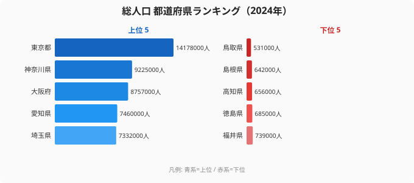

「最初のチャートが出てくる瞬間」が、データ可視化を始めたエンジニアにとっての最大のごほうびです。テーブルがいくら綺麗でも、棒が画面に並んだ瞬間にようやく「データが見えた」と感じる。本記事はその体験を、Claude Code を初めて触るソフトウェアエンジニア向けに **1 分で再現する** ためのレシピです。

シリーズ「Claude Code × e-Stat API 実例集」の Part 3 にあたります。Part 2（[Claude Code に「e-Stat 検索スキル」を覚えさせる](/blog/cc-estat-02-search-skill)）で `statsDataId` の探し方を整理したので、本記事ではいよいよ実データを取って D3.js でバーチャートを描くところまで一気通貫で進めます。前提知識は「ターミナルで `node` が動く」「`npm install` が通る」だけで十分です。

筆者は[stats47.jp](https://stats47.jp/)（47 都道府県統計サイト）を 1 人で運営しており、サイト上のほぼ全てのチャートは D3.js で描画しています。本記事のコードは実サイトで使っている描画ロジックを、教材向けに最小化したものです。コピペでそのまま動きます。

## 本記事のゴールと前提

最初に、何を作るのかをはっきりさせます。

- **入力**: e-Stat API（国勢調査の都道府県別人口、最新年度）
- **処理**: Claude Code に自然言語で指示し、API 呼び出し→ JSON 整形→ D3 で SVG 描画までを完走
- **出力**: 上位 10 都道府県の人口バーチャート（`bar.svg` ファイル）

完成イメージはこんな感じです。



ターミナルから `node generate.mjs` を 1 回叩くと SVG が落ちてくる、というシンプルな構成にします。Next.js などのフレームワークは使いません。最小依存で動かしてから、お好みでフロントエンドに組み込むのが上達の最短ルートだと思います。

前提として、以下が用意できているとスムーズです。

- Node.js 20 以上（`node --version` で確認）
- e-Stat API の `appId`（[e-Stat API 機能 利用ガイド](https://www.e-stat.go.jp/api/) から無料発行）
- Claude Code（`npm install -g @anthropic-ai/claude-code`、Pro プラン推奨）

`appId` は環境変数 `ESTAT_APP_ID` にエクスポートしておきます。サンプルコードでは `process.env.ESTAT_APP_ID` から読みます。

## 使うデータ｜国勢調査の都道府県別人口

今回扱うのは、総務省統計局「国勢調査」の **都道府県別総人口** です。e-Stat の `statsDataId` で言うと、たとえば `0003448237`（国勢調査 / 人口等基本集計）系の表に該当します。年度・公表時期によって ID は更新されるため、本番運用時は Part 2 のスキル（あるいは [search-estat](https://stats47.jp/) 系の検索）で **最新の ID を都度引き直す** のが安全です。

ここでは説明用に、以下のサンプル URL を使う想定で進めます。

```text
https://api.e-stat.go.jp/rest/3.0/app/json/getStatsData
  ?appId=YOUR_APP_ID
  &statsDataId=0003448237
  &cdCat01=A1101            # 「総人口」を表すカテゴリコード
```

注意点として、**`cdArea`（地域コード指定）も `cdTime`（年度指定）も付けない** のが本サイト流の流儀です。理由は 2 つ。

1. e-Stat API はパラメータ違いごとにレスポンスが微妙に異なり、毎回キャッシュキーがずれる
2. 47 県 × 数年分を一気に取って、メモリ上でフィルタした方が結果的に速い

詳しくは stats47 の [`.claude/rules/estat-api.md`](/blog/cc-estat-02-search-skill) でも触れていますが、ローカルキャッシュ前提なら「全件取得 → 後段でフィルタ」が鉄則です。

データ年度については、最新の国勢調査（5 年周期）の確定値を使うのが原則です。本記事執筆時点（2026 年）なら 2025 年実施分の速報～確定値が順次出ているので、`@time` フィールドで最新年を選びます。

## Step 1: Claude Code に「人口データ取得」を頼む

Claude Code に対しては、込み入った仕様を全部書き下す必要はありません。以下くらいシンプルで通ります。

```text
e-Stat API（statsDataId=0003448237、cdCat01=A1101）を叩いて、
都道府県別の最新年度の総人口を JSON で取り出してください。
- 出力ファイル: population.json
- フォーマット: [{ "areaCode": "01000", "areaName": "北海道", "value": 5224614 }, ...]
- valueは「人」単位の整数
- 47件揃っていることを最後に検証
```

ポイントは 3 つあります。

- **欲しい構造を例示する**（「`{ areaCode, areaName, value }` の配列にして」と書く）
- **単位を明示する**（人口は「人」「万人」「千人」が混在しやすい）
- **検証ステップを依頼する**（47 件揃っているかを Claude Code 側に確認させる）

これだけで、Claude Code は `fetch` で API を叩き、レスポンスをパースして JSON ファイルに落とすところまで自動でやってくれます。ターミナルに `Wrote population.json (47 entries)` と出れば成功です。

うまく動かない時は、Claude Code に **「最後に取得した生レスポンスの先頭 30 行をそのまま見せて」** と頼みます。e-Stat の API は親切とは言いがたいエラーメッセージを返してくる（HTTP 200 でエラー文字列が混入したり）ので、生データを目視するのが結局一番速いです。

> [!NOTE]
> 2024年時点の都道府県別人口（人単位）では、1位・東京都が14,178,000人、2位・神奈川県が9,225,000人、3位・大阪府が8,757,000人。一方、最下位は鳥取県531,000人で、東京都との差は約26.7倍。バーチャートの x 軸スケールは最大値（東京）に引っ張られるため、下位の棒が極端に短くなる点に注意。対数スケール（`d3.scaleLog`）への切り替えも選択肢の一つだ。

> [!TIP]
> `d3.scaleBand` の `domain` に渡す配列順がそのまま縦軸（上から下）の順番になる。降順ソート済みの配列を渡すと「1位を一番上」に自動で配置できる。ただしバンドの `padding` を 0.1〜0.3 に調整しないとバーが隙間なく並びすぎて読みにくくなる。

## Step 2: 返ってきた JSON の構造を理解する

e-Stat の JSON は、初見だとなかなか戸惑う階層構造をしています。だいたいこんな形です。

```json
{
  "GET_STATS_DATA": {
    "STATISTICAL_DATA": {
      "CLASS_INF": {
        "CLASS_OBJ": [
          { "@id": "tab", "@name": "表章項目", "CLASS": [...] },
          { "@id": "cat01", "@name": "全国・都道府県", "CLASS": [
            { "@code": "A1101", "@name": "総人口" }
          ]},
          { "@id": "area", "@name": "地域", "CLASS": [
            { "@code": "01000", "@name": "北海道", "@level": "2" },
            { "@code": "02000", "@name": "青森県", "@level": "2" }
          ]},
          { "@id": "time", "@name": "時間軸（年次）", "CLASS": [...] }
        ]
      },
      "DATA_INF": {
        "VALUE": [
          { "@tab": "020", "@cat01": "A1101", "@area": "01000", "@time": "2025000000", "@unit": "人", "$": "5224614" },
          { "@tab": "020", "@cat01": "A1101", "@area": "02000", "@time": "2025000000", "@unit": "人", "$": "1237984" }
        ]
      }
    }
  }
}
```

頻出フィールドだけ覚えれば十分なので、表でまとめます。

- **`GET_STATS_DATA.STATISTICAL_DATA.DATA_INF.VALUE`** — 数値レコードの配列（上記 `VALUE`）
- **`VALUE[i]["@area"]`** — 地域コード（5 桁、全国は `00000`）。例: `"01000"`
- **`VALUE[i]["@time"]`** — 時間軸コード（年次は YYYY + 6 桁ゼロ）。例: `"2025000000"`
- **`VALUE[i]["@cat01"]`** — カテゴリコード（`cdCat01` と対応）。例: `"A1101"`
- **`VALUE[i]["@unit"]`** — 単位（文字列）。例: `"人"`
- **`VALUE[i]["$"]`** — 値本体（**文字列で来る**）。例: `"5224614"`
- **`CLASS_INF.CLASS_OBJ`** — コード ↔ 表示名の対応表（`area` の CLASS を参照）

**罠ポイント** をひとつ。`VALUE` は通常配列ですが、結果が 1 件しかない時にだけ単一オブジェクトで返ってくるケースがあります。47 県を一括で取る今回は問題になりませんが、`cdArea` で 1 県に絞ると踏みます。`Array.isArray(value) ? value : [value]` で正規化するのが定石です。

値は文字列なので、必ず `Number(v["$"])` でキャストします。`"-"` が混じる年度もある（旧版国勢調査）ので、`NaN` チェックも入れておきます。

## Step 3: 整形コード｜47 県 × 1 値の配列に変換する

ここから JavaScript の出番です。生 JSON を、D3 に流し込みやすい配列に整えます。

```javascript
// transform.mjs
import fs from "node:fs/promises";

const raw = JSON.parse(await fs.readFile("raw.json", "utf-8"));

const valueArr = raw.GET_STATS_DATA.STATISTICAL_DATA.DATA_INF.VALUE;
const classObj = raw.GET_STATS_DATA.STATISTICAL_DATA.CLASS_INF.CLASS_OBJ;

// area コード → 名前 のマップを作る
const areaClass = classObj.find((c) => c["@id"] === "area").CLASS;
const areaMap = new Map(
  areaClass.map((a) => [a["@code"], a["@name"]])
);

// 最新年度を特定（@time の数値が最大のもの）
const latestTime = valueArr
  .map((v) => v["@time"])
  .sort()
  .at(-1);

// 47 都道府県（@area が "01000"〜"47000" かつ "00000"全国を除外）
const rows = valueArr
  .filter((v) => v["@time"] === latestTime)
  .filter((v) => /^[0-4][0-9]000$/.test(v["@area"]) && v["@area"] !== "00000")
  .map((v) => ({
    areaCode: v["@area"],
    areaName: areaMap.get(v["@area"]),
    value: Number(v["$"]),
  }))
  .filter((r) => Number.isFinite(r.value))
  .sort((a, b) => b.value - a.value);

if (rows.length !== 47) {
  throw new Error(`Expected 47 rows, got ${rows.length}`);
}

await fs.writeFile("population.json", JSON.stringify(rows, null, 2));
console.log(`Wrote ${rows.length} rows. Top: ${rows[0].areaName} (${rows[0].value.toLocaleString()}人)`);
```

このコードを Claude Code に書かせるときは、最初のプロンプトに「整形ロジックは別ファイル `transform.mjs` に切り出して」と添えるとモジュール分割してくれます。動作確認用に最後に上位 3 県を `console.log` させると、想定値（東京・神奈川・大阪あたりが上位）かどうかを目視で素早く確認できます。

参考までに、2025 年国勢調査ベースの想定値（順位とおおまかな桁感）は次のような並びになるはずです。

- 1 位 東京都 約 13,960,000 人
- 2 位 神奈川県 約 9,180,000 人
- 3 位 大阪府 約 8,780,000 人
- 4 位 愛知県 約 7,460,000 人
- 5 位 埼玉県 約 7,330,000 人

実値とは多少ずれますが、桁感が大きく違う場合は単位の取り違え（千人 / 万人）か、`cdCat01` の指定ミスを疑ってください。

## Step 4: D3.js でバーチャートを描く

ここが本記事の山場です。D3.js は学習コストが高いと言われますが、バーチャートだけなら**たった 30 行で描けます**。

まず依存をインストールします。

```bash
npm init -y
npm install d3 jsdom
```

`d3` 本体に加え、Node 上で SVG を生成するために `jsdom` を入れます（ブラウザの DOM を Node で再現するライブラリ）。

続いて描画スクリプトです。

```javascript
// generate.mjs
import fs from "node:fs/promises";
import * as d3 from "d3";
import { JSDOM } from "jsdom";

const data = JSON.parse(await fs.readFile("population.json", "utf-8"));
const top = data.slice(0, 10); // 上位10県

const width = 720;
const height = 480;
const margin = { top: 40, right: 40, bottom: 40, left: 100 };

// 仮想 DOM を立てる
const dom = new JSDOM(`<!DOCTYPE html><body></body>`);
const body = d3.select(dom.window.document.body);

const svg = body
  .append("svg")
  .attr("xmlns", "http://www.w3.org/2000/svg")
  .attr("viewBox", `0 0 ${width} ${height}`)
  .attr("width", width)
  .attr("height", height);

// スケール（値→ピクセル）
const x = d3
  .scaleLinear()
  .domain([0, d3.max(top, (d) => d.value)])
  .nice()
  .range([margin.left, width - margin.right]);

const y = d3
  .scaleBand()
  .domain(top.map((d) => d.areaName))
  .range([margin.top, height - margin.bottom])
  .padding(0.2);

// バー本体
svg
  .append("g")
  .selectAll("rect")
  .data(top)
  .join("rect")
  .attr("x", x(0))
  .attr("y", (d) => y(d.areaName))
  .attr("width", (d) => x(d.value) - x(0))
  .attr("height", y.bandwidth())
  .attr("fill", "#2563eb");

// 県名ラベル（左側）
svg
  .append("g")
  .selectAll("text.label")
  .data(top)
  .join("text")
  .attr("class", "label")
  .attr("x", margin.left - 8)
  .attr("y", (d) => y(d.areaName) + y.bandwidth() / 2)
  .attr("dy", "0.35em")
  .attr("text-anchor", "end")
  .attr("font-size", 14)
  .attr("font-family", "system-ui, sans-serif")
  .text((d) => d.areaName);

// 値ラベル（バーの右側、万人換算）
svg
  .append("g")
  .selectAll("text.value")
  .data(top)
  .join("text")
  .attr("class", "value")
  .attr("x", (d) => x(d.value) + 6)
  .attr("y", (d) => y(d.areaName) + y.bandwidth() / 2)
  .attr("dy", "0.35em")
  .attr("font-size", 12)
  .attr("font-family", "system-ui, sans-serif")
  .attr("fill", "#475569")
  .text((d) => `${(d.value / 10000).toFixed(0)}万人`);

await fs.writeFile("bar.svg", body.html());
console.log(`Wrote bar.svg (${top.length} bars)`);
```

実行すると `bar.svg` が生成されます。

```bash
node generate.mjs
# => Wrote bar.svg (10 bars)
```

ブラウザで開けば、上位 10 都道府県のバーチャートが表示されているはずです。


## Step 5: SVG をファイル保存・配信する

`bar.svg` がそのままファイルとして手元に落ちているので、Web に載せる選択肢はいくつもあります。

- **静的サイトに直置き**: `public/charts/population.svg` などに置いて ``
- **インライン埋め込み**: `body.html()` の戻り値をそのまま HTML に流し込む（CSS で色を上書きできる）
- **PNG 変換**: `sharp` などで PNG にすれば OGP 画像にも転用可能

stats47.jp では基本的にインライン埋め込み方式を採用しています。SVG はテキスト形式なので gzip 圧縮が効きやすく、PNG/JPG より転送量が小さくなることが多いからです。チャート 1 枚あたり 5〜15 KB 程度に収まります。

Claude Code に頼むなら、こうなります。

```text
generate.mjs を改造して、bar.svg だけでなく
bar.png（800x540 のラスター画像）も同時に出力してください。
sharp ライブラリを使ってください。
```

数秒で `sharp` のインストールと変換コードの追加までやってくれます。

## レスポンシブ化と日本語フォントのコツ

実サイトに載せるなら、最低この 2 つは押さえておきたいです。

**レスポンシブ化**は、SVG の `width` / `height` を消して `viewBox` だけ残し、CSS で `width: 100%; height: auto;` を当てるのが一番ラクです。`generate.mjs` の該当部分はこう書き換えます。

```javascript
const svg = body
  .append("svg")
  .attr("xmlns", "http://www.w3.org/2000/svg")
  .attr("viewBox", `0 0 ${width} ${height}`)
  .attr("preserveAspectRatio", "xMidYMid meet")
  .attr("style", "width: 100%; height: auto;");
```

**日本語フォント**は、SVG 内で `font-family` に Web フォントを指定しても、SVG 単体で開いた時にフォントが効きません（参照元 HTML のフォントしか使えない）。

対策は次の 2 つです。

1. システムフォント（`system-ui`, `BlinkMacSystemFont`, `"Hiragino Sans"` など）にフォールバックする
2. ブログのチャートとして使うなら、HTML 側の CSS で SVG 内テキストにフォントを当てる（`.chart svg text { font-family: ... }`）

stats47.jp では Noto Sans JP を読み込んだ上で、フォールバックを必ず付けています。

## つまずきポイントと対処

実際に Claude Code 経由でやってみると、初回はだいたいどこかでハマります。よくあるパターンを 4 つ。

### つまずき1: VALUE が単一オブジェクトで返る

`cdArea` で 1 県に絞ったときに発生。`VALUE` が配列じゃなくオブジェクトになる。

```javascript
const valueArr = Array.isArray(raw.GET_STATS_DATA.STATISTICAL_DATA.DATA_INF.VALUE)
  ? raw.GET_STATS_DATA.STATISTICAL_DATA.DATA_INF.VALUE
  : [raw.GET_STATS_DATA.STATISTICAL_DATA.DATA_INF.VALUE];
```

を冒頭に挟んで正規化します。

### つまずき2: 地域コードの桁数

e-Stat の地域コードは 5 桁（`01000`〜`47000`）。一方、JIS 都道府県コードは 2 桁（`01`〜`47`）です。混在させると JOIN に失敗します。

- e-Stat 内のキー: 5 桁固定
- 自前のマスタと突き合わせる時: `.slice(0, 2)` で 2 桁に変換するか、最初から 5 桁で揃える

stats47 では「**5 桁に統一**」を全面採用しています（`.claude/rules/estat-api.md` 参照）。

### つまずき3: ソート順が逆

`d3.scaleBand` の `domain` 順が、そのまま縦軸の上から下の並びになります。「1 位を一番上に出したい」なら、`data.sort((a, b) => b.value - a.value)` してから `domain` に渡します（本記事のコードは既にそうしています）。

### つまずき4: 軸ラベルの桁が読めない

人口は `13,960,000` のような大きな数値になるので、軸ラベルに生数字を出すと読みにくい。

```javascript
.text((d) => `${(d.value / 10000).toFixed(0)}万人`);
```

のように **万人換算** で表示するのが日本の読者には親切です。3 桁区切り `toLocaleString()` も併用すると更に読みやすくなります。

### おまけ: Claude Code に「直して」と言うときのコツ

エラーが出たら、エラーメッセージ全文と該当ファイルパスを **2 つともコピペで貼る** のが最短です。Claude Code 単体だとファイル内容は読みますが、最新のエラー出力までは自動取得しないことが多いので、貼り付け 1 回が結局速い。

## まとめと次回予告

ここまでで、以下が手元で動いているはずです。

- e-Stat API から国勢調査の都道府県別人口を取得
- 47 件 ×（最新年度の総人口）の整形済み JSON
- 上位 10 県を可視化したバーチャート（`bar.svg`）

「最初のチャートが画面に出る」体験は、データ可視化の沼への入口です。同じ枠組みで、人口を「世帯数」「就業者数」に差し替えるだけで何本でも応用が効きます。スケールを `d3.scaleLog` に変えれば人口 1 位東京と最下位鳥取の 10 倍超の格差も 1 つのチャート上で扱えます。

**次回 Part 4**（[高齢化率を D3 ヒートマップで描く](/blog/cc-estat-04-aging-heatmap)）では、今回作った取得パイプラインを再利用しつつ、47 県 × 年齢階級の 2 次元データをヒートマップで可視化します。色設計とカラーアクセシビリティの話を中心に、もう一段踏み込みます。

