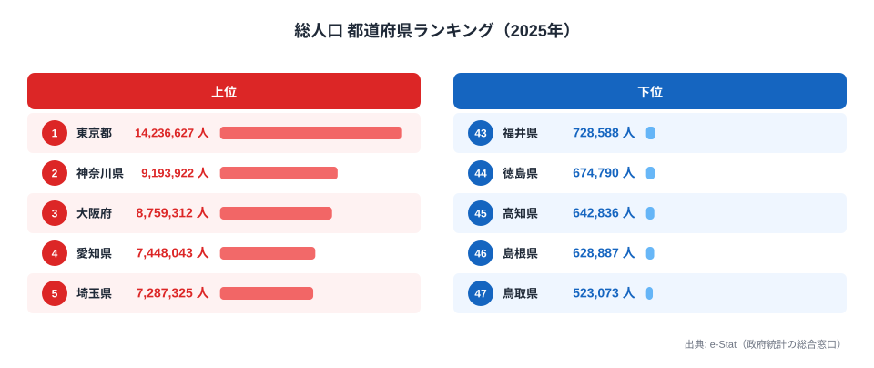

「最初のチャートが出てくる瞬間」が、データ可視化を始めたエンジニアにとっての最大のごほうびです。テーブルがいくら綺麗でも、棒が画面に並んだ瞬間にようやく「データが見えた」と感じます。本記事はその体験を、Claude Code を初めて触るソフトウェアエンジニア向けに **最短の手順で再現する** ためのレシピです。

シリーズ「Claude Code × e-Stat API 実例集」の Part 3 にあたります。Part 2（[Claude Code に「e-Stat 検索スキル」を覚えさせる](/blog/cc-estat-02-search-skill)）で `statsDataId` の探し方を整理したので、本記事ではいよいよ実データを取って D3.js でバーチャートを描くところまで一気通貫で進めます。前提知識は「ターミナルで `node` が動く」「`npm install` が通る」だけで十分です。

筆者は[stats47.jp](https://stats47.jp/)（47 都道府県統計サイト）を 1 人で運営しています。ページ上の対話型チャートは D3.js で描き、ブログの静的な図は SVG を生成して画像として配信しています。本記事のコードは、その D3.js の描き方を教材向けに最小化したものです。Step 1 で保存する `raw.json` があれば、Step 3 と Step 4 のコードはそのままコピペして動かせる形にしてあります。

## 本記事のゴールと前提

最初に、何を作るのかをはっきりさせます。

- **入力**: e-Stat API（国勢調査の都道府県別人口、最新年）
- **処理**: Claude Code に自然言語で指示して API のレスポンスを `raw.json` に保存し、整形コード（`transform.mjs`）と描画コード（`generate.mjs`）で SVG を作る
- **出力**: 上位 10 都道府県の人口バーチャート（`bar.svg` ファイル）

完成イメージの代わりに、同じ 2025 年の総人口を stats47.jp のランキング図にしたものを先に置きます。上位 5 都道府県と下位 5 都道府県をカードで並べた形で、本記事のコードが描く上位 10 都道府県の横棒とは見た目が異なりますが、元になる値は同じです。



<source-link href="/ranking/total-population">総人口ランキングをもっと見る</source-link>

ターミナルから `node transform.mjs` と `node generate.mjs` を順に叩くと SVG が落ちてくる、というシンプルな構成にします。Next.js などのフレームワークは使いません。最小依存で動かしてから、お好みでフロントエンドに組み込むのが上達の最短ルートだと思います。

前提として、以下が用意できているとスムーズです。

- Node.js 20.19 以上が目安です（`node --version` で確認）。`npm install` で入る `jsdom` は版ごとに対応する Node.js が違い、2026 年 10 月時点の最新版（30.1.2）は 22.22.2 以上などを求めます。インストール時に警告が出たら、`jsdom` の公式ページで対応バージョンを確認してください
- e-Stat API の `appId`（[e-Stat API 機能 利用ガイド](https://www.e-stat.go.jp/api/) から無料発行）
- Claude Code（`npm install -g @anthropic-ai/claude-code`）。利用できるプランは公式の料金ページで確認してください

`appId` は環境変数 `ESTAT_APP_ID` にエクスポートしておきます。サンプルコードでは `process.env.ESTAT_APP_ID` から読みます。

## 使うデータ｜国勢調査の都道府県別人口

今回扱うのは、総務省統計局「国勢調査」の **都道府県別総人口** です。e-Stat の `statsDataId` で言うと、`0004065881`（国勢調査の「総人口・総世帯数・男女・年齢・配偶関係 男女別人口－全国、都道府県、市区町村」）の表を使います。表の名前に「総世帯数」と入っていますが、この表の表章事項（`tab`）は「人口」の 1 つだけで、世帯数は入っていません。時間軸も 2025 年（令和 7 年）の 1 つだけです。調査年や公表時期によって ID は更新されるため、本番運用時は Part 2 のスキルで **最新の ID を都度引き直す** のが安全です。

ここでは説明用に、以下のサンプル URL を使う想定で進めます。

```text
https://api.e-stat.go.jp/rest/3.0/app/json/getStatsData
  ?appId=YOUR_APP_ID
  &statsDataId=0004065881
  &cdTab=2025_01            # 表章事項「人口」（単位は人）を表すコード
  &cdCat01=0                # 男女のうち「総数」（男女計）を表すカテゴリコード
```

注意点として、**`cdArea`（地域コード指定）も `cdTime`（時間軸コード指定）も付けない** のが本サイト流の流儀です。理由は 2 つあります。

1. stats47 は取得結果を `statsDataId` と `cdCat01` などの組み合わせをキーにしてキャッシュしているため、`cdArea` や `cdTime` を付けるとキーが分かれ、同じ表の取得結果が複数できてしまう
2. 全地域をまとめて 1 回で取り、メモリ上でフィルタした方が、API の呼び出し回数を減らせてキャッシュにも当たりやすい（この表は市区町村も含みます）

手元でも同じです。レスポンスを `raw.json` に一度保存しておけば、整形の条件を変えるたびに API を叩き直さずに済みます。「全件取得して保存 → 後段でフィルタ」が鉄則です。

調査年については、この表に入っているのは 2025 年（令和 7 年国勢調査、2026 年 9 月 29 日公表）の 1 つだけです。メタ情報の時間軸も `2025000000` の 1 値です。Step 3 の整形コードには最新の `@time` を選ぶ処理を入れてありますが、この表では実質何もしません。複数の調査年が入っている別の表に使い回すときの保険です。

## Step 1: Claude Code に「人口データ取得」を頼む

Claude Code に対しては、込み入った仕様を全部書き下す必要はありません。ここでは取得と保存だけを頼み、整形は Step 3 で自分のコードに任せます。以下くらいシンプルで通ります。

```text
e-Stat API（statsDataId=0004065881、cdTab=2025_01、cdCat01=0）を叩いて、
レスポンスの JSON を加工せずにそのまま raw.json に保存してください。
- appId は環境変数 ESTAT_APP_ID から読む
- cdArea と cdTime は付けない
- 保存したあと、DATA_INF.VALUE の件数を表示する
```

ポイントは 3 つあります。

- **加工させずに保存させる**（生のレスポンスが手元にあれば、整形の条件を変えても API を叩き直さずに済みます）
- **付けないパラメータも明示する**（前の節で説明したとおり、`cdArea` と `cdTime` は付けません）
- **件数を表示させる**（取得できたかどうかを、目で確かめられます）

これだけで、Claude Code は `fetch` で API を叩き、レスポンスを `raw.json` に落とすところまで自動でやってくれます。`raw.json` ができていて、`VALUE` の件数が表示されていれば成功です。

うまく動かない時は、Claude Code に 「**最後に取得した生レスポンスの先頭 30 行をそのまま見せて**」と頼みます。e-Stat の API は親切とは言いがたいエラーメッセージを返してくる（HTTP 200 でエラー文字列が混入したり）ので、生データを目視するのが結局一番速いです。

## Step 2: 返ってきた JSON の構造を理解する

e-Stat の JSON は、初見だとなかなか戸惑う階層構造をしています。`raw.json` の中身は、だいたいこんな形です。分類コードと名前は、`0004065881` のメタ情報に合わせてあります。実際のレスポンスには `@level` などの属性も付きますが、ここでは省略しています。

```jsonc
{
  "GET_STATS_DATA": {
    "STATISTICAL_DATA": {
      "CLASS_INF": {
        "CLASS_OBJ": [
          { "@id": "tab", "@name": "表章事項",
            "CLASS": { "@code": "2025_01", "@name": "人口", "@unit": "人" } },
          { "@id": "cat01", "@name": "男女",
            "CLASS": { "@code": "0", "@name": "総数" } },
          { "@id": "area", "@name": "全国、都道府県、市区町村（2000年市区町村含む）",
            "CLASS": [
              { "@code": "00000", "@name": "全国" },
              { "@code": "01000", "@name": "北海道" }
              // 以降、市区町村などを含めて 4,082 件
            ] },
          { "@id": "time", "@name": "時間軸（年次）",
            "CLASS": { "@code": "2025000000", "@name": "2025年" } }
        ]
      },
      "DATA_INF": {
        "VALUE": [
          { "@tab": "2025_01", "@cat01": "0", "@area": "01000", "@time": "2025000000", "@unit": "人", "$": "4980272" },
          { "@tab": "2025_01", "@cat01": "0", "@area": "02000", "@time": "2025000000", "@unit": "人", "$": "1139461" }
        ]
      }
    }
  }
}
```

`CLASS` の形に注目してください。候補が 1 つしかない分類（ここでは `tab`・`cat01`・`time`）は配列ではなく単一のオブジェクトで、候補が複数ある `area` だけが配列です。

頻出フィールドだけ覚えれば十分なので、一覧にまとめます。

- **`GET_STATS_DATA.STATISTICAL_DATA.DATA_INF.VALUE`** — 数値レコードの配列（上記 `VALUE`）
- **`VALUE[i]["@area"]`** — 地域コード（5 桁、全国は `00000`）。例: `"01000"`
- **`VALUE[i]["@time"]`** — 時間軸コード（年次は YYYY + 6 桁ゼロ）。例: `"2025000000"`
- **`VALUE[i]["@cat01"]`** — カテゴリコード（`cdCat01` と対応）。例: `"0"`
- **`VALUE[i]["@unit"]`** — 単位（文字列）。例: `"人"`
- **`VALUE[i]["$"]`** — 値本体（**文字列で来る**）。例: `"4980272"`
- **`CLASS_INF.CLASS_OBJ`** — コード ↔ 表示名の対応表（`area` の `CLASS` を参照）

**罠ポイント** をひとつ挙げます。`VALUE` も `CLASS` も、該当が 1 件だけのときは配列にならず単一のオブジェクトで返ってきます。47 県を一括で取る今回の `VALUE` は配列ですが、`cdArea` で 1 県に絞ると 1 件になって踏みます。`tab` の単位や `time` の名前を読むようにコードを拡張するときも、`CLASS` が配列だと思い込むと `.map is not a function` で止まります。Step 3 のコードでは、小さな関数 `toArray` で配列に揃えてから使います。

値は文字列なので、必ず `Number(v["$"])` でキャストします。表によっては値の代わりに `"-"` のような記号が入る行もあるので、`Number.isFinite` で数値になった行だけを残します。

## Step 3: 整形コード｜47 県 × 1 値の配列に変換する

ここから JavaScript の出番です。Step 1 で保存した `raw.json` を、D3 に流し込みやすい配列に整えて `population.json` に書き出します。Claude Code に任せるなら、次のように頼みます。

```text
raw.json から都道府県の行だけを取り出して、population.json に保存してください。
- フォーマット: [{ "areaCode": "01000", "areaName": "北海道", "value": 4980272 }, ...]
- value は「人」単位の整数
- 整形ロジックは別ファイル transform.mjs に切り出す
- 47件揃っていることを最後に検証する
```

自分で書くなら、次のコードになります。

```javascript
// transform.mjs
import fs from "node:fs/promises";

// 1 件だけのときは配列にならないので、配列に揃える小さな関数
const toArray = (x) => (Array.isArray(x) ? x : [x]);

const raw = JSON.parse(await fs.readFile("raw.json", "utf-8"));
const data = raw.GET_STATS_DATA.STATISTICAL_DATA;

const valueArr = toArray(data.DATA_INF.VALUE);
const classObj = toArray(data.CLASS_INF.CLASS_OBJ);

// area コード → 名前 のマップを作る
const areaClass = toArray(classObj.find((c) => c["@id"] === "area").CLASS);
const areaMap = new Map(
  areaClass.map((a) => [a["@code"], a["@name"]])
);

// 最新の調査年を特定（@time の文字列が最大のもの。この表は 2025 年だけなので保険）
const latestTime = valueArr
  .map((v) => v["@time"])
  .sort()
  .at(-1);

// 47 都道府県（@area が "01000"〜"47000" かつ "00000"全国を除外）
const rows = valueArr
  .filter((v) => v["@time"] === latestTime)
  .filter((v) => /^[0-4][0-9]000$/.test(v["@area"]) && v["@area"] !== "00000")
  .map((v) => ({
    areaCode: v["@area"],
    areaName: areaMap.get(v["@area"]),
    value: Number(v["$"]),
  }))
  .filter((r) => Number.isFinite(r.value))
  .sort((a, b) => b.value - a.value);

if (rows.length !== 47) {
  throw new Error(`Expected 47 rows, got ${rows.length}`);
}

await fs.writeFile("population.json", JSON.stringify(rows, null, 2));
console.log(`Wrote ${rows.length} rows. Top: ${rows[0].areaName} (${rows[0].value.toLocaleString()}人)`);
```

`node transform.mjs` を実行すると、`population.json` ができます。最後に 47 件そろっているかを確かめているので、件数が合わなければエラーで止まります。動作確認用に、最後の行で最上位の県を `console.log` しています。ここに出る県が東京都で、`population.json` の先頭が冒頭の図の上位 5 都道府県（東京都、神奈川県、大阪府、愛知県、埼玉県）と同じ並びになっていれば成功です。

並びや桁感が大きく違う場合は、単位の取り違え（千人 / 万人）か、`cdTab` や `cdCat01` の指定ミスを疑ってください。

## Step 4: D3.js でバーチャートを描く

ここが本記事の山場です。D3.js は学習コストが高いと言われますが、バーチャートだけなら**約 60 行で描けます**。

まず依存をインストールします。

```bash
npm init -y
npm install d3 jsdom
```

`d3` 本体に加え、Node 上で SVG を生成するために `jsdom` を入れます（ブラウザの DOM を Node で再現するライブラリ）。

続いて描画スクリプトです。

```javascript
// generate.mjs
import fs from "node:fs/promises";
import * as d3 from "d3";
import { JSDOM } from "jsdom";

const data = JSON.parse(await fs.readFile("population.json", "utf-8"));
const top = data.slice(0, 10); // 上位10県

const width = 720;
const height = 480;
const margin = { top: 40, right: 40, bottom: 40, left: 100 };

// 仮想 DOM を立てる
const dom = new JSDOM(`<!DOCTYPE html><body></body>`);
const body = d3.select(dom.window.document.body);

const svg = body
  .append("svg")
  .attr("xmlns", "http://www.w3.org/2000/svg")
  .attr("viewBox", `0 0 ${width} ${height}`)
  .attr("width", width)
  .attr("height", height);

// スケール（値→ピクセル）
const x = d3
  .scaleLinear()
  .domain([0, d3.max(top, (d) => d.value)])
  .nice()
  .range([margin.left, width - margin.right]);

const y = d3
  .scaleBand()
  .domain(top.map((d) => d.areaName))
  .range([margin.top, height - margin.bottom])
  .padding(0.2);

// バー本体
svg
  .append("g")
  .selectAll("rect")
  .data(top)
  .join("rect")
  .attr("x", x(0))
  .attr("y", (d) => y(d.areaName))
  .attr("width", (d) => x(d.value) - x(0))
  .attr("height", y.bandwidth())
  .attr("fill", "#2563eb");

// 県名ラベル（左側）
svg
  .append("g")
  .selectAll("text.label")
  .data(top)
  .join("text")
  .attr("class", "label")
  .attr("x", margin.left - 8)
  .attr("y", (d) => y(d.areaName) + y.bandwidth() / 2)
  .attr("dy", "0.35em")
  .attr("text-anchor", "end")
  .attr("font-size", 14)
  .attr("font-family", "system-ui, sans-serif")
  .text((d) => d.areaName);

// 値ラベル（バーの右側、万人換算）
svg
  .append("g")
  .selectAll("text.value")
  .data(top)
  .join("text")
  .attr("class", "value")
  .attr("x", (d) => x(d.value) + 6)
  .attr("y", (d) => y(d.areaName) + y.bandwidth() / 2)
  .attr("dy", "0.35em")
  .attr("font-size", 12)
  .attr("font-family", "system-ui, sans-serif")
  .attr("fill", "#475569")
  .text((d) => `${(d.value / 10000).toFixed(0)}万人`);

await fs.writeFile("bar.svg", body.html());
console.log(`Wrote bar.svg (${top.length} bars)`);
```

スケールは 2 つだけです。値を横幅に変える `scaleLinear`（`x`）と、県名を縦位置に割り当てる `scaleBand`（`y`）です。`padding(0.2)` は棒どうしの隙間の割合で、大きくすると棒が細くなります。

実行すると `bar.svg` が生成されます。

```bash
node generate.mjs
# => Wrote bar.svg (10 bars)
```

ブラウザで開けば、上位 10 都道府県のバーチャートが表示されます。一番長い棒は東京都で、値ラベルは万人単位に四捨五入されます。冒頭の図とは形が違いますが、元の値はどちらも同じ 2025 年国勢調査の総人口です。

> [!NOTE]
> このコードは上位 10 県だけを描くので、最小の棒でも読み取れます。10 位の静岡県は 3,465,667 人で、1 位の東京都の約 24.3%（約 4 分の 1）の長さがあります。ところが 47 県すべてを描くと、最下位の鳥取県は 523,073 人で、東京都の約 3.7%、つまり約 27 分の 1 の長さしかありません。棒グラフの長さは 0 からの量を表すため、短い棒を見やすくしようと対数目盛りに替えると、棒の長さの比が値の比と一致しなくなります。

## Step 5: SVG をファイル保存・配信する

`bar.svg` がそのままファイルとして手元に落ちているので、Web に載せる選択肢はいくつもあります。

- **静的サイトに直置き**: `public/charts/population.svg` などに置いて ``
- **インライン埋め込み**: `body.html()` の戻り値をそのまま HTML に流し込む（CSS で色を上書きできる）
- **PNG 変換**: `sharp` などで PNG にすれば OGP 画像にも転用可能

stats47.jp のブログでは、静的な図を SVG ファイルとして生成し、`` の画像として配信しています。ページ上の対話型チャートは D3.js で描いています。SVG はテキスト形式なので gzip 圧縮が効きやすく、PNG/JPG より転送量が小さくなることが多いです。この記事の冒頭の図も、SVG ファイルは 1 枚約 7 KB です。

Claude Code に頼むなら、こうなります。

```text
generate.mjs を改造して、bar.svg だけでなく
bar.png（800x540 のラスター画像）も同時に出力してください。
sharp ライブラリを使ってください。
```

`sharp` のインストールと変換コードの追加までやってくれます。

## レスポンシブ化と日本語フォントのコツ

実サイトに載せるなら、最低この 2 つは押さえておきたいです。

**レスポンシブ化**は、SVG の `width` / `height` を消して `viewBox` だけ残し、CSS で `width: 100%; height: auto;` を当てるのが一番ラクです。`generate.mjs` の該当部分はこう書き換えます。

```javascript
const svg = body
  .append("svg")
  .attr("xmlns", "http://www.w3.org/2000/svg")
  .attr("viewBox", `0 0 ${width} ${height}`)
  .attr("preserveAspectRatio", "xMidYMid meet")
  .attr("style", "width: 100%; height: auto;");
```

**日本語フォント**は、SVG 内で `font-family` に Web フォントを指定しても、`` で読み込んだ SVG や、SVG を単体で開いたときにはそのフォントが読み込まれません。

対策は次の 2 つです。

1. システムフォント（`system-ui`, `BlinkMacSystemFont`, `"Hiragino Sans"` など）にフォールバックする
2. SVG をインライン埋め込みで使うなら、HTML 側の CSS で SVG 内テキストにフォントを当てる（`.chart svg text { font-family: ... }`）。`` で読み込む SVG にはページの CSS が届かないので、この方法は使えません

stats47.jp のブログの図は `` で配信しているので 1 の方法をとり、`font-family` に `'Hiragino Kaku Gothic ProN'` や `sans-serif` といったシステムフォントを並べて指定しています。

## つまずきポイントと対処

実際に Claude Code 経由でやってみると、初回はだいたいどこかでハマります。よくあるパターンを 4 つ紹介します。

### つまずき1: VALUE が単一オブジェクトで返る

`cdArea` で 1 県に絞ったときに発生します。`VALUE` が配列ではなくオブジェクトになります。

```javascript
const toArray = (x) => (Array.isArray(x) ? x : [x]);
const valueArr = toArray(raw.GET_STATS_DATA.STATISTICAL_DATA.DATA_INF.VALUE);
```

を冒頭に挟んで正規化します。Step 3 の `transform.mjs` に入れてある関数と同じものです。`CLASS` が 1 件だけのときも同じ関数で揃えられます。

### つまずき2: 地域コードの桁数

e-Stat の地域コードは 5 桁（`01000`〜`47000`）。一方、JIS 都道府県コードは 2 桁（`01`〜`47`）です。混在させると JOIN に失敗します。

- e-Stat 内のキー: 5 桁固定
- 自前のマスタと突き合わせる時: `.slice(0, 2)` で 2 桁に変換するか、最初から 5 桁で揃える

stats47 では「**5 桁に統一**」を全面採用しています。

### つまずき3: ソート順が逆

`d3.scaleBand` の `domain` 順が、そのまま縦軸の上から下の並びになります。「1 位を一番上に出したい」なら、`data.sort((a, b) => b.value - a.value)` してから `domain` に渡します（Step 3 の整形コードが、すでに降順に並べています）。

### つまずき4: 軸ラベルの桁が読めない

人口は `14,236,627` のような大きな数値になるので、ラベルに生数字を出すと読みにくくなります。

```javascript
.text((d) => `${(d.value / 10000).toFixed(0)}万人`);
```

のように **万人換算** で表示するのが日本の読者には親切です。3 桁区切り `toLocaleString()` も併用すると更に読みやすくなります。

### おまけ: Claude Code に「直して」と言うときのコツ

エラーが出たら、エラーメッセージ全文と該当ファイルパスを **2 つともコピペで貼る** のが最短です。Claude Code 単体だとファイル内容は読みますが、最新のエラー出力までは自動取得しないことが多いので、貼り付け 1 回が結局速いです。

## まとめと次回予告

ここまでで、以下が手元に揃います。

- e-Stat API から国勢調査の都道府県別人口を取得し、`raw.json` として保存
- 47 件 ×（2025 年の総人口）の整形済み JSON `population.json`
- 上位 10 県を可視化したバーチャート（`bar.svg`）

「最初のチャートが画面に出る」体験は、データ可視化の沼への入口です。同じ枠組みは、別の指標にも使い回せます。たとえば世帯数や就業者数は、この表ではなく別の統計表にあるので、別の統計表 ID と `cdTab` に差し替えます。47 県すべてを描きたいときは、`generate.mjs` の `data.slice(0, 10)` を外し、`height` を 47 本の棒が収まる高さに増やします。その場合、人口 1 位の東京都と最下位の鳥取県の約 27.2 倍という差は、棒の長さの差としてそのまま表れます。

**次回 Part 4**（[高齢化率を D3 ヒートマップで描く](/blog/cc-estat-04-aging-heatmap)）では、今回作った取得パイプラインを再利用しつつ、47 県 × 年齢階級の 2 次元データをヒートマップで可視化します。色設計とカラーアクセシビリティの話を中心に、もう一段踏み込みます。

