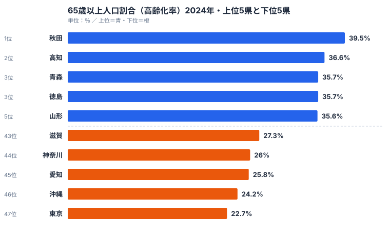

## ヒートマップで47都道府県を一望する

「秋田の高齢化が深刻」「沖縄は若い」——なんとなく知ってはいます。でも 47 都道府県を **同じ画面で同じスケールで比べた経験** は、意外と少ないのではないでしょうか。棒グラフは順位を見るには最適ですが、47 本も並ぶと縦に長くなりすぎて、全体傾向が頭に入ってきません。

そこで今回は **ヒートマップ** の出番です。47 行 × N 列の格子状にデータを並べ、セルを色の濃淡で塗り分けます。1 枚で「どの県が」「どの年代が」「どれくらい高い／低いか」を直感的に把握できるビジュアルが完成します。

本シリーズの過去回では、データ取得（Part 1〜2）と棒グラフ（Part 3）を扱ってきました。今回の Part 4 では、棒グラフ 1 本では扱いきれなかった **「2 軸データ」** をヒートマップで表現します。具体的には、47 都道府県 × 5 年代の高齢化率推移を 1 枚にまとめる、というのがゴールです。

そしてもうひとつのテーマが「配色を Claude Code に任せる」ことです。ヒートマップで一番悩むのが色なんですよね。`d3-scale-chromatic` には 40 種類以上のカラースキームが用意されていますが、「Viridis でいいのか、Oranges でいいのか、それとも RdYlBu の発散系か」——この判断、毎回迷う方は多いはずです。Claude Code に **「何を伝えたいか」を自然言語で投げて、配色を提案してもらう** ワークフローを紹介します。

この記事のゴールは次の 3 点です。

- e-Stat の人口推計データから 47 都道府県 × 年代の行列を構築します
- D3 + `d3-scale-chromatic` で連続スケールヒートマップを描きます
- 色覚バリアフリーを考慮した配色を Claude Code に決めさせます

それでは始めましょう。

## まず実データを見る: 高齢化率は県でこれだけ違う

実装に入る前に、これから可視化する高齢化率がどんなデータなのかを掴んでおきましょう。高齢化率とは総人口に占める 65 歳以上人口の割合（%）のことです。stats47.jp の最新（2024 年）の値から、上位 5 県と下位 5 県を 1 枚にしたのが次の図です。



最も高いのは秋田県の 39.5% で、県民の約 4 割が 65 歳以上です。続いて高知 36.6%、青森・徳島がともに 35.7%、山形 35.6% と僅差で並びます。一方で最も低いのは東京都の 22.7%、次いで沖縄 24.2%、愛知 25.8%、神奈川 26.0%、滋賀 27.3% です。最高の秋田と最低の東京の差は 16.8 ポイント、倍率にすると約 1.74 倍になります。「同じ日本」でありながら、住む県で高齢者の割合がこれだけ変わるのです（全 47 県の値は [高齢化率ランキング](/ranking/ratio-65-plus) で確認できます）。

上位に並ぶ顔ぶれには地理的な偏りがあります。上位 5 県のうち秋田・青森・山形の 3 県が東北で、上位 10 県まで広げると秋田・青森・山形・岩手の東北 4 県が入ります。残りは高知・徳島の四国、山口・島根・長崎・和歌山といった西日本の地方県です。共通するのは「若年層が進学・就職で大都市圏へ流出し、残った人口が高齢化する」構造で、生産年齢人口が長年にわたって県外へ抜け続けてきた地域ほど割合が押し上げられています。

下位の 5 県は東京・沖縄・愛知・神奈川・滋賀です。東京・神奈川・愛知は若年層を全国から吸い込む大都市圏で、分母（総人口）に占める若い世代が厚いため割合が下がります。沖縄が低いのは流入ではなく出生率の高さが効いており、子どもと若年層の厚みが高齢化率を押し下げています。**「高齢化率が低い＝元気な地域」とは限らず、流入型（大都市）と出生型（沖縄）という別々の理由が混在している**点が、この指標を読むうえでの肝です。

> [!NOTE]
> 高齢化率は「総人口に占める 65 歳以上人口の割合」です。65 歳以上の絶対数ではない点に注意してください。秋田が 1 位なのは高齢者が多いからではなく、若年層の流出で分母が小さくなった結果でもあります。e-Stat の人口推計では「65 歳以上人口」と「総人口」が別行で配信されるため、率は取得後に `(65歳以上 / 総人口) * 100` で自分で計算する必要があります。

<source-link href="/ranking/ratio-65-plus">65歳以上人口割合（高齢化率）ランキングをもっと見る</source-link>

## 使うデータ: 高齢化率（65 歳以上人口比率）

今回扱うのは、いま見た「**高齢化率**」、つまり総人口に占める 65 歳以上人口の割合（%）です。日本で最もよく引用される統計のひとつで、e-Stat にも複数の収載先があります。

主な取得元の候補は次のとおりです（statsDataId は例示なので、実行時は最新のものを e-Stat 検索で確認してください）。

- **人口推計（年次）** — statsDataId の例は `0003448237`。毎年 10 月 1 日時点で、47 都道府県 × 年齢 5 歳階級。最も粒度が細かい候補です
- **国勢調査（5 年ごと）** — `0003410379` 系列。完全悉皆調査で 10 月 1 日時点、最新は 2025 年です
- **住民基本台帳人口** — 別系列。1 月 1 日時点で、外国人を含む／含まないを選択できます

> [!WARNING]
> statsDataId は e-Stat 側の改訂で変わることがあります。古い ID をハードコードすると、ある日突然データが取れなくなります。Part 2 で紹介した `/search-estat` スキルで「人口推計 高齢化率」と打って最新の ID を確認するのが確実です。さらに、調査ごとに基準日（10 月 1 日 / 1 月 1 日）が異なるため、複数ソースの値を 1 枚の図に混在させると不連続が生まれます。今回のように 1 ソースで揃えるのが安全です。

今回は **人口推計（年次）** を使い、2005 / 2010 / 2015 / 2020 / 2025 年の 5 時点を切り出します。「47 県 × 5 年代 = 235 セル」のヒートマップが完成形のイメージです。

なお、先ほどの NOTE にも書いたとおり、e-Stat の人口推計は「65 歳以上人口」と「総人口」が別行で配信されているため、高齢化率は取得後にこちらで `(65歳以上 / 総人口) * 100` を計算する必要があります。Claude Code に頼むときは、この計算ステップを明示しておくと事故が減ります。

## Step 1: Claude Code に「高齢化率データ取得」を頼む

stats47 のリポジトリには `/fetch-estat-data` というスキルが入っていて、e-Stat API の認証・キャッシュ・retry・年度フィルタを全部巻き取ってくれます。Part 1〜2 で扱った道具立てを、ここでも素直に使い回します（スキル化の経緯は [Part 2: e-Stat 統計表検索を Claude Code スキル化する](/blog/cc-estat-02-search-skill) を参照してください）。

Claude Code に投げるプロンプトはこんな感じです。

```text
/fetch-estat-data を使って、人口推計（statsDataId=0003448237）から
47都道府県 × 5年代（2005, 2010, 2015, 2020, 2025）の高齢化率を取得し、
JSON で保存してください。

要件:
- 65歳以上人口 / 総人口 × 100 を都道府県・年代ごとに計算する
- 出力フォーマットは { areaCode, areaName, year, agingRate } の配列
- 保存先: /tmp/aging-rate-47x5.json
- 都道府県は areaCode 01000〜47000 の5桁固定
```

ポイントは 3 つあります。

1. **e-Stat 取得は `/fetch-estat-data` に任せます**。年度フィルタや 47 都道府県の取得はスキル側でやってくれるので、こちらは「最終形の JSON 構造」だけ指示すれば済みます。
2. **計算ステップを明示します**。「分子と分母の API レスポンス行は別」という前提を共有しておかないと、間違えて 65 歳以上人口の絶対値を率と勘違いされることがあります。
3. **areaCode は 5 桁固定にします**。`.claude/rules/estat-api.md` にも書かれているプロジェクト規約です。`01`（2 桁）と `01000`（5 桁）が混在するとマージ時に詰まります。

実行すると、こんな JSON ができあがります。

```json
[
  { "areaCode": "01000", "areaName": "北海道", "year": 2005, "agingRate": 21.5 },
  { "areaCode": "01000", "areaName": "北海道", "year": 2010, "agingRate": 24.7 },
  { "areaCode": "01000", "areaName": "北海道", "year": 2015, "agingRate": 29.1 },
  { "areaCode": "01000", "areaName": "北海道", "year": 2020, "agingRate": 32.1 },
  { "areaCode": "01000", "areaName": "北海道", "year": 2025, "agingRate": 33.8 },
  { "areaCode": "02000", "areaName": "青森県", "year": 2005, "agingRate": 22.7 }
]
```

「47 行 × 5 年代 = 235 件」のフラットな配列です。これがヒートマップの素材になります。

> [!TIP]
> 上記 JSON の値は構造を示すための例示で、最新の確定値ではありません。実際の最新値（2024 年の上位・下位）は本記事冒頭の図と `/ranking/ratio-65-plus` で確認できます。実装時は API の戻り値をそのまま使ってください。

## Step 2: データを 47 行 × N 列の行列に整形

ヒートマップは内部的には **2 次元配列** で扱うのが定石です。フラット配列のままでも D3 で描けますが、「行 = 県」「列 = 年代」と明示的に整理しておくと、後段のスケール設定と凡例実装が格段に楽になります。

整形コードはこんな感じです。Node.js で書いていますが、Claude Code に投げる場合も同じロジックを書いてもらえば済みます。

```javascript
import fs from "node:fs";

const raw = JSON.parse(
  fs.readFileSync("/tmp/aging-rate-47x5.json", "utf-8")
);

const years = [2005, 2010, 2015, 2020, 2025];

// 都道府県ごとにグループ化
const byArea = new Map();
for (const row of raw) {
  if (!byArea.has(row.areaCode)) {
    byArea.set(row.areaCode, {
      areaCode: row.areaCode,
      areaName: row.areaName,
      values: new Array(years.length).fill(null),
    });
  }
  const idx = years.indexOf(row.year);
  if (idx >= 0) {
    byArea.get(row.areaCode).values[idx] = row.agingRate;
  }
}

// 行列に変換（areaCode 昇順 = 北海道 → 沖縄）
const matrix = Array.from(byArea.values()).sort((a, b) =>
  a.areaCode.localeCompare(b.areaCode)
);

console.log(JSON.stringify({ years, matrix }, null, 2).slice(0, 500));
```

出力構造はこうなります。

```json
{
  "years": [2005, 2010, 2015, 2020, 2025],
  "matrix": [
    {
      "areaCode": "01000",
      "areaName": "北海道",
      "values": [21.5, 24.7, 29.1, 32.1, 33.8]
    },
    {
      "areaCode": "02000",
      "areaName": "青森県",
      "values": [22.7, 25.8, 30.1, 33.7, 35.2]
    }
  ]
}
```

行（県）の並び順には議論の余地があります。

- **北→南順（areaCode 昇順）**: 地理感覚と一致して直感的です。ただし「どこが高いか」は色で読み取る必要があります
- **値で降順ソート**: 「秋田・高知・青森が一番濃い」が一発で分かります。ただし地理感覚は失われます
- **クラスタリング**: 似た推移パターンの県をまとめます。高度ですが解釈は最高です

今回は素直に areaCode 昇順を採用します。読み手の頭に「秋田は東北だな」というメンタルマップがあるので、地理順のほうがストーリーを語りやすいのです。

## Step 3: D3 でヒートマップ — rect グリッド + カラースケール

データができたら、いよいよ描画です。React のコンポーネントとして書いていますが、ロジック自体は素の D3 で完結します。棒グラフ 1 本の描画は [Part 3: 都道府県別人口を Claude Code × D3 で棒グラフに](/blog/cc-estat-03-population-bar) で扱ったので、今回は 2 軸（県 × 年代）への拡張に集中します。

```tsx
"use client";

import { useMemo } from "react";
import * as d3 from "d3";
import {
  interpolateOranges,
  interpolateRdYlBu,
  interpolateViridis,
} from "d3-scale-chromatic";

type CellDatum = {
  areaCode: string;
  areaName: string;
  year: number;
  value: number;
};

type Props = {
  data: { areaCode: string; areaName: string; values: number[] }[];
  years: number[];
  scheme?: "oranges" | "rdylbu" | "viridis";
};

const INTERPOLATORS = {
  oranges: interpolateOranges,
  rdylbu: interpolateRdYlBu,
  viridis: interpolateViridis,
};

export function AgingHeatmap({ data, years, scheme = "oranges" }: Props) {
  const cells = useMemo<CellDatum[]>(() => {
    const out: CellDatum[] = [];
    for (const row of data) {
      row.values.forEach((value, i) => {
        if (value == null) return;
        out.push({
          areaCode: row.areaCode,
          areaName: row.areaName,
          year: years[i],
          value,
        });
      });
    }
    return out;
  }, [data, years]);

  const [vMin, vMax] = useMemo(() => {
    const arr = cells.map((c) => c.value);
    return [d3.min(arr) ?? 0, d3.max(arr) ?? 1];
  }, [cells]);

  const color = useMemo(
    () => d3.scaleSequential(INTERPOLATORS[scheme]).domain([vMin, vMax]),
    [scheme, vMin, vMax]
  );

  const cellW = 56;
  const cellH = 18;
  const padL = 80;
  const padT = 32;
  const width = padL + cellW * years.length + 24;
  const height = padT + cellH * data.length + 8;

  // ルート要素は SVG キャンバス。viewBox / role="img" / aria-label を付与し、
  // 配下に「年代ラベル(g)」「県名ラベル(g)」「セル本体(g)」の 3 グループを描く。
  const rootProps = {
    viewBox: `0 0 ${width} ${height}`,
    role: "img",
    "aria-label": "47県×5年代の高齢化率ヒートマップ",
  };

  return (
    <svg{...rootProps}>
      {/* 列見出し: 年代ラベル */}
      <g transform={`translate(${padL}, ${padT - 8})`}>
        {years.map((y, i) => (
          <text key={y} x={cellW * i + cellW / 2} y={0} textAnchor="middle" fontSize={11}>
            {y}
          </text>
        ))}
      </g>

      {/* 行見出し: 県名ラベル */}
      <g transform={`translate(${padL - 6}, ${padT})`}>
        {data.map((row, i) => (
          <text
            key={row.areaCode}
            x={0}
            y={cellH * i + cellH * 0.7}
            textAnchor="end"
            fontSize={10}
          >
            {row.areaName}
          </text>
        ))}
      </g>

      {/* セル本体: rect を color() で塗り、title でツールチップ */}
      <g transform={`translate(${padL}, ${padT})`}>
        {cells.map((c) => {
          const rowIdx = data.findIndex((r) => r.areaCode === c.areaCode);
          const col = years.indexOf(c.year);
          return (
            <rect
              key={`${c.areaCode}-${c.year}`}
              x={col * cellW}
              y={rowIdx * cellH}
              width={cellW - 1}
              height={cellH - 1}
              fill={color(c.value)}
            >
              <title>{`${c.areaName} ${c.year}: ${c.value.toFixed(1)}%`}</title>
            </rect>
          );
        })}
      </g>
    </svg>
  );
}
```

ポイントは 3 つです。

1. **`d3.scaleSequential` を使います**。連続値を 1 つのカラーランプにマッピングするときの定番です。`scaleLinear<string>` + `interpolateRgb` を手書きするより安全です
2. **`<title>` で簡易ツールチップにします**。SVG ネイティブの `<title>` 要素は、マウスホバーで OS のツールチップを出します。実装ゼロでアクセシブルです
3. **`role="img"` + `aria-label` を付けます**。ヒートマップ全体の意味をスクリーンリーダーに伝えます

ライブラリの追加はこれだけです。

```bash
npm install d3 d3-scale-chromatic
npm install --save-dev @types/d3 @types/d3-scale-chromatic
```

`d3-scale-chromatic` は D3 本体とは独立した別パッケージなので、忘れず明示インストールしてください。

## Step 4: 配色を AI に決めさせる

ここからが本記事の本題です。「配色を Claude Code に任せる」というのは、雰囲気で良さげな色を選んでもらうということではありません。**目的と制約を言語化してプロンプトに含め、複数候補の比較を出力させる** という具体的なワークフローです。

たとえば、こんなプロンプトを投げてみます。

```text
このヒートマップは「47都道府県の高齢化率 (2005-2025)」を表示します。
配色を提案してください。要件:

1. 連続スケール（順序のある値）であること
2. 色覚バリアフリー（P型・D型）に配慮
3. 高齢化率が高い県を「目立たせたい」（暖色寄り or 暗色寄り）
4. d3-scale-chromatic の interpolator 名で答えてください
5. 候補を3つ挙げて、それぞれのメリット・デメリットを比較

なお、この記事は印刷される可能性もあるので、グレースケール印刷時にも順序が
残るスキームを優先してください。
```

実際に返ってくる回答（要約）はこんな具合です。

- **候補1: `interpolateViridis`** — 色覚バリアフリーで世界標準。グレースケールでも順序が残ります。弱点は「高齢化＝オレンジ」という文化的連想が薄く、やや学術的に見える点です
- **候補2: `interpolateOranges`** — 高齢化を「暖色＝注意喚起」で表現でき直感的です。弱点は単色グラデのため値の差が分かりにくく、低値が薄すぎる点です
- **候補3: `interpolatePlasma`** — 暗→明のコントラストが強く、最大値の県が刺さります。弱点は紫から黄への変化が派手で、報告書には向かない場面がある点です

実は `d3-scale-chromatic` には 40 種類以上のスキームがあり、用途別に整理されています。代表的なものを並べると以下のとおりです。

- **Sequential (single hue)** — `Blues` `Oranges` `Greens` `Purples` など。「0 から最大値」の単方向データ向けで直感的ですが、表現できる幅は狭めです
- **Sequential (multi hue)** — `Viridis` `Plasma` `Magma` `Inferno` `Cividis` など。色覚バリアフリーの本命で、研究論文での標準です
- **Diverging** — `RdYlBu` `RdBu` `BrBG` `PiYG` など。中央値（例: 全国平均）から上下に発散させたいときに使います
- **Cyclical** — `Rainbow` `Sinebow` など。時刻・角度といった循環するデータ専用です

高齢化率は「単方向データ（高いほど課題が深刻）」なので Sequential が適切です。色覚バリアフリーを最優先するなら Viridis、ストーリーを「警告色」で語りたいなら Oranges、というのが定石になります。

私の結論はこうでした。

- **記事のメイン画像**: `interpolateOranges`（読者の直感に合わせます）
- **論文・レポート用の代替版**: `interpolateViridis`（同じデータで色だけ差し替えた画像を別に書き出します）
- **「全国平均からの偏差」を見せる派生版**: `interpolateRdYlBu`（reverse=true で「赤＝高齢化高い」にします）

Claude Code に頼むメリットは、**自分が無意識に避けていた候補を提示してくれる** ことです。私は Cividis を知らなかったのですが、提案されてから常に Viridis と一緒に比較するようになりました。

## Step 5: 凡例（legend）を追加

ヒートマップは凡例なしでは読めません。「この色が何 % か」が分からないと、相対比較しかできないからです。

D3 の連続スケール用 legend は、実は標準ヘルパーがありません。**自分で linearGradient を仕込んで横長の矩形に塗る** のが定石です。

```tsx
function HeatmapLegend({
  color,
  vMin,
  vMax,
  width = 240,
  height = 12,
}: {
  color: d3.ScaleSequential<string>;
  vMin: number;
  vMax: number;
  width?: number;
  height?: number;
}) {
  const stops = d3.range(0, 1.0001, 0.1).map((t) => ({
    offset: `${t * 100}%`,
    color: color(vMin + (vMax - vMin) * t),
  }));

  const legendRootProps = { width, height: height + 18, role: "img", "aria-label": "凡例" };

  return (
    <svg{...legendRootProps}>
      <defs>
        <linearGradient id="heatmap-legend">
          {stops.map((s, i) => (
            <stop key={i} offset={s.offset} stopColor={s.color} />
          ))}
        </linearGradient>
      </defs>
      <rect x={0} y={0} width={width} height={height} fill="url(#heatmap-legend)" />
      <text x={0} y={height + 12} fontSize={10} textAnchor="start">
        {vMin.toFixed(1)}%
      </text>
      <text x={width} y={height + 12} fontSize={10} textAnchor="end">
        {vMax.toFixed(1)}%
      </text>
    </svg>
  );
}
```

`<defs>` と `<linearGradient>` の組み合わせがコツです。`stops` を 10 等分に切って `color()` でサンプリングし、SVG ネイティブの線形グラデーションを生成しています。**カラースケール本体と完全に同期する** ので、`scheme` を切り替えても凡例側を書き直す必要がありません。

凡例の位置は、ヒートマップ本体の右側に縦長で配置するパターンと、上部に横長で配置するパターンの 2 通りがあります。47 県が縦に並ぶ今回のレイアウトでは、**上部に横長** のほうがバランスがよいです。

## Step 6: アクセシビリティ — ARIA とツールチップ

ヒートマップは「色だけで情報を伝える」ビジュアルなので、**色が見えないユーザーへの代替手段** が必須です。

最低限こなしたいのは次の 3 点です。

1. **`role="img"` と `aria-label`**: チャート全体の意味を 1 文で説明します
2. **`<title>` 要素**: 各セルにホバーで詳細値を表示します
3. **タブ可能なフォールバック**: スクリーンリーダーで全データを順に読める代替を提供します

3 番目が手抜きされがちです。`<details>` で折りたたんだ代替リストを併置するのが、実装コストとアクセシビリティのバランスが良い解です。「テキストで値を見る」というラベルを付けておけば、晴眼者でも「正確な値を引用したい」ときに開いて使えるので、二度おいしい実装になります。

> [!TIP]
> 色だけで順序を伝える図は、グレースケール印刷や色覚特性によって読めなくなるリスクを常に抱えています。冒頭の上位5・下位5の図のように「数値ラベルを併記した横棒」を 1 枚添えておくと、色が読めない環境でも順位がそのまま伝わります。ヒートマップ（全体俯瞰）と横棒（厳密な順位）は競合せず、補完関係にあると考えると配置で迷いません。

## つまずきポイントまとめ

実装してみると、「あれ？」となる場面がいくつかあります。代表的なものを列挙しておきます。

### カラーランプの向きが逆になる

`interpolateRdYlBu` は「赤 → 黄 → 青」の順なので、**そのまま使うと「赤＝低値・青＝高値」** になります。高齢化率を表したいときは「赤＝高齢化進行」のほうが直感的なので、ドメインを反転させましょう。

```typescript
const color = d3
  .scaleSequential(d3.interpolateRdYlBu)
  .domain([vMax, vMin]); // ← 反転
```

`color.range().reverse()` で interpolator 側を反転させる方法もありますが、`d3.scaleSequential` の場合はドメイン反転のほうが意図が明確です。

### ゼロ値・null セルの扱い

データが欠損している都道府県・年代があると、`color(null)` は `"#000000"` になってしまいます。これは「最低値」と誤読されかねないので、欠損は別色（薄いグレー）で塗るのが安全です。

```tsx
fill={c.value == null ? "#f1f5f9" : color(c.value)}
```

### 印刷時にグレースケールになる

社内資料が白黒コピーされる前提なら、**グレースケール印刷でも順序が保たれるか** を確認しておきましょう。Viridis 系は明度の単調変化が設計されているので問題ありませんが、RdYlBu のような発散系は中央が灰色になって順序が読めなくなります。

Chrome の DevTools には Rendering タブに「Emulate vision deficiencies」と「Print preview」があるので、**完成後に必ず両方で目視確認** することをおすすめします。

### セル幅と県名ラベルのバランス

47 県の県名ラベルは縦に 47 行並びます。フォントを小さくしすぎると老眼の読者がつらいですが、大きくしすぎると 1 画面に収まりません。**12px 程度、line-height 1.4** が経験的な妥協点でした。スマホ向けには横スクロール許容で書き出すのが現実的です。

## 次回予告

[Part 5: 医療費のコロプレス地図を Claude Code で描く](/blog/cc-estat-05-medical-cost-choropleth) では、いよいよ **コロプレス地図** に進みます。ヒートマップは「県の並び順」を恣意的に決める必要がありましたが、コロプレス地図なら **地理空間そのものを軸にできる** ので、地域クラスタの可視化に強い武器になります。

GeoJSON の取得、`d3-geo` の `geoPath` と `geoMercator` の使い分け、トポロジーの簡略化（topojson-simplify）、配色の流用、ホバーインタラクション——テーマは盛りだくさんです。本記事で作ったカラースケール設計の知見が、ほぼそのままコロプレス地図に転用できます。実データで手を動かしたい方は、高齢化率と相関の高い [平均寿命ランキング](/ranking/life-expectancy-0-male) と、若年層との比率を捉える [老年化指数ランキング](/ranking/aging-index) も合わせて眺めると、配色設計の練習素材になります。

それでは、よい AI コーディングライフを。
