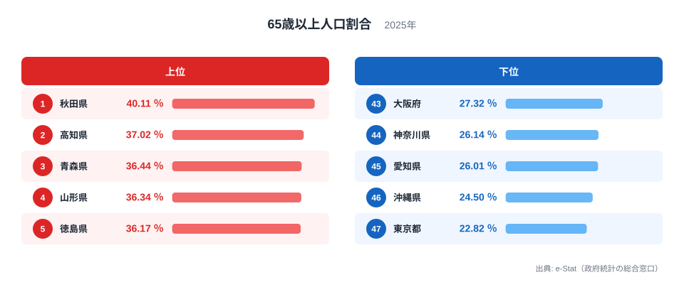
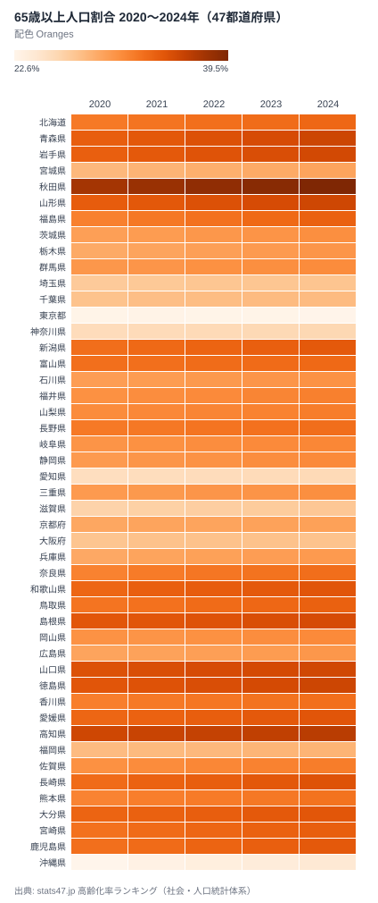
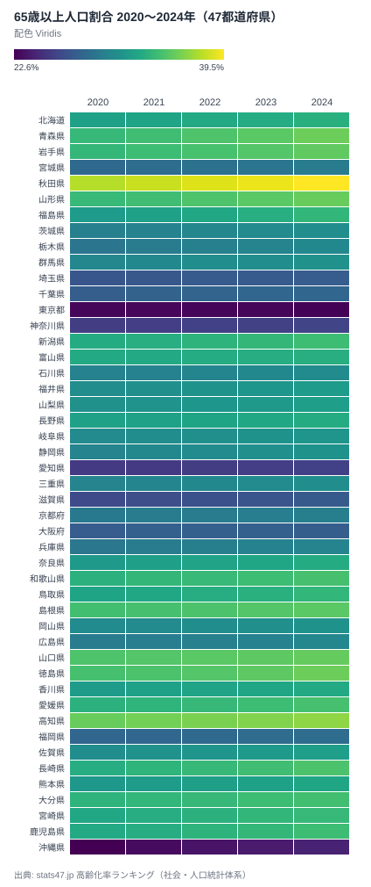

## ヒートマップで47都道府県を一望する

「秋田の高齢化が深刻」「沖縄は若い」——なんとなく知ってはいます。でも 47 都道府県を **同じ画面で同じスケールで比べた経験** は、意外と少ないのではないでしょうか。棒グラフは順位を見るには最適ですが、47 本も並ぶと縦に長くなりすぎて、全体傾向が頭に入ってきません。

そこで今回は **ヒートマップ** の出番です。47 行 × N 列の格子状にデータを並べ、セルを色の濃淡で塗り分けます。1 枚で「どの県が」「どの年に」「どれくらい高い／低いか」を直感的に把握できるビジュアルが完成します。

本シリーズの過去回では、データ取得（Part 1〜2）と棒グラフ（Part 3）を扱ってきました。今回の Part 4 では、棒グラフ 1 本では扱いきれなかった「**2 軸データ**」をヒートマップで表現します。具体的には、47 都道府県 × 5 時点（2020〜2024 年）の高齢化率の推移を 1 枚にまとめる、というのがゴールです。

そしてもうひとつのテーマが「配色を Claude Code に任せる」ことです。ヒートマップで一番悩むのが色なんですよね。D3 に含まれる `d3-scale-chromatic` には、連続スケール用の `interpolate` で始まる関数だけで 38 種類のカラースキームが用意されています（3.1.0 で数えた値です）。「Viridis でいいのか、Oranges でいいのか、それとも RdYlBu の発散系か」——この判断、毎回迷う方は多いはずです。Claude Code に **「何を伝えたいか」を自然言語で投げて、配色を提案してもらう** ワークフローを紹介します。

タイトルの問いに先に答えます。配色は Claude Code に任せて大丈夫です。ただし、任せるのは候補出しまでです。目的と制約を言葉にして渡し、最終決定と、色覚シミュレーションでの目視確認は人が行います。なぜ最終決定を人に残すのかは、同じデータを Oranges と Viridis で描いた 2 枚の図を見比べながら、Step 4 で説明します。

この記事のゴールは次の 3 点です。

- e-Stat の人口推計データから 47 都道府県 × 年の行列を構築します
- D3 + `d3-scale-chromatic` で連続スケールヒートマップを描きます
- 色覚バリアフリーを考慮した配色の候補を Claude Code に挙げさせ、人が決めます

それでは始めましょう。

## まず実データを見る: 高齢化率は県でこれだけ違う

実装に入る前に、これから可視化する高齢化率がどんなデータなのかを掴んでおきましょう。高齢化率とは総人口に占める 65 歳以上人口の割合（%）のことです。stats47.jp の最新（2025 年）の値から、上位 5 県と下位 5 県を 1 枚にしたのが次の図です。2025 年の値は令和7年国勢調査の結果から作られています。



最も高いのは秋田県の 40.1% で、県民の約 4 割が 65 歳以上です。続いて高知県 37.0%、青森県 36.4%、山形県 36.3%、徳島県 36.2% と、2 位から 5 位までは 1 ポイントに満たない差で並びます。一方で最も低いのは東京都の 22.8%、次いで沖縄県 24.5%、愛知県 26.0%、神奈川県 26.1%、大阪府 27.3% です。最高の秋田県と最低の東京都の差は 17.3 ポイント、倍率にすると約 1.76 倍になります。「同じ日本」でありながら、住む県で高齢者の割合がこれだけ変わるのです（全 47 県の値は [高齢化率ランキング](/ranking/ratio-65-plus) で確認できます）。

上位に並ぶ顔ぶれには地理的な偏りがあります。上位 5 県のうち秋田県・青森県・山形県の 3 県が東北で、上位 10 県まで広げると岩手県も入り、東北 4 県になります。四国は、2 位の高知県と 5 位の徳島県に加えて、9 位に愛媛県が入っています。残りは山口県・島根県・長崎県です。東北・四国・中国・九州の地方県に集まっていることは分かりますが、理由まではこのデータだけでは分かりません。若い世代が進学や就職で大都市圏へ移り、残った人口に占める高齢者の割合が上がっている可能性はあります。ただし、確かめるには人口移動のデータと突き合わせる必要があります。

下位の 5 県は東京都・沖縄県・愛知県・神奈川県・大阪府です。このうち東京都・愛知県・神奈川県・大阪府は大都市圏の都府県で、働く世代が多く暮らしていることが割合を下げている可能性があります。沖縄県が低い理由は、大都市圏とは別の要因かもしれません。どちらもこのデータだけでは確かめられません。**高齢化率が低い理由は県によって違うかもしれず、低いこと自体が「元気な地域」を意味するとは限りません**。この指標を読むうえでは、この点が肝になります。

> [!NOTE]
> 高齢化率は「総人口に占める 65 歳以上人口の割合」で、65 歳以上の人数そのものではありません。割合なので、65 歳以上の人数が変わらなくても、分母の総人口が減れば上がります。2025 年の値は令和7年国勢調査の原数値（年齢「不詳」を除いて算出）で、報道などで使われる不詳補完値とは小数点以下が異なることがあります。

<source-link href="/ranking/ratio-65-plus">65歳以上人口割合（高齢化率）ランキングをもっと見る</source-link>

## 使うデータ: 高齢化率（65 歳以上人口比率）

今回扱うのは、いま見た「**高齢化率**」、つまり総人口に占める 65 歳以上人口の割合（%）です。日本で最もよく引用される統計のひとつで、e-Stat にも複数の収載先があります。

主な取得元の候補は次のとおりです。

- **人口推計**（年次） — 統計表 ID は `0003448237`、表題は「都道府県，年齢（5歳階級），男女別人口－総人口，日本人人口」です。各年 10 月 1 日現在の人口が、47 都道府県 × 年齢 5 歳階級 × 男女別で並びます。最も粒度が細かい候補です
- **国勢調査**（5 年ごと） — 完全悉皆調査で、10 月 1 日現在の人口です。冒頭の図の 2025 年の値は、この調査の結果です
- **住民基本台帳人口** — 別系列で、基準日は 1 月 1 日です

> [!WARNING]
> 表に含まれる時点は、更新によって変わる可能性があります。実行前に、統計表 ID と時間軸を e-Stat で確かめてください。Part 2 で紹介した `/search-estat` スキルで「人口推計 高齢化率」と打てば、最新の ID を確認できます。また、調査ごとに基準日（10 月 1 日 / 1 月 1 日）が異なるため、複数ソースの値を 1 枚の図に混在させると不連続が生まれます。今回のように 1 ソースで揃えるのが安全です。

今回は **人口推計**（年次）を使います。この表が持つ時点は 2020・2021・2022・2023・2024 年の 5 つ（各年 10 月 1 日現在）で、「47 県 × 5 時点 = 235 セル」のヒートマップが完成形のイメージです。冒頭の図の 2025 年は国勢調査の値で、この表には含まれません。出典が違うので、冒頭の図の 2025 年の値とヒートマップの 2024 年の値を、小数点以下まで同じ基準の連続した値として並べるのは避けてください。

5 年間の変化は、県の間の差に比べると小さなものです。Step 3 で描くヒートマップと同じ出どころの値（stats47.jp のランキングが持つ 2020〜2024 年の値）で数えると、2024 年の最高は秋田県の 39.5%、最低は東京都の 22.7% で、差は 16.8 ポイントでした。一方、2020 年から 2024 年までの 5 年間に最も上がったのは秋田県と福島県の 1.9 ポイントで、東京都は 22.8% から 22.7% へ 0.1 ポイント下がっています。県の間の差は、5 年間で最も大きい変化の約 8.8 倍です。そのため今回のヒートマップでは、県ごとの差が色の主役になり、年ごとの変化は同じ行の中のゆるやかな濃淡として読むことになります。

なお、この表には「65 歳以上」という行がなく、年齢 5 歳階級ごとの人口が並んでいます。高齢化率は取得後にこちらで、「65～69歳」から「85歳以上」までの 5 階級を足した人口を、「総数」で割って計算する必要があります。Claude Code に頼むときは、この計算ステップを明示しておくと事故が減ります。

## Step 1: Claude Code に「高齢化率データ取得」を頼む

stats47 のリポジトリには `/fetch-estat-data` というスキルが入っています。appId を `.env.local` から読み、e-Stat API の `getStatsData` を呼んで JSON に整形する一時スクリプトを、Claude Code に作らせる手順書です。Part 1〜2 で扱った道具立てを、ここでも素直に使い回します（スキル化の経緯は [Part 2: e-Stat 統計表検索を Claude Code スキル化する](/blog/cc-estat-02-search-skill) を参照してください）。

ただし、スキルの雛形が取るのは最新の 1 時点だけです。今回のように 5 時点を取り、5 つの年齢階級を足し合わせるところは雛形の範囲外なので、プロンプトで指定して、Claude Code にスクリプトを書き換えてもらいます。

Claude Code に投げるプロンプトはこんな感じです。

```text
/fetch-estat-data を使って、人口推計（statsDataId=0003448237）から
47都道府県 × 5時点（2020, 2021, 2022, 2023, 2024）の高齢化率を取得し、
JSON で保存してください。

要件:
- 男女は「男女計」、人口は「総人口」（「日本人人口」ではない）で取得する
- 65歳以上人口 = 年齢5歳階級の「65～69歳」「70～74歳」「75～79歳」
  「80～84歳」「85歳以上」の合計
- 総人口 = 年齢5歳階級の「総数」
- 高齢化率 = 65歳以上人口 / 総人口 × 100 を都道府県・年ごとに計算する
- 出力フォーマットは { areaCode, areaName, year, agingRate } の配列
- 保存先: /tmp/aging-rate-47x5.json
- 都道府県は areaCode 01000〜47000 の5桁固定（全国 00000 は除く）
- appId は環境変数 ESTAT_APP_ID から読む
```

スキルが手元に無い場合は、プロンプトの先頭行を「e-Stat API の getStatsData で、人口推計（statsDataId=0003448237）から」に置き換え、appId を環境変数に設定しておきます（appId の取得と環境変数の設定は [Part 3](/blog/cc-estat-03-population-bar) で書いています）。

ポイントは 3 つあります。

1. **取得の枠組みはスキルに任せ、取得条件はプロンプトで指定します**。appId の読み込みと API 呼び出しの雛形はスキルにあります。「5 時点」「男女計」「5 階級の合計」といった今回の条件は雛形に無いので、プロンプトに書いて、スクリプトに反映させます。最終形の JSON 構造も、ここで指定します。
2. **計算ステップを明示します**。この表の人口は年齢 5 歳階級ごとの行に分かれているので、分子は 5 階級の合計、分母は「総数」と指定しておきます。指定がないと、階級の取りこぼしや、「総人口」と「日本人人口」の取り違えが起きます。表の単位は千人ですが、分子と分母が同じ単位なので、割り算の結果には影響しません。
3. **areaCode は 5 桁固定にします**。`.claude/rules/estat-api.md` にも書かれているプロジェクト規約です。`01`（2 桁）と `01000`（5 桁）が混在するとマージ時に詰まります。この表には全国（`00000`）の行もあるので、47 県だけを残すよう指示に入れておきます。

たとえば次のような JSON になります。これは stats47.jp のランキングが持つ値の抜粋で、人口推計の表から計算した値ではありません。

```json
[
  { "areaCode": "01000", "areaName": "北海道", "year": 2020, "agingRate": 32.2 },
  { "areaCode": "01000", "areaName": "北海道", "year": 2021, "agingRate": 32.5 },
  { "areaCode": "01000", "areaName": "北海道", "year": 2022, "agingRate": 32.8 },
  { "areaCode": "01000", "areaName": "北海道", "year": 2023, "agingRate": 33 },
  { "areaCode": "01000", "areaName": "北海道", "year": 2024, "agingRate": 33.3 },
  { "areaCode": "02000", "areaName": "青森県", "year": 2020, "agingRate": 33.9 }
]
```

「47 行 × 5 時点 = 235 件」のフラットな配列です。これがヒートマップの素材になります。

上の JSON の値は、[高齢化率ランキング](/ranking/ratio-65-plus) が持つ 2020〜2024 年の値から、北海道と青森県を抜き出したものです。ランキングの値は社会・人口統計体系の表から作られているので、人口推計の表から自分で計算した値と、小数点以下まで一致するとは限りません。2025 年の値は人口推計のこの表に含まれないため、JSON にも入りません。

## Step 2: データを 47 行 × N 列の行列に整形

ヒートマップは内部的には **2 次元配列** で扱うのが定石です。フラット配列のままでも D3 で描けますが、「行 = 県」「列 = 年」と明示的に整理しておくと、後段のスケール設定と凡例実装が格段に楽になります。

整形コードはこんな感じです。Step 1 の保存先 `/tmp/aging-rate-47x5.json` を読み、行列にしたものを `src/data/aging-heatmap-matrix.json` に書き出します。Step 3 のコンポーネントは、このファイルの `years` と `matrix` を受け取って描画します。Node.js で書いていますが、Claude Code に投げる場合も同じロジックを書いてもらえば済みます。

```javascript
// scripts/build-matrix.mjs — プロジェクトのルートで `node scripts/build-matrix.mjs` と実行します
import fs from "node:fs";

const raw = JSON.parse(
  fs.readFileSync("/tmp/aging-rate-47x5.json", "utf-8")
);

const years = [2020, 2021, 2022, 2023, 2024];

// 都道府県ごとにグループ化
const byArea = new Map();
for (const row of raw) {
  if (!byArea.has(row.areaCode)) {
    byArea.set(row.areaCode, {
      areaCode: row.areaCode,
      areaName: row.areaName,
      values: new Array(years.length).fill(null),
    });
  }
  const idx = years.indexOf(row.year);
  if (idx >= 0) {
    byArea.get(row.areaCode).values[idx] = row.agingRate;
  }
}

// 行列に変換（areaCode 昇順 = 北海道 → 沖縄）
const matrix = Array.from(byArea.values()).sort((a, b) =>
  a.areaCode.localeCompare(b.areaCode)
);

// Step 3 のコンポーネントが import できるよう、years と matrix を 1 つのファイルに保存
fs.mkdirSync("src/data", { recursive: true });
fs.writeFileSync(
  "src/data/aging-heatmap-matrix.json",
  JSON.stringify({ years, matrix }, null, 2)
);

const missing = matrix.flatMap((m) => m.values).filter((v) => v == null).length;
console.log(`県数: ${matrix.length} / 欠損セル: ${missing}`);
```

235 件が揃っていれば、コンソールには `県数: 47 / 欠損セル: 0` と出ます。県数が 47 でなかったり、欠損セルが 0 でなかったりしたら、Step 1 の取得結果が欠けています。Step 3 に進む前に Step 1 をやり直してください。

`src/data/aging-heatmap-matrix.json` の中身はこうなります（北海道と青森県だけを抜粋しています）。

```json
{
  "years": [2020, 2021, 2022, 2023, 2024],
  "matrix": [
    {
      "areaCode": "01000",
      "areaName": "北海道",
      "values": [32.2, 32.5, 32.8, 33, 33.3]
    },
    {
      "areaCode": "02000",
      "areaName": "青森県",
      "values": [33.9, 34.3, 34.8, 35.2, 35.7]
    }
  ]
}
```

行（県）の並び順には議論の余地があります。

- **北→南順**（areaCode 昇順）: 地理感覚と一致して直感的です。ただし「どこが高いか」は色で読み取る必要があります
- **値で降順ソート**: 濃い県が上、薄い県が下にまとまるので、「どこが高いか」が一発で分かります。ただし地理感覚は失われます
- **クラスタリング**: 似た推移パターンの県をまとめます。高度ですが解釈は最高です

今回は素直に areaCode 昇順を採用します。読み手の頭に「秋田は東北だな」というメンタルマップがあるので、地理順のほうがストーリーを語りやすいのです。

## Step 3: D3 でヒートマップ — rect グリッド + カラースケール

データができたら、いよいよ描画です。React のコンポーネントとして書いていますが、ロジック自体は素の D3 で完結します。棒グラフ 1 本の描画は [Part 3: 都道府県別人口を Claude Code × D3 で棒グラフに](/blog/cc-estat-03-population-bar) で扱ったので、今回は 2 軸（県 × 年）への拡張に集中します。

コンポーネントは Step 2 が書き出した JSON の `matrix` を `data` に、`years` を `years` に受け取ります。

```tsx
// src/components/AgingHeatmap.tsx
"use client";

import { useMemo } from "react";
import * as d3 from "d3";

type CellDatum = {
  areaCode: string;
  areaName: string;
  year: number;
  value: number | null;
};

type Props = {
  data: { areaCode: string; areaName: string; values: (number | null)[] }[];
  years: number[];
  scheme?: "oranges" | "plasma" | "viridis" | "ylorrd";
};

// d3.interpolateXxx は d3-scale-chromatic の関数で、d3 本体から再エクスポートされています
const INTERPOLATORS = {
  oranges: d3.interpolateOranges,
  plasma: d3.interpolatePlasma,
  viridis: d3.interpolateViridis,
  ylorrd: d3.interpolateYlOrRd,
};

export function AgingHeatmap({ data, years, scheme = "oranges" }: Props) {
  const cells = useMemo<CellDatum[]>(() => {
    const out: CellDatum[] = [];
    for (const row of data) {
      row.values.forEach((value, i) => {
        out.push({
          areaCode: row.areaCode,
          areaName: row.areaName,
          year: years[i],
          value,
        });
      });
    }
    return out;
  }, [data, years]);

  // 欠損 (null) を除いて最小・最大を求める
  const [vMin, vMax] = useMemo(() => {
    const arr = cells.flatMap((c) => (c.value == null ? [] : [c.value]));
    return [d3.min(arr) ?? 0, d3.max(arr) ?? 1];
  }, [cells]);

  const color = useMemo(
    () => d3.scaleSequential(INTERPOLATORS[scheme]).domain([vMin, vMax]),
    [scheme, vMin, vMax]
  );

  const cellW = 64;
  const cellH = 18;
  const padL = 80;
  const padT = 32;
  const width = padL + cellW * years.length + 24;
  const height = padT + cellH * data.length + 8;

  // ルート要素は SVG キャンバス。viewBox / role="img" / aria-label を付与し、
  // 配下に「年ラベル(g)」「県名ラベル(g)」「セル本体(g)」の 3 グループを描く。
  const rootProps = {
    viewBox: `0 0 ${width} ${height}`,
    role: "img",
    "aria-label": "47県×5時点の高齢化率ヒートマップ",
  };

  return (
    <svg{...rootProps}>
      {/* 欠損セル用の斜線パターン: 色が見えなくても「欠損」と分かるようにする */}
      <defs>
        <pattern
          id="missing-cell"
          width={6}
          height={6}
          patternUnits="userSpaceOnUse"
          patternTransform="rotate(45)"
        >
          <rect width={6} height={6} fill="#f1f5f9" />
          <line x1={0} y1={0} x2={0} y2={6} stroke="#94a3b8" strokeWidth={2} />
        </pattern>
      </defs>

      {/* 列見出し: 年ラベル */}
      <g transform={`translate(${padL}, ${padT - 8})`}>
        {years.map((y, i) => (
          <text key={y} x={cellW * i + cellW / 2} y={0} textAnchor="middle" fontSize={11}>
            {y}
          </text>
        ))}
      </g>

      {/* 行見出し: 県名ラベル */}
      <g transform={`translate(${padL - 6}, ${padT})`}>
        {data.map((row, i) => (
          <text
            key={row.areaCode}
            x={0}
            y={cellH * i + cellH * 0.7}
            textAnchor="end"
            fontSize={10}
          >
            {row.areaName}
          </text>
        ))}
      </g>

      {/* セル本体: rect を color() で塗り、title でツールチップ。欠損は斜線 */}
      <g transform={`translate(${padL}, ${padT})`}>
        {cells.map((c) => {
          const rowIdx = data.findIndex((r) => r.areaCode === c.areaCode);
          const col = years.indexOf(c.year);
          return (
            <rect
              key={`${c.areaCode}-${c.year}`}
              x={col * cellW}
              y={rowIdx * cellH}
              width={cellW - 1}
              height={cellH - 1}
              fill={c.value == null ? "url(#missing-cell)" : color(c.value)}
            >
              <title>
                {`${c.areaName} ${c.year}: ${
                  c.value == null ? "欠損" : `${c.value.toFixed(1)}%`
                }`}
              </title>
            </rect>
          );
        })}
      </g>
    </svg>
  );
}
```

ページ側では、Step 2 が書き出した JSON を import して、そのまま渡します。

```tsx
// src/app/aging/page.tsx — Step 2 が書き出した JSON を読み、上のコンポーネントに渡す
import { AgingHeatmap } from "../../components/AgingHeatmap";
import heatmap from "../../data/aging-heatmap-matrix.json";

export default function AgingPage() {
  return <AgingHeatmap data={heatmap.matrix} years={heatmap.years} />;
}
```

ここまでのコードで描いたヒートマップが、次の図です。値は stats47.jp のランキングが持つ 2020〜2024 年の 47 都道府県分で、Step 5 で足す凡例まで含めた完成形を、同じコードで書き出しました（図のタイトルと出典の行だけは、書き出すときに添えています）。行は北から南の順（areaCode 昇順）、列は左から右へ 2020 年から 2024 年です。



最初に目に入るのは、行ごとの色の違いです。いちばん濃いのは上から 5 行目の秋田県で、2024 年は 39.5% です。2024 年に 35% 以上だったのは、秋田県・高知県・青森県・徳島県・山形県・山口県・岩手県・島根県の 8 県で、東北の行と、下のほうの中国・四国の行が濃く塗られています。反対に、27% を下回るのは神奈川県・愛知県・沖縄県・東京都の 4 県で、この 4 行は薄い色のままです。凡例の両端は 235 セル全体の最小と最大で、最小は 2020 年の沖縄県の 22.6%、最大は 2024 年の秋田県の 39.5% です。色の範囲は、この 2 つの値で決まります。

次に、同じ行を左から右へ読むと、ほとんどの行で右の列がわずかに濃くなります。2020 年より 2024 年の値が高いのは 46 県で、下がったのは 0.1 ポイントの東京都だけです。1 ポイント前後の違いは、色の差としてはかすかです。それでも、35% 以上の県は 2020 年の秋田県・高知県の 2 県から、2024 年の 8 県へ増えていて、右の列ほど濃い行が増える形で 5 年分の差が読み取れます。このヒートマップは、県の間の差を一目で見せることが得意で、年ごとの変化は同じ行の中の淡い濃淡として添えられる、と考えると読み方に迷いません。

あわせて見る: [高齢化率（65歳以上人口割合）ランキング](/ranking/ratio-65-plus)

ポイントは 3 つです。

1. **`d3.scaleSequential` を使います**。連続値を 1 つのカラーランプにマッピングするときの定番です。`scaleLinear<string>` + `interpolateRgb` を手書きするより安全です
2. **`<title>` で簡易ツールチップにします**。SVG ネイティブの `<title>` 要素は、マウスホバーでブラウザ標準のツールチップを出します。実装ゼロで、マウス利用者がセルの値を確かめられます
3. **`role="img"` + `aria-label` を付けます**。ヒートマップ全体の意味をスクリーンリーダーに伝えます。ただし `role="img"` を付けた要素の子は、支援技術にはひとまとまりの画像として扱われます。そのためセルごとの `<title>` は読み上げられません。この穴は Step 6 で代替を用意して埋めます

`scheme` に渡せるのは `"oranges"` `"plasma"` `"viridis"` `"ylorrd"` の 4 つです。次の Step 4 で AI が挙げる 3 つの候補（Viridis・Oranges・Plasma）と、私の結論に含める YlOrRd が、すべて選べるようにしてあります。ほかの配色を試すときは、`INTERPOLATORS` に 1 行足すだけです。

ライブラリの追加はこれだけです。

```bash
npm install d3
npm install --save-dev @types/d3
```

`d3-scale-chromatic` は `d3` の依存に入っていて、`d3.interpolateOranges` のように d3 本体から呼べます（d3 7.9.0 で、`d3.interpolateViridis` が関数として使えることを確かめました）。別にインストールする必要はなく、型定義も `@types/d3` に含まれています。

## Step 4: 配色の候補を AI に挙げさせる

ここからが本記事の本題です。冒頭の問いへの答えを、もう一度書きます。配色は Claude Code に任せて大丈夫ですが、任せるのは候補出しまでで、決めるのは人です。「配色を Claude Code に任せる」というのは、雰囲気で良さげな色を選んでもらうということではありません。**目的と制約を言語化してプロンプトに含め、複数候補の比較を出力させる** という具体的なワークフローです。

たとえば、こんなプロンプトを投げてみます。

```text
このヒートマップは「47都道府県の高齢化率 (2020-2024)」を表示します。
配色を提案してください。要件:

1. 連続スケール（順序のある値）であること
2. 色覚バリアフリー（P型・D型）に配慮
3. 高齢化率が高い県を「目立たせたい」（暖色寄り or 暗色寄り）
4. d3-scale-chromatic の interpolator 名で答えてください
5. 候補を3つ挙げて、それぞれのメリット・デメリットを比較

なお、この記事は印刷される可能性もあるので、グレースケール印刷時にも順序が
残るスキームを優先してください。
```

たとえば次のような回答が返ります（要約した例示です。実際の回答は実行のたびに変わります）。

- **候補1: `interpolateViridis`** — 色覚特性に配慮して設計された配色で、グレースケールでも明暗の順序が残ります。弱点は「高齢化＝オレンジ」という文化的連想が薄く、やや学術的に見える点です
- **候補2: `interpolateOranges`** — 高齢化を「暖色＝注意喚起」で表現でき直感的です。弱点は単色グラデのため値の差が分かりにくく、低値が薄すぎる点です
- **候補3: `interpolatePlasma`** — 暗→明の変化が大きく、値の差を強調できます。弱点は紫から黄への変化が派手で、報告書には向かない場面がある点です

先ほど触れた 38 種類のスキームは、用途別に整理されています。代表的なものを並べると以下のとおりです。

- **Sequential (single hue)** — `Blues` `Oranges` `Greens` `Purples` など。「0 から最大値」の単方向データ向けで直感的ですが、表現できる幅は狭めです
- **Sequential (multi hue)** — `Viridis` `Plasma` `Magma` `Inferno` `Cividis` など。明るさが単調に変わるよう設計された配色で、色覚特性への配慮を最優先するなら `Viridis` か `Cividis` が候補になります
- **Diverging** — `RdYlBu` `RdBu` `BrBG` `PiYG` など。中央値（例: 全国平均）から上下に発散させたいときに使います
- **Cyclical** — `Rainbow` `Sinebow` など。時刻・角度といった循環するデータ専用です

高齢化率は「低い → 高い」の一方向に並ぶデータなので Sequential が適切です。色覚バリアフリーを最優先するなら Viridis、ストーリーを「警告色」で語りたいなら Oranges、というのが定石になります。

私の結論はこうでした。

- **記事のメイン画像**: `interpolateOranges`（読者の直感に合わせます。Step 3 の図がこの配色です）
- **論文・レポート用の代替版**: `interpolateViridis`（`scheme="viridis"` を渡すだけで、同じデータの色だけを差し替えられます。次の図がこの配色です）
- **「赤で高い値を強調する」派生版**: `interpolateYlOrRd`（黄から橙、赤へと一方向に濃くなる Sequential の配色なので、高いほど濃い赤になり、向きを反転する必要がありません）

Viridis を代替版に回した理由は、同じデータを Viridis に変えて描いた図を、Step 3 の図と見比べると分かります。



Step 3 の図と同じ 235 個の値が、まったく違う印象になります。Viridis は値が高いほど明るくなる配色で、最大値の秋田県は黄色、最小値側の東京都と沖縄県は濃い紫に塗られます。白い背景では暗い色ほど重く見えるので、この図でいちばん強く目に入るのは、高齢化率が高い秋田県ではなく、低い東京都と沖縄県の行です。最大値の色 `#fde725` と白のコントラスト比は 1.26 対 1 しかなく、Oranges の最大値の色と白では 9.57 対 1 です（どちらも WCAG の相対輝度の式で計算しました）。プロンプトの要件 3 にある「高齢化率が高い県を目立たせたい」に、Viridis は白い背景では十分に応えているとは言えません。一方で、明るさが一方向に変わるので、グレースケールにしても順序は残ります。

AI は要件を満たしそうな候補をいくつも挙げてくれます。ただし、その候補が要件を満たすかどうかは、実際に描いた図を見て、人が確かめる必要があります。記事のメイン画像を Oranges、論文・レポート用の代替版を Viridis と分けた判断は、この見え方の差から来ています。

Claude Code に頼むメリットは、**自分が無意識に避けていた候補を提示してくれる** ことです。たとえば色覚特性への配慮を最優先するなら、Viridis に加えて Cividis も候補になる、といった選択肢を、こちらが知らなくても挙げてもらえます。Cividis を候補に入れたときは、Viridis と並べて描いて、見え方を比べます。

## Step 5: 凡例（legend）を追加

ヒートマップは凡例なしでは読めません。「この色が何 % か」が分からないと、相対比較しかできないからです。

D3 の連続スケール用 legend は、実は標準ヘルパーがありません。**自分で linearGradient を仕込んで横長の矩形に塗る** のが定石です。Step 3 のコンポーネントが作っている `color` `vMin` `vMax` を、そのまま受け取る形にします。

```tsx
// src/components/AgingHeatmap.tsx の末尾に追加する
function HeatmapLegend({
  color,
  vMin,
  vMax,
  width = 240,
  height = 12,
}: {
  color: d3.ScaleSequential<string>;
  vMin: number;
  vMax: number;
  width?: number;
  height?: number;
}) {
  const stops = d3.range(11).map((i) => ({
    offset: `${i * 10}%`,
    color: color(vMin + ((vMax - vMin) * i) / 10),
  }));

  const legendRootProps = { width, height: height + 18, role: "img", "aria-label": "凡例" };

  return (
    <svg{...legendRootProps}>
      <defs>
        <linearGradient id="heatmap-legend">
          {stops.map((s, i) => (
            <stop key={i} offset={s.offset} stopColor={s.color} />
          ))}
        </linearGradient>
      </defs>
      <rect x={0} y={0} width={width} height={height} fill="url(#heatmap-legend)" />
      <text x={0} y={height + 12} fontSize={10} textAnchor="start">
        {vMin.toFixed(1)}%
      </text>
      <text x={width} y={height + 12} fontSize={10} textAnchor="end">
        {vMax.toFixed(1)}%
      </text>
    </svg>
  );
}
```

`<defs>` と `<linearGradient>` の組み合わせがコツです。0% から 100% まで 10% 刻みの 11 個の `stops` を作って `color()` でサンプリングし、SVG ネイティブの線形グラデーションを生成しています。**カラースケール本体と完全に同期する** ので、`scheme` を切り替えても凡例側を書き直す必要がありません。

凡例を表示するには、Step 3 の `AgingHeatmap` の `return` を `<div>` で包み、ヒートマップ本体の SVG の上で `HeatmapLegend` を呼び出します。

```tsx
// src/components/AgingHeatmap.tsx の return を次の形に変える
return (
  <div>
    <HeatmapLegend color={color} vMin={vMin} vMax={vMax} />
    <svg{...rootProps}>
      {/* 列見出し・行見出し・セル本体は Step 3 のまま */}
    </svg>
  </div>
);
```

凡例の位置は、ヒートマップ本体の右側に縦長で配置するパターンと、上部に横長で配置するパターンの 2 通りがあります。47 県が縦に並ぶ今回のレイアウトでは、**上部に横長** のほうがバランスがよいです。上のコードは後者です。

## Step 6: アクセシビリティ — ARIA とツールチップ

ヒートマップは「色だけで情報を伝える」ビジュアルなので、**色が見えないユーザーへの代替手段** が必須です。

最低限こなしたいのは次の 3 点です。

1. **`role="img"` と `aria-label`**: チャート全体の意味を 1 文で説明します
2. **`<title>` 要素**: 各セルにホバーで詳細値を表示します
3. **タブ可能なフォールバック**: スクリーンリーダーで全データを順に読める代替を提供します

Step 3 で触れたとおり、`role="img"` の中にある `<title>` は読み上げられません。そのため 3 番目は欠かせないのに、手抜きされがちです。`<details>` で折りたたんだ代替リストを併置するのが、実装コストとアクセシビリティのバランスが良い解です。Step 3 のコンポーネントなら、ヒートマップ本体の SVG の下に次のように置きます。`data` と `years` はそのまま使えます。

```tsx
// src/components/AgingHeatmap.tsx — return のヒートマップ本体の SVG の下（</div> の手前）に置く
<details>
  <summary>テキストで値を見る</summary>
  <ul>
    {data.map((row) => (
      <li key={row.areaCode}>
        {row.areaName}:{" "}
        {row.values
          .map((v, i) => `${years[i]}年 ${v == null ? "欠損" : `${v.toFixed(1)}%`}`)
          .join(" / ")}
      </li>
    ))}
  </ul>
</details>
```

「テキストで値を見る」というラベルを付けておけば、晴眼者でも「正確な値を引用したい」ときに開いて使えるので、二度おいしい実装になります。

> [!TIP]
> 色だけで順序を伝える図は、グレースケール印刷や色覚特性によって読めなくなるリスクを常に抱えています。冒頭の上位5・下位5の図のように「数値ラベルを併記した横棒」を 1 枚添えておくと、色が読めない環境でも順位がそのまま伝わります。ヒートマップ（全体俯瞰）と横棒（厳密な順位）は競合せず、補完関係にあると考えると配置で迷いません。

## つまずきポイントまとめ

実装してみると、「あれ？」となる場面がいくつかあります。代表的なものを列挙しておきます。

### 発散配色は、向きと中心の値を決めて使う

`interpolateRdYlBu` のような発散配色は、「赤 → 黄 → 青」の順に並びます。そのまま使うと「赤＝小さい値・青＝大きい値」になるので、「赤＝全国平均より高い」で見せたいときは、向きを入れ替えます。このとき大事なのは、**発散配色は中心にする値を決めて使う** ことです。真ん中の淡い黄色が、その基準の値に対応するからです。たとえば全国平均を中心にするなら、`d3.scaleSequential` ではなく `d3.scaleDiverging` を使い、domain に [最大, 中心, 最小] の 3 つの値を渡します。

```typescript
// nationalAvg は全国の高齢化率。自分で用意した値を入れます
const color = d3
  .scaleDiverging(d3.interpolateRdYlBu)
  .domain([vMax, nationalAvg, vMin]); // 最大が赤、中心が淡い黄、最小が青
```

この記事の高齢化率は「低い → 高い」の一方向に並ぶデータで、Step 4 では Sequential を選びました。基準の値を決めないまま、domain の両端だけを入れ替えて `d3.scaleSequential` に RdYlBu を渡しても、中央の淡い色は全国平均のような意味のある値に対応しません。発散配色は、「全国平均より上か下か」のように基準を決めて見せたいときだけ使います。

interpolator 側を反転させる方法もあります。`d3.scaleDiverging((t) => d3.interpolateRdYlBu(1 - t)).domain([vMin, nationalAvg, vMax])` のように、`t` を `1 - t` に置き換えます。ただし `color.range().reverse()` では反転しません。`range()` は色の配列のコピーを返すだけで、そのコピーを反転しても、スケール自体は変わらないためです（d3-scale 4.0.2 で確認しました）。

### 欠損（null）セルの扱い

データが欠損している都道府県・年があると、`color(null)` は `undefined` を返します。`fill` が `undefined` の `<rect>` は、SVG の既定で黒く塗られてしまいます（d3-scale 4.0.2 で確認しました）。黒は最も濃い色の県と見分けにくく、「最高値」と誤読されかねないので、欠損は別の見た目で塗るのが安全です。ただし、単色の薄いグレー（`#f1f5f9`）にすると、今度は Oranges の最小値の色 `rgb(255, 245, 235)` とほとんど見分けがつきません。2 色のコントラスト比は 1.02 対 1 です（WCAG の相対輝度の式で計算しました）。そこで Step 3 のコンポーネントでは、斜線パターンで塗っています。色の差が小さくても、色が見えにくい環境でも、「欠損」と分かります。分岐は次の 1 行で、パターンは SVG の先頭の `<defs>` に `id="missing-cell"` で定義してあります。

```tsx
fill={c.value == null ? "url(#missing-cell)" : color(c.value)}
```

欠損セルの `<title>` も「欠損」と出るようにしてあるので、色や模様だけでなくホバーでも欠損と分かります。

### 印刷時にグレースケールになる

社内資料が白黒コピーされる前提なら、**グレースケール印刷でも順序が保たれるか** を確認しておきましょう。Viridis と Plasma は値が大きくなるほど明るくなり、Oranges と YlOrRd は値が大きくなるほど暗くなります。どれも明るさが一方向に変わるので、順序が残ります（0 から 1 を 10 等分した 11 点の相対輝度で確かめました）。一方、発散配色の RdYlBu は、両端の赤と青がどちらも暗く、中央の淡い黄色だけが明るいので、グレースケールにすると両端が同じ濃さに見えます。中心からの距離を読む配色なので、一方向の順序を伝えたいデータには向きません。

Chrome の DevTools には、Rendering タブに「Emulate vision deficiencies」があります。Protanopia や Deuteranopia、Achromatopsia（色なし）の見え方を試せるので、**完成後に必ず目視確認** することをおすすめします。特に Achromatopsia では、明暗の順序が残っているかを確かめられます。

### セル幅と県名ラベルのバランス

47 県の県名ラベルは縦に 47 行並びます。フォントを小さくしすぎると老眼の読者がつらいですが、大きくしすぎると 1 画面に収まりません。Step 3 のコードでは、行の高さ `cellH` を 18、県名の `fontSize` を 10 にしています。読みやすさを優先して県名を 12px に上げても、18px の行には収まります。スマホ向けには横スクロール許容で書き出すのが現実的です。

## 次回予告

[Part 5: 医療費のコロプレス地図を Claude Code で描く](/blog/cc-estat-05-medical-cost-choropleth) では、いよいよ **コロプレス地図** に進みます。ヒートマップは「県の並び順」を恣意的に決める必要がありましたが、コロプレス地図なら **地理空間そのものを軸にできる** ので、地域クラスタの可視化に強い武器になります。

GeoJSON の取得、`d3-geo` の `geoPath` と `geoMercator` の使い分け、トポロジーの簡略化（topojson-simplify）、配色の流用、ホバーインタラクション——テーマは盛りだくさんです。本記事で作ったカラースケール設計の知見が、ほぼそのままコロプレス地図に転用できます。実データで手を動かしたい方は、高齢化率とあわせて、15 歳未満人口 100 人当たりで見る [老年化指数ランキング](/ranking/aging-index) も眺めると、配色設計の練習素材になります。

それでは、よい AI コーディングライフを。
