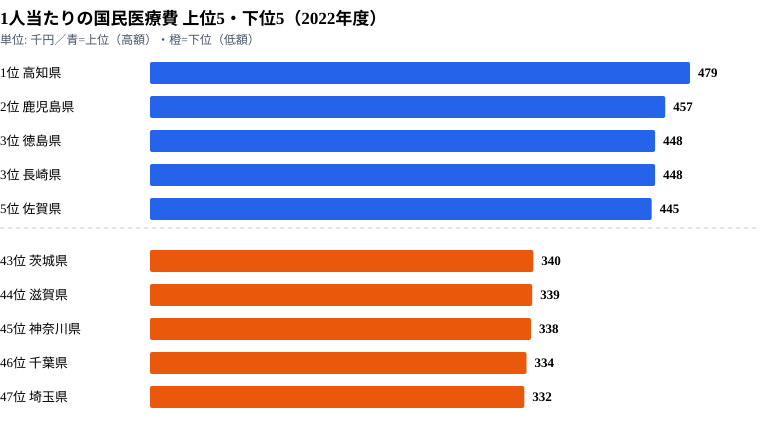

## 地図で見る統計のインパクト

棒グラフやヒートマップは「数値の大小」を直感的に伝えるのが得意ですが、**「地理的な偏り」を見せるなら地図に勝るものはありません**。たとえば「西日本のほうが医療費が高いのか？」「首都圏は本当に医療費が低いのか？」といった問いは、47本の棒グラフよりも、47都道府県を塗り分けた1枚の地図のほうが数十倍速く答えてくれます。

実際、1人当たりの国民医療費（2022年度）を見ると、1位の高知県は479千円、最下位の埼玉県は332千円で、上位は四国・九州、下位は関東の都県という**くっきりした西高東低**が浮かび上がります。住んでいる県が違うだけで、1人あたりの医療費がこれだけ変わるのです。この「地理的な偏り」を最短で読者に届ける手段がコロプレス地図です。

本シリーズ Part 1〜4 では、棒グラフ・ヒートマップ・折れ線といった「**直交座標系のチャート**」を Claude Code で量産する方法を扱ってきました。今回の Part 5 で初めて、**地理空間データ（GIS）** に踏み込みます。

地理空間データは、これまで「専門知識がないと触れない領域」でした。ESRI Shapefile、座標参照系（CRS）、投影法（projection）、トポロジー保持型の簡素化（topology-preserving simplification）……用語からして取っ付きづらいものです。ですが、Claude Code のような AI コーディング支援ツールを横に置けば、**「地理データの全体像を 1 時間で掴み、コロプレス地図を本番投入できるレベルまで持っていく」** ことが現実的になります。

本記事のゴールは次の 3 点です。

1. **e-Stat API から都道府県別国民医療費を取得**し、47都道府県のデータを手元に揃える
2. **dataofjapan/land の TopoJSON** を入手し、必要に応じて Claude Code に頼んで簡素化する
3. **D3-geo + TopoJSON-client** で、医療費を色の濃淡で塗り分けたコロプレス地図を SVG で描画する

完成イメージは、日本地図がブラウザに表示され、医療費が高い県は濃い赤、低い県は淡い赤で塗られ、ホバーすれば県名と金額が出る、という形になります。

そのパイプライン全体は、次の流れに整理できます。

1. **e-Stat API** から都道府県別医療費の生データ（JSON）を取得する
2. 取得した JSON を、都道府県コードをキーにした **値マップ** に整形する
3. **TopoJSON**（都道府県の輪郭ポリゴン）を入手し、必要なら簡素化する
4. 値マップと TopoJSON を結合し、**D3-geo で SVG の地図** として描画する

今回のキモは「**Claude Code に TopoJSON の整形を丸投げできるか**」という一点に尽きます。先に結論を言うと、**ほぼ丸投げできます**。ただし「地域コードの結合キー」「投影法の選択」「離島の配置」の 3 つだけは、人間側が判断材料を持っておかないと AI に良い指示が出せません。この記事ではそこも丁寧に解説していきます。

---

## 使うデータ: 都道府県別国民医療費

厚生労働省が毎年公表する「**国民医療費**」は、その年度に国民が医療機関等で治療を受けた費用を全国・都道府県別に推計したものです。e-Stat 上では「国民医療費」という統計調査として整備されており、statsCode `30001` 配下の各統計表に格納されています。

今回は分かりやすさを優先して、以下のような指標を使います。

- **人口一人当たり国民医療費（都道府県別）** — 単位は千円/人。高齢化率が高い県（高知・鹿児島・長崎など）で高くなる傾向があります
- **国民医療費総額（都道府県別）** — 単位は億円。人口に比例するため東京・大阪・神奈川が上位に来ます
- **後期高齢者医療費（都道府県別、参考）** — 単位は億円。高齢化率と相関します

コロプレス地図で見せるなら **「人口一人当たり」のほうが圧倒的に面白い**です。総額だと「人口が多い県＝医療費が多い」という当たり前の結論しか出てきませんが、一人当たりにすると「西高東低」「島嶼部での突出」といった構造が浮き上がってきます。

実際の 1 人当たり国民医療費（2022年度）を上位5県・下位5県で並べると、次のようになります。



上位は高知（479千円）・鹿児島（457千円）・徳島と長崎（ともに448千円・同率3位）・佐賀（445千円）と、四国・九州が占めます。下位は茨城（340千円）・滋賀（339千円）・神奈川（338千円）・千葉（334千円）・埼玉（332千円）で、関東の都県を中心に若年人口の多い地域が並びます。最大の高知と最下位の埼玉の差は約1.44倍。「高齢化率の高い地方ほど 1 人あたり医療費が高く、若年層比率の高い都市圏ほど低い」という構造が、数字にそのまま表れています。これがまさに、地図で塗り分けると「西高東低」として一目で伝わる傾向です。だからこそ、棒グラフより地図にする価値が高い指標だと言えます。

<source-link href="/ranking/national-medical-expense-per-person">1人当たりの国民医療費ランキングをもっと見る</source-link>

統計表のメタ情報は事前に `/inspect-estat-meta` 系のスキルで眺めておくと良いです。e-Stat の同じ統計調査でも統計表ごとに「都道府県別」「年齢階級別」「制度別」など切り口が異なるため、**「人口一人当たり × 都道府県 × 直近年度」** が揃った表を 1 本選ぶのが地味に重要です。

> [!NOTE]
> 本記事のコード例で示す statsDataId `0003411111` は説明用の**架空の例**です。実際に試すときは `/search-estat` で「人口一人当たり 国民医療費 都道府県」のキーワードで検索し、最新の `statsDataId` を取得してから差し替えてください。コード内の ID を架空のまま実行すると 404 やエラーになります。

医療費というテーマは、読者の生活実感と直結します。地図で「自分の県がどの濃さか」を見せると、回遊や滞在につながりやすいのも、この指標を Part 5 の題材に選んだ理由です。

---

## Step 1: TopoJSON を入手する

コロプレス地図を描くには、**「都道府県の輪郭ポリゴン」** をどこかから持ってこないといけません。日本の都道府県境界データは、無料で入手できる代表的な選択肢が 3 つあります。

- **dataofjapan/land（GitHub）** — TopoJSON 形式、約 250KB。軽量で 47 都道府県の ID 付き、すぐ使えます
- **国土数値情報「行政区域」** — Shapefile 形式、約 200MB。公式・最新で市区町村まで含みますが巨大です
- **Natural Earth（Admin 1）** — Shapefile/GeoJSON 形式、約 5MB。国際標準で世界全体を含み、日本部分のみ抽出できます

**Web フロントで使うなら、ほぼ確実に dataofjapan/land 一択**です。軽量で TopoJSON、しかも各都道府県に `id` プロパティが付いています。国土数値情報は精度が高いですが、市区町村レベルで塗り分けたい場合や、漁港・港湾レイヤと重ねたいときに改めて検討すれば良いでしょう。

ダウンロードはシンプルに curl で落とせます。

```bash
mkdir -p public/geo
curl -L -o public/geo/japan.topojson \
  https://raw.githubusercontent.com/dataofjapan/land/master/japan.topojson

# 軽量化の確認
ls -lh public/geo/japan.topojson
# -rw-r--r--  1 user  staff   245K  ...  japan.topojson
```

このファイルがそのまま使えるなら 247KB は許容範囲ですが、もう少し削りたい場合は **TopoJSON の simplify** をかけます。ここで Claude Code の出番です。

```text
あなた:
public/geo/japan.topojson があります。これを mapshaper で
- 元のトポロジーを保ったまま頂点を 30% に削減
- Visvalingam (weighted area) アルゴリズムを使う
- 出力は public/geo/japan-simplified.topojson
というワンライナーで簡素化してください。Node.js の mapshaper を
npm script で叩く形にしたいです。

Claude Code:
package.json に以下のスクリプトを追加します:

  "scripts": {
    "geo:simplify": "mapshaper public/geo/japan.topojson -simplify visvalingam weighted 30% -o public/geo/japan-simplified.topojson format=topojson"
  }

実行前に: npm i -D mapshaper
実行後のサイズ: 約 90KB（元の 1/3）になる想定です。
```

mapshaper は CLI と JS API の両対応で、`-simplify` オプションの引数（`dp` ダグラス・ピューカー法、`visvalingam` 加重面積法など）の使い分けは慣れが必要です。Claude Code は **「Visvalingam の weighted を使え」「トポロジーを保て」** といった微妙なオプション選択も、目的を伝えれば適切に出してくれます。

簡素化後の TopoJSON の構造は、おおよそ次のような形になります。

```json
{
  "type": "Topology",
  "arcs": [
    [[100, 200], [101, 201], [102, 203]],
    [[200, 300], [201, 301]]
  ],
  "transform": {
    "scale": [0.0001, 0.0001],
    "translate": [122.0, 24.0]
  },
  "objects": {
    "japan": {
      "type": "GeometryCollection",
      "geometries": [
        {
          "type": "MultiPolygon",
          "id": 1,
          "properties": { "nam": "Hokkaido", "nam_ja": "北海道" },
          "arcs": [[[0, 1, 2]]]
        },
        {
          "type": "MultiPolygon",
          "id": 13,
          "properties": { "nam": "Tokyo", "nam_ja": "東京都" },
          "arcs": [[[5, 6]]]
        }
      ]
    }
  }
}
```

ここで超重要なのが **`id` フィールド**です。dataofjapan/land の TopoJSON は `id` に **JIS 都道府県コード（1〜47）** が入っています。北海道が `1`、東京都が `13`、沖縄県が `47`。後で医療費データと結合する際の結合キーになります。

> [!WARNING]
> dataofjapan/land の `id` は **JIS コードの整数（1〜47）**、e-Stat 側の `areaCode` は **5桁文字列（"01000"〜"47000"）** です。型が違うため、`areaCode === id`（文字列 vs 数値）で結合すると **全件マッチに失敗し、地図が真っ白**になります。後述のとおり `parseInt(areaCode.slice(0, 2), 10)` で整数化してから結合してください。これがコロプレス地図で最も多い事故です。

---

## Step 2: Claude Code に「医療費データ取得」を頼む

データ取得側は本シリーズ Part 2 でセットアップした e-Stat スキルがあれば、ワンライナーで終わります。スキルがない場合でも、Claude Code に以下のように頼めば 5 分でクライアントコードが出てきます。

```text
あなた:
e-Stat API で「人口一人当たり国民医療費（都道府県別、最新年度）」を取得して、
[{ areaCode: "01000", areaName: "北海道", value: 425.3 }, ...] という
配列に整形して data/medical-cost-per-capita.json に保存するスクリプトを書いて。

仕様:
- statsDataId は 0003411111 (例)
- e-Stat API キーは process.env.ESTAT_API_KEY
- 都道府県コードは5桁(01000〜47000)で取得し、そのまま areaCode に入れる
- 値が "***" や "-" の場合は null にして除外
- TypeScript で書く、tsx で実行できる形

Claude Code:
scripts/fetch-medical-cost.ts を作成します。
（コード省略・約 60 行）

実行: npx tsx scripts/fetch-medical-cost.ts
出力: data/medical-cost-per-capita.json (47 件 + メタ情報)
```

ポイントは「**areaCode を 5 桁文字列で持つ**」と明示することです。e-Stat の API は地域コードを 2 桁・5 桁・6 桁などのバリエーションで返してくることがあり、後段の地図結合で必ずトラブルになります。社内ルール（`.claude/rules/estat-api.md`）でも 5 桁固定を推奨しています。

出力 JSON は、おおよそ次のような構造になります（下記の `data` は**抜粋4件、実際は47件**入ります）。

```json
{
  "meta": {
    "statsDataId": "0003411111",
    "indicator": "人口一人当たり国民医療費",
    "unit": "千円",
    "year": "2023年度",
    "fetchedAt": "2026-05-22T10:30:00+09:00"
  },
  "data": [
    { "areaCode": "01000", "areaName": "北海道", "value": 425.3 },
    { "areaCode": "02000", "areaName": "青森県", "value": 415.8 },
    { "areaCode": "13000", "areaName": "東京都", "value": 372.6 },
    { "areaCode": "47000", "areaName": "沖縄県", "value": 392.1 }
  ]
}
```

47 行きっちり揃っているか、`jq '.data | length'` で確認しておきましょう。1 件でも欠けると地図に「白い穴」が空きます。

> [!TIP]
> 上記コード例の値（425.3 など）はコードの書き方を示すための仮の数値です。実データの感覚を掴みたいときは、本記事冒頭の SVG（高知479千円〜埼玉332千円）を基準にしてください。e-Stat の年度や統計表によって絶対値は変わりますが、**地方が高く首都圏が低い順序関係**はおおむね共通します。

---

## Step 3: 地域コード（5桁）と都道府県名のマッチング — id 結合の罠

ここが **コロプレス地図でいちばん事故りやすいポイント**です。データ側と地図側のマッチ方法を整理しておきます。

- `areaCode: "01000"`（5桁文字列） と `id: 1`（整数） — `parseInt` して数値同士で比較する
- `areaCode: "13000"` と `id: 13` — `parseInt(areaCode.slice(0, 2), 10)` で上2桁を整数化して比較する
- `areaName: "北海道"` と `properties.nam_ja: "北海道"` — 文字列同士の完全一致だが表記揺れに注意

**結論として、`areaCode` を `parseInt(code.slice(0, 2), 10)` で 1〜47 の整数に変換して、TopoJSON の `id` と結合する**のがいちばん安全です。都道府県名で結合すると「神奈川県」vs「神奈川」、「東京都」vs「東京」のような表記ゆれで詰みます。

Claude Code に頼むときは、この変換ルールを明示しておきます。

```text
あなた:
data/medical-cost-per-capita.json を読み込んで、
{ [prefId: number]: { name: string, value: number } } という
Map に整形してください。prefId は areaCode の上2桁を数値化したもの。

Claude Code:
const raw = await Bun.file("data/medical-cost-per-capita.json").json();
const valueMap = new Map<number, { name: string; value: number }>();
for (const row of raw.data) {
  const prefId = parseInt(row.areaCode.slice(0, 2), 10);
  valueMap.set(prefId, { name: row.areaName, value: row.value });
}
return valueMap;
```

この Map を地図描画関数に渡せば、`feature.id` で値を引けるようになります。1人当たり医療費のように都道府県の data も別ソースの地図 data も「47件ぴったり」が前提なので、件数チェックと結合キーの整合さえ通れば、残りは描画の問題に収束します。

---

## Step 4: D3-geo で地図を描画する

ここから D3 の世界です。インストールは以下の 3 パッケージで足ります。

```bash
npm i d3-geo d3-scale d3-array topojson-client
npm i -D @types/d3-geo @types/d3-scale @types/d3-array @types/topojson-client
```

`d3-geo` の核心は **projection（投影法）** です。地球は球体ですが画面は平面なので、必ず何らかの投影が必要になります。日本地図でよく使う候補を比較します。

- **Mercator（`geoMercator`）** — Web 地図のデファクト。高緯度で面積が誇張され、北海道がやや大きく見えます
- **Conic Equal Area（`geoConicEqualArea`）** — 円錐図法。面積が正確で自然に見え、面積比較に向きます
- **Equirectangular（`geoEquirectangular`）** — 緯度経度を直接 x/y にマップする単純な図法ですが、歪みが目立ちます
- **Mercator（center 調整）** — `geoMercator` に中心と縮尺を手動指定し、日本列島に最適化したもの

**コロプレス地図で「西高東低」のような面積比較をしたいなら `geoConicEqualArea` が最適**です。Mercator は北に行くほど面積が拡大されるので、北海道が実態以上に「医療費総額の大きさ」を演出してしまいます。一人当たり指標なら Mercator でも誤解は起きづらいですが、無難に Conic で行くのが本記事の推奨です。

完全実装は、おおよそ次のようになります。

```javascript
// src/components/MedicalCostChoropleth.jsx
import { useEffect, useRef } from "react";
import { geoConicEqualArea, geoPath } from "d3-geo";
import { scaleQuantize } from "d3-scale";
import { interpolateReds } from "d3-scale-chromatic";
import { feature } from "topojson-client";

export function MedicalCostChoropleth({ topology, valueMap }) {
  const svgRef = useRef(null);
  const width = 800;
  const height = 600;

  useEffect(() => {
    if (!svgRef.current || !topology) return;

    // TopoJSON -> GeoJSON FeatureCollection
    const japan = feature(topology, topology.objects.japan);

    // 日本列島を中心に投影
    const projection = geoConicEqualArea()
      .parallels([34, 40])         // 日本の南北の代表緯度
      .rotate([-135, 0])           // 中心経度 135度（明石）
      .center([0, 36])             // 中心緯度 36度（関東〜中部）
      .scale(2400)
      .translate([width / 2, height / 2]);

    const pathGenerator = geoPath(projection);

    // 医療費の min/max からカラースケールを構築
    const values = japan.features
      .map((f) => valueMap.get(f.id)?.value)
      .filter((v) => v != null);
    const min = Math.min(...values);
    const max = Math.max(...values);

    const colorScale = scaleQuantize()
      .domain([min, max])
      .range([
        "#fee5d9", "#fcbba1", "#fc9272",
        "#fb6a4a", "#ef3b2c", "#cb181d", "#99000d",
      ]);

    // SVG 描画（生 DOM 操作。React で書くなら map に置き換え）
    const el = svgRef.current;
    el.innerHTML = "";
    el.setAttribute("viewBox", `0 0 ${width} ${height}`);

    for (const f of japan.features) {
      const value = valueMap.get(f.id)?.value;
      const fill = value != null ? colorScale(value) : "#eee";

      const path = document.createElementNS(
        "http://www.w3.org/2000/svg", "path"
      );
      path.setAttribute("d", pathGenerator(f));
      path.setAttribute("fill", fill);
      path.setAttribute("stroke", "#fff");
      path.setAttribute("stroke-width", "0.5");
      path.setAttribute("data-pref-id", String(f.id));
      path.setAttribute("data-value", String(value ?? ""));
      el.appendChild(path);
    }
  }, [topology, valueMap]);

  // 描画先の SVG 要素を返す（JSX: ref={svgRef} を付けた svg 要素 1 つ）
  return React.createElement("svg", { ref: svgRef, className: "w-full h-auto" });
}
```

ここでのデザイン判断ポイントは 3 つです。

1. **`parallels([34, 40])`** — 日本列島の南北を覆う代表緯度を 2 本指定します。緯度に近いほど歪みが小さくなります
2. **`rotate([-135, 0])`** — 中心経度 135 度（兵庫県明石市）に座標系を回転します。負の値なので注意してください
3. **`scale(2400)`** — 縮尺です。画面幅に応じて 1500〜3000 程度で調整します

このパラメータも Claude Code に「日本列島を 800x600 の SVG にきれいに収めて」と頼めば、上記のような値を提案してくれます。**「日本地図のための魔法の数字」を覚える必要はありません**。完成イメージは、本記事冒頭の上位5・下位5 チャートと同じ順序（高知が最も濃く、埼玉が最も淡い）の塗り分けが、47都道府県分の輪郭に展開される形になります。

---

## Step 5: 都道府県を医療費でカラー塗りする

カラースケールの設計は、コロプレス地図の「**読みやすさ**」を 80% 決める要素です。やってしまいがちな失敗を 3 つ挙げます。

1. **連続スケール（`scaleLinear` + interpolateReds）で塗る** — 微妙な差が人間の目で識別できなくなります
2. **均等区間（`scaleQuantize`）で 5 段階に塗る** — 外れ値（高知・東京）に引っ張られて中間が潰れます
3. **七色のレインボーで塗る** — どっちが大きいのか直感的に分からなくなります

**おすすめは `scaleQuantize` で 7 段階に区切り、単色グラデーション（Reds, Blues, Greens）を使う**ことです。今回の医療費なら「赤＝高い、白＝低い」が自然です。

外れ値対策としては、`scaleQuantile`（パーセンタイル区切り）を使う手もあります。`scaleQuantize` が「値域を等分」するのに対し、`scaleQuantile` は「データの数を等分」するため、外れ値の影響を受けにくくなります。47都道府県のような少数データセットでは `scaleQuantize` で十分なケースが多いですが、極端な突出県がある場合は `scaleQuantile` か手動の閾値配列を検討します。

```javascript
// 外れ値に強いパーセンタイルベース
import { scaleQuantile } from "d3-scale";
const colorScale = scaleQuantile()
  .domain(values)  // 全データを渡す
  .range(["#fee5d9", "#fcbba1", "#fc9272", "#fb6a4a", "#ef3b2c", "#cb181d", "#99000d"]);
```

凡例も必ず付けます。色だけでは「どの色が何千円か」が分かりません。SVG 内に小さな矩形を 7 個並べて、`colorScale.thresholds()` で取得した閾値を下に書くだけです。

```javascript
// 凡例描画（抜粋）
const legend = svgRef.current.querySelector("g.legend") ?? createLegendGroup();
const thresholds = colorScale.thresholds?.() ?? [];
const swatchW = 30, swatchH = 12;
colorScale.range().forEach((color, i) => {
  // 色矩形
  const rect = createSvgEl("rect", {
    x: 600 + i * swatchW, y: 540,
    width: swatchW, height: swatchH, fill: color,
  });
  legend.appendChild(rect);
  // 閾値ラベル（右側のみ）
  if (i < thresholds.length) {
    const t = createSvgEl("text", {
      x: 600 + (i + 1) * swatchW, y: 540 + swatchH + 10,
      "font-size": 9, "text-anchor": "middle",
    });
    t.textContent = Math.round(thresholds[i]).toString();
    legend.appendChild(t);
  }
});
```

医療費のように上位5県（479〜445千円）と下位5県（340〜332千円）の間に明確な差がある指標は、7 段階の単色グラデーションで十分に「西高東低」が伝わります。段階数を増やしすぎると、隣接県の濃淡差が読み取れなくなる点には注意してください。

---

## Step 6: ツールチップで詳細表示

コロプレス地図で「だいたいの傾向」は色から伝わります。ですが「東京は実際いくらなの？」「島根は？」といった具体値は、**ホバーで出すツールチップ**で補います。

SVG 内に `<title>` 子要素を入れるだけでも、ブラウザネイティブのツールチップは出ます。最小実装としてはこれで十分です。

```javascript
// path の中に <title> を入れる
const titleEl = document.createElementNS(
  "http://www.w3.org/2000/svg", "title"
);
titleEl.textContent = value != null
  ? `${valueMap.get(f.id).name}: ${value.toLocaleString()} 千円`
  : `${valueMap.get(f.id)?.name ?? "—"}: データなし`;
path.appendChild(titleEl);
```

リッチなツールチップ（カスタム HTML、グラフ画像、複数指標）を出したい場合は、`mousemove` イベントで絶対配置の `<div>` を表示する形に拡張します。`pointer-events: none` を忘れずに付けないと、ツールチップ自体がホバー判定を奪って点滅してしまいます。

医療費の地図では、ツールチップに「県名 + 1人当たり医療費（千円）」を出すだけでも、読者が自分の県の数字をその場で確認できて満足度が上がります。さらに踏み込むなら、本記事冒頭のランキングへのリンクを併せて置くと、地図から詳細ページへの回遊につながります。

---

## つまずきポイント 3 選

ここまでがハッピーパスです。実際にやると詰まる落とし穴を 3 つ挙げます。

### 1. TopoJSON のサイズ問題

dataofjapan/land の生 TopoJSON は約 250KB ですが、本番では Brotli/Gzip 圧縮で 60-80KB になるので意外と許容範囲です。ただし「市区町村レベル」「世界地図に日本を重ねたい」となるとサイズが数 MB に跳ね上がります。ケース別の対応は次のとおりです。

- **都道府県 47 のみ（〜250KB）** — そのまま使えます
- **市区町村 1741 含む（5〜20MB）** — mapshaper で 10% 程度に simplify し、地域別に分割配信します
- **世界地図 + 日本詳細（50MB+）** — ベクタータイル化（Mapbox / MapLibre）を検討します

mapshaper の `-simplify` でほとんどの場合は解決します。Claude Code に「サイズを 50KB 以下にして」と頼むと、適切な percentage を試行錯誤してくれます。

### 2. Visvalingam vs ダグラス・ピューカー

簡素化アルゴリズムは大きく 2 系統あります。

- **Visvalingam-Whyatt（weighted area）** — 「面積が小さい三角形の頂点を削る」発想。**自然な見た目を保ちやすい**です
- **Douglas-Peucker（dp）** — 「直線からの距離が小さい頂点を削る」発想。**シャープに直線化される**傾向です

コロプレス地図のように **見た目重視** なら Visvalingam 一択です。地形図のように **直線性を保ちたい** ならダグラス・ピューカーを使います。迷ったら Visvalingam にしておけば良いでしょう。

### 3. Mercator は北海道を大きく見せる

`geoMercator` は緯度が高いほど面積が拡大される投影法です。日本国内であっても、北海道（北緯 41〜45 度）と沖縄（北緯 24〜27 度）では地図上の見え方が変わります。

- **Web 地図風の見た目で OK** — `geoMercator` を使います
- **面積比較を厳密に** — `geoConicEqualArea`（Albers 系）を使います
- **緯度経度をそのまま** — `geoEquirectangular`（あまり推奨しません）

医療費の「総額」を見せるなら面積感が誤解を生むので Conic、「一人当たり」なら色で語るので Mercator でも問題ない、というのが個人的な使い分けです。

### 番外: 北海道・沖縄の配置

本格的な日本地図では、**沖縄を本州の左下にインセット表示**するレイアウトをよく見ます。dataofjapan/land の TopoJSON は実際の経度通りに沖縄が右下に配置されているので、デフォルトでは横長の地図になります。

インセット表示が必要なら、沖縄だけ別の projection で描画して合成するか、TopoJSON 自体を編集して座標を移動します。本記事では「素直に表示」の方針で、本州の南西に沖縄が配置される横長レイアウトのまま採用しています。インセット化は Claude Code に「沖縄を本州の左下に移動した形で SVG を組んで」と頼めば、レイヤー合成のコードを返してくれます。

---

## 次回予告: Part 6 散布図で多次元データ

ここまでで「**1 つの指標を地理的に塗り分ける**」までができました。次の Part 6 では、**「2 つの指標の相関を散布図で見る」** ことに踏み込みます。たとえば「高齢化率 × 医療費」を 47 都道府県の点で打てば、強い正の相関が一目で分かります。回帰直線も Claude Code に引かせます。

予定トピックは次のとおりです。

- e-Stat から異なる統計表 2 つを取得して結合する
- `d3-scale` の linear / log の使い分け
- ラベル衝突（point label overlap）の回避テクニック
- 相関係数を計算して表示する（Pearson / Spearman）

地図と散布図が揃えば、ブログ記事の **「探索 → 検証」のセット** が組めるようになります。Part 5（地図）で「地理的傾向に気付く」、Part 6（散布図）で「相関で裏付ける」、という流れです。この医療費の例で言えば、地図で気付いた「西高東低」を、Part 6 で高齢化率との散布図にぶつけて裏付ける、という連携になります。

なお、本記事のシリーズは [Part 4: 高齢化率ヒートマップ](/blog/cc-estat-04-aging-heatmap) から続いており、次は [Part 6: 県民所得と教育費の散布図](/blog/cc-estat-06-income-scatter) に進みます。社会保障まわりの指標をまとめて眺めたい場合は [社会保障カテゴリの一覧](/category/socialsecurity) も合わせてどうぞ。

---

地理データは「専門家の領域」と思われがちですが、TopoJSON + d3-geo の組み合わせさえ理解できれば、**コロプレス地図の制作コストは棒グラフと大差ありません**。むしろ「地図にすることで初めて見えてくる傾向」が多いため、統計コンテンツの引き出しを増やす意味で投資価値は高いと言えます。

Claude Code は projection の選択・simplify の調整・凡例レイアウト・ツールチップ実装といった「**面倒だが定型的な作業**」を引き受けてくれます。人間側は「**どの指標を地図にすると面白いか**」「**どの投影法が誤解を生まないか**」というメタな判断に集中できます。これが AI 時代のデータビジュアライゼーション制作です。

## データ出典

- 厚生労働省「国民医療費」（1人当たりの国民医療費・都道府県別、2022年度）
- e-Stat（政府統計の総合窓口）経由で整備
