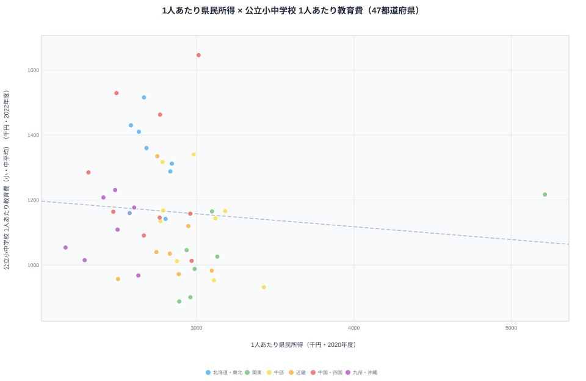

## 1. 導入：散布図を描いたら予想が外れた

「県民所得が高い県は、子ども 1 人あたりの教育費も多いのか？」

直感的には「Yes」と答えたくなるテーマです。ところが 47 都道府県を 1 枚の散布図にプロットしてみると、予想とは逆の絵が出てきます。今回 e-Stat から取った実データで相関係数を計算すると、**r = -0.10** とほぼ無相関、わずかにマイナス寄りでした。所得が突出して高い東京都は教育費が中位どまりで、所得が中位の徳島県が教育費 1 位という、直感に反する並びになります。

この記事では、その「直感に反する散布図」を Claude Code × e-Stat API で再現するまでを Part 6 として扱います。これまでの Part 3〜5 では棒・ヒートマップ・コロプレスといった「1 指標を 47 県に展開する」型のチャートを扱ってきました。今回は **2 つの指標を組み合わせて相関を見る** 段階に踏み込みます。

具体的には以下を Claude Code に任せて、最終的に「47 点プロット + 回帰直線 + 相関係数」を含む 1 枚の散布図を完成させます。

- 県民経済計算（1 人あたり県民所得）を 47 都道府県分取得する
- 地方教育費調査（公立小中学校 1 人あたり教育費）を同じく 47 県分取得する
- 都道府県コードをキーに 2 つのテーブルを結合する
- D3.js で散布図と回帰直線を描く
- ピアソンの相関係数 r と決定係数 R² を算出してチャート上に表示する

ゴールはコードの動作ではなく、「散布図 + 相関」というデータ分析の定番作業を、Claude Code に統計表 ID を渡すところから一気通貫で頼めるようになることです。そして最後に、出てきた数値を「相関がある／ない」とどう読むかまで踏み込みます。最後まで読めば、自分のテーマで同じワークフローをすぐ回せます。

> [!TIP]
> 想定読者は Claude Code 未経験のソフトウェアエンジニアです。Python か Node.js のどちらかが書ければ十分で、統計の事前知識は「平均と標準偏差を聞いたことがある」程度で構いません。相関係数の式自体も Step 5 で Claude Code に書かせます。

## 2. 使うデータ：県民所得と教育費

今回扱う 2 つの統計表を先に押さえておきます。e-Stat の中でも比較的扱いやすく、47 県横並びで値が揃うので、散布図の素材として優秀な組み合わせです。

### 2-1. 県民経済計算（1 人あたり県民所得）

「県民所得」と一口に言っても、e-Stat 上では複数の系列があります。今回は **1 人あたり県民所得（千円）** を採用します。世帯ベースではなく人口で割っているので、47 県を横並びで比較する際の標準指標としてよく使われる値です。本記事で実際に取得した最新確報年は **2020 年度** で、単位は千円、地域は 47 都道府県です。

### 2-2. 地方教育費調査

教育費側は、文部科学省の **地方教育費調査** を使います。この調査は公立学校への支出をベースにしているので私立部分を含みませんが、47 県横並びで揃う数少ない教育系統計です。今回は公立小学校と公立中学校それぞれの「児童生徒 1 人当たり学校教育費」を取得し、小・中の単純平均を 1 人あたり教育費として扱います。最新年は **2022 年度** です。

> [!WARNING]
> 県民所得（2020 年度）と教育費（2022 年度）は最新確報年がそろっていません。県民経済計算は確報の公表が遅く、地方教育費調査より 1〜2 年古いのが通例です。本来は同一年度にそろえるのが理想ですが、両者とも 47 県が揃う最新年を優先しました。この 2 年のズレが結論を覆すほど大きくない点は後述しますが、論文や提案資料に使う際は年度の不一致を必ず注記してください。

### 2-3. なぜこの 2 つを並べるのか

経済力と教育費の関係を見るとき、よく出てくる仮説は次の 3 つです。本記事の散布図は、このうちどれが実態に近いかを検証する装置になります。

1. **比例仮説**：所得が高い県ほど税収が増え、教育予算も増える（＝正の相関が出る）
2. **過疎補正仮説**：人口が少ない県は児童 1 人あたりに按分される教育費が逆に大きくなる（＝負またはゼロの相関）
3. **無相関仮説**：地方交付税で全国が調整されているので、実は所得との関係は弱い

散布図 + 相関係数を 1 枚にまとめると、この 3 つのうち実態に近いのはどれかを目視と数値の両方で判定できます。Claude Code に「2 つの統計表を取って結合して散布図と相関を出して」と頼めば、この検証が 30 分以内で終わります。結論を先に言うと、今回のデータでは **比例仮説が外れ、過疎補正仮説と無相関仮説が支持されました。**

本記事で組み立てるパイプラインは、おおまかに次の 5 ステップです。

1. e-Stat 検索で statsDataId を 2 つ確定する
2. Claude Code に 2 系列の並列取得を依頼する
3. prefecture code で 2 つのテーブルを結合する
4. D3 で散布図 + 回帰直線を描く
5. ピアソン r と R² を算出して図に描き込む

## 3. Step 1-2：2 つの statsDataId を取得して並列ダウンロード

ここからは Claude Code を実際に動かしていきます。前提として、e-Stat の API キーを取得済みで `~/.zshrc` などに `ESTAT_APP_ID` を書いてあるものとします（取得手順は[Part 2 / e-Stat 検索スキルを書かせる回](https://stats47.jp/blog/cc-estat-02-search-skill)を参照してください）。

### 3-1. statsDataId を 2 つ確定する

まずプロジェクトのルートで Claude Code を起動します。

```bash
claude
```

最初の指示はシンプルに、対象データの statsDataId を 2 つとも特定するところまで任せます。

```text
以下 2 つの統計表の statsDataId を e-Stat 政府統計の総合窓口で
特定してください。確定したら表名・年度・データ件数も併せて報告してください。

1. 県民経済計算 / 1 人当たり県民所得（千円、47 都道府県、最新確報年）
2. 地方教育費調査 / 公立小中学校 児童生徒 1 人当たり学校教育費（千円、47 都道府県、最新年）

両方とも 47 件揃う最新年度を選び、年度がそろわない場合は
各統計の最新確報年をそのまま採用し、年度の差を報告してください。
```

Claude Code は e-Stat の API を叩いて該当する `statsDataId` を返してきます。返ってくる内容は「指標名・statsDataId・年度・件数」の 4 点セットです。実行時点の確報年に応じて年度がズレることがあるので、報告に含まれる年度を必ず確認します。

> [!NOTE]
> 県民経済計算と地方教育費調査では確報の公表サイクルが違うため、「両方を最新で取ると年度がそろわない」のがむしろ通常です。プロンプトで「年度の差を報告して」と明示しておくと、Claude Code が黙って違う年度を混ぜてしまう事故を防げます。年度を強制統一するか、ズレを許容して注記するかは、ここで人間が判断します。

実例集 Part 2 で作った「statsDataId 検索スキル」を流用すると、この段階だけで 1 ターン分のコンテキストが節約できます。スキル化してあると Claude Code が「検索 → 候補列挙 → 選定理由まで含めた表で報告」を一気にやってくれるので、再現性が一気に上がります。

### 3-2. 「両方取って」とまとめて頼む

ID が確定したら、2 系列を並列で取得します。1 系列ずつ取ってもよいのですが、Claude Code 経由なら 1 プロンプトで終わらせた方がコンテキストが圧倒的に短くなります。

```text
さきほど確定した 2 つの statsDataId について、
それぞれ 47 都道府県分のデータを取得してください。

要件:
- 47 都道府県すべて含まれていることを確認すること
- 各レコードは { prefCode, prefName, value } の形に整形
- 結果は scripts/fetch-income-edu.mjs に保存
- 取得直後に prefCode の重複と件数 (47) をアサート
- 出力は data/income.json と data/education.json の 2 ファイル

並列で取得して構いません。403 / 429 が出たらリトライを 2 回まで挟んでください。
```

ポイントは「並列でいい」「件数と prefCode 重複をアサート」と書くことです。これを書かないと逐次取得 + 検証なしのコードになりがちで、後段の結合で 46 件しかなかったりして詰みます。

Claude Code が出してくるスクリプトはおおよそ次のような構造になります。

```javascript
// scripts/fetch-income-edu.mjs
import fs from "node:fs/promises";

const APP_ID = process.env.ESTAT_APP_ID;
const ENDPOINT = "https://api.e-stat.go.jp/rest/3.0/app/json/getStatsData";

const TARGETS = [
  { key: "income", statsDataId: "<確定した県民所得のID>" },
  { key: "education", statsDataId: "<確定した教育費のID>" },
];

async function fetchOne({ key, statsDataId }) {
  const url = `${ENDPOINT}?appId=${APP_ID}&statsDataId=${statsDataId}&lang=J`;
  const res = await fetch(url);
  if (!res.ok) throw new Error(`${key}: HTTP ${res.status}`);
  const json = await res.json();
  return { key, json };
}

function pickLatestYear(values) {
  // @time（年次コード）の最大を採用
  return Math.max(...values.map((v) => Number(v["@time"])));
}

function normalize(json, latestYear) {
  const values = json.GET_STATS_DATA.STATISTICAL_DATA.DATA_INF.VALUE;
  return values
    .filter((v) => Number(v["@time"]) === latestYear)
    .map((v) => ({
      prefCode: v["@area"], // "01000"〜"47000"
      prefName: v["@area_name"] ?? null,
      value: Number(v["$"]),
    }))
    .filter((v) => v.prefCode !== "00000"); // 全国計を除く
}

const [{ json: incomeJson }, { json: eduJson }] = await Promise.all(
  TARGETS.map(fetchOne)
);

const incomeYear = pickLatestYear(
  incomeJson.GET_STATS_DATA.STATISTICAL_DATA.DATA_INF.VALUE
);
const eduYear = pickLatestYear(
  eduJson.GET_STATS_DATA.STATISTICAL_DATA.DATA_INF.VALUE
);

const income = normalize(incomeJson, incomeYear);
const education = normalize(eduJson, eduYear);

console.assert(income.length === 47, `income=${income.length}`);
console.assert(education.length === 47, `edu=${education.length}`);

await fs.writeFile("data/income.json", JSON.stringify(income, null, 2));
await fs.writeFile("data/education.json", JSON.stringify(education, null, 2));
console.log(`income year=${incomeYear}, edu year=${eduYear}`);
```

`pickLatestYear` を 2 系列それぞれに掛けて、年度をログに出しているのがポイントです。県民所得と教育費はリリース時期がズレているので、片方だけ古いということが普通に起きます。年度を黙って混ぜると散布図の解釈が崩れるため、まずは両系列の年度をログで可視化し、そのうえで「そろえるか／ズレを注記するか」を人間が決めます。

## 4. Step 3：prefCode で 2 つを結合する

ここから先は完全に自分のコード側の話で、e-Stat API は登場しません。Claude Code には「結合 + 検査 + 出力」を 1 ファイルにまとめてもらいます。

### 4-1. 結合キーの設計

e-Stat の地域コードは原則として 5 桁の `01000` 〜 `47000` で、都道府県は下 3 桁が `000` です。市区町村統計が混じる API もありますが、今回は都道府県のみのテーブルなのでそのまま結合キーに使えます。結合で踏みやすい罠は次の 4 つです。

- **2 桁 vs 5 桁のズレ**：統計によってはコードが `01` で来ることがあります。取得直後に 5 桁ゼロパディングしてそろえます。
- **全国計の混入**：`00000`（全国）が含まれることがあります。normalize 段階で必ず除外します。
- **県名の揺れ**：「沖縄県」「沖縄」のように表記が割れることがあります。結合は **コード** で行い、表示名は片方の県名を採用します。
- **年度ズレ**：公表時期が違うため、片方だけ年度が新しいことがあります。今回はズレを許容し、後述の callout で注記します。

### 4-2. 結合スクリプト

Claude Code への指示はシンプルです。

```text
data/income.json と data/education.json を prefCode で inner join し、
data/joined.json に書き出してください。

- 出力スキーマ: { prefCode, prefName, income, education }
- prefCode が片方にしか無い場合は warning として stderr に出す
- 47 件揃わなければ非ゼロ終了
```

これで返ってくるのが次のスクリプトです。

```javascript
// scripts/join.mjs
import fs from "node:fs/promises";

const income = JSON.parse(await fs.readFile("data/income.json", "utf-8"));
const education = JSON.parse(await fs.readFile("data/education.json", "utf-8"));

const eduMap = new Map(education.map((d) => [d.prefCode, d]));
const joined = [];
for (const i of income) {
  const e = eduMap.get(i.prefCode);
  if (!e) {
    console.error(`missing edu for ${i.prefCode} ${i.prefName}`);
    continue;
  }
  joined.push({
    prefCode: i.prefCode,
    prefName: i.prefName ?? e.prefName,
    income: i.value,
    education: e.value,
  });
}

if (joined.length !== 47) {
  console.error(`joined=${joined.length}, expected 47`);
  process.exit(1);
}

await fs.writeFile("data/joined.json", JSON.stringify(joined, null, 2));
console.log(`joined ${joined.length} rows`);
```

実行後の `data/joined.json` は次のような構造になります（今回の実データから一部抜粋、所得は 2020 年度・教育費は 2022 年度の小中平均を千円に直した値です）。

```json
[
  { "prefCode": "13000", "prefName": "東京都",   "income": 5214, "education": 1217 },
  { "prefCode": "23000", "prefName": "愛知県",   "income": 3428, "education":  932 },
  { "prefCode": "36000", "prefName": "徳島県",   "income": 3013, "education": 1646 },
  { "prefCode": "11000", "prefName": "埼玉県",   "income": 2890, "education":  888 },
  { "prefCode": "47000", "prefName": "沖縄県",   "income": 2167, "education": 1054 }
]
```

この抜粋だけでも、所得 1 位の東京（5,214 千円）の教育費が 1,217 千円と意外に低めで、所得が中位の徳島（3,013 千円）の教育費が 1,646 千円と全国最高になっている、という逆転が読み取れます。これを散布図にすると一目瞭然になります。

## 5. Step 4：D3 で散布図を描く

ここからは可視化のステップです。Claude Code に「D3 v7 で 47 点プロット + 軸 + 県名ラベル」を頼みます。

### 5-1. プロンプト

```text
data/joined.json を読み込み、D3 v7 で散布図を描いてください。

- 横軸: 1 人あたり県民所得 (千円)
- 縦軸: 1 人あたり学校教育費 (千円)
- 47 点を circle でプロット
- 値が極値の県 5 件のみ県名ラベル
- axes は左下に L 字型
- viewBox=0 0 720 480、SVG を string で返す
- 後ほど回帰直線と相関係数を追記するため、関数を分離して書いてください
  - buildScales(data, w, h)
  - drawAxes(svg, scales)
  - drawPoints(svg, data, scales)
  - drawLabels(svg, data, scales, topN)
```

「関数を分離してください」と書いているのがポイントで、次の Step 5・6 で回帰直線と相関係数を追記する余地を作っておきます。

### 5-2. 期待する出力

Claude Code が返してくるコードはだいたい次のような形になります（読みやすさのためコメント多めで示します）。

```javascript
// scripts/scatter.mjs
import fs from "node:fs/promises";
import * as d3 from "d3";
import { JSDOM } from "jsdom";

const W = 720;
const H = 480;
const MARGIN = { top: 24, right: 24, bottom: 56, left: 64 };

export function buildScales(data, w, h) {
  const x = d3
    .scaleLinear()
    .domain(d3.extent(data, (d) => d.income))
    .nice()
    .range([MARGIN.left, w - MARGIN.right]);
  const y = d3
    .scaleLinear()
    .domain(d3.extent(data, (d) => d.education))
    .nice()
    .range([h - MARGIN.bottom, MARGIN.top]);
  return { x, y };
}

export function drawAxes(svg, { x, y }) {
  const xAxis = d3.axisBottom(x).ticks(6);
  const yAxis = d3.axisLeft(y).ticks(6);

  svg
    .append("g")
    .attr("transform", `translate(0,${H - MARGIN.bottom})`)
    .call(xAxis)
    .append("text")
    .attr("x", W / 2)
    .attr("y", 44)
    .attr("fill", "#334155")
    .attr("text-anchor", "middle")
    .text("1 人あたり県民所得 (千円)");

  svg
    .append("g")
    .attr("transform", `translate(${MARGIN.left},0)`)
    .call(yAxis)
    .append("text")
    .attr("transform", `rotate(-90) translate(${-H / 2},-44)`)
    .attr("fill", "#334155")
    .attr("text-anchor", "middle")
    .text("1 人あたり学校教育費 (千円)");
}

export function drawPoints(svg, data, { x, y }) {
  svg
    .append("g")
    .selectAll("circle")
    .data(data)
    .join("circle")
    .attr("cx", (d) => x(d.income))
    .attr("cy", (d) => y(d.education))
    .attr("r", 5)
    .attr("fill", "#2563eb")
    .attr("fill-opacity", 0.7)
    .attr("stroke", "#1e3a8a")
    .attr("stroke-width", 0.6);
}

export function drawLabels(svg, data, { x, y }, topN = 5) {
  const sortedByX = [...data].sort((a, b) => b.income - a.income).slice(0, 2);
  const sortedByY = [...data].sort((a, b) => b.education - a.education).slice(0, 2);
  const lowestX = [...data].sort((a, b) => a.income - b.income).slice(0, 1);
  const targets = [...new Set([...sortedByX, ...sortedByY, ...lowestX])].slice(0, topN);

  svg
    .append("g")
    .selectAll("text")
    .data(targets)
    .join("text")
    .attr("x", (d) => x(d.income) + 8)
    .attr("y", (d) => y(d.education) - 6)
    .attr("font-size", 11)
    .attr("fill", "#0f172a")
    .text((d) => d.prefName);
}

async function main() {
  const data = JSON.parse(await fs.readFile("data/joined.json", "utf-8"));
  const dom = new JSDOM("<!DOCTYPE html><body></body>");
  const svg = d3
    .select(dom.window.document.body)
    .append("svg")
    .attr("xmlns", "http://www.w3.org/2000/svg")
    .attr("viewBox", `0 0 ${W} ${H}`);

  const scales = buildScales(data, W, H);
  drawAxes(svg, scales);
  drawPoints(svg, data, scales);
  drawLabels(svg, data, scales);

  await fs.writeFile("public/scatter.svg", dom.window.document.body.innerHTML);
  console.log("wrote public/scatter.svg");
}

if (import.meta.url === `file://${process.argv[1]}`) await main();
```

ここまでで「47 点プロット + 軸 + 上位ラベル」までの散布図が完成します。次は同じ図に **回帰直線と相関係数** を追記していきます。実際に今回のデータで描き上げた散布図がこちらです。



横軸の右端に 1 点だけ突出しているのが東京都（所得 5,214 千円）です。ところが縦軸（教育費）で見ると東京は中位どまりで、教育費が最も高いのは縦軸の上端にある徳島県（1,646 千円）です。点群全体が右肩上がりに並んでいないこと、つまり所得が増えても教育費が増える明確な傾向が見えないことが、この散布図の主役になります。横軸の所得は東京・愛知から沖縄まで都道府県ランキングで確認できます。

<source-link href="/ranking/per-capita-prefectural-income-h27">1人あたり県民所得ランキングをもっと見る</source-link>

縦軸の教育費が高い県・低い県の顔ぶれは、小学校・中学校それぞれのランキングで個別に追えます。

<source-link href="/ranking/elementary-school-education-cost-per-student">公立小学校 児童1人あたり教育費ランキングをもっと見る</source-link>

## 6. Step 5：相関係数を計算する

ここが今回の山場です。Claude Code に「ピアソン r の式をコメント付きで書いてくれ」と頼むのは、単に楽というだけでなく、後で読み返したときに「式を理解したうえで使っている」状態を残すために重要です。

### 6-1. プロンプト

```text
data/joined.json に対して、income と education のピアソン相関係数 r を
計算する関数 pearson(xs, ys) を scripts/stats.mjs に作ってください。

要件:
- 引数: 同じ長さの数値配列 2 つ
- 平均・偏差・分散・共分散の中間値は export しなくてよい
- 関数の冒頭に「ピアソン r の定義式」をコメントで明記
- 返り値: { r, r2, n }
- xs.length !== ys.length なら throw
- xs.length < 2 なら NaN を返さず throw
- テストは vitest で 3 ケース（完全相関、無相関、負の相関）
```

「式をコメントに書く」「テストを 3 ケース書く」を必ず指定するのがコツです。これを書かないと「動くがブラックボックスな関数」が出てきて、後で別記事で再利用するときに信用できません。

### 6-2. 期待する出力

```javascript
// scripts/stats.mjs

/**
 * ピアソンの積率相関係数 r:
 *   r = Σ((xi - x̄)(yi - ȳ)) / sqrt(Σ(xi - x̄)^2 * Σ(yi - ȳ)^2)
 * 範囲: -1 ≤ r ≤ 1
 * r^2 (決定係数) は、線形回帰モデルが y の分散をどれだけ説明できているか。
 */
export function pearson(xs, ys) {
  if (xs.length !== ys.length) {
    throw new Error(`length mismatch: ${xs.length} vs ${ys.length}`);
  }
  const n = xs.length;
  if (n < 2) throw new Error(`need at least 2 samples, got ${n}`);

  const mean = (arr) => arr.reduce((a, b) => a + b, 0) / arr.length;
  const mx = mean(xs);
  const my = mean(ys);

  let num = 0;
  let dx2 = 0;
  let dy2 = 0;
  for (let i = 0; i < n; i++) {
    const dx = xs[i] - mx;
    const dy = ys[i] - my;
    num += dx * dy;
    dx2 += dx * dx;
    dy2 += dy * dy;
  }
  const denom = Math.sqrt(dx2 * dy2);
  if (denom === 0) throw new Error("zero variance");

  const r = num / denom;
  return { r, r2: r * r, n };
}
```

テストはこんな形になります。

```javascript
// scripts/stats.test.mjs
import { describe, it, expect } from "vitest";
import { pearson } from "./stats.mjs";

describe("pearson", () => {
  it("完全正の相関で r = 1", () => {
    const { r } = pearson([1, 2, 3, 4], [2, 4, 6, 8]);
    expect(r).toBeCloseTo(1, 6);
  });
  it("完全負の相関で r = -1", () => {
    const { r } = pearson([1, 2, 3, 4], [8, 6, 4, 2]);
    expect(r).toBeCloseTo(-1, 6);
  });
  it("無相関の例で |r| < 0.5", () => {
    const { r } = pearson([1, 2, 3, 4, 5], [3, 1, 4, 1, 5]);
    expect(Math.abs(r)).toBeLessThan(0.5);
  });
});
```

ここまで来ると、`pearson(data.map(d=>d.income), data.map(d=>d.education))` で `{ r, r2, n }` が一発で取れます。

### 6-3. 散布図への描画

Step 4 のスクリプトに、相関係数をテキスト表示する 1 ブロックを追加するだけです。

```javascript
import { pearson } from "./stats.mjs";

const { r, r2, n } = pearson(
  data.map((d) => d.income),
  data.map((d) => d.education)
);

svg
  .append("text")
  .attr("x", W - MARGIN.right)
  .attr("y", MARGIN.top + 12)
  .attr("text-anchor", "end")
  .attr("font-size", 12)
  .attr("fill", "#0f172a")
  .text(`r = ${r.toFixed(3)} (R² = ${r2.toFixed(3)}, n = ${n})`);
```

今回の実データ（所得 2020 年度 × 教育費 2022 年度・47 県）でこれを動かすと、**r = -0.10、R² = 0.01、n = 47** という値が出ます。プラスでもないどころか、わずかにマイナスです。「所得が高い県ほど教育費が多い」という比例仮説は、少なくともこの 2 指標では成り立っていませんでした。具体的な数値は使う系列バージョンや年度で多少動くので、自分の手元でも実行して確かめてみてください。

> [!NOTE]
> r が 0 に近いとき、「データの取り方を間違えたのでは」と疑う前に、まず散布図の点群の形を見てください。今回は点が雲のように広がっていて、明確な直線傾向がありません。これは「計算ミスでゼロになった」のではなく、「本当に相関がない」状態です。一方で点が L 字や曲線に並んでいるのに r が小さい場合は、非線形の関係をピアソン r が捉えきれていない可能性があり、その時こそ取り方を疑います。

## 7. Step 6：回帰直線を引く

相関係数を表示しただけだと「だから何？」感が残るので、回帰直線も同じプロットに重ねます。線形回帰の式は中学生でも分かる範囲なので、Claude Code に書かせる前にざっくり書いておきます。

### 7-1. 単回帰の式

```
y = a + bx
b = Σ((xi - x̄)(yi - ȳ)) / Σ(xi - x̄)^2
a = ȳ - b * x̄
```

ピアソン r の分子と、回帰直線の傾き b の分子はまったく同じです。なので、Step 5 の関数を少しだけ拡張すれば同時に取れます。

### 7-2. プロンプト

```text
scripts/stats.mjs の pearson 関数を拡張し、
linearRegression(xs, ys) を追加してください。

戻り値: { a, b, r, r2, n }  // y = a + b x
内部で同じループを共有して、平均・偏差を 2 回計算しないようにしてください。
```

返ってきたコードを散布図描画に組み込みます。

```javascript
// scatter.mjs の末尾を以下に書き換え
import { linearRegression } from "./stats.mjs";

const { a, b, r, r2, n } = linearRegression(
  data.map((d) => d.income),
  data.map((d) => d.education)
);

const [x0, x1] = d3.extent(data, (d) => d.income);
svg
  .append("line")
  .attr("x1", scales.x(x0))
  .attr("y1", scales.y(a + b * x0))
  .attr("x2", scales.x(x1))
  .attr("y2", scales.y(a + b * x1))
  .attr("stroke", "#dc2626")
  .attr("stroke-width", 1.5)
  .attr("stroke-dasharray", "4 3");

svg
  .append("text")
  .attr("x", W - MARGIN.right)
  .attr("y", MARGIN.top + 12)
  .attr("text-anchor", "end")
  .attr("font-size", 12)
  .attr("fill", "#0f172a")
  .text(`y = ${a.toFixed(1)} + ${b.toFixed(3)}x   r = ${r.toFixed(3)}  n = ${n}`);
```

これで「47 点 + 回帰直線 + 相関係数 + 切片と傾き」が 1 枚に揃います。今回のデータでは回帰直線はほぼ水平か、ごくわずかに右下がりになります。傾き b がほぼゼロという見た目そのものが、「所得が増えても教育費は増えていない」という結論を視覚化してくれます。

## 8. 解釈：なぜ無相関なのか、外れ値の意味

ここからは可視化が終わった後の「読み」の話です。Claude Code に解釈まで丸投げするのは推奨しません（[Part 3 / 人口バーチャートの回](https://stats47.jp/blog/cc-estat-03-population-bar)でも触れたとおり、AI に統計の最終解釈をさせるとそれっぽい誤読が混ざります）。

### 8-1. r がほぼゼロのときの読み方

今回の `r ≈ -0.10`、`R² ≈ 0.01` は、「県民所得で教育費の地域差を説明できる割合はおよそ 1% しかない」という意味です。所得という変数は、1 人あたり教育費のばらつきをほとんど説明していません。第 2 章で挙げた 3 仮説に照らすと、**比例仮説は棄却され、過疎補正仮説と無相関仮説が支持された** ことになります。

r がゼロ付近のときに気をつけたい点は次の 3 つです。

1. **r² で考える**：R²=0.01 なので、所得で説明できる教育費の分散はほぼ無い
2. **因果ではない**：地方交付税の制度設計や、児童数の少ない県での 1 人あたり按分効果が背後にある
3. **外れ値を必ず確認する**：今回は明確な外れ値より、点が全体に散らばっていること自体が結論を作っている

### 8-2. 実データで見えた並び

今回の 47 県のデータからは、次の構造がはっきり読めます。

- **教育費が高い上位**：徳島（1,646 千円）・高知（1,529 千円）・岩手（1,516 千円）・島根（1,463 千円）・秋田（1,430 千円）。いずれも人口が少なく児童数の減少が進んだ県で、1 人あたりに按分される金額が大きくなっています（＝過疎補正仮説）。
- **教育費が低い下位**：埼玉（888 千円）・神奈川（901 千円）・愛知（932 千円）・静岡（953 千円）・奈良（957 千円）。いずれも児童数の多い都市・近郊県で、規模の経済が働いて 1 人あたりは小さくなります。
- **所得 1 位の東京**：所得は 5,214 千円で断トツですが、教育費は 1,217 千円で全国 15 位前後の中位どまり。散布図の右端に孤立し、回帰直線をほとんど押し上げていません。

つまり「右下に外れる県（所得高・教育費低）」の代表が埼玉・神奈川・愛知、「左上に外れる県（所得中〜低・教育費高）」の代表が徳島・高知です。所得の順位と教育費の順位がほとんど噛み合っていないことが、r をゼロに張り付かせている正体です。

> [!WARNING]
> 「徳島の教育費が高い＝徳島の教育が手厚い」と即断しないでください。1 人あたり教育費が高い主因は教育施策の充実ではなく、児童数が減って分母が小さくなったことです。校舎や教員といった固定費は児童が減ってもすぐには減らせないため、1 人あたりが押し上げられます。指標の分母（児童生徒数）が何で動いているかを確認しないと、原因を取り違えます。

### 8-3. 因果関係を主張しないこと

散布図 + 相関でできるのは、「2 つの変数の動きが揃っているか」を測ることだけです。今回は揃っていなかった、というのが結論ですが、仮に相関が強く出ていたとしても「所得が上がると教育費が上がる」とは言えませんし、「教育費を増やしたら所得が上がる」も当然言えません。

ブログや動画で使う場合は、見出しで因果を断言せず、「相関」「傾向」「ばらつき」といった言い回しに留めるのが安全です。実例集の他記事でも一貫してこの姿勢を取っています。所得と教育費のように直感では繋がっていそうな 2 指標でも、データを当ててみると無相関でした、という発見そのものが記事の価値になります。

地域経済の指標を別の角度から眺めたいときは、所得や物価を扱った[県民経済・賃金カテゴリのランキング一覧](https://stats47.jp/category/economy)も合わせて見ると、今回の散布図の背景が立体的になります。

## 9. つまずきポイント

実際にこのレシピを動かしてみると、ほぼ確実に踏むトラップがあります。Claude Code に投げる前にチェックリスト的に押さえておきましょう。

### 9-1. 欠損値

欠損値まわりでよく出る症状と対処は次のとおりです。

- `value` が `"-"` や `"X"` で来る：e-Stat の秘匿・該当なし表示です。normalize で `Number()` した後に `Number.isFinite` で除外します。
- 47 件あるはずが 46 件になる：上記の秘匿で 1 県だけ落ちているケースです。結合スクリプトの「47 件揃わなければ非ゼロ終了」で必ず気付けます。
- 全国計が混入する：`00000`（全国）を除外していないのが原因です。normalize で必ず弾きます。

### 9-2. 単位の桁違い

県民所得は千円単位で 2,000〜5,000、教育費も千円換算で 900〜1,700 あたりに収まるのが普通です。どちらかが桁違いに大きい・小さい場合は単位を間違えています。今回の教育費は e-Stat 上では「円」単位（例：1,471,632 円）で来るので、千円にそろえる際に 1,000 で割る処理を入れています。「万円」「円」「百万円」を取り違えていないか、e-Stat の表示単位を必ず確認しましょう。

桁を間違ったまま散布図を描くと、回帰直線の傾き b が `0.0001` などに張り付き、相関係数自体は正しく計算されるためバグに気付きにくくなります。プロンプトの最初に「単位を必ず明示してデータを取ってください」と書いておくと、Claude Code が単位欄を確認してから取得してくれます。

### 9-3. 軸スケール

散布図はデフォルトで線形軸が無難ですが、所得側は対数軸も検討する価値があります。東京都だけ突出して右に伸びるので、線形だと他 46 県が左側に密集して見えにくくなります。

ただし対数軸にすると「相関係数 r」の意味が変わります（厳密にはピアソン r は線形相関を測るので、対数軸表示と相関係数の解釈は別物として扱う必要があります）。本記事のレシピでは線形軸 + 回帰直線をデフォルトとし、対数軸版は別 SVG として保存しておくのがおすすめです。

### 9-4. 47 都道府県だけが対象

地方教育費調査の元データには、市町村別の値も入っています。`@area` のフィルタを甘くすると、`13100`（千代田区）なども巻き込んでしまい、47 件のはずが数百件になります。

対策は normalize で `prefCode.endsWith("000")` のような条件を入れるか、Claude Code への指示で「都道府県のみ（区市町村は除外）」と明示することです。

## 10. 次回予告：Part 7 では時系列ラインに進む

ここまでで「47 県 × 2 指標 × 1 時点」までは Claude Code でサクッと描けるようになりました。次回 Part 7 では時間軸を 1 本足し、**時系列ラインチャート**で「ある指標が 10 年でどう動いたか」を描きます。

時系列が入ると、e-Stat 側で扱う引数（`cdTime` 系）や、メモリ上での年次フィルタの作法が少し変わります。Part 6 で作った `pearson` / `linearRegression` も再利用しつつ、年次推移と回帰トレンドラインを並べる構成にする予定です。本記事のサンプルコードは GitHub の `cc-estat-examples/06-scatter` 配下にまとめています。`pearson` / `linearRegression` だけ抜き出して別プロジェクトに転用しても構いません。Claude Code に「この 2 つの関数だけ拝借して、別テーマでも散布図を描いて」と頼めば、Part 7 を待たずに自分のテーマで一気に試せます。

## データ出典

- 1 人あたり県民所得：内閣府「県民経済計算」（2020 年度、単位：千円）。e-Stat（政府統計の総合窓口）経由で整備。
- 公立小中学校 1 人あたり教育費：文部科学省「地方教育費調査」（2022 年度）。公立小学校・公立中学校の「児童生徒 1 人当たり学校教育費」を取得し、小・中の単純平均を円から千円に換算して使用。e-Stat 経由で整備。
- 散布図の相関係数（r = -0.10、R² = 0.01、n = 47）は、上記 2 系列を都道府県コードで結合してピアソンの積率相関係数を計算した値です。所得（2020 年度）と教育費（2022 年度）で確報年が異なる点は本文の通りです。
