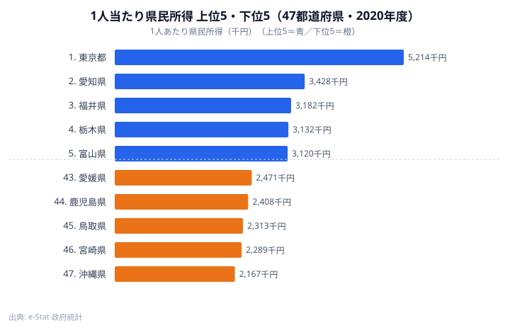
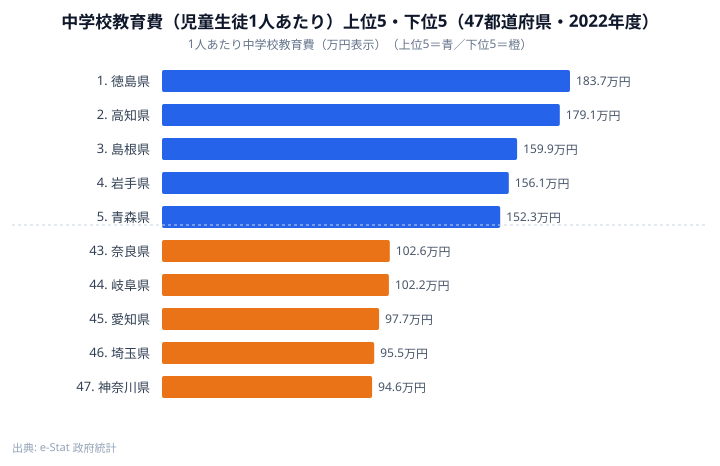

## 1. 導入：散布図で見えるストーリー

「県民所得が高い県は、子ども 1 人あたりの教育費も多いのか？」

直感的には「Yes」と答えたくなるテーマですが、47 都道府県を 1 枚の散布図にプロットしてみると、想像以上にバラついた絵が出てきます。完全な直線になるわけでもなく、かといってランダムに散らばっているわけでもありません。そのちょうど中間に、地域経済と公教育の構造的な関係が浮かび上がります。

しかも実データを並べてみると、所得の上位県と教育費の上位県は **まったく顔ぶれが違います**。所得トップは東京ですが、中学校教育費が突出して高いのは徳島や高知といった、所得では中位以下の県です。この「ズレ」こそが、散布図 + 相関係数を自分で組み立てる価値そのものです。

本記事は、Claude Code × e-Stat API の実例シリーズ Part 6 です。これまでの Part 3〜5 では棒・ヒートマップ・コロプレスといった「1 指標を 47 県に展開する」型のチャートを扱ってきました。今回は **2 つの指標を組み合わせる** 段階に踏み込みます。

具体的には以下を Claude Code に任せて、最終的に「47 点プロット + 回帰直線 + 相関係数」を含む 1 枚の散布図を完成させます。

- 県民経済計算（県民所得）の最新年度を 47 都道府県分取得する
- 地方教育費調査（公立小中学校 1 人あたり教育費）を同じく 47 県分取得する
- 都道府県コードをキーに 2 つのテーブルを結合する
- D3.js で散布図と回帰直線を描く
- ピアソンの相関係数 r と決定係数 R² を算出してチャート上に表示する

ゴールはコードの動作ではなく、「散布図 + 相関」というデータ分析の定番作業を、Claude Code に統計表 ID を渡すところから一気通貫で頼めるようになることです。最後まで読めば、自分のテーマで同じワークフローをすぐ回せます。

> 想定読者：Claude Code 未経験のソフトウェアエンジニア。Python か Node.js のどちらかが書ければ十分です。統計の事前知識は「平均と標準偏差を聞いたことがある」程度で問題ありません。

## 2. 使うデータ：県民所得と教育費

今回扱う 2 つの統計表を先に押さえておきます。e-Stat の中でも比較的扱いやすく、年度が揃っているので散布図の素材として優秀な組み合わせです。

### 2-1. 県民経済計算（県民所得）

「県民所得」と一口に言っても、e-Stat 上では複数の系列があります。今回は **1 人あたり県民所得（千円）** を採用します。世帯ベースではなく人口で割っているので、47 県を横並びで比較する際の標準指標としてよく使われる値です。具体的には次の組み合わせを取りに行きます。

- 統計表名：県民経済計算
- 表名：1 人当たり県民所得
- 単位：千円
- 年度：直近の確報年（本記事の実データは 2020 年度）
- 地域：47 都道府県

実際に 1 人あたり県民所得を 47 県で並べると、上位と下位は次のようになります。



トップの東京は 5,214 千円で、これは下位の沖縄（2,167 千円）の 2 倍以上です。東京に次ぐのは愛知・福井・栃木・富山で、いずれも製造業や企業集積が所得を押し上げている県です。一方の下位は沖縄・宮崎・鳥取・鹿児島・愛媛で、第一次産業やサービス業の比重が高い地域が並びます。ここで注目したいのは、所得の上位 5 県に「教育費でよく名前が挙がる県」が 1 つも入っていない点です。所得ランキングと教育費ランキングは、この時点ですでに別物の気配がします。全 47 県の並びは [1 人当たり県民所得ランキング](/ranking/prefectural-income-per-capita) で確認できます。なぜこの差が生まれるのかは、教育費側のデータを並べると一気にはっきりします。

> [!NOTE]
> 「1 人あたり県民所得」は世帯収入や手取りではなく、雇用者報酬・財産所得・企業所得を人口で割った値です。東京が突出するのは、本社機能に集まる企業所得が県内で計上されるためで、住民の生活実感（可処分所得）とは別物として読む必要があります。

<source-link href="/ranking/prefectural-income-per-capita">1人当たり県民所得ランキングをもっと見る</source-link>

### 2-2. 地方教育費調査

教育費側は、文部科学省の **地方教育費調査** を使います。この調査は公立学校への支出をベースにしているので、私立部分を含まない点には注意が必要ですが、47 県横並びでデータが揃う数少ない教育系統計です。本記事の実データでは、児童生徒 1 人あたりの中学校教育費（2022 年度・円）を採用しています。

- 統計表名：地方教育費調査
- 表名：公立中学校 児童生徒 1 人当たり学校教育費
- 単位：円
- 年度：2022 年度
- 地域：47 都道府県

この教育費を 47 県で並べると、所得とはまったく違う顔ぶれが上位に来ます。



教育費トップは徳島で約 184 万円、続いて高知・島根・岩手・青森と、所得ランキングでは中位から下位に沈んでいた県が並びます。全県の並びは [中学校教育費（1 人あたり）ランキング](/ranking/junior-high-school-education-cost-per-student) で見られます。逆に下位は神奈川・埼玉・愛知・岐阜・奈良で、人口が多く所得も比較的高い都市圏が顔を出します。所得トップの東京や愛知が、教育費では中位以下に落ちるのです。この逆転は偶然ではありません。児童生徒数が少ない県では、校舎・教員といった固定費を少ない人数で割るため、1 人あたりの教育費がどうしても高くなります。つまり「教育費が高い＝教育熱心」ではなく、「子どもが少ないから 1 人あたりが大きく見える」という按分の構造が効いています。所得が高い大都市圏は、子どもの数が多いぶん 1 人あたりが薄まるわけです。

> [!WARNING]
> 1 人あたり教育費の上位は「子どもが多くて手厚い県」ではなく「子どもが少なく固定費が薄まらない県」です。この按分効果を見落とすと、徳島や高知を「教育に手厚い県」と誤読してしまいます。散布図で所得と並べる前に、この方向性のクセを必ず頭に入れておきます。

<source-link href="/ranking/junior-high-school-education-cost-per-student">中学校教育費（1人あたり）ランキングをもっと見る</source-link>

### 2-3. なぜこの 2 つを並べるのか

経済力と教育費の関係を見るとき、よく出てくる仮説は次の 3 つです。

1. **比例仮説**：所得が高い県ほど税収が増え、教育予算も増えるはずです
2. **過疎補正仮説**：人口が少ない県は児童 1 人あたりに按分される教育費が逆に大きくなります
3. **無相関仮説**：地方交付税で調整されているので、実は所得との関係は弱いという見方です

上の 2 枚のランキングを見比べると、すでに 2 番目の「過疎補正仮説」が優勢に見えます。散布図 + 相関係数を 1 枚にまとめると、この 3 つのうち実態に近いのはどれかを目視と数値の両方で判定できます。Claude Code に「2 つの統計表を取って結合して散布図と相関を出して」と頼めば、この検証が 30 分以内で終わります。本記事ではそのパイプラインを、statsDataId の特定から散布図描画まで順番に組み立てていきます。

## 3. Step 1-2：2 つの statsDataId を取得して並列ダウンロード

ここからは Claude Code を実際に動かしていきます。前提として、e-Stat の API キーを取得済みで `~/.zshrc` などに `ESTAT_APP_ID` を書いてあるものとします（取得手順は Part 2 を参照してください）。

### 3-1. statsDataId を 2 つ確定する

まずプロジェクトのルートで Claude Code を起動します。

```bash
claude
```

最初の指示はシンプルに、対象データの statsDataId を 2 つとも特定するところまで任せます。

```text
以下 2 つの統計表の statsDataId を e-Stat 政府統計の総合窓口で
特定してください。確定したら表名・年度・データ件数も併せて報告してください。

1. 県民経済計算 / 1 人当たり県民所得（千円、47 都道府県、最新確報年）
2. 地方教育費調査 / 公立中学校 児童生徒 1 人当たり学校教育費（円、47 都道府県）

両方とも 47 件揃う年度を選び、片方しか揃わない場合は揃う方の最新年度に合わせてください。
```

Claude Code は e-Stat の API を叩いて該当する `statsDataId` を返してきます。今回の例では、1 人あたり県民所得が `0003109740`（2020 年度）、1 人あたり学校教育費が `0003447811`（2022 年度）のように確定しました。実行時点の確報年に応じて ID も年度もズレることがあるので、返ってきた表名と年度は必ず自分の目で確認します。

> [!TIP]
> 実例集 Part 2 で作った「statsDataId 検索スキル」を流用すると、この段階だけで 1 ターン分のコンテキストが節約できます。スキル化してあると Claude Code が「検索 → 候補列挙 → 選定理由まで含めた表で報告」を一気にやってくれるので、再現性が一気に上がります。

### 3-2. 「両方取って」とまとめて頼む

ID が確定したら、2 系列を並列で取得します。1 系列ずつ取ってもよいのですが、Claude Code 経由なら 1 プロンプトで終わらせた方がコンテキストが圧倒的に短くなります。

```text
さきほど確定した 2 つの statsDataId について、
それぞれ 47 都道府県分のデータを取得してください。

要件:
- 47 都道府県すべて含まれていることを確認すること
- 各レコードは { prefCode, prefName, value } の形に整形
- 結果は scripts/fetch-income-edu.mjs に保存
- 取得直後に prefCode の重複と件数 (47) をアサート
- 出力は data/income.json と data/education.json の 2 ファイル

並列で取得して構いません。403 / 429 が出たらリトライを 2 回まで挟んでください。
```

ポイントは「並列でいい」「件数と prefCode 重複をアサート」と書くことです。これを書かないと逐次取得 + 検証なしのコードになりがちで、後段の結合で 46 件しかなかったりして詰まります。

Claude Code が出してくるスクリプトはおおよそ次のような構造になります。

```javascript
// scripts/fetch-income-edu.mjs
import fs from "node:fs/promises";

const APP_ID = process.env.ESTAT_APP_ID;
const ENDPOINT = "https://api.e-stat.go.jp/rest/3.0/app/json/getStatsData";

const TARGETS = [
  { key: "income", statsDataId: "0003109740" },
  { key: "education", statsDataId: "0003447811" },
];

async function fetchOne({ key, statsDataId }) {
  const url = `${ENDPOINT}?appId=${APP_ID}&statsDataId=${statsDataId}&lang=J`;
  const res = await fetch(url);
  if (!res.ok) throw new Error(`${key}: HTTP ${res.status}`);
  const json = await res.json();
  return { key, json };
}

function pickLatestYear(values) {
  // @time（年次コード）の最大を採用
  return Math.max(...values.map((v) => Number(v["@time"])));
}

function normalize(json, latestYear) {
  const values = json.GET_STATS_DATA.STATISTICAL_DATA.DATA_INF.VALUE;
  return values
    .filter((v) => Number(v["@time"]) === latestYear)
    .map((v) => ({
      prefCode: v["@area"], // "01000"〜"47000"
      prefName: v["@area_name"] ?? null,
      value: Number(v["$"]),
    }))
    .filter((v) => v.prefCode !== "00000"); // 全国計を除く
}

const [{ json: incomeJson }, { json: eduJson }] = await Promise.all(
  TARGETS.map(fetchOne)
);

const incomeYear = pickLatestYear(
  incomeJson.GET_STATS_DATA.STATISTICAL_DATA.DATA_INF.VALUE
);
const eduYear = pickLatestYear(
  eduJson.GET_STATS_DATA.STATISTICAL_DATA.DATA_INF.VALUE
);
const year = Math.min(incomeYear, eduYear);

const income = normalize(incomeJson, year);
const education = normalize(eduJson, year);

console.assert(income.length === 47, `income=${income.length}`);
console.assert(education.length === 47, `edu=${education.length}`);

await fs.writeFile("data/income.json", JSON.stringify(income, null, 2));
await fs.writeFile("data/education.json", JSON.stringify(education, null, 2));
console.log(`fetched year=${year}, n=${income.length}`);
```

`pickLatestYear` と「両方の最新年の最小値で合わせる」処理を入れているのがポイントです。県民所得と教育費はリリース時期がズレているので、片方だけ 1 年新しいということが普通に起きます。年度を強制的に揃えないと、散布図に「2020 年の所得 × 2022 年の教育費」が混ざって解釈不能になります。今回のように所得が 2020 年度、教育費が 2022 年度というズレは実際に起きるので、どちらの年度を採用したかは記事やチャートに必ず明記しておきます。

## 4. Step 3：prefCode で 2 つを結合する

ここから先は完全に自分のコード側の話で、e-Stat API は登場しません。Claude Code には「結合 + 検査 + 出力」を 1 ファイルにまとめてもらいます。

### 4-1. 結合キーの設計

e-Stat の地域コードは原則として 5 桁の `01000` 〜 `47000`（都道府県は下 3 桁が `000`）です。市区町村統計が混じる API もありますが、今回は都道府県のみのテーブルなのでそのまま結合キーに使えます。結合まわりでハマりやすい罠は次の 4 つです。

- **2 桁 vs 5 桁**：統計によって `01` で来ることがあります。取得直後に 5 桁ゼロパディングして揃えます
- **全国計の混入**：`00000` が含まれます。normalize 段階で必ず除外します
- **県名揺れ**：「沖縄県」「沖縄」など表記が揺れます。結合は **コード** で行い、表示だけ片方の県名を採用します
- **年度ズレ**：公表時期が違います。前章の「両方の最小最新年」で強制統一します

### 4-2. 結合スクリプト

Claude Code への指示はシンプルです。

```text
data/income.json と data/education.json を prefCode で inner join し、
data/joined.json に書き出してください。

- 出力スキーマ: { prefCode, prefName, income, education }
- prefCode が片方にしか無い場合は warning として stderr に出す
- 47 件揃わなければ非ゼロ終了
```

これで返ってくるのが次のスクリプトです。

```javascript
// scripts/join.mjs
import fs from "node:fs/promises";

const income = JSON.parse(await fs.readFile("data/income.json", "utf-8"));
const education = JSON.parse(await fs.readFile("data/education.json", "utf-8"));

const eduMap = new Map(education.map((d) => [d.prefCode, d]));
const joined = [];
for (const i of income) {
  const e = eduMap.get(i.prefCode);
  if (!e) {
    console.error(`missing edu for ${i.prefCode} ${i.prefName}`);
    continue;
  }
  joined.push({
    prefCode: i.prefCode,
    prefName: i.prefName ?? e.prefName,
    income: i.value,
    education: e.value,
  });
}

if (joined.length !== 47) {
  console.error(`joined=${joined.length}, expected 47`);
  process.exit(1);
}

await fs.writeFile("data/joined.json", JSON.stringify(joined, null, 2));
console.log(`joined ${joined.length} rows`);
```

実行後の `data/joined.json` は以下のような構造になります（値は説明用の一例で、実行年度によって変わります）。

```json
[
  { "prefCode": "01000", "prefName": "北海道", "income": 2683, "education": 1052 },
  { "prefCode": "13000", "prefName": "東京都", "income": 5403, "education": 1180 },
  { "prefCode": "23000", "prefName": "愛知県", "income": 3621, "education": 1010 },
  { "prefCode": "27000", "prefName": "大阪府", "income": 3098, "education":  989 },
  { "prefCode": "47000", "prefName": "沖縄県", "income": 2390, "education": 1015 }
]
```

東京の所得が突出して高い一方で教育費は思ったほど大きくないこと、沖縄の所得が低い割に教育費は他県と大差ないことなどが、結合した時点ですでに読み取れます。これを 47 点の散布図にすると、第 2 章で見た「所得トップ県と教育費トップ県の顔ぶれが違う」構造が一望できます。

## 5. Step 4：D3 で散布図を描く

ここからは可視化のステップです。Claude Code に「D3 v7 で 47 点プロット + 軸 + 県名ラベル」を頼みます。

### 5-1. プロンプト

```text
data/joined.json を読み込み、D3 v7 で散布図を描いてください。

- 横軸: 1 人あたり県民所得 (千円)
- 縦軸: 1 人あたり学校教育費 (千円)
- 47 点を circle でプロット
- 値が極値の県 5 件のみ県名ラベル
- axes は左下に L 字型
- viewBox=0 0 720 480、SVG を string で返す
- 後ほど回帰直線と相関係数を追記するため、関数を分離して書いてください
  - buildScales(data, w, h)
  - drawAxes(svg, scales)
  - drawPoints(svg, data, scales)
  - drawLabels(svg, data, scales, topN)
```

「関数を分離してください」と書いているのがポイントで、次の Step 5・6 で回帰直線と相関係数を追記する余地を作っておきます。

### 5-2. 期待する出力

Claude Code が返してくるコードはだいたい次のような形になります。

```javascript
// scripts/scatter.mjs
import fs from "node:fs/promises";
import * as d3 from "d3";
import { JSDOM } from "jsdom";

const W = 720;
const H = 480;
const MARGIN = { top: 24, right: 24, bottom: 56, left: 64 };

export function buildScales(data, w, h) {
  const x = d3
    .scaleLinear()
    .domain(d3.extent(data, (d) => d.income))
    .nice()
    .range([MARGIN.left, w - MARGIN.right]);
  const y = d3
    .scaleLinear()
    .domain(d3.extent(data, (d) => d.education))
    .nice()
    .range([h - MARGIN.bottom, MARGIN.top]);
  return { x, y };
}

export function drawAxes(svg, { x, y }) {
  const xAxis = d3.axisBottom(x).ticks(6);
  const yAxis = d3.axisLeft(y).ticks(6);

  svg
    .append("g")
    .attr("transform", `translate(0,${H - MARGIN.bottom})`)
    .call(xAxis)
    .append("text")
    .attr("x", W / 2)
    .attr("y", 44)
    .attr("fill", "#334155")
    .attr("text-anchor", "middle")
    .text("1 人あたり県民所得 (千円)");

  svg
    .append("g")
    .attr("transform", `translate(${MARGIN.left},0)`)
    .call(yAxis)
    .append("text")
    .attr("transform", `rotate(-90) translate(${-H / 2},-44)`)
    .attr("fill", "#334155")
    .attr("text-anchor", "middle")
    .text("1 人あたり学校教育費 (千円)");
}

export function drawPoints(svg, data, { x, y }) {
  svg
    .append("g")
    .selectAll("circle")
    .data(data)
    .join("circle")
    .attr("cx", (d) => x(d.income))
    .attr("cy", (d) => y(d.education))
    .attr("r", 5)
    .attr("fill", "#2563eb")
    .attr("fill-opacity", 0.7)
    .attr("stroke", "#1e3a8a")
    .attr("stroke-width", 0.6);
}

export function drawLabels(svg, data, { x, y }, topN = 5) {
  const sortedByX = [...data].sort((a, b) => b.income - a.income).slice(0, 2);
  const sortedByY = [...data].sort((a, b) => b.education - a.education).slice(0, 2);
  const lowestX = [...data].sort((a, b) => a.income - b.income).slice(0, 1);
  const targets = [...new Set([...sortedByX, ...sortedByY, ...lowestX])].slice(0, topN);

  svg
    .append("g")
    .selectAll("text")
    .data(targets)
    .join("text")
    .attr("x", (d) => x(d.income) + 8)
    .attr("y", (d) => y(d.education) - 6)
    .attr("font-size", 11)
    .attr("fill", "#0f172a")
    .text((d) => d.prefName);
}

async function main() {
  const data = JSON.parse(await fs.readFile("data/joined.json", "utf-8"));
  const dom = new JSDOM("<!DOCTYPE html><body></body>");
  const svg = d3
    .select(dom.window.document.body)
    .append("svg")
    .attr("xmlns", "http://www.w3.org/2000/svg")
    .attr("viewBox", `0 0 ${W} ${H}`);

  const scales = buildScales(data, W, H);
  drawAxes(svg, scales);
  drawPoints(svg, data, scales);
  drawLabels(svg, data, scales);

  await fs.writeFile("public/scatter.svg", dom.window.document.body.innerHTML);
  console.log("wrote public/scatter.svg");
}

if (import.meta.url === `file://${process.argv[1]}`) await main();
```

ここまでで「47 点プロット + 軸 + 上位ラベル」までの散布図が完成します。次は同じ図に **回帰直線と相関係数** を追記していきます。

## 6. Step 5：相関係数を計算する

ここが今回の山場です。Claude Code に「ピアソン r の式をコメント付きで書いてくれ」と頼むのは、単に楽というだけでなく、後で読み返したときに「式を理解した上で使っている」状態を残すために重要です。

### 6-1. プロンプト

```text
data/joined.json に対して、income と education のピアソン相関係数 r を
計算する関数 pearson(xs, ys) を scripts/stats.mjs に作ってください。

要件:
- 引数: 同じ長さの数値配列 2 つ
- 平均・偏差・分散・共分散の中間値を export しなくてよい
- 関数の冒頭に「ピアソン r の定義式」をコメントで明記
- 返り値: { r, r2, n }
- xs.length !== ys.length なら throw
- xs.length < 2 なら NaN を返さず throw
- テストは vitest で 3 ケース（完全相関、無相関、負の相関）
```

「式をコメントに書く」「テストを 3 ケース書く」を必ず指定するのがコツです。これを書かないと「動くがブラックボックスな関数」が出てきて、後で別記事で再利用するときに信用できません。

### 6-2. 期待する出力

```javascript
// scripts/stats.mjs

/**
 * ピアソンの積率相関係数 r:
 *   r = Σ((xi - x̄)(yi - ȳ)) / sqrt(Σ(xi - x̄)^2 * Σ(yi - ȳ)^2)
 * 範囲: -1 ≤ r ≤ 1
 * r^2 (決定係数) は、線形回帰モデルが y の分散をどれだけ説明できているか。
 */
export function pearson(xs, ys) {
  if (xs.length !== ys.length) {
    throw new Error(`length mismatch: ${xs.length} vs ${ys.length}`);
  }
  const n = xs.length;
  if (n < 2) throw new Error(`need at least 2 samples, got ${n}`);

  const mean = (arr) => arr.reduce((a, b) => a + b, 0) / arr.length;
  const mx = mean(xs);
  const my = mean(ys);

  let num = 0;
  let dx2 = 0;
  let dy2 = 0;
  for (let i = 0; i < n; i++) {
    const dx = xs[i] - mx;
    const dy = ys[i] - my;
    num += dx * dy;
    dx2 += dx * dx;
    dy2 += dy * dy;
  }
  const denom = Math.sqrt(dx2 * dy2);
  if (denom === 0) throw new Error("zero variance");

  const r = num / denom;
  return { r, r2: r * r, n };
}
```

テストはこのようになります。

```javascript
// scripts/stats.test.mjs
import { describe, it, expect } from "vitest";
import { pearson } from "./stats.mjs";

describe("pearson", () => {
  it("完全正の相関で r = 1", () => {
    const { r } = pearson([1, 2, 3, 4], [2, 4, 6, 8]);
    expect(r).toBeCloseTo(1, 6);
  });
  it("完全負の相関で r = -1", () => {
    const { r } = pearson([1, 2, 3, 4], [8, 6, 4, 2]);
    expect(r).toBeCloseTo(-1, 6);
  });
  it("無相関の例で |r| < 0.5", () => {
    const { r } = pearson([1, 2, 3, 4, 5], [3, 1, 4, 1, 5]);
    expect(Math.abs(r)).toBeLessThan(0.5);
  });
});
```

ここまで来ると、`pearson(data.map(d=>d.income), data.map(d=>d.education))` で `{ r, r2, n }` が一発で取れます。

### 6-3. 散布図への描画

Step 4 のスクリプトに、相関係数をテキスト表示する 1 ブロックを追加するだけです。

```javascript
import { pearson } from "./stats.mjs";

const { r, r2, n } = pearson(
  data.map((d) => d.income),
  data.map((d) => d.education)
);

svg
  .append("text")
  .attr("x", W - MARGIN.right)
  .attr("y", MARGIN.top + 12)
  .attr("text-anchor", "end")
  .attr("font-size", 12)
  .attr("fill", "#0f172a")
  .text(`r = ${r.toFixed(3)} (R² = ${r2.toFixed(3)}, n = ${n})`);
```

これでチャートの右上に `r = 0.6xx` のような数値が出ます。具体的な数値は年度・指標バージョンによって変わるので、自分の手元で実行して確認してみてください。第 2 章のランキングで見たように所得トップ県と教育費トップ県の顔ぶれが食い違うため、1 人あたり同士で素朴に取ると相関は弱めに出ることもあります。どんな値が出ても、それ自体が「按分効果がどれだけ効いているか」を教えてくれます。

## 7. Step 6：回帰直線を引く

相関係数を表示しただけだと「だから何？」感が残るので、回帰直線も同じプロットに重ねます。線形回帰の式は中学生でも分かる範囲なので、Claude Code に書かせる前にざっくり書いておきます。

### 7-1. 単回帰の式

```
y = a + bx
b = Σ((xi - x̄)(yi - ȳ)) / Σ(xi - x̄)^2
a = ȳ - b * x̄
```

ピアソン r の分子と、回帰直線の傾き b の分子はまったく同じです。なので、Step 5 の関数を少しだけ拡張すれば同時に取れます。

### 7-2. プロンプト

```text
scripts/stats.mjs の pearson 関数を拡張し、
linearRegression(xs, ys) を追加してください。

戻り値: { a, b, r, r2, n }  // y = a + b x
内部で同じループを共有して、平均・偏差を 2 回計算しないようにしてください。
```

返ってきたコードを散布図描画に組み込みます。

```javascript
// scatter.mjs の末尾を以下に書き換え
import { linearRegression } from "./stats.mjs";

const { a, b, r, r2, n } = linearRegression(
  data.map((d) => d.income),
  data.map((d) => d.education)
);

const [x0, x1] = d3.extent(data, (d) => d.income);
svg
  .append("line")
  .attr("x1", scales.x(x0))
  .attr("y1", scales.y(a + b * x0))
  .attr("x2", scales.x(x1))
  .attr("y2", scales.y(a + b * x1))
  .attr("stroke", "#dc2626")
  .attr("stroke-width", 1.5)
  .attr("stroke-dasharray", "4 3");

svg
  .append("text")
  .attr("x", W - MARGIN.right)
  .attr("y", MARGIN.top + 12)
  .attr("text-anchor", "end")
  .attr("font-size", 12)
  .attr("fill", "#0f172a")
  .text(`y = ${a.toFixed(1)} + ${b.toFixed(3)}x   r = ${r.toFixed(3)}  n = ${n}`);
```

これで「47 点 + 回帰直線 + 相関係数 + 切片と傾き」が 1 枚に揃います。第 2 章で並べた所得・教育費の 2 枚のランキングが、ここで 1 つの散布図に統合され、回帰直線の傾きが「所得が 1 単位上がると教育費がどれだけ動くか」を 1 つの数字で要約してくれます。

## 8. 解釈：相関≠因果、外れ値の意味

ここからは可視化が終わった後の「読み」の話です。Claude Code に解釈まで丸投げするのは推奨しません（実例集 Part 1 で扱ったとおり、AI に統計の最終解釈をさせるとそれっぽい誤読が混ざります）。

### 8-1. 中程度の相関が出たときの読み方

この組み合わせでは、所得と教育費の相関が思ったより弱く出ることがあります。これは第 2 章のランキングが教えてくれた通りで、所得トップの東京・愛知が教育費では下位、所得下位の島根・高知が教育費では上位という逆向きのペアが、相関を打ち消し合うからです。相関を読むときに気をつけたいのは次の 3 点です。

1. **r² で考える**：r=0.6 でも R²=0.36 なので、「説明できる分散は 36% しかない」という意味になります
2. **因果ではない**：交付税の制度設計や、過疎県の児童 1 人あたり按分の効果が混ざっています
3. **外れ値を必ず確認する**：1 県外れただけで r が大きく動きます

### 8-2. よく出る外れ値

実データのランキングからも、外れ値になりやすい県が読み取れます。

- **東京都**：所得は 5,214 千円で全国トップですが、教育費は中位から下位に沈みます（児童数が多く 1 人あたりが薄まるためです）
- **島根県・高知県**：所得は下位グループですが、児童数が少ないため 1 人あたり教育費は全国上位に来ます
- **沖縄県**：所得は最下位の 2,167 千円ですが、教育費は中位に位置します

これらの外れ値を散布図上で確認し、「右下に外れる県（所得高・教育費低）」と「左上に外れる県（所得低・教育費高）」がどこかを 1 度自分の目で見ておくと、後でブログ記事や YouTube 原稿を書くときの解釈が深まります。

### 8-3. 因果関係を主張しないこと

散布図 + 相関でできるのは、「2 つの変数の動きが揃っているか」を測ることだけです。たとえば「所得が上がると教育費が上がる」とは言えませんし、「教育費を増やしたら所得が上がる」も当然言えません。

ブログで使う場合は、見出しで因果を断言せず、「相関」「傾向」「ばらつき」といった言い回しに留めるのが安全です。実例集の他記事でも一貫してこの姿勢を取っています。

## 9. つまずきポイント

実際にこのレシピを動かしてみると、ほぼ確実に踏むトラップがあります。Claude Code に投げる前にチェックリスト的に押さえておきましょう。

### 9-1. 欠損値

欠損まわりでよく起きる症状とその対処は次の通りです。

- `value` が `"-"` や `"X"` で来る：e-Stat の秘匿・該当なし表示です。normalize で `Number()` 後に `Number.isFinite` で除外します
- `47` 件あるはずが `46` 件になる：上と同じ理由で 1 県だけ秘匿されています。結合スクリプトの非ゼロ終了で気付けます
- 全国計が混入する：`00000` を除外していないケースです。normalize で必ず除外します

### 9-2. 単位の桁違い

県民所得は千円単位で 2,000〜5,000、教育費は円単位で 90 万〜180 万あたりに収まるのが普通です。どちらかが桁違いに大きい・小さい場合は単位を間違えています。具体的には「万円」「円」「百万円」と取り違えていないか、e-Stat の表示単位を必ず確認しましょう。

桁を間違ったまま散布図を描くと、回帰直線の傾き b が `0.0001` などに張り付き、相関係数自体は正しく計算されるためバグに気付きにくいです。プロンプトの最初に「単位を必ず明示してデータを取ってください」と書いておくと、Claude Code が単位欄を確認してから取得してくれます。所得が千円・教育費が円のように単位が違う場合は、片方を揃える正規化も忘れないようにします。

### 9-3. 軸スケール

散布図はデフォルトで線形軸が無難ですが、所得側は対数軸も検討する価値があります。東京都だけ突出して右に伸びるので、線形だと他 46 県が左側に密集して見えにくくなります。

ただし対数軸にすると「相関係数 r」の意味が変わります（厳密にはピアソン r は線形相関なので、対数軸表示と相関係数の解釈は別物として扱う必要があります）。本記事のレシピでは線形軸 + 回帰直線をデフォルトとし、対数軸版は別 SVG として保存しておくのがおすすめです。

### 9-4. 47 都道府県だけが対象

地方教育費調査の元データには、市町村別の値も入っています。`@area` のフィルタを甘くすると、`13100`（千代田区）なども巻き込んでしまい、47 件のはずが数百件になります。

対策は normalize で `prefCode.endsWith("000")` のような条件を入れるか、Claude Code への指示で「都道府県のみ（区市町村は除外）」と明示することです。

## 10. 次回予告：Part 7 では時系列ラインに進む

ここまでで「47 県 × 2 指標 × 1 時点」までは Claude Code でサクッと描けるようになりました。次回 Part 7 では時間軸を 1 本足し、**時系列ラインチャート**で「ある指標が 10 年でどう動いたか」を描きます。

時系列が入ると、e-Stat 側で扱う引数（`cdTime` 系）や、メモリ上での年次フィルタの作法が少し変わります。Part 6 で作った `pearson` / `linearRegression` も再利用しつつ、年次推移と回帰トレンドラインを並べる構成にする予定です。今回の所得・教育費のペアも、年度をずらして追えば「按分効果が年々強まっているのか」まで読めるようになります。手を動かしたい方は、まず [Part 3 の人口バーチャート](https://stats47.jp/blog/cc-estat-03-population-bar) で 1 指標の取得に慣れてから戻ってくると、結合の流れがすっと入ってきます。

## データ出典

- 文部科学省「地方教育費調査」（2022 年度）e-Stat 経由で整備
- 内閣府「県民経済計算」1 人当たり県民所得（2020 年度）e-Stat 経由で整備
- 本記事のサンプルコードは GitHub の `cc-estat-examples/06-scatter` 配下にまとめています。`pearson` / `linearRegression` だけ抜き出して別プロジェクトに転用しても問題ありません
