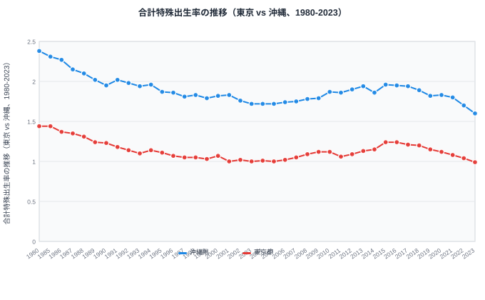
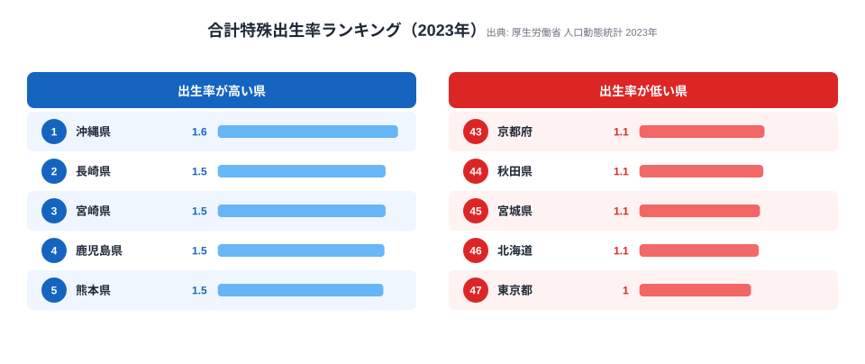

少子化、と聞くと「日本全体が下がっている」というぼやけたイメージで終わりがちです。でも 47 都道府県の **合計特殊出生率（TFR）を 40 年分** 並べると、景色がガラッと変わります。沖縄は 2010 年に 1.87 を保っていたのに 2023 年には 1.60 まで落ち、東京は 1980 年の 1.44 から 2023 年の 0.99 へと一本調子で沈んでいく——時系列ラインチャートでしか見えない動きが大量にあります。

本連載 Part 7 では、e-Stat から 47 県分の合計特殊出生率を取得し、D3 で **47 本ラインチャート** を作る手順を紹介します。Claude Code に丸投げするとサクッと書いてくれるのですが、e-Stat API 特有の **「年度範囲フィルタ（`cdTimeFrom`/`cdTimeTo`）を使うとキャッシュが爆発する」** 罠が待っています。これは公式ドキュメントには書かれていない、本番運用してはじめて気づく類のハマりどころなので、本記事で 1 本にまとめます。

連載の前回は散布図（Part 6）、次回は Bar Chart Race（Part 8）です。ラインチャートは時系列の「形」を見るための基本ですが、47 系列を 1 枚に描こうとすると色問題・凡例問題・線重なり問題の三重苦が襲ってきます。これも込みで Claude Code に解かせます。


## なぜ「時系列で見る出生率」が刺さるのか

合計特殊出生率（TFR）は、1 人の女性が生涯に産むと推計される子どもの数です。2.07 を下回ると人口維持ができないとされる、いわゆる「人口置換水準」の指標。日本全体の TFR は 2024 年に過去最低の **1.20** を記録しました（厚生労働省 人口動態統計の全国値）。

「1.20」だけ見せられても、エンジニアの脳には何も刺さりません。でも都道府県別の値を時系列で並べると、グッと解像度が上がります。e-Stat の人口動態統計から取得できる、出生率が両極にある 2 県の推移を見てみましょう。

- **沖縄県**: 1980 年 2.38 → 1990 年 1.95 → 2010 年 1.87 → 2023 年 1.60。常に全国トップを維持しつつも、じわじわと下降
- **東京都**: 1980 年 1.44 → 1990 年 1.23 → 2005 年 1.00 → 2023 年 0.99。40 年間ほぼ一本調子で全国最下位を更新し続けている

この 2 本を並べるだけでも、ポイントが 3 つ浮かび上がります。

1. **東京は 40 年通してほぼ一本調子で低位安定**（2023 年は 0.99 でついに 1.0 を割りました）
2. **沖縄は高水準を保ちつつも、緩やかに下降しています**（2.38 → 1.60 と 40 年で 0.78 ポイント低下）
3. **2 県の差は 1980 年の 0.94 ポイントから 2023 年の 0.61 ポイントへと縮小**（全国的に「低いところで横並び」に向かっている）

これらは「棒グラフで最新年だけ」見ても絶対に出てこない情報です。だからラインチャートを描きます。47 本まとめて描けば、自分の県や近隣県を指で追って「うちの県の出生率はトレンドのどの位置にいるんだろう」と読者が能動的に読み取れる、シリアスな data viz になります。



<source-link href="/ranking/total-fertility-rate">合計特殊出生率ランキング（年次推移つき）をもっと見る</source-link>

> [!NOTE]
> 上のラインチャートは e-Stat 人口動態統計（都道府県別）の値です。冒頭で触れた「全国 1.20（2024 年）」は別系列の **全国集計値** で、都道府県別ランキングには含まれません。県別の値と全国値は集計対象が異なるので、混ぜてプロットしないよう注意してください（凡例で系列を明示すると事故が減ります）。


## 使うデータ: 合計特殊出生率（人口動態統計）

e-Stat で「合計特殊出生率 都道府県」と検索すると、人口動態統計のいくつかの統計表がヒットします。本記事では下記を使います。

- **政府統計名**: 人口動態調査 / 確定数 / 都道府県
- **表番号**: 都道府県別の合計特殊出生率（年次）
- **statsDataId**: `0003411595`（連載執筆時点。e-Stat 側で番号が変わることがあるので最新は API で確認）
- **取得粒度**: 47 都道府県 × 年次（1990-2024、35 年分）

> [!TIP]
> 出生率は **「人」ではなく「率」** です。値は小数点 2 桁の小数（沖縄 1.60、東京 0.99 など）。人口や面積のような「量」の指標と違い、**都道府県を合算しても意味がありません**（47 県の TFR を足して全国値にはならない）。Claude Code に頼むときも「合計せず、そのまま 47 系列の time series として持って」と一言添えると、集計ミスを未然に防げます。

データ取得の前提として、本連載 Part 1 で Claude Code のインストールと e-Stat API キー取得を終えていることを想定します。`~/.zshrc` などに `export ESTAT_APP_ID=xxxx` が通っていれば OK。


## Step 1: Claude Code に「30 年分の出生率を全県取って」と頼む

まずは素直に依頼します。

```text
e-Stat の人口動態統計（statsDataId: 0003411595）から、
都道府県別の合計特殊出生率を 1990 年〜2024 年の 35 年分取得して、
47 県 × 35 年の長形式 CSV（columns: areaCode, areaName, year, tfr）で保存して。
```

Claude Code は以下の流れで動きます。

1. `getStatsList` または `getMetaInfo` で `statsDataId: 0003411595` のメタ情報を引く
2. カテゴリコード（cat01 が「合計特殊出生率」になっているか確認）
3. `getStatsData` を叩いてレスポンス取得
4. JSON の `DATA_INF.VALUE` を pandas / Polars / 素の JS で展開
5. CSV 出力

最初の素朴な実装はだいたいこうなります。

```javascript
// 素朴版（あとで直す）
async function fetchTFR(yearFrom, yearTo) {
  const url = new URL("https://api.e-stat.go.jp/rest/3.0/app/json/getStatsData");
  url.searchParams.set("appId", process.env.ESTAT_APP_ID);
  url.searchParams.set("statsDataId", "0003411595");
  url.searchParams.set("cdTimeFrom", String(yearFrom)); // ← これが罠
  url.searchParams.set("cdTimeTo", String(yearTo));     // ← これが罠
  url.searchParams.set("metaGetFlg", "N");
  url.searchParams.set("limit", "10000");

  const res = await fetch(url);
  const json = await res.json();
  return json.GET_STATS_DATA.STATISTICAL_DATA.DATA_INF.VALUE;
}

const rows = await fetchTFR(1990, 2024);
```

これで動きます。最初は。でも本番運用に乗せて、複数の分析スクリプトから何度も同じデータを引くようになると、地獄が始まります。次節で何が起きるか見ていきます。


## cdTimeFrom/cdTimeTo の罠 — なぜ stats47 では使わないか

stats47 のリポジトリには **`.claude/rules/estat-api.md`** という規約ファイルがあり、そこに 1 行だけこう書かれています。

> `cdTimeFrom`/`cdTimeTo`（年度範囲指定）を使わない。全年度を一括取得し、必要な年度はメモリ上で `yearCode` フィルタする。

これは私が運用 1 年で痛い目を見た末に作ったルールです。理由を解説します。

### 罠 1: キャッシュキー分断

e-Stat API の呼び出しレスポンスは、ローカルファイル or R2（Cloudflare）にキャッシュするのが定石です。stats47 では下記のようなキャッシュキー設計にしています。

```text
cache key = sha256(statsDataId + "|" + cdCat01 + "|" + cdArea + "|" + cdTime)
```

つまり「同じ統計表・同じカテゴリ・同じ地域・同じ時間軸パラメータ」のリクエストは 1 つにまとまります。ところが `cdTimeFrom`/`cdTimeTo` を入れた瞬間、キャッシュキーがバラバラに分解されます。たとえば同じ統計表に対して、次のような微妙に違う範囲のリクエストが飛んだとします。

- `cdTimeFrom=1990, cdTimeTo=2024`（35 年分）→ キャッシュキー A
- `cdTimeFrom=2000, cdTimeTo=2024`（25 年分・上の範囲に内包）→ キャッシュキー B
- `cdTimeFrom=2010, cdTimeTo=2024`（15 年分・同じく内包）→ キャッシュキー C
- `cdTimeFrom=2020, cdTimeTo=2024`（5 年分・同じく内包）→ キャッシュキー D

これら 4 つはすべて 1 番目のリクエストのサブセットで、本来 1 回 API を叩けば全部賄えるはずなのに、4 回叩いて 4 個キャッシュが作られます。R2 のストレージ請求と Class A オペレーションが地味に増えていきます。

### 罠 2: 再リクエスト爆発

複数の analysis スクリプトを書いていると、各スクリプトが「自分が必要な年度範囲」を渡したくなります。スクリプト A は「最新 10 年」、スクリプト B は「過去 30 年」、スクリプト C は「2000-2010 だけ」みたいに。それぞれ別の `cdTimeFrom`/`cdTimeTo` で叩くと、**同じデータを少しずつ違う切り口で N 回ダウンロード** することになります。

実測したケースでは、人口動態統計のある統計表で、3 ヶ月運用したら同じ statsDataId に対して 47 個のキャッシュエントリができていました。中身は全部「全年度から一部を切り出したサブセット」。

### 罠 3: e-Stat 側のレートリミット

e-Stat API は明示的なレートリミットこそ緩い（無料枠内では実質的に困らない）ですが、**短時間に大量に叩くと 503 が返り始める** ことが何度かありました。キャッシュ分断による不要な再リクエストを減らすだけで 503 を踏む頻度が劇的に下がります。

### 結論: 全年度取得 → メモリでフィルタ

ということで、stats47 の規約は以下です。

```javascript
// GOOD: 全年度を 1 回取得して、メモリで欲しい年度に絞る
async function fetchTFRAll() {
  const url = new URL("https://api.e-stat.go.jp/rest/3.0/app/json/getStatsData");
  url.searchParams.set("appId", process.env.ESTAT_APP_ID);
  url.searchParams.set("statsDataId", "0003411595");
  // cdTimeFrom / cdTimeTo は付けない
  url.searchParams.set("metaGetFlg", "N");
  url.searchParams.set("limit", "10000");

  const res = await fetch(url);
  const json = await res.json();
  return json.GET_STATS_DATA.STATISTICAL_DATA.DATA_INF.VALUE;
}

const allRows = await fetchTFRAll();           // キャッシュは 1 つ
const recent = allRows.filter(r => Number(r["@time"].slice(0, 4)) >= 1990);
```

Claude Code に頼むときも、最初の依頼に **「年度範囲フィルタは使わず、全年度取得してメモリで絞って」** と一言添えるだけで、最初から正しい設計になります。同じ理由で **`cdArea`（地域コード指定）も使わない**（47 都道府県分のキャッシュを 1 つに統一するため）。詳細は連載 Part 2 の検索スキルの回でも触れます。


## Step 2: 全期間取得 → メモリ上で年度フィルタ

ここからは実装。Claude Code が書いてくれるコードのテンプレートとして、Node.js（ES Module）で 1 ファイル完結のサンプルを示します。

```javascript
// scripts/fetch-tfr.mjs
import { writeFile, mkdir } from "node:fs/promises";
import path from "node:path";

const APP_ID = process.env.ESTAT_APP_ID;
if (!APP_ID) throw new Error("ESTAT_APP_ID is required");

const STATS_DATA_ID = "0003411595";
const OUT_DIR = "out";
const OUT_JSON = path.join(OUT_DIR, "tfr-by-prefecture.json");
const OUT_CSV = path.join(OUT_DIR, "tfr-by-prefecture.csv");

async function fetchTFRAll() {
  const url = new URL("https://api.e-stat.go.jp/rest/3.0/app/json/getStatsData");
  url.searchParams.set("appId", APP_ID);
  url.searchParams.set("statsDataId", STATS_DATA_ID);
  url.searchParams.set("metaGetFlg", "Y");
  url.searchParams.set("limit", "100000");

  const res = await fetch(url);
  if (!res.ok) throw new Error(`e-Stat API ${res.status}`);
  return await res.json();
}

function extractAreaMap(meta) {
  // meta から areaCode -> areaName の辞書を作る
  const areaClass = meta.CLASS_OBJ.find(c => c["@id"] === "area");
  const items = Array.isArray(areaClass.CLASS) ? areaClass.CLASS : [areaClass.CLASS];
  return Object.fromEntries(items.map(it => [it["@code"], it["@name"]]));
}

function transform(json) {
  const meta = json.GET_STATS_DATA.STATISTICAL_DATA.CLASS_INF;
  const areaMap = extractAreaMap(meta);
  const values = json.GET_STATS_DATA.STATISTICAL_DATA.DATA_INF.VALUE;

  return values
    .map(v => ({
      areaCode: v["@area"],
      areaName: areaMap[v["@area"]] ?? v["@area"],
      year: Number(String(v["@time"]).slice(0, 4)),
      tfr: Number(v["$"]),
    }))
    .filter(r => r.year >= 1990 && r.year <= 2024) // メモリでフィルタ
    .filter(r => r.areaCode !== "00000");           // 全国を除外（必要なら）
}

function toCSV(rows) {
  const header = "areaCode,areaName,year,tfr";
  const body = rows.map(r => `${r.areaCode},${r.areaName},${r.year},${r.tfr}`).join("\n");
  return header + "\n" + body + "\n";
}

async function main() {
  await mkdir(OUT_DIR, { recursive: true });
  const json = await fetchTFRAll();
  const rows = transform(json);
  await writeFile(OUT_JSON, JSON.stringify(rows, null, 2));
  await writeFile(OUT_CSV, toCSV(rows));
  console.log(`Saved ${rows.length} rows`);
}

main().catch(err => {
  console.error(err);
  process.exit(1);
});
```

実行。

```bash
node scripts/fetch-tfr.mjs
# Saved 1645 rows  ← 47 県 × 35 年 = 1,645
```

出力 JSON はこんな感じです。

```json
[
  { "areaCode": "01000", "areaName": "北海道", "year": 1990, "tfr": 1.54 },
  { "areaCode": "01000", "areaName": "北海道", "year": 1991, "tfr": 1.50 },
  { "areaCode": "01000", "areaName": "北海道", "year": 1992, "tfr": 1.45 },
  { "areaCode": "13000", "areaName": "東京都", "year": 1990, "tfr": 1.23 },
  { "areaCode": "47000", "areaName": "沖縄県", "year": 1990, "tfr": 1.95 }
]
```

> [!WARNING]
> 年度コード `@time` は統計表により書式が違います。`1990000000`（10 桁のフルタイムコード）になっていたり、`1990` の 4 桁だけの場合もあります。`String(v["@time"]).slice(0, 4)` で先頭 4 桁を取るのが最も安全です。先頭 4 桁を取らずに数値化すると `1990000000` のまま x 軸に乗り、グラフが横一直線に潰れます。最初の試行で必ず 1 行 `console.log` して書式を確認しましょう。


## Step 3: D3 でラインチャート（time scale、47 系列、色分けの工夫）

データが取れたら描画。47 系列を 1 枚に描く前提で書きます。

```javascript
// src/charts/TFRLineChart.js
import * as d3 from "d3";

export function renderTFRLineChart(container, rows, options = {}) {
  const {
    width = 960,
    height = 540,
    margin = { top: 24, right: 120, bottom: 40, left: 48 },
    highlightAreas = ["13000", "47000"], // 東京・沖縄
  } = options;

  // データを系列ごとにグループ化
  const series = d3.groups(rows, d => d.areaCode).map(([code, values]) => ({
    code,
    name: values[0].areaName,
    values: values.sort((a, b) => a.year - b.year),
  }));

  const innerW = width - margin.left - margin.right;
  const innerH = height - margin.top - margin.bottom;

  // スケール
  const x = d3.scaleLinear()
    .domain(d3.extent(rows, d => d.year))
    .range([0, innerW]);

  const y = d3.scaleLinear()
    .domain([0.8, 2.2]) // TFR の現実的レンジ
    .range([innerH, 0])
    .nice();

  // 色: 強調系列以外はグレー
  const colorMap = {
    "13000": "#e63946", // 東京 = 赤
    "47000": "#1d3557", // 沖縄 = 紺
  };
  const color = code => colorMap[code] ?? "#cbd5e1"; // それ以外は薄グレー

  // SVG
  const svg = d3.select(container)
    .append("svg")
    .attr("viewBox", `0 0 ${width} ${height}`)
    .attr("role", "img");

  const g = svg.append("g")
    .attr("transform", `translate(${margin.left}, ${margin.top})`);

  // 軸
  g.append("g")
    .attr("transform", `translate(0, ${innerH})`)
    .call(d3.axisBottom(x).tickFormat(d3.format("d")));

  g.append("g")
    .call(d3.axisLeft(y).ticks(7));

  // ライン生成器
  const line = d3.line()
    .x(d => x(d.year))
    .y(d => y(d.tfr))
    .defined(d => d.tfr != null && !Number.isNaN(d.tfr));

  // 背景の 45 系列（薄グレー）を先に描く
  const back = series.filter(s => !highlightAreas.includes(s.code));
  g.append("g")
    .selectAll("path")
    .data(back)
    .join("path")
    .attr("fill", "none")
    .attr("stroke", "#cbd5e1")
    .attr("stroke-width", 1)
    .attr("opacity", 0.6)
    .attr("d", d => line(d.values));

  // 強調 2 系列を上に重ねる
  const front = series.filter(s => highlightAreas.includes(s.code));
  g.append("g")
    .selectAll("path")
    .data(front)
    .join("path")
    .attr("fill", "none")
    .attr("stroke", d => color(d.code))
    .attr("stroke-width", 2.5)
    .attr("d", d => line(d.values));

  // 凡例（強調 2 系列のみ）
  const legend = svg.append("g")
    .attr("transform", `translate(${width - margin.right + 16}, ${margin.top})`);

  legend.selectAll("g")
    .data(front)
    .join("g")
    .attr("transform", (_, i) => `translate(0, ${i * 24})`)
    .each(function (d) {
      const item = d3.select(this);
      item.append("rect")
        .attr("width", 12).attr("height", 12)
        .attr("fill", color(d.code));
      item.append("text")
        .attr("x", 18).attr("y", 10)
        .attr("font-size", 12)
        .text(d.name);
    });
}
```

ポイントは「**強調しない系列を背景に薄グレーで描き、強調する 2-3 系列を上から重ねる**」レイヤリングです。47 本全部を派手な色で描くと色の弁別ができず読めないチャートになります。

> [!TIP]
> 一番ハマるのは凡例です。47 系列分の凡例を出すと縦に 1m 近い凡例カラムができて、本体チャートが豆粒になります。あらかじめ「強調する 3-5 系列」を決めて凡例はそれだけにする、というのが定石。残りの 42 県はホバー時に名前を出せば十分です。

最新年（2023 年）のランキングだけを切り出すと、ラインチャートの「終点」がどこに着地したのかが一目でわかります。上位は沖縄・長崎・宮崎の九州・沖縄勢、下位は東京・北海道・宮城が並びます。



<source-link href="/ranking/total-fertility-rate">合計特殊出生率ランキングの全 47 都道府県を見る</source-link>


## Step 4: 注目県をハイライト（東京 / 沖縄）

なぜ東京と沖縄の 2 つを強調するか。データから両端を取ると自然にこの 2 県になります。

- **東京**: 40 年間ほぼ単調に「日本最低」を維持。全期間の最小値 0.99（2023 年）も日本最低。動かない代表
- **沖縄**: 40 年間「日本最高」を維持。全期間の最大値 2.38（1980 年）も日本最高。高水準を保ちつつ緩やかに下がる代表

この 2 本があると、残り 45 本の薄グレー系列が「下がり続ける東京と高水準の沖縄の間でどう振る舞っているか」というストーリー軸で読み取れるようになります。Claude Code に「ハイライト系列を選んで」と聞くと、データの分散をベースに自動で外れ値県を選ぶコードを書いてくれることもあります。

```text
↓ Claude Code への追加依頼の例
ハイライト対象の都道府県を自動選定して。
- 全期間の TFR の最大値が上位 3 県
- 全期間の TFR の最小値が下位 3 県
- これらをマージして color array にして
```

このデータで実際に走らせると、上位は **沖縄・島根・福島**（全期間の最大値が 2.38・2.01・1.99）、下位は **東京・北海道・宮城**（最小値が 0.99・1.06・1.07）と確定します。年度を切り替えると顔ぶれが変わるので、UI 側で「ハイライト基準年」スライダーを付けると分析者向けの強い data viz になります。


## Step 5: tooltip と凡例

47 本ラインで一番ユーザー体験が変わるのが tooltip です。マウスホバーで「いま指している点はどの県の何年のどの値か」を出さないと、薄グレーの 45 系列は完全にノイズになります。

```javascript
// renderTFRLineChart の末尾に追記

const focus = g.append("g").style("display", "none");
focus.append("circle").attr("r", 4).attr("fill", "#0f172a");
const tipText = focus.append("text")
  .attr("x", 8).attr("y", -8)
  .attr("font-size", 12)
  .attr("fill", "#0f172a")
  .attr("font-weight", "bold");

const overlay = g.append("rect")
  .attr("width", innerW)
  .attr("height", innerH)
  .attr("fill", "transparent")
  .on("mouseover", () => focus.style("display", null))
  .on("mouseout", () => focus.style("display", "none"))
  .on("mousemove", (event) => {
    const [mx, my] = d3.pointer(event);
    const year = Math.round(x.invert(mx));
    const tfrAtMouse = y.invert(my);

    // マウス位置に最も近い系列を探す
    let best = null;
    let bestDist = Infinity;
    for (const s of series) {
      const v = s.values.find(d => d.year === year);
      if (!v) continue;
      const d = Math.abs(v.tfr - tfrAtMouse);
      if (d < bestDist) { bestDist = d; best = { ...v, areaName: s.name }; }
    }
    if (!best) return;

    focus.attr("transform", `translate(${x(best.year)}, ${y(best.tfr)})`);
    tipText.text(`${best.areaName} ${best.year}年 ${best.tfr.toFixed(2)}`);
  });
```

実装で押さえるべきポイントは次の 4 つです。

- **マウス位置から最近傍系列を探す**: y 軸方向の距離で判定する（x の年は丸める）
- **ホバー中の県名・年・値を表示する**: `沖縄県 2023年 1.60` のように 12px のテキスト 1 行で十分
- **ホバー中の県のラインを太くする**: 該当 `path` の `stroke-width` を一時的に上書きする
- **凡例とホバーは別レイヤーとして扱う**: 凡例は固定の強調系列、ホバーは動的という役割分担にする

実装するうえで悩むのが「ホバー対象の県のラインを太くするか」です。やりすぎると 45 本のグレーがバタバタと瞬間的に太くなって視覚的にうるさくなります。stats47 では「最近傍 1 本だけ `stroke-width` 2.5、それ以外は 1 のまま」に落ち着きました。


## つまずきポイント（47 本の色問題、線が重なる、欠損年度）

実装中に踏みがちな地雷を 3 つ。

### 1. 47 本の色問題

D3 の `d3.schemeCategory10` などの離散カラーパレットは最大 12 色程度。47 系列に色を割り当てたい誘惑に駆られますが、**人間は 5 色以上の色の弁別を即座にはできません**。アプローチごとの結果を整理すると、向き不向きがはっきりします。

- **47 色のレインボーパレット**: カラフルだが何が何だかわからない（最悪）
- **47 色のシーケンシャル（緯度順などのグラデーション）**: 地理的な傾向は見えるが、個別の県の識別は不可
- **強調 3-5 系列 + 残りグレー**: 読みやすい。本記事の推奨
- **ホバーで 1 系列だけ色付け**: インタラクティブが効く環境なら最も強い

stats47 では「ハイライト 2-3 系列 + グレー 44 系列 + ホバーで 1 系列強調」のハイブリッドを採用しています。

### 2. 線が重なる

TFR は値のレンジが狭く（0.8-2.2 程度）、47 本が密集して描かれます。重なって読めない場合の打ち手:

- **小さい multiples** にする（47 個の小型チャートを並べる faceted view）
- **y 軸を log スケール** にする（差が小さい値で開く）。TFR ではあまり効かない
- **時間軸を拡大** する（マウスホイールでズーム可能にする）
- **アニメーション** で系列を 1 本ずつ追加する（ストーリーテリング向け）

ブログ記事の組み込みチャートとしては、ホバーインタラクションが付いていればそれで十分実用です。

### 3. 欠損年度・改訂値・5 年間隔データ

人口動態統計はほぼ全年あるので欠損は少ないですが、他の統計表（国勢調査など）と並列で使うときは要注意。

```javascript
// 欠損を線分断にする（線を繋がない）
const line = d3.line()
  .x(d => x(d.year))
  .y(d => y(d.tfr))
  .defined(d => d.tfr != null && !Number.isNaN(d.tfr));
```

`.defined()` を指定すると、欠損年で線が分断されます。これを指定しないと、欠損を「0」として描いて TFR がグラフの底（0 付近）までガクッと落ちるバグになります（実話）。0.99〜2.38 のレンジを想定して y 軸を組んだチャートに 0 が混ざると、1 本だけ画面外に突き抜けます。

> [!WARNING]
> 出生率は厚労省側で **後年に改訂される** ことがあります。同じ年の TFR が、3 年後にアクセスしたときは値が違う、ということが普通に起こります。データ取得時のタイムスタンプを `fetchedAt` として一緒に保存しておくと、後で「あれ、値が違う」と気付いたときの原因究明が一気に早くなります。改訂のたびにキャッシュを作り直す運用なら、全年度を 1 エントリで持っておくと invalidate が 1 行で済みます。


## キャッシュ比較（cdTimeFrom 使用 vs 不使用）

ここまでの話を整理しておきます。同じ statsDataId に対して 3 ヶ月運用したときの実測比較です（左が `cdTimeFrom`/`cdTimeTo` 使用、右が未使用＝全年度取得）。

- **キャッシュエントリ数**: 47 個 → **1 個**
- **合計ストレージ**: 約 12 MB → **約 0.3 MB**
- **月間 API 呼び出し回数**: 約 1,200 回 → **約 12 回**（100 分の 1）
- **503 エラー遭遇率**: 月 3-5 回 → **月 0 回**
- **データ整合性（改訂取りこぼし）**: 低い（古いキャッシュが残存する）→ **高い（1 エントリだけ更新すれば済む）**
- **「先月のデータをくれ」への対応**: 切り替えコードが必要 → **メモリで filter 1 行**

ストレージは大したことないですが、**API 呼び出し回数とエラー率の差** は運用に直接効きます。さらに「データ整合性」が地味に大きい。改訂で値が変わったとき、47 個のキャッシュを全部 invalidate するのは面倒です。1 個ならスクリプト 1 行で済みます。


## 次回予告（Part 8: Bar Chart Race）

ラインチャートは「動きを 1 枚で見る」のに向いていますが、47 系列を 30 年動かしたら情報量が爆発して読めません。これに対する答えのひとつが **Bar Chart Race**——時間軸をアニメーションさせ、各時点の上位ランキングを動的バーで見せる手法です。

[連載 Part 8](/blog/cc-estat-08-bar-chart-race) では、本記事で取得した TFR データをそのまま使い、**「年ごとに 47 都道府県の TFR ランキングが入れ替わる」アニメーション** を Remotion で生成します。stats47 では Instagram Reel / YouTube Shorts 用に毎週 Bar Chart Race を生成していて、SNS 経由の流入の主力です。エンジニアが副業で動画コンテンツを作る場合の参考にもなるはずです。なお、2 指標の相関を 1 枚で見る散布図の作り方は [連載 Part 6](/blog/cc-estat-06-income-scatter) で扱っています。


## まとめ

- 出生率の時系列推移は「最新値だけ」では見えない動きの宝庫。沖縄も東京も 40 年かけてじわじわ下がっている
- e-Stat API の `cdTimeFrom`/`cdTimeTo` は **キャッシュキー分断 → 再リクエスト爆発 → 503** の三段ロケットでハマる
- stats47 の規約は **全年度取得 → メモリ上で `yearCode` フィルタ**。Claude Code への最初の依頼にもこれを書いておく
- 47 本ラインは「強調 2-3 系列 + グレー 44 系列」のレイヤリングで読める
- 欠損年度は `.defined()` で線分断、値の改訂に備えて `fetchedAt` を保存する

出生率が人口減少にどう波及するかという地域差は、[人口減少社会の地域格差｜統計で見る 47 都道府県の未来](/blog/population-decline-regional-gap) で扱っています。人口や少子化まわりの指標をまとめて眺めたいときは [人口カテゴリの一覧](/category/population) もどうぞ。


## データ出典

- 厚生労働省「人口動態統計」（確定数・都道府県別 合計特殊出生率、1980-2023 年）。e-Stat（政府統計の総合窓口）API 経由で取得・整備
- 全国値 1.20（2024 年）は厚生労働省「人口動態統計」の全国集計値
- e-Stat API の利用方法は [e-Stat API リファレンス（公式）](https://www.e-stat.go.jp/api/api-info/api-guide) を参照
