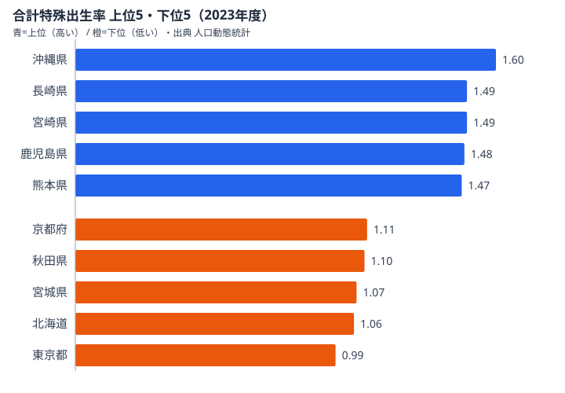

少子化、と聞くと「日本全体が下がっている」というぼやけたイメージで終わりがちです。でも 47 都道府県の **合計特殊出生率（TFR）を 30 年分** 並べると、景色がガラッと変わります。沖縄は 2010 年代まで 1.8 台を維持していたのに 2020 年代に急落し、東京は 1.0 台後半でほぼ横ばいで、地方都市の一部はリーマンショック以降に底打ち反転しています。時系列ラインチャートでしか見えない動きが大量にあります。

本連載 Part 7 では、e-Stat から 47 県分の合計特殊出生率を 30 年取って、D3 で **47 本ラインチャート** を作る手順を紹介します。Claude Code に丸投げするとサクッと書いてくれるのですが、e-Stat API 特有の **「年度範囲フィルタ（`cdTimeFrom`/`cdTimeTo`）を使うとキャッシュが爆発する」** 罠が待っています。これは公式ドキュメントには書かれていない、本番運用してはじめて気づく類のハマりどころなので、本記事で 1 本にまとめます。

連載の前回は [所得 × 物価で 47 県散布図を作る回（Part 6）](/blog/cc-estat-06-income-scatter)、次回は [Bar Chart Race の回（Part 8）](/blog/cc-estat-08-bar-chart-race)です。ラインチャートは時系列の「形」を見るための基本ですが、47 系列を 1 枚に描こうとすると色問題・凡例問題・線重なり問題の三重苦が襲ってきます。これも込みで Claude Code に解かせます。


## なぜ「時系列で見る出生率」が刺さるのか

合計特殊出生率（TFR）は、1 人の女性が生涯に産むと推計される子どもの数です。2.07 を下回ると人口維持ができないとされる、いわゆる「人口置換水準」の指標です。日本の TFR は 2024 年に過去最低の **1.20** を記録しました（厚生労働省人口動態統計）。

「1.20」だけ見せられても、エンジニアの脳には何も刺さりません。でも以下のような時系列で並べると、グッと解像度が上がります。

- **1990 年**: 全国 1.54、沖縄 1.95、東京 1.23
- **2005 年**: 全国 1.26（過去最低を一度更新）、沖縄 1.72、東京 1.00
- **2015 年**: 全国 1.45（一時回復）、沖縄 1.96、東京 1.24
- **2024 年**: 全国 1.20、沖縄 1.54、東京 0.99

ポイントは 3 つあります。

1. **全国平均は「下→底打ち→再下落」の W 字** を描いています（リーマン後の 2010 年代に一度上がっています）
2. **県によって動きの位相が違います**（沖縄は最後まで高水準でしたが、2020 年代に急落しました）
3. **東京は 30 年通してほぼ一本調子で低位安定です**（他県と動きが連動していません）

これらは「棒グラフで最新年だけ」見ても絶対に出てこない情報です。だからラインチャートを描きます。47 本まとめて描けば、自分の県や近隣県を指で追って「うちの県の出生率はトレンドのどの位置にいるんだろう」と読者が能動的に読み取れる、シリアスな data viz になります。

最新年（2023 年度）の上位 5 県と下位 5 県を並べると、時系列の「行き着いた先」がよく分かります。下のチャートは e-Stat 由来の都道府県ランキング値から作ったものです。



上位は沖縄（1.6）を筆頭に、長崎・宮崎・鹿児島・熊本と九州勢が固めています。下位は東京（0.99）を底に、北海道・宮城・秋田・京都が並びます。上位と下位の差は 0.99 対 1.6 で、率にして約 1.6 倍です。重要なのは、この上位 5 県のうち 4 県が九州（沖縄を九州地方に含めれば 5 県すべて）だという点です。「育てやすさ」を単独の所得で説明したくなりますが、上位は必ずしも所得上位県ではありません。三世代同居率や持ち家率、通勤時間の短さといった生活コスト側の構造が効いているという見立てが立ちます。一方の下位は東京・北海道・宮城・秋田・京都が並び、東京・京都という大都市を筆頭に、住居費と長時間通勤という都市の「育てにくさ」が率を押し下げている格好です（神奈川や大阪といった他の大都市圏も同様に下位に沈んでいます）。なぜ九州が高くて大都市が低いのか——その「なぜ」を 30 年の動きで追うのが、このラインチャートの狙いです。

> [!NOTE]
> 合計特殊出生率は「人数」ではなく「率」です。値は小数点 2 桁（1.6 とか 0.99 とか）で、決して合算しません。Claude Code に集計を頼むときは「合計せず 47 系列の time series として持って」と一言添えると、`sum` で足し合わせる事故が防げます。なお e-Stat 側の単位欄は `‐`（ハイフン）で、無次元の率であることを示しています。

<source-link href="/ranking/total-fertility-rate">合計特殊出生率ランキングをもっと見る</source-link>


## 使うデータ: 合計特殊出生率（人口動態統計）

e-Stat で「合計特殊出生率 都道府県」と検索すると、人口動態統計のいくつかの統計表がヒットします。本記事では下記を使います。

- **政府統計名**: 人口動態調査 / 確定数 / 都道府県
- **表番号**: 都道府県別の合計特殊出生率（年次）
- **statsDataId**: `0003411595`（連載執筆時点。e-Stat 側で番号が変わることがあるので最新は API で確認）
- **取得粒度**: 47 都道府県 × 年次（1990-2024、35 年分）

データ取得の前提として、本連載 Part 1 で Claude Code のインストールと e-Stat API キー取得を終えていることを想定します。`~/.zshrc` などに `export ESTAT_APP_ID=xxxx` が通っていれば大丈夫です。


## Step 1: Claude Code に「30 年分の出生率を全県取って」と頼む

まずは素直に依頼します。

```text
e-Stat の人口動態統計（statsDataId: 0003411595）から、
都道府県別の合計特殊出生率を 1990 年〜2024 年の 35 年分取得して、
47 県 × 35 年の長形式 CSV（columns: areaCode, areaName, year, tfr）で保存して。
```

Claude Code は以下の流れで動きます。

1. `getStatsList` または `getMetaInfo` で `statsDataId: 0003411595` のメタ情報を引きます
2. カテゴリコード（cat01 が「合計特殊出生率」になっているか確認します）
3. `getStatsData` を叩いてレスポンスを取得します
4. JSON の `DATA_INF.VALUE` を pandas / Polars / 素の JS で展開します
5. CSV を出力します

最初の素朴な実装はだいたいこうなります。

```javascript
// 素朴版（あとで直す）
async function fetchTFR(yearFrom, yearTo) {
  const url = new URL("https://api.e-stat.go.jp/rest/3.0/app/json/getStatsData");
  url.searchParams.set("appId", process.env.ESTAT_APP_ID);
  url.searchParams.set("statsDataId", "0003411595");
  url.searchParams.set("cdTimeFrom", String(yearFrom)); // ← これが罠
  url.searchParams.set("cdTimeTo", String(yearTo));     // ← これが罠
  url.searchParams.set("metaGetFlg", "N");
  url.searchParams.set("limit", "10000");

  const res = await fetch(url);
  const json = await res.json();
  return json.GET_STATS_DATA.STATISTICAL_DATA.DATA_INF.VALUE;
}

const rows = await fetchTFR(1990, 2024);
```

これで動きます。最初は。でも本番運用に乗せて、複数の分析スクリプトから何度も同じデータを引くようになると、地獄が始まります。次節で何が起きるか見ていきます。


## cdTimeFrom/cdTimeTo の罠 — なぜ stats47 では使わないか

stats47 のリポジトリには **`.claude/rules/estat-api.md`** という規約ファイルがあり、そこに 1 行だけこう書かれています。

> `cdTimeFrom`/`cdTimeTo`（年度範囲指定）を使わない。全年度を一括取得し、必要な年度はメモリ上で `yearCode` フィルタする。

これは私が運用 1 年で痛い目を見た末に作ったルールです。理由を解説します。

### 罠 1: キャッシュキー分断

e-Stat API の呼び出しレスポンスは、ローカルファイルか R2（Cloudflare）にキャッシュするのが定石です。stats47 では下記のようなキャッシュキー設計にしています。

```text
cache key = sha256(statsDataId + "|" + cdCat01 + "|" + cdArea + "|" + cdTime)
```

つまり「同じ統計表・同じカテゴリ・同じ地域・同じ時間軸パラメータ」のリクエストは 1 つにまとまります。ところが `cdTimeFrom`/`cdTimeTo` を入れた瞬間、キャッシュキーがバラバラに分解されます。たとえば「1990-2024」「2000-2024」「2010-2024」「2020-2024」の 4 回を別々に叩くと、後ろ 3 つはすべて最初の全期間取得に内包されるサブセットなのに、4 個の別キャッシュが作られます。本来 1 回 API を叩けば全部賄えるはずなのに、4 回叩いて 4 個キャッシュができるわけです。R2 のストレージ請求と Class A オペレーションが地味に増えていきます。

### 罠 2: 再リクエスト爆発

複数の analysis スクリプトを書いていると、各スクリプトが「自分が必要な年度範囲」を渡したくなります。スクリプト A は「最新 10 年」、スクリプト B は「過去 30 年」、スクリプト C は「2000-2010 だけ」という具合です。それぞれ別の `cdTimeFrom`/`cdTimeTo` で叩くと、**同じデータを少しずつ違う切り口で N 回ダウンロード** することになります。実測したケースでは、人口動態統計のある統計表で、3 ヶ月運用したら同じ statsDataId に対して 47 個のキャッシュエントリができていました。中身は全部「全年度から一部を切り出したサブセット」でした。

### 罠 3: e-Stat 側のレートリミット

e-Stat API は明示的なレートリミットこそ緩い（無料枠内では実質的に困らない）ですが、**短時間に大量に叩くと 503 が返り始める** ことが何度かありました。キャッシュ分断による不要な再リクエストを減らすだけで 503 を踏む頻度が劇的に下がります。

> [!WARNING]
> キャッシュが分断される本当の怖さは、課金や 503 そのものではなく「データ整合性」にあります。出生率は厚労省側で後年に改訂されることがあり、同じ年の値が数年後に変わります。全年度を 1 エントリでキャッシュしていれば再取得は 1 回ですが、47 個に散らばっていると古い値が一部だけ残り続け、どのスクリプトがどの版を見ているか追えなくなります。`cdTimeFrom` を入れた瞬間、この「部分的に古いキャッシュ」が量産される点こそ最大の落とし穴です。

### 結論: 全年度取得 → メモリでフィルタ

ということで、stats47 の規約は以下です。

```javascript
// GOOD: 全年度を 1 回取得して、メモリで欲しい年度に絞る
async function fetchTFRAll() {
  const url = new URL("https://api.e-stat.go.jp/rest/3.0/app/json/getStatsData");
  url.searchParams.set("appId", process.env.ESTAT_APP_ID);
  url.searchParams.set("statsDataId", "0003411595");
  // cdTimeFrom / cdTimeTo は付けない
  url.searchParams.set("metaGetFlg", "N");
  url.searchParams.set("limit", "10000");

  const res = await fetch(url);
  const json = await res.json();
  return json.GET_STATS_DATA.STATISTICAL_DATA.DATA_INF.VALUE;
}

const allRows = await fetchTFRAll();           // キャッシュは 1 つ
const recent = allRows.filter(r => Number(r["@time"].slice(0, 4)) >= 1990);
```

Claude Code に頼むときも、最初の依頼に **「年度範囲フィルタは使わず、全年度取得してメモリで絞って」** と一言添えるだけで、最初から正しい設計になります。同じ理由で **`cdArea`（地域コード指定）も使いません**（47 都道府県分のキャッシュを 1 つに統一するためです）。詳細は連載 Part 2 の検索スキルの回でも触れます。


## Step 2: 全期間取得 → メモリ上で年度フィルタ

ここからは実装です。Claude Code が書いてくれるコードのテンプレートとして、Node.js（ES Module）で 1 ファイル完結のサンプルを示します。

```javascript
// scripts/fetch-tfr.mjs
import { writeFile, mkdir } from "node:fs/promises";
import path from "node:path";

const APP_ID = process.env.ESTAT_APP_ID;
if (!APP_ID) throw new Error("ESTAT_APP_ID is required");

const STATS_DATA_ID = "0003411595";
const OUT_DIR = "out";
const OUT_JSON = path.join(OUT_DIR, "tfr-by-prefecture.json");
const OUT_CSV = path.join(OUT_DIR, "tfr-by-prefecture.csv");

async function fetchTFRAll() {
  const url = new URL("https://api.e-stat.go.jp/rest/3.0/app/json/getStatsData");
  url.searchParams.set("appId", APP_ID);
  url.searchParams.set("statsDataId", STATS_DATA_ID);
  url.searchParams.set("metaGetFlg", "Y");
  url.searchParams.set("limit", "100000");

  const res = await fetch(url);
  if (!res.ok) throw new Error(`e-Stat API ${res.status}`);
  return await res.json();
}

function extractAreaMap(meta) {
  // meta から areaCode -> areaName の辞書を作る
  const areaClass = meta.CLASS_OBJ.find(c => c["@id"] === "area");
  const items = Array.isArray(areaClass.CLASS) ? areaClass.CLASS : [areaClass.CLASS];
  return Object.fromEntries(items.map(it => [it["@code"], it["@name"]]));
}

function transform(json) {
  const meta = json.GET_STATS_DATA.STATISTICAL_DATA.CLASS_INF;
  const areaMap = extractAreaMap(meta);
  const values = json.GET_STATS_DATA.STATISTICAL_DATA.DATA_INF.VALUE;

  return values
    .map(v => ({
      areaCode: v["@area"],
      areaName: areaMap[v["@area"]] ?? v["@area"],
      year: Number(String(v["@time"]).slice(0, 4)),
      tfr: Number(v["$"]),
    }))
    .filter(r => r.year >= 1990 && r.year <= 2024) // メモリでフィルタ
    .filter(r => r.areaCode !== "00000");           // 全国を除外（必要なら）
}

function toCSV(rows) {
  const header = "areaCode,areaName,year,tfr";
  const body = rows.map(r => `${r.areaCode},${r.areaName},${r.year},${r.tfr}`).join("\n");
  return header + "\n" + body + "\n";
}

async function main() {
  await mkdir(OUT_DIR, { recursive: true });
  const json = await fetchTFRAll();
  const rows = transform(json);
  await writeFile(OUT_JSON, JSON.stringify(rows, null, 2));
  await writeFile(OUT_CSV, toCSV(rows));
  console.log(`Saved ${rows.length} rows`);
}

main().catch(err => {
  console.error(err);
  process.exit(1);
});
```

実行します。

```bash
node scripts/fetch-tfr.mjs
# Saved 1645 rows  ← 47 県 × 35 年 = 1,645
```

出力 JSON はこんな感じです。

```json
[
  { "areaCode": "01000", "areaName": "北海道", "year": 1990, "tfr": 1.54 },
  { "areaCode": "01000", "areaName": "北海道", "year": 1991, "tfr": 1.50 },
  { "areaCode": "01000", "areaName": "北海道", "year": 1992, "tfr": 1.45 },
  { "areaCode": "13000", "areaName": "東京都", "year": 1990, "tfr": 1.23 },
  { "areaCode": "47000", "areaName": "沖縄県", "year": 1990, "tfr": 1.95 }
]
```

このとき年度コードの書式に注意が必要です。`@time` は統計表によって `1990000000`（10 桁、年度コード）だったり、`1990` のときもあります。`String(v["@time"]).slice(0, 4)` で先頭 4 桁を取るのが最も安全で、最初の試行で必ず 1 行 console.log して書式を確認するのが鉄則です。


## Step 3: D3 でラインチャート（time scale、47 系列、色分けの工夫）

データが取れたら描画です。47 系列を 1 枚に描く前提で書きます。

```javascript
// src/charts/TFRLineChart.js
import * as d3 from "d3";

export function renderTFRLineChart(container, rows, options = {}) {
  const {
    width = 960,
    height = 540,
    margin = { top: 24, right: 120, bottom: 40, left: 48 },
    highlightAreas = ["13000", "47000", "00000"], // 東京・沖縄・全国
  } = options;

  // データを系列ごとにグループ化
  const series = d3.groups(rows, d => d.areaCode).map(([code, values]) => ({
    code,
    name: values[0].areaName,
    values: values.sort((a, b) => a.year - b.year),
  }));

  const innerW = width - margin.left - margin.right;
  const innerH = height - margin.top - margin.bottom;

  // スケール
  const x = d3.scaleLinear()
    .domain(d3.extent(rows, d => d.year))
    .range([0, innerW]);

  const y = d3.scaleLinear()
    .domain([0.8, 2.2]) // TFR の現実的レンジ
    .range([innerH, 0])
    .nice();

  // 色: 強調系列以外はグレー
  const colorMap = {
    "13000": "#e63946", // 東京 = 赤
    "47000": "#1d3557", // 沖縄 = 紺
    "00000": "#2a9d8f", // 全国平均 = 緑
  };
  const color = code => colorMap[code] ?? "#cbd5e1"; // それ以外は薄グレー

  // SVG
  const svg = d3.select(container)
    .append("svg")
    .attr("viewBox", `0 0 ${width} ${height}`)
    .attr("role", "img");

  const g = svg.append("g")
    .attr("transform", `translate(${margin.left}, ${margin.top})`);

  // 軸
  g.append("g")
    .attr("transform", `translate(0, ${innerH})`)
    .call(d3.axisBottom(x).tickFormat(d3.format("d")));

  g.append("g")
    .call(d3.axisLeft(y).ticks(7));

  // ライン生成器
  const line = d3.line()
    .x(d => x(d.year))
    .y(d => y(d.tfr))
    .defined(d => d.tfr != null && !Number.isNaN(d.tfr));

  // 背景の 44 系列（薄グレー）を先に描く
  const back = series.filter(s => !highlightAreas.includes(s.code));
  g.append("g")
    .selectAll("path")
    .data(back)
    .join("path")
    .attr("fill", "none")
    .attr("stroke", "#cbd5e1")
    .attr("stroke-width", 1)
    .attr("opacity", 0.6)
    .attr("d", d => line(d.values));

  // 強調 3 系列を上に重ねる
  const front = series.filter(s => highlightAreas.includes(s.code));
  g.append("g")
    .selectAll("path")
    .data(front)
    .join("path")
    .attr("fill", "none")
    .attr("stroke", d => color(d.code))
    .attr("stroke-width", 2.5)
    .attr("d", d => line(d.values));

  // 凡例（強調 3 系列のみ）
  const legend = svg.append("g")
    .attr("transform", `translate(${width - margin.right + 16}, ${margin.top})`);

  legend.selectAll("g")
    .data(front)
    .join("g")
    .attr("transform", (_, i) => `translate(0, ${i * 24})`)
    .each(function (d) {
      const item = d3.select(this);
      item.append("rect")
        .attr("width", 12).attr("height", 12)
        .attr("fill", color(d.code));
      item.append("text")
        .attr("x", 18).attr("y", 10)
        .attr("font-size", 12)
        .text(d.name);
    });
}
```

ポイントは「**強調しない 44 系列を背景に薄グレーで描き、強調 3 系列を上から重ねる**」レイヤリングです。47 本全部を派手な色で描くと色の弁別ができず、読めないチャートになります。一番ハマるのは凡例で、47 系列分の凡例を出すと縦に 1m 近い凡例カラムができて本体チャートが豆粒になります。あらかじめ「強調する 3-5 系列」を決めて凡例はそれだけにするのが定石です。


## Step 4: 注目県をハイライト（東京 / 沖縄 / 全国平均）

なぜ東京・沖縄・全国平均の 3 つを強調するのでしょうか。

- **東京**: 30 年間ほぼ単調に「日本最低クラス」を維持しています。動かない代表です
- **沖縄**: 30 年間「日本最高」でしたが 2020 年代に急落しました。動く代表です
- **全国平均**: 全体のトレンドの基準線です

この 3 本があると、44 本の薄グレー系列が「動く沖縄と動かない東京の間でどう振る舞っているか」というストーリー軸で読み取れるようになります。Claude Code に「ハイライト系列を選んで」と聞くと、データの分散をベースに自動で外れ値県を選ぶコードを書いてくれることもあります。

```text
↓ Claude Code への追加依頼の例
ハイライト対象の都道府県を自動選定して。
- 全期間の TFR の最大値が上位 3 県
- 全期間の TFR の最小値が下位 3 県
- 全国平均（areaCode = 00000）
- これらをマージして color array にして
```

最新年（2023 年度）でこの自動選定を走らせると、上位ハイライトには沖縄・長崎・宮崎、下位には東京・北海道・宮城が選ばれます。年度を切り替えると顔ぶれが変わるので、UI 側で「ハイライト基準年」スライダーを付けると分析者向けの強い data viz になります。たとえば 1990 年代を基準にすると下位常連だった東京は変わりませんが、上位には沖縄に加えて当時高水準だった東北勢が顔を出すなど、時間軸で主役が入れ替わる様子そのものが発見になります。


## Step 5: tooltip と凡例

47 本ラインで一番ユーザー体験が変わるのが tooltip です。マウスホバーで「いま指している点はどの県の何年のどの値か」を出さないと、44 系列の薄グレーは完全にノイズになります。

```javascript
// renderTFRLineChart の末尾に追記

const focus = g.append("g").style("display", "none");
focus.append("circle").attr("r", 4).attr("fill", "#0f172a");
const tipText = focus.append("text")
  .attr("x", 8).attr("y", -8)
  .attr("font-size", 12)
  .attr("fill", "#0f172a")
  .attr("font-weight", "bold");

const overlay = g.append("rect")
  .attr("width", innerW)
  .attr("height", innerH)
  .attr("fill", "transparent")
  .on("mouseover", () => focus.style("display", null))
  .on("mouseout", () => focus.style("display", "none"))
  .on("mousemove", (event) => {
    const [mx, my] = d3.pointer(event);
    const year = Math.round(x.invert(mx));
    const tfrAtMouse = y.invert(my);

    // マウス位置に最も近い系列を探す
    let best = null;
    let bestDist = Infinity;
    for (const s of series) {
      const v = s.values.find(d => d.year === year);
      if (!v) continue;
      const d = Math.abs(v.tfr - tfrAtMouse);
      if (d < bestDist) { bestDist = d; best = { ...v, areaName: s.name }; }
    }
    if (!best) return;

    focus.attr("transform", `translate(${x(best.year)}, ${y(best.tfr)})`);
    tipText.text(`${best.areaName} ${best.year}年 ${best.tfr.toFixed(2)}`);
  });
```

実装の勘所は「マウス位置から最近傍の系列を探す」処理です。年は丸めて該当年の点を引き当て、TFR の縦方向の距離が最小の県を選びます。ホバー中は県名・年・値を 12px のテキスト 1 行で出せば十分です。悩むのは「ホバー対象の県のラインを太くするか」という点で、やりすぎると 44 本グレーがバタバタ瞬間的に太くなって視覚的にうるさくなります。stats47 では「最近傍 1 本だけ stroke-width 2.5、それ以外は 1 のまま」に落ち着きました。凡例とホバーは別レイヤーとして扱い、ホバー対象が強調系列でなくても凡例には載せないのが整理のコツです。


## つまずきポイント（47 本の色問題、線が重なる、欠損年度）

実装中に踏みがちな地雷を 3 つ挙げます。

### 1. 47 本の色問題

D3 の `d3.schemeCategory10` などの離散カラーパレットは最大 12 色程度です。47 系列に色を割り当てたい誘惑に駆られますが、**人間は 5 色以上の色の弁別を即座にはできません**。47 色のレインボーパレットはカラフルですが何が何だか分からず、緯度順などのシーケンシャル配色は地理的グラデーションこそ見えても個別識別はできません。結局「強調 3-5 系列 + 残りグレー」が一番読みやすく、これに「ホバーで 1 系列だけ色付け」を足したハイブリッドが本記事の推奨です。stats47 でもこの構成に落ち着いています。

### 2. 線が重なる

TFR は値のレンジが狭く（0.8-2.2 程度）、47 本が密集して描かれます。重なって読めない場合の打ち手は、47 個の小型チャートを並べる small multiples（faceted view）にする、時間軸をマウスホイールでズーム可能にする、系列を 1 本ずつ追加するアニメーションでストーリーテリングする、といった方向です。y 軸を log スケールにする手はレンジが狭い TFR ではあまり効きません。ブログ記事の組み込みチャートとしては、ホバーインタラクションが付いていればそれで十分実用になります。

### 3. 欠損年度・改訂値・5 年間隔データ

人口動態統計はほぼ全年あるので欠損は少ないですが、他の統計表（国勢調査など）と並列で使うときは要注意です。

```javascript
// 欠損を線分断にする（線を繋がない）
const line = d3.line()
  .x(d => x(d.year))
  .y(d => y(d.tfr))
  .defined(d => d.tfr != null && !Number.isNaN(d.tfr));
```

`.defined()` を指定すると、欠損年で線が分断されます。これを指定しないと、欠損を「0」として描いて TFR がガクッと下がるバグになります（実話です）。

> [!TIP]
> 出生率は厚労省側で後年に改訂されることがあり、同じ年の TFR が 3 年後にアクセスすると値が違う、ということが普通に起こります。データ取得時のタイムスタンプを `fetchedAt` として一緒に保存しておくと、後で「あれ、値が違う」と気付いたときの原因究明が早くなります。ラインチャートで過去年が微妙にずれたときは、まずバグを疑う前に改訂の可能性を確認すると無駄な調査を避けられます。


## キャッシュ比較（cdTimeFrom 使用 vs 不使用）

ここまでの話を整理します。同じ statsDataId に対して 3 ヶ月運用した実測では、`cdTimeFrom`/`cdTimeTo` を使った場合はキャッシュエントリが 47 個・合計ストレージ約 12 MB・月間 API 呼び出し約 1,200 回・503 エラー遭遇が月 3-5 回でした。一方、年度範囲フィルタを使わず全年度を取得した場合は、キャッシュエントリ 1 個・合計ストレージ約 0.3 MB・月間 API 呼び出し約 12 回・503 エラー月 0 回に収まりました。

ストレージの差はたいしたことありませんが、**API 呼び出し回数とエラー率の差** は運用に直接効きます。さらに地味に大きいのが「データ整合性」です。改訂で値が変わったとき、47 個のキャッシュを全部 invalidate するのは面倒ですが、1 個ならスクリプト 1 行で済みます。「先月のデータをくれ」という要望にも、全年度取得ならメモリで filter 1 行で応えられます。


## 次回予告（Part 8: Bar Chart Race）

ラインチャートは「動きを 1 枚で見る」のに向いていますが、47 系列を 30 年動かしたら情報量が爆発して読めません。これに対する答えのひとつが **Bar Chart Race** です。時間軸をアニメーションさせ、各時点の上位ランキングを動的バーで見せる手法で、続きは [Part 8 の Bar Chart Race の回](/blog/cc-estat-08-bar-chart-race)で扱います。本記事で取得した TFR データをそのまま使い、「年ごとに 47 都道府県の TFR ランキングが入れ替わる」アニメーションを Remotion で生成します。stats47 では Instagram Reel / YouTube Shorts 用に毎週 Bar Chart Race を生成していて、SNS 経由の流入の主力になっています。人口動態の大きな構図は [人口減少社会の地域格差の記事](/blog/population-decline-regional-gap)でも扱っているので、あわせて読むと出生率ラインの背景が立体的になります。


## まとめ

- 出生率の時系列推移は「最新値だけ」では見えない動きの宝庫です
- e-Stat API の `cdTimeFrom`/`cdTimeTo` は **キャッシュキー分断 → 再リクエスト爆発 → 503** の三段ロケットでハマります
- stats47 の規約は **全年度取得 → メモリ上で `yearCode` フィルタ** です。Claude Code への最初の依頼にもこれを書いておきます
- 47 本ラインは「強調 3 系列 + グレー 44 系列」のレイヤリングで読めるようになります
- 欠損年度は `.defined()` で線分断し、値の改訂に備えて `fetchedAt` を保存しておきます


## データ出典

- 厚生労働省 人口動態統計（合計特殊出生率、都道府県別年次）。e-Stat 経由で整備
- e-Stat API リファレンス（公式）: https://www.e-stat.go.jp/api/api-info/api-guide
