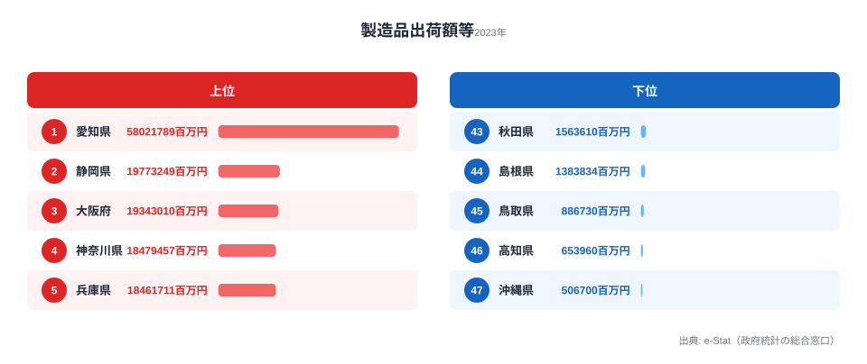

「47 都道府県の製造品出荷額が、1990 年から 2020 年までの間にどう入れ替わったか」——これを **1 本の動画** で見せられたら、SNS でも社内資料でも一気に説得力が上がります。本記事では、e-Stat の工業統計を Claude Code で取得し、**Remotion で Bar Chart Race（ランキング遷移アニメ動画）を MP4 出力する** までを 1 本で通します。連載 Part 8、所要時間 2 時間程度。

Bar Chart Race は、棒グラフが年ごとに順位を入れ替えながらスライドする、あの YouTube で流行ったやつです。Excel で再現するのは無理ゲーですが、**Remotion を使えば React のコードで完全に制御できる** ので、Claude Code との相性が抜群に良い。Part 7 までで取得・整形してきた e-Stat データを「最終出力＝動画」まで持っていくのが今回のゴールです。


## なぜ Bar Chart Race を Remotion で作るのか

D3.js で Bar Chart Race を作るチュートリアルは検索すれば山ほど出てきます。が、**Web に埋め込む前提のものばかり** で、MP4 として出力するには別途キャプチャツール（OBS など）で画面録画する必要があります。これだとフレーム落ちが避けられず、Reels や Shorts に貼った瞬間に「カクカク動画」になります。

Remotion は React で動画を組み立てて、**フレーム単位で完全にレンダリング** してから MP4 にエンコードするフレームワークです。1 秒 60 フレームのうち 1 フレームでもズレない、SNS 投稿用としては理想的な作りになっています。

画面録画 (OBS) と Remotion の違いを、Bar Chart Race を作るうえで効いてくる観点で並べてみます。

- **フレーム精度**: 画面録画は OS 負荷で揺れますが、Remotion はフレーム単位で完全に制御できます。
- **解像度**: 画面録画は表示画面に依存しますが、Remotion は `1080x1920` などを任意に指定できます。
- **文字の鮮明さ**: 画面録画はアンチエイリアスがブレますが、Remotion はベクター描画でクッキリ出ます。
- **再現性**: 画面録画は環境依存ですが、Remotion はコードで一意に決まります。
- **差分修正**: 画面録画は全部撮り直しになりますが、Remotion は該当箇所だけ再 render できます。
- **CI 連携**: 画面録画はほぼ無理ですが、Remotion は GitHub Actions で自動化できます。

stats47 でも `apps/remotion` ワークスペースに Remotion を組み込んでいて、Bar Chart Race・Choropleth Map・縦型棒グラフなど SNS 用の動画素材を一括生成しています。本記事はそのコアパターンを最小構成で再現するチュートリアルです。

Claude Code を組み合わせると、**「e-Stat からデータ取って Remotion の Composition 用に整形しといて」** と一文頼むだけで、Step 2-3 がほぼ自動で終わります。残るは Composition の React コードを書くだけ。これも Claude に「interpolate でランクの遷移をスムーズにして」と頼めば 8 割書いてくれます。


## 使うデータ: 工業統計の都道府県別製造品出荷額 30 年分

今回扱うのは経済産業省「工業統計調査」の **都道府県別 製造品出荷額等** です。e-Stat 経由で 1975 年度から 2023 年度まで連続して整備されており、Bar Chart Race の素材として理想的な「長い時系列」が手に入ります。

「製造品出荷額等」は、工場・事業所が 1 年間に出荷した製品の金額合計で、産業立地の集中度を一発で示す指標です。stats47 が e-Stat 経由で整備した 2023 年度の値で見ると、トップは **愛知県の 58.0 兆円（58,021,789 百万円）**。2 位の静岡県（19.8 兆円）に 3 倍近い差をつけた独走状態で、47 位の沖縄県（5,067 億円）とは **114.5 倍** もの開きがあります。

面白いのは、この順位が 30 年で大きく入れ替わっている点です。1990 年度のトップ 4 は「愛知・神奈川・大阪・東京」の並びでしたが、2023 年度には「愛知・静岡・大阪・神奈川」へと変わりました。とりわけ東京都は、当時トップ 4 に入っていたところから大きく転落し、2023 年度には **16 位** まで下落しています。Bar Chart Race は、まさにこの「順位がすれ違っていく動き」を見せるのに向いた表現です。

Bar Chart Race 向けには、最低でも 20 年・できれば 30 年スパンが欲しいところです。1 年あたり 1.5 秒の表示で 30 年なら 45 秒前後の動画になり、SNS の最適尺（Reels: 90 秒以内、Shorts: 60 秒以内、TikTok: 60 秒推奨）にぴったりハマります。

> [!NOTE]
> 「製造品出荷額等」は事業所の所在地でカウントするため、本社が東京にあっても工場が地方にあれば工場側の都道府県に計上されます。東京都の順位が時代とともに下がるのは、企業の本社機能は残りつつ生産拠点が郊外・地方へ移った（都内の工場が減った）ことを反映しています。「県の経済規模」ではなく「工場の集積度」を見る指標だと押さえておくと、順位の読み違いを防げます。

> [!WARNING]
> 工業統計調査は 2020 年で終了し、以降は「経済構造実態調査 製造業事業所調査」に統合されました。調査の枠組みが変わると集計対象や事業所のカバー範囲が微妙に変わるため、**2020 年前後で値が不連続に見える年がある** 点に注意してください。系列をつなぐときは Claude Code に「両方の統計表を取得して接続して」と頼みつつ、接続点の前後で急な段差がないかを必ず目視で確認します。


## Step 1: Remotion セットアップ（npm init video）

Remotion は単独のプロジェクトとしても、モノレポの 1 ワークスペースとしても作れます。今回はチュートリアルなので、別ディレクトリで素のプロジェクトとして立ち上げます。

```bash
# 任意の場所で
npm init video@latest bar-chart-race
cd bar-chart-race
```

`npm init video` を叩くとテンプレート選択肢が出てきます。`Hello World` （v3 系の TypeScript テンプレート）を選んでください。`Blank` でも良いですが、まずは動くサンプルから差分で組み立てた方が事故が少ないです。

```bash
# 開発サーバ起動（プレビュー UI が localhost:3000 で立ち上がる）
npm run dev
```

`npm run dev` を叩くと Remotion Studio という Web UI が開き、左ペインに Composition 一覧、右ペインにタイムラインとプレビュー、というエディタ風の画面が出ます。**ここでアニメーションを React のホットリロードで作っていく** のが Remotion の体験のキモです。

主要なディレクトリの役割は次のとおりです。

- `src/Root.tsx` — Composition の登録（id・解像度・FPS・duration を宣言）
- `src/Composition.tsx` — 動画本体の React コンポーネント
- `public/` — 静的アセット（画像・フォントなど）を置く場所
- `out/` — レンダリング後の MP4 出力先（デフォルト）

Composition とは、Remotion における「1 本の動画」の単位です。1 プロジェクトに複数 Composition を登録できるので、後述の縦型 (Reels) と横型 (YouTube) の 2 本を同時に出すなどの構成も可能です。


## Step 2: Claude Code に「製造品出荷額 30 年取って」と頼む

ここで Claude Code の出番です。e-Stat API キーは Part 1 で取得済みの前提で、プロジェクトルートに `.env` を作っておきます。

```bash
echo "ESTAT_APP_ID=あなたのキー" >> .env
```

Claude Code を起動し、こう頼みます。

```
claude
```

```text
e-Stat API（ESTAT_APP_ID は .env にある）から、
工業統計調査「都道府県別 製造品出荷額等」を 1990 年から 2020 年まで取って、
src/data/manufacturing.json に
{ "years": [1990, 1991, ...], "prefectures": [{"code": "01", "name": "北海道", "values": [12345, 12500, ...]}, ...] }
の形で保存して。
2020 年以降は経済構造実態調査の都道府県別データで補完して 2023 年まで欲しい。
単位は億円で揃えること。
```

Claude Code は e-Stat の `getStatsList` で該当統計表 ID を探し（または Part 2 で作った検索スキルを呼び）、`getStatsData` を 30 年分ループで叩いて、JSON に整形して保存してくれます。途中で「ある年のデータが取れない」「`@cat01` の意味コードが揺れている」など細かい例外が出ますが、**エラーログを Claude に貼れば即修正案** が返ってきます。

> [!TIP]
> e-Stat API は `cdTimeFrom` / `cdTimeTo`（年度範囲）や `cdArea`（地域絞り込み）を多用すると、同じ統計表をパラメータ違いで何度も叩くことになりキャッシュが分断されます。**全年度・全地域を一括取得してメモリ上でフィルタ** する方が API 呼び出し回数を減らせて速いので、Bar Chart Race のように全年・全県を使う用途では特に「まとめて取って後で絞る」を徹底すると効率が上がります。

生成された JSON はこんな感じになります。

```json
{
  "years": [1990, 1991, 1992, "...", 2022, 2023],
  "prefectures": [
    { "code": "01", "name": "北海道", "values": [54321, 53890, "...", 61200, 62100] },
    { "code": "02", "name": "青森県", "values": [12450, 12300, "...", 14200, 14500] },
    "...",
    { "code": "23", "name": "愛知県", "values": [368000, 370200, "...", 478000, 481000] },
    "...",
    { "code": "47", "name": "沖縄県", "values": [4200, 4350, "...", 5100, 5200] }
  ]
}
```


## Step 3: 各年で 47 県をソートした配列に整形

Bar Chart Race のアニメは「ある時点での順位」を毎フレーム決める必要があります。Step 2 の JSON のままだと「県ごとの時系列」になっているので、これを「**年ごとの順位スナップショット**」に変換します。

Claude Code に頼んでも良いですが、ロジックがシンプルなので一度自分で書いて理解する価値があります。

```typescript
// src/data/buildSnapshots.ts
import raw from "./manufacturing.json";

export type Snapshot = {
  year: number;
  ranks: Array<{
    code: string;
    name: string;
    value: number;
    rank: number; // 1 が最上位
  }>;
};

export function buildSnapshots(): Snapshot[] {
  return raw.years.map((year, yearIdx) => {
    const ranks = raw.prefectures
      .map((pref) => ({
        code: pref.code,
        name: pref.name,
        value: pref.values[yearIdx] ?? 0,
      }))
      .sort((a, b) => b.value - a.value)
      .map((row, idx) => ({ ...row, rank: idx + 1 }));
    return { year, ranks };
  });
}
```

これで `[{ year: 1990, ranks: [{code, name, value, rank}, ...] }, ...]` が手に入ります。Composition 側ではこれを参照して毎フレーム描画する、というだけです。データ欠損年度 (`null`) は `?? 0` で 0 扱いにしていますが、Bar Chart Race では **「直前年で線形補間」する** のが定石です。後述の「つまずきポイント」で詳しく触れます。


## Step 4: Remotion で Composition 作成（interpolate でランキング遷移をスムーズに）

Composition の本体を書きます。骨子は「**年 N と年 N+1 の間を補間して棒の位置と長さをアニメーションする**」。Remotion の `interpolate` 関数が主役です。

```tsx
// src/BarChartRace.tsx
import { AbsoluteFill, useCurrentFrame, useVideoConfig, interpolate } from "remotion";
import { buildSnapshots } from "./data/buildSnapshots";

const SECONDS_PER_YEAR = 1.5; // 1 年あたり 1.5 秒
const TOP_N = 10;             // 上位 10 県だけ表示

export const BarChartRace: React.FC = () => {
  const frame = useCurrentFrame();
  const { fps, width } = useVideoConfig();
  const snapshots = buildSnapshots();

  // 現在「何年と何年の間」にいるかを算出
  const framesPerYear = SECONDS_PER_YEAR * fps;
  const yearIdx = Math.min(
    Math.floor(frame / framesPerYear),
    snapshots.length - 2,
  );
  const progress = (frame % framesPerYear) / framesPerYear; // 0..1

  const cur = snapshots[yearIdx];
  const next = snapshots[yearIdx + 1];

  // 年の小数表示（例: 2003.4 → 2003 にフロアして表示）
  const displayYear = Math.floor(
    interpolate(progress, [0, 1], [cur.year, next.year]),
  );

  // 描画用に「補間後の順位・値」を作る
  const rows = cur.ranks
    .map((curRow) => {
      const nextRow = next.ranks.find((r) => r.code === curRow.code)!;
      const rank = interpolate(progress, [0, 1], [curRow.rank, nextRow.rank]);
      const value = interpolate(progress, [0, 1], [curRow.value, nextRow.value]);
      return { ...curRow, rank, value };
    })
    .sort((a, b) => a.rank - b.rank)
    .slice(0, TOP_N);

  const maxValue = rows[0].value;
  const barAreaWidth = width - 320; // 左に県名、右に値を表示する余白

  return (
    <AbsoluteFill style={{ background: "#0b1220", color: "white", padding: 48 }}>
      <h1 style={{ fontSize: 48, fontWeight: 800 }}>
        都道府県別 製造品出荷額 ({displayYear} 年)
      </h1>
      <div style={{ marginTop: 32 }}>
        {rows.map((row) => {
          const y = (row.rank - 1) * 88;
          const barWidth = (row.value / maxValue) * barAreaWidth;
          return (
            <div
              key={row.code}
              style={{
                position: "absolute",
                top: 120 + y,
                left: 0,
                right: 0,
                height: 72,
                display: "flex",
                alignItems: "center",
              }}
            >
              <div style={{ width: 160, fontSize: 32 }}>{row.name}</div>
              <div
                style={{
                  width: barWidth,
                  height: 56,
                  background: colorOf(row.code),
                  borderRadius: 8,
                }}
              />
              <div style={{ marginLeft: 16, fontSize: 28 }}>
                {Math.round(row.value).toLocaleString()} 億円
              </div>
            </div>
          );
        })}
      </div>
    </AbsoluteFill>
  );
};

// 都道府県コードに応じた色（実際は 47 色のパレットを別ファイルで管理）
function colorOf(code: string): string {
  const palette = ["#ef4444", "#f97316", "#eab308", "#22c55e", "#06b6d4", "#3b82f6", "#8b5cf6", "#ec4899"];
  return palette[Number(code) % palette.length];
}
```

ポイントは 3 つ。

1. **`rank` を補間値（float）で持つ**: ランクを整数で持つと、5 位→4 位の入れ替わりが「ガクッ」と瞬間切替してしまい、Bar Chart Race の見どころである「**棒同士が滑らかにすれ違う動き**」が出ません。`interpolate` で 5.0 → 4.0 と連続値にすることで、入れ替わり中の途中位置 (4.6 位など) を Y 座標として描画でき、ぬるっと動きます。
2. **`value` も補間する**: 値も毎フレーム補間しないと棒の長さがカクつきます。
3. **`sort` してから `slice(TOP_N)`**: 上位 10 県だけ見せるなら、毎フレーム改めてソートして TOP_N を取り直すこと。前フレームの順位を引きずると、ランクインしたばかりの県が表示されません。

Composition の登録は `src/Root.tsx` で行います。

```tsx
// src/Root.tsx
import { Composition } from "remotion";
import { BarChartRace } from "./BarChartRace";
import { buildSnapshots } from "./data/buildSnapshots";

const snapshots = buildSnapshots();
const SECONDS_PER_YEAR = 1.5;
const FPS = 30;

export const RemotionRoot: React.FC = () => {
  const totalSeconds = (snapshots.length - 1) * SECONDS_PER_YEAR + 2; // 末尾に余韻 2 秒
  return (
    <>
      <Composition
        id="BarChartRace-Vertical"
        component={BarChartRace}
        durationInFrames={Math.ceil(totalSeconds * FPS)}
        fps={FPS}
        width={1080}
        height={1920}
      />
      <Composition
        id="BarChartRace-Landscape"
        component={BarChartRace}
        durationInFrames={Math.ceil(totalSeconds * FPS)}
        fps={FPS}
        width={1920}
        height={1080}
      />
    </>
  );
};
```

縦型と横型を 2 本登録しておくと、SNS 用と YouTube 用で `id` を切り替えるだけで書き出せます。

Bar Chart Race の最終フレーム、つまり 2023 年度時点の順位スナップショットを静止画で見ると、動画が「どこへ着地するか」がよく分かります。実際のデータでは次のようになります。



愛知県が 58.0 兆円で 2 位の静岡県を 3 倍近く引き離し、上位は静岡・大阪・神奈川・兵庫と工業県が固まります。一方の下位は、秋田・島根・鳥取・高知・沖縄と、もともと製造業の集積が薄い地域が並びます。Bar Chart Race のアニメでは、この上位グループ内での順位の下落・上昇がそのまま見どころになります。たとえば神奈川県は 2023 年度に 4 位ですが、これは 1990 年度のトップ 3 圏内からの下落です。東京都に至っては当時のトップ 4 から 16 位まで転落しており、棒がすれ違いながら沈んでいく様子が動画ではっきり伝わります。最新年の全 47 県の値や年次の推移は、ランキングページで確認できます。

<source-link href="/ranking/manufacturing-shipment-amount">製造品出荷額等ランキング（全 47 県・年次推移）を見る</source-link>


## Step 5: フレームレート / 解像度（縦型 1080x1920 for Reels/Shorts）

SNS 媒体ごとに最適な解像度・アスペクト比・尺は異なります。Remotion は Composition 単位で `width` `height` `fps` を変えられるので、媒体に合わせた書き出し設定を整理しておくと迷いません。縦型 9:16（`1080×1920` / 30fps）を 1 本作っておけば、主要な縦型媒体は概ねカバーできます。

- **Instagram Reels** — `1080×1920`（9:16）/ 30fps / 推奨尺 〜90 秒
- **YouTube Shorts** — `1080×1920`（9:16）/ 30fps / 推奨尺 〜60 秒
- **TikTok** — `1080×1920`（9:16）/ 30fps / 推奨尺 15〜60 秒
- **X (Twitter)** — `1280×720`（16:9）/ 30fps / 推奨尺 〜140 秒
- **YouTube 通常** — `1920×1080`（16:9）/ 30〜60fps / 尺の制限なし
- **LinkedIn** — `1080×1080`（1:1）/ 30fps / 推奨尺 〜30 秒

製造品出荷額は 30 年 × 1.5 秒/年 = 45 秒。これに余韻 2 秒を足して計 47 秒なので、Reels / Shorts / TikTok すべてに収まります。

FPS は 30 で十分です。Bar Chart Race の動き量だと 60fps にしてもファイルサイズが倍になるだけで、視覚的な滑らかさは大きく変わりません。逆に **24fps だと棒の入れ替わりが微妙にカクつく** ので、30fps を下回らないようにします。

1 分動画（H.264）のおおよそのファイルサイズは、設定ごとに次のくらいです。

- `1080×1920` / 30fps — 15〜25 MB
- `1080×1920` / 60fps — 30〜50 MB
- `1920×1080` / 30fps — 20〜35 MB
- `1920×1080` / 60fps — 40〜70 MB

Instagram の Reels は **アップロード上限 300 MB** なので、30fps なら 10 分まで余裕があり、ファイルサイズはほぼ気にしなくて構いません。


## Step 6: MP4 書き出し（npx remotion render）

ローカルでのレンダリングは 1 行です。

```bash
# 縦型 (Reels/Shorts/TikTok 用)
npx remotion render BarChartRace-Vertical out/bar-chart-race-vertical.mp4

# 横型 (YouTube/X 用)
npx remotion render BarChartRace-Landscape out/bar-chart-race-landscape.mp4
```

初回は Chrome Headless がダウンロードされるため数分かかります（約 200 MB）。2 回目以降は 47 秒の動画なら Apple M2 で 20-40 秒くらいで終わります。

オプションも豊富で、よく使うものを並べておきます。

```bash
# 解像度を後から上書き（Composition と別解像度で書き出したい時）
npx remotion render BarChartRace-Vertical --width 720 --height 1280 out/preview.mp4

# 並列レンダリング（CPU 全使用）
npx remotion render BarChartRace-Vertical --concurrency=8 out/bar.mp4

# プロキシ用に低品質プレビュー
npx remotion render BarChartRace-Vertical --crf 28 out/preview.mp4

# 静止画 (PNG) として 1 フレーム抜く（サムネ用）
npx remotion still BarChartRace-Vertical out/thumbnail.png --frame=900
```

CI で自動化するなら GitHub Actions に上記コマンドを書くだけ。Remotion 公式が提供する Docker イメージを使えば Chrome ダウンロードもキャッシュされて、毎日新しい動画を自動生成するパイプラインが組めます。stats47 でも `apps/remotion` でこの構成にしており、Composition のコードを差し替えれば翌日には新作 Reels が SNS にデプロイされます。


## SNS 用 captions（人気拡散のコツ）

Bar Chart Race は動画自体が情報量 100% なので、キャプションは **「視聴者に何を見てほしいか」を 1 文に絞る** のが鉄則です。長文の説明を入れても、動画再生中は誰も読みません。媒体ごとのキャプション例は次のとおりです。

- **Instagram Reels** — 「30 年で愛知が独走、東京は 16 位まで転落。」 + ハッシュタグ 10 個前後
- **YouTube Shorts** — 「【製造業】47 都道府県ランキング 1990-2023」 + 概要欄に元データ URL
- **TikTok** — 1 行短文 + `#日本地理` `#統計` `#意外と知らない`
- **X (Twitter)** — 「製造品出荷額 30 年の都道府県順位推移。あなたの県は何位？」 + 動画添付

ハッシュタグは **トレンド系（`#日本` `#ランキング`）と専門系（`#製造業` `#工業統計`）を 1:1 で混ぜる** と発見性が伸びやすくなります。

> [!TIP]
> 視聴者は自分の都道府県名をエゴサーチして反応する習性があります。キャプションに **具体的な県名と順位（「東京は 16 位まで転落」など）を 1〜2 個入れる** と、その県に縁のある人がコメント・シェアしやすくなります。[仮説] 県名を複数含むキャプションは反応が伸びやすいという感触がありますが、効果量は媒体・テーマで変わるため、自分のアカウントで A/B を取って確かめるのが確実です。


## つまずきポイント

### つまずき 1: 同順位のフリッカ

複数の県が **同じ値（または小数点以下で僅差）** のとき、フレームごとにソート結果が入れ替わって棒がチカチカします。対策は 2 つ。

```typescript
// 対策 A: 第二ソートキーに県コードを使って安定ソート化
.sort((a, b) => b.value - a.value || a.code.localeCompare(b.code));

// 対策 B: 同順位を許容してランクを duplicate
const ranked = sorted.map((row, idx, arr) => ({
  ...row,
  rank: arr.findIndex((r) => r.value === row.value) + 1, // 同値は同ランク
}));
```

stats47 では対策 A を採用しています。同順位 (=) を見せるより、安定した順位入れ替えの方が動画として読みやすいためです。

### つまずき 2: データ欠損年度の補間

工業統計でも、5 年ごとの構造調査年と毎年の簡易調査年で県別の有無が違ったり、市町村合併で系列が切れる県があります。`values[i]` が `null` のとき、何も対策しないと棒が一気に 0 まで縮んで Bar Chart Race が崩壊します。

```typescript
// 線形補間で null を埋める
function fillNulls(values: (number | null)[]): number[] {
  const out = [...values] as number[];
  for (let i = 0; i < out.length; i++) {
    if (out[i] != null) continue;
    const prev = out.slice(0, i).reverse().find((v) => v != null);
    const next = out.slice(i + 1).find((v) => v != null);
    if (prev != null && next != null) {
      // 線形補間
      const prevIdx = out.lastIndexOf(prev, i);
      const nextIdx = out.indexOf(next, i);
      out[i] = prev + ((next - prev) * (i - prevIdx)) / (nextIdx - prevIdx);
    } else {
      out[i] = prev ?? next ?? 0;
    }
  }
  return out;
}
```

Claude Code に「`manufacturing.json` の `values` に `null` がある県を線形補間して埋めて」と頼めば同等のコードを書いてくれます。

### つまずき 3: 軸スケール変動

Bar Chart Race は最上位の値（`maxValue`）で棒の長さを正規化しますが、30 年で最上位の値そのものが伸びる（または縮む）と、**過去と未来で「同じ長さの棒が違う額を示す」** という認知バグが起きます。

対策 1: 軸を **全期間の最大値で固定**。

```typescript
const globalMax = Math.max(...snapshots.flatMap((s) => s.ranks.map((r) => r.value)));
const barWidth = (row.value / globalMax) * barAreaWidth;
```

対策 2: 値ラベルを必ず表示します（兆円・億円など読者が直感できる単位に丸めて）。視聴者が棒の長さではなく数字で判断できるようにするのが狙いです。

stats47 では **両方とも採用** しています。動画は数秒で流れていくので、冗長なくらい情報を載せた方が伝わります。なお、この「全期間の最大値で軸を固定し、時系列の入れ替わりを連続値で補間する」という考え方は、[Part 7 の出生率を 47 本ラインで描く回](https://stats47.jp/blog/cc-estat-07-birthrate-line) で扱った時系列描画の応用でもあります。


## 次回予告（Part 9: レーダーチャート）

Part 9 では、47 都道府県の「**多次元プロフィール**」を一発で見せる **レーダーチャート** を Claude Code + D3.js で作ります。たとえば「東京都の人口密度・所得・大学進学率・出生率を 5 角形で示す」みたいな絵です。Bar Chart Race は時系列でしたが、レーダーは「ある時点での横比較」が得意な表現です。両者を使い分けられると、データ可視化の引き出しが一気に広がります。

レーダーチャートも実は実装が地味に難しく、特に「軸の正規化（人口密度と出生率を同じスケールに乗せる方法）」と「3 県以上の重ね描画でラベルが衝突する問題」のトレードオフが面白いポイントです。お楽しみに。

なお本連載をまだ追っていない方は、[Part 1: 環境構築と API キー取得](https://stats47.jp/blog/cc-estat-01-setup) で Claude Code と e-Stat をセットアップしたうえで、[Part 6: 所得 × 物価で散布図](https://stats47.jp/blog/cc-estat-06-income-scatter) や [Part 4: 高齢化率を 47 県ヒートマップに](https://stats47.jp/blog/cc-estat-04-aging-heatmap) と読み進めると、データ取得から可視化までの流れが一通りつかめます。製造業まわりのほかの指標を眺めたいときは [テーマ: 鉱工業](https://stats47.jp/themes/miningindustry) のダッシュボードが入口になります。


## データ出典

- 製造品出荷額等の数値は、経済産業省「工業統計調査」および後継の「経済構造実態調査 製造業事業所調査」を e-Stat（政府統計の総合窓口）経由で取得・整備したものです。本記事の 2023 年度値（愛知 58,021,789 百万円、沖縄 506,700 百万円 ほか）は stats47 が R2 に整備したデータセットに基づきます。
- 順位の変遷（1990 年度トップ 4「愛知・神奈川・大阪・東京」→ 2023 年度「愛知・静岡・大阪・神奈川」、東京都は当時のトップ 4 から 16 位まで下落）も同データセットの値から算出しています。
- 単位は元データの「百万円」で表記し、本文では読みやすさのため一部を兆円・億円に換算しています。


---

ここまでで Bar Chart Race の MP4 が手元に出力できているはずです。Reels や TikTok に投稿すれば、**「製造業ってこんなに県によって違うのか」と多くの人に届く動画資産** が手に入ります。Claude Code はデータ取得・整形・コード生成の 3 段階すべてで効くので、Remotion を触ったことがない人でも 1 日かからずに 1 本仕上がります。次回は静止画の表現力を一気に上げるレーダーチャートで会いましょう。
