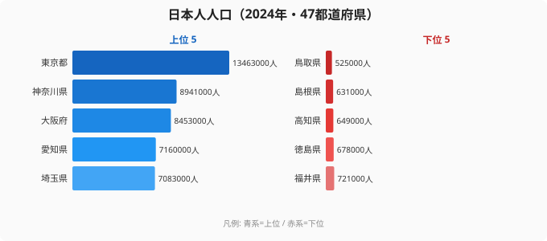

棒グラフは「1 指標を 47 県で比べる」のが得意でした（Part 3）。ヒートマップは「2 軸 × 時間」を 1 枚に圧縮するのが得意でした（Part 4）。コロプレスは「空間分布」を、散布図は「2 変数の関係」を得意としていました（Part 5・6）。

ではこんな問いに、どのチャートで答えるべきでしょうか。

> **「東京都って結局どんな県なの？ 全国と比べて、何が強くて何が弱い？」**

棒グラフを 6 枚並べるのは情報の物量で殴る感じで、読み手はすぐ疲れてしまいます。数字を並べるだけでは「形」が見えません。ここで効くのが **レーダーチャート** です。1 つの県の特性を 1 枚の多角形で表現し、形の歪み方で「県のキャラクター」を瞬時に伝えられます。

ただしレーダーには 1 つだけ重い宿題があります。**軸ごとに単位が違う指標を、同じスケールに揃える「正規化」** です。人口（人）、所得（円）、教育費（円/世帯）、医療費（円/人）、犯罪率（件/千人）、観光客数（人）——単位も桁数もバラバラです。これを 0〜1 にスケールしないと、多角形が「ほぼ 1 軸だけ突き出した針」になってしまいます。

本記事では、Claude Code に **6 指標 × 47 都道府県のデータを並列取得 → min-max 正規化 → D3 でレーダー描画** までを依頼します。Part 9 のゴールは、東京都と京都府の 2 県を 1 枚のレーダーで重ね描きして「東京と京都ってこんなに性格が違うんだ」と言える状態です。所要時間は 90 分。コードは Claude Code が書きます。

## なぜ正規化が要るのか：人口だけで 25 倍開く

正規化の必要性は、まず「生の値がどれだけ暴れるか」を見ると腹落ちします。レーダーの 6 軸のうち最初の軸である **人口規模** を、実データで確認してみましょう。下の図は日本人人口（2024 年・47 都道府県）の上位 5 県と下位 5 県です。



上位は東京都 1,346 万人、神奈川県 894 万人、大阪府 845 万人、愛知県 716 万人、埼玉県 708 万人。下位は福井県 72 万人、徳島県 67 万人、高知県 64 万人、島根県 63 万人、鳥取県 52 万人です。**最大の東京都と最小の鳥取県では、人口だけで 25 倍以上の開き**があります。これは三大都市圏に人口が集中し、地方は転出超過で縮小し続けてきた構造をそのまま映しています。上位 5 県のうち東京・神奈川・埼玉と関東圏が 3 県を占め、下位 5 県は鳥取・島根・高知・徳島と中四国の小規模県が並ぶ点も、この一極集中の表れです。

問題はここからです。レーダーに人口（百万単位）と犯罪率（10 件単位）を生値のまま重ねたら、人口軸だけが満点に張り付き、他の軸はすべて中心付近に潰れます。25 倍も振れる軸と、せいぜい数倍しか振れない軸を同じ図に乗せるには、**各軸を「全国の中での相対位置（0〜1）」に変換する**しかありません。それが min-max 正規化です。

> [!NOTE]
> ランキングの「順位」と、レーダーで使う「正規化値」は別物です。順位は 1〜47 の整数で、隣との差が均等に見えますが、実際には 1 位と 2 位の値の差が、46 位と 47 位の差より桁違いに大きいこともあります。レーダーは「値そのものの相対位置」を見せたいので、順位ではなく min-max 正規化値（連続値）を軸に取ります。

<source-link href="/ranking/japanese-population">日本人人口ランキングの全47都道府県を見る</source-link>

## 使う指標と「県の多角的プロフィール」設計

レーダーチャートで一番悩むのが軸の選定です。軸が多すぎる（10 以上）と見づらく、少なすぎる（3 軸以下）と三角形ばかりで個性が出ません。経験則として **5〜8 軸が読める上限** です。

今回は「県の暮らしと経済」を多角的に捉える 6 軸で設計します。

- **人口規模**（人口推計・人）— 中立の規模指標。先ほどの図で見たとおり最も大きく振れる軸です
- **県民所得**（県民経済計算・千円/人）— 高い方が良い
- **教育費**（家計調査・円/世帯）— 高い方が良い
- **医療費**（国民医療費・千円/人）— **低い方が良い**（要反転）
- **犯罪率**（犯罪統計・件/千人）— **低い方が良い**（要反転）
- **観光客数**（観光入込客統計・千人/年）— 高い方が良い

ここに **重要なポイント** が 2 つあります。

第一に、**指標方向の正負を統一する** ことです。レーダーは「外側に張り出すほど良い」と直感的に読まれるチャートなので、医療費や犯罪率のような「低い方が良い」指標はそのままだと混乱を招きます。正規化のときに **1 から引いて反転** させて、すべての軸を「外側が良い」に揃えます。

第二に、**桁数のレンジを揃える** ことです。人口（百万単位）と犯罪率（10 件単位）を生値のまま重ねたら、人口軸だけが満点に張り付いて他軸が潰れます。これを解決するのが min-max 正規化です。具体的には次の式になります。

```text
x_normalized = (x - x_min) / (x_max - x_min)
```

47 都道府県の中での最小値を 0、最大値を 1 にする線形変換です。Claude Code に頼むときも「**全 47 県の中での min-max 正規化で 0〜1 にスケール、医療費と犯罪率は 1 から引いて反転**」と一文書けば、ロジックを書いてくれます。

## Step 1: 6 つの statsDataId を取得 → Claude Code に並列リクエスト

まず 6 指標分の e-Stat 統計表 ID を集めます。連載 Part 2 で作った `/search-estat` スキルを使うと、Claude Code に対話的に頼めます。

```bash
claude
```

```
あなた: e-Stat で次の 6 指標について最新年の都道府県別データが取れる
       statsDataId を一覧で出して。
       1. 人口（人口推計）
       2. 1人当たり県民所得（県民経済計算）
       3. 1世帯当たり教育費（家計調査）
       4. 1人当たり国民医療費
       5. 刑法犯認知件数（犯罪統計）
       6. 観光入込客数（観光庁観光入込客統計）

Claude: /search-estat スキルで照会します...
       （statsDataId・最新年・補足を一覧で返してくれます。
        ID は最新版が変わるので、必ず取得時点の最新を確認してください）
```

ID が揃ったら、6 リクエストを並列で投げます。Part 1 でも触れた **同時並列 5 本ルール**（e-Stat は 10 超で 503 が増える）を守るため、`p-limit` で concurrency=5 にします。

```bash
npm install p-limit
```

Claude Code に書かせるスクリプトはこんな雰囲気です。

```javascript
// fetch-six-indicators.mjs
import pLimit from "p-limit";
import fs from "node:fs/promises";

const APP_ID = process.env.ESTAT_APP_ID;
const TARGETS = [
  { key: "population", id: "0003448237", year: "2024" },
  { key: "income", id: "0003448900", year: "2022" },
  { key: "education", id: "0002070010", year: "2024" },
  { key: "medical", id: "0003411652", year: "2022" },
  { key: "crime", id: "0003445120", year: "2024" },
  { key: "tourism", id: "0003200200", year: "2023" },
];

const limit = pLimit(5);

async function fetchOne({ key, id, year }) {
  const url = new URL(
    "https://api.e-stat.go.jp/rest/3.0/app/json/getStatsData"
  );
  url.searchParams.set("appId", APP_ID);
  url.searchParams.set("statsDataId", id);
  url.searchParams.set("limit", "5000");

  const res = await fetch(url).then((r) => r.json());
  const values = res.GET_STATS_DATA.STATISTICAL_DATA.DATA_INF.VALUE;
  const arr = Array.isArray(values) ? values : [values];

  // 47 都道府県 × 指定年だけに絞る
  const filtered = arr.filter(
    (v) => /^\d{2}000$/.test(v["@area"]) && v["@time"].startsWith(year)
  );

  return [
    key,
    Object.fromEntries(
      filtered.map((v) => [v["@area"], Number(v["$"])])
    ),
  ];
}

const results = await Promise.all(
  TARGETS.map((t) => limit(() => fetchOne(t)))
);

const merged = Object.fromEntries(results);
await fs.writeFile("six-indicators-raw.json", JSON.stringify(merged, null, 2));
console.log("✓ wrote six-indicators-raw.json");
```

実行すると、指標名をトップレベル key にして、その下に「地域コード → 生値」が並んだ JSON が生まれます。

> [!TIP]
> Claude Code に「6 つの JSON を 1 ファイルに merge して、トップレベル key は指標名にして」と頼めば、上の構造を勝手に組み立ててくれます。生 JSON のネストが深くて辛い API ほど、Claude Code に整形を任せる効果が大きいです。手で `VALUE` 配列を掘る作業から解放されます。

ここまでで「**指標 × 都道府県 → 生値**」の dict が手元に揃いました。次が本記事の本丸、正規化です。

## Step 2: 全県のデータで min-max 正規化（0-1 にスケール）

正規化の式は冒頭で書いたとおりシンプルです。**ただし「全 47 県の min/max」を使う** ことが重要です。1 県だけのデータで正規化してしまうと、その県のなかでの最小最大に張り付いてしまい、全国比較になりません。

Claude Code に頼むときのプロンプトはこうなります。

```
あなた: six-indicators-raw.json を読み込んで、各指標について
       全 47 都道府県の min-max 正規化を実行して。
       ただし以下 2 指標は「低い方が良い」ので 1 から引いて反転して:
         - medical (国民医療費)
         - crime (刑法犯認知件数)
       出力は six-indicators-normalized.json に書き出して、
       各県 6 指標の 0〜1 値が並んだ構造にして。
```

返ってくるスクリプトはおおむねこんな感じになります。

```javascript
// normalize.mjs
import fs from "node:fs/promises";

const raw = JSON.parse(await fs.readFile("six-indicators-raw.json", "utf8"));

const INVERT = new Set(["medical", "crime"]); // 低い方が良い

const normalized = {};

for (const [indicator, values] of Object.entries(raw)) {
  const nums = Object.values(values);
  const min = Math.min(...nums);
  const max = Math.max(...nums);
  const range = max - min || 1; // ゼロ割防止

  for (const [area, v] of Object.entries(values)) {
    let n = (v - min) / range; // 0..1
    if (INVERT.has(indicator)) n = 1 - n; // 反転
    if (!normalized[area]) normalized[area] = {};
    normalized[area][indicator] = Number(n.toFixed(3));
  }
}

await fs.writeFile(
  "six-indicators-normalized.json",
  JSON.stringify(normalized, null, 2)
);
console.log("✓ wrote six-indicators-normalized.json");
```

この処理を通すと、人口で 25 倍も開いていた生値が、すべて 0〜1 の同じ土俵に乗ります。たとえば人口軸なら、東京都は 1.0（=全国最大）、鳥取県は 0.0（=全国最小）に変換され、他県はその間の相対位置に並びます。所得・教育費・医療費・犯罪率・観光客数も、それぞれの軸で「全国のどのあたりか」を表す 0〜1 値になります。

> [!WARNING]
> 反転を忘れると意味が逆転します。医療費や犯罪率は「低い方が暮らしやすい」指標なので、`1 - n` で反転しておかないと、医療費が高い大都市が「医療軸も満点 → 良い県」と誤読されます。Claude Code に「正規化して」とだけ頼むと方向は解釈してくれないので、**反転する指標名を必ず明示**してください。

> [!TIP]
> 正規化のときに「外れ値が 1 県だけある」場合は要注意です。たとえば観光客数のような指標は、ある年に 1 県だけ桁違いに大きいと、その県だけ 1.0、他はほぼ 0 に潰れます。対策は後述の「つまずきポイント」セクションへ。

## Step 3: D3 でレーダーチャート（polygon + axes + grid）

D3 でレーダーを描くコアは **極座標変換** です。各軸を中心から等角度で放射状に配置し、その軸上の正規化値を半径として点を打ち、点同士を polygon で結びます。書き下すと 60 行ちょいで収まります。

```javascript
// radar.mjs (D3 v7 想定)
import * as d3 from "d3";
import { JSDOM } from "jsdom";
import fs from "node:fs/promises";

const data = JSON.parse(
  await fs.readFile("six-indicators-normalized.json", "utf8")
);
const AXES = [
  { key: "population", label: "人口規模" },
  { key: "income", label: "県民所得" },
  { key: "education", label: "教育費" },
  { key: "medical", label: "医療費(低い方が良)" },
  { key: "crime", label: "治安(犯罪率の逆)" },
  { key: "tourism", label: "観光客数" },
];

const W = 600;
const H = 600;
const R = 220; // 半径
const CX = W / 2;
const CY = H / 2;
const N = AXES.length;

const dom = new JSDOM("<!DOCTYPE html><body></body>");
const body = d3.select(dom.window.document.body);
const svg = body
  .append("svg")
  .attr("xmlns", "http://www.w3.org/2000/svg")
  .attr("width", W)
  .attr("height", H);

// グリッド円（0.2, 0.4, 0.6, 0.8, 1.0）
for (const level of [0.2, 0.4, 0.6, 0.8, 1.0]) {
  svg
    .append("circle")
    .attr("cx", CX)
    .attr("cy", CY)
    .attr("r", R * level)
    .attr("fill", "none")
    .attr("stroke", "#e5e7eb");
}

// 軸線とラベル
AXES.forEach((axis, i) => {
  const angle = (Math.PI * 2 * i) / N - Math.PI / 2;
  const x = CX + Math.cos(angle) * R;
  const y = CY + Math.sin(angle) * R;
  svg
    .append("line")
    .attr("x1", CX)
    .attr("y1", CY)
    .attr("x2", x)
    .attr("y2", y)
    .attr("stroke", "#9ca3af");
  svg
    .append("text")
    .attr("x", CX + Math.cos(angle) * (R + 24))
    .attr("y", CY + Math.sin(angle) * (R + 24))
    .attr("text-anchor", "middle")
    .attr("dominant-baseline", "middle")
    .attr("font-size", 13)
    .text(axis.label);
});

// polygon（東京: 13000）
function drawPoly(areaCode, color, alpha) {
  const values = data[areaCode];
  const points = AXES.map((axis, i) => {
    const angle = (Math.PI * 2 * i) / N - Math.PI / 2;
    const r = R * (values[axis.key] ?? 0);
    return `${CX + Math.cos(angle) * r},${CY + Math.sin(angle) * r}`;
  }).join(" ");
  svg
    .append("polygon")
    .attr("points", points)
    .attr("fill", color)
    .attr("fill-opacity", alpha)
    .attr("stroke", color)
    .attr("stroke-width", 2);
}

drawPoly("13000", "#2563eb", 0.35); // 東京 blue

await fs.writeFile("radar-tokyo.svg", body.html());
console.log("✓ wrote radar-tokyo.svg");
```

実行すると `radar-tokyo.svg` がカレントに生まれます。ブラウザで開けば 6 軸レーダーが描画されているはずです。

```bash
node radar.mjs
open radar-tokyo.svg
```

Claude Code に「`radar.mjs` をそのまま動くように修正して、JSDOM が無ければ install コマンドも提示して」と頼めば、依存関係の入れ漏れもケアしてくれます。

## Step 4: 2 県比較（東京 vs 京都など、polygon overlay）

レーダーは 1 県だけだと「絶対値感」が伝わりにくいので、**2 県を重ねる** と一気に物語が立ち上がります。コードは `drawPoly` を 2 回呼ぶだけです。

```javascript
drawPoly("13000", "#2563eb", 0.30); // 東京 青
drawPoly("26000", "#dc2626", 0.30); // 京都 赤

// レジェンド
svg
  .append("rect")
  .attr("x", 20)
  .attr("y", 20)
  .attr("width", 14)
  .attr("height", 14)
  .attr("fill", "#2563eb");
svg
  .append("text")
  .attr("x", 40)
  .attr("y", 32)
  .attr("font-size", 13)
  .text("東京都");

svg
  .append("rect")
  .attr("x", 20)
  .attr("y", 42)
  .attr("width", 14)
  .attr("height", 14)
  .attr("fill", "#dc2626");
svg
  .append("text")
  .attr("x", 40)
  .attr("y", 54)
  .attr("font-size", 13)
  .text("京都府");
```

これで 1 枚の SVG に東京と京都の多角形がオーバーレイされます。重なる部分は色が混ざって紫っぽくなり、ずれている部分は青と赤が独立して見えます。たとえば人口・所得の軸は東京が大きく外に張り出し、観光の軸は京都が張り出す——という対比が、数字を読まなくても形の差分として一目で伝わります。**人間の脳は「形の差分」を数値の差分よりずっと速く検知する** ので、レーダーの overlay は強力なコミュニケーション手段です。

> [!TIP]
> 比較する 2 県は「規模が違う組」（東京 vs 鳥取）より「**性格が違う組**」（東京 vs 京都、大阪 vs 沖縄）の方が話が広がります。規模違いだけだと「大きい方が全部勝ち」の自明な形になりがちです。先ほどの人口の図でいえば、東京と鳥取を重ねても東京が全軸で外側になるだけで、面白みが出ません。

3 県以上の overlay も技術的には可能ですが、5 県を超えると線が混雑して読めなくなります。**3 県までが実用上限** と覚えてください。

## Step 5: 軸ラベルと数値の併記

正規化値（0〜1）だけだと「で、東京の所得って結局いくらなの？」が分かりません。読み手のために **生値も併記** する設計を入れます。3 つの方法があります。

**方法 A は、軸ラベルに最大値を併記**する方法です。軸ラベルの 2 行目に「県民所得（0〜全国最大値）」のように「全国の min〜max」を入れます。シンプルで実装も楽ですが、ラベルが長くなるので 6 軸が限界です。

**方法 B は、頂点に数値ラベル**を置く方法です。各 polygon の頂点（県のスコアが乗る位置）に小さく生値テキストを置きます。1 県だけなら読めますが、2 県以上 overlay すると数字が被るのでおすすめしません。

**方法 C は、ホバー時ツールチップ**（Web 描画時のみ）です。ブラウザで描く場合は SVG の各軸末端に透明な `rect` を重ね、`mouseenter` で生値を出すのが王道です。Claude Code に頼むコードはこんな構成になります。

```javascript
// ブラウザ用 (D3 ライブ描画)
axis.append("rect")
  .attr("x", x - 30).attr("y", y - 12)
  .attr("width", 60).attr("height", 24)
  .attr("fill", "transparent")
  .on("mouseenter", (e) => showTooltip(e, axis, rawValue, normValue))
  .on("mouseleave", hideTooltip);
```

stats47 では、Web ページに埋め込むときは方法 C（ホバー）、ブログ記事に png/svg 静止画で貼るときは方法 A（軸ラベル併記）、という使い分けをしています。静止画はホバーが効かないので、軸ラベルに数値を載せておくのが無難です。印刷 PDF のように紙で渡す場合は、方法 A に加えて末尾に生値の箇条書きを添えると親切です。

## つまずきポイント（指標方向の正負、外れ値正規化、軸数の限界）

実際に作ると、ほぼ全員が同じ場所でつまずきます。先回りして対策を並べておきます。

**第一に、指標方向の正負を統一しないと読めません。** 冒頭で書いたとおり、レーダーは「外側 = 良い」と直感で読まれます。「医療費が高い」を内側に潰す処理を入れないと、医療費の高い大都市が「医療軸が満点 → 良い都市」と誤読されます。具体策は normalize 時に `INVERT` セットを使うか、取得段階で符号反転で扱うかの 2 通りです。Claude Code に頼むときに **「方向の意味付け」までを必ず伝える** こと。「数値を 0〜1 に正規化して」だけだと、Claude Code は方向を解釈しません。

**第二に、外れ値 1 県で全体が潰れる問題があります。** 47 県中 1 県だけが極端な値だと、min-max 正規化はその県が 1.0、残りが 0.0〜0.3 あたりに張り付き、レーダーが「ほぼ正多角形 0.1」になる事故が起きます。対策は分布に応じて 3 通りあります。一般的には **percentile 正規化**（5%-95% パーセンタイルを 0〜1 に）がおすすめです。人口や観光客数のように桁数の差が大きい指標は **log 変換**（log を取ってから min-max）が効きます。値の分布が極端に偏っているときは **ranking 正規化**（47 県の順位を 47→0 にスケール）も選択肢です。Claude Code には「tourism は外れ値で他県が潰れるので、log10 してから min-max に変更して。他の指標は通常 min-max のまま」と頼めば、該当指標だけ差し替えてくれます。

**第三に、軸数の限界は「6〜8」です。** 3 軸ではただの三角形でキャラクターが出ません。10 軸を超えると軸ラベルが詰まって読めません。6〜8 軸が経験則上のスイートスポットです。本記事の 6 軸は読みやすさ重視で設計しています。もし「もっと多軸で見たい」場合は **2 枚に分割** するのが王道です。経済系 6 軸＋暮らし系 6 軸を別レーダーで隣に並べる、といった具合です。

> [!WARNING]
> 軸の順番でも印象が変わります。レーダーは隣り合う 2 軸の和が広い領域として強調されるため、意味的に関連の薄い 2 軸を隣に置くと形の意味が読み取りにくくなります。本記事では「規模系（人口・所得）→ 暮らし系（教育・医療）→ 治安・観光」の流れで並べていて、これは意図的な設計です。並べる順番は機能ではなく解釈の一部だと意識してください。

最後にひとつ。レーダーは見た目上 6 軸が等価値に見えますが、本来 **どの軸がより重要かは読者の関心次第** です。記事や用途によって「治安だけ重み 2 倍」のような重み付けが必要なときは、レーダーをやめて重み付き総合スコア（棒グラフ）に切り替えた方が誠実です。「軸間に優劣をつけない」という前提が崩れたら使うべきではない、ということだけ覚えておけば大丈夫です。

## 次回予告（Part 10: ボックスプロット）

Part 9 では「**1 県の多面性を 1 枚にまとめる**」レーダーを扱いました。Part 10 では視点を裏返して、「**1 指標の分布を 47 県でまとめて見る**」ボックスプロットに進みます。

ボックスプロットは平均・中央値・四分位範囲・外れ値を 1 つの図に詰め込めるチャートで、**「全国平均だけ見て満足してませんか？」** という問いに刺さります。たとえば「教育費の全国平均は 18,000 円」と聞いても、東京だけ突出して高く他県が低いなら平均はミスリードです。ボックスプロットなら **分布の歪み** が一目でわかります。Claude Code には「47 県の値から quartile（Q1/Q2/Q3）と IQR を計算して、外れ値の判定式 1.5×IQR で外れ県をハイライト」までを頼みます。

レーダーで県の「形」を見たあとは、ボックスプロットで指標の「分布」を見にいきましょう。本連載の関連回として、2 変数の関係性を見る [Part 6: 県民所得 × 大学進学率の散布図](https://stats47.jp/blog/cc-estat-06-income-scatter) や、時間 × 地域を 1 枚に圧縮する [Part 4: 高齢化率ヒートマップ](https://stats47.jp/blog/cc-estat-04-aging-heatmap) も、チャート選びの引き出しとして合わせて読むと使い分けの軸が増えます。Claude Code × e-Stat の前提をまとめて押さえたい場合は [Claude Code で47都道府県分析を自動化する総合ガイド](https://stats47.jp/blog/ai-claude-code-pref-analysis) もどうぞ。

## データ出典

- 総務省「人口推計」（日本人人口・2024 年）。e-Stat 経由で整備
- 本文中の県民所得・教育費・医療費・犯罪率・観光客数の指標例は、それぞれ県民経済計算・家計調査・国民医療費・犯罪統計・観光入込客統計（いずれも e-Stat / 各省庁公表）を想定したもの。コード例の statsDataId はサンプルであり、最新版は取得時点で確認のこと
