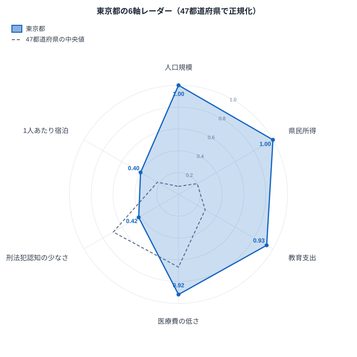
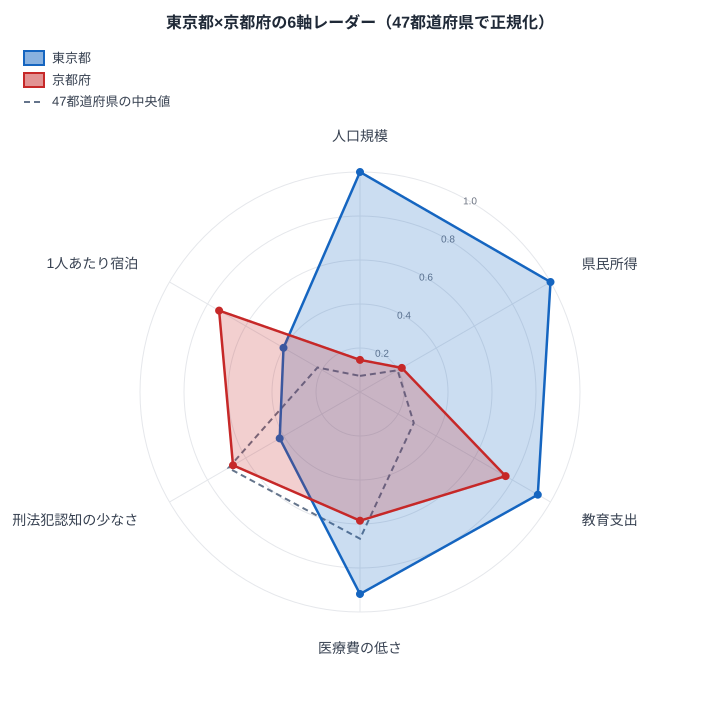

棒グラフは「1 指標を 47 県で比べる」のが得意でした（Part 3）。[ヒートマップ](https://stats47.jp/blog/cc-estat-04-aging-heatmap)は「2 軸 × 時間」を 1 枚に圧縮するのが得意でした（Part 4）。コロプレスは「空間分布」を、[散布図](https://stats47.jp/blog/cc-estat-06-income-scatter)は「2 変数の関係」を得意としていました（Part 5・6）。

ではこんな問いに、どのチャートで答えるべきでしょう。

> **「東京都って結局どんな県なの？ ほかの県と比べて、どの軸が張り出してどの軸がへこむ？」**

棒グラフを 6 枚並べるのは情報の物量で殴る感じで、読み手はすぐ疲れます。テーブルは数字が並ぶだけで「形」が見えません。ここで効くのが **レーダーチャート** です。1 つの県の特性を 1 枚の多角形で表現し、形の歪み方で「県のキャラクター」を伝えられます。

ただしレーダーには重い宿題があります。**軸ごとに単位が違う指標を、同じスケールに揃える「正規化」** です。人口（人）、所得（千円）、教育支出（円）、医療費（千円）、刑法犯の認知件数（件/人口千人）、宿泊者数（人泊）と、単位も桁数もバラバラです。これを 0〜1 にスケールしないと、多角形は「ほぼ 1 軸だけ突き出した針」になります。

本記事では、Claude Code に **6 指標 × 47 都道府県のデータを並列取得 → min-max 正規化 → D3 でレーダー描画** までを依頼します。Part 9 のゴールは、東京都と京都府を 1 枚のレーダーで重ね描きして「東京と京都はこんなに形が違う」と言える状態です。所要時間は 90 分で、コードは Claude Code が書きます。数値はすべて e-Stat の実データ（2026 年 10 月に取得）です。

## 使う指標と「県の多角的プロフィール」設計

レーダーチャートで一番悩むのが軸の選定です。軸が多すぎる（10 以上）と見づらく、少なすぎる（3 軸以下）と三角形ばかりで個性が出ません。経験則として **5〜8 軸が読みやすい範囲** です。

今回は「県の暮らしと経済」を多角的に捉える 6 軸で設計します。どれも e-Stat の「社会・人口統計体系」の都道府県データから取れる指標です。

- **人口規模**（総人口・2024 年・人）— 外側＝人口が多い。良し悪しの向きはない規模の軸です
- **県民所得**（1 人当たり県民所得・県民経済計算 2015 年基準・2021 年度・千円）— 外側＝所得が高い
- **教育支出**（全国家計構造調査・二人以上の世帯・2024 年 10〜11 月の月平均・円）— 外側＝家計が教育に回している額が多い
- **医療費の低さ**（1 人当たりの国民医療費・2022 年度・千円）— **反転して、外側＝1 人あたりの医療費が低い**
- **刑法犯認知の少なさ**（刑法犯認知件数・人口千人当たり・2023 年度・件）— **反転して、外側＝警察が認知した刑法犯が少ない**。届出などを端緒に警察が認知した事件の数で、認知されなかった事件は含まないため、「治安そのもの」ではなく「認知件数の少なさ」として置きます
- **1 人あたり宿泊**（延べ宿泊者数〔2024 年度〕÷ 総人口〔2024 年〕・人泊/人）— 外側＝住民 1 人あたりの宿泊客が多い

> [!NOTE]
> 延べ宿泊者数は、社会・人口統計体系に収められた従業者数 10 人以上の宿泊施設の値で、観光庁が公表する値より小さくなります。分子は年度、分母の人口は年の値なので、1 人あたり宿泊は 12 か月分の近似です。軸ごとに最新年が違い、2021〜2024 年（年度）の値が混ざる点にも注意してください。人口は宿泊者数と同じ 2024 年にそろえるため、2025 年の国勢調査ではなく 2024 年の人口推計を使います。

ここに **重要なポイント** が 3 つあります。

第一に、**外側の意味を軸ごとに決めて揃える** ことです。レーダーは「外側に張り出すほど大きい・強い」と直感的に読まれるチャートなので、刑法犯の認知件数をそのまま載せると、認知件数の多い県ほど外に張り出して見えます。正規化のときに **1 から引いて反転** させ、「認知の少なさ」の軸にします。医療費は高齢化が進むほど増える指標で、低いほど良いとは言い切れません。そこで本記事では「1 人あたりの医療費の低さ」と軸の意味を明示したうえで反転します。教育支出も、多いほど良いという意味ではなく「家計が教育に回している額」の軸として読みます。

第二に、**桁数のレンジを揃える** ことです。人口（千万の桁）と認知件数（1 桁の件数）を生値のまま重ねたら、人口軸だけが満点に張り付いて他の軸が潰れます。これを解決するのが min-max 正規化です。具体的には次の式です。

```text
x_normalized = (x - x_min) / (x_max - x_min)
```

47 都道府県の中での最小値を 0、最大値を 1 にする線形変換です。Claude Code に頼むときも「**全 47 県の中での min-max 正規化で 0〜1 にスケール、医療費と認知件数は 1 から引いて反転**」と一文書けば、ロジックを書いてくれます。

第三に、**人口に比例して大きくなる指標は、人口あたりに直す** ことです。延べ宿泊者数を実数のまま使うと、人口の多い東京都が最大になり、京都府は 0.30 にとどまります。人口 1 人あたりに直すと最大は沖縄県になり、京都府は 0.74 まで上がります。実数のままでは「大きい県が全部の軸で勝つ」形になり、県の性格が見えません。



青い多角形が東京都、破線が 47 都道府県の中央値です。レーダーの読み方のコツは、**中心からの距離ではなく、破線より外か内か** を見ることです。東京都は 6 軸のうち 5 軸で破線の外側にあり、内側にへこむのは刑法犯認知の少なさの 1 軸だけです。1 人あたり宿泊は 0.40 と中心寄りに見えますが、破線（中央値）はさらに内側にあるので、東京都はこの軸でも多い側の県です。逆に医療費の低さの 0.92 は外周に近く見えても、中央値自体が 0.67 と高い軸なので、差は見た目ほど大きくありません。

<source-link href="/ranking/total-population">人口ランキングをもっと見る</source-link>

## Step 1: 6 つの統計表 ID を取得 → Claude Code に並列リクエスト

まず 6 指標分の e-Stat 統計表 ID と分類コードを集めます。連載 Part 2 で作った `/search-estat` スキルを使うと、Claude Code に対話的に頼めます。

```bash
claude
```

```
あなた: e-Stat の社会・人口統計体系（都道府県データ）で、次の 6 指標の
       statsDataId と cdCat01 を一覧で出して。
       1. 総人口
       2. 1人当たり県民所得
       3. 教育支出（全国家計構造調査・二人以上の世帯）
       4. 1人当たりの国民医療費
       5. 刑法犯認知件数（人口千人当たり）
       6. 延べ宿泊者数

Claude: /search-estat スキルで照会します...

       | # | 指標 | statsDataId | cdCat01 | 使う年 |
       |---|---|---|---|---|
       | 1 | 総人口 | 0000010101 | A1101 | 2024 |
       | 2 | 1人当たり県民所得 | 0000010203 | #C01321 | 2021 |
       | 3 | 教育支出（二人以上の世帯） | 0000010112 | L720108 | 2024 |
       | 4 | 1人当たりの国民医療費 | 0000010209 | #I15106 | 2022 |
       | 5 | 刑法犯認知件数（人口千人当たり） | 0000010211 | #K06101 | 2023 |
       | 6 | 延べ宿泊者数 | 0000010107 | G7101 | 2024 |
```

社会・人口統計体系の統計表は、1 つの表に何百もの指標が入っています。statsDataId だけでは指標が決まらないので、**cdCat01 で指標を 1 つに絞る** のがこのデータベースの使い方です。`#` で始まるコードは「社会生活統計指標」（人口あたりなどに換算済みの値）、`#` の無いコードは「基礎データ」（実数）の表に対応します。

ID が揃ったら、6 リクエストを並列で投げます。Part 1 でも触れたとおり、e-Stat は短時間に大量のリクエストを送ると 503 が返ることがあります（公式の上限は公表されていません）。`p-limit` で同時並列を 5 本に抑えておくと安全です。描画で使う `d3` と `jsdom` もここでまとめて入れておきます。

```bash
npm install p-limit d3 jsdom
```

Claude Code に書かせるスクリプトはこんな雰囲気です。

```javascript
// fetch-six-indicators.mjs
import pLimit from "p-limit";
import fs from "node:fs/promises";

const APP_ID = process.env.ESTAT_APP_ID;
const TARGETS = [
  { key: "population", id: "0000010101", cat: "A1101", year: "2024" },
  { key: "income", id: "0000010203", cat: "#C01321", year: "2021" },
  { key: "education", id: "0000010112", cat: "L720108", year: "2024" },
  { key: "medical", id: "0000010209", cat: "#I15106", year: "2022" },
  { key: "crime", id: "0000010211", cat: "#K06101", year: "2023" },
  { key: "guests", id: "0000010107", cat: "G7101", year: "2024" },
];

const limit = pLimit(5);

async function fetchOne({ key, id, cat, year }) {
  const url = new URL(
    "https://api.e-stat.go.jp/rest/3.0/app/json/getStatsData"
  );
  url.searchParams.set("appId", APP_ID);
  url.searchParams.set("statsDataId", id);
  url.searchParams.set("cdCat01", cat);
  url.searchParams.set("limit", "5000");

  const res = await fetch(url).then((r) => r.json());
  const values = res.GET_STATS_DATA.STATISTICAL_DATA.DATA_INF.VALUE;
  const arr = Array.isArray(values) ? values : [values];

  // 47 都道府県 × 指定年だけに絞る（全国 00000 の行は除く）
  const filtered = arr.filter(
    (v) =>
      /^\d{2}000$/.test(v["@area"]) &&
      v["@area"] !== "00000" &&
      v["@time"].startsWith(year)
  );

  return [
    key,
    Object.fromEntries(
      filtered
        .map((v) => [v["@area"], Number(v["$"])])
        .filter(([, n]) => Number.isFinite(n))
    ),
  ];
}

const results = await Promise.all(
  TARGETS.map((t) => limit(() => fetchOne(t)))
);
const merged = Object.fromEntries(results);

// 宿泊者数は人口に比例するので、人口 1 人あたりに直してから使う
merged.tourism = Object.fromEntries(
  Object.entries(merged.guests).map(([area, v]) => [
    area,
    v / merged.population[area],
  ])
);
delete merged.guests;

await fs.writeFile("six-indicators-raw.json", JSON.stringify(merged, null, 2));
console.log("✓ wrote six-indicators-raw.json");
```

全国の行を除く条件を忘れると、全国の値が 47 都道府県と一緒に正規化され、どの県も 0 付近に潰れます。都道府県コードの正規表現 `^\d{2}000$` は全国の `00000` にも当てはまるので、明示的に外します。

実行すると、東京都と京都府の部分はこんな JSON になります。スクリプトは丸めずに書き出しますが、ここでは読みやすさのため観光を小数第 3 位で丸めて載せています。

```json
{
  "population": { "13000": 14178000, "26000": 2520000 },
  "income": { "13000": 5761, "26000": 3026 },
  "education": { "13000": 19468, "26000": 16429 },
  "medical": { "13000": 344, "26000": 393 },
  "crime": { "13000": 6.33, "26000": 4.69 },
  "tourism": { "13000": 6.463, "26000": 11.326 }
}
```

> **Tips**: Claude Code に「6 つの JSON を 1 ファイルに merge して、トップレベル key は指標名にして」と頼めば、上の構造を組み立ててくれます。生 JSON のネストが深い API ほど、Claude Code に整形を任せる効果が大きいです。

ここまでで「**指標 × 都道府県 → 生値**」の dict が手元に揃いました。次が本記事の本丸、正規化です。

## Step 2: 全県のデータで min-max 正規化（0-1 にスケール）

正規化の式は冒頭で書いた通りシンプルです。**ただし「全 47 県の min/max」を使う** ことが重要です。1 県だけのデータで正規化してしまうと、その県のなかでの最小最大に張り付いてしまい、全国比較になりません。

Claude Code に頼むときのプロンプトはこうです。

```
あなた: six-indicators-raw.json を読み込んで、各指標について
       全 47 都道府県の min-max 正規化を実行して。
       ただし以下 2 指標は 1 から引いて反転して:
         - medical (1人当たりの国民医療費 → 医療費の低さ)
         - crime (刑法犯認知件数 → 認知の少なさ)
       出力は six-indicators-normalized.json に書き出して、
       各県 6 指標の 0〜1 値が並んだ構造にして。
```

返ってくるスクリプトはおおむねこんな感じになります。

```javascript
// normalize.mjs
import fs from "node:fs/promises";

const raw = JSON.parse(await fs.readFile("six-indicators-raw.json", "utf8"));

const INVERT = new Set(["medical", "crime"]); // 外側の意味を揃えるため反転

const normalized = {};

for (const [indicator, values] of Object.entries(raw)) {
  const nums = Object.values(values);
  const min = Math.min(...nums);
  const max = Math.max(...nums);
  const range = max - min || 1; // ゼロ割防止

  for (const [area, v] of Object.entries(values)) {
    let n = (v - min) / range; // 0..1
    if (INVERT.has(indicator)) n = 1 - n; // 反転
    if (!normalized[area]) normalized[area] = {};
    normalized[area][indicator] = Number(n.toFixed(3));
  }
}

await fs.writeFile(
  "six-indicators-normalized.json",
  JSON.stringify(normalized, null, 2)
);
console.log("✓ wrote six-indicators-normalized.json");
```

出来上がる JSON から東京と京都を抜粋すると、こうなります。

```json
{
  "13000": {
    "population": 1,
    "income": 1,
    "education": 0.933,
    "medical": 0.918,
    "crime": 0.422,
    "tourism": 0.402
  },
  "26000": {
    "population": 0.146,
    "income": 0.219,
    "education": 0.764,
    "medical": 0.585,
    "crime": 0.667,
    "tourism": 0.74
  }
}
```

正規化値だけでは、外側か内側かの基準がありません。そこで各軸の 47 都道府県の中央値も一緒に並べます。中央値は正規化値を 47 都道府県で並べたときの 24 番目です。軸ごとに東京都・京都府・中央値を並べると、次のように読めます。

- **人口規模** — 東京 1.00 / 京都 0.15 / 中央値 0.07。生値の中央値は 153.2 万人です
- **県民所得** — 東京 1.00 / 京都 0.22 / 中央値 0.20。全国の最小は沖縄県の 2,258 千円、最大は東京都の 5,761 千円です
- **教育支出** — 東京 0.93 / 京都 0.76 / 中央値 0.28。二人以上の世帯の 10〜11 月の月平均で、東京都は 19,468 円、京都府は 16,429 円です
- **医療費の低さ（反転後）** — 東京 0.92 / 京都 0.59 / 中央値 0.67。東京都は 1 人あたり 344 千円で、外側から数えて 7 番目です
- **刑法犯認知の少なさ（反転後）** — 東京 0.42 / 京都 0.67 / 中央値 0.69。東京都は人口千人あたり 6.33 件で、外側から数えて 41 番目です
- **1 人あたり宿泊** — 東京 0.40 / 京都 0.74 / 中央値 0.22。京都府は住民 1 人あたり 11.3 人泊で 2 番目に外側、東京都は 6.5 人泊で 7 番目です

あわせて見る: [1 人当たり県民所得ランキング](/ranking/per-capita-prefectural-income-h27) / [教育支出ランキング](/ranking/household-survey-education-expenditure) / [1 人当たりの国民医療費ランキング](/ranking/national-medical-expense-per-person) / [刑法犯認知件数ランキング](/ranking/penal-code-offenses-recognized-per-1000)

ここで、min-max 正規化の弱点も見えます。**外れ値の都道府県が 1 つあると、残りが端に潰れます**。人口の軸がまさにそうで、東京都が 1.00 になる一方、中央値は 0.07 しかなく、京都府を含む 37 府県が 0.2 未満に集まります。東京都の延べ宿泊者数は実数では 47 都道府県で最も多いのに、1 人あたり宿泊では 7 番目になります。どの値で割るか、どの範囲で正規化するかで、多角形の形は大きく変わります。

## Step 3: D3 でレーダーチャート（polygon + axes + grid）

D3 でレーダーを描くコアは **極座標変換** です。各軸を中心から等角度で放射状に配置し、その軸上の正規化値を半径として点を打ち、点同士を polygon で結びます。書き下すと 90 行ほどで収まります。

```javascript
// radar.mjs (D3 v7 想定)
import * as d3 from "d3";
import { JSDOM } from "jsdom";
import fs from "node:fs/promises";

const data = JSON.parse(
  await fs.readFile("six-indicators-normalized.json", "utf8")
);
const AXES = [
  { key: "population", label: "人口規模" },
  { key: "income", label: "県民所得" },
  { key: "education", label: "教育支出" },
  { key: "medical", label: "医療費の低さ" },
  { key: "crime", label: "刑法犯認知の少なさ" },
  { key: "tourism", label: "1人あたり宿泊" },
];

const W = 600;
const H = 600;
const R = 220; // 半径
const CX = W / 2;
const CY = H / 2;
const N = AXES.length;

const dom = new JSDOM("<!DOCTYPE html><body></body>");
const body = d3.select(dom.window.document.body);
const svg = body
  .append("svg")
  .attr("xmlns", "http://www.w3.org/2000/svg")
  .attr("width", W)
  .attr("height", H);

// グリッド円（0.2, 0.4, 0.6, 0.8, 1.0）
for (const level of [0.2, 0.4, 0.6, 0.8, 1.0]) {
  svg
    .append("circle")
    .attr("cx", CX)
    .attr("cy", CY)
    .attr("r", R * level)
    .attr("fill", "none")
    .attr("stroke", "#e5e7eb");
}

// 軸線とラベル
AXES.forEach((axis, i) => {
  const angle = (Math.PI * 2 * i) / N - Math.PI / 2;
  const x = CX + Math.cos(angle) * R;
  const y = CY + Math.sin(angle) * R;
  svg
    .append("line")
    .attr("x1", CX)
    .attr("y1", CY)
    .attr("x2", x)
    .attr("y2", y)
    .attr("stroke", "#9ca3af");
  svg
    .append("text")
    .attr("x", CX + Math.cos(angle) * (R + 24))
    .attr("y", CY + Math.sin(angle) * (R + 24))
    .attr("text-anchor", "middle")
    .attr("dominant-baseline", "middle")
    .attr("font-size", 13)
    .text(axis.label);
});

// polygon（東京: 13000）
function drawPoly(areaCode, color, alpha) {
  const values = data[areaCode];
  const points = AXES.map((axis, i) => {
    const angle = (Math.PI * 2 * i) / N - Math.PI / 2;
    const r = R * (values[axis.key] ?? 0);
    return `${CX + Math.cos(angle) * r},${CY + Math.sin(angle) * r}`;
  }).join(" ");
  svg
    .append("polygon")
    .attr("points", points)
    .attr("fill", color)
    .attr("fill-opacity", alpha)
    .attr("stroke", color)
    .attr("stroke-width", 2);
}

drawPoly("13000", "#2563eb", 0.35); // 東京 blue

await fs.writeFile("radar-tokyo.svg", body.html());
console.log("✓ wrote radar-tokyo.svg");
```

実行すると `radar-tokyo.svg` がカレントに生まれます。ブラウザで開けば 6 軸レーダーが描画されているはずです。

```bash
node radar.mjs
open radar-tokyo.svg
```

本記事の図のように中央値の破線を重ねたいときは、47 都道府県の正規化値から軸ごとの中央値を計算し、`stroke-dasharray` を付けた塗りなしの polygon として先に描きます。Claude Code には「各軸の 47 都道府県の中央値を計算して、破線の polygon で重ねて」と頼めば足ります。

## Step 4: 2 県比較（東京 vs 京都など、polygon overlay）

レーダーは 1 県だけだと「絶対値感」が伝わりにくいので、**2 県を重ねる** と一気に物語が立ち上がります。コードは `drawPoly` を 2 回呼び、書き出し先のファイル名を変えるだけです。

```javascript
drawPoly("13000", "#2563eb", 0.30); // 東京 青
drawPoly("26000", "#dc2626", 0.30); // 京都 赤

// レジェンド
svg
  .append("rect")
  .attr("x", 20)
  .attr("y", 20)
  .attr("width", 14)
  .attr("height", 14)
  .attr("fill", "#2563eb");
svg
  .append("text")
  .attr("x", 40)
  .attr("y", 32)
  .attr("font-size", 13)
  .text("東京都");

svg
  .append("rect")
  .attr("x", 20)
  .attr("y", 42)
  .attr("width", 14)
  .attr("height", 14)
  .attr("fill", "#dc2626");
svg
  .append("text")
  .attr("x", 40)
  .attr("y", 54)
  .attr("font-size", 13)
  .text("京都府");

await fs.writeFile("radar-tokyo-kyoto.svg", body.html());
```

これで 1 枚の SVG に東京と京都の多角形がオーバーレイされます。重なる部分は色が混ざって紫っぽくなり、ずれている部分は青と赤が独立して見えます。2 つの形の違いを、数字の表を読み比べるより速く掴めるのが overlay の強みです。



2 つの多角形は張り出す向きが違います。青（東京都）は人口規模と県民所得の側へ大きく張り出し、赤（京都府）が青より外に出るのは 1 人あたり宿泊と刑法犯認知の少なさの 2 軸だけです。教育支出は 2 色とも破線の外側で、両府県とも家計が教育に回す額が多い側にあります。

注意したいのは、赤が青より外にある軸が、そのまま「京都府が強い軸」とは限らないことです。刑法犯認知の少なさは京都府が東京都より外側ですが、破線（中央値）とほぼ重なっていて、47 都道府県の中では真ん中あたりです。医療費の低さは京都府が破線のわずかに内側にあります。2 府県だけを見比べると差が強調されて見えるので、中央値の破線を重ねて「全国の中での位置」を確かめるのが大切です。

京都府の張り出しは住民 1 人あたりの話です。延べ宿泊者数の実数では東京都が京都府の 3.2 倍ですが、人口は 5.6 倍なので、1 人あたりでは東京都 6.5 人泊、京都府 11.3 人泊と逆転します。下のリンク先は実数のランキングなので、順位の並びが本文の軸とは違って見えます。

<source-link href="/ranking/total-overnight-guests">延べ宿泊者数ランキングをもっと見る</source-link>

> **Tips**: 比較する 2 県は「規模が違う組」（東京 vs 鳥取）より「**性格が違う組**」（東京 vs 京都、大阪 vs 沖縄）の方が話が広がります。規模違いだけだと「大きい方が全部勝ち」の自明な形になりがちです。

4 県以上を重ねると線が混雑して読めなくなります。**重ねるのは 3 県まで** を目安にしてください。

## Step 5: 軸ラベルと数値ツールチップ

正規化値（0〜1）だけだと「で、東京の所得って結局いくらなの？」が分かりません。レーダーは「形」で性格を伝える図なので、絶対値の答え合わせは別の手段で用意します。読み手のために **生値も併記** する方法は 3 つあります。

### 方法 A: 軸ラベルに全国の範囲を併記

```text
県民所得
(2,258〜5,761千円)
```

軸ラベルの 2 行目に「全国の min〜max」を入れる方法です。シンプルで実装も楽ですが、ラベルが長くなるので 6 軸が限界です。

### 方法 B: 頂点に数値ラベル

各 polygon の頂点（県のスコアが乗る位置）に小さく値を置きます。本記事の東京都単独の図がこの方法です。1 県だけなら読めますが、2 県以上 overlay すると数字が被るのでおすすめしません。

### 方法 C: ホバー時ツールチップ（Web 描画時のみ）

ブラウザで描く場合は SVG の各軸末端に透明な `rect` を重ね、`mouseenter` で生値を出すのが王道です。Claude Code に頼むコードはこんな構成になります。

```javascript
// ブラウザ用 (D3 ライブ描画)
axis.append("rect")
  .attr("x", x - 30).attr("y", y - 12)
  .attr("width", 60).attr("height", 24)
  .attr("fill", "transparent")
  .on("mouseenter", (e) => showTooltip(e, axis, rawValue, normValue))
  .on("mouseleave", hideTooltip);
```

使い分けは、表示する場所で決めると迷いません。

- **Web ページ埋め込み** → 方法 C（ホバー）。インタラクションが効きます
- **ブログ記事の静止画** → 方法 A か B。ホバーできないので図の中に数字を書きます
- **印刷 PDF** → 方法 A ＋ 末尾に補足の数値リスト。紙では併記で補完します

## つまずきポイント（指標の向き、外れ値正規化、軸数の限界）

### 1. 外側の意味を揃えないと読めない

レーダーは「外側 = 大きい・強い」と直感で読まれます。**刑法犯認知件数を反転しないまま載せる** と、認知件数の多い県ほど外側に張り出して見えます。

具体策は normalize 時に `INVERT` セットを使う、もしくは取得段階で `(- 生値)` の符号反転で扱うかの 2 通りです。Claude Code に頼むときに **「各軸で外側が何を意味するか」までを必ず伝える** ことが大切です。「数値を 0〜1 に正規化して」だけだと、Claude Code は向きを解釈しません。医療費のように向きを一意に決めにくい指標は、軸の名前（「医療費の低さ」）で意味を明示してから反転します。

### 2. 外れ値で全体が潰れる問題

Step 2 で見たとおり、人口の軸では東京都 1 つが 1.00 を取り、37 府県が 0.2 未満に集まりました。分布が偏る軸の対策は 3 つあります。

- **percentile 正規化** — 5%〜95% パーセンタイルを 0〜1 にします。両端の極端な値に引っ張られにくくなります
- **log 変換** — log(x) してから min-max にします。人口や宿泊者数のように桁の差が大きい指標向きです
- **順位正規化** — 47 県の順位を 0〜1 にスケールします。値の分布が偏っているときに使います

Claude Code への頼み方の例です。

```
あなた: population (総人口) は東京都が外れ値で他県が潰れるので、
       log10 してから min-max 正規化に変更して。
       他の指標は通常 min-max のまま。
```

### 3. 軸数は「5〜8」

3 軸ではただの三角形でキャラクターが出ません。10 軸を超えると軸ラベルが詰まって読めません。**5〜8 軸が経験則上の読みやすい範囲** で、本記事の 6 軸は読みやすさ重視で設計しています。

もし「もっと多軸で見たい」場合は **2 枚に分割** するのが王道です。経済系 6 軸と暮らし系 6 軸を別レーダーで隣に並べるなど、1 枚に詰め込むより読み手に優しくなります。

### 4. 軸の順番で印象が変わる

レーダーは **隣り合う 2 軸の間の面積** が強調されます。たとえば「教育支出」と「1 人あたり宿泊」を隣同士に置くと、両方高い県はその 2 軸の間の領域が大きく膨らみ、強調されて見えます。

意味的に関連の薄い 2 軸を隣に置くと、形の意味が読み取りにくくなります。本記事では「規模系（人口・所得）→ 暮らし系（教育・医療）→ 認知件数・宿泊」の流れで並べていて、これは意図した設計です。

### 5. 軸ごとの「重み」を勝手に揃えない

レーダーは見た目上 6 軸が等価値に見えますが、本来は **どの軸がより重要か** は読者の関心次第です。記事や用途によって「刑法犯認知の少なさだけ重み 2 倍」のような重み付けが必要なときは、レーダーをやめて重み付き総合スコア（棒グラフ）に切り替えた方が誠実です。

レーダーは「軸間に優劣をつけない」という前提が崩れたら使うべきではない、ということだけ覚えておけば十分です。

## 次回予告（Part 10: ボックスプロット）

Part 9 では「**1 県の多面性を 1 枚にまとめる**」レーダーを扱いました。Part 10 では視点を裏返して、「**1 指標の分布を 47 県でまとめて見る**」ボックスプロットに進みます。

ボックスプロットは中央値・四分位範囲・外れ値を 1 つの図に詰め込めるチャートで、**「全国平均だけ見て満足していませんか？」** という問いに刺さります。今回の教育支出でも、二人以上の世帯の 10〜11 月の月平均は、秋田県の 2,681 円から神奈川県の 20,666 円まで開いていました。平均の 1 つの数だけでは、この広がりも偏りも見えません。

Part 10 では、賃金構造基本統計調査から業種別の所定内給与額を取り、都道府県の格差をボックスプロットにします。外れ値の県をハイライトする処理も Claude Code に書かせます。連載の最初から追う場合は、[Part 1: 環境構築と API キーの取得](https://stats47.jp/blog/cc-estat-01-setup)から始めてください。他の指標を探したいときは[ICT・データ活用カテゴリ](https://stats47.jp/category/ict)の一覧も参考にしてください。
