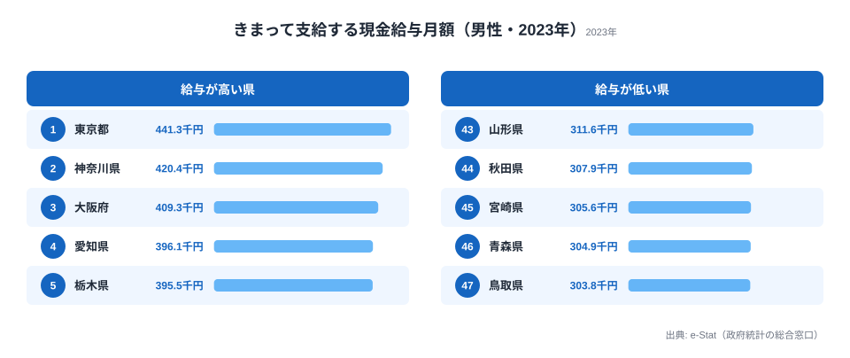

棒グラフで「1 位の東京がぶっちぎり、最下位の沖縄」と並べるのは確かにわかりやすいです。でも、**47 都道府県の分布全体がどう散らばっているか** を一発で見せたいときは、ボックスプロット（箱ひげ図）の方が圧倒的に強いのです。中央値・四分位数・外れ値が同時に視覚化できるので、「東京は外れ値、それ以外は意外と団子」という構造が一目で出ます。

連載 Part 10 の今回は、**業種別の所定内給与額**（賃金構造基本統計調査）を題材に、Claude Code で四分位数の計算 → 外れ値判定 → D3 ボックスプロット描画までを一気通貫でやります。「箱ひげって計算が面倒で書いたことない」というエンジニアこそ、Claude Code に投げると 10 分で終わるのを体感してほしい回です。

連載全体の流れは [Part 1](/blog/cc-estat-01-setup) の冒頭にまとまっています。Part 10 は **「分布を見る」セクション** の本命チャートです。Part 6 で散布図、Part 9 でレーダーチャートを扱いましたが、今回は「複数カテゴリ × 47 県の分布」を 1 枚に圧縮するのが目的になります。


## なぜ業種別の賃金格差は面白いのか

賃金の議論をすると、たいてい「東京 vs 地方」の構図に収束します。それは間違いではないのですが、**業種ごとに格差の構造が全然違う** ことは意外と知られていません。たとえば次のような違いがあります。

- **金融・保険業**: 東京が異常値レベルで突出し、Q3 と max の差が大きくなります
- **宿泊業・飲食サービス業**: 全国どこでも低く、47 県の箱がぺちゃんこになります
- **製造業**: 中央値は中くらいですが、IQR（箱の高さ）が大きく、県によってバラツキます
- **医療・福祉**: 中央値が高めで外れ値が少なく、ほぼフラットになります

これを 47 県の棒グラフ × 業種数だけ並べると、何枚あっても足りません。ボックスプロットなら **1 枚で 10 業種 × 47 県 = 470 データポイントの分布構造** が見えます。これがボックスプロットを選ぶ理由です。

そして可視化の主役は、実は **外れ値** です。東京や大阪が他県と桁違いに離れている業種では、外れ値の点だけが箱の外にぴょこんと飛び出します。そこにラベルを付けてあげると、「あ、この業種は首都圏一極集中なんだ」が直感でわかるようになります。これが今回の最大のテーマです。

まずは「分布を見る」感覚をつかむために、実際の賃金データを 1 枚見ておきましょう。下図は厚生労働省「賃金構造基本統計調査」の **きまって支給する現金給与月額（男性・2023年）** を都道府県別に並べたものです。ボックスプロット化する前の生データですが、これだけでも 1 位 東京都 441.3 千円・最下位 鳥取県 303.8 千円と、上下で 1.5 倍の開きがあることが読み取れます。



東京・神奈川・大阪という首都圏と関西の中核がそのまま上位に並び、下位は鳥取・青森など人口の少ない県が占めます。賃金の分布は「県の人口・産業集積」と強く結びついていて、業種別に分けて見ると、この偏りの度合いが業種ごとに大きく変わってきます。

<source-link href="/ranking/regular-cash-salary-male">きまって支給する現金給与月額（男性）の都道府県ランキングをもっと見る</source-link>


## 使うデータ: 賃金構造基本統計調査

厚生労働省が毎年 6 月時点で実施する **賃金構造基本統計調査**（通称「賃金センサス」）が今回のデータソースです。e-Stat 上の statsDataId は `0003445758`（実在）で、一般労働者の都道府県・産業中分類別の所定内給与額が取得できます。調査の主な仕様は次のとおりです。

- **統計名**: 賃金構造基本統計調査（統計表 ID `0003445758`）
- **集計単位**: 都道府県 × 産業中分類 × 性別 × 企業規模
- **主な指標**: 所定内給与額（千円）、年間賞与その他特別給与額、平均年齢、勤続年数
- **更新頻度**: 年 1 回（毎年 3 月公表）
- **注意**: 産業分類は日本標準産業分類に準拠し、年度によって中分類のコードが変わることがあります

「所定内給与額」は残業代を含まない月額の基本給ベースです。賞与・残業を入れた年収換算をしたいときは、別カラムの「年間賞与」と組み合わせる必要があります。Part 10 では話を簡単にするため、所定内給与額 1 本で議論します。

データの粒度は「**都道府県 × 産業中分類**」です。中分類はざっくり 20 業種くらいに分かれていて、たとえば「建設業」「製造業」「情報通信業」「金融業，保険業」「医療，福祉」「宿泊業，飲食サービス業」などがあります。今回は読み手の馴染みやすさ優先で **10 業種に絞って** 可視化します。

> [!NOTE]
> 賃金構造基本統計調査の「所定内給与額」は、6 月分として支給された月額のうち残業手当などを除いた額です。**ボーナスや残業代は含まれない**ため、年収ベースの感覚（金融業の年収 1,000 万円など）とはズレます。月額の基本給だけを横並びで比べている、という前提を忘れないでください。


## Step 1: Claude Code に「業種別賃金を全県取って」と頼む

スキル化済みの `/fetch-estat-data` を使う前提で進めます（連載 [Part 2](/blog/cc-estat-02-search-skill) でスキル化の手順を解説済み）。Claude Code への依頼は次のようになります。

```
/fetch-estat-data
statsDataId: 0003445758
切り口: 都道府県 × 産業中分類
対象: 一般労働者 / 男女計 / 企業規模計
指標: 所定内給与額（千円）
年度: 最新年
出力: data/wage-by-industry.json
```

Claude Code は内部でこういう動きをします。

1. `getMetaInfo` で `0003445758` のメタ情報を取得し、`cat01`（労働者区分）/ `cat02`（性別）/ `cat03`（企業規模）/ `cat04`（産業分類）/ `cat05`（指標）のコードを確認
2. 一般労働者・男女計・企業規模計・所定内給与額に対応するコードを抽出
3. `getStatsData` を `cdCat0X` 指定で叩く（年度は最新を `cdTime` から推定）
4. 47 都道府県 × 全業種のレスポンスを JSON に整形して保存

返ってくる JSON はこんな形になります（抜粋）。

```json
{
  "year": "2024",
  "indicator": "所定内給与額（千円）",
  "items": [
    {
      "areaCode": "13000",
      "areaName": "東京都",
      "industryCode": "J",
      "industryName": "金融業，保険業",
      "value": 521.4
    },
    {
      "areaCode": "13000",
      "areaName": "東京都",
      "industryCode": "G",
      "industryName": "情報通信業",
      "value": 478.2
    },
    {
      "areaCode": "47000",
      "areaName": "沖縄県",
      "industryCode": "M",
      "industryName": "宿泊業，飲食サービス業",
      "value": 198.7
    }
  ]
}
```

`value` の単位は **千円**（月額）です。後段の計算では基本このまま使い、画面表示時だけ「万円」変換しても良いでしょう。

### つまずきポイント 1: 業種コードの統一

e-Stat の業種コードは年度によって細分化されたり、統合されたりします。たとえば「情報通信業」が「J」だったり「39」だったりします。**コードではなく業種名でマージする** のが最も事故が少ないやり方です。Claude Code には次のように頼みます。

```
取得した JSON で、業種名を以下の 10 業種に正規化して。それ以外は除外して。
- 建設業
- 製造業
- 情報通信業
- 運輸業，郵便業
- 卸売業，小売業
- 金融業，保険業
- 不動産業，物品賃貸業
- 学術研究，専門・技術サービス業
- 宿泊業，飲食サービス業
- 医療，福祉
業種名の表記ゆれ（「金融業, 保険業」「金融・保険業」など）は吸収して。
```

Claude が `industryName` の正規化マップを書いてくれます。


## Step 2: 業種ごとに四分位数（Q1, median, Q3）と IQR を計算

ここがボックスプロットの計算コアです。**業種 × 47 県の値配列** から、業種ごとに次の統計量を算出します。

- **min**: 47 県の最小値（外れ値除外後）
- **Q1**: 第 1 四分位数（下から 25%）
- **median**: 第 2 四分位数（中央値）
- **Q3**: 第 3 四分位数（下から 75%）
- **max**: 47 県の最大値（外れ値除外後）
- **IQR**: Q3 − Q1（箱の高さ）
- **outliers**: Q1 − 1.5 × IQR より下、または Q3 + 1.5 × IQR より上の値

外れ値判定は **Tukey の方法**（1.5 × IQR ルール）が標準です。これも Claude Code に頼むだけで OK です。

Claude Code への依頼は次のとおりです。

```
data/wage-by-industry.json を読み込んで、業種ごとに以下を計算する Node.js
スクリプトを書いて。

- 47 県の所定内給与額配列をソート
- Q1, median, Q3 を線形補間で算出
- IQR = Q3 - Q1
- 下側ヒゲ: max(min, Q1 - 1.5 * IQR)
- 上側ヒゲ: min(max, Q3 + 1.5 * IQR)
- 外れ値: ヒゲの外側にある値 + 県名

出力: data/wage-box-stats.json （業種ごとの統計量配列）
業種の並び順は median 昇順。
```

Claude が書いたコードはだいたいこうなります（一部抜粋・整形）。

```javascript
// scripts/calc-box-stats.mjs
import fs from "node:fs";

const SOURCE = "data/wage-by-industry.json";
const OUTPUT = "data/wage-box-stats.json";

/** 線形補間版の四分位数計算（D3.quantile と同等） */
function quantile(sorted, p) {
  if (sorted.length === 0) return null;
  const i = (sorted.length - 1) * p;
  const lo = Math.floor(i);
  const hi = Math.ceil(i);
  if (lo === hi) return sorted[lo];
  return sorted[lo] + (sorted[hi] - sorted[lo]) * (i - lo);
}

function calcBoxStats(rows) {
  const sortedValues = rows.map((r) => r.value).sort((a, b) => a - b);
  const q1 = quantile(sortedValues, 0.25);
  const median = quantile(sortedValues, 0.5);
  const q3 = quantile(sortedValues, 0.75);
  const iqr = q3 - q1;
  const lowerFence = q1 - 1.5 * iqr;
  const upperFence = q3 + 1.5 * iqr;

  const outliers = rows
    .filter((r) => r.value < lowerFence || r.value > upperFence)
    .map((r) => ({ areaName: r.areaName, value: r.value }));

  const insideValues = sortedValues.filter(
    (v) => v >= lowerFence && v <= upperFence
  );

  return {
    min: insideValues[0],
    q1,
    median,
    q3,
    max: insideValues[insideValues.length - 1],
    iqr,
    outliers,
    n: rows.length,
  };
}

const raw = JSON.parse(fs.readFileSync(SOURCE, "utf8"));
const byIndustry = new Map();
for (const item of raw.items) {
  if (!byIndustry.has(item.industryName)) {
    byIndustry.set(item.industryName, []);
  }
  byIndustry.get(item.industryName).push(item);
}

const result = [];
for (const [industryName, rows] of byIndustry.entries()) {
  result.push({
    industryName,
    ...calcBoxStats(rows),
  });
}

// median 昇順
result.sort((a, b) => a.median - b.median);

fs.writeFileSync(OUTPUT, JSON.stringify(result, null, 2));
console.log(`Wrote ${OUTPUT} (${result.length} industries)`);
```

これで `data/wage-box-stats.json` が次のような形で出力されます。

```json
[
  {
    "industryName": "宿泊業，飲食サービス業",
    "min": 198.7,
    "q1": 211.3,
    "median": 218.6,
    "q3": 226.8,
    "max": 248.2,
    "iqr": 15.5,
    "outliers": [
      { "areaName": "東京都", "value": 271.4 }
    ],
    "n": 47
  },
  {
    "industryName": "金融業，保険業",
    "min": 312.1,
    "q1": 334.6,
    "median": 358.9,
    "q3": 391.2,
    "max": 442.5,
    "iqr": 56.6,
    "outliers": [
      { "areaName": "東京都", "value": 521.4 },
      { "areaName": "大阪府", "value": 463.7 }
    ],
    "n": 47
  }
]
```

**この段階で既に発見があります**。上の例では金融業の IQR は 56.6 千円（5.7 万円）、宿泊飲食の IQR は 15.5 千円（1.6 万円）です。**金融業は地域差が大きい業種、宿泊飲食は全国どこでも低いフラットな業種** という構造が数字に出ています。

### つまずきポイント 2: 線形補間 vs 旧式の四分位数

四分位数の計算方法は、実は数種類あります。エクセルの `QUARTILE.INC` と R の `quantile(type=7)` と D3 の `d3.quantile()` は同じ（線形補間）です。一方、`QUARTILE.EXC` や R の `type=6` は微妙に違います。今回は **D3 の標準と同じ線形補間** に揃えています。理由は単純で、後段で D3 を使って描くので、両者の値がズレるとデバッグが大変になるからです。


## Step 3: D3 でボックスプロット（box + whisker + outlier circles）

ここからはチャート実装です。D3.js v7 想定で、業種を Y 軸、賃金を X 軸に取った **横向きボックスプロット** を描きます。横向きにする理由は、業種名が日本語で長いからです（縦向きだとラベルが斜めになって読みにくくなります）。完成形は「業種名のラベルが左に並び、その右に箱とひげ、外れ値の赤い点が飛び出す」という見た目になります。

> [!TIP]
> ボックスプロットを初めて読む人向けに、箱の各パーツの意味を 1 行で添えると親切です。「箱の左端=Q1、中の縦線=中央値、右端=Q3、ひげの先=外れ値を除いた最小・最大、点=外れ値」。この凡例を図の下に置くだけで、統計に不慣れな読者の離脱がぐっと減ります。

実装の骨格は次のとおりです。

```javascript
// charts/wage-boxplot.mjs
import * as d3 from "d3";
import fs from "node:fs";

const stats = JSON.parse(fs.readFileSync("data/wage-box-stats.json", "utf8"));

const margin = { top: 32, right: 120, bottom: 48, left: 220 };
const width = 880 - margin.left - margin.right;
const height = stats.length * 44;

const svg = d3.create("svg")
  .attr("viewBox", `0 0 ${width + margin.left + margin.right} ${height + margin.top + margin.bottom}`);

const g = svg.append("g")
  .attr("transform", `translate(${margin.left},${margin.top})`);

// X scale（賃金）: 全業種の min と外れ値を含めて domain を取る
const allValues = stats.flatMap((s) => [
  s.min, s.max, ...s.outliers.map((o) => o.value),
]);
const x = d3.scaleLinear()
  .domain([Math.floor(d3.min(allValues) / 50) * 50, Math.ceil(d3.max(allValues) / 50) * 50])
  .range([0, width])
  .nice();

// Y scale（業種）
const y = d3.scaleBand()
  .domain(stats.map((s) => s.industryName))
  .range([0, height])
  .padding(0.35);

// 軸
g.append("g")
  .attr("transform", `translate(0,${height})`)
  .call(d3.axisBottom(x).tickFormat((d) => `${d}千円`));

g.append("g").call(d3.axisLeft(y));

// 各業種の箱・ひげ・中央線・外れ値を描画
const row = g.selectAll(".row")
  .data(stats)
  .join("g")
  .attr("class", "row")
  .attr("transform", (d) => `translate(0,${y(d.industryName)})`);

// ひげ（横線）
row.append("line")
  .attr("x1", (d) => x(d.min))
  .attr("x2", (d) => x(d.max))
  .attr("y1", y.bandwidth() / 2)
  .attr("y2", y.bandwidth() / 2)
  .attr("stroke", "#94a3b8")
  .attr("stroke-width", 1.2);

// ひげの両端キャップ
row.append("line")
  .attr("x1", (d) => x(d.min)).attr("x2", (d) => x(d.min))
  .attr("y1", y.bandwidth() * 0.25).attr("y2", y.bandwidth() * 0.75)
  .attr("stroke", "#94a3b8");
row.append("line")
  .attr("x1", (d) => x(d.max)).attr("x2", (d) => x(d.max))
  .attr("y1", y.bandwidth() * 0.25).attr("y2", y.bandwidth() * 0.75)
  .attr("stroke", "#94a3b8");

// 箱（Q1〜Q3）
row.append("rect")
  .attr("x", (d) => x(d.q1))
  .attr("width", (d) => x(d.q3) - x(d.q1))
  .attr("y", 0)
  .attr("height", y.bandwidth())
  .attr("fill", "#bfdbfe")
  .attr("stroke", "#1d4ed8")
  .attr("stroke-width", 1.2);

// 中央値の線
row.append("line")
  .attr("x1", (d) => x(d.median))
  .attr("x2", (d) => x(d.median))
  .attr("y1", 0).attr("y2", y.bandwidth())
  .attr("stroke", "#1e3a8a")
  .attr("stroke-width", 2.2);

// 外れ値の点
row.selectAll(".outlier")
  .data((d) => d.outliers.map((o) => ({ ...o, industryName: d.industryName })))
  .join("circle")
  .attr("class", "outlier")
  .attr("cx", (o) => x(o.value))
  .attr("cy", y.bandwidth() / 2)
  .attr("r", 4.5)
  .attr("fill", "#ef4444");

fs.writeFileSync("out/wage-boxplot.svg", svg.node().outerHTML);
```

ここまでが「**素のボックスプロット**」です。実行すると業種ごとに箱が並んで、赤い点で外れ値が出る画になります。これだけでも十分綺麗なのですが、肝心の外れ値が「どの県なのか」がわかりません。次のステップでラベルを付けます。


## Step 4: 外れ値ハイライト（東京 / 大阪などラベル付け）

ボックスプロットの「読ませ方」を一段引き上げるのが、**外れ値の県名ラベル**です。Claude Code に次のように頼みます。

```
さっきのコードに、外れ値の右側に areaName のテキストラベルを追加して。
重なりが出る場合はオフセットを取って読めるようにして。
東京都 / 大阪府 など主要都市は太字、それ以外は通常太さで。
```

Claude が書き足してくる差分は次のようになります。

```javascript
const HIGHLIGHT_AREAS = new Set(["東京都", "大阪府", "神奈川県", "愛知県"]);

row.selectAll(".outlier-label")
  .data((d) => d.outliers.map((o) => ({ ...o, industryName: d.industryName })))
  .join("text")
  .attr("class", "outlier-label")
  .attr("x", (o) => x(o.value) + 8)
  .attr("y", y.bandwidth() / 2)
  .attr("dy", "0.32em")
  .attr("font-size", 11)
  .attr("font-weight", (o) => HIGHLIGHT_AREAS.has(o.areaName) ? 700 : 400)
  .attr("fill", (o) => HIGHLIGHT_AREAS.has(o.areaName) ? "#b91c1c" : "#475569")
  .text((o) => `${o.areaName} ${o.value.toFixed(0)}`);
```

これで「金融業の外れ値: **東京都 521**, **大阪府 464**」のように、点の隣に県名と数値が並びます。読み手は箱とラベルだけで「**金融業は東京と大阪が外れ値、それ以外の 45 県は団子**」が瞬時にわかります。先ほどの実データ図でも東京・神奈川・大阪が上位を独占していましたが、ラベルを付けると「飛び出している点が具体的にどの県か」まで一発で伝わるのが強みです。

### 外れ値が多すぎてラベルが重なるとき

業種によっては外れ値が 5 個以上出ることがあります。ラベルが重なって読めなくなるので、対処は 2 通りあります。

- **上位 N 件だけラベル**: `outliers.sort((a,b) => b.value - a.value).slice(0, 3)` でトップ 3 のみ表示する
- **重なり回避ライブラリ**: `d3-textwrap` / `d3-annotation` で自動配置させる

連載で扱う粒度では「上位 3 件のみ表示」で十分です。残りは点だけ打って、ツールチップ（hover）で県名を出すのが UX として無難でしょう。Claude Code に「ラベルは値の大きい上位 3 件のみ、残りは tooltip で」と頼めば、その通りに直してくれます。


## Step 5: 業種を並べる順番（昇順 median）

ボックスプロットの **並び順** は読みやすさを大きく左右します。アルファベット順や 50 音順で並べると「結局どの業種が高いのか低いのか」がわかりません。基本は **median 昇順または降順** が鉄則です。並び順ごとの向き不向きを整理しておきます。

- **median 昇順（低 → 高）**: 「業種別の格差」を全体俯瞰したいとき
- **median 降順（高 → 低）**: ランキング的に上位業種から見せたいとき
- **IQR 降順**: 「地域差が大きい業種」を強調したいとき
- **outliers 数降順**: 「特異な業種」を浮かび上がらせたいとき

今回は **median 昇順** を採用します。下から順に「宿泊飲食 → 卸売小売 → 運輸 → 製造 → 建設 → 不動産 → 医療福祉 → 学術研究 → 情報通信 → 金融保険」と並ぶことになり、**業種の社会的イメージと賃金水準が一致しているか** が見えてきます。ちなみに「医療福祉」が思ったより上に来るのが、毎回ハッとするポイントです。

Claude Code に並び替えを頼むのは 1 行で済みます。

```
data/wage-box-stats.json を median 降順（高い業種を上）に並び替えて保存しなおして。
```


## つまずきポイント（業種コードの統一、データ年度のズレ、平均年齢の影響）

実装中に踏みやすい落とし穴を 3 つまとめます。

### 1. 業種コードの統一

Step 1 でも触れた話です。e-Stat の業種分類は **日本標準産業分類**（JSIC）に準拠しますが、改定があるたびに細かいコードが変わります。特に「情報通信業」が独立した時期、「複合サービス事業」が新設された時期などは要注意です。

- **解決策**: コードではなく業種名で正規化します。Claude Code に「業種名を 10 業種に正規化して、表記ゆれを吸収して」と依頼するのが最速です

### 2. データ年度のズレ

賃金構造基本統計調査は毎年 3 月に前年 6 月時点の調査結果が公表されます。つまり「最新年」と書いてあっても、**実態は 9 ヶ月前のスナップショット**です。年度をまたいで比較する記事を書くときは、必ず「2024 年 6 月調査」のように調査月を明記してください。

- **解決策**: グラフのキャプションに「データ: 賃金構造基本統計調査 YYYY 年 6 月 / 厚生労働省」を必ず入れます

### 3. 平均年齢の影響

所定内給与額は **その業種・県の労働者平均年齢に強く依存** します。東京の金融業が高いのは、もちろん業界水準も高いのですが、**平均年齢が高め（管理職比率が高い）** という構造もあります。一方、沖縄の宿泊業は若年労働者比率が高く、それも給与を押し下げる要因です。

- **解決策**: 同じ JSON に `averageAge` カラムも引いておき、外れ値の解釈時に補足として参照します。可能なら年齢階級別データ（statsDataId は別になります）で「30 代前半に限定した賃金」での比較もやると、より厳密な分析になります

ボックスプロットを **単独で見せる** ときは、上記 3 点を本文かキャプションで触れるのが誠実な書き方です。

> [!WARNING]
> ボックスプロットの外れ値（赤い点）は「異常なデータ」ではなく、**Tukey の 1.5×IQR ルールで機械的に箱の外と判定された値**にすぎません。東京の金融業が外れ値として飛び出すのは、データが間違っているからではなく「東京だけ突出して高い」という実態そのものです。外れ値を見つけたら除外するのではなく、「なぜこの県だけ外れるのか」を考える入口として使ってください。


## 業種別の発見メモ

参考までに、ボックスプロットから読み取れる典型的な発見をまとめます。`median`（中央値の高さ）・`IQR`（地域差の大きさ）・`外れ値`（突出県）の 3 軸で業種を眺めると、賃金の地域構造がくっきり見えてきます。

- **金融業，保険業**: median 高・IQR 大・外れ値は東京/大阪 → 一極集中の代表業種
- **情報通信業**: median 高・IQR 中・外れ値は東京 → 東京と地方のギャップが大きい
- **医療，福祉**: median 中・IQR 小・外れ値ほぼなし → 全国でフラット、公的需要由来
- **製造業**: median 中・IQR 大・外れ値は神奈川/愛知 → 産業集積県が箱の上端
- **宿泊業，飲食サービス業**: median 低・IQR 小・外れ値は東京のみ → 全国どこでも低い構造

この発見メモ自体が記事の結論の代わりにもなるので、ボックスプロットの図と並べて掲載すると読者の理解が深まります。冒頭で見た [きまって支給する現金給与月額（男性）のランキング](/ranking/regular-cash-salary-male) と突き合わせれば、「箱の上端にいる県が具体的にどこか」も確認できます。


## 次回予告（Part 11: 積み上げ棒）

ボックスプロットは「**1 指標の分布を複数カテゴリで比較**」する道具でした。次回 Part 11 は逆方向、「**1 指標を複数の構成要素に分解**」する積み上げ棒グラフを扱います。題材は「県別の歳入内訳（地方税 / 地方交付税 / 国庫支出金 / 地方債）」を予定しています。財政自立度を一目で見せる定番チャートです。

Part 12 以降では時系列方面に進み、移動平均、季節調整、年成長率などのチャートを順番にカバーしていく予定です。連載全体のロードマップは [Part 1](/blog/cc-estat-01-setup) からどうぞ。賃金そのものの都道府県差をもっと深く知りたい場合は、[労働・賃金カテゴリ](/category/laborwage) に他の指標がまとまっています。

ボックスプロットは「派手さはないけれど、分布を語る最強のチャート」です。Claude Code に四分位数計算を任せれば、実装の心理的ハードルがほぼゼロになります。次回 Part 11 でまた会いましょう。


## データ出典

- 厚生労働省「賃金構造基本統計調査」（e-Stat 統計表 ID `0003445758`）。本文中の業種別の数値は手順を説明するためのサンプル値です
- 本文の図「きまって支給する現金給与月額（男性・2023年）」は厚生労働省「賃金構造基本統計調査」（2023年）を e-Stat 経由で整備し、都道府県別に集計したものです
