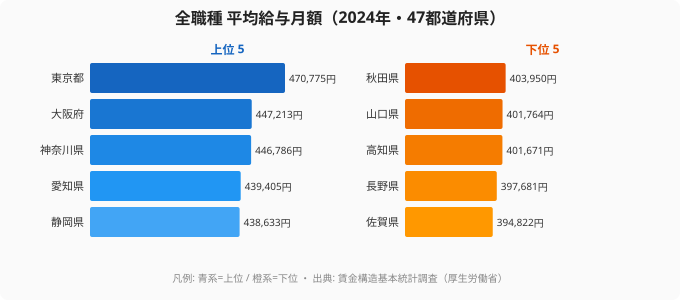

「賃金は東京がぶっちぎりで、地方は安い」というイメージは、たいていの人が持っています。でも、全職種をならした平均給与月額を 47 都道府県で並べてみると、その印象は少し裏切られます。首位の東京と最下位の差は、倍率にしてわずか 1.2 倍ほど。多くの県が中央付近に密集していて、実態は「東京という一つの外れ値と、団子状に固まった 46 県」という構図なのです。

棒グラフで「1 位の東京、最下位の県」とだけ並べると、この「真ん中の団子」が見えません。47 都道府県の分布全体がどう散らばっているかを一発で見せたいときは、ボックスプロット（箱ひげ図）の方が圧倒的に強いのです。中央値・四分位数・外れ値が同時に視覚化できるので、「東京は外れ値、それ以外は意外と団子」という構造がそのまま画になります。

連載 Part 10 の今回は、賃金構造基本統計調査の所定内給与額を題材に、Claude Code で四分位数の計算から外れ値判定、D3 ボックスプロット描画までを一気通貫でやります。「箱ひげって計算が面倒で書いたことがない」というエンジニアこそ、Claude Code に投げると 10 分で終わるのを体感してほしい回です。連載全体の流れは [Part 1](/blog/cc-estat-01-setup) の冒頭にまとまっています。

## まず実データで「団子状の分布」を確かめる

理屈の前に、まず実際の数字を見てしまいましょう。全職種をならした平均給与月額（2024 年・厚生労働省）を都道府県で並べ、上位 5 県と下位 5 県を抜き出したのが次の図です。



上位は東京（470,775 円）を筆頭に、大阪（447,213 円）・神奈川（446,786 円）・愛知（439,405 円）・静岡（438,633 円）と続きます。大都市圏と産業集積県が並ぶのは予想どおりですが、注目してほしいのは下位です。最下位の佐賀でも 394,822 円あり、長野（397,681 円）・高知（401,671 円）・山口（401,764 円）・秋田（403,950 円）と、いずれも 39〜40 万円台に収まっています。

つまり首位 47 万円に対し最下位 39 万円台で、差は 1.2 倍程度しかありません。年収換算でも単純比較で 100 万円弱の開きですが、これは「東京だけが一段高い」のであって、残りの 46 県は思いのほか狭いレンジに密集しています。棒グラフで端の 2 県だけを見ると「東京 vs 地方」の物語になりがちですが、分布全体を見ると物語は「東京という外れ値と、団子状の本州・地方」へと変わります。この「団子の見えにくさ」こそ、箱ひげ図を持ち出す理由です。

<source-link href="/ranking/avg-salary-all-prefecture">全職種 平均給与月額ランキングをもっと見る</source-link>

> [!NOTE]
> ここで使った「全職種 平均給与月額」は、業種をまたいで平均した代表値です。後半で扱う「業種別」のデータとは集計の切り口が異なります。同じ賃金構造基本統計調査でも、全職種ならしの分布と、金融や宿泊といった個別業種の分布はまったく別物として読んでください。

## なぜ業種別に分けると格差が見えてくるのか

全職種ならしだと差が 1.2 倍に圧縮されてしまうのは、高い業種と低い業種が県内で打ち消し合うからです。賃金の本当の格差は、業種ごとに分けたときに初めて姿を現します。そして業種ごとに格差の「形」がまるで違うのが面白いところです。

- 金融・保険業: 東京が異常値レベルで突出し、第 3 四分位数と最大値の差が大きくなります
- 宿泊業・飲食サービス業: 全国どこでも低く、47 県の箱がぺちゃんこに潰れます
- 製造業: 中央値は中くらいですが、箱の高さ（四分位範囲）が大きく、県によってばらつきます
- 医療・福祉: 中央値は高めで外れ値が少なく、ほぼフラットに並びます

これを 47 県の棒グラフ × 業種数だけ並べると、何枚あっても足りません。ボックスプロットなら 1 枚で 10 業種 × 47 県、つまり 470 データポイントの分布構造が一望できます。

そして可視化の主役は、実は外れ値です。東京や大阪が他県と桁違いに離れている業種では、外れ値の点だけが箱の外にぴょこんと飛び出します。そこにラベルを付けてあげると、「この業種は首都圏一極集中なんだ」が直感でわかるようになります。今回の最大のテーマがこれです。

> [!TIP]
> 全職種ならしの図で「差は小さい」と感じたら、それは平均がならされた結果だと疑ってください。同じデータでも業種別に箱ひげで切り直すと、金融のように箱が縦に伸びて外れ値が飛び出す業種が現れます。「平均で見るか、分布で見るか」で結論が変わるのが賃金データの怖いところです。

## 使うデータ: 賃金構造基本統計調査

厚生労働省が毎年 6 月時点で実施する賃金構造基本統計調査（通称「賃金センサス」）が今回のデータソースです。e-Stat 上の statsDataId は `0003445758`。一般労働者の都道府県・産業中分類別の所定内給与額が取得できます。データの内訳は次のとおりです。

- 統計名: 賃金構造基本統計調査
- 統計表 ID: `0003445758`
- 集計単位: 都道府県 × 産業中分類 × 性別 × 企業規模
- 主な指標: 所定内給与額（千円）、年間賞与その他特別給与額、平均年齢、勤続年数
- 更新頻度: 年 1 回（毎年 3 月公表）
- 注意点: 産業分類は日本標準産業分類に準拠し、年度によって中分類のコードが変わることがあります

「所定内給与額」は残業代を含まない月額の基本給ベースです。賞与・残業を入れた年収換算をしたいときは、別カラムの「年間賞与」と組み合わせる必要があります。Part 10 では話を簡単にするため、所定内給与額 1 本で議論します。

データの粒度は「都道府県 × 産業中分類」です。中分類はざっくり 20 業種くらいに分かれていて、「建設業」「製造業」「情報通信業」「金融業，保険業」「医療，福祉」「宿泊業，飲食サービス業」などがあります。今回は読み手の馴染みやすさを優先して 10 業種に絞って可視化します。

## Step 1: Claude Code に「業種別賃金を全県取って」と頼む

スキル化済みの `/fetch-estat-data` を使う前提で進めます（連載 [Part 2](/blog/cc-estat-02-search-skill) でスキル化の手順を解説済み）。Claude Code への依頼はこんな感じです。

```
/fetch-estat-data
statsDataId: 0003445758
切り口: 都道府県 × 産業中分類
対象: 一般労働者 / 男女計 / 企業規模計
指標: 所定内給与額（千円）
年度: 最新年
出力: data/wage-by-industry.json
```

Claude Code は内部でこういう動きをします。

1. `getMetaInfo` で `0003445758` のメタ情報を取得し、`cat01`（労働者区分）/ `cat02`（性別）/ `cat03`（企業規模）/ `cat04`（産業分類）/ `cat05`（指標）のコードを確認します
2. 一般労働者・男女計・企業規模計・所定内給与額に対応するコードを抽出します
3. `getStatsData` を `cdCat0X` 指定で叩きます（年度は最新を `cdTime` から推定）
4. 47 都道府県 × 全業種のレスポンスを JSON に整形して保存します

返ってくる JSON はこんな形になります（抜粋・例示）。

```json
{
  "year": "2024",
  "indicator": "所定内給与額（千円）",
  "items": [
    {
      "areaCode": "13000",
      "areaName": "東京都",
      "industryCode": "J",
      "industryName": "金融業，保険業",
      "value": 521.4
    },
    {
      "areaCode": "13000",
      "areaName": "東京都",
      "industryCode": "G",
      "industryName": "情報通信業",
      "value": 478.2
    },
    {
      "areaCode": "47000",
      "areaName": "沖縄県",
      "industryCode": "M",
      "industryName": "宿泊業，飲食サービス業",
      "value": 198.7
    }
  ]
}
```

`value` の単位は千円（月額）です。後段の計算では基本このまま使い、画面表示時だけ「万円」変換しても良いでしょう。

### つまずきポイント 1: 業種コードの統一

e-Stat の業種コードは、年度によって細分化されたり統合されたりします。たとえば「情報通信業」が「J」だったり「39」だったりします。コードではなく業種名でマージするのが最も事故が少ないやり方です。Claude Code には次のように頼みます。

```
取得した JSON で、業種名を以下の 10 業種に正規化して。それ以外は除外して。
- 建設業
- 製造業
- 情報通信業
- 運輸業，郵便業
- 卸売業，小売業
- 金融業，保険業
- 不動産業，物品賃貸業
- 学術研究，専門・技術サービス業
- 宿泊業，飲食サービス業
- 医療，福祉
業種名の表記ゆれ（「金融業, 保険業」「金融・保険業」など）は吸収して。
```

Claude が `industryName` の正規化マップを書いてくれます。

## Step 2: 業種ごとに四分位数（Q1, median, Q3）と IQR を計算

ここがボックスプロットの計算コアです。業種 × 47 県の値配列から、業種ごとに次の統計量を算出します。

- min: 47 県の最小値（外れ値除外後）
- Q1: 第 1 四分位数（下から 25%）
- median: 第 2 四分位数（中央値）
- Q3: 第 3 四分位数（下から 75%）
- max: 47 県の最大値（外れ値除外後）
- IQR: Q3 − Q1（箱の高さ）
- outliers: Q1 − 1.5 × IQR より下、または Q3 + 1.5 × IQR より上の値

外れ値判定は Tukey の方法（1.5 × IQR ルール）が標準です。これも Claude Code に頼むだけで済みます。

```
data/wage-by-industry.json を読み込んで、業種ごとに以下を計算する Node.js
スクリプトを書いて。

- 47 県の所定内給与額配列をソート
- Q1, median, Q3 を線形補間で算出
- IQR = Q3 - Q1
- 下側ヒゲ: max(min, Q1 - 1.5 * IQR)
- 上側ヒゲ: min(max, Q3 + 1.5 * IQR)
- 外れ値: ヒゲの外側にある値 + 県名

出力: data/wage-box-stats.json （業種ごとの統計量配列）
業種の並び順は median 昇順。
```

Claude が書いたコードはだいたいこうなります（一部抜粋・整形）。

```javascript
// scripts/calc-box-stats.mjs
import fs from "node:fs";

const SOURCE = "data/wage-by-industry.json";
const OUTPUT = "data/wage-box-stats.json";

/** 線形補間版の四分位数計算（D3.quantile と同等） */
function quantile(sorted, p) {
  if (sorted.length === 0) return null;
  const i = (sorted.length - 1) * p;
  const lo = Math.floor(i);
  const hi = Math.ceil(i);
  if (lo === hi) return sorted[lo];
  return sorted[lo] + (sorted[hi] - sorted[lo]) * (i - lo);
}

function calcBoxStats(rows) {
  const sortedValues = rows.map((r) => r.value).sort((a, b) => a - b);
  const q1 = quantile(sortedValues, 0.25);
  const median = quantile(sortedValues, 0.5);
  const q3 = quantile(sortedValues, 0.75);
  const iqr = q3 - q1;
  const lowerFence = q1 - 1.5 * iqr;
  const upperFence = q3 + 1.5 * iqr;

  const outliers = rows
    .filter((r) => r.value < lowerFence || r.value > upperFence)
    .map((r) => ({ areaName: r.areaName, value: r.value }));

  const insideValues = sortedValues.filter(
    (v) => v >= lowerFence && v <= upperFence
  );

  return {
    min: insideValues[0],
    q1,
    median,
    q3,
    max: insideValues[insideValues.length - 1],
    iqr,
    outliers,
    n: rows.length,
  };
}

const raw = JSON.parse(fs.readFileSync(SOURCE, "utf8"));
const byIndustry = new Map();
for (const item of raw.items) {
  if (!byIndustry.has(item.industryName)) {
    byIndustry.set(item.industryName, []);
  }
  byIndustry.get(item.industryName).push(item);
}

const result = [];
for (const [industryName, rows] of byIndustry.entries()) {
  result.push({
    industryName,
    ...calcBoxStats(rows),
  });
}

// median 昇順
result.sort((a, b) => a.median - b.median);

fs.writeFileSync(OUTPUT, JSON.stringify(result, null, 2));
console.log(`Wrote ${OUTPUT} (${result.length} industries)`);
```

これで `data/wage-box-stats.json` が次のような形で出力されます（値は例示）。

```json
[
  {
    "industryName": "宿泊業，飲食サービス業",
    "min": 198.7,
    "q1": 211.3,
    "median": 218.6,
    "q3": 226.8,
    "max": 248.2,
    "iqr": 15.5,
    "outliers": [{ "areaName": "東京都", "value": 271.4 }],
    "n": 47
  },
  {
    "industryName": "金融業，保険業",
    "min": 312.1,
    "q1": 334.6,
    "median": 358.9,
    "q3": 391.2,
    "max": 442.5,
    "iqr": 56.6,
    "outliers": [
      { "areaName": "東京都", "value": 521.4 },
      { "areaName": "大阪府", "value": 463.7 }
    ],
    "n": 47
  }
]
```

この段階で既に発見があります。例示の数字で言えば、金融業の IQR は宿泊飲食の IQR の 3 倍以上です。金融業は地域差が大きい業種、宿泊飲食は全国どこでも低いフラットな業種、という構造が四分位範囲の数字にそのまま出ているわけです。冒頭の全職種ならしでは見えなかった「業種ごとの格差の形」が、ここで初めて立ち上がってきます。

### つまずきポイント 2: 線形補間 vs 旧式の四分位数

四分位数の計算方法は、実は数種類あります。エクセルの `QUARTILE.INC` と R の `quantile(type=7)` と D3 の `d3.quantile()` は同じ（線形補間）です。一方、`QUARTILE.EXC` や R の `type=6` は微妙に違います。今回は D3 の標準と同じ線形補間に揃えています。理由は単純で、後段で D3 を使って描くので、両者の値がズレるとデバッグが地獄になるからです。

## Step 3: D3 でボックスプロット（box + whisker + outlier circles）

ここからはチャート実装です。D3.js v7 想定で、業種を Y 軸、賃金を X 軸に取った横向きボックスプロットを描きます。横向きにする理由は、業種名が日本語で長いからです（縦向きだとラベルが斜めになって読みにくくなります）。実装の骨格は次のとおりです。

```javascript
// charts/wage-boxplot.mjs
import * as d3 from "d3";
import fs from "node:fs";

const stats = JSON.parse(fs.readFileSync("data/wage-box-stats.json", "utf8"));

const margin = { top: 32, right: 120, bottom: 48, left: 220 };
const width = 880 - margin.left - margin.right;
const height = stats.length * 44;

const svg = d3.create("svg")
  .attr("viewBox", `0 0 ${width + margin.left + margin.right} ${height + margin.top + margin.bottom}`);

const g = svg.append("g")
  .attr("transform", `translate(${margin.left},${margin.top})`);

// X scale（賃金）: 全業種の min と外れ値を含めて domain を取る
const allValues = stats.flatMap((s) => [
  s.min, s.max, ...s.outliers.map((o) => o.value),
]);
const x = d3.scaleLinear()
  .domain([Math.floor(d3.min(allValues) / 50) * 50, Math.ceil(d3.max(allValues) / 50) * 50])
  .range([0, width])
  .nice();

// Y scale（業種）
const y = d3.scaleBand()
  .domain(stats.map((s) => s.industryName))
  .range([0, height])
  .padding(0.35);

// 軸
g.append("g")
  .attr("transform", `translate(0,${height})`)
  .call(d3.axisBottom(x).tickFormat((d) => `${d}千円`));

g.append("g").call(d3.axisLeft(y));

// 各業種の箱・ひげ・中央線・外れ値を描画
const row = g.selectAll(".row")
  .data(stats)
  .join("g")
  .attr("class", "row")
  .attr("transform", (d) => `translate(0,${y(d.industryName)})`);

// ひげ（横線）
row.append("line")
  .attr("x1", (d) => x(d.min))
  .attr("x2", (d) => x(d.max))
  .attr("y1", y.bandwidth() / 2)
  .attr("y2", y.bandwidth() / 2)
  .attr("stroke", "#94a3b8")
  .attr("stroke-width", 1.2);

// 箱（Q1〜Q3）
row.append("rect")
  .attr("x", (d) => x(d.q1))
  .attr("width", (d) => x(d.q3) - x(d.q1))
  .attr("y", 0)
  .attr("height", y.bandwidth())
  .attr("fill", "#bfdbfe")
  .attr("stroke", "#1d4ed8")
  .attr("stroke-width", 1.2);

// 中央値の線
row.append("line")
  .attr("x1", (d) => x(d.median))
  .attr("x2", (d) => x(d.median))
  .attr("y1", 0).attr("y2", y.bandwidth())
  .attr("stroke", "#1e3a8a")
  .attr("stroke-width", 2.2);

// 外れ値の点
row.selectAll(".outlier")
  .data((d) => d.outliers.map((o) => ({ ...o, industryName: d.industryName })))
  .join("circle")
  .attr("class", "outlier")
  .attr("cx", (o) => x(o.value))
  .attr("cy", y.bandwidth() / 2)
  .attr("r", 4.5)
  .attr("fill", "#ef4444");

fs.writeFileSync("out/wage-boxplot.svg", svg.node().outerHTML);
```

ここまでが「素のボックスプロット」です。実行すると業種ごとに箱が並んで、赤い点で外れ値が出る画になります。これだけでも普通に綺麗なのですが、肝心の外れ値が「どの県か」がわかりません。次のステップでラベルを付けます。

## Step 4: 外れ値ハイライト（東京 / 大阪などラベル付け）

ボックスプロットの「読ませ方」を一段引き上げるのが、外れ値の県名ラベルです。Claude Code に次のように頼みます。

```
さっきのコードに、外れ値の右側に areaName のテキストラベルを追加して。
重なりが出る場合はオフセットを取って読めるようにして。
東京都 / 大阪府 など主要都市は太字、それ以外は通常太さで。
```

Claude が書き足してくる差分はこんな感じです。

```javascript
const HIGHLIGHT_AREAS = new Set(["東京都", "大阪府", "神奈川県", "愛知県"]);

row.selectAll(".outlier-label")
  .data((d) => d.outliers.map((o) => ({ ...o, industryName: d.industryName })))
  .join("text")
  .attr("class", "outlier-label")
  .attr("x", (o) => x(o.value) + 8)
  .attr("y", y.bandwidth() / 2)
  .attr("dy", "0.32em")
  .attr("font-size", 11)
  .attr("font-weight", (o) => HIGHLIGHT_AREAS.has(o.areaName) ? 700 : 400)
  .attr("fill", (o) => HIGHLIGHT_AREAS.has(o.areaName) ? "#b91c1c" : "#475569")
  .text((o) => `${o.areaName} ${o.value.toFixed(0)}`);
```

これで点の隣に県名と数値が並びます。読み手は箱とラベルだけで「金融業は東京と大阪が外れ値、それ以外の 45 県は団子」が瞬時にわかります。全職種ならしの図で見た「東京という外れ値」が、業種別に分けるとさらにくっきり浮かび上がるわけです。

### 外れ値が多すぎてラベルが重なるとき

業種によっては外れ値が 5 個以上出ることがあります。ラベルが重なって読めなくなるので、対処は 2 つです。

- 上位 N 件だけラベルを出す: `outliers.sort((a,b) => b.value - a.value).slice(0, 3)` でトップ 3 のみ表示します
- 重なり回避ライブラリを使う: `d3-textwrap` や `d3-annotation` で自動配置させます

連載で扱う粒度では「上位 3 件のみ表示」で十分です。残りは点だけ打って、ツールチップ（hover）で県名を出すのが UX として無難でしょう。Claude Code に「ラベルは値の大きい上位 3 件のみ、残りは tooltip で」と頼めば、その通りに直してくれます。

## Step 5: 業種を並べる順番（昇順 median）

ボックスプロットの並び順は、読みやすさを大きく左右します。アルファベット順や 50 音順で並べると「結局どの業種が高いのか低いのか」がわかりません。基本は median 昇順または降順が鉄則です。用途ごとに使い分けます。

- median 昇順（低 → 高）: 「業種別の格差」を全体俯瞰したいときに向いています
- median 降順（高 → 低）: ランキング的に上位業種から見せたいときに向いています
- IQR 降順: 「地域差が大きい業種」を強調したいときに向いています
- outliers 数降順: 「特異な業種」を浮かび上がらせたいときに向いています

今回は median 昇順を採用します。下から順に「宿泊飲食 → 卸売小売 → 運輸 → 製造 → 建設 → 不動産 → 医療福祉 → 学術研究 → 情報通信 → 金融保険」と並ぶことになり、業種の社会的イメージと賃金水準が一致しているかが見えます。「医療福祉」が思ったより上に来るのが、個人的に毎回ハッとするポイントです。Claude Code に並び替えを頼むのは 1 行で済みます。

```
data/wage-box-stats.json を median 降順（高い業種を上）に並び替えて保存しなおして。
```

## つまずきポイント（業種コード・データ年度・平均年齢）

実装中に踏みやすい落とし穴を 3 つまとめます。いずれも数字の解釈を誤らせる原因になるので、本文かキャプションで触れておくのが誠実な書き方です。

### 1. 業種コードの統一

Step 1 でも触れた話です。e-Stat の業種分類は日本標準産業分類（JSIC）に準拠しますが、改定があるたびに細かいコードが変わります。特に「情報通信業」が独立した時期や、「複合サービス事業」が新設された時期などは要注意です。解決策は、コードではなく業種名で正規化することです。Claude Code に「業種名を 10 業種に正規化して、表記ゆれを吸収して」と依頼するのが最速でしょう。

### 2. データ年度のズレ

賃金構造基本統計調査は、毎年 3 月に前年 6 月時点の調査結果が公表されます。つまり「最新年」と書いてあっても、実態は 9 ヶ月前のスナップショットです。年度をまたいで比較する記事を書くときは、必ず「2024 年 6 月調査」のように調査月を明記してください。解決策は、グラフのキャプションに「データ: 賃金構造基本統計調査 YYYY 年 6 月 / 厚生労働省」を必ず入れることです。

### 3. 平均年齢の影響

所定内給与額は、その業種・県の労働者の平均年齢に強く依存します。東京の金融業が高いのは、もちろん業界水準も高いのですが、平均年齢が高め（管理職比率が高い）という構造もあります。一方、宿泊業は若年労働者比率が高く、それも給与を押し下げる要因です。解決策は、同じ JSON に `averageAge` カラムも引いておき、外れ値の解釈時に補足として参照することです。可能なら年齢階級別データ（statsDataId は別になります）で「30 代前半に限定した賃金」での比較もやると、より厳密な分析になります。

> [!WARNING]
> 箱ひげ図の外れ値は「異常なデータ」ではなく「分布から見て遠い値」を機械的に拾っただけです。Tukey の 1.5 × IQR ルールで外れ値判定された県を「データミス」と早合点しないでください。東京の金融業のように、構造的に高くて当然の外れ値も多くあります。外れ値ラベルは「なぜそこだけ離れているのか」を考える入口であって、除外すべき対象ではありません。

## ボックスプロットから読み取れる典型パターン

最後に、業種別ボックスプロットから読み取れる典型的な発見を、箱の形と対応づけて整理します。チャートを見るときの「型」として頭に入れておくと、初見の業種でも数秒で構造がつかめます。

- 金融業，保険業（中央値=高 / IQR=大 / 外れ値=東京・大阪）: 一極集中の代表業種で、箱が高い位置にあり外れ値が右へ飛び出します
- 情報通信業（中央値=高 / IQR=中 / 外れ値=東京）: 東京と地方のギャップが大きく、上端だけが伸びます
- 医療，福祉（中央値=中 / IQR=小 / 外れ値=ほぼなし）: 全国でフラットに並び、公的需要由来で地域差が小さくなります
- 製造業（中央値=中 / IQR=大 / 外れ値=神奈川・愛知）: 産業集積県が箱の上端に位置し、ばらつきが大きくなります
- 宿泊業，飲食サービス業（中央値=低 / IQR=小 / 外れ値=東京のみ）: 全国どこでも低く、箱がぺちゃんこに潰れます

冒頭で見た全職種ならしの「1.2 倍しかない団子」と、ここで見た業種別の「金融は飛び出し、宿泊は潰れる」を並べると、賃金格差の正体がよくわかります。格差は県と県の間にあるというより、業種と業種の間にあるのです。Claude Code に四分位数計算を任せれば、この構造を 1 枚の箱ひげ図に落とし込む実装が 10 分で終わります。

## 次回予告（Part 11: 積み上げ棒）

ボックスプロットは「1 指標の分布を複数カテゴリで比較」する道具でした。次回 Part 11 は逆方向の「1 指標を複数の構成要素に分解」する積み上げ棒グラフを扱います。題材は「県別の歳入内訳（地方税 / 地方交付税 / 国庫支出金 / 地方債）」の予定です。財政自立度を一目で見せる定番チャートです。連載全体のロードマップは [Part 1](/blog/cc-estat-01-setup) からどうぞ。

## データ出典

- 厚生労働省「賃金構造基本統計調査」（statsDataId: 0003445758、所定内給与額・2024 年 6 月調査）
- 全職種 平均給与月額（2024 年）は e-Stat 経由で整備したデータを使用
