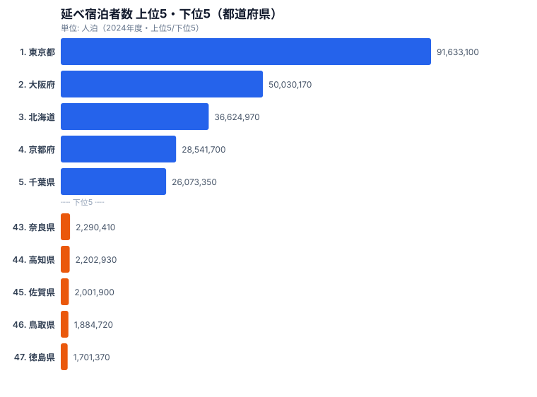
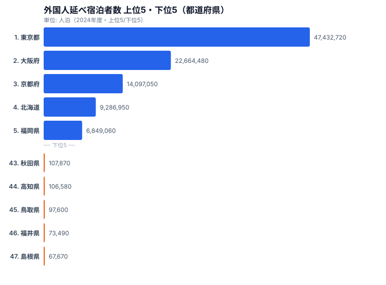

「観光客数」と一口に言っても、宿泊しているのが日本人なのか外国人なのかで、その県の観光産業の性格はガラッと変わります。京都や大阪のように訪日客が大きな割合を占める県もあれば、ほぼ国内客で回っている県もあります。一つの数字に丸めてしまうと、この差は完全に消えてしまうのです。

そこで本記事では、観光庁「宿泊旅行統計調査」から **国内宿泊客数** と **訪日外国人宿泊客数** の2系列を e-Stat API 経由で取得し、47都道府県別の **積み上げ棒グラフ** を Claude Code に作らせる手順をまとめます。シリーズ Part 11、扱うチャート種は積み上げ棒、論点は「多系列処理」「d3.stack」「凡例配置」の3点です。

このシリーズの過去回は単系列のチャート（棒・ヒートマップ・散布図・レーダー）が中心でしたが、今回からは複数系列が絡みます。データ整形のレシピと、Claude Code への伝え方のコツが少し変わるので、その差分を意識しながら読んでほしいと思います。

## 1. 導入: 観光統計を「一枚」で見る価値

観光統計をニュースで見るとき、よくあるのは「訪日客が過去最高」「国内旅行需要が回復」といった全国合計の話です。ですが現場でデータを使う側からすると、知りたいのは大抵こういうことです。

- うちの県の観光産業は **国内** で食べているのか、**訪日** で食べているのか
- 隣県と比べて、**訪日依存度** はどのくらい違うのか
- 訪日が落ち込んだとき、**ベースとなる国内客** がどれだけクッションになるか

これは折れ線や単独の棒では一目で読めません。**積み上げ棒** が一番素直で、47県を横に並べた瞬間に「訪日の帯の割合」が地図のように浮かび上がります。京都・大阪・東京の訪日帯が他県を圧倒し、その隣に「ほぼ国内一色」の地方県が並ぶ、あの絵です。

データ可視化の世界では「stacked bar は比較に向かない」と言われがちで、確かに「2番目以降のセグメントの絶対値比較」は読みづらいです。ですが今回のように **合計値の県別比較 + 内訳の割合提示** を同時にやりたいケースでは、積み上げ棒は今もって最強クラスの選択肢になります。表現方法を整理すると、単純棒は合計の比較に強いが内訳が見えず、グループ棒は47県を並べると棒が細くなって崩壊し、100%積み上げ棒は比率は読めるが絶対値が消えます。今回採用するのは絶対値の積み上げ棒で、合計のランキングと内訳の割合を一度に見せられるからです。

100%積み上げ棒（normalized stacked bar）も魅力的なオプションですが、最初の1枚としては絶対値の積み上げ棒を推します。観光地としての規模感が消えてしまうと「沖縄と鳥取が同じ高さ」のような見た目になり、誤読の温床になるからです。

> [!NOTE]
> 「人泊」=宿泊者数×宿泊日数。1人が3連泊すれば3人泊と数えます。本記事の数値はすべてこの延べ宿泊者数（人泊）であり、来訪者の頭数ではありません。リピーターや連泊客の効果がそのまま積み上がる点に注意してください。

## 2. データの全体像: 合計の宿泊と訪日の宿泊は山が違う

本記事の積み上げ棒を作る前に、土台となる2つの系列が47県でどう分布しているかを実データで確認しておきましょう。stats47.jp には同じ宿泊旅行統計から作った都道府県ランキングがあり、2024年度の上位5県・下位5県を1枚にすると次のようになります。まずは合計（国内＋訪日）の延べ宿泊者数です。



合計で見ると、東京都が9,163万人泊で群を抜き、大阪府5,003万、北海道3,662万、京都府2,854万、千葉県2,607万と続きます。下位は徳島県170万、鳥取県188万、佐賀県200万、高知県220万、奈良県229万で、首位の東京と最下位の徳島では約54倍の開きがあります。千葉県が5位に入るのは、ディズニーリゾートと成田空港周辺の宿泊需要が積み上がるためで、純粋な観光地イメージとは別の構造で上位に来ている点が面白いところです。合計の山は「人口と交通の結節点」にきれいに沿っており、大都市圏と北海道・沖縄のような大型観光地が稼ぐ構図になっています。

<source-link href="/ranking/total-overnight-guests">延べ宿泊者数ランキングをもっと見る</source-link>

ところが、ここから訪日（外国人）だけを抜き出すと、山の形がまるで変わります。同じ年度の外国人延べ宿泊者数の上位5県・下位5県を見てください。



外国人の宿泊だと、東京都が4,743万人泊、大阪府2,266万、京都府1,409万、北海道928万、福岡県684万です。合計では3位だった北海道が訪日では4位に下がり、合計では圏外だった福岡県が5位に浮上します。一方で下位は島根県6.7万、福井県7.3万、鳥取県9.7万、高知県10.6万、秋田県10.7万と桁が一気に小さくなり、首位の東京と最下位の島根では実に約700倍もの差が開きます。合計の54倍と比べて、訪日だけを取り出すと格差が一桁跳ね上がるのです。これが「一つの数字に丸めると消える差」の正体で、積み上げ棒で訪日の帯を別色にして見せる意味がここにあります。

<source-link href="/ranking/total-overnight-guests-foreign">外国人延べ宿泊者数ランキングをもっと見る</source-link>

> [!WARNING]
> 合計の順位と訪日の順位は一致しません。北海道は合計3位でも訪日では4位、福岡県は合計では上位5県の外に出ますが訪日では5位に入ります。逆順位（下位）でも、合計の最下位は徳島県ですが訪日の最下位は島根県で、顔ぶれがずれます。「合計が多い県＝訪日が多い県」と読み替えると誤読します。積み上げ棒を作るときは、必ず2系列を別々に保持して、両方の順位を確認してください。

## 3. 使うデータ: 宿泊旅行統計の都道府県別宿泊客数

観光庁の **宿泊旅行統計調査** は、ホテル・旅館・簡易宿所・その他の宿泊施設を対象に、月次で宿泊者数を集計している調査です。e-Stat 上では「観光庁」の調査として登録されており、`statsDataId` を1つ叩けば全国＋47県×国籍区分（日本人/外国人）のクロス集計が一気に取れます。

データの粒度を整理すると、公表元は観光庁、調査名は宿泊旅行統計調査、公表頻度は月次（速報→確報）、集計単位は都道府県・宿泊施設タイプ・国籍（日本人/外国人）、単位は延べ宿泊者数（人泊）です。前述のとおり「人泊」ベースである点が重要で、観光統計で「観光客数」と言うとき、来訪者の頭数を指す場合と宿泊数を指す場合があります。本データは後者なので、連泊やリピートが多い県ほど数字が膨らむ性質を頭に入れておきましょう。

### 3-1. 国籍区分の取り方

宿泊旅行統計の `cat02` 軸には「総数/日本人/外国人」の区分が含まれています。今回欲しいのは以下の2系列です。

- **国内宿泊客数** = `cat02 == 日本人`
- **訪日宿泊客数** = `cat02 == 外国人`

総数は「日本人＋外国人」とほぼ一致しますが、不詳が少し混じるので、積み上げ棒では「日本人」と「外国人」だけを足し合わせて見せるほうがクリーンです。総数を別途引いてラベルだけ表示するのもありでしょう。

### 3-2. 施設タイプの取り方

`cat01` 軸には「全宿泊施設/ホテル/旅館/簡易宿所/その他」のような施設タイプが入ります。今回の積み上げ棒は **施設タイプは「全宿泊施設」固定** で、国籍だけを積み上げます。施設タイプも積み上げると3階建ての積み上げになり、Part 11 のスコープを超えるのでやりません。

## 4. Step 1: 2つの系列を Claude Code に取らせる

ここから手を動かします。最終的にやりたいのは「指定年の12か月合計を、47県×2系列で配列に整形してファイル出力」です。

まず Claude Code に渡す前提を共有します。プロジェクトのセットアップは Part 01 で済んでいるものとして、`packages/estat-api` 経由で API キー読み込みと R2 キャッシュが動く想定です。Part 02 の `/search-estat` スキルで `statsDataId` の候補当たりをつけたあとに、本番取得に進みます。

Claude Code への最初の依頼はこう書きます。

```text
@.claude/skills/estat/fetch-estat-data/SKILL.md

宿泊旅行統計調査（観光庁）から、2024 年（年間集計）の都道府県別
「全宿泊施設 × 日本人」「全宿泊施設 × 外国人」の延べ宿泊者数を取ってきて、
scripts/tourism/fetch-overnight-2024.ts として書き出して。

要件:
- e-Stat API は packages/estat-api 経由（cdArea / cdTime は使わない）
- 全年・全県を一括取得してメモリでフィルタ
- 出力は data/tourism/overnight-2024.json
- スキーマ:
  { year: 2024, items: [
    { areaCode: "01000", areaName: "北海道", domestic: 12345678, inbound: 234567 },
    ...
  ] }
- 1 県でも欠損があれば warn ログ + nullable で詰める
- 既存の指標登録テーブル indicators を汚さない（読み取りオンリーで OK）
```

`@` でスキルを直接食わせるのが Part 02 で習った癖です。Claude Code は SKILL.md を読み、e-Stat API の規約（`cdArea` / `cdTimeFrom` を使わない・全件取得してメモリでフィルタ）を勝手に守った形で吐いてくれます。

実行すると、こんな感じのスクリプトが返ってきます。

```typescript
// scripts/tourism/fetch-overnight-2024.ts
import { fetchEstatStats } from "@stats47/estat-api";
import { writeFile, mkdir } from "node:fs/promises";
import { dirname } from "node:path";

const STATS_DATA_ID = "0003445XXX"; // 宿泊旅行統計の確報テーブル
const TARGET_YEAR = "2024";

type OvernightRow = {
  areaCode: string;
  areaName: string;
  domestic: number | null;
  inbound: number | null;
};

async function main() {
  // 全件取得（cdArea / cdTime 指定なし）
  const raw = await fetchEstatStats({
    statsDataId: STATS_DATA_ID,
    cdCat01: "ALL_FACILITIES", // 全宿泊施設
  });

  // 軸を解釈: AREA / TIME / CAT02(日本人・外国人)
  const byPref = new Map<string, OvernightRow>();

  for (const row of raw.values) {
    if (!row.timeCode.startsWith(TARGET_YEAR)) continue;
    const code = row.areaCode;
    if (!byPref.has(code)) {
      byPref.set(code, {
        areaCode: code,
        areaName: row.areaName,
        domestic: 0,
        inbound: 0,
      });
    }
    const target = byPref.get(code)!;
    if (row.cat02Code === "JAPANESE") {
      target.domestic = (target.domestic ?? 0) + row.value;
    } else if (row.cat02Code === "FOREIGN") {
      target.inbound = (target.inbound ?? 0) + row.value;
    }
  }

  // 47 県だけに絞る（00000 全国 / 99000 不詳を除く）
  const items = [...byPref.values()]
    .filter((r) => r.areaCode.endsWith("000") && r.areaCode !== "00000")
    .sort((a, b) => a.areaCode.localeCompare(b.areaCode));

  for (const r of items) {
    if (r.domestic == null || r.inbound == null) {
      console.warn(`[warn] missing series at ${r.areaCode} ${r.areaName}`);
    }
  }

  const outPath = "data/tourism/overnight-2024.json";
  await mkdir(dirname(outPath), { recursive: true });
  await writeFile(outPath, JSON.stringify({ year: 2024, items }, null, 2));
  console.log(`[done] wrote ${items.length} rows to ${outPath}`);
}

main().catch((e) => {
  console.error(e);
  process.exit(1);
});
```

実行コマンドはお馴染みの1行です。

```bash
npx tsx scripts/tourism/fetch-overnight-2024.ts
```

API キーは `.env` から読まれる前提で、初回だけ e-Stat にリクエストが走り、2回目以降は R2 キャッシュにヒットしてミリ秒単位で返ってきます。

ここまでで「データを取る」フェーズはおしまいです。e-Stat API そのものの細かい話は Part 01〜03 で散々書いたので深入りしません。

## 5. Step 2: 47県×2系列 の行列に整形

API レスポンスを保存した `overnight-2024.json` はこんな構造になります。

```json
{
  "year": 2024,
  "items": [
    { "areaCode": "01000", "areaName": "北海道", "domestic": 27338020, "inbound": 9286950 },
    { "areaCode": "13000", "areaName": "東京都", "domestic": 44200380, "inbound": 47432720 },
    { "areaCode": "26000", "areaName": "京都府", "domestic": 14444650, "inbound": 14097050 },
    { "areaCode": "27000", "areaName": "大阪府", "domestic": 27365690, "inbound": 22664480 },
    { "areaCode": "32000", "areaName": "島根県", "domestic": 2809210, "inbound": 67670 }
  ]
}
```

`inbound`（訪日）の値は外国人延べ宿泊者数ランキングの実値、合計（`domestic + inbound`）が延べ宿泊者数ランキングの実値に一致します。例えば東京都は合計9,163万のうち訪日が4,743万で、訪日が国内をわずかに上回る稀な県です。島根県は合計に対して訪日がわずか6.7万で、ほぼ国内一色になります。`domestic` は「合計−訪日」で逆算できるので、積み上げ棒の整形段階で計算しても構いません。

積み上げ棒に食わせるには、これを **「stack の対象キー（series）」と「行レコード（areaCode 単位）」** の2階層に整えます。d3-shape の `d3.stack()` が受け取れる形にしてやるイメージです。

```typescript
// scripts/tourism/build-stack-input.ts
import { readFile, writeFile } from "node:fs/promises";

type Row = {
  areaCode: string;
  areaName: string;
  domestic: number | null;
  inbound: number | null;
};

const SERIES = ["domestic", "inbound"] as const;
type Series = (typeof SERIES)[number];

type StackInput = {
  series: typeof SERIES;
  rows: Array<{
    areaCode: string;
    areaName: string;
    total: number;
    domestic: number;
    inbound: number;
  }>;
};

async function main() {
  const raw = JSON.parse(await readFile("data/tourism/overnight-2024.json", "utf-8")) as {
    items: Row[];
  };

  const rows = raw.items.map((r) => {
    const domestic = r.domestic ?? 0;
    const inbound = r.inbound ?? 0;
    return {
      areaCode: r.areaCode,
      areaName: r.areaName,
      domestic,
      inbound,
      total: domestic + inbound,
    };
  });

  // 合計値降順で並び替え（積み上げ棒の常套手段）
  rows.sort((a, b) => b.total - a.total);

  const out: StackInput = { series: SERIES, rows };
  await writeFile(
    "data/tourism/overnight-2024.stack.json",
    JSON.stringify(out, null, 2)
  );
  console.log(`[done] ${rows.length} rows ready for d3.stack`);
}

main();
```

ここで効いているのが「合計値降順ソート」です。47県のような多数カテゴリを並べると、五十音順や `areaCode` 順で並べたグラフは「読み手の脳に負荷を強いるだけ」になります。「視覚的に山なりに減っていく」絵にするだけで、読みやすさが体感2倍は変わります。

実は Claude Code に「Step 2 の整形スクリプトを書いて。stack 用の `series` キーと `rows` 配列。並びは合計値降順」とだけ伝えれば、上記スクリプトはほぼそのまま出てきます。**意図（並び順、key 名）を文字で伝える** のがコツで、Claude Code は意図を取り違えるよりも「意図がないところを勝手に埋める」ほうがエラー率が高いので、書きすぎても損はありません。

## 6. Step 3: d3.stack で積み上げレイアウト

ここからフロント側です。`packages/visualization/d3` 配下に積み上げ棒コンポーネントが既にあれば再利用、なければ Claude Code に新規生成させます。今回は新規前提で進めます。

Claude Code に投げるプロンプトはこうです。

```text
packages/visualization/d3/StackedBarChart.tsx を作成。

要件:
- props: { data: StackInput; width: number; height: number; colors?: Record<Series, string> }
- d3-scale, d3-shape のみ使用（React は SVG をそのまま描画、d3 セレクションは触らない）
- x: scaleBand（areaName）, y: scaleLinear（0 〜 total max）
- d3.stack().keys(series) で積み上げ
- 描画は SVG 直書き、d3.select はしない
- アクセシビリティ: <title> で areaName + 各系列の値、role="img"
- ホバー時の tooltip は別 PR でやるので、今は描画のみ
- 単位は「万人泊」に丸める（生値 / 10000、小数 1 桁）
```

返ってくる中身がこうなります。

```tsx
// packages/visualization/d3/StackedBarChart.tsx
import { scaleBand, scaleLinear } from "d3-scale";
import { stack } from "d3-shape";
import { max } from "d3-array";

type Series = "domestic" | "inbound";

type Row = {
  areaCode: string;
  areaName: string;
  domestic: number;
  inbound: number;
  total: number;
};

type StackInput = {
  series: readonly Series[];
  rows: Row[];
};

const DEFAULT_COLORS: Record<Series, string> = {
  domestic: "#2563eb", // blue-600
  inbound: "#ea580c", // orange-600
};

const SERIES_LABEL: Record<Series, string> = {
  domestic: "国内（日本人）",
  inbound: "訪日（外国人）",
};

const MARGIN = { top: 24, right: 24, bottom: 80, left: 56 };

export function StackedBarChart({
  data,
  width,
  height,
  colors = DEFAULT_COLORS,
}: {
  data: StackInput;
  width: number;
  height: number;
  colors?: Record<Series, string>;
}) {
  const innerW = width - MARGIN.left - MARGIN.right;
  const innerH = height - MARGIN.top - MARGIN.bottom;

  const x = scaleBand<string>()
    .domain(data.rows.map((r) => r.areaName))
    .range([0, innerW])
    .padding(0.15);

  const yMax = max(data.rows, (r) => r.total) ?? 0;
  const y = scaleLinear()
    .domain([0, yMax])
    .nice()
    .range([innerH, 0]);

  const series = stack<Row, Series>()
    .keys([...data.series])
    .value((row, key) => row[key])(data.rows);

  const rootProps = {
    role: "img" as const,
    width,
    height,
    viewBox: `0 0 ${width} ${height}`,
  };

  return (
    <svg{...rootProps}>
      <g transform={`translate(${MARGIN.left},${MARGIN.top})`}>
        {/* Y 軸グリッド + ラベル */}
        {y.ticks(5).map((t) => (
          <g key={t} transform={`translate(0,${y(t)})`}>
            <line x1={0} x2={innerW} stroke="#e5e7eb" />
            <text x={-8} y={4} fontSize={11} textAnchor="end" fill="#64748b">
              {(t / 10000).toFixed(0)}万
            </text>
          </g>
        ))}

        {/* 各系列の rect */}
        {series.map((s) => (
          <g key={s.key} fill={colors[s.key as Series]}>
            {s.map((seg, i) => {
              const row = data.rows[i];
              const xPos = x(row.areaName) ?? 0;
              const yTop = y(seg[1]);
              const yBot = y(seg[0]);
              return (
                <rect
                  key={row.areaCode}
                  x={xPos}
                  y={yTop}
                  width={x.bandwidth()}
                  height={Math.max(0, yBot - yTop)}
                >
                  <title>
                    {row.areaName} / {SERIES_LABEL[s.key as Series]}:{" "}
                    {((seg[1] - seg[0]) / 10000).toFixed(1)} 万人泊
                  </title>
                </rect>
              );
            })}
          </g>
        ))}

        {/* X 軸ラベル（縦書きで 47 件さばく） */}
        {data.rows.map((r) => {
          const xPos = (x(r.areaName) ?? 0) + x.bandwidth() / 2;
          return (
            <text
              key={r.areaCode}
              x={xPos}
              y={innerH + 12}
              fontSize={10}
              textAnchor="end"
              transform={`rotate(-60, ${xPos}, ${innerH + 12})`}
              fill="#334155"
            >
              {r.areaName}
            </text>
          );
        })}
      </g>
    </svg>
  );
}
```

ポイントは3つあります。

1. `d3.stack()` の戻り値 `series` は **3次元配列** に近い構造で、`series[seriesIndex][rowIndex] = [y0, y1]` という形になります。`y0` が下端、`y1` が上端で、ここをそのまま `y(seg[0]) - y(seg[1])` で高さに変換します。
2. `d3.select` には触りません。React で d3 を扱うときの鉄則です。レイアウト計算は d3、描画は React の流儀で完結させます。
3. X 軸ラベルは47件入る都合、`rotate(-60)` で縦傾けが現実解になります。フォントを10pxまで落とすと収まります。

このコンポーネントを `apps/web/src/app/blog/cc-estat-11-tourism-stacked/Chart.tsx` あたりから呼び出せば、記事内チャートとして配信できます。Step 2 の実データを食わせると、東京都だけ国内帯と訪日帯がほぼ同じ高さで積み上がり、その右に大阪・京都の訪日帯がせり出し、徳島や島根に向かって訪日帯が消えていく山が描かれます。

## 7. Step 4: 凡例配置（縦/横、色選び）

ここまでで「正しく積み上がる絵」は出ます。ですが凡例なしの積み上げ棒は **ただの2色の塔** で意味不明です。凡例を打つ場所が、地味だが効きます。

### 7-1. 縦並び vs 横並びの判断軸

モバイル幅（〜768px）では縦並び凡例が棒のスペースを圧迫するので、横並び凡例を採用します。逆にワイド PC（1280px+）では縦並び凡例を右側か左側に置くほうがよく、横並びだと横幅が間延びします。系列数が5以上あるなら縦並びでスクロール可能にするのが吉ですが、横並びは折り返しが汚くなります。系列数が2〜3ならどちらでも破綻しません。

47県×2系列という今回の構成では、横並び凡例を **棒グラフの上部** に置くのが鉄板です。凡例を見てから棒に視線を落とす、という自然な視線移動になります。

### 7-2. 色の決め方

「国内＝青、訪日＝オレンジ」をデフォルトにしましたが、これは深い意味があるわけではありません。注意したい原則だけ列挙します。

- **赤を「悪い」と読まれない文脈** か確認します。本記事の訪日客は明らかにポジティブな指標なので強い色でも問題ありませんが、コロナ禍の文脈なら緑系に振るほうが無難です。
- **色覚多様性対応** をします。Okabe-Ito パレットや Tableau 10 など、テストされた組合せから選びます。`#0072B2` と `#D55E00` の組合せは色覚多様性下でもコントラストが取れます。
- **背景とのコントラスト 4.5:1 以上**（WCAG AA）を満たします。淡すぎる青は要注意です。

Claude Code に色見直しを依頼するときは、こう書くだけで Okabe-Ito を採用してくれます。

```text
StackedBarChart のデフォルトカラーを Okabe-Ito パレットに合わせて。
国内 = '#0072B2'（青）、訪日 = '#D55E00'（オレンジ）。
WCAG AA を満たすか自己チェックも吐いて。
```

凡例 UI 自体は SVG でもいいし、HTML の `<ul>` でも構いません。アクセシビリティを考えると HTML のほうが楽です。

```tsx
function Legend({ colors }: { colors: Record<Series, string> }) {
  return (
    <ul className="flex flex-wrap gap-4 text-sm text-slate-700 mb-2">
      {(Object.keys(colors) as Series[]).map((key) => (
        <li key={key} className="flex items-center gap-2">
          <span
            aria-hidden
            className="inline-block w-3 h-3 rounded-sm"
            style={{ backgroundColor: colors[key] }}
          />
          <span>{SERIES_LABEL[key]}</span>
        </li>
      ))}
    </ul>
  );
}
```

`aria-hidden` を色見本に振り、ラベルだけスクリーンリーダーに読ませるのも地味に効くテクニックです。

## 8. Step 5: 並び順（合計値降順）と注釈

「並び順」は Step 2 で合計値降順にしましたが、それで終わりではありません。**並び順を変えると別のメッセージが読める** のが積み上げ棒の面白いところです。

### 8-1. 並び替え軸の選択肢

並び順の選択肢はいくつかあります。合計人泊の降順なら観光地としての総量ランキングになり、一般読者向けの最初の1枚に向きます。訪日比率の降順にすると国際観光に依存している県が浮かび上がり、インバウンド戦略の議論に使えます。訪日絶対値の降順は訪日客が集まっている県を示し、自治体プロモ系の記事に向きます。国内比率の降順は国内市場が太い県を炙り出し、内需を語る記事に効きます。五十音順や `areaCode` 順は並び順に意味を持たせないので、リファレンス用途に限ります。

Claude Code に並び順切替の UI を頼むと、`<select>` で4種類のソートキーを切り替えられるコンポーネントを作ってくれます。本記事のスコープ外なので深追いしませんが、ソート関数だけ別ファイルに切り出しておくと別チャートで使い回せます。

```typescript
type SortKey = "total_desc" | "inbound_ratio_desc" | "inbound_desc" | "domestic_desc";

const COMPARATORS: Record<SortKey, (a: Row, b: Row) => number> = {
  total_desc: (a, b) => b.total - a.total,
  inbound_ratio_desc: (a, b) =>
    b.inbound / Math.max(b.total, 1) - a.inbound / Math.max(a.total, 1),
  inbound_desc: (a, b) => b.inbound - a.inbound,
  domestic_desc: (a, b) => b.domestic - a.domestic,
};

export function sortRows(rows: Row[], key: SortKey): Row[] {
  return [...rows].sort(COMPARATORS[key]);
}
```

### 8-2. 注釈をどう載せるか

47県積み上げ棒は情報量が多いので、3〜5個の注釈を直接 SVG に焼き付けると一気に読みやすくなります。実データから抜くなら、訪日が国内に並ぶ東京都、訪日帯が大きい大阪府・京都府、逆に訪日帯がほぼ消える島根県あたりが注釈の置きどころです。閾値（例えば `inbound / total > 0.3`）で自動抽出してもいいですし、編集判断で手選びしても構いません。

```tsx
const ANNOTATIONS = [
  { areaName: "東京都", text: "合計トップ\n訪日が国内に並ぶ", dx: -40, dy: -30 },
  { areaName: "京都府", text: "訪日比率が突出", dx: 40, dy: -50 },
  { areaName: "島根県", text: "訪日帯がほぼ消える", dx: 60, dy: -20 },
];
```

注釈の出し方には流派が2つあります。SVG の `<g>` に `<text>` + `<line>` を生で書くか、`d3-annotation` ライブラリを噛ませるかです。47件中3〜5件くらいなら手書きで十分です。

> [!TIP]
> 同じ47県でも、並び順を「合計の降順」から「訪日比率の降順」に切り替えると、まったく別の物語が読めます。合計降順では東京・大阪・北海道が上位に並びますが、訪日比率降順にすると京都府のように合計順位より上に飛び出す県が現れます。一枚の積み上げ棒を作り込むより、ソートキーを `<select>` で切り替えられるようにしておくほうが、読者が自分の問いに合わせて読める良い記事になります。

## 9. つまずきポイント（系列順、対数スケール、業態差）

ここからは「やってみるとハマる」典型例3つです。本記事の最重要セクションです。Claude Code が綺麗な絵を返してきても、これらを知らないと誤読を量産します。

### 9-1. 系列順 = 視覚的重要度

積み上げ棒では **下に置いた系列のほうが視覚的に基準化されやすい** です。今回「下: 国内、上: 訪日」にしたのは、国内のほうが多くの県で量が多く土台として安定していること、訪日が「上に積まれる差分」として読みやすいこと、この2点が理由です。これを逆にすると、訪日の絶対値（下段）と国内の絶対値が両方読みづらくなります（上段の値は `y1 - y0` を脳内で計算する必要が出ます）。

ルール・オブ・サムは **「量が多くて変動が少ない系列を下に置く」** です。テンプレ的にはこれで困りません。ただし東京都のように訪日が国内に並ぶ県もあるので、「国内が常に大きい」と決めつけず、実データで上下逆転がないか確認しておくと安全です。

Claude Code に伝えるときは、こう書きます。

```text
d3.stack のキー順は ["domestic", "inbound"] 固定で。
domestic を下、inbound を上に積む。順序を逆にしてはいけない。
```

「順序を逆にしてはいけない」と禁止形まで書くのは大事です。Claude Code は「より一般的な順序」へ勝手に直してしまうことがあります（特に `alphabetical` 系の癖です）。

### 9-2. 対数スケールに逃げない

「東京・京都が大きすぎて他の県の差が読めない」と感じると、つい `scaleLog` に逃げたくなります。**積み上げ棒で対数スケールはやってはいけません。**

理由はシンプルで、対数スケールでは **足し算が成立しない** からです。`log(a) + log(b) != log(a + b)` であり、下段と上段の高さを合計しても全体の値にならず、視覚的に意味のない図になってしまいます。

差を強調したいときは、横軸を絞る（上位20県だけ表示する、地方別に分割する）か、2軸表示ではなく小倍数（small multiples）に切り替えるか、チャートそのものを差し替える（散布図/ドットプロット）か、このいずれかが正攻法です。Part 6 でやった散布図と組合せると、「合計×訪日比率」の2軸散布図でハイライトを変えるアプローチも有効でしょう。

### 9-3. ホテル/旅館の業態差

宿泊旅行統計の「全宿泊施設」には、ホテル・旅館・簡易宿所・その他（民泊含む）が混ざります。県別の数字を比べるときに知っておきたい癖があります。シティホテルは訪日比率が高く東京・大阪・名古屋に偏在し、リゾートホテルは国内・訪日の両方が厚く沖縄・北海道・京都に多く、旅館は国内比率が非常に高く静岡（熱海）・群馬（草津）・大分（湯布院）に偏ります。簡易宿所は訪日比率にムラがあり、京都の町家民泊のように地域差が大きく出ます。

積み上げ棒で「東京と京都の訪日帯が両方大きい」と読めても、中身は **東京がシティホテル、京都が町家民泊と旅館の和ホテル化** だったりして、観光産業構造はかなり違います。読者が誤読しないよう、本文側で1行注釈を入れておくと親切です。

「業態別の積み上げ」を本気でやるなら、**業態×国籍** の二重積み上げになります。これは Part 14 あたりで扱う予定です。

### 9-4. （おまけ）速報値と確報値の取り違え

宿泊旅行統計は **速報** と **確報** が別 `statsDataId` で公開されます。年次集計を出すなら確報を待つのが王道です。`/search-estat` で `statsDataId` を引いたとき、両方ヒットする月があり、Claude Code が速報を選んでしまうことがあります。

```text
検索結果から速報（preliminary）でなく確報（confirmed）の statsDataId を選んで。
公表時期が遅い方が確報。
```

と添えておくのが安全です。

## 10. 次回予告（Part 12: ツリーマップ）

次回は **ツリーマップ** をやります。同じ観光データを別の角度から見るのに便利で、「県→業態」のように2階層を一望できます。今回の積み上げ棒で「東京の訪日帯が大きい」とわかった次は、「東京の訪日のうちホテルと民泊と旅館の比率は？」を1枚で見せる、というストーリー設計です。

Claude Code で `d3.treemap()` を扱うコツと、ツリーマップ特有の「ラベル配置が地獄」問題への対処を書く予定です。シリーズの並びは、Part 11（本記事）が積み上げ棒で観光客の国内/訪日、Part 12 がツリーマップで業態×国籍の階層、Part 13 がサンキーで出発地県→到着地県の流動、Part 14 が二重積み上げ棒で業態×国籍の同時提示、という4連発で「観光データ可視化4連発」の構成になります。観光統計は系列数が多いので、可視化の練習材料として極めて優秀です。

ここまで読んで「自分でも積み上げ棒を組んでみたい」と思ったら、`data/tourism/overnight-2024.json` のスキーマだけ覚えて手元の好きなフレームワーク（Recharts でも Chart.js でも）で組んでみてほしいと思います。d3.stack の威力は、一度自前で書いた人ほど感じやすいものです。シリーズ過去回も合わせて読むと、単系列から多系列への橋渡しが掴みやすくなります。Part 01 で [Claude Code × e-Stat API のセットアップ](https://stats47.jp/blog/cc-estat-01-setup)、Part 03 で [人口の都道府県別棒グラフ](https://stats47.jp/blog/cc-estat-03-population-bar)、Part 06 で [所得と物価の散布図](https://stats47.jp/blog/cc-estat-06-income-scatter) を扱っています。

---

**まとめ**

- 観光統計は「国内」と「訪日」を分けないと県別の本性が見えません。合計の延べ宿泊者数では東京と徳島で約54倍の開きですが、訪日だけだと東京と島根で約700倍まで開きます
- 合計の順位と訪日の順位は一致しません。北海道は合計3位でも訪日4位、福岡は合計圏外でも訪日5位に入ります
- e-Stat API は `cat02` 軸で日本人/外国人を分離取得できます
- 多系列処理は **stack 入力に整える整形ステップ** を1段挟むだけで Claude Code に投げやすくなります
- 並び順、凡例配置、系列順は「読み手の理解速度」を直接決めます
- 対数スケールは積み上げ棒では使いません（足し算が壊れるからです）

次回 Part 12 のツリーマップで会いましょう。

## データ出典

- 観光庁「宿泊旅行統計調査」（延べ宿泊者数・外国人延べ宿泊者数、2024年度）
- e-Stat（政府統計の総合窓口）経由で整備
