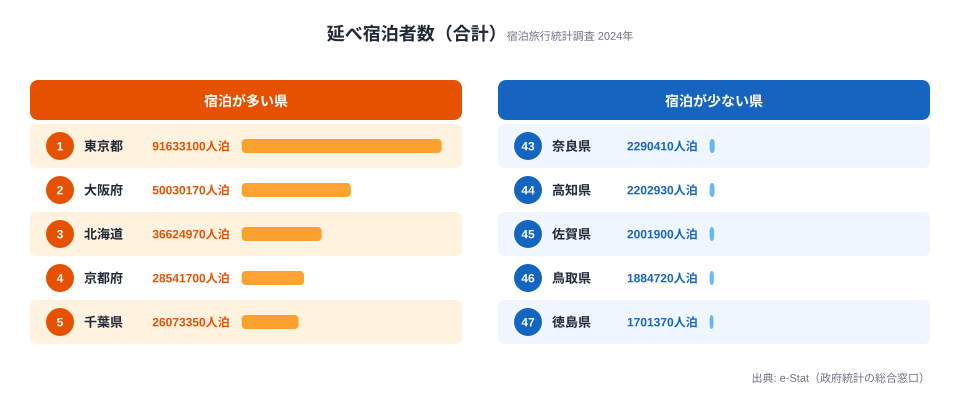
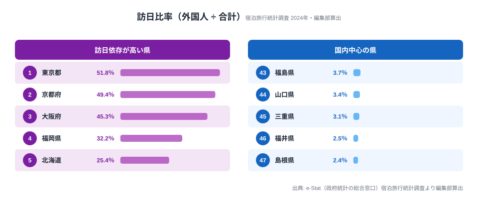

「観光客数」と一口に言っても、宿泊しているのが日本人なのか外国人なのかで、その県の観光産業の性格はガラッと変わります。実際に 2024 年の宿泊旅行統計を開くと、東京都は延べ宿泊者数 9,163 万人泊のうち 4,743 万人泊（51.8%）が訪日外国人で、国内客より外国人客のほうが多いのです。一方で千葉県は成田空港を抱えながら訪日比率 16.7%、島根県にいたっては 2.4% と、ほぼ国内客だけで宿泊が成り立っています。1 つの数字に丸めてしまうと、この差は完全に消えます。

そこで本記事では、観光庁「宿泊旅行統計調査」から **国内宿泊客数** と **訪日外国人宿泊客数** の 2 系列を e-Stat API 経由で取得し、47 都道府県別の **積み上げ棒グラフ** を Claude Code に作らせる手順をまとめます。シリーズ Part 11、扱うチャート種は積み上げ棒、論点は「多系列処理」「d3.stack」「凡例配置」の 3 点です。

このシリーズの過去回は単系列のチャート（棒・ヒートマップ・散布図・レーダー）が中心でしたが、今回からは複数系列が絡みます。データ整形のレシピと、Claude Code への伝え方のコツが少し変わるので、その差分を意識しながら読んでください。

> [!NOTE]
> 本記事の数値は観光庁「宿泊旅行統計調査」2024 年（年間）の確報ベースです。単位は **延べ宿泊者数（人泊）**。「人泊」= 宿泊者数 × 宿泊日数で、1 人が 3 連泊すると 3 人泊と数えます。来訪者の頭数ではないため、リピーターや連泊が多い県ほど値が積み上がる点に注意してください。

## 1. 導入: 観光統計を「一枚」で見る価値

観光統計をニュースで見るとき、よくあるのは「訪日客が過去最高」「国内旅行需要が回復」といった全国合計の話です。ですが現場でデータを使う側からすると、知りたいのは大抵こうした問いです。

- うちの県の観光産業は **国内** で食べているのか、**訪日** で食べているのか
- 隣県と比べて、**訪日依存度** はどのくらい違うのか
- 訪日が落ち込んだとき、**ベースとなる国内客** がどれだけクッションになるか

これは折れ線や単独の棒では一目で読めません。**積み上げ棒** が一番素直で、47 県を横に並べた瞬間に「訪日の帯の割合」が地図のように浮かび上がります。東京・京都・大阪の訪日帯が他県を圧倒し、その隣に「ほぼ国内一色」の地方県が並ぶ、あの絵です。

データ可視化の世界では「stacked bar は比較に向かない」と言われがちで、確かに「2 番目以降のセグメントの絶対値比較」は読みづらいものです。ですが今回のように **合計値の県別比較 + 内訳の割合提示** を同時にやりたいケースでは、積み上げ棒は今もって最強クラスの選択肢になります。

表現方法ごとに向き不向きを整理すると、こう考えると選びやすくなります。

- **単純棒（合計のみ）**: 合計の比較は得意だが内訳が消える。47 県を並べても読みやすい
- **グループ棒（横並び 2 本）**: 内訳は読めるが、47 県だと棒が細くなり崩壊する
- **100% 積み上げ棒**: 比率は読めるが絶対値（観光地としての規模感）が消える
- **絶対値の積み上げ棒**: 合計も内訳も読め、47 県でも成立する ← 本記事の選択
- **折れ線（年次）**: 単年の県別比較には不向き

100% 積み上げ棒（normalized stacked bar）も魅力的なオプションですが、最初の 1 枚としては絶対値の積み上げ棒を推します。観光地としての規模感が消えてしまうと「沖縄と鳥取が同じ高さ」のような見た目になり、誤読の温床になるからです。

実データで規模感を確認しておきましょう。延べ宿泊者数（国内 + 訪日の合計）の都道府県ランキングは下図のとおりです。



東京都が 9,163 万人泊で突出し、大阪府 5,003 万、北海道 3,662 万と続きます。最下位の徳島県は 170 万人泊で、首位とは **53.9 倍** の開きがあります。観光地としての「総量」だけでもこれだけの格差があり、これが積み上げ棒の縦軸の高さを決めます。

<source-link href="/ranking/total-overnight-guests">延べ宿泊者数ランキング（47都道府県・全件）を見る</source-link>

## 2. 使うデータ: 宿泊旅行統計の都道府県別宿泊客数

観光庁の **宿泊旅行統計調査** は、ホテル・旅館・簡易宿所・その他の宿泊施設を対象に、月次で宿泊者数を集計している調査です。e-Stat 上では「観光庁」の調査として登録されており、`statsDataId` を 1 つ叩けば全国 + 47 県 × 国籍区分（日本人 / 外国人）のクロス集計が一気に取れます。

データの粒度は、次のように押さえておけば実装で迷いません。

- **公表元**: 観光庁
- **調査名**: 宿泊旅行統計調査
- **公表頻度**: 月次（速報 → 確報の 2 段階）
- **集計単位**: 都道府県 × 宿泊施設タイプ × 国籍（日本人 / 外国人）
- **単位**: 延べ宿泊者数（人泊）
- **重要な癖**: 「人泊」= 宿泊者数 × 宿泊日数。リピーターや連泊客の効果がそのまま積み上がる

「人泊」ベースである点は実装上も解釈上も効いてきます。観光統計で「観光客数」と言うとき、来訪者の頭数を指す場合と宿泊数を指す場合がありますが、本データは後者です。

### 2-1. 国籍区分の取り方

宿泊旅行統計の `cat02` 軸には「総数 / 日本人 / 外国人」の区分が含まれています。今回欲しいのは以下の 2 系列です。

- **国内宿泊客数** = `cat02 == 日本人`
- **訪日宿泊客数** = `cat02 == 外国人`

総数は「日本人 + 外国人」とほぼ一致しますが、不詳が少し混じります。積み上げ棒では「日本人」と「外国人」だけを足し合わせて見せるほうがクリーンです。総数を別途引いてラベルだけ表示するのもありでしょう。

なお stats47.jp では `延べ宿泊者数（合計）` と `外国人延べ宿泊者数（訪日）` の 2 指標を別々に整備しています。本記事の「国内」は **合計 − 訪日** で算出した値です。

### 2-2. 施設タイプの取り方

`cat01` 軸には「全宿泊施設 / ホテル / 旅館 / 簡易宿所 / その他」のような施設タイプが入ります。今回の積み上げ棒は **施設タイプは「全宿泊施設」固定** で、国籍だけを積み上げます。施設タイプも積み上げると 3 階建ての積み上げになり、Part 11 のスコープを超えるのでやりません。

## 3. Step 1: 2 つの系列を Claude Code に取らせる

ここから手を動かします。最終的にやりたいのは「指定年の 12 か月合計を、47 県 × 2 系列で配列に整形してファイル出力」です。

まず Claude Code に渡す前提を共有します。プロジェクトのセットアップは Part 01 で済んでいるものとして、`packages/estat-api` 経由で API キー読み込みと R2 キャッシュが動く想定です。Part 02 の `/search-estat` スキルで `statsDataId` の候補当たりをつけたあとに、本番取得に進みます。

Claude Code への最初の依頼は、こう書きます。

```text
@.claude/skills/estat/fetch-estat-data/SKILL.md

宿泊旅行統計調査（観光庁）から、2024 年（年間集計）の都道府県別
「全宿泊施設 × 日本人」「全宿泊施設 × 外国人」の延べ宿泊者数を取ってきて、
scripts/tourism/fetch-overnight-2024.ts として書き出して。

要件:
- e-Stat API は packages/estat-api 経由（cdArea / cdTime は使わない）
- 全年・全県を一括取得してメモリでフィルタ
- 出力は data/tourism/overnight-2024.json
- スキーマ:
  { year: 2024, items: [
    { areaCode: "01000", areaName: "北海道", domestic: 12345678, inbound: 234567 },
    ...
  ] }
- 1 県でも欠損があれば warn ログ + nullable で詰める
```

`@` でスキルを直接食わせるのが Part 02 で習った癖です。Claude Code は SKILL.md を読み、e-Stat API の規約（`cdArea` / `cdTimeFrom` を使わない・全件取得してメモリでフィルタ）を勝手に守った形で吐いてくれます。

実行すると、こんな感じのスクリプトが返ってきます。

```typescript
// scripts/tourism/fetch-overnight-2024.ts
import { fetchEstatStats } from "@stats47/estat-api";
import { writeFile, mkdir } from "node:fs/promises";
import { dirname } from "node:path";

const STATS_DATA_ID = "0003445XXX"; // 宿泊旅行統計の確報テーブル
const TARGET_YEAR = "2024";

type OvernightRow = {
  areaCode: string;
  areaName: string;
  domestic: number | null;
  inbound: number | null;
};

async function main() {
  // 全件取得（cdArea / cdTime 指定なし）
  const raw = await fetchEstatStats({
    statsDataId: STATS_DATA_ID,
    cdCat01: "ALL_FACILITIES", // 全宿泊施設
  });

  // 軸を解釈: AREA / TIME / CAT02(日本人・外国人)
  const byPref = new Map<string, OvernightRow>();

  for (const row of raw.values) {
    if (!row.timeCode.startsWith(TARGET_YEAR)) continue;
    const code = row.areaCode;
    if (!byPref.has(code)) {
      byPref.set(code, { areaCode: code, areaName: row.areaName, domestic: 0, inbound: 0 });
    }
    const target = byPref.get(code)!;
    if (row.cat02Code === "JAPANESE") {
      target.domestic = (target.domestic ?? 0) + row.value;
    } else if (row.cat02Code === "FOREIGN") {
      target.inbound = (target.inbound ?? 0) + row.value;
    }
  }

  // 47 県だけに絞る（00000 全国 / 99000 不詳を除く）
  const items = [...byPref.values()]
    .filter((r) => r.areaCode.endsWith("000") && r.areaCode !== "00000")
    .sort((a, b) => a.areaCode.localeCompare(b.areaCode));

  for (const r of items) {
    if (r.domestic == null || r.inbound == null) {
      console.warn(`[warn] missing series at ${r.areaCode} ${r.areaName}`);
    }
  }

  const outPath = "data/tourism/overnight-2024.json";
  await mkdir(dirname(outPath), { recursive: true });
  await writeFile(outPath, JSON.stringify({ year: 2024, items }, null, 2));
  console.log(`[done] wrote ${items.length} rows to ${outPath}`);
}

main().catch((e) => { console.error(e); process.exit(1); });
```

実行コマンドはお馴染みの 1 行です。

```bash
npx tsx scripts/tourism/fetch-overnight-2024.ts
```

API キーは `.env` から読まれる前提で、初回だけ e-Stat にリクエストが走り、2 回目以降は R2 キャッシュにヒットしてミリ秒単位で返ってきます。ここまでで「データを取る」フェーズはおしまいです。e-Stat API そのものの細かい話は Part 01〜03 で散々書いたので深入りしません。

## 4. Step 2: 47 県 × 2 系列 の行列に整形

API レスポンスを保存した `overnight-2024.json` はこんな構造になります（数値はスキーマ例。実値は後述の実データを参照してください）。

```json
{
  "year": 2024,
  "items": [
    { "areaCode": "01000", "areaName": "北海道", "domestic": 27338020, "inbound": 9286950 },
    { "areaCode": "13000", "areaName": "東京都", "domestic": 44200380, "inbound": 47432720 },
    { "areaCode": "26000", "areaName": "京都府", "domestic": 14444650, "inbound": 14097050 },
    { "areaCode": "27000", "areaName": "大阪府", "domestic": 27365690, "inbound": 22664480 },
    { "areaCode": "47000", "areaName": "沖縄県", "domestic": 17715660, "inbound": 4380330 }
  ]
}
```

積み上げ棒に食わせるには、これを **「stack の対象キー（series）」と「行レコード（areaCode 単位）」** の 2 階層に整えます。d3-shape の `d3.stack()` が受け取れる形にしてやるイメージです。

```typescript
// scripts/tourism/build-stack-input.ts
import { readFile, writeFile } from "node:fs/promises";

const SERIES = ["domestic", "inbound"] as const;
type Series = (typeof SERIES)[number];

async function main() {
  const raw = JSON.parse(
    await readFile("data/tourism/overnight-2024.json", "utf-8"),
  ) as { items: Array<{ areaCode: string; areaName: string; domestic: number | null; inbound: number | null }> };

  const rows = raw.items.map((r) => {
    const domestic = r.domestic ?? 0;
    const inbound = r.inbound ?? 0;
    return { areaCode: r.areaCode, areaName: r.areaName, domestic, inbound, total: domestic + inbound };
  });

  // 合計値降順で並び替え（積み上げ棒の常套手段）
  rows.sort((a, b) => b.total - a.total);

  await writeFile(
    "data/tourism/overnight-2024.stack.json",
    JSON.stringify({ series: SERIES, rows }, null, 2),
  );
  console.log(`[done] ${rows.length} rows ready for d3.stack`);
}

main();
```

ここで効いているのが「合計値降順ソート」です。47 県のような多数カテゴリを並べると、五十音順や `areaCode` 順で並べたグラフは「読み手の脳に負荷を強いるだけ」になります。「視覚的に山なりに減っていく」絵にするだけで、読みやすさが体感 2 倍は変わります。

実は Claude Code に「Step 2 の整形スクリプトを書いて。stack 用の `series` キーと `rows` 配列。並びは合計値降順」とだけ伝えれば、上記スクリプトはほぼそのまま出てきます。**意図（並び順、key 名）を文字で伝える** のがコツで、Claude Code は意図を取り違えるよりも「意図がないところを勝手に埋める」ほうがエラー率が高いので、書きすぎても損はありません。

## 5. Step 3: d3.stack で積み上げレイアウト

ここからフロント側です。`packages/visualization/d3` 配下に積み上げ棒コンポーネントが既にあれば再利用、なければ Claude Code に新規生成させます。今回は新規前提で進めます。

Claude Code に投げるプロンプトはこう書きます。

```text
packages/visualization/d3/StackedBarChart.tsx を作成。

要件:
- props: { data: StackInput; width: number; height: number; colors?: Record<Series, string> }
- d3-scale, d3-shape のみ使用（React 側で要素を描画、d3 セレクションは触らない）
- x: scaleBand（areaName）, y: scaleLinear（0 〜 total max）
- d3.stack().keys(series) で積み上げ
- 描画は React 直書き、d3.select はしない
- アクセシビリティ: title 要素で areaName + 各系列の値、role="img"
- ホバー時の tooltip は別 PR でやるので、今は描画のみ
- 単位は「万人泊」に丸める（生値 / 10000、小数 1 桁）
```

返ってくるコンポーネントの肝は「レイアウト計算」の部分です。`d3.stack()` で各系列の上端 / 下端を出し、`scaleLinear` で画面座標に変換します。描画用の座標まで作るヘルパーを切り出すと、レンダリングは素直に書けます。

```typescript
// packages/visualization/d3/build-stack-layout.ts
import { scaleBand, scaleLinear } from "d3-scale";
import { stack } from "d3-shape";
import { max } from "d3-array";

type Series = "domestic" | "inbound";
type Row = { areaCode: string; areaName: string; domestic: number; inbound: number; total: number };
type StackInput = { series: readonly Series[]; rows: Row[] };

const COLORS: Record<Series, string> = {
  domestic: "#0072B2", // 国内（青）
  inbound: "#D55E00", // 訪日（オレンジ）
};

export function buildStackLayout(data: StackInput, innerW: number, innerH: number) {
  const x = scaleBand<string>().domain(data.rows.map((r) => r.areaName)).range([0, innerW]).padding(0.15);
  const yMax = max(data.rows, (r) => r.total) ?? 0;
  const y = scaleLinear().domain([0, yMax]).nice().range([innerH, 0]);

  const layers = stack<Row, Series>()
    .keys([...data.series])
    .value((row, key) => row[key])(data.rows);

  // 各系列 × 各県を「描画可能な矩形」に変換する
  const rects = layers.flatMap((layer) =>
    layer.map((seg, i) => {
      const row = data.rows[i];
      const yTop = y(seg[1]); // 上端
      const yBot = y(seg[0]); // 下端
      return {
        key: layer.key as Series,
        areaName: row.areaName,
        color: COLORS[layer.key as Series],
        x: x(row.areaName) ?? 0,
        y: yTop,
        width: x.bandwidth(),
        height: Math.max(0, yBot - yTop),
        valueLabel: ((seg[1] - seg[0]) / 10000).toFixed(1) + " 万人泊",
      };
    }),
  );

  return { x, y, rects };
}
```

ポイントは 3 つです。

1. `d3.stack()` の戻り値は **3 次元配列** に近い構造で、`layers[seriesIndex][rowIndex] = [y0, y1]` という形になります。`y0` が下端、`y1` が上端で、ここをそのまま `y(seg[0]) - y(seg[1])` で高さに変換します。
2. `d3.select` には触りません。React で d3 を扱うときの鉄則で、レイアウト計算は d3、描画は React の流儀で完結させます。上のように「描画可能な矩形の配列」まで作っておくと、レンダリング側は配列を map するだけで済みます。
3. X 軸ラベルは 47 件入る都合、`rotate(-60)` で縦傾けが現実解です。フォントを 10px まで落とすと収まります。

> [!TIP]
> React で d3 を使うときは「d3 = 計算」「React = 描画」と役割を割り切るのが事故を減らすコツです。上の `buildStackLayout` のように **座標と色まで計算し終えたプレーンな配列** を返すと、レンダリング側は要素を map で並べるだけになり、テストも配列の検証だけで済みます。`d3.select` を React コンポーネント内で呼ぶと仮想 DOM と二重管理になり破綻しやすいので避けてください。

このヘルパーが返す `rects` を React の要素として描画すれば、記事内チャートとして配信できます。本サイトでは静的 SVG の生成パイプラインに載せているため、実際の配信図は次の Step で扱う「訪日比率」の絵で確認できます。

## 6. Step 4: 凡例配置（縦／横、色選び）

ここまでで「正しく積み上がる絵」は出ます。ですが凡例なしの積み上げ棒は **ただの 2 色の塔** で意味不明です。凡例を打つ場所が、地味ですが効きます。

### 6-1. 縦並び vs 横並びの判断軸

凡例の置き場所は、画面幅と系列数で決めると迷いません。

- **モバイル幅（〜768px）**: 縦並び凡例は棒のスペースを圧迫するので、横並びを上部に置く
- **ワイド PC（1280px+）**: 縦並び凡例を右側 or 左側に置くと収まりがよい
- **系列数 5 以上**: 縦並びにしてスクロール可能にすると吉
- **系列数 2-3**: どちらでも成立する

47 県 × 2 系列という今回の構成では、横並び凡例を **棒グラフの上部** に置くのが鉄板です。凡例を見てから棒に視線を落とす、という自然な視線移動になります。

### 6-2. 色の決め方

「国内 = 青、訪日 = オレンジ」をデフォルトにしましたが、これは深い意味があるわけではありません。注意したい原則だけ列挙します。

- **赤を「悪い」と読まれない文脈** か確認します。本記事の訪日客は明らかにポジティブな指標なので暖色でも OK ですが、コロナ禍の文脈なら緑系に振るほうが無難です。
- **色覚多様性対応**。Okabe-Ito パレットや Tableau 10 など、テストされた組合せから選びます。`#0072B2` と `#D55E00` の組合せは色覚多様性下でもコントラストが取れます。
- **背景とのコントラスト 4.5:1 以上**（WCAG AA）。淡すぎる青は要注意です。

Claude Code に色見直しを依頼するときは、こう書くだけで Okabe-Ito を採用してくれます。

```text
StackedBarChart のデフォルトカラーを Okabe-Ito パレットに合わせて。
国内 = '#0072B2'（青）、訪日 = '#D55E00'（オレンジ）。
WCAG AA を満たすか自己チェックも吐いて。
```

凡例 UI 自体は SVG でもいいですし、HTML の `<ul>` でも OK です。アクセシビリティを考えると HTML のほうが楽になります。色見本には `aria-hidden` を振り、ラベルだけスクリーンリーダーに読ませるのも地味に効くテクニックです。

## 7. Step 5: 並び順（合計値降順）と注釈

「並び順」は Step 2 で合計値降順にしましたが、それで終わりではありません。**並び順を変えると別のメッセージが読める** のが積み上げ棒の面白いところです。

### 7-1. 並び替え軸の選択肢

同じデータでも、何で並べるかで読めるストーリーが変わります。

- **合計人泊の降順**: 観光地としての総量ランキング。一般読者向けの最初の 1 枚に最適
- **訪日比率の降順**: 国際観光に依存している県。インバウンド戦略の議論向き
- **訪日絶対値の降順**: 訪日客が集まっている県。自治体プロモ系記事向き
- **国内比率の降順**: 国内市場が太い県。内需を語る記事向き
- **五十音順 / areaCode 順**: 並び順に意味を持たせない。リファレンス用途のみ

ソート関数は別ファイルに切り出しておくと別チャートで使い回せます。

```typescript
type SortKey = "total_desc" | "inbound_ratio_desc" | "inbound_desc" | "domestic_desc";

const COMPARATORS: Record<SortKey, (a: Row, b: Row) => number> = {
  total_desc: (a, b) => b.total - a.total,
  inbound_ratio_desc: (a, b) => b.inbound / Math.max(b.total, 1) - a.inbound / Math.max(a.total, 1),
  inbound_desc: (a, b) => b.inbound - a.inbound,
  domestic_desc: (a, b) => b.domestic - a.domestic,
};

export function sortRows(rows: Row[], key: SortKey): Row[] {
  return [...rows].sort(COMPARATORS[key]);
}
```

「訪日比率の降順」で並べると、規模ランキングとはまったく違う県が頭に来ます。2024 年の実データで算出した訪日比率（外国人 ÷ 合計）の上位 5・下位 5 が下図です。



訪日比率が最も高いのは東京都の 51.8%、次いで京都府 49.4%、大阪府 45.3% と続きます。東京は宿泊の半分以上が外国人客という、国内でも突出した「インバウンド都市」です。逆に最下位は島根県 2.4%、福井県 2.5% で、宿泊のほぼすべてが国内客でした。同じ「観光統計」でも、東京と島根では産業の体温がまるで違うことが読み取れます。

<source-link href="/ranking/total-overnight-guests-foreign">外国人延べ宿泊者数ランキング（47都道府県・全件）を見る</source-link>

> [!WARNING]
> 訪日比率は **絶対量とは無関係** に動きます。京都府は訪日比率 49.4% ですが合計は 4 位で、北海道（比率 25.4%・合計 3 位）より総量は小さいのです。「比率が高い = 観光客が多い」ではない点に注意してください。比率の絵を見せるときは、必ず合計の絵（規模感）とセットで提示すると誤読を防げます。

### 7-2. 注釈をどう載せるか

47 県積み上げ棒は情報量が多いので、3〜5 個の注釈を直接 SVG に焼き付けると一気に読みやすくなります。実データから拾うなら、例えばこうした注釈が候補になります。

- **東京**: 全国一の合計 9,163 万人泊、訪日比率 51.8%（国内 < 訪日）
- **京都**: 訪日比率 49.4%、規模に対して訪日依存が最も濃い
- **沖縄**: 合計 6 位 2,210 万人泊だが訪日比率は 19.8% で意外に国内寄り

注釈の出し方には流派が 2 つあります。SVG の `<g>` に文字とリード線を生で書くか、`d3-annotation` ライブラリを噛ませるかです。47 件中 3〜5 件くらいなら手書きで十分でしょう。データ駆動で生成するなら、`inbound / total > 0.35` のような閾値で自動抽出するロジックを書いてもよいです。手で選ぶか自動かは、記事の編集方針次第になります。

## 8. つまずきポイント（系列順、対数スケール、業態差）

ここからは「やってみるとハマる」典型例 3 つです。本記事の最重要セクションになります。Claude Code が綺麗な絵を返してきても、これらを知らないと誤読を量産します。

### 8-1. 系列順 = 視覚的重要度

積み上げ棒では **下に置いた系列のほうが視覚的に基準化されやすい** という性質があります。今回「下: 国内、上: 訪日」にしたのは、次の理由からです。

- 国内のほうが多くの県で量が大きく、土台として安定している
- 訪日が「上に積まれる差分」として読みやすい

これを逆にすると、「訪日の絶対値（下段）」と「国内の絶対値」が両方読みづらくなります（上段の値は `y1 - y0` を脳内で計算する必要が生じます）。ルール of thumb は **「量が多くて変動が少ない系列を下に置く」** で、テンプレ的にはこれで困りません。Claude Code に伝えるときは、こう書きます。

```text
d3.stack のキー順は ["domestic", "inbound"] 固定で。
domestic を下、inbound を上に積む。順序を逆にしてはいけない。
```

「順序を逆にしてはいけない」と禁止形まで書くのが大事です。Claude Code は「より一般的な順序」へ勝手に直してしまうことがあります（特に `alphabetical` 系の癖）。

> [!WARNING]
> 東京は今回のデータでは訪日（4,743 万）が国内（4,420 万）を上回る、唯一に近い県です。「量が多くて変動が少ない系列を下に」というルールに従うと、本来は国内を下に固定すべきですが、東京だけ見れば訪日のほうが多くなります。それでも **47 県全体で系列順を揃える** のが原則です。県ごとに上下を入れ替えると、隣の県と比較できなくなり積み上げ棒の意味が消えます。

### 8-2. 対数スケールに逃げない

「東京・大阪が大きすぎて他の県の差が読めない」と感じると、つい `scaleLog` に逃げたくなります。ですが **積み上げ棒で対数スケールはやってはいけません。**

理由はシンプルで、対数スケールでは **足し算が成立しない** からです。`log(a) + log(b) != log(a + b)` なので、下段と上段の高さを合計しても全体の値にならず、視覚的に意味のない図になります。差を強調したいときは、次のいずれかが正攻法です。

- **横軸を絞る**（上位 20 県だけ表示する、地方別に分割する）
- **小倍数（small multiples）** に切り替える
- **チャートを差し替える**（散布図 / ドットプロット）

Part 6 でやった散布図と組合せると、「合計 × 訪日比率」の 2 軸散布図でハイライトを変えるアプローチも有効です。

### 8-3. ホテル / 旅館の業態差

宿泊旅行統計の「全宿泊施設」には、ホテル・旅館・簡易宿所・その他（民泊含む）が混ざります。県別の数字を比べるときに知っておきたい癖があります。

- **シティホテル**: 訪日比率が高い。東京・大阪・名古屋に偏在
- **リゾートホテル**: 国内・訪日の両方が厚い。沖縄・北海道・京都に偏在
- **旅館**: 国内比率が非常に高い。静岡（熱海）・群馬（草津）・大分（湯布院）に偏在
- **簡易宿所**: 訪日比率がムラがある。京都（町家民泊が多い）に偏在

積み上げ棒で「東京と京都の訪日比率が同じくらい（東京 51.8% / 京都 49.4%）」と読めても、中身は **東京がシティホテル、京都が町家民泊と旅館の和ホテル化** だったりして、観光産業構造はかなり違います。読者が誤読しないよう、本文側で 1 行注釈を入れておくと親切でしょう。「業態別の積み上げ」を本気でやるなら、**業態 × 国籍** の二重積み上げになります。これは Part 14 あたりで扱う予定です。

### 8-4. （おまけ）速報値と確報値の取り違え

宿泊旅行統計は **速報** と **確報** が別 `statsDataId` で公開されます。年次集計を出すなら確報を待つのが王道です。`/search-estat` で `statsDataId` を引いたとき、両方ヒットする月があり、Claude Code が速報を選んでしまうことがあります。

```text
検索結果から速報（preliminary）でなく確報（confirmed）の statsDataId を選んで。
公表時期が遅い方が確報。
```

と添えておくのが安全です。

## 9. 次回予告（Part 12: ツリーマップ）

次回は **ツリーマップ** をやります。同じ観光データを別の角度から見るのに便利で、「県 → 業態」のように 2 階層を一望できます。今回の積み上げ棒で「東京の訪日比率が高い」とわかった次は、「東京の訪日のうちホテルと民泊と旅館の比率は？」を 1 枚で見せる、というストーリー設計です。

Claude Code で `d3.treemap()` を扱うコツと、ツリーマップ特有の「ラベル配置が地獄」問題への対処を書く予定です。観光統計は系列数が多いので、可視化の練習材料として極めて優秀です。シリーズの構成は次のように進みます。

- **Part 11（本記事）**: 積み上げ棒 — 観光客の国内 / 訪日
- **Part 12**: ツリーマップ — 業態 × 国籍の階層
- **Part 13**: サンキー — 出発地県 → 到着地県の流動
- **Part 14**: 二重積み上げ棒 — 業態 × 国籍の同時提示

地域全体の観光プロフィールを横断的に見たいときは、[観光カテゴリの一覧](https://stats47.jp/category/tourism)や、訪日依存度が対照的な[沖縄県の観光プロフィール](https://stats47.jp/areas/47000)・[京都府の観光プロフィール](https://stats47.jp/areas/26000)も合わせて眺めると、本記事のデータが立体的に読めます。シリーズの過去回は [Part 01: セットアップ](https://stats47.jp/blog/cc-estat-01-setup)・[Part 03: 人口の棒グラフ](https://stats47.jp/blog/cc-estat-03-population-bar)・[Part 06: 所得と物価の散布図](https://stats47.jp/blog/cc-estat-06-income-scatter) から読み返せます。

---

**まとめ**

- 観光統計は「国内」と「訪日」を分けないと県別の本性が見えない（東京は訪日 51.8% でほぼ半分が外国人客、島根は 2.4%）
- e-Stat API は `cat02` 軸で日本人 / 外国人を分離取得でき、国内は「合計 − 訪日」で算出できる
- 多系列処理は **stack 入力に整える整形ステップ** を 1 段挟むだけで Claude Code に投げやすくなる
- 並び順（合計降順 / 訪日比率降順）、凡例配置、系列順は「読み手の理解速度」を直接決める
- 対数スケールは積み上げ棒では使わない（足し算が壊れる）

次回 Part 12 のツリーマップで会いましょう。

## データ出典

- 観光庁「宿泊旅行統計調査」2024 年（年間・確報）。e-Stat（政府統計の総合窓口）経由で整備。
- 「訪日比率」は外国人延べ宿泊者数 ÷ 延べ宿泊者数合計 × 100 で編集部が算出した派生値です。
