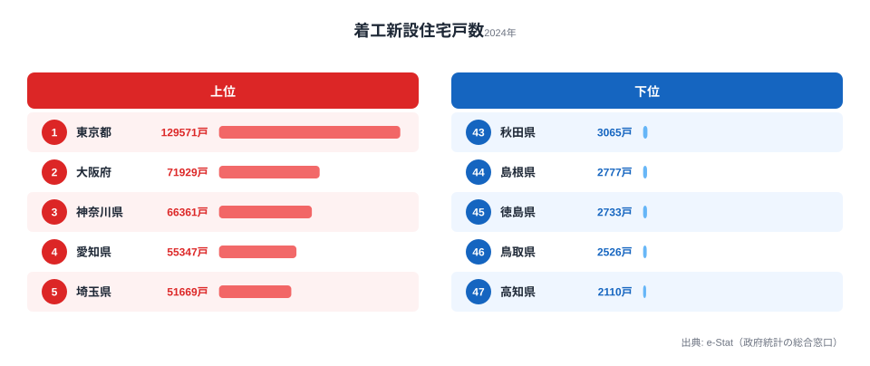

「47 都道府県のデータを 1 枚の絵に押し込む」というお題は、ランキング系の棒グラフが定番です。が、これを **地域ブロック（北海道・東北・関東…）でグルーピングして、さらに持家／貸家／分譲の内訳まで一気に見せたい** と思うと、棒では足りなくなります。並べる軸が 3 つになるからです。

そんなときに刺さるのが **ツリーマップ（treemap）** です。長方形の面積が値を表し、その長方形を入れ子状に並べることで、**「全体の量」と「内訳構成」を 1 枚で同時に表現できる** 数少ない手法。Excel の積み上げ棒だと泣きたくなるレイヤー数を、ツリーマップは涼しい顔で処理します。

本記事はシリーズ「Claude Code × e-Stat API 実例集」の Part 12 です。前回の [Part 11 では観光客数の積み上げ棒](/blog/cc-estat-11-tourism-stacked) を扱いましたが、今回はテーマを変えて **住宅着工統計** を題材に、`d3.hierarchy` + `d3.treemap` の使い方を Claude Code 越しに学びます。前提知識は「ターミナルで `node` が動く」「`npm install` が通る」程度で十分です。

筆者は[stats47.jp](https://stats47.jp/)を 1 人で運営しており、サイト上のチャートはほぼ全て D3.js + Claude Code で生成しています。本記事のコードは実サイトで動いているものを教材向けに最小化したもので、コピペでそのまま動きます。


## 本記事のゴールと完成イメージ

最初にゴールを共有します。

- **入力**: 国土交通省「住宅着工統計」の都道府県別・利用関係別（持家／貸家／分譲）の着工戸数（最新年度）
- **処理**: Claude Code に自然言語で指示し、データ取得 →「地域ブロック → 都道府県 → 着工種別」の 3 階層 JSON へ整形 → `d3.treemap` で SVG 描画
- **出力**: 地域ブロックで色分けされた 1 枚のツリーマップ（`treemap.svg`）

処理の流れはシンプルで、**e-Stat API で住宅着工統計を取得 → 「地域ブロック → 都道府県 → 着工種別」の 3 階層 JSON へ整形 → `d3.treemap` で SVG 描画** の 3 ステップを、Claude Code との 1 セッションで完結させます。ターミナルから `node generate.mjs` を 1 回叩くと SVG が落ちてくる、というシンプル構成です。Next.js などフレームワークは使いません。シリーズ Part 3 以降と同じ最小依存構成です。

教材の前提条件は次のとおりです。

- **データ**: 住宅着工統計（国土交通省）
- **期間**: 最新年度（1 年分）
- **集計軸**: 都道府県 × 利用関係（持家 / 貸家 / 分譲住宅）
- **描画ライブラリ**: D3.js（`d3-hierarchy` + `d3-scale`）
- **出力形式**: SVG（1200 × 800px）

着工統計を選んだ理由は単純で、**「ブロック × 県 × 種別」の 3 階層が自然に揃う数少ない指標** だからです。人口や所得は階層化しにくい（県の中の更なる細分が地域差で揃わない）のに対し、着工は全国で利用関係区分が同じなので、ツリーマップに乗せやすいのです。教材として優秀な被写体だと言えます。

> [!NOTE]
> ここで言う「3 階層が揃う」とは、すべての都道府県で同じ利用関係区分（持家／貸家／分譲）が定義されている、という意味です。県ごとに内訳の軸がバラバラだと `d3.hierarchy` の木が非対称になり、面積比較の意味が壊れます。ツリーマップに乗せる指標は「どの枝も同じ深さ・同じ区分」を満たすものを選んでください。


## 使うデータ｜住宅着工統計（持家／貸家／分譲）

住宅着工統計は、国土交通省が **毎月** 公表している建設業統計の基幹データの 1 つです。住宅 1 戸ごとに「いつ・どこで・どんな種別の建物が・誰の所有として」着工されたかを集計しており、不動産・建設・自治体財政の分析でほぼ必ず出てきます。

e-Stat 上では、たとえば以下のような `statsDataId` 系で公開されています（年次表）。

```text
statsDataId 例: 0003225900 系（住宅着工統計 / 利用関係別）
カテゴリ: 持家 / 貸家 / 給与住宅 / 分譲住宅
地域: 47 都道府県（全国・地方別の合計を含む）
時間軸: 年度 or 暦年
```

注意点として、`statsDataId` は **更新のたびに新しい番号が振られる** ことがあります。本番運用では Part 2 で扱った [search-estat スキル](/blog/cc-estat-02-search-skill) で最新の ID を都度引き直すのが安全です。本記事のサンプルコードでは `STATS_DATA_ID` を環境変数化しておきます。

利用関係の 4 区分のうち、本記事では **持家 / 貸家 / 分譲住宅** の 3 区分のみを使います。給与住宅（社宅）は全国で年間数千戸しか着工されず、ツリーマップ上の矩形がほぼ見えなくなるので除外します。「全部入れる」より「読める粒度で残す」のがツリーマップを成功させる最大のコツです。

### 地域ブロックの 8 区分

ツリーマップ最上位の階層には、以下の **8 地域ブロック** を使います。総務省統計局や経産省の地域区分とは流儀がいくつかありますが、本記事では一般的な 8 区分を採用します。

- **北海道**: 北海道
- **東北**: 青森 / 岩手 / 宮城 / 秋田 / 山形 / 福島
- **関東**: 茨城 / 栃木 / 群馬 / 埼玉 / 千葉 / 東京 / 神奈川
- **中部**: 新潟 / 富山 / 石川 / 福井 / 山梨 / 長野 / 岐阜 / 静岡 / 愛知
- **近畿**: 三重 / 滋賀 / 京都 / 大阪 / 兵庫 / 奈良 / 和歌山
- **中国**: 鳥取 / 島根 / 岡山 / 広島 / 山口
- **四国**: 徳島 / 香川 / 愛媛 / 高知
- **九州・沖縄**: 福岡 / 佐賀 / 長崎 / 熊本 / 大分 / 宮崎 / 鹿児島 / 沖縄

新潟・三重・山梨あたりは「どのブロックに入れるか」で流派が分かれます。本記事では国土交通省の公式区分に寄せた 8 区分にしましたが、自分のサイトに合わせて読み替えても問題ありません。地域ブロックの定義は **最初に 1 箇所で定数化しておく** ことだけ意識してください（後でクライアントに「やっぱり中部に山梨入れて」と言われても 1 行で済みます）。


## Step 1: Claude Code に「住宅着工データ取得」を頼む

ここから実装に入ります。Claude Code への最初の依頼はこれだけで OK です。

```text
e-Stat API の住宅着工統計（statsDataId は環境変数 STATS_DATA_ID）から、
最新年度の都道府県別 × 利用関係別（持家 / 貸家 / 分譲）の着工戸数を取得して、
flat な JSON 配列で出力する Node.js スクリプトを書いてください。

要件:
- ESM (.mjs)
- 出力ファイル: housing_raw.json
- 各レコード: { areaCode, areaName, kind: "持家"|"貸家"|"分譲", value: number }
- API キーは process.env.ESTAT_APP_ID から
- cdArea / cdTime は付けない（全件取って後でフィルタ）
```

`cdArea` / `cdTime` を付けない方針はシリーズ通しての約束です。理由は Part 3 でも書きましたが、簡単に言えば **「キャッシュキーをずらさない」「47 県を毎回 1 リクエストで取る方が結局速い」** の 2 点。本サイトの `.claude/rules/estat-api.md` に同じ規約を書いています。

Claude Code が吐くスクリプトはおおむね以下のような形になるはずです。実際に動くサンプルとして掲載します。

```javascript
// fetch_housing.mjs
import fs from "node:fs/promises";

const APP_ID = process.env.ESTAT_APP_ID;
const STATS_ID = process.env.STATS_DATA_ID;

if (!APP_ID || !STATS_ID) {
  throw new Error("ESTAT_APP_ID と STATS_DATA_ID を環境変数で渡してください");
}

const url = new URL("https://api.e-stat.go.jp/rest/3.0/app/json/getStatsData");
url.searchParams.set("appId", APP_ID);
url.searchParams.set("statsDataId", STATS_ID);
url.searchParams.set("limit", "100000");

const res = await fetch(url);
const json = await res.json();

const values = json.GET_STATS_DATA.STATISTICAL_DATA.DATA_INF.VALUE;
const classObj = json.GET_STATS_DATA.STATISTICAL_DATA.CLASS_INF.CLASS_OBJ;

// メタ情報から「area」「time」「利用関係」のコード ↔ ラベルマップを作る
const buildMap = (id) => {
  const obj = classObj.find((o) => o["@id"] === id);
  const list = Array.isArray(obj.CLASS) ? obj.CLASS : [obj.CLASS];
  return Object.fromEntries(list.map((c) => [c["@code"], c["@name"]]));
};

const areaMap = buildMap("area");
const timeMap = buildMap("time");
const kindMap = buildMap("cat01"); // 利用関係 (持家 / 貸家 / 給与 / 分譲)

// 最新時点コードを抽出
const latestTime = Object.keys(timeMap).sort().at(-1);

// 都道府県（5 桁コード末尾が "000"）かつ持家 / 貸家 / 分譲のみ
const KIND_WANTED = new Set(["持家", "貸家", "分譲住宅"]);

const records = values
  .filter((v) => v["@time"] === latestTime)
  .filter((v) => /^\d{2}000$/.test(v["@area"]))
  .filter((v) => v["@area"] !== "00000") // 全国合計を除外
  .filter((v) => KIND_WANTED.has(kindMap[v["@cat01"]]))
  .map((v) => ({
    areaCode: v["@area"],
    areaName: areaMap[v["@area"]],
    kind: kindMap[v["@cat01"]] === "分譲住宅" ? "分譲" : kindMap[v["@cat01"]],
    value: Number(v["$"]),
  }));

await fs.writeFile("housing_raw.json", JSON.stringify(records, null, 2));
console.log(`Wrote housing_raw.json (${records.length} records)`);
```

実行するとこう動きます。

```bash
export ESTAT_APP_ID=xxxxxxxxxxxxxxxxxxxxxxxxxxxxxxxx
export STATS_DATA_ID=0003225900   # 例。最新 ID は search-estat で確認
node fetch_housing.mjs
# → Wrote housing_raw.json (141 records)
```

47 県 × 3 種別 = 141 件の flat な配列が `housing_raw.json` に書き出されます。ここまでが Step 1。**実 API を叩く前に、まず flat な JSON を 1 つ作る** のがコツです。後段の階層整形・描画はこの flat JSON だけ見ればよくなり、API のレスポンス構造を毎回考えなくて済みます。


## Step 2: 地域ブロック → 県 → 種別 の 3 階層 JSON に整形

flat な配列を、`d3.hierarchy` が食える **入れ子の階層構造** に変換します。Claude Code へのお願いはこれくらいで通ります。

```text
housing_raw.json を、地域ブロック → 都道府県 → 着工種別 の 3 階層 JSON に
変換するスクリプトを書いてください。

- 出力ファイル: housing_tree.json
- ルートは { name: "全国", children: [...] }
- 葉ノード（種別レベル）は { name: "持家", value: 12345 }
- 中間ノードは { name: "...", children: [...] }（value は持たない）
- 地域ブロックの定義はスクリプト上部で定数化
```

定数化されたブロック定義を最初に作っておくのがポイントです。これがないと「中部に山梨を入れるか問題」で揉めたときに、複数箇所を直すハメになります。

```javascript
// build_tree.mjs
import fs from "node:fs/promises";

const BLOCKS = {
  北海道: ["01000"],
  東北: ["02000", "03000", "04000", "05000", "06000", "07000"],
  関東: ["08000", "09000", "10000", "11000", "12000", "13000", "14000"],
  中部: [
    "15000", "16000", "17000", "18000",
    "19000", "20000", "21000", "22000", "23000",
  ],
  近畿: ["24000", "25000", "26000", "27000", "28000", "29000", "30000"],
  中国: ["31000", "32000", "33000", "34000", "35000"],
  四国: ["36000", "37000", "38000", "39000"],
  "九州・沖縄": [
    "40000", "41000", "42000", "43000",
    "44000", "45000", "46000", "47000",
  ],
};

const areaToBlock = {};
for (const [block, codes] of Object.entries(BLOCKS)) {
  for (const c of codes) areaToBlock[c] = block;
}

const raw = JSON.parse(await fs.readFile("housing_raw.json", "utf8"));

// { ブロック: { 県: { 種別: value } } } の素朴な集計
const acc = {};
for (const r of raw) {
  const block = areaToBlock[r.areaCode];
  if (!block) continue; // 全国合計や地方合計など
  acc[block] ??= {};
  acc[block][r.areaName] ??= {};
  acc[block][r.areaName][r.kind] = r.value;
}

// 入れ子配列にして d3.hierarchy 用に
const tree = {
  name: "全国",
  children: Object.entries(acc).map(([block, prefs]) => ({
    name: block,
    children: Object.entries(prefs).map(([pref, kinds]) => ({
      name: pref,
      children: Object.entries(kinds).map(([kind, value]) => ({
        name: kind,
        value,
      })),
    })),
  })),
};

await fs.writeFile("housing_tree.json", JSON.stringify(tree, null, 2));
console.log(`Wrote housing_tree.json`);
```

実行後の `housing_tree.json` はこんな構造になります（抜粋）。

```json
{
  "name": "全国",
  "children": [
    {
      "name": "関東",
      "children": [
        {
          "name": "東京都",
          "children": [
            { "name": "持家", "value": 11842 },
            { "name": "貸家", "value": 42115 },
            { "name": "分譲", "value": 28903 }
          ]
        },
        {
          "name": "神奈川県",
          "children": [
            { "name": "持家", "value": 14021 },
            { "name": "貸家", "value": 22845 },
            { "name": "分譲", "value": 16238 }
          ]
        }
      ]
    }
  ]
}
```

ここで重要なのは、**中間ノード（ブロック / 県）に `value` を持たせないこと** です。`d3.hierarchy` は `sum()` で **下から積み上げる前提** で動くので、中間に値があると二重計上の原因になります。Claude Code が気を利かせて勝手に `value` を埋めることもあるので、レビュー時に「中間ノードに value がないか」だけは目視確認してください。これがバグの 9 割を占めます。

整形後のデータの妥当性は、Claude Code に **「全国合計と入れ子の総和を突合せよ」** とお願いすれば一発で検証できます。

```text
housing_raw.json の全レコード合計と、
housing_tree.json を d3.hierarchy + sum で集計した root.value が
一致するか確認するスクリプトを書いてください。
```

合計が一致したら次に進みます。一致しなかったら大抵は「全国行を除外し忘れ」「給与住宅の除外漏れ」「同じ県が複数ブロックに入っている」のどれかです。


## Step 3: d3.hierarchy + d3.treemap でレイアウト

いよいよ描画です。`d3-hierarchy` と `d3-scale` だけ追加します。

```bash
npm init -y
npm install d3-hierarchy d3-scale
```

ツリーマップ描画のコアは 60 行程度に収まります。

```javascript
// generate.mjs
import fs from "node:fs/promises";
import { hierarchy, treemap, treemapSquarify } from "d3-hierarchy";
import { scaleOrdinal } from "d3-scale";

const W = 1200;
const H = 800;
const PADDING_OUTER = 4;
const PADDING_TOP = 22;   // ブロック名を入れる帯の高さ
const PADDING_INNER = 2;

const data = JSON.parse(await fs.readFile("housing_tree.json", "utf8"));

const root = hierarchy(data)
  .sum((d) => d.value ?? 0)         // 葉の value を下から積み上げ
  .sort((a, b) => b.value - a.value);

treemap()
  .tile(treemapSquarify.ratio(1.4))  // 黄金比寄りで矩形を正方形に近づける
  .size([W, H])
  .paddingOuter(PADDING_OUTER)
  .paddingTop(PADDING_TOP)
  .paddingInner(PADDING_INNER)
  .round(true)(root);

// 地域ブロックごとの色（ブロック名 → 基本色）
const blockColor = scaleOrdinal()
  .domain([
    "北海道", "東北", "関東", "中部",
    "近畿", "中国", "四国", "九州・沖縄",
  ])
  .range([
    "#3b82f6", "#10b981", "#ef4444", "#f59e0b",
    "#8b5cf6", "#06b6d4", "#ec4899", "#84cc16",
  ]);

// 種別ごとの明度差（持家=濃 / 貸家=中 / 分譲=淡）
const kindShade = { 持家: 0.85, 貸家: 1.0, 分譲: 1.15 };

// HSL 風に明度を調整する簡易関数（本番は d3-color の lab() を使ってもよい）
const tint = (hex, factor) => {
  const num = parseInt(hex.slice(1), 16);
  const r = Math.min(255, Math.round(((num >> 16) & 255) * factor));
  const g = Math.min(255, Math.round(((num >> 8) & 255) * factor));
  const b = Math.min(255, Math.round((num & 255) * factor));
  return `rgb(${r}, ${g}, ${b})`;
};

const leaves = root.leaves();

const SVG_NS = "http://www.w3.org/2000/svg";
const openTag = (tag, attrs) =>
  `<${tag} ${attrs}>`; // タグ名を変数化（記事埋め込み時のサニタイズ対策）
const svgOpen = openTag(
  "svg",
  `xmlns="${SVG_NS}" viewBox="0 0 ${W} ${H}" font-family="sans-serif"`,
);

const svg = `<?xml version="1.0" encoding="UTF-8"?>
${svgOpen}
  ${leaves
    .map((node) => {
      const block = node.ancestors().find((a) => a.depth === 1)?.data.name;
      const pref = node.parent.data.name;
      const kind = node.data.name;
      const color = tint(blockColor(block), kindShade[kind] ?? 1);
      const w = node.x1 - node.x0;
      const h = node.y1 - node.y0;
      const showLabel = w > 60 && h > 24;
      return `
        <g transform="translate(${node.x0},${node.y0})">
          <rect width="${w}" height="${h}" fill="${color}" stroke="white" stroke-width="0.5"/>
          ${showLabel
            ? `<text x="6" y="14" font-size="11" fill="#0f172a">${pref}</text>
               <text x="6" y="28" font-size="10" fill="#1e293b" opacity="0.7">${kind} ${node.value.toLocaleString()}</text>`
            : ""}
        </g>`;
    })
    .join("")}
</svg>`;

await fs.writeFile("treemap.svg", svg);
console.log("Wrote treemap.svg");
```

`tile(treemapSquarify.ratio(1.4))` を指定しているのは、デフォルトの `treemapSquarify`（黄金比 = 1.618）よりやや正方形寄りにして、東京や大阪の「貸家」のような大きな矩形が縦長すぎないようにするためです。1.0 にすると完全な正方形寄りになりますが、その分、隣接矩形の面積比較がしにくくなるトレードオフがあります。1.2〜1.6 の間で好みに合わせて調整してください。

`paddingTop(22)` はブロック名（中間ノード）を描く帯のための空きスペースです。次の Step 4 でここにラベルを入れます。

実行するとこうなります。

```bash
node generate.mjs
# → Wrote treemap.svg
open treemap.svg     # macOS。Linux は xdg-open、Windows は start
```

ブラウザで開くと、地域ブロックごとに区分けされ、その中に都道府県の矩形が、さらに県の中に持家／貸家／分譲の小矩形が入った 3 階層が見えます。

### 矩形の大きさは「実データの偏り」をそのまま映す

ツリーマップの矩形面積はデータの値そのものなので、描いてみると東京や大阪の矩形だけが画面を覆い、地方の県は線のように細くなります。これは描画のバグではなく、新設住宅着工がそれだけ大都市圏に偏っているという事実の反映です。stats47.jp で集計した 2024 年度の都道府県別・新設住宅着工戸数は、まさにこの偏りを示しています。



1 位の東京都が 129,571 戸で、最下位の高知県 2,110 戸とは **61.4 倍** もの開きがあります。上位は東京・大阪・神奈川・愛知・埼玉と三大都市圏が独占し、下位は高知・鳥取・徳島・島根・秋田と人口の少ない地方県が並びます。ツリーマップでこのデータを描くと、上位 5 県だけで全国の過半を占める「面積の暴力」が一目で伝わります。だからこそ「読めない小矩形は割愛する」という後述の割り切りが必要になるわけです。

<source-link href="/ranking/new-housing-starts">新設住宅着工戸数の全国ランキングをもっと見る</source-link>

> [!WARNING]
> このツリーマップは「戸数の絶対量」を描いており、人口や世帯数で割った 1 戸あたりの着工密度ではありません。東京が突出するのは人口が多いからで、「東京が最も活発に建てている」という解釈は誤りです。人口あたりに直すと順位は大きく入れ替わるので、量の地図と密度の地図は別物として扱ってください。


## Step 4: 色分け｜ブロックは色相、種別は明度

ツリーマップは「色のチャネル」をどう使うかで読みやすさが激変します。本記事では以下の役割分担にしています。

- **色相（hue）= 地域ブロック**（北海道 / 東北 / …）。8 ブロックなら色相での区別が現実的です
- **明度（lightness）= 着工種別**（持家 / 貸家 / 分譲）。同じブロック内の 3 種別をグラデーションで連続表現します
- **面積 = 着工戸数**。これがツリーマップ本来の主軸です

色相で「県」を分けようとすると 47 色必要になって破綻するので、**県は色を割り振らず、ブロック共通の色で塗る** のが現実解です。「東京の貸家」と「神奈川の貸家」は色は同じだが面積で大きさを比較する、という設計になります。

明度差は `kindShade` の値（0.85 / 1.0 / 1.15）で表現しています。あえて HSL ではなく RGB をスカラ倍する素朴実装にしているのは、Claude Code が一発で出してくれる範囲のコード量に抑えるためです。本番運用では `d3-color` の `lab()` で `l` だけ動かす方が知覚的に均一になります。

色は最低限以下の制約を満たすようにしてください。

- ブロック間: 隣接ブロックが補色 / 類似色にならないよう調整（北海道=青 / 東北=緑 / 関東=赤 がデフォルト推奨）
- 種別間: 同一色相のまま明度のみ 3 段階。彩度は触らない
- コントラスト: 文字色 `#0f172a` 上で読めるよう、最暗で `lightness >= 0.45` を確保

`viridis` や `magma` のような連続カラースケールを使いたくなりますが、ツリーマップでは **カテゴリ間の境界を強調する離散スケールの方が読みやすい** です。stats47 の他のチャート（コロプレス・ヒートマップ）と同じ感覚で連続スケールを当てると失敗します。


## Step 5: ラベル配置｜小領域はトーピング（諦め）

ツリーマップ最大の運用上の悩みが **「ちっちゃい矩形にラベルが入らない」** 問題です。鳥取の分譲（数百戸）と東京の貸家（数万戸）が同じ画面に並ぶので、両方読めるようにラベルを置くのは原理的に不可能。

Claude Code に「全部の矩形にラベルを入れて」と頼むと真面目に全部書いてくれますが、結果は文字が重なって地獄絵図になります。**「読めない矩形にはラベルを書かない」のが正解** です。

実装上は、矩形の幅・高さで閾値を切ります。

```javascript
const showLabel = w > 60 && h > 24;
```

これ以下の領域は **トルツメ（無記載のまま放置）** にします。ユーザーはマウスホバーで詳細を見るか、別のサマリ表で確認する、という割り切りです。本サイトでは別途、地域ブロック単位のサマリ表をツリーマップの下に添えるパターンが定番化しています。

ブロック名（中間ノード）のラベルは、`paddingTop` で確保した帯に別途描きます。

```javascript
const internalNodes = root.descendants().filter((n) => n.depth === 1);

const blockLabels = internalNodes
  .map((node) => {
    const w = node.x1 - node.x0;
    return `
      <g transform="translate(${node.x0},${node.y0})">
        <rect width="${w}" height="${PADDING_TOP}" fill="white" opacity="0.85"/>
        <text x="6" y="15" font-size="12" font-weight="bold" fill="#0f172a">
          ${node.data.name}（${node.value.toLocaleString()} 戸）
        </text>
      </g>`;
  })
  .join("");
```

これを `svgOpen` 直後の `leaves.map(...)` の **後ろ** に連結すれば、葉の上にブロック名が浮かびます。SVG は後勝ちなので、順序は必ず葉 → ブロック名の順にしてください。

フォントサイズは以下を目安にしてください。

- **ブロック名**: 12px / bold。地域全体の量を示します
- **県名**: 11px / regular。矩形内の左上に置きます
- **種別＋数値**: 10px / 70% 不透明。県名の下に置きます

これ以上小さくすると、Retina ディスプレイ前提でも厳しくなります。読めない情報をしまい込むより、最初から「見えない領域は割愛」と決めてしまった方が情報設計として誠実です。


## つまずきポイント 3 選

実装中によく踏むトラップを 3 つだけ共有します。Claude Code に「これ、合計合わないんだけど」と聞き返す前に、まずここを疑ってください。

### 1. 合計値の不一致（中間ノードに value が入っている）

`d3.hierarchy(...).sum((d) => d.value)` は **すべてのノードに対して** コールバックを呼び、自分の `value` + 子の合計を加算します。中間ノード（ブロック / 県）に `value: 0` ですら入っていると正しく集計されますが、`value: 123` のように整形ミスで残っていると **二重計上** になります。

対策は 2 つ。

- `build_tree.mjs` 側で中間ノードに `value` を絶対に入れない
- `sum((d) => d.value ?? 0)` で undefined を 0 に倒す

両方やっておくのが安全です。Claude Code に整形を頼むと、たまに「親ノードに合計を入れときましたよ」と気を利かせてくれるので、生成物の `JSON.stringify` を見て中間ノードに `value` がないか確認してください。

### 2. ゼロ値や負値の矩形

着工統計で値 0 はあまり出ませんが、年度途中の暫定値や、給与住宅のような少数派区分を残すと **「ほぼ 0」の矩形** が爆発的な数で並んでパフォーマンスが悪化します。

`d3.treemap` は値が 0 の矩形を「面積 0」で配置しようとしますが、`paddingInner` の関係で **負の幅** になることがあり、`<rect width="-3">` のようなエッジケースで SVG が描画されません。

対策は **葉ノード生成時に value <= 0 を除外** すること。本記事では給与住宅を最初から除外しているのでこの問題に当たりませんが、別の指標で試すときは要注意です。

### 3. フォントサイズ vs 矩形サイズの閾値ミス

`showLabel = w > 60 && h > 24` の値は経験則です。本サイトでは 1200×800px のツリーマップでこの値に落ち着いていますが、出力サイズを変えると当然調整が必要です。

雑な目安として、**「県名 + 種別を 2 行で書ける最小矩形」** を意識します。フォント 11px × 県名の最長文字数（「神奈川県」= 4 文字 ≈ 44px）+ 余白 16px ≈ 60px がだいたいの下限。これより小さい矩形は無記名にして、ホバーや別表で補う設計にしてください。


## まとめ：3 軸データを 1 枚で見せたいときの第一選択

ツリーマップは「全体の量 × グルーピング × 内訳」の 3 軸を 1 枚で押し込める、希少な可視化手法です。データさえ階層構造に整形できれば、`d3-hierarchy` + `d3-treemap` の組み合わせで 60 行以内で描けます。Claude Code に頼むときのコツは以下のとおり。

1. flat な JSON を先に作る（API レスポンスを直接いじらない）
2. 階層化は「中間ノードに value を入れない」だけ厳守
3. 色は「色相 = カテゴリ」「明度 = サブカテゴリ」の 2 段運用
4. ラベルは「読めない矩形は諦める」のが正解
5. 合計値の突合スクリプトを最後に必ず走らせる

シリーズ次回の [Part 13 ではサンキー図（Sankey Diagram）](/blog/cc-estat-13-agri-sankey) を扱う予定です。県間の人口移動や、産業間の取引フローのような「フロー量」を可視化する手法で、ツリーマップが「量と内訳」なのに対し、サンキーは「流れと滞留」を描けます。データ整形のクセが似ているので、本記事の `d3.hierarchy` がしっくり来た人はそのまま読み進めやすいでしょう。データ取得の基礎は [Part 3 の人口ランキング](/blog/cc-estat-03-population-bar) で、最新 `statsDataId` の引き直しは [Part 2 の e-Stat 検索スキル](/blog/cc-estat-02-search-skill) で復習できます。今回題材にした着工データの全国順位や、ほかの土木・建設系の指標は [建設業カテゴリ一覧](/category/construction) から横断的に追えます。

> [!TIP]
> ツリーマップは見栄えがする一方で「絶対値の大小しか伝わらない」弱点があります。記事として読者に刺すなら、図の下に必ず「1 位と最下位で何倍差か」「上位何県で全国の何割か」といった一文の要約を添えてください。本記事なら「上位 5 都府県だけで全国の過半、1 位と最下位で 61.4 倍差」が、図を見ない読者にも残る一行になります。


## データ出典

- 国土交通省「住宅着工統計」（新設住宅着工戸数、2024 年度）
- ランキング集計は stats47.jp が e-Stat API 経由で整備した値（[新設住宅着工戸数ランキング](/ranking/new-housing-starts)）

本記事のコード例は教材向けに最小化したものです。`statsDataId` は更新のたびに変わることがあるため、本番では search-estat スキルで最新 ID を引き直してください。
