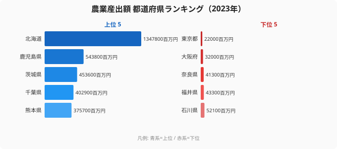

## サンキーが伝える「流れの量」

日本の農業産出額は 2024 年時点でおよそ 9 兆円規模。これを「米が何兆円」「畜産が何兆円」と棒グラフで並べると、確かに大小は伝わります。しかし読者が本当に知りたいのは「**[北海道](/areas/01000)の 1.3 兆円のうち、どれくらいが畜産で、その畜産のなかで生乳がどれくらいを占めるのか**」という **入れ子の量** ではないでしょうか。

棒グラフでは単一カテゴリの比較しかできず、ツリーマップは入れ子は表せても**流れの方向**が見えません。そこで出番なのが **サンキーダイアグラム** です。サンキーは「左の塊が右の塊へ、どれくらいの量で流れ込むか」を帯の太さで表現します。エネルギー収支、Web サイトの導線、製造業のサプライチェーン分析——多段階の「**量の配分**」を読み解く場面で重宝されるチャートです。

本シリーズの Part 13 では、e-Stat の **生産農業所得統計** から農業産出額を引き、`地域 → 品目カテゴリ → 主要品目` の 3 段サンキーを描きます。同時に、Claude Code に「**この生データを最も読み解きやすい分類軸を 3 段で提案して**」と頼むワークフローを紹介します。

サンキーを実装するうえで一番難しいのは、実は描画ではありません。**「どの軸を何段で切るか」というデータ設計**そのものです。ここを AI に手伝ってもらうと、可視化の手戻りが激減します。

この記事のゴールは次の 3 点です。

- e-Stat の農業産出額データを 47 都道府県 × 品目別で取得する
- 分類軸 3 段（地域 / カテゴリ / 主要品目）を Claude Code に提案させる
- `d3-sankey` で gradient links 付きのサンキーを描き、合計値の保存を検証する

それでは本題に入ります。

## 使うデータ: 農業産出額（米・野菜・果樹・畜産など品目別）

農業産出額の定番ソースは農林水産省が毎年公表する **「生産農業所得統計」** です。e-Stat には以下の系統で収録されています。

| 統計表 | statsDataId（例） | 特徴 |
|---|---|---|
| 生産農業所得統計 / 農業産出額 / 都道府県別 | `0003456789` | 47 都道府県 × 約 15 品目（米・麦類・豆類・野菜・果実・花き・畜産 など）|
| 生産農業所得統計 / 全国農業地域別 | `0003456790` | 北海道〜九州 9 ブロックの集計版 |
| 生産農業所得統計 / 市町村別 | `0003456791` | 市町村粒度。データ量が膨大 |

> statsDataId は例示です。e-Stat 側の改訂で随時変わるので、Part 2 で扱った `/search-estat` スキルで最新の ID を確認してください。「生産農業所得統計 農業産出額 都道府県」あたりで検索すると当たります。

今回は **47 都道府県 × 品目別** の最も汎用な系列を使い、2024 年（最新公表年）の単年スナップショットを切り出します。複数年データはアニメーションや時系列チャート（Part 8 のバーチャートレースなど）向きで、サンキーには **単年の構造比較** が最も適しています。

> [!NOTE]
> 都道府県別の農業産出額（2023年）は、1位・北海道が1,347,800百万円、2位・鹿児島県が543,800百万円、3位・茨城県が453,600百万円。一方、最下位は東京都22,000百万円、46位は大阪府32,000百万円と、上位と下位の差は約61倍に達する。サンキーを描く前にこのスケール感を把握しておくと、ノードの幅が直感的に理解しやすくなる。

データの性格として 1 点注意があります。「都道府県別の品目内訳」は **合計と内訳が一致する** ように設計されているはずですが、四捨五入の影響で 1〜2 億円程度ズレることがあります。後段でサンキーの「合計値の保存」を検証するときの誤差として覚えておいてください。

> [!WARNING]
> e-Stat の生産農業所得統計には「合計」「小計」「その他」などの集計行が品目として混入している。これをそのままサンキーに流すと合計値が二重カウントされ、mass conservation が成立しなくなる。`/fetch-estat-data` でデータ取得後は必ず集計行を除外し、最小品目のみ残すフィルタを確認すること。

## Step 1: e-Stat 統計表から都道府県 × 品目別データを取得

stats47 リポジトリでは Part 1〜2 で紹介した `/fetch-estat-data` スキルが、認証・キャッシュ・retry・年度フィルタを巻き取ってくれます。今回もこれを素直に使い倒します。

Claude Code に投げるプロンプトはこんな感じです。

```text
/fetch-estat-data を使って、生産農業所得統計（statsDataId=0003456789）から
2024年の47都道府県 × 品目別の農業産出額を取得し、
JSON で /tmp/agri-output-2024.json に保存してください。

要件:
- 出力フォーマットは { areaCode, areaName, item, itemCode, value }
- value 単位は「億円」に統一（生データが百万円なら / 100）
- areaCode は 01000〜47000 の 5 桁固定
- 全国計 (00000) は除外する
- 「合計」「小計」のような集計行も除外し、最小品目のみ残す
```

このプロンプトのキモは次の 3 点です。

1. **集計行を必ず除外する**。e-Stat の品目列には「合計」「小計」「その他」が混じります。サンキーで使うのは最小単位の品目だけ。これを混ぜると合計値が二重カウントされて、サンキーが破綻します。
2. **単位を統一する**。生データは「百万円」だったり「千万円」だったりします。Claude Code には最終的な単位を明示しておきましょう。
3. **areaCode 5 桁固定**。`.claude/rules/estat-api.md` 規約。サンキー作成時に areaCode キーで JOIN する場面が出るので、ここで正規化しておくのが楽です。

結果はこんなフラット配列になります。

```json
[
  { "areaCode": "01000", "areaName": "北海道", "itemCode": "01", "item": "米",   "value": 1122 },
  { "areaCode": "01000", "areaName": "北海道", "itemCode": "05", "item": "生乳", "value": 5266 },
  { "areaCode": "01000", "areaName": "北海道", "itemCode": "06", "item": "肉用牛","value": 1085 },
  { "areaCode": "02000", "areaName": "青森県", "itemCode": "03", "item": "りんご","value": 928  },
  { "areaCode": "02000", "areaName": "青森県", "itemCode": "01", "item": "米",   "value": 389  }
]
```

> 値は説明用の例示です。実行時は API の戻り値をそのまま使ってください。

47 都道府県 × 約 15 品目 = 700 行前後のフラット配列が手に入りました。ここからサンキー用に整形していきます。

## Step 2: Claude Code に「分類軸を 3 段（地域 / カテゴリ / 主要品目）」で提案させる

サンキーで一番悩むのは **「何を 1 段目に置くか」「何段で切るか」** のデザイン判断です。47 都道府県をそのまま 1 段目に並べるとノードが 47 個 + 品目 15 個 + 主要品目 30 個 = 100 ノード近くになり、画面が破綻します。

ここで Claude Code に **「データを見せて、分類軸を提案させる」** ワークフローが効きます。

```text
/tmp/agri-output-2024.json を読み込んで、
このデータをサンキーダイアグラムで可視化するための
3 段の分類軸を提案してください。

要件:
- 1 段目: 地域（47県を 8 ブロック前後にまとめる）
- 2 段目: 品目カテゴリ（米/麦類/野菜/果実/畜産 など 6-8 カテゴリ）
- 3 段目: 主要品目（合計の上位 20 品目 + 「その他」）
- カテゴリ分類は agri-output-2024.json の品目名から判断して
- 「その他」に集約するルールも提示してほしい
- 期待ノード数: 1段目 8 + 2段目 7 + 3段目 21 ≒ 36 ノード
```

期待する出力は「マッピングルール」と「実装に使う JSON テンプレ」です。Claude Code は次のようなマッピングを返してくれるはずです。

```json
{
  "regionMap": {
    "01000": "北海道",
    "02000": "東北", "03000": "東北", "04000": "東北", "05000": "東北",
    "06000": "東北", "07000": "東北",
    "08000": "関東", "09000": "関東", "10000": "関東", "11000": "関東",
    "12000": "関東", "13000": "関東", "14000": "関東",
    "15000": "中部", "16000": "中部", "17000": "中部", "18000": "中部",
    "19000": "中部", "20000": "中部", "21000": "中部", "22000": "中部",
    "23000": "中部", "24000": "中部",
    "25000": "近畿", "26000": "近畿", "27000": "近畿", "28000": "近畿",
    "29000": "近畿", "30000": "近畿",
    "31000": "中国", "32000": "中国", "33000": "中国", "34000": "中国", "35000": "中国",
    "36000": "四国", "37000": "四国", "38000": "四国", "39000": "四国",
    "40000": "九州", "41000": "九州", "42000": "九州", "43000": "九州",
    "44000": "九州", "45000": "九州", "46000": "九州",
    "47000": "沖縄"
  },
  "categoryMap": {
    "米": "米",
    "麦類": "麦類・豆類", "豆類": "麦類・豆類",
    "野菜": "野菜", "いも類": "野菜",
    "果実": "果実", "りんご": "果実", "みかん": "果実", "ぶどう": "果実",
    "花き": "花き",
    "肉用牛": "畜産", "乳用牛": "畜産", "生乳": "畜産",
    "豚": "畜産", "鶏卵": "畜産", "ブロイラー": "畜産",
    "工芸農作物": "その他作物", "雑穀": "その他作物"
  }
}
```

なぜ Claude Code に任せるのか。**カテゴリ分類は「意味の判断」が入る作業** だからです。「いも類は野菜か」「ブロイラーは畜産か独立か」——機械的に分けられない判断を、データを見て妥当な粒度で提案してくれます。提案された分類が気に入らなければ、「畜産は牛・豚・鶏に細分化して」と再提案させるだけ。試行錯誤のコストが激減します。

人間がやるべきは、Claude Code の提案を読んで「うん、これでいこう」「ここはもう一段細かく」と **判断する** ことだけ。コードを書くのは AI、判断するのは人間、という分業がきれいに成立します。



## Step 3: nodes と links に整形（id 重複の罠）

`d3-sankey` は **nodes 配列と links 配列** を入力に取ります。形式はとてもシンプル。

```json
{
  "nodes": [
    { "id": "region:北海道" },
    { "id": "region:東北" },
    { "id": "category:畜産" },
    { "id": "item:生乳" }
  ],
  "links": [
    { "source": "region:北海道", "target": "category:畜産", "value": 7800 },
    { "source": "category:畜産", "target": "item:生乳",   "value": 5266 }
  ]
}
```

ここで初心者が必ずハマるのが **「id 重複の罠」** です。

たとえば「米」というラベルを 2 段目（category）にも 3 段目（item）にも置きたい場合、両方とも `id: "米"` にすると d3-sankey が自己ループ判定して例外を投げます。**段ごとに prefix を付けて id を一意化する** のが鉄則です。

```javascript
const id = (stage, name) => `${stage}:${name}`;
// "region:北海道" / "category:米" / "item:米"
```

stats47 で実際に使っている整形関数は次のような形です。読みながら「prefix で一意化している」「value を浮動小数のまま流す」「ノードを Set で重複排除する」の 3 点を意識してください。

```typescript
type Row = {
  areaCode: string;
  areaName: string;
  item: string;
  value: number;
};

type SankeyData = {
  nodes: { id: string }[];
  links: { source: string; target: string; value: number }[];
};

function buildSankey(
  rows: Row[],
  regionMap: Record<string, string>,
  categoryMap: Record<string, string>,
  topItems: Set<string>
): SankeyData {
  const id = (stage: string, name: string) => `${stage}:${name}`;
  const nodes = new Set<string>();
  const linkSum = new Map<string, number>();

  for (const r of rows) {
    const region = regionMap[r.areaCode];
    const category = categoryMap[r.item] ?? "その他作物";
    const itemLabel = topItems.has(r.item) ? r.item : "その他";

    const n1 = id("region", region);
    const n2 = id("category", category);
    const n3 = id("item", itemLabel);
    nodes.add(n1);
    nodes.add(n2);
    nodes.add(n3);

    const k1 = `${n1}->${n2}`;
    const k2 = `${n2}->${n3}`;
    linkSum.set(k1, (linkSum.get(k1) ?? 0) + r.value);
    linkSum.set(k2, (linkSum.get(k2) ?? 0) + r.value);
  }

  const links: SankeyData["links"] = [];
  for (const [key, value] of linkSum) {
    const [source, target] = key.split("->");
    links.push({ source, target, value });
  }

  return {
    nodes: Array.from(nodes).map((id) => ({ id })),
    links,
  };
}
```

ポイントは **`linkSum` で同じ source-target ペアの value を集約している** こと。これをやらないと、たとえば「北海道 → 畜産」のリンクが県内の畜産品目数だけ重複してしまい、サンキーが多重リンクで読めなくなります。

`topItems` は「合計の上位 20 品目」のセット。それ以外は `"その他"` に集約します。これで 3 段目のノード数を 21 に抑えられます。閾値（20 件）は Claude Code に「ノード数 20-25 で収まるよう調整して」と頼んで決めてもらうのが手っ取り早いです。

## Step 4: d3-sankey でレイアウト計算

整形が終われば、レイアウト計算は `d3-sankey` の出番です。`d3.sankey()` は **ノード位置 (x0, x1, y0, y1) と リンク (sy0, sy1, ty0, ty1)** を自動計算してくれます。

```typescript
import { sankey, sankeyLinkHorizontal, sankeyJustify } from "d3-sankey";

const width = 960;
const height = 600;
const margin = { top: 20, right: 200, bottom: 20, left: 200 };

const sankeyGen = sankey<{ id: string }, { source: string; target: string; value: number }>()
  .nodeId((d) => d.id)
  .nodeAlign(sankeyJustify)
  .nodeWidth(16)
  .nodePadding(12)
  .extent([
    [margin.left, margin.top],
    [width - margin.right, height - margin.bottom],
  ]);

const graph = sankeyGen({
  nodes: data.nodes.map((d) => ({ ...d })),
  links: data.links.map((d) => ({ ...d })),
});
```

`nodeAlign` の選択肢が地味に重要です。

| 関数 | 配置 | 向いている用途 |
|---|---|---|
| `sankeyLeft` | 全ノード左寄せ | 起点が単一・終点が分散する流れ |
| `sankeyRight` | 全ノード右寄せ | 終点が単一・起点が分散する流れ |
| `sankeyCenter` | 中央寄せ | 中間ノードが複数段にまたがる |
| `sankeyJustify` | 両端揃え | **3 段の均等配置（今回はこれ）** |

今回は 3 段固定なので `sankeyJustify` が素直です。ノード幅 16px、ノード間パディング 12px が経験的に「47 県・3 段サンキー」に収まりがよかった値です。狭すぎるとラベルが重なり、広すぎるとリンクが薄くなりすぎます。

`.map((d) => ({ ...d }))` でコピーを渡しているのは、`sankey` 関数が **入力オブジェクトを破壊的に変更する** ためです。元データを使い回したい場合は必ずコピーを渡してください。

## Step 5: パス描画（gradient links）

レイアウト計算後の `graph.nodes` と `graph.links` を SVG に流し込みます。サンキーの見栄えを左右するのは **リンクのグラデーション** です。

```tsx
function Sankey({ data, width, height }) {
  const graph = useMemo(() => sankeyGen(data), [data]);

  return (
    
  );
}
```

グラデーションは `<defs>` で **リンクごとに 1 つずつ** 定義します。多少 DOM が肥大しますが、SVG なら 100 リンク程度なら平気で動きます。

`colorForNode` は段ごとに色相を変える設計が読みやすいです。

- 1 段目 (region): 寒色系（地域は中立的に）
- 2 段目 (category): カテゴリ別の固定色（米=黄、野菜=緑、果実=赤、畜産=茶 など）
- 3 段目 (item): カテゴリと同色の濃淡

stats47 では `text-foreground` / `text-slate-900` を遵守し、Tailwind パレットから引いた色を D3 に渡しています（`.claude/rules/ui-components.md` 参照）。

ラベル位置は **「キャンバス中央より左 → ノードの右側に表示」「右 → 左側に表示」** が定番。`textAnchor` を切り替えるだけで端から飛び出さなくなります。


## つまずきポイント

サンキーは「描けたけど読めない」が起こりやすいチャートです。実装中によく踏むトラブルとその対処をまとめます。

### 循環参照（self-loop）エラー

`d3-sankey` は **DAG（有向非巡回グラフ）** しか扱えません。同じ id が source と target の両方に現れたり、A→B→A のループがあると例外で停止します。

```text
Error: circular link
```

原因の 90% は **id の付け方**。Step 3 で書いた通り、`stage:name` で必ず prefix を付けてください。Claude Code に整形コードを書かせるときは、「id は段ごとに prefix を付けて一意化して、循環がないことを assert で確認して」と明示しておくと安全です。

### ラベル重なり

3 段目のノードが 20 個を超えると、ラベルが縦に密集して読めなくなります。対処は 3 つ。

- ノード数を 15-20 に絞る（「その他」集約のしきい値を下げる）
- フォントサイズを 10px まで下げる
- 小さなリンクは `strokeOpacity` を下げて、視覚的に重要な太いリンクだけ目立たせる

「**読めないサンキーは棒グラフ以下**」です。ノード数を盛りすぎたと感じたら、迷わず削ってください。

### 合計値の保存（mass conservation）が崩れる

サンキーの読者は無意識に「入ってくる量 = 出ていく量」と信じます。これが崩れると違和感を生むので、必ず検証コードを入れます。

```typescript
function assertMassConservation(graph: SankeyData) {
  const inflow = new Map<string, number>();
  const outflow = new Map<string, number>();
  for (const l of graph.links) {
    inflow.set(l.target, (inflow.get(l.target) ?? 0) + l.value);
    outflow.set(l.source, (outflow.get(l.source) ?? 0) + l.value);
  }
  for (const node of graph.nodes.map((n) => n.id)) {
    const i = inflow.get(node) ?? 0;
    const o = outflow.get(node) ?? 0;
    // 中間ノード（両端でないノード）は inflow と outflow が一致しているべき
    if (i > 0 && o > 0 && Math.abs(i - o) > Math.max(1, i * 0.01)) {
      console.warn(`mass leak: ${node} in=${i} out=${o}`);
    }
  }
}
```

許容誤差は 1% 程度。四捨五入の積み残しが原因ならその範囲に収まります。1% を超えるなら、**「その他」集約や「合計行を二重カウント」を疑う** のが定石です。

### ノードの順序が固定されない

`d3-sankey` はリンクの本数と量に応じて自動的に縦方向の並びを決めます。「カテゴリは常に 米 → 野菜 → 果実 → 畜産 の順にしたい」など順序固定したい場合は、`graph.nodes` を計算後に y0/y1 を上書きするか、`sankeyGen.nodeSort()` にカスタム比較関数を渡します。

```typescript
sankeyGen.nodeSort((a, b) => {
  const order = ["米", "麦類・豆類", "野菜", "果実", "花き", "畜産", "その他作物"];
  return order.indexOf(a.id.split(":")[1]) - order.indexOf(b.id.split(":")[1]);
});
```

ただし順序固定は **リンクの交差を増やす副作用** があります。「読みやすさのために交差を許容するか、意味の順序を優先するか」のトレードオフ。Claude Code に「リンク交差が最小になる順序を提案して」と頼んで AB 比較するのが楽です。

## ここまでのまとめ

3 段サンキーで「都道府県 → 品目カテゴリ → 主要品目」の量の流れを描いてきました。実装の勘所をもう一度。

| ステップ | やること | 注意点 |
|---|---|---|
| 取得 | `/fetch-estat-data` で品目別データを単年取得 | 集計行を除外、単位を揃える |
| 設計 | Claude Code に分類軸 3 段を提案させる | カテゴリの粒度、「その他」集約ルール |
| 整形 | nodes + links に変換 | id は `stage:name` で prefix 一意化 |
| 計算 | `d3.sankey()` でレイアウト | 入力はコピーして渡す（破壊的変更対策）|
| 描画 | gradient links + ラベル左右切替 | カテゴリ別の色設計、ノード幅 16px |
| 検証 | mass conservation を assert | 誤差 1% を超えたら集約ミスを疑う |

サンキーは **設計** で読みやすさが決まります。手を動かして直すのは AI に任せ、判断は人間で。Claude Code との分業がきれいに効くチャートでもあります。

## 次回予告

Part 14 では **エリアチャート（積層面グラフ）** を扱います。サンキーは「単年の構造比較」が得意でしたが、エリアチャートは「**複数年の積層変化**」を強みにします。たとえば「2000-2024 年の品目別農業産出額の推移」を、米のシェアが減って畜産が増えていく様子と一緒に描く——あの形です。

`d3.stack()` の使い方、`d3.area().curve()` の補間方式の選択、ベースライン（zero / wiggle / silhouette）の使い分け、ストリームグラフへの応用——テーマは盛りだくさん。本記事で身につけた「分類軸の AI 提案」の習慣が、エリアチャートでもそのまま転用できます。お楽しみに。

本記事の対象データ: [関連カテゴリ](/category/agriculture)・[東京都](/areas/13000)
