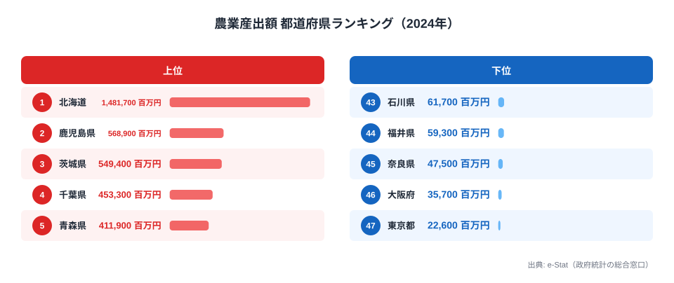
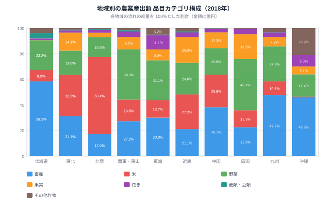

## サンキーが伝える「量の配分」

農業産出額を「米が何兆円」「畜産が何兆円」と棒グラフで並べると、確かに大小は伝わります。しかし読者が本当に知りたいのは「**どの地域が、どの品目カテゴリに偏っているのか。そして全国の農業産出額は、どんな品目でできているのか**」という **量の配分** ではないでしょうか。2018年の表で確かめましょう。後ほど作るサンキーに流す金額を地域ごとに 100％として数えると、[北海道](/areas/01000)は 58.3％を畜産が占めます。一方、北陸は 60.4％を米が占めます。同じ農業産出額でも、地域によって中身がここまで違います。

棒グラフでは単一カテゴリの比較しかできず、ツリーマップは入れ子は表せても**流れの方向**が見えません。そこで出番なのが **サンキーダイアグラム** です。サンキーは「左の塊が右の塊へ、どれくらいの量で流れ込むか」を帯の太さで表現します。エネルギー収支、Web サイトの導線、製造業のサプライチェーン分析——多段階の「**量の配分**」を読み解く場面で重宝されるチャートです。

本シリーズの Part 13 では、e-Stat の **生産農業所得統計** から地域別・品目別の農業産出額を引き、`地域 → 品目カテゴリ → 主要品目` の 3 段サンキーを描きます。同時に、Claude Code に「**この生データを最も読み解きやすい分類軸を 3 段で提案して**」と頼むワークフローを紹介します。手順は 2018年の表で示します。2018年を使う理由は「使うデータ」の節で説明します。

サンキーを実装するうえで一番難しいのは、実は描画ではありません。**「どの軸を何段で切るか」というデータ設計**そのものです。ここを AI に手伝ってもらうと、可視化の手戻りが激減します。

この記事のゴールは次の 4 点です。

- e-Stat の農業産出額データを、地域 × 品目別で取得します
- 重なり合う区分の整理を含む分類軸 3 段（地域 / カテゴリ / 主要品目）を、Claude Code に提案させます
- `d3-sankey` で gradient links 付きのサンキーを描き、流れの総量を表の合計と突き合わせて検証します
- 描いた結果から、地域ごとの違いと、サンキーから読み取れないことを区別して読みます

それでは本題に入ります。

## 使うデータ: 農業産出額（米・野菜・果実・畜産など品目別）

農業産出額は、1月から12月に生産された農産物の品目別の生産数量に、農家の庭先での販売価格を掛けるなどして推計した、農業生産の金額です。農業者の手取りの所得とは別のもので、表の 024 以降にある「生産農業所得」も別の項目です。

農業産出額の定番ソースは農林水産省が毎年公表する「**生産農業所得統計**」です。e-Stat では統計コード `00500206` の統計として収録されています。サンキーに使えそうな表は次のとおりです。

- **生産農業所得統計 / 全国農業地域別農業産出額及び生産農業所得 実額**（statsDataId `0001894246`、2018年）── 今回使う表です。地域 19 区分 × 26 区分（農業産出額の計・小計・米・野菜・畜産など 23 区分と、生産農業所得・参考値 3 区分）で、単位は億円です
- **生産農業所得統計 / 都道府県別農業産出額及び生産農業所得 合計（全国）に占める割合**（`0002006790`、2020年）── 47 都道府県 × 品目の表ですが、値は全国に占める割合（％）で実額ではありません。サンキーの帯の太さには使えません
- **生産農業所得統計 / 分析指標 農産物産出額の順位と構成割合 都道府県別** ── 都道府県ごとに 1 表ずつ分かれています（2018年版は北海道から沖縄まで 47 表）。県別の品目実額を得るには 47 回の取得と結合が必要です
- 市町村単位の数値は別の統計「市町村別農業産出額（推計）」にあり、こちらも都道府県ごとに表が分かれています

今回は 1 つ目を使います。理由は年にあります。e-Stat の生産農業所得統計で、全国農業地域 × 品目の実額が 1 枚にまとまった表は、2014年から2024年まで 1 年ずつ調べた範囲では 2018年（平成30年）のこの表だけでした。2020年のように、地域ごとに表が分かれた「分析指標」の表はあります。2026年10月7日に e-Stat API の getStatsList で統計コード `00500206` と調査年を指定して確かめたところ、2022年から2024年は、API で取れる表が見つかりませんでした。最新の2024年の値は、e-Stat のファイル一覧にある「令和6年生産農業所得統計（確報）表3 都道府県別農業産出額及び生産農業所得」の Excel に載っています。stats47 のランキングは、この Excel から取った値です。

そこで、サンキーの手順は API で取れる 2018年の表で進め、2024年の都道府県別の姿は stats47 のランキングで確認します。同じ記事に 2018年と 2024年が出てくるのは、このためです。2018年の金額と 2024年のランキングの値は年が違うので、直接は比べません。

別の年や別の統計で同じことをするときは、[Part 2](/blog/cc-estat-02-search-skill) で扱った `/search-estat` スキルで表の ID を探せます。検索語には「都道府県別推計統計表 農業産出額」のように、e-Stat の表題に出てくる語を使います。

2024年の都道府県別の農業産出額を、まずランキングで見ておきます。手順で使う表は 2018年ですが、最新の 2024年の姿は、この図とランキングで確かめられます。1位は北海道で1,481,700百万円、2位は鹿児島県で568,900百万円、3位は茨城県で549,400百万円でした。一方、最下位は[東京都](/areas/13000)で22,600百万円、46位は大阪府で35,700百万円です。1位と最下位の差は約 66 倍に達します。ランキングの単位は百万円なので、北海道の1,481,700百万円は約 1 兆 4,817 億円にあたります。後の手順の表と図は億円で書きます。



上位 5 県は北日本から九州まで地域がばらけ、1位の北海道は 2位の鹿児島県の約 2.6 倍の額です。この図が示すのは県ごとの合計までで、その中身が米なのか、野菜なのか、畜産なのかは分かりません。中身を見せるのがサンキーの役目で、記事の後半はそのための手順になります。この図の 47 県・2024年・百万円は、サンキーの入力である 2018年・10 地域・億円とは別の数値です。

<source-link href="/ranking/agricultural-output">農業産出額ランキングをもっと見る</source-link>

> [!NOTE]
> 2024年の都道府県別の値は、農林水産省の公表値（億円単位）を百万円に換算したものです。ランキングページの注記によると、2023年以前は社会・人口統計体系の百万円値で精度が異なります。年をまたいで差を比べるときは、この違いに注意してください。

データの性格として 1 点注意があります。地域別の品目内訳は合計と内訳が一致するように設計されていますが、四捨五入の影響で 1〜2 億円程度ズレることがあります。この表では、10 地域の「計」を足すと 91,282 億円で、表の「合計」は 91,283 億円でした。後段でサンキーの「合計値の保存」を検証するときの誤差として覚えておいてください。

> [!WARNING]
> この表には、足し合わせると重なる行が混ざっています。そのままサンキーに流すと、同じ金額が二重三重に描かれ、帯の太さが実際の数倍になります。どの行を使うかは Step 2 で決めます。

## Step 1: e-Stat 統計表から地域 × 品目別データを取得

stats47 リポジトリには `/fetch-estat-data` スキルがあります。[Part 2](/blog/cc-estat-02-search-skill) の `/search-estat` が返した statsDataId を渡す先で、e-Stat API の getStatsData を呼ぶ一時スクリプトを書き、取得と整形までを行う手順をまとめたスキルです。今回もこれを使います。

このスキルが手元に無い場合は、次のプロンプトの先頭を「e-Stat API の getStatsData で」に置き換え、appId を環境変数に設定してください。appId の発行は [Part 1](/blog/cc-estat-01-setup)、取得コードの例は [Part 3](/blog/cc-estat-03-population-bar) で扱っています。

Claude Code に投げるプロンプトはこんな感じです。

```text
/fetch-estat-data を使って、生産農業所得統計（statsDataId=0001894246）から
2018年の全国農業地域 × 農業産出額の品目別データを取得し、
JSON で /tmp/agri-output-2018.json に保存してください。

要件:
- 取得するのは品目コード（cat02）が 001〜023 の行だけ
  （024 以降は生産農業所得と参考値で、単位の意味が違うため取得しない）
- 出力フォーマットは { regionCode, regionName, itemCode, item, itemPath, value }
- regionCode は地域（cat01）の 3 桁コード、itemCode は品目（cat02）の 3 桁コードのまま
- item は品目名の最後の語（農業産出額_耕種_米 → 米）、
  itemPath は「耕種/米」の形で階層を残す
- value は表の単位（億円）のまま数値で保存する
- value が数値でない行（秘匿の "x"、事実のない "-"）は除外する
- この段階では地域・品目の集計行は除外しない（Step 2 で何を使うか決める）
```

このプロンプトのキモは次の 3 点です。

1. **秘匿・該当なしのセルを数値にしない**。この表は 19 地域 × 23 品目 = 437 セルのうち 16 セルが数字ではなく、「x」（個々の秘密に属する事項を秘匿するため、統計数値を公表しないもの）か「-」（事実のないもの）です。表の注記に書かれている意味です。`Number("x")` は `NaN` になり、そのまま足すと合計全体が `NaN` になります。
2. **取得する範囲を絞る**。品目 26 区分のうち 024 以降は、生産農業所得と参考値です。025 の「参考１」は農業産出額に占める生産農業所得の割合で、地域 001 の行を見ると値は 40.2 です。これは同じ地域の 024 を 001 で割った割合（％）と一致しますが、表の単位欄には「億円」と書かれています。単位欄を信じて億円の列に混ぜると、桁も意味も狂います。
3. **コードはそのまま使う**。この表の地域は都道府県の `area` 次元ではなく `cat01` で、コードは 3 桁です（`001` が北海道）。都道府県の表は地域を 5 桁（`01000`〜`47000`）で持ちますが、この表は 3 桁なので、桁をそろえ直さずにそのまま使います。

結果はこんなフラット配列になります。

```json
[
  { "regionCode": "001", "regionName": "北海道", "itemCode": "003", "item": "米",     "itemPath": "耕種/米",           "value": 1122 },
  { "regionCode": "001", "regionName": "北海道", "itemCode": "016", "item": "乳用牛", "itemPath": "畜産/乳用牛",       "value": 5026 },
  { "regionCode": "001", "regionName": "北海道", "itemCode": "017", "item": "生乳",   "itemPath": "畜産/乳用牛/生乳", "value": 3826 },
  { "regionCode": "003", "regionName": "東北",   "itemCode": "003", "item": "米",     "itemPath": "耕種/米",           "value": 4622 },
  { "regionCode": "019", "regionName": "合計",   "itemCode": "001", "item": "計",     "itemPath": "計",               "value": 91283 }
]
```

> 値は e-Stat API の戻り値（2026年10月7日に取得、単位は億円）です。実行時も API の戻り値をそのまま使ってください。

437 セルのうち数値のセルは 421 あり、421 行のフラット配列が手に入りました。末尾の行のように「合計」「計」も入っています。ここからサンキー用に整形していきます。

## Step 2: Claude Code に「分類軸を 3 段（地域 / カテゴリ / 主要品目）」で提案させる

サンキーで一番悩むのは「**何を 1 段目に置くか**」「**何段で切るか**」のデザイン判断です。421 行をそのまま流すと、足し合わせると重なる区分まで別々のノードになり、同じ金額が 2 回以上描かれて破綻します。

ここで Claude Code に「**データを見せて、分類軸を提案させる**」ワークフローが効きます。

```text
/tmp/agri-output-2018.json を読み込んで、
このデータをサンキーダイアグラムで可視化するための
3 段の分類軸を提案してください。

要件:
- 1 段目: 地域（足し合わせて重複しない地域だけを残す。10 前後）
- 2 段目: 品目カテゴリ（米/麦類・豆類/野菜/果実/花き/畜産/その他作物 など 6-8 カテゴリ）
- 3 段目: 主要品目（合計の上位 10 品目 + 「その他品目」）
- 地域も品目も、ほかの区分を含む上位の区分と下位の区分が両方あるときは、
  どちらを使うか決めて、落とす区分と理由を一覧にする
- カテゴリ分類は agri-output-2018.json の品目名と itemPath から判断して
- 「その他品目」に集約するルールも提示してほしい
- 期待ノード数: 1段目 10 + 2段目 7 + 3段目 11 ≒ 28 ノード
```

期待する出力は「マッピングルール」と「実装に使う JSON テンプレ」です。この表に対しては、次のようなマッピングが妥当です。Claude Code の実際の応答は実行のたびに多少変わるので、中身は必ず自分の目で確かめてください。

```json
{
  "regionMap": {
    "001": "北海道", "003": "東北", "004": "北陸", "005": "関東・東山",
    "009": "東海", "010": "近畿", "011": "中国", "014": "四国",
    "015": "九州", "018": "沖縄"
  },
  "categoryMap": {
    "米": "米",
    "麦類": "麦類・豆類", "豆類": "麦類・豆類",
    "野菜": "野菜", "いも類": "野菜",
    "果実": "果実",
    "花き": "花き",
    "肉用牛": "畜産", "乳用牛": "畜産", "豚": "畜産",
    "鶏": "畜産", "その他畜産物": "畜産",
    "雑穀": "その他作物", "工芸農作物": "その他作物", "その他作物": "その他作物"
  }
}
```

`regionMap` は Step 1 の `regionCode` を 1 段目のノード名に、`categoryMap` は `item` を 2 段目のカテゴリ名に対応づけます。**どちらにも載っていない行は流さない**という約束にしておくのがポイントです。

返ってきた提案のうち、人間が必ず読むのは「何を落としたか」です。この表では次の判断が入ります。

- **地域**: 「合計」と「都府県」は全体の集計なので落とします。「関東・東山」は「北関東」「南関東」「東山」を、「中国」は「山陰」「山陽」を、「九州」は「北九州」「南九州」を含むため、粗い 10 区分を残して細かい区分を落とします。
- **品目**: 「計」と「小計」は集計なので落とします。「茶」「生乳」「鶏卵」「ブロイラー」は、それぞれ「工芸農作物」「乳用牛」「鶏」の内訳なので落とします。
- **加工農産物**: 耕種・畜産と並ぶ別の区分で、全国では 615 億円と、合計 91,283 億円の約 0.7％です。作物でも畜産でもないため、今回は流しません。

なぜ Claude Code に任せるのか。**カテゴリ分類は「意味の判断」が入る作業** だからです。「いも類は野菜か」「加工農産物は耕種か畜産か」「生乳は乳用牛と別に描くのか」——機械的に分けられない判断を、データの階層を見て妥当な粒度で提案してくれます。提案された分類が気に入らなければ、「畜産は牛・豚・鶏に細分化して」と再提案させるだけです。試行錯誤のコストが激減します。

人間がやるべきは、Claude Code の提案を読んで「うん、これでいこう」「ここはもう一段細かく」と **判断する** ことだけです。コードを書くのは AI、判断するのは人間、という分業がきれいに成立します。

## Step 3: nodes と links に整形（id 重複の罠）

`d3-sankey` は **nodes 配列と links 配列** を入力に取ります。形式はとてもシンプルです。

```json
{
  "nodes": [
    { "id": "region:北海道" },
    { "id": "region:東北" },
    { "id": "category:畜産" },
    { "id": "item:乳用牛" }
  ],
  "links": [
    { "source": "region:北海道", "target": "category:畜産", "value": 7347 },
    { "source": "category:畜産", "target": "item:乳用牛", "value": 9338 }
  ]
}
```

上の JSON は実際の出力から 4 ノードと 2 リンクだけを抜き出したもので、値の単位は億円です。この 2 本のリンクを「北海道 → 畜産 → 乳用牛」とつなげて読むことはできません。1 本目は北海道の畜産ですが、2 本目の乳用牛は 10 地域すべてを合わせた全国の値です。`buildSankey` は 2 段目から 3 段目のリンクを地域に関係なく集計するので、サンキーの 2 段目から右は全国の構成を表し、地域と品目の対応は読み取れません。この読み違いの具体例は、描いたあとの「描いた結果を読む」の節で数値とともに確かめます。

ここで初心者が必ずハマるのが「**id 重複の罠**」です。

たとえば「米」というラベルを 2 段目（category）にも 3 段目（item）にも置きたい場合、両方とも `id: "米"` にすると d3-sankey が自己ループ判定して例外を投げます。**段ごとに prefix を付けて id を一意化する** のが鉄則です。

```javascript
const id = (stage, name) => `${stage}:${name}`;
// "region:北海道" / "category:米" / "item:米"
```

整形関数は次のような形です（`build-sankey.ts` として保存します）。Step 1 の行（`Row`）と Step 2 のマッピング（`Mapping`）を受け取り、Step 4 に渡す `SankeyData` を返します。読みながら「prefix で一意化している」「value を浮動小数のまま流す」「ノードを Set で重複排除する」「マッピングに載っていない行を捨てる」の 4 点を意識してください。

```typescript
export type Row = {
  regionCode: string;
  regionName: string;
  itemCode: string;
  item: string;
  value: number;
};

// Step 2 の JSON と同じ形
export type Mapping = {
  regionMap: Record<string, string>;
  categoryMap: Record<string, string>;
};

export type SankeyData = {
  nodes: { id: string }[];
  links: { source: string; target: string; value: number }[];
};

// Step 2 の提案に載っている行だけを対象にする
// （載っていない行 = 集計行・内訳・粗い区分と重なる細かい区分は流さない）
const isTarget = (r: Row, m: Mapping) =>
  r.regionCode in m.regionMap && r.item in m.categoryMap;

// 対象行を品目ごとに合計し、上位 n 品目の名前を返す
export function pickTopItems(rows: Row[], m: Mapping, n: number): Set<string> {
  const sum = new Map<string, number>();
  for (const r of rows) {
    if (isTarget(r, m)) sum.set(r.item, (sum.get(r.item) ?? 0) + r.value);
  }
  const top = [...sum].sort((a, b) => b[1] - a[1]).slice(0, n);
  return new Set(top.map(([item]) => item));
}

export function buildSankey(
  rows: Row[],
  m: Mapping,
  topItems: Set<string>
): SankeyData {
  const id = (stage: string, name: string) => `${stage}:${name}`;
  const nodes = new Set<string>();
  const linkSum = new Map<string, number>();

  for (const r of rows) {
    if (!isTarget(r, m)) continue;

    const n1 = id("region", m.regionMap[r.regionCode]);
    const n2 = id("category", m.categoryMap[r.item]);
    const n3 = id("item", topItems.has(r.item) ? r.item : "その他品目");
    nodes.add(n1);
    nodes.add(n2);
    nodes.add(n3);

    const k1 = `${n1}->${n2}`;
    const k2 = `${n2}->${n3}`;
    linkSum.set(k1, (linkSum.get(k1) ?? 0) + r.value);
    linkSum.set(k2, (linkSum.get(k2) ?? 0) + r.value);
  }

  const links: SankeyData["links"] = [];
  for (const [key, value] of linkSum) {
    const [source, target] = key.split("->");
    links.push({ source, target, value });
  }

  return { nodes: Array.from(nodes, (id) => ({ id })), links };
}
```

ポイントは **`linkSum` で同じ source-target ペアの value を集約している** ことです。これをやらないと、たとえば「北海道 → 畜産」のリンクが畜産の品目数だけ重複してしまい、サンキーが多重リンクで読めなくなります。

もう 1 点、`categoryMap` に載っていない品目を `?? "その他作物"` のような既定値のカテゴリに落とす書き方は、ここでは使いません。集計行や内訳が黙って「その他作物」に入ってしまい、Step 2 で落とすと決めた区分が復活するためです。

`pickTopItems` は、対象行の品目ごとの合計から上位 10 品目を選びます。この表では、野菜・米・乳用牛・鶏・果実・肉用牛・豚・花き・いも類・工芸農作物の 10 品目が選ばれ、残りは「その他品目」に集約されます。これで 3 段目のノード数を 11 に抑えられます。実際に動かすと、ノードは 1 段目 10 + 2 段目 7 + 3 段目 11 の 28 個、リンクは 83 本でした。閾値（10 件）は Claude Code に「ノード数 20-30 で収まるよう調整して」と頼んで決めてもらうのが手っ取り早いです。

## Step 4: d3-sankey でレイアウト計算

整形が終われば、レイアウト計算は `d3-sankey` の出番です。`d3.sankey()` は **ノード位置 (x0, x1, y0, y1) と リンク (y0, y1, width)** を自動計算してくれます。Step 3 の `build-sankey.ts` と同じ場所に、`layout-sankey.ts` として保存します。

```typescript
import { sankey, sankeyJustify } from "d3-sankey";
import type { SankeyData } from "./build-sankey";

type NodeDatum = { id: string };
type LinkDatum = { source: string; target: string; value: number };

const margin = { top: 20, right: 20, bottom: 20, left: 20 };

// Step 3 の buildSankey が返す SankeyData を、描画サイズ付きでレイアウトする
export function layoutSankey(data: SankeyData, width: number, height: number) {
  const generator = sankey<NodeDatum, LinkDatum>()
    .nodeId((d) => d.id)
    .nodeAlign(sankeyJustify)
    .nodeWidth(16)
    .nodePadding(12)
    .extent([
      [margin.left, margin.top],
      [width - margin.right, height - margin.bottom],
    ]);

  // sankey は入力を破壊的に変更するので、コピーを渡す
  return generator({
    nodes: data.nodes.map((d) => ({ ...d })),
    links: data.links.map((d) => ({ ...d })),
  });
}

export type SankeyLayout = ReturnType<typeof layoutSankey>;
```

`nodeAlign` の選択肢は 4 種類あります。

- `sankeyLeft` ── 全ノード左寄せ。起点が単一・終点が分散する流れ向き
- `sankeyRight` ── 全ノード右寄せ。終点が単一・起点が分散する流れ向き
- `sankeyCenter` ── 中央寄せ。中間ノードが複数段にまたがる場合向き
- `sankeyJustify` ── 両端揃え。**3 段の均等配置**（今回はこれ）

今回のように、すべてのリンクが隣の段へつながる 3 段固定のグラフでは、4 種類のどれを選んでも配置は同じになりました。段をまたぐリンクがあるグラフに作り直したときの備えとして、`sankeyJustify` を選んでいます。

ノード幅 16px、ノード間パディング 12px という値は、Step 5 で付けるラベルの文字サイズ（11px）から決めました。ラベルはノードの縦中央に置くので、隣り合うノードの中心は常に 12px 以上離れます。そのため 11px のラベルが縦に重なりません。パディングを狭くするとラベルが重なり、広くするとノードの高さが足りなくなります。

`.map((d) => ({ ...d }))` でコピーを渡しているのは、`sankey` 関数が **入力オブジェクトを破壊的に変更する** ためです。実際に `links` の `source` が文字列からノードのオブジェクトに置き換わります。元データを使い回したい場合は必ずコピーを渡してください。

## Step 5: パス描画（gradient links）

レイアウト計算後の `graph.nodes` と `graph.links` を SVG に流し込みます。サンキーの見栄えを左右するのは **リンクのグラデーション** です。コンポーネントは `sankey.tsx` として保存します。

```tsx
import { useMemo } from "react";
import { sankeyLinkHorizontal } from "d3-sankey";
import type { SankeyData, Mapping } from "./build-sankey";
import { layoutSankey, type SankeyLayout } from "./layout-sankey";

type LayoutNode = SankeyLayout["nodes"][number];
type LayoutLink = SankeyLayout["links"][number];

const REGION_COLOR = "#5b7c99";
const CATEGORY_COLOR: Record<string, string> = {
  米: "#d9a406",
  "麦類・豆類": "#a67c52",
  野菜: "#3a9d4f",
  果実: "#d64545",
  花き: "#c0508b",
  畜産: "#7b5a43",
  その他作物: "#8a8a8a",
};

// ルートのタグ名。JSX では大文字始まりの変数もタグ名に使えます。
// 実際のコードでは、ここに svg の開きタグをそのまま書いてかまいません。
// 変数にしているのは、この記事の公開前検査が、コードブロックの中の svg の開きタグも数えるための迂回です。
const Svg = "svg";

const nameOf = (id: string) => id.slice(id.indexOf(":") + 1);

// Step 2 の categoryMap を使い、3 段目の品目をカテゴリと同じ色にする
function makeColorForNode(categoryMap: Mapping["categoryMap"]) {
  return (node: LayoutNode) => {
    const name = nameOf(node.id);
    if (node.id.startsWith("region:")) return REGION_COLOR;
    if (node.id.startsWith("category:")) return CATEGORY_COLOR[name] ?? "#8a8a8a";
    return CATEGORY_COLOR[categoryMap[name]] ?? "#8a8a8a";
  };
}

type Props = {
  data: SankeyData;
  categoryMap: Mapping["categoryMap"];
  width: number;
  height: number;
};

export function Sankey({ data, categoryMap, width, height }: Props) {
  // Step 3 の SankeyData を Step 4 の layoutSankey に渡す
  const graph = useMemo(() => layoutSankey(data, width, height), [data, width, height]);
  const colorForNode = makeColorForNode(categoryMap);
  const linkPath = sankeyLinkHorizontal();

  return (
    <Svg viewBox={`0 0 ${width} ${height}`}>
      <defs>
        {graph.links.map((link: LayoutLink, i: number) => (
          <linearGradient
            key={i}
            id={`grad-${i}`}
            gradientUnits="userSpaceOnUse"
            x1={(link.source as LayoutNode).x1}
            x2={(link.target as LayoutNode).x0}
          >
            <stop offset="0%" stopColor={colorForNode(link.source as LayoutNode)} />
            <stop offset="100%" stopColor={colorForNode(link.target as LayoutNode)} />
          </linearGradient>
        ))}
      </defs>

      <g fill="none">
        {graph.links.map((link: LayoutLink, i: number) => (
          <path
            key={i}
            d={linkPath(link) ?? undefined}
            stroke={`url(#grad-${i})`}
            strokeWidth={Math.max(1, link.width ?? 0)}
            strokeOpacity={0.5}
          />
        ))}
      </g>

      <g>
        {graph.nodes.map((node: LayoutNode) => (
          <rect
            key={node.id}
            x={node.x0}
            y={node.y0}
            width={(node.x1 ?? 0) - (node.x0 ?? 0)}
            height={(node.y1 ?? 0) - (node.y0 ?? 0)}
            fill={colorForNode(node)}
          />
        ))}
      </g>

      <g fontSize={11} fill="currentColor">
        {graph.nodes.map((node: LayoutNode) => {
          const onLeft = (node.x0 ?? 0) < width / 2;
          return (
            <text
              key={node.id}
              x={onLeft ? (node.x1 ?? 0) + 6 : (node.x0 ?? 0) - 6}
              y={((node.y0 ?? 0) + (node.y1 ?? 0)) / 2}
              dy="0.35em"
              textAnchor={onLeft ? "start" : "end"}
            >
              {nameOf(node.id)}
            </text>
          );
        })}
      </g>
    </Svg>
  );
}
```

使うときは、Step 1 から Step 3 の流れをつなげて `Sankey` に渡します。

```tsx
import rowsJson from "./agri-output-2018.json";   // Step 1 の出力を置いたもの
import mappingJson from "./sankey-mapping.json";  // Step 2 の JSON を保存したもの
import { buildSankey, pickTopItems, type Row, type Mapping } from "./build-sankey";
import { Sankey } from "./sankey";

const rows = rowsJson as Row[];
const mapping = mappingJson as Mapping;
const data = buildSankey(rows, mapping, pickTopItems(rows, mapping, 10));

export function AgriSankey() {
  return <Sankey data={data} categoryMap={mapping.categoryMap} width={960} height={600} />;
}
```

JSON を `import` するので、tsconfig の `resolveJsonModule` を有効にしておきます。

グラデーションは `<defs>` で **リンクごとに 1 つずつ** 定義します。多少 DOM が肥大しますが、この例のリンクは 83 本なので、`linearGradient` が 83 個増える程度です。

`colorForNode` は段ごとに色相を変える設計が読みやすいです。

- 1 段目 (region): 寒色系（地域は中立的に）
- 2 段目 (category): カテゴリ別の固定色（米=黄、野菜=緑、果実=赤、畜産=茶 など）
- 3 段目 (item): カテゴリと同じ色

ラベルの文字色は `fill="currentColor"` にして、周りの文字色に合わせています。

ラベル位置は「**キャンバス中央より左 → ノードの右側に表示**」「**右 → 左側に表示**」が定番です。`textAnchor` を切り替えるだけで端から飛び出さなくなります。

## 描いた結果を読む: 地域ごとの中身の違い

ここまでのコードで、10 地域・7 カテゴリ・11 品目のサンキーが描けます。サンキーの 1 段目から 2 段目の帯は、各地域が品目カテゴリにいくらを振り向けているかを表します。この帯の値を、読み比べやすい積み上げ棒にしたのが次の図です。割合の分母は、各地域の流れの総量、つまり Step 2 の分類で流した品目の合計で、加工農産物と、秘匿・該当なしのセルは含みません。カテゴリは Step 2 の分け方のままで、野菜にはいも類、麦類・豆類には麦類と豆類、その他作物には雑穀・工芸農作物・その他作物が入っています。



北海道は、流れの総量 12,592 億円のうち畜産の産出額が 7,347 億円で、58.3％を占めます。畜産の割合は九州が 47.7％、沖縄が 45.8％で、北海道に続きます。一方、北陸は米が 60.4％で最も大きく、畜産は 17.0％にとどまります。野菜は四国が 40.1％、関東・東山が 39.3％で、どちらも約 4 割です。東海は花きが 11.1％で、10 地域のなかで最も大きな割合になっています。沖縄は、その他作物が 20.9％で、ほかの 9 地域の 5.2％以下を大きく上回ります。どの地域も、上位 2 カテゴリの合計が流れの総量の半分を超えていて、最も小さい近畿でも 51.8％です。サンキーの 1 段目から 2 段目は、この「地域ごとの偏り」を帯の太さで見せています。最新の 2024年の都道府県別の姿は、[農業産出額ランキング](/ranking/agricultural-output)で確かめられます。

2 段目から 3 段目の帯は、10 地域を合わせた全国の構成です。畜産は全国で 32,590 億円で、内訳は乳用牛が 9,338 億円、鶏が 9,000 億円、肉用牛が 7,415 億円、豚が 6,104 億円、その他畜産物が 733 億円です。その他畜産物は上位 10 品目に入らないので、サンキーでは「その他品目」にまとめられます。乳用牛が最も大きいものの、鶏との差は 338 億円です。品目全体では、野菜が 23,211 億円、米が 17,515 億円で、乳用牛はその次に大きい品目になります。

> [!WARNING]
> サンキーの 2 段目から 3 段目の帯は全国の値です。「北海道 → 畜産 → 乳用牛」とつなげて読むと、北海道の乳用牛の産出額が 9,338 億円あるように見えますが、これは 10 地域を合わせた全国の乳用牛の産出額です。北海道の乳用牛の産出額は 5,026 億円で、全国の 53.8％にあたります。

「北海道の畜産のうち、乳用牛がどれくらいを占めるのか」のように、入れ子の量を 1 つの地域で読みたいときは、地域を 1 つに絞って作り直します。`buildSankey` に渡す行を、北海道の行だけにします。

```typescript
const hokkaido = rows.filter((r) => r.regionCode === "001");
const data = buildSankey(hokkaido, mapping, pickTopItems(hokkaido, mapping, 10));
```

この場合、すべての帯が北海道の値になり、畜産の産出額 7,347 億円のうち、乳用牛は 5,026 億円で 68.4％を占めます。残りは肉用牛が 1,016 億円、その他畜産物が 509 億円、豚が 439 億円、鶏が 357 億円です。ただし、次の節で紹介する `assertAgainstTable` にも、絞った `hokkaido` を同じように渡してください。全地域の `rows` を渡すと、流れが 0 のほかの 9 地域が、表と一致しないと警告されます。

## つまずきポイント

サンキーは「描けたけど読めない」が起こりやすいチャートです。実装中によく踏むトラブルとその対処をまとめます。

### 循環参照（self-loop）エラー

`d3-sankey` は **DAG**（有向非巡回グラフ）しか扱えません。同じ id が source と target の両方に現れたり、A→B→A のループがあると例外で停止します。

```text
Error: circular link
```

最初に疑うのは **id の付け方** です。Step 3 で書いた通り、`stage:name` で必ず prefix を付けてください。Claude Code に整形コードを書かせるときは、「id は段ごとに prefix を付けて一意化して、循環がないことを assert で確認して」と明示しておくと安全です。

### ラベル重なり

ノードどうしは重ならなくても、小さなノードのラベルは 12px 間隔で並ぶので、3 段目のノードが増えるほど読みにくくなります。どこから読めなくなるかは、図の高さとデータで変わります。自分のデータで描いて確かめてください。対処は 3 つです。

- ノード数を絞ります（「その他品目」に集約するしきい値を下げます）
- フォントサイズを 10px まで下げます
- 小さなリンクは `strokeOpacity` を下げて、視覚的に重要な太いリンクだけを目立たせます

「**読めないサンキーは棒グラフ以下**」です。ノード数を盛りすぎたと感じたら、迷わず削ってください。

### 合計値の保存（mass conservation）が崩れる

サンキーの読者は無意識に「入ってくる量 = 出ていく量」と信じます。これが崩れると違和感を生むので、検証コードを入れます。ただし、検証には 2 種類あり、役目が違います。

1 つ目は、同じ行から作ったリンクの出入りを比べる検証です。`buildSankey` を直したときにリンクを取りこぼしていないかを確かめられます。

```typescript
function assertMassConservation(data: SankeyData) {
  const inflow = new Map<string, number>();
  const outflow = new Map<string, number>();
  for (const l of data.links) {
    inflow.set(l.target, (inflow.get(l.target) ?? 0) + l.value);
    outflow.set(l.source, (outflow.get(l.source) ?? 0) + l.value);
  }
  for (const { id } of data.nodes) {
    const i = inflow.get(id) ?? 0;
    const o = outflow.get(id) ?? 0;
    // 中間ノード（両端でないノード）は inflow と outflow が一致しているべき
    if (i > 0 && o > 0 && Math.abs(i - o) > Math.max(1, i * 0.01)) {
      console.warn(`mass leak: ${id} in=${i} out=${o}`);
    }
  }
}
```

この検証だけでは、集計行や内訳を二重に流した間違いを見つけられません。1 つの行が 2 本のリンクに同じ値で加わるため、間違った行を混ぜても出入りは一致してしまうからです。実際に、Step 2 で落とした「小計」「生乳」「鶏卵」「ブロイラー」「茶」をマッピングに足して試すと、この検証は何も警告しませんでした。

そこで 2 つ目に、表の外にある基準と比べる検証を入れます。Step 1 の配列に残してある「計」の行（`itemCode` が `001`）を使い、地域ごとの流れの総量と、全体の流れの総量を突き合わせます。

```typescript
function assertAgainstTable(
  rows: Row[],
  data: SankeyData,
  m: Mapping,
  tolerance = 0.03
) {
  const flow = new Map<string, number>();
  for (const l of data.links) {
    if (l.source.startsWith("region:")) {
      flow.set(l.source, (flow.get(l.source) ?? 0) + l.value);
    }
  }
  const tableTotal = (code: string) =>
    rows.find((r) => r.regionCode === code && r.itemCode === "001")?.value;

  const compare = (label: string, sum: number, table: number | undefined) => {
    if (table === undefined) return;
    const gap = (sum - table) / table;
    if (Math.abs(gap) > tolerance) {
      console.warn(`total mismatch: ${label} flow=${sum} table=${table} (${(gap * 100).toFixed(1)}%)`);
    }
  };

  // 地域ごと（Step 2 の regionMap の各地域）
  for (const [code, name] of Object.entries(m.regionMap)) {
    compare(name, flow.get(`region:${name}`) ?? 0, tableTotal(code));
  }
  // 全体（regionCode 019 の「合計」）
  const all = [...flow.values()].reduce((a, b) => a + b, 0);
  compare("全体", all, tableTotal("019"));
}
```

許容誤差は 3％ にしています。このデータで正しい提案を流すと、流れの総量は 90,299 億円で、表の合計 91,283 億円より約 1.1％小さくなりました。地域別では九州の約 2.5％が最大です。差の原因は、流さないと決めた加工農産物と、秘匿（x）で落ちたセルの 2 つです。一方、Step 2 で落とした「小計」「生乳」「鶏卵」「ブロイラー」「茶」の 5 行を足すと、全体で 116％ 上振れします。「関東・東山」を流したまま、それに含まれる「北関東」「南関東」「東山」の 3 区分も足した場合でも、21％ 上振れします。3％ なら、この 2 種類の差ははっきり見分けられます。

ただし、3％ では小さい内訳の重なりは見えません。たとえば茶は全国で 615 億円で、合計の約 0.7％です（加工農産物とたまたま同じ額ですが、別の区分です）。茶だけをマッピングに足しても、流れの総量は 90,914 億円で、表の合計より 0.4％ 小さいだけなので、`assertAgainstTable` も `assertMassConservation` も警告しません。検証を通ったから二重カウントは無い、とは言えません。落とす区分の一覧（Step 2）を人が読む工程が、最初の防衛線です。秘匿のセルが多い表では、許容誤差を広げる必要があります。

地域別の検証だけでは見つからない間違いもあります。「関東・東山」と、それに含まれる「北関東」「南関東」「東山」を両方流したとき、地域別では各地域が自分の「計」と一致してしまい、全体との比較で初めて気づけました。地域別と全体の両方を見ておくと安全です。

### ノードの順序が固定されない

`d3-sankey` はリンクの本数と量に応じて自動的に縦方向の並びを決めます。「カテゴリは常に 米 → 野菜 → 果実 → 畜産 の順にしたい」など順序固定したい場合は、`sankey()` が返す generator の `nodeSort()` にカスタム比較関数を渡します。Step 4 の `layoutSankey` で `generator` を作った直後に、次を足します。

```typescript
const order = ["米", "麦類・豆類", "野菜", "果実", "花き", "畜産", "その他作物"];
const rank = (id: string) =>
  id.startsWith("category:") ? order.indexOf(id.slice("category:".length)) : 0;

generator.nodeSort((a, b) => rank(a.id) - rank(b.id));
```

この比較関数はカテゴリの列だけを並べ替え、ほかの列は比べても引き分けになります。引き分けのノードは入力順に並ぶので、この例では地域が Step 1 のコード順（北海道から沖縄まで）に並びます。

ただし順序固定は **リンクの交差が増える** ことがあります。「読みやすさのために交差を許容するか、意味の順序を優先するか」のトレードオフです。カテゴリは 7 個なので、並べ方は 5,040 通りです。リンクの交差数を数えて最小の並びを探す小さなスクリプトを Claude Code に書かせて、AB 比較する方法もあります。

## ここまでのまとめ

3 段サンキーで「地域 → 品目カテゴリ → 主要品目」の量の流れを描いてきました。実装の勘所をもう一度。

- **取得**: `/fetch-estat-data` で地域 × 品目別データを単年で取得します。秘匿・該当なしのセルは除外し、取得する品目の範囲を絞ります。
- **設計**: Claude Code に分類軸を 3 段で提案させます。重なり合う区分のどちらを使うかと、落とす理由を一覧にさせます。
- **整形**: nodes と links に変換します。id は `stage:name` で prefix を付けて一意にし、マッピングに載らない行は流しません。
- **計算**: `d3.sankey()` でレイアウトします。入力はコピーして渡します（破壊的変更への対策です）。
- **描画**: gradient links を描き、ラベルは左右で位置を切り替えます。カテゴリ別に色を決め、ノード幅は 16px にします。
- **検証**: 出入りの一致に加えて、表の「計」と突き合わせます。誤差 3％ を超えたら二重カウントを疑い、3％ に収まっても落とす区分の一覧は人が読みます。
- **読み取り**: 1 段目から 2 段目は地域ごとの構成、2 段目から 3 段目は全国の構成として読みます。地域ごとに入れ子の量を読みたいときは、地域を 1 つに絞ります。

サンキーは **設計** で読みやすさが決まります。手を動かして直すのは AI に任せ、判断は人間で。Claude Code との分業がきれいに効くチャートでもあります。

## 次回予告

Part 14 では **電力消費の積み上げ面グラフ** を扱います。サンキーは「単年の構造比較」が得意でしたが、積み上げ面は「**複数年の構成の変化**」を強みにします。

`d3.stack()` の `stackOrder` と `stackOffset` をどう選ぶか、その選択を Claude Code との会話で決める流れ、ストリームグラフへの応用、用途ごとの色設計——テーマは盛りだくさん。本記事で身につけた「分類軸の AI 提案」の習慣は、積み上げの系列をどう並べるかを決める場面でもそのまま転用できます。お楽しみに。

本記事の対象データ: [関連カテゴリ](/category/agriculture)
