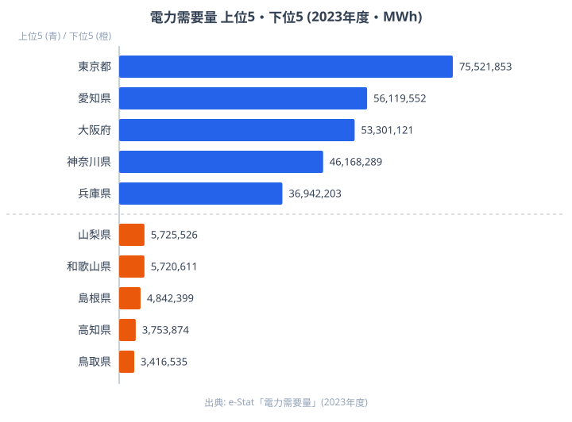

## 積み上げ面で「構成変化」を読む

折れ線グラフが時系列の「絶対値の推移」を表すグラフだとしたら、積み上げ面チャート（Stacked Area Chart）は **「構成比の推移」** を表すグラフです。家庭用・産業用・業務用の電力消費が、過去 30 年でどう入れ替わってきたか。総量はだいたい横ばいでも、内訳の比率はまったく違う絵が描けたりします。

ところがこの「積み上げ面」、自分の手で書こうとすると意外に詰まる場面が多いです。系列の **並び順**（一番下にどれを置くか、上にどれを置くか）、**ベースライン**（0 から積むのか中央から積むのか）、**正規化**（絶対値か 100% か）——選択肢が多すぎて、最初の 1 枚を出すまでに半日溶けたりします。

D3.js には `d3.stack()` という標準モジュールがあって、これらの選択を `stackOrder` と `stackOffset` という 2 つのオプションで切り替えられます。本記事の主役はまさにここです。この記事でいちばん伝えたいのは、**同じ数字でも積み方を変えるだけで読者が受け取る物語がまるごと入れ替わる**という、積み上げ面の怖さとおもしろさです。

Claude Code に **「家庭用は変動が大きいから下に置きたくない」** とか **「全体量より構成比を強調したい」** といった **目的を自然言語で伝える** だけで、4 種類 × 4 種類 = 16 通りある組み合わせの中から、適切な 1 つを提案してもらうワークフローを紹介します。

シリーズ全 20 本のうち Part 14 です。前回までで [Part 11 の積み上げ棒](https://stats47.jp/blog/cc-estat-11-tourism-stacked)や [Part 13 のサンキー](https://stats47.jp/blog/cc-estat-13-agri-sankey)など、棒グラフ・ヒートマップ・コロプレス・散布図・レーダー・箱ひげ・bar chart race などを扱ってきました。今回扱う積み上げ面とその派生である **ストリームグラフ（stream graph）** は、時系列データを 1 枚で見せる手法としてはひと味違う表現力を持っています。

この記事のゴールは次の 3 点です。

- e-Stat の電力消費統計から「用途別 × 年次」の時系列データを構築します
- D3 + React で積み上げ面チャートを描きます（コード一式公開）
- `stackOrder` / `stackOffset` の選択を Claude Code との会話で決めます

それでは始めましょう。

## 使うデータ: 電力需要量（都道府県別）と用途別時系列

今回扱うのは「**電力の使われ方**」です。総務省統計局や経済産業省・資源エネルギー庁が公表しており、e-Stat にも複数の収載先があります。記事の主軸は用途別の時系列ですが、まず「都道府県という地理の軸でも電力消費はこれだけ偏っている」という前提を 1 枚の図で押さえておきます。

下の図は e-Stat の **電力需要量（2023年度・MWh）** から、上位 5 県と下位 5 県を並べたものです。



<source-link href="/ranking/electricity-demand">電力需要量ランキングをもっと見る</source-link>

トップは東京（75,521,853 MWh）で、愛知（56,119,552 MWh）・大阪（53,301,121 MWh）・神奈川（46,168,289 MWh）・兵庫（36,942,203 MWh）と、大都市圏と重工業県が上位を占めます。一方の下位は鳥取（3,416,535 MWh）・高知（3,753,874 MWh）・島根（4,842,399 MWh）と、人口規模が小さく大規模工場の集積も薄い県が並びます。上位の東京と下位の鳥取とでは、電力需要量に約 22 倍もの開きがあります。なぜここまで差がつくのかといえば、電力消費は「人口（家庭用・業務用）」と「産業の集積（産業用）」という 2 つの要因にほぼ規定されるからです。東京は人口とオフィス需要、愛知は製造業という具合に、上位県はそれぞれ別の理由で需要が大きく、下位県はその両方が小さいために底に沈んでいます。本記事の用途別積み上げ面は、この「人口由来」と「産業由来」を時間軸で解きほぐすための道具立てだと考えてください。

> [!NOTE]
> 電力需要量の単位は MWh（メガワット時）で、e-Stat の表記は全角の「Ｍｗｈ」になっています。下の用途別時系列で使う GWh（ギガワット時）とは 1,000 倍の桁差があるので、ランキングの絶対値と時系列の絶対値を直接見比べないでください。両者は「地理の偏り」と「用途構成の推移」という別々の問いに答える図です。

用途別の時系列で押さえておきたいのは次の点です。

- **用途区分**: 大まかに「家庭用（電灯）」「産業用（高圧・特別高圧の工場向け）」「業務用（オフィス・商業施設）」の 3 つに分かれます
- **単位**: GWh（ギガワット時）または億 kWh が主流です
- **時系列**: 月次データもありますが、本記事では 1990〜2025 の **年次データ** を扱います
- **粒度**: 都道府県別もありますが、用途構成の推移を見るために **全国計の用途別時系列** を主軸にします

主な取得元の候補は、次のように整理できます。

- **電力需給の概要（資源エネルギー庁）** — 用途別の月次・年次。最も網羅性が高い系列です
- **都道府県別エネルギー消費統計** — 47 都道府県 × 部門別。時系列はやや短めです
- **エネルギー白書（年次集計）** — 確報ベース。1990 以降の長期が取れます

> [!WARNING]
> statsDataId は e-Stat 側の改訂で変わります。古い記事のコードをコピペすると「表が見つかりません」で止まることがあるので、Part 2 で紹介した `/search-estat` スキルで「電力消費 用途別」と打って最新の ID を確認してください。

時系列の積み上げ面では「**系列数が多すぎないこと**」が読みやすさの鍵です。家庭用・産業用・業務用の 3 系列にとどめ、必要なら「その他（運輸・農業など）」を 4 つ目として加える程度に抑えるのが定石です。10 系列を積み上げたチャートは、ほぼ確実に何が起きているかわからなくなります。

## Step 1: e-Stat 取得 → 時系列に整形

stats47 のリポジトリには `/fetch-estat-data` というスキルがあって、e-Stat API の認証・キャッシュ・retry・年度フィルタを巻き取ってくれます。[Part 1 の環境構築](https://stats47.jp/blog/cc-estat-01-setup)と Part 2 で組んだ道具立てを、Part 14 でも素直に使い回します。

Claude Code に投げるプロンプトは、こんな感じです。

```text
/fetch-estat-data を使って、電力需給統計（statsDataId=0003234567）から
全国計 × 用途別（家庭用・産業用・業務用・その他）× 年次（1990-2025）の
電力消費量（GWh）を取得し、JSON で保存してください。

要件:
- 用途分類は「家庭用 / 産業用 / 業務用 / その他」の4区分にまとめる
- 出力フォーマットは { year, household, industry, business, other } の配列
- 単位は GWh に統一（億kWh で配信されていたら ×100 で換算）
- 保存先: /tmp/electricity-by-use.json
- 欠損年度（途中で区分が変わった年など）は null を入れて保持
```

押さえておきたいポイントが 3 つあります。

1. **e-Stat 取得は `/fetch-estat-data` に丸投げします**。`cdTimeFrom/To` を使わずに全年度取得→メモリでフィルタというのが stats47 の規約（`.claude/rules/estat-api.md`）です。R2 キャッシュキーが分散しないためです。
2. **用途区分の正規化を最初に決めます**。e-Stat 側で「家庭用電灯」「業務用電力」のように細かく分かれていることが多いので、4 区分にまとめる粒度を明示しないと、20 列の謎データが返ってきます。
3. **欠損は `null` で残します**。`0` を入れてしまうと、後でストリームグラフを描いたときに「その年だけくびれる」異常な絵になります。

実行すると、こんな JSON ができあがります。

```json
[
  { "year": 1990, "household": 187300, "industry": 372100, "business": 198400, "other": 64200 },
  { "year": 2000, "household": 251800, "industry": 384700, "business": 271600, "other": 71500 },
  { "year": 2010, "household": 286400, "industry": 365200, "business": 318900, "other": 78100 },
  { "year": 2020, "household": 281500, "industry": 312700, "business": 295800, "other": 71300 },
  { "year": 2025, "household": 278100, "industry": 305400, "business": 289200, "other": 70800 }
]
```

> [!NOTE]
> 上の JSON の数値はワークフローの説明用に置いた例示値です。実在の年次集計値ではないので、記事の値を引用したりグラフ化したりせず、実行時の API 戻り値をそのまま使ってください。地理の偏りを実データで見たいときは、本記事冒頭の電力需要量ランキングの図を参照してください。

「年 × 4 系列」の wide フォーマットです。これが D3 の `stack()` にそのまま食わせられる形になります。

## Step 2: d3.stack の stackOrder を比較する

ここから本題です。D3 の `d3.stack()` は次のような関数を返します。

```js
const stack = d3.stack()
  .keys(["household", "industry", "business", "other"])
  .order(d3.stackOrderNone)
  .offset(d3.stackOffsetNone);

const series = stack(data);
// series は [
//   [[y0, y1], [y0, y1], ...],  // household
//   [[y0, y1], [y0, y1], ...],  // industry
//   ...
// ]
```

各系列ごとに「各年の `[下端, 上端]`」のペアが返ってきます。あとは `d3.area()` を被せれば描けます。

ここで重要なのが `.order()` の選択です。同じデータでも、系列の重ね順を変えると **見える物語がガラッと変わります**。`stackOrder` には次の 5 種類があります。

- **`stackOrderNone`** — `.keys()` で指定した順に積みます。用途を意味のある並びで固定したいときに使います
- **`stackOrderAscending`** — 合計値が小さい系列を下に置きます。「上に行くほど大きい系列」と読ませたいときに向きます
- **`stackOrderDescending`** — 合計値が大きい系列を下に置きます。「下に行くほど大きい系列」が安定して見えます
- **`stackOrderInsideOut`** — ピークが中央の系列を中央に配置します。ストリームグラフ向きです（後述します）
- **`stackOrderReverse`** — `keys()` の逆順に積みます。レジェンドと積み上げの順序を揃えたいときに使います

特に **`stackOrderInsideOut`** はストリームグラフのために生まれたような並べ替えで、「ピーク時期が早い系列を端に、遅い系列も端に、中盤がピークの系列を真ん中に」配置してくれます。波打つ形が美しくなるのは、この並べ方が前提です。

実際に同じデータで 4 種類のオーダーを並べてみると、印象がまったく違います。`stackOrderNone` では業界慣習どおりの素直な積み上げに見え、`stackOrderDescending` では大きい系列が下に沈んで土台が安定し、`stackOrderInsideOut` にすると上下に波打つストリームグラフの素地ができます。同じ 4 系列でも、どこを下に敷くかで「主役」が入れ替わって見えるのがポイントです。

電力消費の場合、私の感覚では次のように使い分けています。

- **読者が業界関係者**（電力会社・行政）なら `stackOrderNone` で「家庭用・業務用・産業用・その他」の業界慣習順にします
- **読者が一般読者**なら `stackOrderDescending` で「下に大きい系列」が安定して見えるようにします
- **ストーリーが「構成の変化」自体**なら `stackOrderInsideOut` でストリームグラフ化します

## Step 3: stackOffset でベースラインを切り替える

`.offset()` はベースライン（一番下の位置）の決め方を切り替えます。これも 4 種類あります。

- **`stackOffsetNone`** — y = 0 から積みます（通常の積み上げ）。絶対値の推移を見せたいときに使います
- **`stackOffsetExpand`** — 各時点で合計を 1（100%）に正規化します。構成比の推移を見せたいときに使います
- **`stackOffsetSilhouette`** — 中央線を上下対称にします。ストリームグラフ（対称型）向きです
- **`stackOffsetWiggle`** — 各系列の傾きの 2 乗誤差を最小化します。ストリームグラフ（変動を抑える）向きです

`stackOffsetExpand` を使うと、合計が常に 100% に揃った積み上げ面が描けます。電力消費の場合「総量はあまり変わらないけれど、産業用が減って業務用が増えている」という構図がはっきり見えます。**絶対値の増減を隠して構成比の変化を強調する** 表現として有効です。

一方で `stackOffsetWiggle` は、ストリームグラフ専用のオフセットです。各系列の「揺れ幅」が最小になるようにベースラインを調整します。**家庭用の急増や産業用の減少が「川の流れ」のように滑らかに見える** のが特徴で、データジャーナリズム系の記事でよく見るあの絵になります。

`stackOffsetSilhouette` も似ていますが、こちらは単純に「中央線で上下対称」にするだけです。Wiggle ほど洗練された見た目にはなりませんが、計算が軽くて安定します。

ベースラインを 4 通りで描き比べると、`stackOffsetNone` は総量の増減がそのまま高さに出て、`stackOffsetExpand` は天井がまっすぐ 100% に揃って構成比だけが残り、`stackOffsetSilhouette` と `stackOffsetWiggle` は中央線が揺れて川のような形になります。**同じ数値が 4 通りの異なる物語を語る**わけです。

> [!TIP]
> 「同じデータが 4 通りの物語を語る」というのは積み上げ面チャートの面白さでもあり、怖さでもあります。読者を誤解させないコツは、**先に「何を伝えたいか」を 1 文で言語化してからオフセットを選ぶ**ことです。「構成比を見せたい」なら Expand、「総量の頭打ちを見せたい」なら None、と決めてから D3 のオプションに翻訳します。順番を逆にして「カッコいいから Wiggle」を選ぶと、読者は絶対値を読めずに迷子になります。

## Step 4: Claude Code に「stream graph に」と頼む

ここからが今回の山場です。`stackOrder` と `stackOffset` の組み合わせは 4 × 4 = 16 通りあり、機械的に総当たりするのは現実的ではありません。かと言って D3 のドキュメントを読み込んで「Wiggle と InsideOut を組み合わせる」と判断するのも、慣れていないと時間がかかります。

そこで Claude Code に **「データの性質」と「伝えたいこと」** を投げて、適切な組み合わせを提案してもらいます。

たとえば、こんなプロンプトを投げます。

```text
電力消費の時系列データ（1990-2025、家庭用・産業用・業務用・その他の4系列）を
積み上げ面チャートで可視化します。次の特徴を踏まえて、d3.stack の order と
offset の組み合わせを提案してください。

データの特徴:
- 総量は1990 → 2010で +15% 増、2010 → 2025で -10% 減
- 産業用は2010以降ずっと減少（製造業の海外移転）
- 家庭用は2020までは横ばい、以降微減
- 業務用は単調増加（オフィス・データセンター需要）
- その他（運輸など）はほぼ横ばい

伝えたいメッセージ:
「総量が頭打ちになる中で、産業用から業務用への重心シフトが進んでいる」

要件:
- d3.stackOrder* と d3.stackOffset* のどれを使うか
- 候補を3つ挙げて、それぞれの強み/弱みを比較
- 色設計の方針もセットで提案
```

実際に返ってくる回答は、候補を 3 つ並べる形になります。

- **候補 1（`stackOrderInsideOut` × `stackOffsetWiggle`）** — 構成変化の物語を最も雄弁に語り、stream graph の美観が得られます。弱みは絶対値が読みづらく、報告書向きではないことです
- **候補 2（`stackOrderDescending` × `stackOffsetExpand`）** — 構成比を 100% 正規化で見せ、シェアの変化が一目瞭然になります。弱みは総量の頭打ちが見えなくなることです
- **候補 3（`stackOrderNone` × `stackOffsetNone`）** — 業界順固定・0 ベースで、絶対値と構成の両方が読めて最も「正統」です。弱みはインパクトが弱く、変化の物語性に欠けることです

候補 1 は「インパクト重視」、候補 2 は「構成比を強調」、候補 3 は「報告書としての正確性」です。それぞれ別の文脈で使い分けるべき、というのが結論として返ってきました。

私はこの記事のメインビジュアルとして **候補 2（Descending × Expand）** を採用しました。「総量より構成」を見せたい記事構成だからです。同時に、Step 3 で並べた 4 種比較のように **候補 3 もサブとして残します**。読者が「絶対値はどう動いているのか」を補足で見られるようにする、という二段構えにしました。

Claude Code に頼むメリットは、**自分が無意識に避けていた組み合わせを提示してくれる** ところです。私は最初 Wiggle × InsideOut のストリームグラフを「派手すぎる」と思って候補から外していたのですが、提案され「データの動きが大きいからこそ Wiggle がハマる」と言われて見方が変わりました。

実際の React + D3 のコードは、こんな感じです（要点を抜粋）。

```tsx
import * as d3 from "d3";
import { useMemo } from "react";

type Datum = {
  year: number;
  household: number;
  industry: number;
  business: number;
  other: number;
};

const KEYS = ["industry", "business", "household", "other"] as const;
const COLORS: Record<(typeof KEYS)[number], string> = {
  industry: "#1f77b4",   // 産業用: 青
  business: "#ff7f0e",   // 業務用: オレンジ
  household: "#2ca02c",  // 家庭用: 緑
  other: "#9467bd",      // その他: 紫
};

export function useStackedSeries(data: Datum[], mode: "normal" | "expand" | "stream") {
  return useMemo(() => {
    const stack = d3.stack<Datum>().keys([...KEYS]);

    if (mode === "expand") {
      stack.order(d3.stackOrderDescending).offset(d3.stackOffsetExpand);
    } else if (mode === "stream") {
      stack.order(d3.stackOrderInsideOut).offset(d3.stackOffsetWiggle);
    } else {
      stack.order(d3.stackOrderNone).offset(d3.stackOffsetNone);
    }

    return stack(data);
  }, [data, mode]);
}

// area ジェネレータ (描画側)
const area = d3
  .area<[number, number] & { data: Datum }>()
  .x((d) => x(d.data.year))
  .y0((d) => y(d[0]))
  .y1((d) => y(d[1]))
  .curve(d3.curveCatmullRom.alpha(0.5));
// 描画は series.map((s) => <path d={area(s)} fill={COLORS[s.key]} />) で各系列を塗る
```

`mode` プロパティを `"normal" | "expand" | "stream"` で受けて、3 種類の表現を 1 つのフックで切り替えられるようにしてあります。**コードの差分は `.order()` と `.offset()` の 2 行だけ**です。これが D3 の `d3.stack()` モジュール設計のうまいところで、表現を切り替えるためにロジック本体を書き換える必要がありません。

`curve(d3.curveCatmullRom.alpha(0.5))` で曲線補間を入れているのもポイントです。直線補間（`curveLinear`）だと積み上げ面がカクカクして見栄えが悪く、特に stream graph では滑らかさが命なので Catmull-Rom か Basis を入れます。

## Step 5: 色設計 — 用途ごとに「意味色」を与える

積み上げ面の色は、単なる識別ラベルではなく **意味を持たせる** ことができます。電力消費の例だと、用途ごとに連想される色があって、それを当てはめると読者が凡例を見ずに区別できるようになります。

私が採用しているマッピングは、次のとおりです。

- **産業用 → `#1f77b4`（青）** — 工場・重工業を連想させる、落ち着いた色合いです
- **業務用 → `#ff7f0e`（オレンジ）** — オフィス照明の温かみと、拡大基調を重ねています
- **家庭用 → `#2ca02c`（緑）** — 生活・電灯の身近さを表します
- **その他 → `#9467bd`（紫）** — 運輸・農業など多様な内訳をまとめた色です

これは `d3-scale-chromatic` の `schemeTableau10` を意識した配色で、色覚バリアフリーの観点からもバランスが取れています。`schemeCategory10` の古典色も候補ですが、Tableau10 のほうがコントラストが穏やかで、積み上げ面のような **面で見せるグラフ** に向いています。

色を決めるときに気をつけたい NG パターンが 3 つあります。

1. **似た色相を隣に配置しません**。`industry`（青）の上に `business`（水色）を置くと境界がボヤけます。今回はオレンジを挟むことで明確に分離しています
2. **全部パステルにしません**。淡い色だけで構成すると、面が重なる部分が灰色っぽく濁って見えます。**1 つは彩度の高い色**を入れます（今回はオレンジ）
3. **赤を使うときは慎重にします**。赤は「警告・減少」の連想が強いので、産業用の減少を示したいときくらいに限定します

色について Claude Code に頼むと、`schemeTableau10` ベースの提案がほぼ即座に返ってきます。「e-Stat の電力データで、産業用が減って業務用が増える物語を伝えたい」と一言添えるだけで、**ストーリーに合った色順**まで提案してくれるのが頼もしいところです。

## つまずきポイントと対処

積み上げ面チャートを実装していて、私が実際に踏んだ落とし穴を 3 つ共有します。

### 1. 負値を含むと積み上げが破綻する

`d3.stack()` は基本的に **正の値の積み上げ** を想定しています。負値が混じると `[y0, y1]` の関係が逆転して、面が反転したり重なったりします。

電力消費のような統計データでは負値はあまり出ませんが、たとえば「自然エネルギーの自家発電を消費から差し引く」といった処理を入れると、ある時点だけ負値になることがあります。対策は次の 3 通りです。

- 負値の系列を別チャート（折れ線など）として独立させます
- ベースラインを 0 ではなく最小値に下げます（`stackOffsetDiverging` を使います）
- 入力データ側で負値を 0 にクリップします（情報損失と引き換えです）

`d3.stackOffsetDiverging` は 5 種類目の offset で、正値は上に・負値は下にそれぞれ積み上げる挙動になります。

### 2. 欠損年度をどう扱うか

積み上げ面は **連続した時系列** を前提としています。途中の年度が抜けると、area path のジオメトリが破綻します。

対応パターンは 3 つあります。

- **線形補間で埋めます**: D3 で `d3.curveCatmullRom` を指定し、欠損 `null` を許容しない設計にします。ただし **欠損があることを隠蔽してしまう** ので、データの透明性は落ちます
- **欠損年度はチャートから除外します**: 連続部分のみを表示し、欠損は注釈で「○○年データなし」と表記します
- **欠損を別色で塗ります**: 灰色で「データなし」帯を入れます。視覚的にもっとも誠実ですが、実装は重いです

電力統計の場合、用途分類の改定で「2007 年からその他の定義が変わった」みたいなケースがあるので、**チャートに注釈を入れる** のが基本姿勢です。テキストで「2007 年に区分改定」と書き添えるだけでも、読者は十分察してくれます。

### 3. 軸スケールを固定するか自動か

`stackOffsetExpand` を使うと y 軸は常に `[0, 1]`、`stackOffsetWiggle` を使うと中央線がデータ依存で揺れます。これらを **同じページで切り替え可能なチャートにする** 場合、y 軸の表記が頻繁に変わるので「あれ、何の軸だっけ？」と読者を混乱させがちです。

対策としては、次のいずれかになります。

- モード切替時に **y 軸を非表示にします**（特に stream graph では y 軸の数字に意味がないので、非表示が定石です）
- y 軸ラベルをモードごとに切り替えます（`%` / `GWh` / `（相対値）` など）
- そもそも切り替えチャートにせず、**別チャートとして並べます**

上記の React コード例では、`mode !== "stream"` の場合のみ y 軸ラベルを表示する形にします。`stream` モードでは y 軸を消すことで「これは構成の物語であって絶対値ではない」と暗に伝わるようにする、という割り切りです。

## まとめ

- 積み上げ面チャートは時系列の **構成変化** を 1 枚で見せる手法です
- D3 の `d3.stack()` は `.order()` と `.offset()` の 2 つで挙動が決まります
- `stackOrder*` は系列の重ね順を決めます（None / Ascending / Descending / InsideOut / Reverse）
- `stackOffset*` はベースラインの決め方を決めます（None / Expand / Silhouette / Wiggle / Diverging）
- Claude Code に **「データの特徴」と「伝えたいメッセージ」** を伝えると、16 通りの組み合わせから適切な 1 つを提案してくれます
- 色は **用途ごとに意味色** を与えると凡例なしでも区別できます
- 負値・欠損・軸スケールは早めに方針を決めておきます

`d3.stack()` という小さなモジュールに、これだけの表現バリエーションが詰まっているのは、改めてすごいと感じます。そして「どれを選ぶか」という設計判断こそが、AI ペアプログラミングの醍醐味を一番感じる部分でもあります。

## 次回予告: Part 15 - Small Multiple

次回は **Small Multiple**（小さな複数）の手法を扱います。47 都道府県の時系列を「小さなチャートを 47 個並べる」という、Tufte が提唱した古典的だけど強力な可視化手法です。1 枚の積み上げ面で見せきれない情報量を、視線を動かすだけで把握できるレイアウトになります。

Claude Code との会話では、**「47 個のサブチャートを並べたい。レイアウトとサイズを提案して」** という相談から始まる構成になります。次回もお楽しみに。

## データ出典

- e-Stat（政府統計の総合窓口）「電力需要量」（2023年度）を整備して作成
- 用途別電力消費の時系列は資源エネルギー庁「電力需給の概要」等を取得元候補として記載（本文中の時系列 JSON は説明用の例示値）
