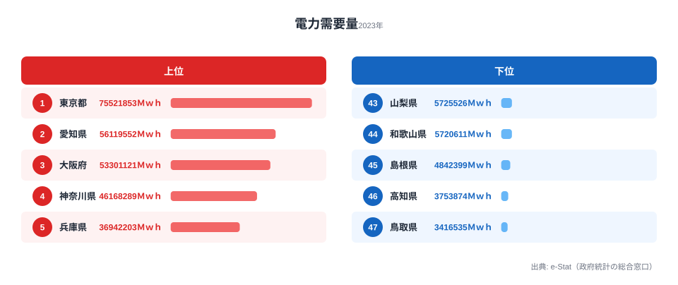

## 積み上げ面で「構成変化」を読む

折れ線グラフが時系列の「絶対値の推移」を表すグラフだとしたら、積み上げ面チャート（Stacked Area Chart）は **「構成比の推移」** を表すグラフです。家庭用・産業用・業務用の電力消費が、過去 30 年でどう入れ替わってきたか。総量はだいたい横ばいでも、内訳の比率はまったく違う絵が描けたりします。

ところがこの「積み上げ面」、自分の手で書こうとすると意外に詰まる場面が多いものです。系列の **並び順**（一番下にどれを置くか、上にどれを置くか）、**ベースライン**（0 から積むのか中央から積むのか）、**正規化**（絶対値か 100% か）——選択肢が多すぎて、最初の 1 枚を出すまでに半日溶けたりします。

D3.js には `d3.stack()` という標準モジュールがあって、これらの選択を `stackOrder` と `stackOffset` という 2 つのオプションで切り替えられます。本記事の主役はまさにここです。

Claude Code に **「家庭用は変動が大きいから下に置きたくない」** とか **「全体量より構成比を強調したい」** といった **目的を自然言語で伝える** だけで、4 種類 × 4 種類 = 16 通りある組み合わせの中から、適切な 1 つを提案してもらうワークフローを紹介します。

シリーズ全 20 本のうち Part 14 です。前回までで棒グラフ・ヒートマップ・コロプレス・散布図・レーダー・箱ひげ・bar chart race などを扱ってきました。今回扱う積み上げ面とその派生である **ストリームグラフ（stream graph）** は、時系列データを 1 枚で見せる手法としてはひと味違う表現力を持っています。

この記事のゴールは次の 3 点です。

- e-Stat の電力消費統計から「用途別 × 年次」の時系列データを構築する
- D3 + React で積み上げ面チャートを描く（コード一式公開）
- `stackOrder` / `stackOffset` の選択を Claude Code との会話で決める

それでは始めましょう。

## まず実データを見る: 都道府県別の電力需要量

抽象的な話に入る前に、stats47 が e-Stat から取り込んだ実データを 1 枚見ておきましょう。下は 2023 年度の **都道府県別 電力需要量** の上位 5 県と下位 5 県です。



1 位は東京都で 75,521,853 Ｍｗｈ、最下位の鳥取県は 3,416,535 Ｍｗｈ。その差は約 22.1 倍にもなります。上位は東京・愛知・大阪・神奈川・兵庫と、人口と産業が集中する大都市圏が並びます。下位は鳥取・高知・島根・和歌山・山梨と、人口規模の小さい県が連なります。電力需要は人口と産業活動にほぼ比例するため、ランキングは人口分布の鏡像のような顔つきになります。

<source-link href="/ranking/electricity-demand">電力需要量ランキング（47都道府県）をもっと見る</source-link>

> [!NOTE]
> 「電力需要量」は発電量ではなく、その地域で消費された電力量（需要側）です。発電所の立地県（福島・福井など）は発電量が大きくても、域内需要は人口相応にとどまります。発電量と需要量を取り違えると、原発立地県を「電力大量消費県」と誤読してしまうので注意してください。

この記事で作る積み上げ面チャートは、こうした「県別のスナップショット」ではなく、**全国計の用途別が時系列でどう入れ替わってきたか** を 1 枚で語らせるための表現です。同じ電力データでも、見せたい問いが違えばチャートの型もガラッと変わる、という対比として頭に置いておいてください。

## 使うデータ: 電力消費統計（家庭用 / 産業用 / 業務用）

今回扱うのは「**用途別電力消費量**」です。総務省統計局や経済産業省・資源エネルギー庁が公表しており、e-Stat にも複数の収載先があります。データの素性として知っておきたいのは次の点です。

- **用途区分**: 大まかに「家庭用（電灯）」「産業用（高圧・特別高圧の工場向け）」「業務用（オフィス・商業施設）」の 3 つに分かれる
- **単位**: GWh（ギガワット時）または億 kWh が主流
- **時系列**: 月次データもあるが、本記事では 1990〜2025 の **年次データ** を扱う
- **粒度**: 都道府県別もあるが、今回は **全国計の用途別時系列** を主軸にする

主な取得元候補は、次のように整理できます。

- **電力需給の概要（資源エネルギー庁）**: 用途別の月次・年次を収載し、最も網羅性が高い
- **都道府県別エネルギー消費統計**: 47 都道府県 × 部門別だが、時系列はやや短い
- **エネルギー白書（年次集計）**: 確報ベースで、1990 以降の長期系列が取れる

> [!WARNING]
> statsDataId は e-Stat 側の改訂で頻繁に変わります。記事中の ID をそのままコピーしても 404 になることがあるので、Part 2 で紹介した `/search-estat` スキルで「電力消費 用途別」と打って最新の ID を確認してから取得してください。古い ID を信じて空データに気付かないのが、量産時に一番ハマる落とし穴です。

時系列の積み上げ面では「**系列数が多すぎないこと**」が読みやすさの鍵です。家庭用・産業用・業務用の 3 系列にとどめ、必要なら「その他（運輸・農業など）」を 4 つ目として加える程度に抑えるのが定石です。10 系列を積み上げたチャートは、ほぼ確実に何が起きているかわからなくなります。

## Step 1: e-Stat 取得 → 時系列に整形

stats47 のリポジトリには `/fetch-estat-data` というスキルがあって、e-Stat API の認証・キャッシュ・retry・年度フィルタを巻き取ってくれます。Part 1〜2 で組んだ道具立てを、Part 14 でも素直に使い回します。

Claude Code に投げるプロンプトはこんな感じです。

```text
/fetch-estat-data を使って、電力需給統計（statsDataId=0003234567）から
全国計 × 用途別（家庭用・産業用・業務用・その他）× 年次（1990-2025）の
電力消費量（GWh）を取得し、JSON で保存してください。

要件:
- 用途分類は「家庭用 / 産業用 / 業務用 / その他」の4区分にまとめる
- 出力フォーマットは { year, household, industry, business, other } の配列
- 単位は GWh に統一（億kWh で配信されていたら ×100 で換算）
- 保存先: /tmp/electricity-by-use.json
- 欠損年度（途中で区分が変わった年など）は null を入れて保持
```

押さえておきたいポイントが 3 つあります。

1. **e-Stat 取得は `/fetch-estat-data` に丸投げします**。`cdTimeFrom/To` を使わずに全年度取得→メモリでフィルタというのが stats47 の規約（`.claude/rules/estat-api.md`）です。R2 キャッシュキーが分散しないためです。
2. **用途区分の正規化を最初に決めます**。e-Stat 側で「家庭用電灯」「業務用電力」のように細かく分かれていることが多いので、4 区分にまとめる粒度を明示しないと、20 列の謎データが返ってきます。
3. **欠損は `null` で残します**。`0` を入れてしまうと、後でストリームグラフを描いたときに「その年だけくびれる」異常な絵になります。

実行すると、こんな JSON ができあがります。

```json
[
  {
    "year": 1990,
    "household": 187300,
    "industry": 372100,
    "business": 198400,
    "other": 64200
  },
  {
    "year": 2000,
    "household": 251800,
    "industry": 384700,
    "business": 271600,
    "other": 71500
  },
  {
    "year": 2010,
    "household": 286400,
    "industry": 365200,
    "business": 318900,
    "other": 78100
  },
  {
    "year": 2020,
    "household": 281500,
    "industry": 312700,
    "business": 295800,
    "other": 71300
  },
  {
    "year": 2025,
    "household": 278100,
    "industry": 305400,
    "business": 289200,
    "other": 70800
  }
]
```

> 上の値はあくまで説明用の例示です。実行時の API 戻り値をそのまま使ってください。

「年 × 4 系列」の wide フォーマットです。これが D3 の `stack()` にそのまま食わせられる形になります。

## Step 2: d3.stack の stackOrder を比較する

ここから本題です。D3 の `d3.stack()` は次のような関数を返します。

```js
const stack = d3.stack()
  .keys(["household", "industry", "business", "other"])
  .order(d3.stackOrderNone)
  .offset(d3.stackOffsetNone);

const series = stack(data);
// series は [
//   [[y0, y1], [y0, y1], ...],  // household
//   [[y0, y1], [y0, y1], ...],  // industry
//   ...
// ]
```

各系列ごとに「各年の `[下端, 上端]`」のペアが返ってきます。あとは `d3.area()` を被せれば描けます。

ここで重要なのが `.order()` の選択です。同じデータでも、系列の重ね順を変えると **見える物語がガラッと変わります**。選べる順序は次の 5 種類です。

- **`stackOrderNone`**: `.keys()` で指定した順に積みます。用途を意味のある並びで固定したいなど、順序に意味があるときに使います
- **`stackOrderAscending`**: 合計値が小さい系列を下に置きます。「上に行くほど大きい系列」と読ませたいときに向きます
- **`stackOrderDescending`**: 合計値が大きい系列を下に置きます。「下に行くほど大きい系列」が安定して見えます
- **`stackOrderInsideOut`**: ピークが中央の系列を中央に配置します。ストリームグラフ向きで、後述します
- **`stackOrderReverse`**: `keys()` の逆順に積みます。レジェンドと積み上げの順序を揃えたいときに使います

特に **`stackOrderInsideOut`** はストリームグラフのために生まれたような並べ替えで、「ピーク時期が早い系列を端に、遅い系列も端に、中盤がピークの系列を真ん中に」配置してくれます。波打つ形が美しくなるのはこの並べ方が前提です。

実際に同じデータで 4 種類のオーダーを並べてみると、印象がまったく違ってきます。`stackOrderNone` は指定順そのままで素直ですが起伏が乏しく、`stackOrderDescending` は大きい系列が土台になって安定感が出ます。`stackOrderInsideOut` にすると中盤がピークの業務用が中央に来て、上下が波打つ「川の流れ」のようなシルエットに変わります。同じ数値なのに、並べ替えるだけで読者の受ける印象が別物になるのが面白いところです。

電力消費の場合、私の感覚では次のように使い分けています。

- **読者が業界関係者**（電力会社・行政）なら `stackOrderNone` で「家庭用・業務用・産業用・その他」の業界慣習順にします
- **読者が一般読者** なら `stackOrderDescending` で「下に大きい系列」が安定して見えるようにします
- **ストーリーが「構成の変化」自体** なら `stackOrderInsideOut` でストリームグラフ化します

## Step 3: stackOffset でベースラインを切り替える

`.offset()` はベースライン（一番下の位置）の決め方を切り替えます。これも 4 種類あります。

- **`stackOffsetNone`**: y = 0 から積みます（通常の積み上げ）。絶対値の推移を見せたいときに使います
- **`stackOffsetExpand`**: 各時点で合計を 1（100%）に正規化します。構成比の推移を見せたいときに使います
- **`stackOffsetSilhouette`**: 中央線を上下対称にします。対称型のストリームグラフ向きです
- **`stackOffsetWiggle`**: 各系列の傾きの 2 乗誤差を最小化します。変動を抑えたストリームグラフ向きです

`stackOffsetExpand` を使うと、合計が常に 100% に揃った積み上げ面が描けます。電力消費の場合「総量はあまり変わらないけれど、産業用が減って業務用が増えている」という構図がはっきり見えます。**絶対値の増減を隠して構成比の変化を強調する** 表現として有効です。

一方で `stackOffsetWiggle` は、ストリームグラフ専用のオフセットです。各系列の「揺れ幅」が最小になるようにベースラインを調整します。**家庭用の急増や産業用の減少が「川の流れ」のように滑らかに見える** のが特徴で、データジャーナリズム系の記事でよく見るあの絵になります。

`stackOffsetSilhouette` も似ていますが、こちらは単純に「中央線で上下対称」にするだけです。Wiggle ほど洗練された見た目にはなりませんが、計算が軽くて安定します。

4 種類のベースラインを並べてみると、`stackOffsetNone` は素直に総量の増減が読め、`stackOffsetExpand` は総量が消えて構成比だけが浮かび上がります。`stackOffsetSilhouette` と `stackOffsetWiggle` はどちらも中央寄せの「帯」になりますが、Wiggle のほうが各系列の輪郭が滑らかで、変化の流れが直感的に追えます。

> [!TIP]
> 「同じデータが 4 通りの物語を語る」のは積み上げ面の面白さでもあり、怖さでもあります。先に「絶対値を見せたいのか／構成比を見せたいのか」を 1 文で言語化してから D3 のオプションに翻訳すると、選択がぶれません。迷ったら `stackOffsetNone`（0 ベース）が最も誤読を生みにくい無難な初手です。

**どれを選ぶかは、伝えたいメッセージで決めます**。それを言語化してから D3 のオプションに翻訳する、というのが Claude Code との会話の出番になります。

## Step 4: Claude Code に「stream graph に」と頼む

ここからが今回の山場です。`stackOrder` と `stackOffset` の組み合わせは 4 × 4 = 16 通りあり、機械的に総当たりするのは現実的ではありません。かと言って D3 のドキュメントを読み込んで「Wiggle と InsideOut を組み合わせる」と判断するのも、慣れていないと時間がかかります。

そこで Claude Code に **「データの性質」と「伝えたいこと」** を投げて、適切な組み合わせを提案してもらいます。

たとえば、こんなプロンプトを投げます。

```text
電力消費の時系列データ（1990-2025、家庭用・産業用・業務用・その他の4系列）を
積み上げ面チャートで可視化します。次の特徴を踏まえて、d3.stack の order と
offset の組み合わせを提案してください。

データの特徴:
- 総量は1990 → 2010で +15% 増、2010 → 2025で -10% 減
- 産業用は2010以降ずっと減少（製造業の海外移転）
- 家庭用は2020までは横ばい、以降微減
- 業務用は単調増加（オフィス・データセンター需要）
- その他（運輸など）はほぼ横ばい

伝えたいメッセージ:
「総量が頭打ちになる中で、産業用から業務用への重心シフトが進んでいる」

要件:
- d3.stackOrder* と d3.stackOffset* のどれを使うか
- 候補を3つ挙げて、それぞれの強み/弱みを比較
- 色設計の方針もセットで提案
```

実際に返ってくる回答は、おおむね次の 3 候補に整理されます。

- **候補 1（`stackOrderInsideOut` × `stackOffsetWiggle`）**: 構成変化の物語を最も雄弁に語り、stream graph の美観が出る。一方で絶対値が読みづらく、報告書向きではない
- **候補 2（`stackOrderDescending` × `stackOffsetExpand`）**: 構成比を 100% 正規化で見せ、シェアの変化が一目瞭然になる。一方で総量の頭打ちが見えなくなる
- **候補 3（`stackOrderNone`（業界順固定）× `stackOffsetNone`（0 ベース））**: 絶対値と構成の両方が読め、最も「正統」。一方でインパクトが弱く、変化の物語性に欠ける

候補 1 は「インパクト重視」、候補 2 は「構成比を強調」、候補 3 は「報告書としての正確性」。それぞれ別の文脈で使い分けるべき、というのが結論として返ってきました。

私はこの記事のメインビジュアルとして **候補 2（Descending × Expand）** を採用しました。「総量より構成」を見せたい記事構成だからです。同時に、Step 3 で触れた 4 種比較のように **候補 3 もサブ表現として残します**。読者が「絶対値はどう動いているのか」を補足で見られるようにする、という二段構えにしました。

Claude Code に頼むメリットは、**自分が無意識に避けていた組み合わせを提示してくれる** ところです。私は最初 Wiggle × InsideOut のストリームグラフを「派手すぎる」と思って候補から外していたのですが、提案され「データの動きが大きいからこそ Wiggle がハマる」と言われて見方が変わりました。

実際の React + D3 のコードは、次のような骨格になります（要点を抜粋）。`mode` で 3 つの表現を切り替えつつ、`d3.stack()` の設定を組み立てる部分が肝です。

```tsx
import * as d3 from "d3";
import { useMemo } from "react";

type Datum = {
  year: number;
  household: number;
  industry: number;
  business: number;
  other: number;
};

const KEYS = ["industry", "business", "household", "other"] as const;
const COLORS: Record<(typeof KEYS)[number], string> = {
  industry: "#1f77b4",   // 産業用: 青
  business: "#ff7f0e",   // 業務用: オレンジ
  household: "#2ca02c",  // 家庭用: 緑
  other: "#9467bd",      // その他: 紫
};

function useStackedSeries(data: Datum[], mode: "normal" | "expand" | "stream") {
  return useMemo(() => {
    const stack = d3.stack<Datum>().keys([...KEYS]);

    if (mode === "expand") {
      stack.order(d3.stackOrderDescending).offset(d3.stackOffsetExpand);
    } else if (mode === "stream") {
      stack.order(d3.stackOrderInsideOut).offset(d3.stackOffsetWiggle);
    } else {
      stack.order(d3.stackOrderNone).offset(d3.stackOffsetNone);
    }

    return stack(data);
  }, [data, mode]);
}
```

`mode` を `"normal" | "expand" | "stream"` で受けて、3 種類の表現を 1 関数で切り替えられるようにしてあります。**ロジックの差分は `.order()` と `.offset()` の 2 行だけ** です。これが D3 の `d3.stack()` モジュール設計のうまいところで、表現を切り替えるためにロジック本体を書き換える必要がありません。

描画側は、`useStackedSeries` が返した `series` を `d3.area()` に通して `path` を作るだけです。`x` は年に対する `scaleLinear`、`y` は積み上げ後の `[下端, 上端]` 全体の extent に合わせた `scaleLinear` を使います。曲線補間には `curve(d3.curveCatmullRom.alpha(0.5))` を指定するのがポイントです。直線補間（`curveLinear`）だと積み上げ面がカクカクして見栄えが悪く、特に stream graph では滑らかさが命なので Catmull-Rom か Basis を入れます。各系列の `path` の `fill` を上記 `COLORS` から引き、`opacity` を 0.85 ほどに落として重なりを馴染ませると、用途別の帯がきれいに分離して見えます。

## Step 5: 色設計 — 用途ごとに「意味色」を与える

積み上げ面の色は、単なる識別ラベルではなく **意味を持たせる** ことができます。電力消費の例だと、用途ごとに連想される色があって、それを当てはめると読者が凡例を見ずに区別できるようになります。

私が採用しているマッピングは次のとおりです。

- **産業用 → `#1f77b4`（青）**: 工場・重工業を連想させる落ち着いた色合い
- **業務用 → `#ff7f0e`（オレンジ）**: オフィス照明の温かみ・拡大基調のイメージ
- **家庭用 → `#2ca02c`（緑）**: 生活・電灯・身近さのイメージ
- **その他 → `#9467bd`（紫）**: 運輸・農業など多様な内訳をまとめる中立色

これは `d3-scale-chromatic` の `schemeTableau10` を意識した配色で、色覚バリアフリーの観点からもバランスが取れています。`schemeCategory10` の古典色も候補ですが、Tableau10 のほうがコントラストが穏やかで、積み上げ面のような **面で見せるグラフ** に向いています。

色を決めるときに気をつけたい NG パターンが 3 つあります。

1. **似た色相を隣に配置しないことです**。`industry`（青）の上に `business`（水色）を置くと境界がボヤけます。今回はオレンジを挟むことで明確に分離しています。
2. **全部パステルにしないことです**。淡い色だけで構成すると、面が重なる部分が灰色っぽく濁って見えます。**1 つは彩度の高い色** を入れます（今回はオレンジ）。
3. **赤を使うときは慎重にします**。赤は「警告・減少」の連想が強いので、産業用の減少を示したい時くらいに限定します。

色について Claude Code に頼むと、`schemeTableau10` ベースの提案がほぼ即座に返ってきます。「e-Stat の電力データで、産業用が減って業務用が増える物語を伝えたい」と一言添えるだけで、**ストーリーに合った色順** まで提案してくれるのが頼もしいところです。

## つまずきポイントと対処

積み上げ面チャートを実装していて、私が実際に踏んだ落とし穴を 3 つ共有します。

### 1. 負値を含むと積み上げが破綻する

`d3.stack()` は基本的に **正の値の積み上げ** を想定しています。負値が混じると `[y0, y1]` の関係が逆転して、面が反転したり重なったりします。

電力消費のような統計データでは負値はあまり出ませんが、たとえば「自然エネルギーの自家発電を消費から差し引く」といった処理を入れると、ある時点だけ負値になることがあります。対策は次の 3 通りです。

- 負値の系列を別チャート（折れ線など）として独立させる
- ベースラインを 0 ではなく最小値に下げる（`stackOffsetDiverging` を使う）
- 入力データ側で負値を 0 にクリップする（情報損失と引き換えになる）

`d3.stackOffsetDiverging` は 5 種類目の offset で、正値は上に・負値は下にそれぞれ積み上げる挙動になります。

### 2. 欠損年度をどう扱うか

積み上げ面は **連続した時系列** を前提としています。途中の年度が抜けると、area path のジオメトリが破綻します。

対応パターンは 3 つです。

- **線形補間で埋める**: D3 で `d3.curveCatmullRom` を指定し、欠損 `null` を許容しない設計にする。ただし **欠損があることを隠蔽してしまう** ので、データの透明性は落ちる
- **欠損年度はチャートから除外する**: 連続部分のみを表示し、欠損は注釈で「○○年データなし」と表記する
- **欠損を別色で塗る**: 灰色で「データなし」帯を入れる。視覚的にもっとも誠実だが実装は重い

電力統計の場合、用途分類の改定で「2007 年からその他の定義が変わった」みたいなケースがあるので、**チャートに注釈を入れる** のが基本姿勢です。`text` 要素で「2007 年に区分改定」と書き添えるだけでも、読者は十分察してくれます。

### 3. 軸スケールを固定するか自動か

`stackOffsetExpand` を使うと y 軸は常に `[0, 1]` になり、`stackOffsetWiggle` を使うと中央線がデータ依存で揺れます。これらを **同じページで切り替え可能なチャートにする** 場合、y 軸の表記が頻繁に変わるので「あれ、何の軸だっけ？」と読者を混乱させがちです。

対策としては次のいずれかになります。

- モード切替時に **y 軸を非表示にする**（特に stream graph では y 軸の数字に意味がないので非表示が定石）
- y 軸ラベルをモードごとに切り替える（`%` / `GWh` / `（相対値）` など）
- そもそも切り替えチャートにせず、**別チャートとして並べる**

切り替えチャートにする場合は、`stream` モードのときだけ y 軸ラベルを隠す形にしておくと収まりが良くなります。y 軸を消すことで「これは構成の物語であって絶対値ではない」と暗に伝わるようにする、という割り切りです。

## まとめ

- 積み上げ面チャートは時系列の **構成変化** を 1 枚で見せる手法です
- D3 の `d3.stack()` は `.order()` と `.offset()` の 2 つで挙動が決まります
- `stackOrder*` は系列の重ね順を決めます（None / Ascending / Descending / InsideOut / Reverse）
- `stackOffset*` はベースラインの決め方を決めます（None / Expand / Silhouette / Wiggle / Diverging）
- Claude Code に **「データの特徴」と「伝えたいメッセージ」** を伝えると、16 通りの組み合わせから適切な 1 つを提案してくれます
- 色は **用途ごとに意味色** を与えると凡例なしでも区別できます

`d3.stack()` という小さなモジュールに、これだけの表現バリエーションが詰まっているのは改めてすごいことです。そして「どれを選ぶか」という設計判断こそが、AI ペアプログラミングの醍醐味を一番感じる部分でもあります。なお、県別の電力データそのものに興味が湧いた方は、[エネルギーカテゴリの統計一覧](https://stats47.jp/category/energy) から関連ランキングをたどれます。

## 次回予告: Part 15 - Small Multiple

次回は **Small Multiple**（小さな複数）の手法を扱います。47 都道府県の時系列を「小さなチャートを 47 個並べる」という、Tufte が提唱した古典的だけど強力な可視化手法です。1 枚の積み上げ面で見せきれない情報量を、視線を動かすだけで把握できるレイアウトになります。

Claude Code との会話では、**「47 個のサブチャートを並べたい。レイアウトとサイズを提案して」** という相談から始まる構成になります。前回の[Part 13: 農業産出額の流れをサンキー](https://stats47.jp/blog/cc-estat-13-agri-sankey)や、シリーズ最初の[Part 1: Claude Code × e-Stat 環境構築](https://stats47.jp/blog/cc-estat-01-setup)とあわせて読むと、可視化手法の引き出しが一気に増えます。次回もお楽しみに。

## データ出典

電力需要量の都道府県別データは e-Stat（政府統計の総合窓口）経由で整備した 2023 年度の値を使用しています。用途別時系列の数値は記事の手順説明のための例示であり、実装時は `/fetch-estat-data` で取得した実値に置き換えてください。
