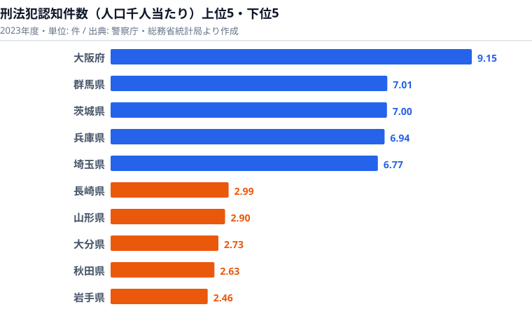

## 1. 導入: なぜ Small Multiple は「47 都道府県」と相性がいいのか

「同じ日本でも、住む県で犯罪の起こりやすさはこれほど違うのか」──刑法犯認知件数を人口千人当たりに直すと、最も高い大阪府は 9.15 件、最も低い岩手県は 2.46 件で、その開きは 3.7 倍にもなります。Claude Code × e-Stat API 実例集の **Part 15** へようこそ。今回のテーマは、この地域差を一目で見せるための **Small Multiple（スモールマルチプル）** です。

Small Multiple とは、同じ軸・同じスケールの小さなチャートを格子状に並べて、「全体傾向」と「個別の異常値」を一目で見せる手法のことです。Edward Tufte が著書『Envisioning Information』で広めた古典的なテクニックですが、47 都道府県のような **中規模カーディナリティのカテゴリ** に対しては、いまだに敵なしの可視化手法だと言えます。

「47 本の折れ線を 1 枚のチャートに重ねる」とどうなるか、一度試した人なら分かります。**色が足りません**。凡例が画面の半分を占めてしまいます。読者は 3 秒で離脱します。GA4 のセッション時間が落ちます。GSC の CTR も落ちます。完全に負のサイクルです。

一方、Small Multiple なら 47 県を 7×7 の格子に並べ、各 mini chart は「線 1 本＋全国平均の薄い線」だけにできます。読者は次の 3 ステップで情報を吸収できます。

1. 全体をぼんやり眺めて、外れ値（線の角度が異常な県）を探す
2. 気になる県の mini chart を凝視する
3. その県の見出しと数値を確認する

この記事では、警察庁の犯罪統計（人口あたり認知件数）を題材に、Claude Code で **47 枚の SVG を一括生成** するレシピを解説します。コード量は約 60 行です。プロンプトを 3 回投げるだけで、`out/sm-aichi.svg` から `out/sm-okinawa.svg` まで一式が出力されます。前回の[Part 14: 電力消費の積み上げ面チャート](/blog/cc-estat-14-energy-area-chart)では「系列を重ねて全体量を見せる」手法を扱いましたが、今回はその逆で「47 個に分解して個別の異常値を見せる」アプローチになります。

ついでに、**地理風レイアウト（北海道は左上、沖縄は右下）** で 47 枚を並べる工夫、軸のスケール統一の重要性、SVG ファイルサイズの最適化、ブログ埋め込み時の Lazy Load 戦略まで、つまずきポイントをまとめて潰していきます。

### この記事のゴール

- 警察庁の犯罪統計から「都道府県別 × 10 年分」の時系列を取得する
- D3.js（または素の SVG）で 1 県 1 mini chart を関数化する
- 47 県を 7 列 × 7 行のグリッドに配置する（共通スケール）
- 全国平均ラインを薄く重ねて「相対比較」を可能にする
- ブログ用に SVG 1 枚に集約する版と、47 枚個別 SVG 版の 2 系統を出力する

## 2. まず地域差の全体像: 上位5県と下位5県

レシピに入る前に、Small Multiple が最終的に浮かび上がらせる「地域差」の全体像を、上位5県と下位5県の横棒で先に見ておきます。題材は刑法犯認知件数（人口千人当たり）の 2023 年度値です。



最も高いのは大阪府の 9.15 件で、群馬県 7.01 件、茨城県 7.00 件、兵庫県 6.94 件、埼玉県 6.77 件と続きます。上位は大都市圏とその周縁（北関東）に偏っています。大阪・兵庫・埼玉は人口集積と昼夜人口の流動が大きく、繁華街・ターミナル・郊外の商業集積に「機会犯罪」が集まりやすい構造です。群馬・茨城が上位に入るのは意外に見えますが、自動車社会で車上荒らしや自転車盗といった軽微な窃盗が件数を押し上げる傾向があり、人口千人当たりという分母で見ると都市部に肉薄します。ここが「絶対件数では東京が突出するのに、人口当たりでは大阪が首位になる」という、正規化で順位が入れ替わる典型例です。

下位を見ると、岩手県が 2.46 件で最も低く、秋田県 2.63 件、大分県 2.73 件、山形県 2.90 件、長崎県 2.99 件が並びます。東北勢が下位に固まっているのが一目で分かります。人口密度が低く、地縁が濃く、夜間人口の流動が小さい地域では、そもそも犯罪の「機会」が発生しにくいという解釈が成り立ちます。大阪の 9.15 件と岩手の 2.46 件の差は 3.7 倍に達します。Small Multiple で 47 枚を並べると、この「西高東低・大都市圏ほど高い」という濃淡が、ランキング表を読むよりはるかに速く頭に入ります。だからこそ、47 都道府県という素材は Small Multiple と相性が良いのです。

> [!NOTE]
> ここで使っている指標は「人口千人当たり」の正規化値です。生の認知件数（件数そのもの）では、人口が多い東京・大阪・神奈川が常に上位を占め、地域差の比較になりません。正規化の分母には国勢調査年度の固定値ではなく、毎年の人口推計値を使うのが正解です（理由は §3 で後述します）。

<source-link href="/ranking/penal-code-offenses-recognized-per-1000">刑法犯認知件数（人口千人当たり）ランキングをもっと見る</source-link>

## 3. 使うデータ: 警察庁の犯罪統計（罪種別認知件数 / 人口あたり）

e-Stat に登録されている **警察庁「犯罪統計」** は、毎月更新される一次データの宝庫です。罪種（刑法犯総数、凶悪犯、粗暴犯、窃盗犯、知能犯、風俗犯、その他）× 都道府県 × 月次という細かい軸で公開されており、Small Multiple の素材として理想的です。

ただし生の認知件数のままだと「東京は多い、鳥取は少ない」という当たり前の結論しか出ません。可視化するときは必ず **人口あたり** に正規化します。前章の上位5・下位5も、すべてこの正規化を通した値です。

### データ仕様まとめ

- **提供元**: 警察庁刑事局
- **統計表 ID 例**: `0003456789`（罪種別 認知件数 都道府県別）
- **集計頻度**: 月次（年計あり）
- **期間**: 2002 年以降（10 年分の利用が現実的）
- **単位**: 件 / 人口あたり件数
- **注意点**: 2017 年に「強盗」「強制性交等」の区分変更があったため、比較は罪種別ではなく総数で行うのが無難です

正規化に使う人口データは、総務省統計局「人口推計」または「国勢調査」の中間補正値を使います。人口の分母を国勢調査年度だけで取ると、人口減少が激しい県では「分母が古いまま分子だけ減る」ことで見かけ上の改善が起こります。毎年の推計値で割るのが正解です。

> [!WARNING]
> 「人口千人当たり」で順位が決まる以上、分母（人口）の取り方で順位は簡単に揺れます。とくに人口減少が続く県では、分母を固定すると犯罪率が実態より高く出ます。前章の岩手・秋田が下位に来るのは犯罪の少なさが本質ですが、「人口減少県＝必ず低く出る」と早合点しないでください。逆に分母を古い国勢調査値で固定すると、減少県の犯罪率が過大に見える落とし穴があります。

### 罪種の選択

Small Multiple は 1 mini chart に 1〜2 系列が見やすさの限界です。今回は「**刑法犯総数**」だけを線で描き、参考に「全国平均」を薄く重ねる構成にします。

罪種別の対比を見せたい場合は、**ファセット軸を罪種にし、47 県を線で重ねる**逆構成も検討に値します。ただし 47 線が重なって読めなくなるのは前述のとおりです。素直に 47 県 × 1 線 × 全国平均が最適解になります。

## 4. Step 1: e-Stat 取得（時系列 10 年程度）

stats47 リポジトリには `/fetch-estat-data` スキルが整備されており、年次・都道府県別のデータは 1 行で取得できます。Claude Code 上で次のプロンプトを投げます。

```
/fetch-estat-data 警察庁 犯罪統計 認知件数 都道府県別 年計 2015-2024
```

スキルは内部で次の順序で動きます。

1. `search-estat` で統計表 ID を解決（`0003****`）
2. `inspect-estat-meta` で `cat01`（罪種コード）と `area`（都道府県コード）を確認
3. `fetch-estat-data` 本体で全年度・全都道府県を一括取得（年度フィルタはメモリ側）
4. R2 キャッシュに保存（同じ statsDataId のヒット率を上げる）

`.claude/rules/estat-api.md` に書いてあるとおり、**`cdTimeFrom` / `cdArea` を使わない**のが鉄則です。全件取って後でフィルタする方が、結果的にキャッシュヒット率が上がります。

### 取得結果の JSON 例

```json
{
  "stats_table_id": "0003456789",
  "title": "罪種別 認知件数 都道府県別",
  "unit": "件",
  "period": "2015-2024",
  "records": [
    { "area_code": "01000", "area_name": "北海道", "year": 2024, "crime": "刑法犯総数", "value": 38214 },
    { "area_code": "01000", "area_name": "北海道", "year": 2023, "crime": "刑法犯総数", "value": 36502 },
    { "area_code": "13000", "area_name": "東京都", "year": 2024, "crime": "刑法犯総数", "value": 92103 },
    { "area_code": "47000", "area_name": "沖縄県", "year": 2024, "crime": "刑法犯総数", "value": 4321 }
  ]
}
```

### 人口で正規化する

人口推計は別 API 呼び出しが必要です。Claude Code に次のように指示します。

```
人口推計（総務省統計局 0003448237）から、2015-2024 の都道府県別総人口を取得して、
さきほどの犯罪認知件数と (year, area_code) で join。
人口千人当たり件数 = value / population * 1000 を計算して、
out/crime-per-1k.json に書き出して。
```

Claude Code は次のような Python スクリプトを書いて実行してくれます（手で直すのは 2 行程度です）。

```python
import json
from pathlib import Path

crime = json.loads(Path("data/crime-raw.json").read_text())["records"]
pop   = json.loads(Path("data/population-raw.json").read_text())["records"]

# (area_code, year) -> population
pop_map = {(r["area_code"], r["year"]): r["value"] for r in pop}

out = []
for r in crime:
    if r["crime"] != "刑法犯総数":
        continue
    key = (r["area_code"], r["year"])
    if key not in pop_map:
        continue
    per1k = round(r["value"] / pop_map[key] * 1000, 2)
    out.append({
        "area_code": r["area_code"],
        "area_name": r["area_name"],
        "year": r["year"],
        "per1k": per1k,
    })

Path("out/crime-per-1k.json").write_text(
    json.dumps(out, ensure_ascii=False, indent=2)
)
print(f"wrote {len(out)} records")
```

出力サンプルはこうなります。

```json
[
  { "area_code": "27000", "area_name": "大阪府", "year": 2023, "per1k": 9.15 },
  { "area_code": "10000", "area_name": "群馬県", "year": 2023, "per1k": 7.01 },
  { "area_code": "03000", "area_name": "岩手県", "year": 2023, "per1k": 2.46 }
]
```

これで「47 県 × 10 年 = 470 行」のフラットな配列ができました。Small Multiple のソースデータはこれで十分です。

## 5. Step 2: 47 県を地域順 or 地理レイアウト順にソート

Small Multiple の善し悪しは **並び順** で 8 割決まります。アルファベット順（あるいは五十音順）は、最後の選択肢にしてください。読者の認知負荷が無駄に上がります。

選択肢は次の 3 つです。

### 選択肢 A: 地域ブロック順（推奨デフォルト）

北海道 → 東北 → 関東 → 中部 → 近畿 → 中国 → 四国 → 九州・沖縄の順に並べます。

これは日本人の頭の中の地理感と一致するので、迷ったらこれを選びます。前章で見た「東北勢が下位に固まる」「近畿・北関東が上位」という濃淡も、この並びなら格子の左上・右下を見るだけで読み取れます。

### 選択肢 B: 地理風レイアウト（タイルマップ）

「北海道は左上、沖縄は右下」と、実際の地図に近い格子配置をする方法です。Financial Times がよく使うアレです。コードは少し増えますが、視覚的インパクトは抜群になります。

### 選択肢 C: 指標値順（例: 2024 年の犯罪率降順）

「ランキングを兼ねた Small Multiple」として機能します。ただし、地理感が失われるので、ランキング目的でなければ非推奨です。

今回は **B の地理風タイルマップ** を採用します。Claude Code に次のプロンプトを投げます。

```
47 都道府県の地理風タイルマップ（8 列 × 12 行 or 任意）の座標表を JSON で出してほしい。
キー: area_code（5桁、"01000" 形式）、value: { row, col, area_name }
北海道 = (0, 7) みたいに、ざっくり地理的な位置で。
```

返ってくる JSON はこんな感じになります（一部抜粋）。

```json
{
  "01000": { "row": 0, "col": 7, "area_name": "北海道" },
  "02000": { "row": 1, "col": 6, "area_name": "青森県" },
  "03000": { "row": 2, "col": 7, "area_name": "岩手県" },
  "13000": { "row": 4, "col": 5, "area_name": "東京都" },
  "23000": { "row": 5, "col": 4, "area_name": "愛知県" },
  "27000": { "row": 6, "col": 3, "area_name": "大阪府" },
  "40000": { "row": 7, "col": 2, "area_name": "福岡県" },
  "47000": { "row": 8, "col": 0, "area_name": "沖縄県" }
}
```

このレイアウト表は再利用性が高いので、`data/tile-layout-jp.json` として保存しておきます。今後の Small Multiple、コロプレス代替、SNS 静止画 47 枚など、いろんな場面で流用できます。

> [!TIP]
> レイアウト方式は「五十音順（学習コスト低・視認性低）」「地域ブロック順（バランス型・迷ったらこれ）」「地理風タイル（制作コスト中・視覚的インパクト最大）」「指標値降順（ランキング目的のみ）」の 4 択で考えると整理しやすいです。読み筋としては、**まず地域ブロック順で作って傾向を掴み、SNS やトップ画像など「映え」が要る場面だけ地理風タイルに作り替える**のが費用対効果のよい順序です。

## 6. Step 3: D3 で 1 県 1 mini chart を生成（共通スケール）

ここからが Claude Code の真骨頂です。「1 県 1 mini chart を返す関数」を 1 回書いてもらい、それを 47 回 map で回します。

### Claude Code への指示

```
out/crime-per-1k.json を読み込んで、
1 都道府県について 1 つの SVG mini chart を返す関数 buildMini(areaCode) を作って。

仕様:
- サイズ 160 × 100 px
- 横軸: year（2015-2024、共通スケール）
- 縦軸: per1k（全国共通スケール、最大値は全県・全年の最大に統一）
- 折れ線: その県の per1k 推移（stroke #2563eb, width 1.8）
- 全国平均（年ごと算術平均）を薄く重ねる（stroke #94a3b8, width 1, dasharray 2 2）
- 左上に県名（font-size 11, fill #0f172a）
- 右上に最新年の値（font-size 10, fill #475569）

D3.js（v7）を使う。Node.js で jsdom 経由で document.createElement('svg') できるように。
出力は文字列（SVG 全体）。後段で組み合わせるので、buildMini 単体ではファイル書き出しはしない。
```

返ってくるコードはおよそ次のとおりです（軽く整形しています）。

```javascript
// build-mini.mjs
import * as d3 from "d3";
import { JSDOM } from "jsdom";
import fs from "node:fs";

const dom = new JSDOM("<!DOCTYPE html><html><body></body></html>");
const document = dom.window.document;

const W = 160, H = 100, MARGIN = { t: 18, r: 28, b: 16, l: 8 };
const innerW = W - MARGIN.l - MARGIN.r;
const innerH = H - MARGIN.t - MARGIN.b;

const raw = JSON.parse(fs.readFileSync("out/crime-per-1k.json", "utf-8"));

// グルーピング
const byArea = d3.group(raw, (d) => d.area_code);
const years = [...new Set(raw.map((d) => d.year))].sort();

// 共通スケール（最大値を全県統一）
const maxPer1k = d3.max(raw, (d) => d.per1k);
const x = d3.scaleLinear().domain(d3.extent(years)).range([0, innerW]);
const y = d3.scaleLinear().domain([0, maxPer1k]).nice().range([innerH, 0]);

// 全国平均
const nationalAvg = years.map((yr) => {
  const ys = raw.filter((d) => d.year === yr).map((d) => d.per1k);
  return { year: yr, per1k: d3.mean(ys) };
});

const line = d3.line()
  .x((d) => x(d.year))
  .y((d) => y(d.per1k))
  .curve(d3.curveMonotoneX);

export function buildMini(areaCode) {
  const series = byArea.get(areaCode);
  if (!series) throw new Error(`no data for ${areaCode}`);
  const sorted = [...series].sort((a, b) => a.year - b.year);
  const latest = sorted[sorted.length - 1];

  const svg = d3.select(document.body).append("svg")
    .attr("xmlns", "http://www.w3.org/2000/svg")
    .attr("viewBox", `0 0 ${W} ${H}`)
    .attr("width", W).attr("height", H);

  const g = svg.append("g")
    .attr("transform", `translate(${MARGIN.l},${MARGIN.t})`);

  // 全国平均（背景）
  g.append("path")
    .datum(nationalAvg)
    .attr("d", line)
    .attr("stroke", "#94a3b8").attr("stroke-width", 1)
    .attr("stroke-dasharray", "2 2").attr("fill", "none");

  // 都道府県の線
  g.append("path")
    .datum(sorted)
    .attr("d", line)
    .attr("stroke", "#2563eb").attr("stroke-width", 1.8).attr("fill", "none");

  // 県名（左上）
  svg.append("text")
    .attr("x", 4).attr("y", 13)
    .attr("font-size", 11).attr("fill", "#0f172a")
    .text(latest.area_name);

  // 最新年の値（右上）
  svg.append("text")
    .attr("x", W - 4).attr("y", 13)
    .attr("text-anchor", "end")
    .attr("font-size", 10).attr("fill", "#475569")
    .text(`${latest.per1k.toFixed(1)}`);

  const out = svg.node().outerHTML;
  svg.remove();
  return out;
}
```

ここで一番重要なのは **`y` スケールが 47 県すべて共通** であることです。Small Multiple は「同じ軸でしか比較できない」という鉄の掟があります。県ごとに最大値を自動算出すると、見た目は綺麗になりますが、もはや Small Multiple ではなくただの 47 個のチャートになってしまいます。前章で見た大阪 9.15 件と岩手 2.46 件の差を「線の高さの差」として正しく伝えられるのは、スケールが共通だからこそです。

## 7. Step 4: グリッド配置（7 列 × 7 行）or 地理風配置

`buildMini` ができたら、あとは並べるだけです。Claude Code に「47 枚を 1 枚の親 SVG に集約してくれ」と投げます。

### Claude Code への指示

```
buildMini を使って、47 都道府県を data/tile-layout-jp.json の (row, col) に従って配置した
1 枚の親 SVG を out/sm-jp.svg に書き出すスクリプトを書いて。

- 各 mini は 160 × 100 px
- セル間ギャップは 8 px
- 親 SVG のサイズは layout から自動算出
- 全国平均ラインの凡例を右下に小さく描く（"--- 全国平均"）
- 親 SVG の上部に title と subtitle を 1 行ずつ
```

生成されるコード（要点）はこうなります。

```javascript
// build-grid.mjs
import fs from "node:fs";
import { buildMini } from "./build-mini.mjs";

const layout = JSON.parse(fs.readFileSync("data/tile-layout-jp.json", "utf-8"));
const CELL_W = 160, CELL_H = 100, GAP = 8, HEADER = 60;

const maxCol = Math.max(...Object.values(layout).map((l) => l.col));
const maxRow = Math.max(...Object.values(layout).map((l) => l.row));
const totalW = (maxCol + 1) * (CELL_W + GAP) - GAP;
const totalH = HEADER + (maxRow + 1) * (CELL_H + GAP) - GAP + 40;

// 子 SVG タグ名は変数化しておく（埋め込み時に x/y 属性を差し込む）
const SVG_OPEN = "<" + "svg ";

let body = "";
for (const [areaCode, { row, col }] of Object.entries(layout)) {
  const x = col * (CELL_W + GAP);
  const yPx = HEADER + row * (CELL_H + GAP);
  const mini = buildMini(areaCode).replace(
    new RegExp("^" + SVG_OPEN),
    `${SVG_OPEN}x="${x}" y="${yPx}" `,
  );
  body += mini;
}

const head = `<?xml version="1.0" encoding="UTF-8"?>
${SVG_OPEN}xmlns="http://www.w3.org/2000/svg" viewBox="0 0 ${totalW} ${totalH}"
     width="${totalW}" height="${totalH}" font-family="sans-serif">
  <text x="0" y="22" font-size="20" font-weight="bold" fill="#0f172a">
    都道府県別 刑法犯認知件数（人口千人当たり）
  </text>
  <text x="0" y="44" font-size="13" fill="#475569">
    2015 - 2024 / 警察庁・総務省統計局より作成 / 共通スケール
  </text>
  ${body}
  <g transform="translate(${totalW - 160},${totalH - 24})">
    <line x1="0" y1="6" x2="20" y2="6" stroke="#94a3b8"
          stroke-width="1" stroke-dasharray="2 2"/>
    <text x="26" y="10" font-size="11" fill="#475569">全国平均</text>
  </g>
`;
const svg = head + "</" + "svg>";

fs.writeFileSync("out/sm-jp.svg", svg);
console.log(`wrote out/sm-jp.svg (${(svg.length / 1024).toFixed(1)} KB)`);
```

### 個別 SVG 47 枚版

ブログ本文では 1 枚版を埋め込み、SNS 用には 1 県 1 枚で出力したいケースが多いです。`buildMini` を流用して 47 ファイルに書き出す版を追加します。

```javascript
// build-each.mjs
import fs from "node:fs";
import { buildMini } from "./build-mini.mjs";

const layout = JSON.parse(fs.readFileSync("data/tile-layout-jp.json", "utf-8"));
const outDir = "out/each";
fs.mkdirSync(outDir, { recursive: true });

for (const [areaCode, { area_name }] of Object.entries(layout)) {
  const svg = buildMini(areaCode);
  const safe = area_name.replace(/[都道府県]/g, "");
  const path = `${outDir}/sm-${areaCode}-${safe}.svg`;
  fs.writeFileSync(path, svg);
}
console.log(`wrote 47 svg files into ${outDir}/`);
```

実行するとこうなります。

```bash
node build-each.mjs
# wrote 47 svg files into out/each/

ls out/each/ | head -5
# sm-01000-北海道.svg
# sm-02000-青森.svg
# sm-03000-岩手.svg
# sm-04000-宮城.svg
# sm-05000-秋田.svg
```

これで **Small Multiple 1 枚版** と **47 枚個別 SVG** が同じ `buildMini` を共通基盤として手に入りました。

## 8. Step 5: 強調ハイライト（全国平均ライン）

Small Multiple は「ぼんやり眺める」ためのものですが、それだけでは記憶に残りません。読者の視線を 3 秒間ロックする仕掛けが必要です。前章までで作った 47 枚に、上位5・下位5で見たような「西高東低」のコントラストを際立たせる味付けを足していきます。

代表的なテクニックは次の 3 つです。

### テクニック 1: 全国平均ラインを薄く重ねる（実装済み）

これは事実上必須です。各 mini chart に「比較対象」がないと相対的な良し悪しが分かりません。今回のコードでは既に実装済みです（`#94a3b8` ダッシュ）。

### テクニック 2: 上位・下位の県だけ枠線を色付け

全国平均より明確に高い・低い県は、mini chart の枠線を赤・青にしておくと、Small Multiple 全体を見たときに「赤いセルが集中している地域」が浮き出ます。大阪・群馬・茨城が赤、岩手・秋田が青になるイメージです。

```javascript
const nationalLatest = d3.mean(
  raw.filter((d) => d.year === 2023).map((d) => d.per1k)
);
const myLatest = latest.per1k;
const diff = (myLatest - nationalLatest) / nationalLatest;

const borderColor =
  diff > 0.2 ? "#dc2626" :  // 全国比 +20% 以上
  diff < -0.2 ? "#2563eb" : // 全国比 -20% 以上
  "#e2e8f0";

svg.append("rect")
  .attr("x", 0.5).attr("y", 0.5)
  .attr("width", W - 1).attr("height", H - 1)
  .attr("fill", "none")
  .attr("stroke", borderColor)
  .attr("stroke-width", 1);
```

### テクニック 3: 線の傾向で色分け（trend coloring）

10 年間で増加トレンドの県は線を赤、減少トレンドの県は線を青にする方法です。線形回帰の傾きで判定します。

```javascript
function slope(series) {
  const n = series.length;
  const meanX = d3.mean(series, (d) => d.year);
  const meanY = d3.mean(series, (d) => d.per1k);
  const num = d3.sum(series, (d) => (d.year - meanX) * (d.per1k - meanY));
  const den = d3.sum(series, (d) => (d.year - meanX) ** 2);
  return num / den;
}
const s = slope(sorted);
const strokeColor = s > 0.3 ? "#dc2626" : s < -0.3 ? "#2563eb" : "#475569";
```

3 つすべて適用すると情報過多になります。**1 つだけ選ぶ**のが鉄則です。今回は記事の主題が「全国平均比較」なので、テクニック 1 + 2 の組み合わせを推奨します。視覚的負荷が低いのは全国平均ライン重ね、目立つ県を浮き出させたいなら枠線色分け、増減トレンドを語りたいなら線色分け、と目的で使い分けます。

## 9. つまずきポイント

実際にこのレシピを動かしてみると、いくつか必ず引っかかる罠があります。先回りで潰しておきます。

### つまずき 1: 軸を統一し忘れる

`buildMini` の中で `d3.extent(series, (d) => d.per1k)` のように **その県だけのデータから y スケールを作る** と、見た目は綺麗ですがデータの嘘が始まります。岩手（2.46 件）と大阪（9.15 件）の mini chart が同じ縦幅で描かれてしまい、「岩手も似たような傾向」と誤読されます。

正解は、スケールを外で 1 回だけ作り、`buildMini` の中ではそれを参照するだけにすることです。コードを再掲します。

```javascript
const maxPer1k = d3.max(raw, (d) => d.per1k);
const y = d3.scaleLinear().domain([0, maxPer1k]).nice().range([innerH, 0]);
```

### つまずき 2: 47 枚のラベルが読めない

160 × 100 px に「県名 + 値 + ライン」を詰め込むと、フォントサイズの調整が苦しくなります。経験則は次のとおりです。

- 県名は **11 px**（10 px だと iPhone で潰れ、12 px だと「東京都」が窮屈になります）
- 数値は **10 px**（補助情報なので小さくて構いません）
- 余白は **左 4 px / 上 2 px** を絶対確保します

実機（iPhone 15 Pro / Pixel 8）で 1 度確認すると安心です。Chrome DevTools の Mobile Emulator では満足してはいけません。実機で見ると、Retina ディスプレイで line が消える現象に気づきます。`stroke-width: 1` ではなく `1.5` 以上にすべきです。

### つまずき 3: 出力 SVG サイズが想定外に巨大

`buildMini` を 47 回呼ぶと、SVG 1 枚あたり 5-8 KB として、合計 300 KB 前後になります。生のままブログに `` で埋め込むと LCP に響きます。

対策は次のとおりです。

- D3 が出力する小数を `path` 内で丸めます（`.toFixed(1)` まで）
- 不要な `font-family` 属性を親 SVG 1 箇所に集約します
- 改行を全削除して 1 行 SVG にします
- 最終的に SVGO で minify します

```bash
npx svgo --multipass --pretty=false out/sm-jp.svg -o out/sm-jp.min.svg
# wrote out/sm-jp.min.svg (saving 38%)
```

stats47.jp 本番では `` ではなく `<object data="...svg" />` で埋め込み、SVG を gzip 配信させます。`text/svg+xml` の gzip 圧縮率は **70-80%** が出るので、転送量は 60-90 KB に収まります。

### つまずき 4: 47 県の地理配置が「らしく」見えない

タイルマップは奥が深く、北海道の幅・沖縄の位置・四国の浮き具合などで違和感が出ます。Claude Code に「`data/tile-layout-jp.json` の sanity check をして」と投げると、距離行列を取って隣接県が遠すぎる箇所を指摘してくれます。

```
data/tile-layout-jp.json を読んで、
実際の地理的に隣接している都道府県（陸続き or フェリー直通）が
グリッド上で 2 セル以上離れている組み合わせを列挙して。

例: 北海道（01000）と 青森県（02000）は地理的に隣接だが、
グリッドが (0,7) と (1,6) なので距離 1.41。OK。
```

返ってくる「離れすぎ警告」を 3-5 回反映すると、見た目が一気に「らしく」なります。

### つまずき 5: D3 の SSR 環境構築でハマる

`jsdom` を使う Node スクリプトで D3 を動かすとき、`d3.select(document.body)` がエラーになる場合があります。原因はだいたい **`document` の参照が global ではなく dom.window 経由** であることです。

```javascript
// NG（global document が undefined）
import * as d3 from "d3";
d3.select(document.body); // ReferenceError

// OK
import { JSDOM } from "jsdom";
const dom = new JSDOM("<!DOCTYPE html><html><body></body></html>");
const document = dom.window.document;
d3.select(document.body);
```

または `global.document = dom.window.document` してから D3 を読む方法もあります。stats47 の `apps/web` 内で動かすときは `next.config.ts` の SSR とぶつかるので、**この種のスクリプトは `apps/web` の外（`packages/visualization/scripts/` 等）に置く**のが定石です。

つまずきを早見でまとめると、全県のラインが同じ高さに見えるのは y スケールが県ごとになっているのが原因で共通スケールに統一すれば直り、iPhone でラベルが潰れるのは font-size が小さすぎるのが原因で県名 11 px・数値 10 px にすれば直り、LCP が悪化するのは SVG が 300 KB と重いのが原因で SVGO + gzip 配信で直り、地理配置の違和感は手動配置の精度不足なので tile-layout の sanity check で直り、D3 が SSR で動かないのは global document が無いのが原因で jsdom + 明示参照すれば直ります。

## 10. 次回予告（Part 16: バブルチャート）

Part 15 はここまでです。次回 **Part 16** は「バブルチャート」を扱います。

バブルチャートは Small Multiple と対極の存在です。47 県を 1 枚のチャートに「散布図 + 円のサイズ = 第 3 軸」で詰め込みます。情報密度は最強です。ただし、円が重なって読めなくなる、サイズ知覚バイアス、外れ値の処理など、Small Multiple とは別系統の罠が山ほどあります。

予定している題材は次のとおりです。

- 県内総生産（GDP）× 県民所得 × 人口
- 高齢化率 × 出生率 × 人口
- 平均寿命 × 医療費 × 人口

Claude Code 視点では「Force-directed で重なりを回避する」「ラベル衝突回避」「ツールチップ実装」あたりが見どころになります。階層データの整形を会話で進める流れは[Part 12: 住宅着工をツリーマップ](/blog/cc-estat-12-housing-treemap)、分類軸を Claude Code に提案させる流れは[Part 13: 農業産出額をサンキー](/blog/cc-estat-13-agri-sankey)でも扱っているので、合わせて読むと一括レンダリングのパターンが掴めます。今回の犯罪率の地域差そのものを深掘りしたい場合は、[人口千人当たり刑法犯認知件数のランキング](https://stats47.jp/ranking/penal-code-offenses-recognized-per-1000)で全 47 県の順位を確認できます。

Small Multiple は「47 都道府県」というカーディナリティと完璧に噛み合います。Claude Code を使えば、データ取得 → 正規化 → mini chart 関数 → 47 枚一括出力までを 1 セッション 30 分で組み上げられます。手作業で 47 枚を Illustrator で並べていた時代と比べると、生産性は段違いです。今回の大阪 9.15 件 vs 岩手 2.46 件のような地域差も、47 枚を一望すれば「西高東低」の構造として一目で伝わります。Part 16 のバブルチャートでも、また同じ流れ（`/fetch-estat-data` → 関数化 → 一括レンダリング）で攻めていきます。

## データ出典

- 警察庁「犯罪統計」（罪種別 認知件数 都道府県別）
- 総務省統計局「人口推計」（人口千人当たりへの正規化に使用）
- e-Stat（政府統計の総合窓口）経由で整備
