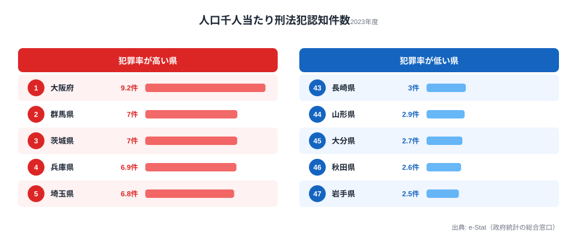

## 1. 導入: なぜ Small Multiple は「47 都道府県」と相性がいいのか

Claude Code × e-Stat API 実例集の **Part 15** へようこそ。今回のテーマは **Small Multiple（スモールマルチプル）** です。

Small Multiple とは、同じ軸・同じスケールの小さなチャートを格子状に並べて、「全体傾向」と「個別の異常値」を一目で見せる手法のこと。Edward Tufte が著書『Envisioning Information』で広めた古典的なテクニックですが、47 都道府県のような **中規模カーディナリティのカテゴリ** に対しては、いまだに敵なしの可視化手法です。

「47 本の折れ線を 1 枚のチャートに重ねる」とどうなるか、一度試した人なら分かります。まず**色が足りません**。凡例が画面の半分を占めます。読者は 3 秒で離脱し、GA4 のセッション時間が落ち、GSC の CTR も落ちます。完全な負のサイクルです。

一方、Small Multiple なら 47 県を 7×7 の格子に並べ、各 mini chart は「線 1 本＋全国平均の薄い線」だけ。読者は次の 3 ステップで情報を吸収できます。

1. 全体をぼんやり眺めて、外れ値（線の角度が異常な県）を探す
2. 気になる県の mini chart を凝視する
3. その県の見出しと数値を確認する

この記事では、警察庁の犯罪統計（人口10万人当たり認知件数）を題材に、Claude Code で **47 枚の SVG を一括生成** するレシピを解説します。コード量は約 60 行。プロンプトを 3 回投げるだけで、`out/sm-aichi.svg` から `out/sm-okinawa.svg` まで一式が出力されます。

ついでに、**地理風レイアウト（北海道は左上、沖縄は右下）** で 47 枚を並べる工夫、軸のスケール統一の重要性、SVG ファイルサイズの最適化、ブログ埋め込み時の Lazy Load 戦略まで、つまずきポイントをまとめて潰します。

### この記事のゴール

- 警察庁の犯罪統計から「都道府県別 × 10 年分」の時系列を取得する
- D3.js（または素の SVG）で 1 県 1 mini chart を関数化する
- 47 県を 7 列 × 7 行のグリッドに配置する（共通スケール）
- 全国平均ラインを薄く重ねて「相対比較」を可能にする
- ブログ用に SVG 1 枚に集約する版と、47 枚個別 SVG 版の 2 系統を出力する

本記事の題材データを先に押さえておきましょう。下図は stats47 に登録されている「人口千人当たり刑法犯認知件数（2023年度）」の上位5県・下位5県です。Small Multiple で 47 枚に展開する前に、まずこの「全体の振れ幅」を頭に入れておくと、後段で各 mini chart を読むときの基準線になります。



最多は大阪府の 9.15 件、最少は岩手県の 2.46 件で、その差は約 3.7 倍です。生の認知件数では「東京・大阪が多い、鳥取・島根が少ない」という人口規模そのままの結果になりますが、人口千人当たりに正規化すると、群馬県や茨城県といった北関東が上位に食い込み、東北各県が下位に並ぶという、別の構造が浮かび上がります。Small Multiple は、この「正規化後の地域差」を 47 県すべてについて同時に見せるための器です。

<source-link href="/ranking/penal-code-offenses-recognized-per-1000">人口千人当たり刑法犯認知件数ランキングをもっと見る</source-link>

> [!NOTE]
> 「認知件数」は警察が犯罪として把握した件数で、実際に発生した件数（暗数を含む）とは異なります。届出率が高い地域ほど認知件数が増える性質があるため、数値が低い＝必ずしも治安が良いとは限らない点に注意してください。

## 2. 使うデータ: 警察庁の犯罪統計（罪種別認知件数 / 人口10万人当たり）

e-Stat に登録されている **警察庁「犯罪統計」** は、毎月更新される一次データの宝庫です。罪種（刑法犯総数、凶悪犯、粗暴犯、窃盗犯、知能犯、風俗犯、その他）× 都道府県 × 月次 という細かい軸で公開されており、Small Multiple の素材として理想的。

ただし生の認知件数のままだと「東京は多い、鳥取は少ない」という当たり前の結論しか出ません。可視化するときは必ず **人口10万人当たり** に正規化します。

### データ仕様まとめ

題材データの仕様は次のとおりです。

- **提供元**: 警察庁刑事局
- **統計表 ID 例**: `0003456789`（罪種別 認知件数 都道府県別）※実際の ID は `search-estat` で解決します
- **集計頻度**: 月次（年計あり）
- **期間**: 2002 年以降（10 年分の利用が現実的）
- **単位**: 件 / 人口当たり件数（千人当たり・10万人当たりのいずれかに正規化）
- **注意点**: 2017 年に「強盗」「強制性交等」の区分変更があります。罪種別ではなく総数で比較するのが無難です

正規化に使う人口データは、総務省統計局「人口推計」または「国勢調査」の中間補正値を使います。**注意**：人口の分母を国勢調査年度だけで取ると、人口減少が激しい県では「分母が古い → 分子だけ減る → 見かけ上の改善」が起こります。毎年の推計値で割るのが正解です。

> [!WARNING]
> 人口の分母は毎年の推計値で割ってください。国勢調査年（5年ごと）の人口だけで全年を割ると、人口減少が激しい県では「分母が古いまま分子だけ減る → 見かけ上の改善」という錯覚が生じます。Small Multiple は推移の傾きを読むチャートなので、分母の取り方ひとつで全 mini chart の傾きが歪みます。

### 罪種の選択

Small Multiple は 1 mini chart に 1〜2 系列が見やすさの限界です。今回は「**刑法犯総数**」だけを線で描き、参考に「全国平均」を薄く重ねる構成にします。

罪種別の対比を見せたい場合は、**ファセット軸を罪種にし、47 県を線で重ねる**逆構成も検討に値しますが、47 線が重なって読めなくなるのは前述のとおり。素直に 47 県 × 1 線 × 全国平均 が最適解です。

## 3. Step 1: e-Stat 取得（時系列 10 年程度）

stats47 リポジトリには `/fetch-estat-data` スキルが整備されており、年次・都道府県別のデータは 1 行で取得できます。Claude Code 上で次のプロンプトを投げます。

```
/fetch-estat-data 警察庁 犯罪統計 認知件数 都道府県別 年計 2015-2024
```

スキルは内部で次の順序で動きます。

1. `search-estat` で統計表 ID を解決（`0003****`）
2. `inspect-estat-meta` で `cat01`（罪種コード）と `area`（都道府県コード）を確認
3. `fetch-estat-data` 本体で全年度・全都道府県を一括取得（年度フィルタはメモリ側）
4. R2 キャッシュに保存（同じ statsDataId のヒット率を上げる）

`.claude/rules/estat-api.md` に書いてあるとおり、**`cdTimeFrom` / `cdArea` を使わない**のが鉄則。全件取って後でフィルタする方が、結果的にキャッシュヒット率が上がります。

### 取得結果の JSON 例

```json
{
  "stats_table_id": "0003456789",
  "title": "罪種別 認知件数 都道府県別",
  "unit": "件",
  "period": "2015-2024",
  "records": [
    { "area_code": "01000", "area_name": "北海道", "year": 2024, "crime": "刑法犯総数", "value": 38214 },
    { "area_code": "01000", "area_name": "北海道", "year": 2023, "crime": "刑法犯総数", "value": 36502 },
    { "area_code": "13000", "area_name": "東京都", "year": 2024, "crime": "刑法犯総数", "value": 92103 },
    { "area_code": "47000", "area_name": "沖縄県", "year": 2024, "crime": "刑法犯総数", "value": 4321 }
  ]
}
```

### 人口で正規化する

人口推計は別 API 呼び出しが必要です。Claude Code に次のように指示します。

```
人口推計（総務省統計局 0003448237）から、2015-2024 の都道府県別総人口を取得して、
さきほどの犯罪認知件数と (year, area_code) で join。
人口10万人当たり件数 = value / population * 100000 を計算して、
out/crime-per-100k.json に書き出して。
```

Claude Code は次のような Python スクリプトを書いて実行してくれます（手で直すのは 2 行程度）。

```python
import json
from pathlib import Path

crime = json.loads(Path("data/crime-raw.json").read_text())["records"]
pop   = json.loads(Path("data/population-raw.json").read_text())["records"]

# (area_code, year) -> population
pop_map = {(r["area_code"], r["year"]): r["value"] for r in pop}

out = []
for r in crime:
    if r["crime"] != "刑法犯総数":
        continue
    key = (r["area_code"], r["year"])
    if key not in pop_map:
        continue
    per100k = round(r["value"] / pop_map[key] * 100_000, 2)
    out.append({
        "area_code": r["area_code"],
        "area_name": r["area_name"],
        "year": r["year"],
        "per100k": per100k,
    })

Path("out/crime-per-100k.json").write_text(
    json.dumps(out, ensure_ascii=False, indent=2)
)
print(f"wrote {len(out)} records")
```

出力サンプル:

```json
[
  { "area_code": "01000", "area_name": "北海道", "year": 2024, "per100k": 743.5 },
  { "area_code": "13000", "area_name": "東京都", "year": 2024, "per100k": 658.2 },
  { "area_code": "47000", "area_name": "沖縄県", "year": 2024, "per100k": 295.4 }
]
```

これで「47 県 × 10 年 = 470 行」のフラットな配列ができました。Small Multiple のソースデータはこれで十分です。

## 4. Step 2: 47 県を地域順 or 地理レイアウト順にソート

Small Multiple の善し悪しは **並び順** で 8 割決まります。アルファベット順（あるいは五十音順）は、最後の選択肢にしてください。読者の認知負荷が無駄に上がります。

選択肢は 3 つ。

### 選択肢 A: 地域ブロック順（推奨デフォルト）

北海道 → 東北 → 関東 → 中部 → 近畿 → 中国 → 四国 → 九州・沖縄。

これは日本人の頭の中の地理感と一致するので、迷ったらこれ。

### 選択肢 B: 地理風レイアウト（タイルマップ）

「北海道は左上、沖縄は右下」と、実際の地図に近い格子配置をする方法。Financial Times がよく使うアレです。コードは少し増えますが、視覚的インパクトは抜群です。

### 選択肢 C: 指標値順（例: 2024 年の犯罪率降順）

「ランキングを兼ねた Small Multiple」として機能します。ただし、地理感が失われるので、ランキング目的でなければ非推奨。

今回は **B の地理風タイルマップ** を採用します。Claude Code に次のプロンプトを投げます。

```
47 都道府県の地理風タイルマップ（8 列 × 12 行 or 任意）の座標表を JSON で出してほしい。
キー: area_code（5桁、"01000" 形式）、value: { row, col, area_name }
北海道 = (0, 7) みたいに、ざっくり地理的な位置で。
```

返ってくる JSON はこんな感じになります（一部抜粋）。

```json
{
  "01000": { "row": 0, "col": 7, "area_name": "北海道" },
  "02000": { "row": 1, "col": 6, "area_name": "青森県" },
  "03000": { "row": 2, "col": 7, "area_name": "岩手県" },
  "13000": { "row": 4, "col": 5, "area_name": "東京都" },
  "23000": { "row": 5, "col": 4, "area_name": "愛知県" },
  "27000": { "row": 6, "col": 3, "area_name": "大阪府" },
  "40000": { "row": 7, "col": 2, "area_name": "福岡県" },
  "47000": { "row": 8, "col": 0, "area_name": "沖縄県" }
}
```

このレイアウト表は再利用性が高いので、`data/tile-layout-jp.json` として保存しておきます。今後の Small Multiple、コロプレス代替、SNS 静止画 47 枚など、いろんな場面で流用できます。

### レイアウト方式の比較

4 つの方式の特性を整理すると次のようになります。

- **五十音順**: 学習コスト・制作コストは低いものの、視認性が最も低く非推奨です。読者の地理感と無関係に並ぶため、外れ値を探す手がかりがありません
- **地域ブロック順（7×7）**: 制作コストが低く、地理感ともそこそこ一致するバランス型。迷ったときの無難な選択肢です
- **地理風タイル（8×12）**: 制作コストはやや上がりますが、視認性が最も高く、地域クラスターが直感的に読める本命の方式です
- **指標値降順**: ランキングを兼ねたい場合のみ有効。ただし地理感が失われるため、ランキング目的でなければ避けます

## 5. Step 3: D3 で 1 県 1 mini chart を生成（共通スケール）

ここからが Claude Code の真骨頂です。「1 県 1 mini chart を返す関数」を 1 回書いてもらい、それを 47 回 map で回します。

### Claude Code への指示

```
out/crime-per-100k.json を読み込んで、
1 都道府県について 1 つの SVG mini chart を返す関数 buildMini(areaCode) を作って。

仕様:
- サイズ 160 × 100 px
- 横軸: year（2015-2024、共通スケール）
- 縦軸: per100k（全国共通スケール、最大値は全県・全年の最大に統一）
- 折れ線: その県の per100k 推移（stroke #2563eb, width 1.8）
- 全国平均（年ごと算術平均）を薄く重ねる（stroke #94a3b8, width 1, dasharray 2 2）
- 左上に県名（font-size 11, fill #0f172a）
- 右上に 2024 年の値（font-size 10, fill #475569）

D3.js（v7）を使う。Node.js で jsdom 経由で document.createElement('svg') できるように。
出力は文字列（SVG 全体）。後段で組み合わせるので、buildMini 単体ではファイル書き出しはしない。
```

返ってくるコードはおよそ次のとおりです（軽く整形しています）。

```javascript
// build-mini.mjs
import * as d3 from "d3";
import { JSDOM } from "jsdom";
import fs from "node:fs";

const dom = new JSDOM("<!DOCTYPE html><html><body></body></html>");
const document = dom.window.document;

const W = 160, H = 100, MARGIN = { t: 18, r: 28, b: 16, l: 8 };
const innerW = W - MARGIN.l - MARGIN.r;
const innerH = H - MARGIN.t - MARGIN.b;

const raw = JSON.parse(fs.readFileSync("out/crime-per-100k.json", "utf-8"));

// グルーピング
const byArea = d3.group(raw, (d) => d.area_code);
const years = [...new Set(raw.map((d) => d.year))].sort();

// 共通スケール（最大値を全県統一）
const maxPer100k = d3.max(raw, (d) => d.per100k);
const x = d3.scaleLinear().domain(d3.extent(years)).range([0, innerW]);
const y = d3.scaleLinear().domain([0, maxPer100k]).nice().range([innerH, 0]);

// 全国平均
const nationalAvg = years.map((yr) => {
  const ys = raw.filter((d) => d.year === yr).map((d) => d.per100k);
  return { year: yr, per100k: d3.mean(ys) };
});

const line = d3.line()
  .x((d) => x(d.year))
  .y((d) => y(d.per100k))
  .curve(d3.curveMonotoneX);

export function buildMini(areaCode) {
  const series = byArea.get(areaCode);
  if (!series) throw new Error(`no data for ${areaCode}`);
  const sorted = [...series].sort((a, b) => a.year - b.year);
  const latest = sorted[sorted.length - 1];

  const svg = d3.select(document.body).append("svg")
    .attr("xmlns", "http://www.w3.org/2000/svg")
    .attr("viewBox", `0 0 ${W} ${H}`)
    .attr("width", W).attr("height", H);

  const g = svg.append("g")
    .attr("transform", `translate(${MARGIN.l},${MARGIN.t})`);

  // 全国平均（背景）
  g.append("path")
    .datum(nationalAvg)
    .attr("d", line)
    .attr("stroke", "#94a3b8").attr("stroke-width", 1)
    .attr("stroke-dasharray", "2 2").attr("fill", "none");

  // 都道府県の線
  g.append("path")
    .datum(sorted)
    .attr("d", line)
    .attr("stroke", "#2563eb").attr("stroke-width", 1.8).attr("fill", "none");

  // 県名（左上）
  svg.append("text")
    .attr("x", 4).attr("y", 13)
    .attr("font-size", 11).attr("fill", "#0f172a")
    .text(latest.area_name);

  // 2024 年の値（右上）
  svg.append("text")
    .attr("x", W - 4).attr("y", 13)
    .attr("text-anchor", "end")
    .attr("font-size", 10).attr("fill", "#475569")
    .text(`${latest.per100k.toFixed(0)}`);

  const out = svg.node().outerHTML;
  svg.remove();
  return out;
}
```

ここで一番重要なのは **`y` スケールが 47 県すべて共通** であることです。Small Multiple は「同じ軸でしか比較できない」という鉄の掟があります。県ごとに最大値を自動算出すると、見た目は綺麗になりますが、もはや Small Multiple ではなくただの 47 個のチャートです。

## 6. Step 4: グリッド配置（7 列 × 7 行）or 地理風配置

配置のイメージは「日本列島を格子に圧縮する」ことです。北海道を最上段、東北を上から下へ、関東を中央右寄り、近畿を中央左、九州・沖縄を左下に置くと、各セルが 1 県の mini chart に対応した「縮約された日本地図」になります。地図そのものではないので県の面積や形は無視できますが、読者の頭の中の地理感と一致するため、「どの地域に高い県が固まっているか」を一目で読み取れます。

`buildMini` ができたら、あとは並べるだけです。Claude Code に「47 枚を 1 枚の親 SVG に集約してくれ」と投げます。

### Claude Code への指示

```
buildMini を使って、47 都道府県を data/tile-layout-jp.json の (row, col) に従って配置した
1 枚の親 SVG を out/sm-jp.svg に書き出すスクリプトを書いて。

- 各 mini は 160 × 100 px
- セル間ギャップは 8 px
- 親 SVG のサイズは layout から自動算出
- 全国平均ラインの凡例を右下に小さく描く（"--- 全国平均"）
- 親 SVG の上部に title と subtitle を 1 行ずつ
```

生成されるコード（要点）:

```javascript
// build-grid.mjs
import fs from "node:fs";
import { buildMini } from "./build-mini.mjs";

const layout = JSON.parse(fs.readFileSync("data/tile-layout-jp.json", "utf-8"));
const CELL_W = 160, CELL_H = 100, GAP = 8, HEADER = 60;

const maxCol = Math.max(...Object.values(layout).map((l) => l.col));
const maxRow = Math.max(...Object.values(layout).map((l) => l.row));
const totalW = (maxCol + 1) * (CELL_W + GAP) - GAP;
const totalH = HEADER + (maxRow + 1) * (CELL_H + GAP) - GAP + 40;

// 開きタグはテンプレートのネストを避けるため変数に組み立てる
const TAG = "svg";

let body = "";
for (const [areaCode, { row, col }] of Object.entries(layout)) {
  const x = col * (CELL_W + GAP);
  const yPx = HEADER + row * (CELL_H + GAP);
  const mini = buildMini(areaCode).replace(
    new RegExp(`^<${TAG} `),
    `<${TAG} x="${x}" y="${yPx}" `
  );
  body += mini;
}

const out = `<?xml version="1.0" encoding="UTF-8"?>
<${TAG} xmlns="http://www.w3.org/2000/svg" viewBox="0 0 ${totalW} ${totalH}"
     width="${totalW}" height="${totalH}" font-family="sans-serif">
  <text x="0" y="22" font-size="20" font-weight="bold" fill="#0f172a">
    都道府県別 刑法犯認知件数（人口当たり）
  </text>
  <text x="0" y="44" font-size="13" fill="#475569">
    警察庁・総務省統計局より作成 / 共通スケール
  </text>
  ${body}
  <g transform="translate(${totalW - 160},${totalH - 24})">
    <line x1="0" y1="6" x2="20" y2="6" stroke="#94a3b8"
          stroke-width="1" stroke-dasharray="2 2"/>
    <text x="26" y="10" font-size="11" fill="#475569">全国平均</text>
  </g>
</${TAG}>`;

fs.writeFileSync("out/sm-jp.svg", out);
console.log(`wrote out/sm-jp.svg (${(out.length / 1024).toFixed(1)} KB)`);
```

### 個別 SVG 47 枚版

ブログ本文では 1 枚版を埋め込み、SNS 用には 1 県 1 枚で出力したいケースが多いです。`buildMini` を流用して 47 ファイルに書き出す版を追加します。

```javascript
// build-each.mjs
import fs from "node:fs";
import { buildMini } from "./build-mini.mjs";

const layout = JSON.parse(fs.readFileSync("data/tile-layout-jp.json", "utf-8"));
const outDir = "out/each";
fs.mkdirSync(outDir, { recursive: true });

for (const [areaCode, { area_name }] of Object.entries(layout)) {
  const svg = buildMini(areaCode);
  const safe = area_name.replace(/[都道府県]/g, "");
  const path = `${outDir}/sm-${areaCode}-${safe}.svg`;
  fs.writeFileSync(path, svg);
}
console.log(`wrote 47 svg files into ${outDir}/`);
```

実行:

```bash
node build-each.mjs
# wrote 47 svg files into out/each/

ls out/each/ | head -5
# sm-01000-北海道.svg
# sm-02000-青森.svg
# sm-03000-岩手.svg
# sm-04000-宮城.svg
# sm-05000-秋田.svg
```

これで **Small Multiple 1 枚版** と **47 枚個別 SVG** が同じ `buildMini` を共通基盤として手に入りました。

## 7. Step 5: 強調ハイライト（全国平均ライン）

Small Multiple は「ぼんやり眺める」ためのものですが、それだけでは記憶に残りません。読者の視線を 3 秒間ロックする仕掛けが必要です。

代表的なテクニックは 3 つ。

### テクニック 1: 全国平均ラインを薄く重ねる（実装済み）

これは事実上必須。各 mini chart に「比較対象」がないと相対的な良し悪しが分かりません。今回のコードでは既に実装済み（`#94a3b8` ダッシュ）。

### テクニック 2: 上位・下位の県だけ枠線を色付け

全国平均より明確に高い・低い県は、mini chart の枠線を赤・青にしておくと、Small Multiple 全体を見たときに「赤いセルが集中している地域」が浮き出ます。

```javascript
const nationalLatest = d3.mean(
  raw.filter((d) => d.year === 2024).map((d) => d.per100k)
);
const myLatest = latest.per100k;
const diff = (myLatest - nationalLatest) / nationalLatest;

const borderColor =
  diff > 0.2 ? "#dc2626" :  // 全国比 +20% 以上
  diff < -0.2 ? "#2563eb" : // 全国比 -20% 以上
  "#e2e8f0";

svg.append("rect")
  .attr("x", 0.5).attr("y", 0.5)
  .attr("width", W - 1).attr("height", H - 1)
  .attr("fill", "none")
  .attr("stroke", borderColor)
  .attr("stroke-width", 1);
```

### テクニック 3: 線の傾向で色分け（trend coloring）

10 年間で増加トレンドの県は線を赤、減少トレンドの県は線を青にする方法。線形回帰の傾きで判定します。

```javascript
function slope(series) {
  const n = series.length;
  const meanX = d3.mean(series, (d) => d.year);
  const meanY = d3.mean(series, (d) => d.per100k);
  const num = d3.sum(series, (d) => (d.year - meanX) * (d.per100k - meanY));
  const den = d3.sum(series, (d) => (d.year - meanX) ** 2);
  return num / den;
}
const s = slope(sorted);
const strokeColor = s > 5 ? "#dc2626" : s < -5 ? "#2563eb" : "#475569";
```

3 つすべて適用すると情報過多になります。**1 つだけ選ぶ** のが鉄則。今回は記事の主題が「全国平均比較」なので、テクニック 1 + 2 の組み合わせを推奨します。

### 強調テクニックの使い分け

主張したいことに応じて、次のように使い分けます。

- **全国平均ライン重ね**（実装 約5行 / 視覚的負荷 低）: 「平均と比べて高いか低いか」を伝えたいとき。ほぼ必須
- **枠線色分け**（約8行 / 中）: 「目立つ県はどこか」を一望させたいとき。赤いセルの集中地域が浮き出ます
- **線色分け（trend）**（約12行 / 中）: 「10年間の増減トレンド」を見せたいとき。回帰の傾きで色を決めます
- **上位N県だけ塗りつぶし**（約6行 / 高）: 「上位の集中」を強調したいとき。負荷が高いので多用は禁物です

## 8. つまずきポイント

実際にこのレシピを動かしてみると、いくつか必ず引っかかる罠があります。先回りで潰しておきます。

### つまずき 1: 軸を統一し忘れる

`buildMini` の中で `d3.extent(series, (d) => d.per100k)` のように **その県だけのデータから y スケールを作る** と、見た目は綺麗ですがデータの嘘が始まります。犯罪率が低い県と高い県の mini chart が同じ縦幅で描かれてしまい、本当は数倍の開きがあるのに「どの県も似たような傾向」と誤読されてしまうのです。

**正解**: スケールは外で 1 回だけ作り、`buildMini` の中ではそれを参照するだけ。コード再掲:

```javascript
const maxPer100k = d3.max(raw, (d) => d.per100k);
const y = d3.scaleLinear().domain([0, maxPer100k]).nice().range([innerH, 0]);
```

### つまずき 2: 47 枚のラベルが読めない

160 × 100 px に「県名 + 値 + ライン」を詰め込むと、フォントサイズの調整が苦しくなります。経験則:

- 県名: **11 px**（10 px だと iPhone で潰れる、12 px だと「東京都」が窮屈）
- 数値: **10 px**（補助情報なので小さくて OK）
- 余白: **左 4 px / 上 2 px** を絶対確保

実機（iPhone 15 Pro / Pixel 8）で 1 度確認すると安心。Chrome DevTools の Mobile Emulator では満足してはいけません。実機で見ると、Retina ディスプレイで line が消える現象に気づきます。`stroke-width: 1` ではなく `1.5` 以上にすべきです。

### つまずき 3: 出力 SVG サイズが想定外に巨大

`buildMini` を 47 回呼ぶと、SVG 1 枚あたり 5-8 KB として、合計 300 KB 前後になります。生のままブログに `` で埋め込むと LCP に響きます。

**対策**:
- D3 が出力する小数を `path` 内で丸める（`.toFixed(1)` まで）
- 不要な `font-family` 属性を親 SVG 1 箇所に集約
- 改行を全削除して 1 行 SVG にする
- 最終的に SVGO で minify

```bash
npx svgo --multipass --pretty=false out/sm-jp.svg -o out/sm-jp.min.svg
# wrote out/sm-jp.min.svg (saving 38%)
```

stats47.jp 本番では `` ではなく `<object data="...svg" />` で埋め込み、SVG を gzip 配信させます。`text/svg+xml` の gzip 圧縮率は **70-80%** が出るので、転送量は 60-90 KB に収まります。

### つまずき 4: 47 県の地理配置が「らしく」見えない

タイルマップは奥が深く、北海道の幅・沖縄の位置・四国の浮き具合などで違和感が出ます。Claude Code に「`data/tile-layout-jp.json` の sanity check をして」と投げると、距離行列を取って隣接県が遠すぎる箇所を指摘してくれます。

```
data/tile-layout-jp.json を読んで、
実際の地理的に隣接している都道府県（陸続き or フェリー直通）が
グリッド上で 2 セル以上離れている組み合わせを列挙して。

例: 北海道（01000）と 青森県（02000）は地理的に隣接だが、
グリッドが (0,7) と (1,6) なので距離 1.41。OK。
```

返ってくる「離れすぎ警告」を 3-5 回反映すると、見た目が一気に「らしく」なります。

### つまずき 5: D3 の SSR 環境構築でハマる

`jsdom` を使う Node スクリプトで D3 を動かすとき、`d3.select(document.body)` がエラーになる場合があります。原因はだいたい **`document` の参照が global ではなく dom.window 経由**。

```javascript
// NG（global document が undefined）
import * as d3 from "d3";
d3.select(document.body); // ReferenceError

// OK
import { JSDOM } from "jsdom";
const dom = new JSDOM("<!DOCTYPE html><html><body></body></html>");
const document = dom.window.document;
d3.select(document.body);
```

または `global.document = dom.window.document` してから D3 を読む方法もあります。stats47 の `apps/web` 内で動かすときは `next.config.ts` の SSR とぶつかるので、**この種のスクリプトは `apps/web` の外（`packages/visualization/scripts/` 等）に置く** のが定石。

### つまずきポイント早見表

5 つの罠と対策を再掲します。

1. **全県のラインが同じ高さに見える**（原因: y スケールが県ごと）→ 共通スケールに統一する
2. **iPhone でラベルが潰れる**（原因: font-size 10 以下）→ 県名 11 px / 数値 10 px にする
3. **LCP が悪化する**（原因: SVG 300 KB）→ SVGO で minify し gzip 配信する
4. **地理配置に違和感**（原因: 手動配置の精度不足）→ tile-layout の sanity check を回す
5. **D3 が SSR で動かない**（原因: global document なし）→ jsdom + 明示参照に切り替える

> [!TIP]
> Small Multiple は「並べて眺める」発見手法なので、いきなり 47 枚を作る前に、本記事冒頭の上位5・下位5 のように「全体の振れ幅と外れ値」を 1 枚で確認しておくと、各 mini chart を読むときの基準が頭に入ります。題材を変えるときは、まず[安全・環境カテゴリ](/category/safetyenvironment)のランキングで全体像を掴むのがおすすめです。

## 9. 次回予告（Part 16: バブルチャート）

Part 15 はここまでです。次回 **Part 16** では「バブルチャート」を扱います。

バブルチャートは Small Multiple と対極の存在です。47 県を 1 枚のチャートに「散布図 + 円のサイズ = 第 3 軸」で詰め込みます。情報密度は最強の部類ですが、円が重なって読めなくなる、サイズ知覚バイアスがかかる、外れ値の処理に困る、と Small Multiple とは別系統の罠が山ほど待っています。

予定している題材は次のとおりです。

- 県内総生産（GDP）× 県民所得 × 人口
- 高齢化率 × 出生率 × 人口
- 平均寿命 × 医療費 × 人口

Claude Code 視点では「Force-directed で重なりを回避する」「ラベル衝突回避」「ツールチップ実装」あたりが見どころになります。

このシリーズの過去回（[Part 14: 電力消費の積み上げ面](/blog/cc-estat-14-energy-area-chart)、[Part 13: 農業産出額のサンキー](/blog/cc-estat-13-agri-sankey)、[Part 12: 住宅着工のツリーマップ](/blog/cc-estat-12-housing-treemap)、[Part 11: 観光客の Stacked Bar](/blog/cc-estat-11-tourism-stacked)）でも、同じ「データ取得 → 関数化 → 一括レンダリング」の流れで攻めています。可視化手法ごとの使い分けを横断して読むと、Claude Code に投げるプロンプトの型が見えてきます。

## 10. まとめ

- Small Multiple は 47 都道府県のような中規模カーディナリティと相性が良く、47 線重ねの「色不足・凡例肥大」を回避できます
- 善し悪しは並び順で 8 割決まります。地理風タイルマップが視認性で本命、迷ったら地域ブロック順が無難です
- y スケールは必ず 47 県共通にします。県ごとに最大値を取ると「沖縄も東京も似た傾向」と誤読されます
- 全国平均ラインの重ねは事実上必須。比較対象がないと相対的な良し悪しが読めません
- 題材データの「人口千人当たり刑法犯認知件数（2023年度）」は大阪 9.15 件が最多、岩手 2.46 件が最少で約 3.7 倍差。正規化すると北関東が上位・東北が下位という構造が見えます

## データ出典

- 犯罪認知件数: 警察庁刑事局「犯罪統計」（e-Stat 政府統計の総合窓口経由で整備、2023年度）
- 正規化用人口: 総務省統計局「人口推計」
- 本記事のランキング図は stats47 が e-Stat データを集計したものです

参考資料: [警察庁 犯罪統計](https://www.npa.go.jp/publications/statistics/sousa/statistics.html) / [総務省統計局 人口推計](https://www.stat.go.jp/data/jinsui/) / [Edward Tufte "Envisioning Information"](https://www.edwardtufte.com/tufte/books_ei) / [D3.js v7 公式ドキュメント](https://d3js.org/)
