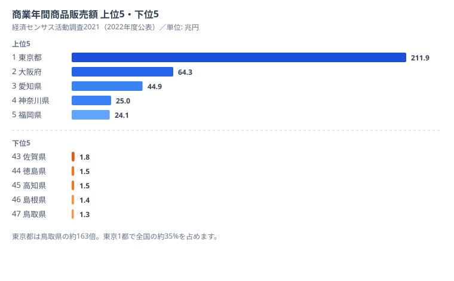

## バブルチャートは「3 軸を 1 枚にたたみ込む」最終兵器です

棒グラフ、折れ線、散布図と続けてきたこの連載も Part 16 になりました。データ可視化を続けていると必ず一度はぶつかる壁があります。「軸が足りない」問題です。

たとえば商業販売額のランキングを作ろうと思ったら、すぐに気になることが出てきます。「東京の販売額がデカいのは当たり前じゃないか？　人口が多いんだから」「いや、人口当たりで割ったら鳥取の方が高いんじゃないの？」「従業者数で割るとどうなる？」。こうした疑問に答えるには 1 つの棒グラフでは足りません。少なくとも 3 つの数字を同時に見せる必要があります。

ここで登場するのがバブルチャートです。x 軸、y 軸、そして円の半径（実質「面積」）の 3 軸で 3 つの変数を同時にエンコードできます。色を加えれば 4 軸、形状を加えれば 5 軸まで拡張可能ですが、人間の認識が破綻するので 3 〜 4 軸が現実的な上限だと思っておきましょう。

この記事では商業統計調査の販売額・従業者数と人口推計を組み合わせ、47 都道府県を 3 軸で可視化します。Claude Code を使えば 3 つの統計表を取ってきて結合し、D3 でバブルチャートを描き、ラベル衝突を回避するところまで一気通貫で実装できます。Part 6 で散布図を扱いましたが、今回はそれを次元拡張したバージョンと考えてください。

まず、これから可視化する元データの「絶対量」を 1 枚で押さえておきます。商業年間商品販売額（経済センサス活動調査2021）の上位 5 県と下位 5 県を並べたのが次の図です。



東京都が 211.9 兆円で断トツの 1 位、続く大阪府が 64.3 兆円、愛知県が 44.9 兆円と「御三家」が上位を占めます。一方で最下位の鳥取県は 1.3 兆円で、東京都はその約 163 倍です。この差がどこから来るのかが、この記事の中心的な問いになります。上位が三大都市圏に偏るのは、卸売業の事業所が消費地ではなく「流通のハブ」に集中するからです。商品が最終消費者に届くまでに何度も卸を経由し、その取引額が拠点都市の販売額として積み上がります。だから東京・大阪・愛知のように物流拠点・本社機能が集まる地域ほど、人口で説明できる以上に販売額が膨らみます。逆に鳥取・島根・高知のような人口の少ない県は卸の中継地になりにくく、小売中心の構成になるため販売額が小さく出ます。つまりこのランキングは「県の豊かさ」ではなく「流通拠点としての規模」を映しています。だからこそ、人口や従業者数という別の軸を重ねて初めて、各県の本当の姿が見えてきます。

<source-link href="/ranking/annual-sales-amount">商業年間商品販売額ランキングをもっと見る</source-link>

> [!NOTE]
> 商業販売額には「卸売」と「小売」があります。本記事で使う年間商品販売額は卸売 + 小売の合計値です。卸売は事業所が立地する拠点都市に計上されるため、消費地ではなく中継地（東京・大阪・愛知）が大きく出ます。「東京は儲かっている」ではなく「東京は流通のハブ」と読むのが正しい解釈です。

ちなみにバブルチャートの祖と言えば Hans Rosling の Gapminder です。あれが衝撃的だったのは、200 カ国の所得・寿命・人口を 1 枚のチャートに動的に詰め込んで「世界の見え方」を変えてしまったからです。今回作るのはあの 47 都道府県版になります。

## 使うデータ: 商業統計 + 人口推計の合わせ技

まずデータソースの確認からです。商業販売額のデータは経済産業省が出している「商業動態統計」と総務省統計局の「経済センサス活動調査」のどちらでも取れますが、都道府県別の細かい数字は経済センサスの方が網羅性が高いです。今回は次の 3 つの統計表を使います。

- **経済センサス活動調査（卸売業・小売業）** — 都道府県別 年間商品販売額（statsDataId の例: 0003263013）
- **経済センサス活動調査（卸売業・小売業）** — 都道府県別 従業者数（同 0003263012）
- **人口推計** — 都道府県別 総人口（同 0003448237）

statsDataId は時点や調査ラウンドで変わるので、実際には `/search-estat` スキルで「商業販売額 都道府県」のような検索を最初にかけてからメタ情報を確認するのが鉄則です。Part 2 でやった検索スキルがここで効いてきます。

データの粒度を揃えるため、今回は経済センサス活動調査 2021 の数字に統一します。商業統計のデータは年次更新ではなくセンサス系（5 年に 1 度）が多いので、最新年が偏ることに注意してください。人口推計だけが毎年更新されるので、合わせる年を間違えると「分母だけ最新、分子は数年前」というキメラデータになります。

なお、年間商品販売額には卸売と小売がありますが、今回は両者の合計値を使います。卸売だけ取ると東京・大阪・愛知に超偏重するため、小売を含めることで地方のバブルも見えるバランスになります。

> [!TIP]
> このランキングを「県の経済力」と読むと判断を誤ります。卸売を含む販売額は事業所の立地に強く依存するため、人口あたり・従業者あたりに割り直すと順位が大きく入れ替わります。バブルチャートはまさにこの「割り算で順位が変わる」現象を 1 枚で見せるための道具です。

## Step 1: 3 つの統計表を Claude Code に取らせる

ここからが本題です。3 つの統計表を順に取得していきます。Claude Code に投げるプロンプトは次のような感じで十分動きます。

```bash
claude "e-Stat API から以下 3 つの統計表を取得して JSON で /tmp/raw/ に保存して:
1. 経済センサス活動調査 卸売業・小売業 都道府県別 年間商品販売額（2021年）
2. 同 都道府県別 従業者数
3. 人口推計 都道府県別 総人口（2021年10月1日現在）

すべて 47 都道府県分が揃うこと。レスポンスから VALUE 配列だけ抽出して
prefCode（5桁）と value を持つ配列にして。"
```

Claude Code は内部で `/fetch-estat-data` 系のスキルを使って 3 回 API を叩き、JSON を吐きます。注意点として、e-Stat API は時点指定をしないと全年度が返ってくるため、`.claude/rules/estat-api.md` のルール通り `cdTime` パラメータは投げず、全部取ってからメモリ上で年度をフィルタするのが正しい使い方です。キャッシュヒット率が段違いに上がります。

取得後、`/tmp/raw/commerce_sales_2021.json` には次のような形のデータが入っているはずです。

```json
[
  { "prefCode": "01000", "prefName": "北海道", "value": 12030456 },
  { "prefCode": "02000", "prefName": "青森県", "value": 1789234 },
  { "prefCode": "13000", "prefName": "東京都", "value": 211933731 },
  { "prefCode": "27000", "prefName": "大阪府", "value": 64319587 },
  { "prefCode": "47000", "prefName": "沖縄県", "value": 1234567 }
]
```

単位は百万円です。東京の 211,933,731 百万円というのは約 212 兆円になります。日本の卸売 + 小売販売額の合計が約 602 兆円なので、東京 1 都で全国の約 35% を持っていることになります。これはあとでバブルチャートを描くと一目で分かります。

従業者数 JSON はもっとシンプルで、`value` が人数（人）です。人口推計は `value` が千人単位なので、後で 1000 倍するのを忘れないようにします。単位の食い違いはバブルチャートの「半径を radius にして実は面積で何倍にもなっていた」事故と並ぶ古典的バグなので、最初に単位を `unit` フィールドで明示しておくと事故が減ります。

## Step 2: 都道府県コードで 3 つを結合する

データが揃ったら、prefCode をキーに結合します。Node.js でやるならこんな感じです。

```javascript
// /tmp/merge-bubble-data.js
const fs = require("node:fs");

const PREF_NAMES = {
  "01000": "北海道",
  "02000": "青森県",
  // ... 47 件
  "47000": "沖縄県",
};

const sales = JSON.parse(fs.readFileSync("/tmp/raw/commerce_sales_2021.json"));
const workers = JSON.parse(fs.readFileSync("/tmp/raw/commerce_workers_2021.json"));
const population = JSON.parse(fs.readFileSync("/tmp/raw/population_2021.json"));

const toMap = (rows) => Object.fromEntries(rows.map((r) => [r.prefCode, r.value]));
const salesMap = toMap(sales);
const workersMap = toMap(workers);
const popMap = toMap(population);

const merged = Object.keys(PREF_NAMES).map((code) => ({
  prefCode: code,
  prefName: PREF_NAMES[code],
  // 単位を全部基本単位に揃える
  salesYen: (salesMap[code] ?? 0) * 1_000_000, // 百万円 → 円
  workers: workersMap[code] ?? 0,               // 人
  population: (popMap[code] ?? 0) * 1000,       // 千人 → 人
}));

// 派生指標も計算しておく
const enriched = merged.map((d) => ({
  ...d,
  salesPerCapita: d.population > 0 ? d.salesYen / d.population : 0,
  salesPerWorker: d.workers > 0 ? d.salesYen / d.workers : 0,
}));

fs.writeFileSync("/tmp/bubble-data.json", JSON.stringify(enriched, null, 2));
console.log(`merged ${enriched.length} prefectures`);
```

「単位を全部基本単位に揃える」のがポイントです。バブルチャートでは半径計算で `Math.sqrt(value)` を使うので、桁が混ざっていると半径計算がカオスになります。早めに「すべて円」「すべて人」と単位を統一しておきます。

これを実行すると `/tmp/bubble-data.json` に 47 件のレコードができます。中身はこういう形です。

```json
[
  {
    "prefCode": "13000",
    "prefName": "東京都",
    "salesYen": 211933731000000,
    "workers": 1234567,
    "population": 14000000,
    "salesPerCapita": 15138123,
    "salesPerWorker": 171000000
  },
  {
    "prefCode": "31000",
    "prefName": "鳥取県",
    "salesYen": 1302355000000,
    "workers": 56789,
    "population": 553000,
    "salesPerCapita": 2355072,
    "salesPerWorker": 22933000
  }
]
```

東京の「1 人当たり販売額」が約 1,500 万円というのは「都民 1 人が年に 1,500 万円分の商品を東京の商店で買っている」という意味ではありません。卸売を含むため周辺県の事業所が東京の卸から仕入れている分も入っている、と解釈します。だから「東京は儲かっている」ではなく「東京は流通のハブ」と読むのが正しいのです。

これで描画用データが揃いました。

## Step 3: D3 でバブルを描く（d3.scaleSqrt が半径計算の正解）

ここから描画フェーズです。SVG を描く基本骨格は次の通りになります。

```javascript
// /tmp/bubble-chart.js (Node でレンダリング → SVG 出力)
const d3 = require("d3");
const { JSDOM } = require("jsdom");
const fs = require("node:fs");

const data = JSON.parse(fs.readFileSync("/tmp/bubble-data.json"));

const W = 960;
const H = 600;
const M = { top: 40, right: 40, bottom: 60, left: 80 };
const innerW = W - M.left - M.right;
const innerH = H - M.top - M.bottom;

const dom = new JSDOM("<!DOCTYPE html><body></body>");
const body = d3.select(dom.window.document.body);
const svg = body.append("svg")
  .attr("xmlns", "http://www.w3.org/2000/svg")
  .attr("viewBox", `0 0 ${W} ${H}`)
  .attr("width", W).attr("height", H);

const g = svg.append("g").attr("transform", `translate(${M.left},${M.top})`);

// スケール定義
const x = d3.scaleLog()
  .domain([d3.min(data, (d) => d.population) * 0.9, d3.max(data, (d) => d.population) * 1.1])
  .range([0, innerW]);

const y = d3.scaleLog()
  .domain([d3.min(data, (d) => d.salesYen) * 0.9, d3.max(data, (d) => d.salesYen) * 1.1])
  .range([innerH, 0]);

// 半径は scaleSqrt で「面積比例」にする
const r = d3.scaleSqrt()
  .domain([0, d3.max(data, (d) => d.workers)])
  .range([0, 50]); // 最大半径 50px

// 軸
g.append("g").attr("transform", `translate(0,${innerH})`)
  .call(d3.axisBottom(x).ticks(6, "~s"));
g.append("g").call(d3.axisLeft(y).ticks(6, "~s"));

// バブル
g.selectAll("circle")
  .data(data)
  .join("circle")
  .attr("cx", (d) => x(d.population))
  .attr("cy", (d) => y(d.salesYen))
  .attr("r", (d) => r(d.workers))
  .attr("fill", "#2563eb")
  .attr("fill-opacity", 0.45)
  .attr("stroke", "#1e40af")
  .attr("stroke-width", 1);

fs.writeFileSync("/tmp/bubble.svg", body.html());
console.log("wrote /tmp/bubble.svg");
```

ここで一番大事なのは `d3.scaleSqrt()` を使っているところです。多くの人は半径を直接 value に比例させようとします（`scaleLinear`）が、これは間違いです。

なぜでしょうか。人間の目は円の「半径」ではなく「面積」で大きさを認識します。半径を 2 倍にすると面積は 4 倍になります。だから value を半径に直接マップすると、見た目の差が実際の値の 2 乗で誇張されます。`scaleSqrt` を使うことで「value が 4 倍 → 半径が 2 倍 → 面積が 4 倍」と認識通りの比例関係になります。

これは可視化の世界で「Apple の円グラフ問題」とか「USA Today バブル事件」とか呼ばれる古典的な失敗で、`r = scaleLinear(value)` で描いた瞬間に分析の信頼が地に落ちます。Claude Code に書かせるときも「半径は scaleSqrt で面積比例にしてくれ」と一言添えるか、レビュー段階で必ずチェックしましょう。

## Step 4: 軸スケールは対数か線形か

次に悩むのが軸スケールです。商業販売額は東京の 212 兆円から鳥取の 1.3 兆円まで約 163 倍の幅があります。これを線形軸で描くと、東京以外の 46 県が左下のスパゲッティ団子になって判別不能になります。

軸の選び方は次のように整理できます。

- **線形軸** — 「絶対量の差」が直感的に伝わる反面、上位 1 〜 2 県だけで占有され、他が潰れます。
- **対数軸** — 47 県が均等にばらける反面、倍率の差が見えにくく、0 値が描けません。

今回は「分布を見たい」目的なので両軸とも `d3.scaleLog()` を採用します。これで東京・大阪・愛知の御三家と、地方の県がほぼ等間隔で並んでくれます。

> [!WARNING]
> 対数軸の罠は 1 つだけです。値に 0 や負数があると `log(0) = -Inf` で爆死します。47 都道府県の販売額・人口・従業者数は基本ゼロになりませんが、市区町村別データや業種別の細分化で 0 件カテゴリが出るとよくやらかします。`Math.max(value, 1)` で下限を切るか、データソース段階で「値が 0 の県は除外する」かを最初に決めておきましょう。

x が人口、y が販売額の場合、対角線（y = ax の傾き）が「1 人当たり販売額」を表現します。対角線の上にいる県は人口の割に販売が多く、下にいる県はその逆です。これがバブルチャートを散布図的に読むときの基本パターンになります。Part 6 で散布図を扱ったときも同じ読み方をしましたが、バブルチャートでは更にバブルの大きさで「事業所規模感」が加わります。

ここで先ほどの絶対量ランキングを思い出してください。東京・大阪・愛知が上位を独占していましたが、これを人口で割って対角線で見ると、御三家以外にも「人口の割に販売が多い県」が浮かび上がります。卸売の中継機能を持つ地方中核県がそれにあたります。逆に鳥取・島根のように下位 5 に並んだ県は、対角線でもおおむね下側に位置し、絶対量・1 人当たりの両面で小規模な小売中心の構成だと読めます。**つまり「絶対量で大きい東京」と「1 人当たりで見ても突出する東京」は別の事実であり、後者こそ卸売ハブ性の証拠になります。** 相関と因果を混同せず、軸を割り直して確かめるのがバブルチャートの本質です。

## Step 5: ラベル衝突回避（d3-force vs annealing）

47 都道府県のラベルをそのまま打つと、首都圏で 5 個くらい重なって読めなくなります。これを解決する手法は大きく 2 つあります。

### 手法 A: d3.forceSimulation でラベルを押し合いへし合いさせる

d3-force を使うと「ラベル同士が衝突したら反発する」物理シミュレーションが書けます。バブル本体は固定して、ラベルだけが動くようにします。

```javascript
const labelNodes = data.map((d) => ({
  prefName: d.prefName,
  x: x(d.population),
  y: y(d.salesYen) - r(d.workers) - 8, // バブルの上に初期配置
  targetX: x(d.population),
  targetY: y(d.salesYen),
}));

const sim = d3.forceSimulation(labelNodes)
  .force("collide", d3.forceCollide().radius(18))
  .force("x", d3.forceX((d) => d.targetX).strength(0.3))
  .force("y", d3.forceY((d) => d.targetY - 20).strength(0.3))
  .stop();

for (let i = 0; i < 200; i++) sim.tick();

g.selectAll("text.label")
  .data(labelNodes)
  .join("text")
  .attr("class", "label")
  .attr("x", (d) => d.x)
  .attr("y", (d) => d.y)
  .attr("text-anchor", "middle")
  .attr("font-size", 10)
  .text((d) => d.prefName);
```

`forceCollide` の半径を 18 ピクセルにしておくと、ラベルがそこそこ離れた状態に落ち着きます。`forceX` `forceY` で「本来の位置に戻ろうとする力」を与え、`forceCollide` で「重なったら反発」させることでバランスを取ります。

### 手法 B: simulated annealing で配置を最適化する

もう少し丁寧にやるなら、ラベル位置を「8 方向」のうちどれに置くかを simulated annealing で探索する手法もあります。`d3-labeler` というプラグインが有名です（オリジナルは Evan Wang の論文実装）。47 ラベル程度なら手法 A で十分ですが、100 件以上のスキャタープロットで使うときは d3-labeler の方が綺麗にまとまります。

### 手法 C: 主要県のみラベル表示にする

そして 3 つめは「諦めて主要県だけラベルを出す」です。実際これが一番読みやすかったりします。

```javascript
const TOP_LABELS = ["東京都", "大阪府", "愛知県", "神奈川県", "福岡県", "北海道", "沖縄県", "鳥取県"];
const visibleLabels = data.filter((d) => TOP_LABELS.includes(d.prefName));
```

外れ値や上位下位だけラベルを出し、それ以外は hover tooltip に逃がす、というのが実務的にはバランス良いです。

## Step 6: tooltip と凡例（半径の意味）

最後に仕上げです。バブルチャートで絶対に忘れてはいけないのが「半径の凡例」です。x 軸と y 軸はティックで意味が分かりますが、半径だけはユーザーに「これが何を意味するのか」を必ず示さないと、見た目だけインパクトのあるグラフになって解釈不能になります。

凡例は右下や左上に「半径 = 従業者数」のサンプル円を 2 〜 3 個並べるのが定番です。

```javascript
const legendValues = [100_000, 500_000, 1_000_000];
const legend = svg.append("g")
  .attr("transform", `translate(${W - 200},${H - 120})`);

legend.append("text").text("半径 = 従業者数（人）").attr("font-size", 11);
legendValues.forEach((v, i) => {
  legend.append("circle")
    .attr("cx", 25)
    .attr("cy", 20 + i * 35)
    .attr("r", r(v))
    .attr("fill", "none")
    .attr("stroke", "#475569");
  legend.append("text")
    .attr("x", 60)
    .attr("y", 20 + i * 35)
    .attr("dy", "0.35em")
    .attr("font-size", 10)
    .text(v.toLocaleString() + " 人");
});
```

tooltip はクライアント側で SVG にイベントを付ければ実現できます。Next.js なら `onMouseEnter` でステートを更新して別の div に「東京都: 販売額 212 兆円 / 従業者 123 万人 / 人口 1,400 万人」のように出します。半径の意味さえ凡例で示しておけば、読者は安心してバブルの大小を比較できます。

## つまずきポイント 3 連

ここまでで一通り完成形ですが、実装中に必ず踏むであろう罠を 3 つ挙げておきます。

### 罠 1: 半径を radius にする（scaleLinear で割り当て）

すでに書きましたが本当に多いです。`.attr("r", (d) => d.value / 1000)` のような直線比例で半径を決めると、見た目で値の 2 乗のスケールで誇張されます。**必ず `d3.scaleSqrt` を経由します。** value を 1・4・16・100 と増やしたとき、`scaleLinear` だと半径も 1・4・16・100 と暴れますが、`scaleSqrt` なら半径は 1・2・4・10 となり、面積が value に比例します。これが正しい挙動です。

### 罠 2: 対数スケールで 0 値が爆死する

`d3.scaleLog()` の domain に 0 や負数が混ざると `log(0) = -Infinity` で `cy` が `NaN` になり、バブルが「どこかへ消える」ことになります。市区町村別データや業種別の細分化で 0 件カテゴリが出るとよくやらかします。

対策は次の 3 つです。

- データ取得直後に `value > 0` でフィルタリングする
- どうしても残すなら `Math.max(value, 1)` で下限を 1 にする
- もしくは線形軸 + zoom UI に切り替える設計判断をする

### 罠 3: 統計年度の食い違い

商業統計は 5 年に 1 度の経済センサスで取りますが、人口推計は毎年更新されます。「人口は 2024 年、販売額は 2021 年」みたいなキメラデータでバブルチャートを作ると、東京の人口が伸びている分だけ「東京の 1 人当たり販売額が下がった」ように見える、というおかしな解釈になります。

`/fetch-estat-data` で取るときは Claude Code に「2021 年で全部揃えて」と明示するか、JSON の `year` フィールドを必ず保持してチャート凡例に「2021 年データ」と明示します。これは [Part 8: Bar Chart Race で順位変動を見せる](https://stats47.jp/blog/cc-estat-08-bar-chart-race) でも触れた話ですが、時点を揃えるのは多変量可視化の生命線です。

## 次回予告: Part 17 は Slope Graph

次回は 2 時点の比較に強い Slope Graph を扱う予定です。「2015 年と 2020 年で都道府県別の高齢化率がどう動いたか」みたいな「順位の入れ替わり」を可視化する手法で、Edward Tufte が好んだスタイルです。バブルチャートが「多軸の静止画」だとすれば、Slope Graph は「2 時点の動きを見せる」ためのデバイスで、対比として面白いです。

連載全体（全 20 本）の中盤戦も終盤に差し掛かっています。残るは Slope Graph、Sankey、Treemap、Force-directed Graph あたりです。多次元データを「静止画 1 枚」でどこまで語れるかの限界に挑戦する後半戦になります。商業販売額の絶対量・人口あたり・従業者あたりという 3 つの軸を一度に扱った今回の経験は、続く多変量可視化でそのまま活きてきます。この連載のほかの実装例は [Claude Code × e-Stat API シリーズ目次](https://stats47.jp/blog?tag=ClaudeCode) からたどれます。あわせて、相関を 2 軸で読む基礎を扱った [Part 6: 県民所得 × 平均寿命の散布図](https://stats47.jp/blog/cc-estat-06-income-scatter) も復習しておくと、バブルチャートの対角線の読み方が腹落ちします。

## データ出典

- 経済産業省・総務省統計局「経済センサス活動調査（卸売業・小売業）」（年間商品販売額・従業者数、2021年調査・2022年度公表）
- 総務省統計局「人口推計」（都道府県別総人口）
- いずれも e-Stat（政府統計の総合窓口）API を通じて取得・整備
