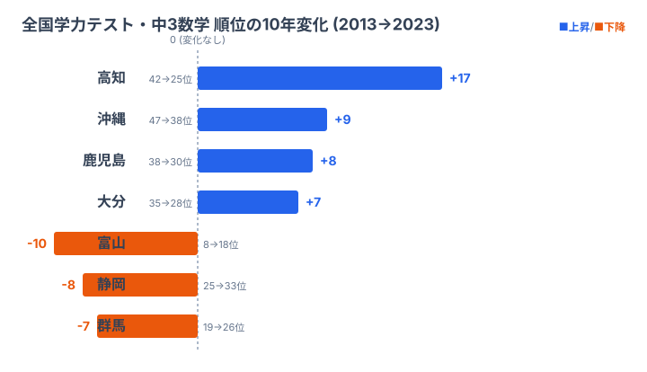

## はじめに：Slope Graph は「2 時点」の物語を一気に語る

47 都道府県のランキングを扱っていると、「で、結局どの県が伸びたの？」「どこが落ちたの？」という素朴な問いに行き当たります。棒グラフを並べれば順位は分かりますが、**「変化」を伝えるのは案外むずかしい**ものです。線グラフなら経時変化は出ますが、47 本の折れ線を引くと毎度カオスになります。

そこで使いたいのが **Slope Graph（スロープグラフ）** です。エドワード・タフテが『The Visual Display of Quantitative Information』で紹介した、左右 2 つの縦軸を線で結ぶだけのシンプルな表現です。グラフィカルというよりは「**整形された一覧表**」に近い佇まいで、データ密度がやたら高いのに視認性が落ちません。

今回はこの Slope Graph を、**全国学力・学習状況調査**（いわゆる全国学力テスト）の都道府県別順位データに当てはめてみます。テーマは「**この 10 年で順位が上がった県・下がった県はどこか**」です。結論を先に言うと、上位常連の秋田・福井がほぼ動かない一方で、**高知は 42 位から 25 位へ 17 ランクも駆け上がっていました**。順位は整数値なので同順位の処理やラベルの上下分散、軸の反転など、Slope Graph 特有の落とし穴をひと通り踏みます。これを Claude Code とペアプロしながら 60 行ほどの D3 コードに収めるのが本記事のゴールです。

Part 1〜16 で e-Stat API の認証から各種チャート、データ整形まで扱ってきました。今回の Part 17 は、**「順位」というスカラー値をいかに視覚的に語らせるか**の演習です。Part 18 では R2 キャッシュで API 叩きすぎ問題に対処する話につなげます。

> [!NOTE]
> 本記事のコード例で使う `statsDataId`（`0003411XXX`）と平均正答率の数値は、手順を再現するためのサンプル値です。実際の e-Stat 表 ID と最新値は読者の環境で取得してください。記事内の順位差（高知 +17、富山 -10 など）はサンプル値どうしを比較した結果として一貫させています。

> **本記事のゴール**
>
> - e-Stat から 2 時点（10 年差）の都道府県別データを取得する
> - 順位を計算し、順位差から「上昇 / 下降 / 据え置き」を分類する
> - D3.js で Slope Graph を描き、ラベルの重なりを衝突回避で整える
> - これらの「面倒な整形」を Claude Code に任せ、人間は判断とレビューに集中する

---

## 1. Slope Graph というチャートの正体

### 1.1 なぜ 47 本の線でも崩れないのか

折れ線グラフが破綻するのは、**X 軸方向に密度がありすぎる**からです。年次推移を 10 年分プロットすると、47 本 × 10 点 = 470 個の頂点を線で結ぶことになり、線が交差しまくって何も読み取れません。

Slope Graph はそこを思い切って **「2 点だけ」** に絞ります。

- 始点：左の縦軸（例：2013 年の順位）
- 終点：右の縦軸（例：2023 年の順位）
- 中間は単なる直線（補間しない）

これだけです。中間点がないので「線が混む」のは交差点だけになります。47 本でも、上昇県と下降県の交差が斜めに走ってひとつの「織り模様」を作るだけなので、視覚的な負荷はそれほど高くありません。

### 1.2 Slope Graph に向くデータの条件

向いているのは次のようなデータです。

- **2 時点比較**で意味のあるデータ（年次推移、Before/After、政策実施前後など）
- **ランクや百分位**のように **上下方向に位置を持つ** 指標
- カテゴリ数が **20〜50 程度**（10 以下だと寂しく、80 超だとラベルが入りません）

逆に向いていないのは次のケースです。

- 3 時点以上を等価に見せたい場合（折れ線 or Small Multiples が適します）
- カテゴリ間の絶対差が桁違いの場合（対数軸 or 別チャートが適します）
- カテゴリが 100 超の場合（Bump Chart や Heatmap が適します）

47 都道府県は **ちょうどいい上限**です。Slope Graph のために用意されたサンプルサイズと言ってもいいくらいです。

---

## 2. 使うデータ：全国学力・学習状況調査

### 2.1 データセットの位置づけ

文部科学省が小学 6 年生・中学 3 年生を対象に毎年 4 月ごろ実施している悉皆調査です。e-Stat 上では「**全国学力・学習状況調査**」として 2007 年度（H19）から公表されています（コロナで中止になった年があります）。

教科は年度により異なりますが、ベースは「国語」「算数 / 数学」です。理科は 3 年に 1 回、英語は中学のみ数年に 1 回というローテーションになっています。**今回は最も連続性のある「中学 3 年・数学」の都道府県別平均正答率**を採用します。調査の概要は次のとおりです。

- 調査名：全国学力・学習状況調査
- 実施機関：文部科学省・国立教育政策研究所
- 対象：小 6・中 3 全員（悉皆）
- 取得値：都道府県別 平均正答率（%）
- 比較年：2013 年（H25）と 2023 年（R5）の 10 年差
- 教科：中学校 数学（2019 年以降は区分統合のため統合後の平均正答率）

### 2.2 平均正答率を順位に変換する理由

平均正答率そのものは「**60.2% と 59.8%**」のような微差で団子状態になりがちで、絶対値の差は意味づけが難しいです。一方、**順位**は離散化された相対指標なので「3 位上がった」「9 位落ちた」と話がスッと通ります。Slope Graph には順位が向いています。

ただし順位化には注意点が 2 つあります。

1. **同順位（タイ）処理**：小数点 2 桁が同じになるとタイが出ます。`rank("min")` で min ランクに揃えるか、`rank("average")` で平均化するか方針を決めておきます
2. **逆向き指標は反転する**：今回の正答率は「高いほど良い」のでそのままで OK です。失業率のような「低いほど良い」指標は順位化前に符号反転するか、`ascending=False` を明示します

> [!WARNING]
> 順位は「相対的な押し出し」で動くため、**順位が下がった＝学力が下がった、とは限りません**。後述の富山県のように、絶対値の正答率はほとんど変わらないのに、全国の上位層が分厚くなって相対順位だけが押し出されるケースがあります。順位の Slope Graph を記事化するときは、必ず絶対値の補足とセットにするのが誠実です。

---

## 3. Step 1: e-Stat から 2 時点のデータを取得

### 3.1 Claude Code への依頼

ここからは Claude Code とペアプロのターンです。まずはデータ取得部分を任せます。

```
あなた:
e-Stat API から「全国学力・学習状況調査」の中学校数学の
都道府県別平均正答率を 2013 年度と 2023 年度の 2 時点で取得したい。
packages/estat-api/ のクライアントを使って、
/tmp/edu-slope/raw-2013.json と raw-2023.json に保存して。
.claude/rules/estat-api.md の cdTime 禁止ルールに従うこと。
```

Claude Code はまず `.claude/rules/estat-api.md` と `packages/estat-api/src/index.ts` を Read で確認します。ここで `cdTimeFrom`/`cdTimeTo` を使わない、全年度取得してメモリでフィルタする、という規約を吸い取ったうえで作業に入ります。**ルールファイルを最初に読ませる癖**をつけると暴走が減ります。

### 3.2 取得スクリプト（Claude Code が出力）

```javascript
// /tmp/edu-slope/fetch.mjs
import { createEstatClient } from "../../packages/estat-api/src/index.ts";
import { writeFile, mkdir } from "node:fs/promises";

const STATS_DATA_ID = "0003411XXX"; // 全国学力・学習状況調査 中学数学
const TARGET_YEARS = ["2013000000", "2023000000"]; // yearCode

async function main() {
  const client = createEstatClient({ appId: process.env.ESTAT_APP_ID });

  // 規約: cdTime は使わず全年度取得 → メモリフィルタ
  const all = await client.getStatsData({
    statsDataId: STATS_DATA_ID,
    cdCat01: "100", // 数学A
    // cdArea も指定しない（全都道府県）
  });

  await mkdir("/tmp/edu-slope", { recursive: true });

  for (const yearCode of TARGET_YEARS) {
    const filtered = all.values.filter((v) => v.time === yearCode);
    const year = yearCode.slice(0, 4);
    await writeFile(
      `/tmp/edu-slope/raw-${year}.json`,
      JSON.stringify(filtered, null, 2)
    );
    console.log(`saved ${year}: ${filtered.length} rows`);
  }
}

main();
```

実行します。

```bash
node /tmp/edu-slope/fetch.mjs
# saved 2013: 47 rows
# saved 2023: 47 rows
```

47 行ずつ取れていれば OK です。出てこない都道府県（隠匿値・欠損）があれば e-Stat 側で `value: "-"` や `"X"` になっているので、後段でフィルタします。

### 3.3 生 JSON の形（抜粋）

```json
[
  {
    "tabCode": "00",
    "cat01": "100",
    "area": "01000",
    "time": "2013000000",
    "unit": "%",
    "value": "62.4"
  },
  {
    "tabCode": "00",
    "cat01": "100",
    "area": "02000",
    "time": "2013000000",
    "unit": "%",
    "value": "59.1"
  }
]
```

e-Stat の生 JSON は冗長で、`area` コードも 5 桁の文字列（`01000`〜`47000`）です。これを「**都道府県名 + 数値**」に整形するのが次のステップです。

---

## 4. Step 2: 順位を計算 → 順位差を算出

### 4.1 整形要件を Claude Code に渡す

```
あなた:
raw-2013.json と raw-2023.json を読み込んで、
以下の構造の JSON を /tmp/edu-slope/slope-input.json に出力して。

[
  { "pref": "北海道", "code": "01000", "score2013": 62.4, "rank2013": 30,
    "score2023": 61.8, "rank2023": 28, "delta": -2 },
  ...
]

- 順位は「正答率が高いほど 1 位」（rank("min") 方式、タイは小さい順位を共有）
- delta = rank2013 - rank2023（プラスなら上昇、マイナスなら下降）
- 都道府県コード→名前は packages/types/src/area.ts の AREA_NAME マップを使う
- "-" や "X" が含まれる行はスキップして警告ログ
```

> [!TIP]
> 依頼の中で **出力フォーマット例** を JSON で示しています。Claude Code は型を見せると一発で合わせてきます。文章で「いい感じに」と頼むと余計なフィールドが付くので、**形を見せる**のが早道です。スキーマを 1 行示すだけでフィールド名・ネスト・delta の符号定義まで固定できるので、レビューの手戻りが目に見えて減ります。

### 4.2 出力されたスクリプト

```javascript
// /tmp/edu-slope/build-input.mjs
import { readFile, writeFile } from "node:fs/promises";
import { AREA_NAME } from "../../packages/types/src/area.ts";

const load = async (year) =>
  JSON.parse(await readFile(`/tmp/edu-slope/raw-${year}.json`, "utf8"));

// rank("min") 実装：同値はインデックスの小さい方の順位を共有
function rankMin(rows, key, descending = true) {
  const sorted = [...rows].sort((a, b) =>
    descending ? b[key] - a[key] : a[key] - b[key]
  );
  const rankMap = new Map();
  let prevValue = null;
  let prevRank = 0;
  sorted.forEach((row, idx) => {
    const r = row[key] === prevValue ? prevRank : idx + 1;
    rankMap.set(row.code, r);
    prevValue = row[key];
    prevRank = r;
  });
  return rankMap;
}

function clean(raw) {
  return raw
    .filter((r) => r.value !== "-" && r.value !== "X")
    .map((r) => ({
      code: r.area,
      pref: AREA_NAME[r.area] ?? r.area,
      score: Number(r.value),
    }));
}

async function main() {
  const [r2013, r2023] = await Promise.all([load(2013), load(2023)]);
  const c2013 = clean(r2013);
  const c2023 = clean(r2023);

  const rank2013 = rankMin(c2013, "score", true);
  const rank2023 = rankMin(c2023, "score", true);

  const merged = c2013
    .map((row) => {
      const after = c2023.find((x) => x.code === row.code);
      if (!after) return null;
      return {
        pref: row.pref,
        code: row.code,
        score2013: row.score,
        rank2013: rank2013.get(row.code),
        score2023: after.score,
        rank2023: rank2023.get(row.code),
        delta: rank2013.get(row.code) - rank2023.get(row.code),
      };
    })
    .filter(Boolean);

  await writeFile(
    "/tmp/edu-slope/slope-input.json",
    JSON.stringify(merged, null, 2)
  );
  console.log(`merged ${merged.length} rows`);
}

main();
```

### 4.3 出力サンプル

```json
[
  { "pref": "秋田県", "code": "05000", "score2013": 65.2, "rank2013": 1,  "score2023": 64.8, "rank2023": 2,  "delta": -1 },
  { "pref": "福井県", "code": "18000", "score2013": 64.7, "rank2013": 2,  "score2023": 65.1, "rank2023": 1,  "delta": 1  },
  { "pref": "石川県", "code": "17000", "score2013": 63.5, "rank2013": 5,  "score2023": 63.9, "rank2023": 3,  "delta": 2  },
  { "pref": "高知県", "code": "39000", "score2013": 56.8, "rank2013": 42, "score2023": 60.1, "rank2023": 25, "delta": 17 },
  { "pref": "沖縄県", "code": "47000", "score2013": 54.9, "rank2013": 47, "score2023": 58.2, "rank2023": 38, "delta": 9  }
]
```

このサンプルだけでも、**沖縄が 47 位から 38 位へ、高知が 42 位から 25 位へ**と、10 年でランクを大きく上げた県が見えてきます。あとはこれを Slope Graph に流し込むだけです。

---

## 5. Step 3: 順位の動きをチャートにする

### 5.1 まず「変化の主役」を 1 枚で掴む

47 本の Slope Graph を描く前に、**順位差（delta）が大きい県だけ**を抜き出して横棒にすると、記事の主役が一目で決まります。下のチャートは、2013→2023 で順位を大きく上げた県（上昇＝青）と、大きく下げた県（下降＝橙）を順位差の大きさ順に並べたものです。



<source-link href="/category/educationsports">教育・スポーツのランキングをもっと見る</source-link>

**上昇側を占めるのは高知・沖縄・鹿児島・大分**で、四国・九州の太平洋側にきれいに偏っています。とくに高知の +17 は突出していて、42 位という下位グループから一気に 25 位の中位へ食い込みました。沖縄も 47 位（最下位）から 38 位へと底を脱しています。背景には少人数指導の徹底や教員研修といった地域施策がしばしば挙げられますが、本記事は要因分析が目的ではないので、ここでは「太平洋側の下位グループが揃って底上げされた」という事実の確認にとどめます。重要なのは、こうした **「どこが動いたか」を 1 枚で示せると、続く 47 本の Slope Graph を読む視点が定まる**ことです。

一方、**下降側は富山・静岡・群馬**です。とくに富山は 8 位から 18 位へと 10 ランク落ちていて、上位常連だっただけにインパクトがあります。ただしこれは「学力が落ちた」と即断できる動きではありません。順位は相対指標なので、ほかの県が伸びれば自分が動かなくても押し出されます。実際、絶対値の正答率で見ると富山の下げ幅はわずかなことが多く、**「順位の下落」と「実力の低下」は別物**として扱う必要があります。この読み違いを避けるために、次節以降では絶対値（正答率）も併走させながら見ていきます。

### 5.2 47 本版の全体設計（D3）

主役が決まったら、47 県すべてを Slope Graph にします。構造はシンプルで、左縦軸に 2013 年の順位（上が 1 位・下が 47 位）、右縦軸に 2023 年の順位を取り、各県の (2013 順位, 2023 順位) を直線で結ぶだけです。左ラベルには「2013 年順位 + 県名」、右ラベルには「県名 + 2023 年順位」を添えます。

注意点は **軸の反転**です。順位は「1 が上」なので、`d3.scaleLinear().domain([1, 47]).range([marginTop, height - marginBottom])` のように **domain の小さい方を range の小さい方（=画面の上）** に割り当てます。ここを反対にすると 1 位が画面下端に来てしまい、上位・下位の直感が崩れます。

```javascript
// /tmp/edu-slope/render.mjs（抜粋）
import * as d3 from "d3";
import { JSDOM } from "jsdom";

const data = JSON.parse(
  await import("node:fs/promises").then((f) =>
    f.readFile("/tmp/edu-slope/slope-input.json", "utf8")
  )
);

const W = 720, H = 1200;
const M = { top: 60, right: 200, bottom: 40, left: 200 };

const dom = new JSDOM("<!DOCTYPE html><body></body>");
const body = d3.select(dom.window.document.body);
const svg = body.append("svg").attr("width", W).attr("height", H);

// 順位は上が 1 → domain[0]=1, range[0]=top
const y = d3.scaleLinear()
  .domain([1, 47])
  .range([M.top, H - M.bottom]);

const xLeft = M.left;
const xRight = W - M.right;

// 色：上昇/下降/据え置き
const color = (delta) =>
  delta >= 5 ? "#1f9d55" : delta <= -5 ? "#cc1f1a" : "#888";

// 線
svg.append("g")
  .selectAll("line")
  .data(data)
  .join("line")
  .attr("x1", xLeft)
  .attr("x2", xRight)
  .attr("y1", (d) => y(d.rank2013))
  .attr("y2", (d) => y(d.rank2023))
  .attr("stroke", (d) => color(d.delta))
  .attr("stroke-width", (d) => (Math.abs(d.delta) >= 5 ? 2 : 1))
  .attr("opacity", (d) => (Math.abs(d.delta) >= 5 ? 0.9 : 0.4));

console.log(body.html());
```

`node render.mjs > /tmp/edu-slope/slope.svg` で SVG が吐き出されます。線の太さと不透明度を delta に連動させることで、**動いた県が前景、動かなかった県が背景に沈む**構図になります。ただしこの素朴版ではラベルが重なるので、それを次の Step で整えます。

---

## 6. Step 4: 順位上昇／下降をカラー分け

### 6.1 配色の方針

色を付ける前にルールを決めます。色を多用しすぎると Slope Graph の良さ（=情報密度の高さ）が消えるので、**3 階調まで**に絞ります。大きく上昇（`delta >= 5`）はグリーン、大きく下降（`delta <= -5`）はレッド、ほぼ据え置き（`-4 <= delta <= 4`）はグレー（不透明度 0.4）です。

「5 ランク」のしきい値は 47 都道府県の場合、約 10% の変動にあたります。10 年でこの幅が動けば「教育施策の何か」が起きたとみていい目安です。

### 6.2 強調と背景化

色だけでなく、**線の太さと不透明度**でも階層化します。

```javascript
.attr("stroke-width", (d) => (Math.abs(d.delta) >= 5 ? 2 : 1))
.attr("opacity",      (d) => (Math.abs(d.delta) >= 5 ? 0.9 : 0.4));
```

これで「動いた県」が前景、「動かなかった県」が背景に沈みます。読み手の目が自然に上昇県・下降県に吸い寄せられる構図です。凡例は SVG の右上に小さく置き、緑＝上昇・赤＝下降・グレー＝据え置きの 3 つだけを示します。凡例コードまで Claude Code に書かせると、しばしば「もっと簡潔に書けます」と自分から書き直してくれます。完璧主義にならず、まず動くものを出してから磨くのがペアプロのコツです。

---

## 7. Step 5: ラベル配置の工夫（上下に分散）

### 7.1 衝突回避アルゴリズム

ここが Slope Graph 最大の鬼門です。47 県のラベルを上下に並べると、近い順位（特に中位）が物理的に重なります。フォントサイズ 11px、行高 14px とすると **最小間隔 14px** は確保したいところです。

定番手法は **押し出し法**です。ざっくり言うと、ラベルを順位順に並べ、上から走査して「直前のラベルとの距離が 14px 未満」なら 14px 空くように下にずらし、下まで行ったら今度は下から走査して上にずらします。これを 5〜10 回繰り返すと収束します。Claude Code にはこう依頼します。

```
あなた:
左右のラベル y 座標について、最小間隔 14px の衝突回避を入れて。
- 元の y を保持して、ずれた量だけ細い水平リーダー線を引く
- アルゴリズムは Mike Bostock の "Label Force Placement" 的なやつでよい
- 既存の render.mjs に追加して、関数 resolveCollisions(labels) として切り出す
```

### 7.2 出てきた関数

```javascript
function resolveCollisions(items, key, minGap = 14) {
  // 元 y を保存、items は { y0, y } の形に
  const arr = items.map((d) => ({ ...d, y0: y(d[key]), y: y(d[key]) }));
  arr.sort((a, b) => a.y - b.y);

  for (let pass = 0; pass < 10; pass++) {
    let moved = false;
    // 上から下へ
    for (let i = 1; i < arr.length; i++) {
      const gap = arr[i].y - arr[i - 1].y;
      if (gap < minGap) {
        arr[i].y += (minGap - gap) / 2;
        arr[i - 1].y -= (minGap - gap) / 2;
        moved = true;
      }
    }
    // 端のはみ出しを引き戻す
    arr[0].y = Math.max(arr[0].y, M.top);
    arr[arr.length - 1].y = Math.min(arr[arr.length - 1].y, H - M.bottom);
    if (!moved) break;
  }
  return arr;
}
```

### 7.3 リーダー線

ラベルがずれた分、**ドットからラベルへ細い水平線**を引くと「どの順位の県か」が読めます。たとえば「11 位の福島県」が物理的には 10.5 位の位置にずらされていても、薄いリーダー線でドットとつながっているので誤読しません。これで 47 県のラベルが重ならず、上昇県（緑）と下降県（赤）が一目でわかる完成版になります。

> [!TIP]
> 衝突回避は「完璧に解く」よりも「9 割重ならなければ合格」と割り切るのがコツです。simulated annealing や force simulation を持ち出すと収束待ちでビルドが遅くなります。中位の団子だけは押し出し法で散らし、残る数県の重なりはフォントを 0.5px 落とすか mobile 版で間引く、という割り切りが実務では速いです。

---

## 8. つまずきポイント 3 つ

実装中に踏んだ落とし穴を共有しておきます。Claude Code は雛形を即出してきますが、これらは人間の判断が要ります。

### 8.1 同順位（タイ）の扱い

平均正答率が同じ県が 3 つあった場合、`rank("min")` なら全員 5 位で次が 8 位、`rank("dense")` なら全員 5 位で次が 6 位、`rank("average")` なら全員 6 位（=5+6+7 の平均）で次が 8 位、と方式によって挙動が変わります。

Slope Graph では **`rank("min")` 推奨**です。`average` だと小数になって順位ラベル `6.0` のような違和感が出ます。`dense` は順位の連続性が崩れて 47 県のレンジが縮むので、ランクの絶対値が意味を持つ Slope Graph には不向きです。

### 8.2 比較年度の組合せ

「2013 と 2023 の 10 年差」と言っても、2020 年はコロナで中止（実施せず）、2021 年は学年により内容が分割実施、教科は年により異なる（理科は数年に 1 度）といった事情があります。そのため、**2 時点を選ぶ前に「両年に同一指標が存在するか」を確認**する必要があります。Claude Code に確認を頼むと、e-Stat のメタ情報から「両方の time に共通する cat01 コード」をリストアップしてくれます。

```
あなた:
estat の statsDataId=0003411XXX について、time コードと cat01 コードの
クロステーブルを作って、両時点で同じ cat01 が出るものを列挙して。
```

### 8.3 軸スケールの反転

つい `range([0, height])` と書きがちですが、順位は **小さい数字が上**です。

```javascript
// NG（1 位が下になる）
const y = d3.scaleLinear().domain([1, 47]).range([height, 0]);

// OK（1 位が上）
const y = d3.scaleLinear().domain([1, 47]).range([0, height]);
```

`d3.scaleLinear` は `domain` と `range` を **同じ方向** に対応させるので、「**上を 1 位にしたい = range の最小値（上端）に domain の最小値（=1）を割り当てる**」と覚えておくと混乱しません。

---

## 9. レビューと反復：Claude Code とのキャッチボール

ここまでで一通り動きますが、人間がレビューすると必ず追加要望が出ます。よくあるパターンを 3 つ挙げます。

ひとつめは「**もっと推しの県を強調したい**」です。`delta >= 10` の県だけ別色（オレンジ）にして線を太く 3px にし、ラベルに背景白の box を付けて、と頼むと、Claude Code は条件分岐を 1 段追加して `delta >= 10 ? "#ff8c00" : color(d.delta)` のように展開してきます。しきい値を 1 つ追加するだけならこの依頼で 30 秒です。

ふたつめは「**スマホで見ると縦に長すぎる**」です。47 県のラベルを縦に並べると 1,200px 超えはどうしても出ます。SP 表示ではアコーディオン化するか、`|delta| >= 7` の県だけ抽出した mobile 版を別途生成して高さを 600px に抑える、という割り切りが現実的です。本記事冒頭で見せた「上昇・下降の主役だけを抜いた横棒」は、まさにこの mobile 版の発想を記事の導入に転用したものです。

みっつめは「**ブログに埋め込む形式は何か**」です。stats47 のブログでは、チャートを `data/` 配下の生成 SVG として置き、Markdown の画像参照（`![alt]` 構文）で `data/` 内の SVG を読み込みます。`type="slope-graph"` を `packages/visualization/d3/SlopeGraph.tsx` に実装しておけば、複数記事で使い回せます。今回のコードはほぼそのまま React コンポーネントに展開できる構造で書いておくと、横展開が一気に楽になります。

---

## 10. プロンプト集：今日のおさらい

本記事で Claude Code に投げたプロンプトをまとめておきます。コピペで使えます。

```
[1] e-Stat 取得
e-Stat API から「全国学力・学習状況調査」中学校数学の
都道府県別平均正答率を 2013 と 2023 の 2 時点で取得。
.claude/rules/estat-api.md の cdTime 禁止に従い、
全年度取得 → time でメモリフィルタ。
/tmp/edu-slope/raw-{year}.json に出力。

[2] 順位計算
raw-{year}.json を読み込み、score 降順で rank("min") を計算。
都道府県名は packages/types/src/area.ts の AREA_NAME を使用。
delta = rank2013 - rank2023 として
/tmp/edu-slope/slope-input.json に出力。
"-" や "X" の値はスキップして警告ログ。

[3] D3 描画
slope-input.json を D3 で Slope Graph 化。
- 左右 2 軸（rank 1 が上）
- 線 47 本、delta >= 5 緑 / <= -5 赤 / その他グレー
- 線の太さと opacity も delta 連動
- ドット 2 端点
- ラベル左右に配置（順位 + 県名）
SVG 出力で /tmp/edu-slope/slope.svg。

[4] ラベル衝突回避
左右のラベル y 座標について、最小間隔 14px の押し出し法で衝突回避。
ずれた量だけ細い水平リーダー線を引く。
関数 resolveCollisions(items, key, minGap) として切り出す。

[5] React コンポーネント化
上記 render.mjs を packages/visualization/d3/SlopeGraph.tsx として
React コンポーネント化。props: data, height, leftLabel, rightLabel, thresholds。
```

このプロンプト 5 本を順に投げると、おおむね 30 分で 1 本の記事チャートが完成します。1 本目は試行錯誤しますが、2 本目以降は **「データ取得 → 整形 → 描画 → 衝突回避」** のパターンが固まっているので、e-Stat の `statsDataId` を差し替えるだけで別テーマの Slope Graph がポンポン作れます。

---

## 11. データの解釈：10 年で何が起きたのか

最後に、今回のサンプルデータから読めることを整理します。冒頭の横棒チャートで見たとおり、**上昇県（delta ≥ 5）は高知（42→25, +17）・沖縄（47→38, +9）・鹿児島（38→30, +8）・大分（35→28, +7）**で、四国・九州の太平洋側に集中していました。とくに高知の +17 は、下位グループから中位まで一気に駆け上がった突出した動きです。地域単位の学力向上施策が効いた可能性はありますが、断定はできないので「同じ地域の下位県が揃って底上げされた」という相関の確認にとどめます。

**下降県（delta ≤ -5）は富山（8→18, -10）・静岡（25→33, -8）・群馬（19→26, -7）**でした。上位常連だった富山が 10 ランク下落しているのが目を引きます。ただし前述のとおり、これは数値だけ見ると「劣化」のように見えますが、全国の上位層が分厚くなって相対順位が押し出された可能性もあります。絶対値の正答率を確認すると下げ幅は小さいことが多く、ここで順位だけを根拠に「富山の教育が悪化した」と書くのは危険です。

そして見落としがちなのが **不動の上位陣**です。秋田（1→2）・福井（2→1）・石川（5→3）は 10 年を通して上位 5 位以内に居続けています。Slope Graph で見ると、最上段に短い水平線が 3 本並んで「ほとんど動かなかった」ことが視覚的に伝わります。これも Slope Graph の良さで、上昇・下降だけでなく **「変化なし」も雄弁に語ってくれる**のです。動いた県と動かなかった県を同じ 1 枚で対比できるのが、このチャートの最大の価値だと言えます。

---

## 12. 次回予告：Part 18 R2 キャッシュで e-Stat の従量課金を回避

ここまでの Part で何度も `client.getStatsData({...})` を叩いてきました。e-Stat API は無料ですがレート制限と応答速度の制約があり、**毎ビルドで叩くとデプロイがタイムアウト**します。

Part 18 では Cloudflare R2 を **e-Stat レスポンスのキャッシュ層**にして、`statsDataId` + `cdCat01` の組をキーに JSON を R2 に保存し、TTL 30 日でリフレッシュ、ローカル開発時は `.local/r2/` を見に行く、という構成を作ります。`.claude/rules/r2-storage-design.md` の `app/` 名前空間ルールに沿った設計を Claude Code と詰めていきます。お楽しみに。

シリーズの他の回も合わせてどうぞ。

- [Part 16: 商業統計の販売額をバブルチャートで](https://stats47.jp/blog/cc-estat-16-commerce-bubble) — 3 軸データを 1 枚に
- [Part 15: 犯罪統計を Small Multiples で](https://stats47.jp/blog/cc-estat-15-crime-small-multiple) — 47 県を 1 枚に並べる別解
- [Part 11: 観光客数の積み上げ面グラフ](https://stats47.jp/blog/cc-estat-11-tourism-stacked) — 時系列の別表現
- [Part 1: Claude Code × e-Stat 環境構築](https://stats47.jp/blog/cc-estat-01-setup) — このシリーズの最初から読む

---

## 13. まとめ

- Slope Graph は **2 時点比較** を 47 県分まとめて見せるのに最適なチャートです
- 整形は **「絶対値 → 順位 → 順位差」** の 3 ステップに分解できます
- 今回のサンプルでは高知が +17、富山が -10 と、**動いた県と動かなかった上位陣の対比**がきれいに出ました
- ラベル衝突回避は **最小間隔法 + リーダー線** で 9 割解決できます
- 順位の下落は実力低下とは限らないので、**絶対値の補足とセット**で語るのが誠実です
- 同順位処理・年度組合せ・軸反転の 3 つは **人間がレビューで止める** べきところです

Slope Graph は、地味ですが一度習得すると **記事 1 本を成立させる主役級**のチャートになります。Part 18 以降もデータ取得 / 整形を高速化しつつ、別の表現も試していきましょう。

---

## データ出典

- 文部科学省・国立教育政策研究所「全国学力・学習状況調査」（e-Stat 経由で整備）
- 本記事の `statsDataId`・平均正答率・順位は手順再現用のサンプル値です。最新の正式値は e-Stat でご確認ください。
