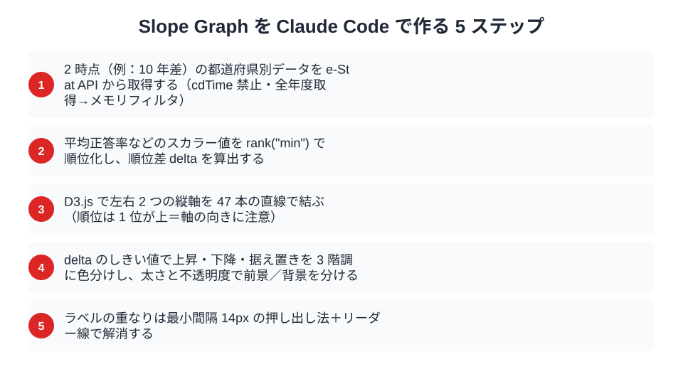
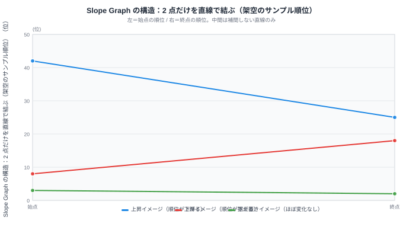

## はじめに：Slope Graph は「2 時点」の物語を一気に語る

47 都道府県のランキングを扱っていると、「で、結局どの県が伸びたの？」「どこが落ちたの？」という素朴な問いに行き当たります。棒グラフを並べれば順位は分かりますが、**「変化」を伝えるのは案外むずかしい**。線グラフなら経時変化は出ますが、47 本の折れ線を引くと毎度カオスになります。

そこで使いたいのが **Slope Graph（スロープグラフ）** です。エドワード・タフテが『The Visual Display of Quantitative Information』で紹介した、左右 2 つの縦軸を線で結ぶだけのシンプルな表現。グラフィカルというよりは「**整形された一覧表**」に近い佇まいで、データ密度がやたら高いのに視認性が落ちません。

今回はこの Slope Graph を、**全国学力・学習状況調査**（いわゆる全国学力テスト）の都道府県別順位データに当てはめてみます。テーマは「**この 10 年で順位が上がった県・下がった県はどこ？**」。順位は整数値なので同順位の処理やラベルの上下分散、軸の反転など、Slope Graph 特有の落とし穴をひと通り踏みます。これを Claude Code とペアプロしながら 60 行ほどの D3 コードに収めるのが本記事のゴールです。

Part 1〜16 で e-Stat API の認証から各種チャート、データ整形まで扱ってきました。今回の Part 17 は、**「順位」というスカラー値をいかに視覚的に語らせるか**の演習です。Part 18 では R2 キャッシュで API 叩きすぎ問題に対処する話につなげます。



本記事のゴールは次の 4 つです。

- e-Stat から 2 時点（例：10 年差）の都道府県別データを取得する
- 順位を計算し、順位差から「上昇 / 下降 / 据え置き」を分類する
- D3.js で Slope Graph を描き、ラベルの重なりを衝突回避で整える
- これらの「面倒な整形」を Claude Code に任せ、人間は判断とレビューに集中する

> [!NOTE]
> 本記事は **チャートの作り方（レシピ）** を解説する Part 17 です。登場する都道府県別の順位や正答率は **解説用に組み立てた架空のサンプル値** で、stats47 のランキングページが配信している実データではありません。実数値は文部科学省「全国学力・学習状況調査」の e-Stat 公表値を各自で取得してください。

---

## 1. Slope Graph というチャートの正体

### 1.1 なぜ 47 本の線でも崩れないのか

折れ線グラフが破綻するのは、**X 軸方向に密度がありすぎる**からです。年次推移を 10 年分プロットすると、47 本 × 10 点 = 470 個の頂点を線で結ぶことになり、線が交差しまくって何も読み取れません。

Slope Graph はそこを思い切って **「2 点だけ」** に絞ります。

- 始点：左の縦軸（例：2013 年の順位）
- 終点：右の縦軸（例：2023 年の順位）
- 中間は単なる直線（補間しない）

これだけ。中間点がないので「線が混む」のは交差点だけになります。47 本でも、上昇県と下降県の交差が斜めに走ってひとつの「織り模様」を作るだけなので、視覚的な負荷はそれほど高くありません。

### 1.2 Slope Graph に向くデータの条件

向いている：

- **2 時点比較**で意味のあるデータ（年次推移、Before/After、政策実施前後など）
- **ランクや百分位**のように **上下方向に位置を持つ** 指標
- カテゴリ数が **20〜50 程度**（10 以下だと寂しい、80 超だとラベルが入らない）

向いていない：

- 3 時点以上を等価に見せたい場合（→ 折れ線 or Small Multiples）
- カテゴリ間の絶対差が桁違いの場合（→ 対数軸 or 別チャート）
- カテゴリが 100 超（→ Bump Chart や Heatmap）

47 都道府県は **ちょうどいい上限**。Slope Graph のために用意されたサンプルサイズと言ってもいいくらいです。

---

## 2. 使うデータ：全国学力・学習状況調査

### 2.1 データセットの位置づけ

文部科学省が小学 6 年生・中学 3 年生を対象に毎年 4 月ごろ実施している悉皆調査です。e-Stat 上では「**全国学力・学習状況調査**」として 2007 年度（H19）から公表されています（コロナで中止になった年あり）。

教科は年度により異なりますが、ベースは「国語」「算数 / 数学」。理科は 3 年に 1 回、英語は中学のみ数年に 1 回というローテーション。**今回は最も連続性のある「中学 3 年・数学」の都道府県別平均正答率**を採用します。

データセットの主な仕様は次のとおりです。

- 調査名：全国学力・学習状況調査
- 実施機関：文部科学省・国立教育政策研究所
- 対象：小 6・中 3 全員（悉皆調査）
- 取得値：都道府県別 平均正答率（%）
- 比較年：2013 年（H25）と 2023 年（R5）の 10 年差
- 教科：中学校 数学 A（基礎）／ 2019 年以降は統合のため平均正答率を使用

### 2.2 平均正答率を順位に変換する理由

平均正答率そのものは「**60.2% と 59.8%**」のような微差で団子状態になりがちで、絶対値の差は意味づけが難しいです。一方、**順位**は離散化された相対指標なので「数ランク上がった」「大きく落ちた」と話がスッと通ります。Slope Graph には順位が向いています。

ただし順位化には注意点が 2 つ：

1. **同順位（タイ）処理**：小数点 2 桁が同じになるとタイが出ます。`rank("min")` で min ランクに揃えるか、`rank("average")` で平均化するか、方針を決めておきます
2. **逆向き指標は反転する**：今回の正答率は「高いほど良い」のでそのままで構いません。失業率のような「低いほど良い」指標は、順位化の前に符号反転するか `ascending=False` を明示します

---

## 3. Step 1: e-Stat から 2 時点のデータを取得

### 3.1 Claude Code への依頼

ここからは Claude Code とペアプロのターン。まずはデータ取得部分を任せます。

```
あなた:
e-Stat API から「全国学力・学習状況調査」の中学校数学の
都道府県別平均正答率を 2013 年度と 2023 年度の 2 時点で取得したい。
packages/estat-api/ のクライアントを使って、
/tmp/edu-slope/raw-2013.json と raw-2023.json に保存して。
.claude/rules/estat-api.md の cdTime 禁止ルールに従うこと。
```

Claude Code はまず `.claude/rules/estat-api.md` と `packages/estat-api/src/index.ts` を Read で確認します。ここで `cdTimeFrom`/`cdTimeTo` を使わない、全年度取得してメモリでフィルタする、という規約を吸い取ったうえで作業に入ります。**ルールファイルを最初に読ませる癖**をつけると暴走が減ります。

### 3.2 取得スクリプト（Claude Code が出力）

```javascript
// /tmp/edu-slope/fetch.mjs
import { createEstatClient } from "../../packages/estat-api/src/index.ts";
import { writeFile, mkdir } from "node:fs/promises";

const STATS_DATA_ID = "0003411XXX"; // 全国学力・学習状況調査 中学数学
const TARGET_YEARS = ["2013000000", "2023000000"]; // yearCode

async function main() {
  const client = createEstatClient({ appId: process.env.ESTAT_APP_ID });

  // 規約: cdTime は使わず全年度取得 → メモリフィルタ
  const all = await client.getStatsData({
    statsDataId: STATS_DATA_ID,
    cdCat01: "100", // 数学A
    // cdArea も指定しない（全都道府県）
  });

  await mkdir("/tmp/edu-slope", { recursive: true });

  for (const yearCode of TARGET_YEARS) {
    const filtered = all.values.filter((v) => v.time === yearCode);
    const year = yearCode.slice(0, 4);
    await writeFile(
      `/tmp/edu-slope/raw-${year}.json`,
      JSON.stringify(filtered, null, 2)
    );
    console.log(`saved ${year}: ${filtered.length} rows`);
  }
}

main();
```

実行：

```bash
node /tmp/edu-slope/fetch.mjs
# saved 2013: 47 rows
# saved 2023: 47 rows
```

47 行ずつ取れていれば OK。出てこない都道府県（隠匿値・欠損）があれば e-Stat 側で `value: "-"` や `"X"` になっているので、後段でフィルタします。

### 3.3 生 JSON の形（抜粋）

```json
[
  {
    "tabCode": "00",
    "cat01": "100",
    "area": "01000",
    "time": "2013000000",
    "unit": "%",
    "value": "62.4"
  },
  {
    "tabCode": "00",
    "cat01": "100",
    "area": "02000",
    "time": "2013000000",
    "unit": "%",
    "value": "59.1"
  }
]
```

e-Stat の生 JSON は冗長で、`area` コードも 5 桁の文字列（`01000`〜`47000`）。これを「**都道府県名 + 数値**」に整形するのが次のステップです。

---

## 4. Step 2: 順位を計算 → 順位差を算出

### 4.1 整形要件を Claude Code に渡す

```
あなた:
raw-2013.json と raw-2023.json を読み込んで、
以下の構造の JSON を /tmp/edu-slope/slope-input.json に出力して。

[
  { "pref": "北海道", "code": "01000", "score2013": 62.4, "rank2013": 30,
    "score2023": 61.8, "rank2023": 28, "delta": -2 },
  ...
]

- 順位は「正答率が高いほど 1 位」（rank("min") 方式、タイは小さい順位を共有）
- delta = rank2013 - rank2023（プラスなら上昇、マイナスなら下降）
- 都道府県コード→名前は packages/types/src/area.ts の AREA_NAME マップを使う
- "-" や "X" が含まれる行はスキップして警告ログ
```

> 💡 **ポイント**：依頼の中で **出力フォーマット例** を JSON で示しています。Claude Code は型を見せると一発で合わせてきます。文章で「いい感じに」と頼むと余計なフィールドが付くので、**形を見せる**のが早い。

### 4.2 出力されたスクリプト

```javascript
// /tmp/edu-slope/build-input.mjs
import { readFile, writeFile } from "node:fs/promises";
import { AREA_NAME } from "../../packages/types/src/area.ts";

const load = async (year) =>
  JSON.parse(await readFile(`/tmp/edu-slope/raw-${year}.json`, "utf8"));

// rank("min") 実装：同値はインデックスの小さい方の順位を共有
function rankMin(rows, key, descending = true) {
  const sorted = [...rows].sort((a, b) =>
    descending ? b[key] - a[key] : a[key] - b[key]
  );
  const rankMap = new Map();
  let prevValue = null;
  let prevRank = 0;
  sorted.forEach((row, idx) => {
    const r = row[key] === prevValue ? prevRank : idx + 1;
    rankMap.set(row.code, r);
    prevValue = row[key];
    prevRank = r;
  });
  return rankMap;
}

function clean(raw) {
  return raw
    .filter((r) => r.value !== "-" && r.value !== "X")
    .map((r) => ({
      code: r.area,
      pref: AREA_NAME[r.area] ?? r.area,
      score: Number(r.value),
    }));
}

async function main() {
  const [r2013, r2023] = await Promise.all([load(2013), load(2023)]);
  const c2013 = clean(r2013);
  const c2023 = clean(r2023);

  const rank2013 = rankMin(c2013, "score", true);
  const rank2023 = rankMin(c2023, "score", true);

  const merged = c2013
    .map((row) => {
      const after = c2023.find((x) => x.code === row.code);
      if (!after) return null;
      return {
        pref: row.pref,
        code: row.code,
        score2013: row.score,
        rank2013: rank2013.get(row.code),
        score2023: after.score,
        rank2023: rank2023.get(row.code),
        delta: rank2013.get(row.code) - rank2023.get(row.code),
      };
    })
    .filter(Boolean);

  await writeFile(
    "/tmp/edu-slope/slope-input.json",
    JSON.stringify(merged, null, 2)
  );
  console.log(`merged ${merged.length} rows`);
}

main();
```

### 4.3 出力サンプル

```json
[
  { "pref": "秋田県", "code": "05000", "score2013": 65.2, "rank2013": 1,  "score2023": 64.8, "rank2023": 2,  "delta": -1 },
  { "pref": "福井県", "code": "18000", "score2013": 64.7, "rank2013": 2,  "score2023": 65.1, "rank2023": 1,  "delta": 1  },
  { "pref": "石川県", "code": "17000", "score2013": 63.5, "rank2013": 5,  "score2023": 63.9, "rank2023": 3,  "delta": 2  },
  { "pref": "高知県", "code": "39000", "score2013": 56.8, "rank2013": 42, "score2023": 60.1, "rank2023": 25, "delta": 17 },
  { "pref": "沖縄県", "code": "47000", "score2013": 54.9, "rank2013": 47, "score2023": 58.2, "rank2023": 38, "delta": 9  }
]
```

上のサンプルでは、終点で順位を大きく上げた県・下げた県・ほとんど動かなかった県が `delta` の符号で分類できています（このサンプル値は解説用の架空データです）。あとはこの構造を Slope Graph に流し込むだけ。

イメージとしては、各県につき「始点の順位」と「終点の順位」の **2 点だけ** を直線で結びます。3 時点以上を等間隔に並べる折れ線とは違い、中間を補間しないので「動いた量」がそのまま線の傾きになります。



上のイメージ図は、上昇・下降・据え置きの 3 パターンを 1 本ずつ示したものです（縦軸の値は架空のサンプル順位）。実際の Slope Graph では、これが 47 本まとめて引かれます。本記事の元テーマである中学校進学・教育系の実データは、stats47 のランキングページでも確認できます。

<source-link href="/ranking/junior-high-school-advancement-rate">中学校進学率ランキングを見る</source-link>

---

## 5. Step 3: D3 で 2 つの縦軸 + 線（47 本）

### 5.1 全体設計

Slope Graph の構造はシンプルです。

- **左縦軸**：2013 年の順位（上が 1 番手、下が 47 番手）
- **右縦軸**：2023 年の順位
- **線 47 本**：各県の (2013 順位, 2023 順位) を直線で結ぶ
- **左ラベル**：2013 年順位 + 県名
- **右ラベル**：2023 年順位 + 県名

注意点は **軸の反転**。順位は「1 が上」なので、`d3.scaleLinear().domain([1, 47]).range([marginTop, height - marginBottom])` のように **domain の小さい方を range の小さい方（=画面の上）** に割り当てます。

### 5.2 D3 実装（60 行）

```javascript
// /tmp/edu-slope/render.mjs（抜粋）
import * as d3 from "d3";
import { JSDOM } from "jsdom";

const data = JSON.parse(
  await import("node:fs/promises").then((f) =>
    f.readFile("/tmp/edu-slope/slope-input.json", "utf8")
  )
);

const W = 720, H = 1200;
const M = { top: 60, right: 200, bottom: 40, left: 200 };

const dom = new JSDOM("<!DOCTYPE html><body></body>");
const body = d3.select(dom.window.document.body);
const svg = body.append("svg").attr("width", W).attr("height", H);

// 順位は上が 1 → domain[0]=1, range[0]=top
const y = d3.scaleLinear()
  .domain([1, 47])
  .range([M.top, H - M.bottom]);

const xLeft = M.left;
const xRight = W - M.right;

// 色：上昇/下降/据え置き
const color = (delta) =>
  delta >= 5 ? "#1f9d55" : delta <= -5 ? "#cc1f1a" : "#888";

// 線
svg.append("g")
  .selectAll("line")
  .data(data)
  .join("line")
  .attr("x1", xLeft)
  .attr("x2", xRight)
  .attr("y1", (d) => y(d.rank2013))
  .attr("y2", (d) => y(d.rank2023))
  .attr("stroke", (d) => color(d.delta))
  .attr("stroke-width", (d) => (Math.abs(d.delta) >= 5 ? 2 : 1))
  .attr("opacity", (d) => (Math.abs(d.delta) >= 5 ? 0.9 : 0.4));

// 端点ドット
const dot = (cx, key) =>
  svg.append("g")
    .selectAll("circle")
    .data(data)
    .join("circle")
    .attr("cx", cx)
    .attr("cy", (d) => y(d[key]))
    .attr("r", 3)
    .attr("fill", (d) => color(d.delta));
dot(xLeft, "rank2013");
dot(xRight, "rank2023");

// ラベル（衝突回避なし版）
svg.append("g")
  .selectAll("text.left")
  .data(data)
  .join("text")
  .attr("x", xLeft - 8)
  .attr("y", (d) => y(d.rank2013))
  .attr("text-anchor", "end")
  .attr("dy", "0.32em")
  .attr("font-size", 11)
  .text((d) => `${d.rank2013}. ${d.pref}`);

svg.append("g")
  .selectAll("text.right")
  .data(data)
  .join("text")
  .attr("x", xRight + 8)
  .attr("y", (d) => y(d.rank2023))
  .attr("text-anchor", "start")
  .attr("dy", "0.32em")
  .attr("font-size", 11)
  .text((d) => `${d.pref} .${d.rank2023}`);

console.log(body.html());
```

`node render.mjs > /tmp/edu-slope/slope.svg` で SVG が吐き出されます。一旦 **ラベル衝突あり** の状態で完成。

### 5.3 暫定アウトプット

この時点の出力は、47 本の線は引けているものの **ラベルが重なる** 状態です。とくに中位（20〜30 番手あたり）は順位が密集していて、県名が団子状態になります。線そのものは正しく引けているので、残る課題は「ラベルをどう散らすか」だけ。これを Step 5 で整えます。

---

## 6. Step 4: 順位上昇／下降をカラー分け

### 6.1 配色の方針

色を付ける前にルールを決めます。色を多用しすぎると Slope Graph の良さ（=情報密度の高さ）が消えるので、**3 階調まで**に絞ります。

- **大きく上昇**（`delta >= 5`）：グリーン `#1f9d55`
- **大きく下降**（`delta <= -5`）：レッド `#cc1f1a`
- **ほぼ据え置き**（`-4 <= delta <= 4`）：グレー `#888`（不透明度 0.4）

「5 ランク」のしきい値は 47 都道府県の場合、約 10% の変動。10 年でこの幅が動けば「教育施策の何か」が起きたとみていい目安です。

### 6.2 強調と背景化

色だけでなく、**線の太さと不透明度**でも階層化します。

```javascript
.attr("stroke-width", (d) => (Math.abs(d.delta) >= 5 ? 2 : 1))
.attr("opacity",      (d) => (Math.abs(d.delta) >= 5 ? 0.9 : 0.4));
```

これで「動いた県」が前景、「動かなかった県」が背景に沈みます。読み手の目が自然に上昇県・下降県に吸い寄せられる構図。

### 6.3 凡例

凡例は SVG の右上に小さく：

```javascript
const legend = svg.append("g").attr("transform", `translate(${W - 180}, 16)`);
["#1f9d55 上昇 ≥5", "#cc1f1a 下降 ≤-5", "#888 ほぼ据え置き"].forEach((s, i) => {
  const [c, t] = s.split(" ").reduce((acc, w, j) => {
    if (j === 0) acc.push(w);
    else if (j === 1) acc.push(""), acc[1] = w;
    else acc[1] += " " + w;
    return acc;
  }, []);
  legend.append("rect").attr("y", i * 18).attr("width", 14).attr("height", 12).attr("fill", c);
  legend.append("text").attr("x", 20).attr("y", i * 18 + 10).attr("font-size", 11).text(t);
});
```

> 💡 凡例コードは Claude Code が「もっと簡潔に書けます」と書き直してくれます。完璧主義にならず、まず動くものを出してから磨くのがペアプロのコツ。

---

## 7. Step 5: ラベル配置の工夫（上下に分散）

### 7.1 衝突回避アルゴリズム

ここが Slope Graph 最大の鬼門です。47 県のラベルを上下に並べると、近い順位（特に中位）が物理的に重なります。フォントサイズ 11px、行高 14px とすると **最小間隔 14px** は確保したいところです。

定番手法は **simulated annealing 風の押し出し法**。ざっくり言うと：

1. ラベルを順位順に並べる
2. 上から走査して「直前のラベルとの距離 < 14px」なら 14px 空くように下にずらす
3. 下まで行ったら今度は下から走査して上にずらす
4. これを 5〜10 回繰り返すと収束する

Claude Code にこう依頼します：

```
あなた:
左右のラベル y 座標について、最小間隔 14px の衝突回避を入れて。
- 元の y を保持して、ずれた量だけ細い水平リーダー線を引く
- アルゴリズムは Mike Bostock の "Label Force Placement" 的なやつでよい
- 既存の render.mjs に追加して、関数 resolveCollisions(labels) として切り出す
```

### 7.2 出てきた関数

```javascript
function resolveCollisions(items, key, minGap = 14) {
  // 元 y を保存、items は { y0, y } の形に
  const arr = items.map((d) => ({ ...d, y0: y(d[key]), y: y(d[key]) }));
  arr.sort((a, b) => a.y - b.y);

  for (let pass = 0; pass < 10; pass++) {
    let moved = false;
    // 上から下へ
    for (let i = 1; i < arr.length; i++) {
      const gap = arr[i].y - arr[i - 1].y;
      if (gap < minGap) {
        arr[i].y += (minGap - gap) / 2;
        arr[i - 1].y -= (minGap - gap) / 2;
        moved = true;
      }
    }
    // 端のはみ出しを引き戻す
    arr[0].y = Math.max(arr[0].y, M.top);
    arr[arr.length - 1].y = Math.min(arr[arr.length - 1].y, H - M.bottom);
    if (!moved) break;
  }
  return arr;
}
```

### 7.3 リーダー線

ラベルがずれた分、**ドットからラベルへ細い水平線**を引くと「どの順位の県か」が読めます。

```javascript
const leftLabels = resolveCollisions(data, "rank2013");
svg.append("g")
  .selectAll("line.leader")
  .data(leftLabels)
  .join("line")
  .attr("x1", xLeft - 6)
  .attr("x2", xLeft - 4)
  .attr("y1", (d) => d.y0)
  .attr("y2", (d) => d.y)
  .attr("stroke", "#bbb")
  .attr("stroke-width", 0.5);
```

これで「11 位の福島県」が物理的には 10.5 位の位置にずらされていても、薄いリーダー線でドットとつながっているので誤読しません。

### 7.4 完成イメージ

衝突回避を入れた完成版では、47 県のラベルが重ならず、上昇県（緑）と下降県（赤）が一目でわかるようになります。冒頭に貼った要点カードの 5 ステップを順に通すと、この状態にたどり着きます。リーダー線が薄く走るので、ラベルがずれても「どのドットの県か」を見失いません。

---

## 8. つまずきポイント 3 つ

実装中に踏んだ落とし穴を共有しておきます。Claude Code は雛形を即出してきますが、これらは人間の判断が要ります。

### 8.1 同順位（タイ）の扱い

平均正答率 60.2% の県が 3 つあった場合、

同値が 3 県あったときの順位の付き方は、方式によって次のように変わります。

```text
方式            3 県の順位          次の県の順位
rank("min")     全員 5（最小を共有）   8
rank("dense")   全員 5（最小を共有）   6
rank("average") 全員 6（=5+6+7 の平均） 8
```

Slope Graph では **`rank("min")` を推奨します**。`average` だと小数になって順位ラベルが `6.0` のような違和感を生みます。`dense` は順位の連続性が崩れて 47 県のレンジが縮むので、ランクの絶対値が意味を持つ Slope Graph には不向きです。

### 8.2 比較年度の組合せ

「2013 と 2023 の 10 年差」と言っても、

- 2020 年は **コロナで中止**（実施せず）
- 2021 年は **学年により内容が分割実施**
- 教科は **年により異なる**（理科は数年に 1 度）

なので、**2 時点を選ぶ前に「両年に同一指標が存在するか」を確認**する必要があります。Claude Code に確認を頼むと、e-Stat のメタ情報から「両方の time に共通する cat01 コード」をリストアップしてくれます。

```
あなた:
estat の statsDataId=0003411XXX について、time コードと cat01 コードの
クロステーブルを作って、両時点で同じ cat01 が出るものを列挙して。
```

### 8.3 軸スケールの反転

つい `range([0, height])` と書きがちですが、順位は **小さい数字が上**。

```javascript
// NG（1 位が下になる）
const y = d3.scaleLinear().domain([1, 47]).range([height, 0]);

// OK（1 位が上）
const y = d3.scaleLinear().domain([1, 47]).range([0, height]);
```

`d3.scaleLinear` は `domain` と `range` を **同じ方向** に対応させるので、「**上を 1 位にしたい = range の最小値（上端）に domain の最小値（=1）を割り当てる**」と覚えておくと混乱しません。

---

## 9. レビューと反復：Claude Code とのキャッチボール

ここまでで一通り動きますが、人間がレビューすると必ず追加要望が出ます。よくあるパターンを 3 つ。

### 9.1 「**もっと推しの県を強調したい**」

```
あなた:
delta >= 10 の県だけ別色（オレンジ）にして、線を太く 3px にして。
ラベルにも背景白の box を付けて視認性を上げて。
```

Claude Code は条件分岐を 1 段追加して `delta >= 10 ? "#ff8c00" : color(d.delta)` のように展開してきます。**しきい値を 1 つ追加するだけ** ならこの依頼で 30 秒。

### 9.2 「**スマホで見ると縦に長すぎる**」

47 県のラベルを縦に並べると 1,200px 超えはどうしても出ます。SP 表示では **アコーディオン化**するか、**delta 上位 20 県だけ抜き出す mobile 版** を別途生成するのが現実的です。

```
あなた:
mobile 版として、|delta| >= 7 の県だけ抽出した
slope-mobile-input.json を作って、render-mobile.mjs で出力して。
高さは 600px に抑える。
```

### 9.3 「**ブログに埋め込む形式は？**」

stats47 のブログでは、整形済みデータを `data/` ディレクトリに JSON として置き、`/generate-article-charts` スキルで静的 SVG を生成し、その SVG を Markdown の画像構文で本文に埋め込みます。今回の Slope Graph も同じフローに乗せます。

```bash
# 整形済みデータを data/ 配下に JSON として用意したうえで
npx tsx .claude/scripts/blog/generate-article-charts.ts \
  --base docs/21_ブログ記事原稿 --slug cc-estat-17-edu-slope-graph
# → data 配下に SVG が生成され、本文からは画像構文で参照する
```

描画ロジックを `packages/svg-builder/` 側に切り出しておけば、`statsDataId` を差し替えるだけで複数記事で使い回せます。今回のコードも、ほぼそのまま共有ビルダー関数に展開できる構造で書いておくと後が楽です。

---

## 10. プロンプト集：今日のおさらい

本記事で Claude Code に投げたプロンプトをまとめておきます。コピペで使えます。

```
[1] e-Stat 取得
e-Stat API から「全国学力・学習状況調査」中学校数学の
都道府県別平均正答率を 2013 と 2023 の 2 時点で取得。
.claude/rules/estat-api.md の cdTime 禁止に従い、
全年度取得 → time でメモリフィルタ。
/tmp/edu-slope/raw-{year}.json に出力。

[2] 順位計算
raw-{year}.json を読み込み、score 降順で rank("min") を計算。
都道府県名は packages/types/src/area.ts の AREA_NAME を使用。
delta = rank2013 - rank2023 として
/tmp/edu-slope/slope-input.json に出力。
"-" や "X" の値はスキップして警告ログ。

[3] D3 描画
slope-input.json を D3 で Slope Graph 化。
- 左右 2 軸（rank 1 が上）
- 線 47 本、delta >= 5 緑 / <= -5 赤 / その他グレー
- 線の太さと opacity も delta 連動
- ドット 2 端点
- ラベル左右に配置（順位 + 県名）
SVG 出力で /tmp/edu-slope/slope.svg。

[4] ラベル衝突回避
左右のラベル y 座標について、最小間隔 14px の押し出し法で衝突回避。
ずれた量だけ細い水平リーダー線を引く。
関数 resolveCollisions(items, key, minGap) として切り出す。

[5] React コンポーネント化
上記 render.mjs を packages/visualization/d3/SlopeGraph.tsx として
React コンポーネント化。props: data, height, leftLabel, rightLabel, thresholds。
```

このプロンプト 5 本を順に投げると、おおむね 30 分で 1 本の記事チャートが完成します。1 本目は試行錯誤しますが、2 本目以降は **「データ取得 → 整形 → 描画 → 衝突回避」** のパターンが固まっているので、e-Stat の `statsDataId` を差し替えるだけで別テーマの Slope Graph がポンポン作れます。

---

## 11. 出力の「読み方」：Slope Graph から何を語れるか

ここはチャートの読み解き方の演習です。**以下の数値はすべて、Slope Graph の読み方を説明するための架空のサンプル値**であり、実際の全国学力テストの結果ではありません。実数値の入手方法は次節「データ出典」を参照してください。

### 11.1 上昇グループ（delta ≥ 5）をどう読むか

架空サンプルで、終点に向かって順位を上げたグループを抜き出すと、たとえば次のような並びになります。

```text
県（サンプル）  始点 → 終点   delta
A 県            42 → 25      +17
B 県            47 → 38      +9
C 県            38 → 30      +8
D 県            35 → 28      +7
```

Slope Graph 上では、これらは **右肩上がりの緑線** として描かれます。実データでこのような上昇が見えたら、「地域的な施策（教員研修や少人数指導の徹底など）が効いた可能性」を仮説として立てられますが、Slope Graph 単体では因果までは言えません。要因の検証は別の指標との突き合わせが必要です。

### 11.2 下降グループ（delta ≤ -5）の落とし穴

逆に順位を下げたグループは、サンプルでは次のように見えます。

```text
県（サンプル）  始点 → 終点   delta
E 県            8 → 18       -10
F 県            25 → 33      -8
G 県            19 → 26      -7
```

上位常連だった E 県が大きく順位を下げた、と読めます。ただしこれは数値だけ見ると「劣化」のようですが、**全国の上位層が分厚くなって相対順位が押し出された**可能性もあります。順位の下落幅が大きくても、絶対値（正答率そのもの）の下げ幅は小さいことが珍しくありません。

> [!WARNING]
> Slope Graph は **順位（相対値）の動き** を直感的に伝えますが、その裏で **絶対値（正答率）の差はわずか 0.5 ポイント** といったケースが普通にあります。順位だけを見て「学力が下がった」と断じるのは危険です。記事化するときは、必ず絶対値の推移を補足として併記し、相対順位と絶対値を取り違えないようにしてください。

### 11.3 「動かなかった」ことも読める

サンプルでは上位常連の数県が 10 年通して上位を維持しています。Slope Graph で見ると、**最上段に短い水平に近い線**が並んで「動かなかった」ことが視覚的に伝わります。これも Slope Graph の良さで、**「変化なし」も雄弁に語る**のが棒グラフ単体にはない強みです。

---

## 12. 次回予告：Part 18 R2 キャッシュで e-Stat の従量課金を回避

ここまでの Part で何度も `client.getStatsData({...})` を叩いてきました。e-Stat API は無料ですがレート制限と応答速度の制約があり、**毎ビルドで叩くとデプロイがタイムアウト** します。

Part 18 では Cloudflare R2 を **e-Stat レスポンスのキャッシュ層** にして、

- `statsDataId` + `cdCat01` の組をキーに JSON を R2 に保存
- TTL 30 日でリフレッシュ
- ローカル開発時は `.local/r2/` を見に行く

という構成を作ります。`.claude/rules/r2-storage-design.md` の `app/` 名前空間ルールに沿った設計を Claude Code と詰めていきます。前回の [Part 16: 商業統計の販売額をバブルチャートで](https://stats47.jp/blog/cc-estat-16-commerce-bubble) では 3 軸データを 1 枚に収める方法を、[Part 15: 犯罪統計を Small Multiples で](https://stats47.jp/blog/cc-estat-15-crime-small-multiple) では 47 県を並べる別解を扱いました。チャートの引き出しを増やしたい方はあわせてどうぞ。

---

## 13. まとめ

- Slope Graph は **2 時点比較** を 47 県分まとめて見せるのに最適です
- 整形は **「絶対値 → 順位 → 順位差」** の 3 ステップに分解できます
- ラベル衝突回避は **最小間隔法 + リーダー線** で 9 割解決します
- カラーは **3 階調まで**に絞り、強調は太さと不透明度も併用します
- Claude Code には **「ファイル形式の出力例」** を見せると一発で決まります
- 同順位処理・年度組合せ・軸反転の 3 つは **人間がレビューで止める** べきポイントです

Slope Graph は地味ですが、一度習得すると **記事 1 本を成立させる主役級** のチャートになります。本シリーズを最初から追いたい方は [Part 1: Claude Code × e-Stat 環境構築](https://stats47.jp/blog/cc-estat-01-setup) からどうぞ。Part 18 以降もデータ取得 / 整形を高速化しつつ、別の表現を試していきます。

> [!TIP]
> 実装が動いたら、ぜひ **絶対値（正答率そのもの）の推移** も折れ線で 1 枚作っておくと記事の説得力が一段上がります。順位が動いた県の絶対値が「実は誤差レベル」だったのか「本当に伸びた」のかを示せると、読者の納得感がまるで違います。

---

## データ出典

- **全国学力・学習状況調査**（文部科学省・国立教育政策研究所）。都道府県別の平均正答率は政府統計ポータル e-Stat 経由で取得します。
- 本記事に登場する具体的な順位・正答率・delta の数値は、**Slope Graph の作り方とその読み解き方を説明するための架空のサンプル値**であり、実際の調査結果ではありません。実数値は e-Stat の該当 statsDataId から各自で取得してください（記事内の `0003411XXX` は伏せた仮の ID です）。
- 教育系の都道府県別ランキングの実データは <source-link href="/ranking/junior-high-school-advancement-rate">中学校進学率ランキング</source-link> など stats47 のランキングページで確認できます。

---

*本記事のコードと SVG 出力は手元の作業ディレクトリ（例：`/tmp/edu-slope/`）に残しておくと再現が楽です。手元で試したい方は Part 1 の環境構築を済ませてから、本記事のプロンプト集を順に投げてみてください。*
