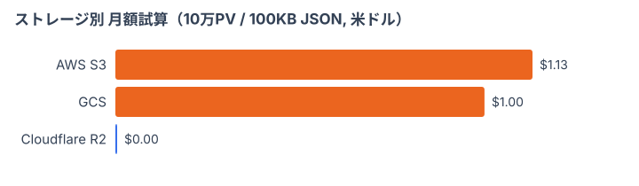
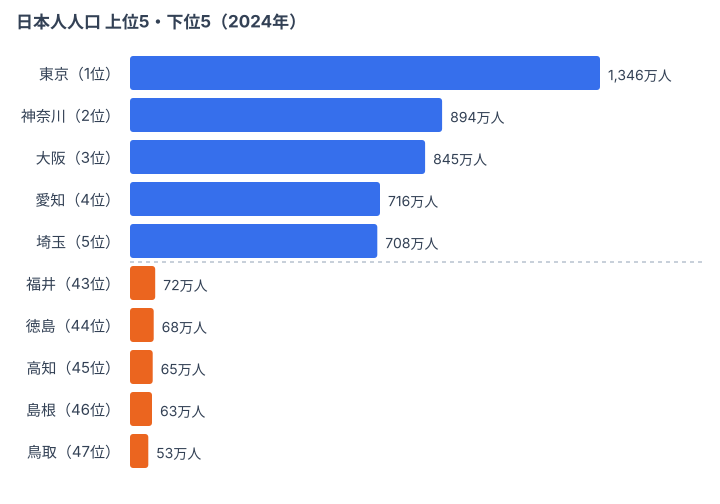

Part 17 までで「e-Stat からデータを取って、47 都道府県のチャートを描く」基本パターンは一通り出揃いました。ところが、ここまでの実装をそのまま本番に出すと **新しい壁** にぶつかります。ページが開かれるたびに e-Stat API を叩いてしまう、という壁です。1 リクエスト 1 秒として、月間 10 万 PV なら 100,000 秒（約 27 時間）e-Stat に張り付くことになります。レート制限にも引っかかりますし、何より遅くて UX が崩壊します。

解決策はキャッシュです。**取ったデータは自分のストレージに保存しておき、ページからはそこを読む**だけにします。今回の Part 18 では、そのストレージとして Cloudflare R2 を選び、**チャートデータ用の JSON ファイルをどう分割し、どう名前を付け、Claude Code でどう put/get を書くか** までを通しで解説します。

ありがちな「all.json に全部突っ込む」設計を最初に否定し、URL に対応した命名規約 `app/<page-type>/<key>/<resource>.json` に着地させるのがこの記事の山場です。Cloudflare Workers の isolate 特性に絡む「reader にメモリキャッシュを持たせるな」という落とし穴も合わせて押さえます。


## なぜキャッシュが必要なのか — e-Stat 直叩きの限界

まず動機をはっきりさせます。「キャッシュは速度のため」と思われがちですが、e-Stat の場合は **3 つの理由** がすべて致命的です。

1. **レイテンシ**: e-Stat API は速い日でも 300-800 ms、混雑時は 2-3 秒かかります。SSR/SSG で待つには遅すぎます
2. **レート制限**: 公開された具体的な閾値はないものの、短時間に数百リクエストを送ると 503 が返ってきます
3. **データの不変性**: 国勢調査・人口推計は年単位で更新されます。1 日に 1 万回 fetch しても答えは同じです

つまり「同じ JSON を 1 万回作り直している」のが直叩き設計です。これを 1 回作って R2 に置けば、以後 1 万人分のリクエストは R2 から配信されるだけになります。e-Stat への負荷もゼロ、自分のサーバの CPU もほぼゼロです。

直叩きと R2 キャッシュを並べると、差ははっきりしています。1 リクエストあたりのレイテンシは 300-2,000 ms から 30-80 ms に縮みます。レート制限は「503 で死ぬ」状態から「実質なし」になります。e-Stat 障害時の挙動も、直叩きでは依存ページが全部落ちますが、キャッシュなら古いデータが出続けて被害を局所化できます。月間 10 万 PV を想定したコストも、API 呼び出し過多の警告から無料枠内の 0 円に変わります。

トレードオフは「データ整合性」だけです。直叩きは常に最新を返しますが、キャッシュはバッチ更新になります。これは「夜間バッチで R2 を更新する」という設計で十分に吸収できます。e-Stat の更新頻度は月次〜年次なので、1 日 1 回の差分更新でも問題ない統計が大半です。

> [!NOTE]
> ここで言う「キャッシュ」は、e-Stat の生レスポンスをそのまま保存することではありません。**ページ描画に必要な形まで整形した JSON（47 都道府県の rank/value 配列など）を保存**します。生 XML を保存すると、結局リクエストごとに整形コストが残るためです。「描画直前の状態を凍結する」と考えると設計がぶれません。


## なぜ Cloudflare R2 を選ぶか

ストレージは選択肢が多い領域です。AWS S3、Google Cloud Storage、Cloudflare R2、Backblaze B2、Supabase Storage——全部使ったことがあるエンジニアでも「今回はどれ？」で迷います。stats47 では Cloudflare R2 を選びました。理由は 4 つです。

### 1. エグレス（下り帯域）無料

R2 最大の特徴です。S3 では 1 GB あたり \$0.09 のエグレス料金がかかりますが、R2 は **下りが無料** です。10 万 PV × 1 ページあたり 100 KB の JSON を配信しても、月額の egress コストは 0 円になります。S3 の場合は 10 万 × 100 KB = 10 GB で月 \$0.90 ほどかかり、小さく見えますが PV が 10 倍になれば 10 倍効いてきます。

実際に「10 GB ストレージ + 10 GB egress」を想定して 3 サービスの月額を試算すると、差は次のようになります。R2 だけが無料枠内に収まります。



S3 はストレージとエグレスを合わせて月 \$1.13、GCS は \$1.00 になりますが、R2 は無料枠の範囲なので \$0.00 です。チャートデータ配信のように「保存量は小さいが配信回数が多い」ワークロードでは、エグレス無料が効いてきます。逆に「巨大ファイルを少数回ダウンロードさせる」用途なら差は縮むので、自分のトラフィック形状で判断してください。ICT 系の他のテーマも同じ配信特性なので、[情報通信カテゴリ](/category/ict)のランキングはどれもこの設計に乗せています。

### 2. S3 互換 API

R2 は S3 互換のオブジェクトストレージなので、AWS SDK (`@aws-sdk/client-s3`) や `aws-cli` が **そのまま** 使えます。乗り換えコストが低いですし、いざとなれば S3 に戻せます。`PutObject` `GetObject` `ListObjectsV2` のセマンティクスが同じです。

### 3. Cloudflare Workers / Pages とのネイティブ連携

stats47 は Cloudflare Pages で Next.js を動かしているので、R2 バインディングが使えます。

```typescript
// wrangler.toml で binding するだけで env.R2 として使える
const obj = await env.R2.get("app/ranking/population/values.json");
const json = await obj.json();
```

S3 互換 API は **インターネット経由** の外部 HTTP になりますが、R2 binding は **同 PoP 内** で完結するので 10 ms 未満です。これは S3 では真似できません。

### 4. 無料枠が広い

ストレージ 10 GB / 月、Class A 操作（put/list）100 万回 / 月、Class B 操作（get）1,000 万回 / 月まで無料です。個人プロジェクトや中規模 SaaS の初期フェーズなら **完全無料** で運用できます。

ちなみに R2 の弱点は「アジア圏のレイテンシが S3 東京リージョンよりやや劣る」「Lifecycle ルールが S3 ほど洗練されていない」あたりです。stats47 のようなチャートデータ配信では弱点が刺さらないので採用した、というだけです。


## 何をキャッシュするのか — 人口データを例に

抽象論だけだと手触りがないので、実際に R2 へ置く JSON の中身を見ます。題材は連載で何度も使ってきた都道府県別の人口データです。下のチャートが、まさに `app/ranking/japanese-population/values.json` に整形して保存している中身（の上位5・下位5）です。



<source-link href="/ranking/japanese-population">日本人人口ランキング（47都道府県）をもっと見る</source-link>

上位は大都市圏に集中します。東京が約 1,346 万人で 1 位、神奈川が約 894 万人で 2 位、大阪・愛知・埼玉が続きます。いずれも三大都市圏か首都圏近郊で、戦後の産業集積と通勤圏の拡大がそのまま人口集積として現れています。チャートデータとして見ると、上位 5 県だけで下位 5 県の合計を大きく上回るほど偏っており、横棒の長さの落差がそのまま「同じ JSON 内に桁の違う値が同居する」ことを示しています。

下位は人口減少が進む地方県です。鳥取が約 53 万人で最も少なく、島根・高知・徳島・福井が並びます。下位県の値は上位県の 10 分の 1 以下になるため、棒グラフでは右端にほとんど伸びない短い棒として描かれます。**この「最大値と最小値が二桁違う」性質こそ、キャッシュ設計で見落としがちな落とし穴**です。1 県だけ見たい読者に全県分を配ると無駄が大きいので、後述する「URL 単位の分割」で必要な分だけ返すのが効いてきます。

> [!WARNING]
> 棒の長短は「人口の絶対数」であって順位の差そのものではありません。下位 5 県は 43〜47 位ですが、43 位の福井（約 72 万人）と 47 位の鳥取（約 53 万人）の差は約 19 万人です。一方で 1 位と 2 位の差は約 450 万人もあります。**順位が連続していても値の差は一定ではない**ので、「下位だから僅差」と読み違えないようにしてください。キャッシュした JSON にも rank と value の両方を持たせ、表示側で使い分けます。


## Step 1: R2 バケット作成と wrangler セットアップ

ここから手を動かします。Cloudflare アカウントは作成済みで `wrangler` CLI（v3 以上）が入っている前提で進めます。入っていなければ Part 1 を参照してください。

### 1-1. ダッシュボードでバケット作成

ブラウザから [Cloudflare ダッシュボード](https://dash.cloudflare.com/) → R2 → "Create bucket" と進みます。バケット名は **DNS 名と同じ制約**（小文字 + ハイフン）なので `stats47-cache` のように付けます。リージョンは "Automatic" でよく、最寄りに自動配置されます。

CLI 派なら以下でも同じです。

```bash
wrangler r2 bucket create stats47-cache
```

### 1-2. ローカル開発用の API トークン発行

ローカルから put/get するために、R2 用の API トークンを発行します。

1. ダッシュボード → R2 → "Manage R2 API Tokens" → "Create API token"
2. 権限: `Object Read & Write` を選択
3. 対象: 上で作ったバケット
4. 発行された 3 つの値を控える: **Access Key ID** / **Secret Access Key** / **Endpoint URL**

`.env.local` に保存します。

```bash
R2_ACCOUNT_ID=xxxxxxxxxxxxxxxxxxxx
R2_ACCESS_KEY_ID=xxxxxxxxxxxxxxxxxxxx
R2_SECRET_ACCESS_KEY=xxxxxxxxxxxxxxxxxxxxxxxxxxxxxxxxxxxxxxxxxx
R2_BUCKET=stats47-cache
R2_ENDPOINT=https://<account-id>.r2.cloudflarestorage.com
```

### 1-3. wrangler.toml で Workers / Pages にバインド

本番（Cloudflare Pages）から使うには binding が必要です。

```toml
# wrangler.toml
name = "stats47"
compatibility_date = "2026-06-01"

[[r2_buckets]]
binding = "R2"                # コード上では env.R2 でアクセス
bucket_name = "stats47-cache"
preview_bucket_name = "stats47-cache-preview"

# ローカル開発で永続化先を統一（重要）
[dev]
persist_to = "../../.local/d1"
```

stats47 ではモノレポ全体でローカル R2 を `.local/d1` に揃えています。複数のサブパッケージから同じデータを参照したいので、persist 先を **絶対に分けない** のがコツです。

### 1-4. 動作確認

ここまでで bash から R2 を叩けるはずです。テストファイルを 1 個 put してみます。

```bash
# サンプル JSON
echo '{"hello":"r2"}' > /tmp/hello.json

# put
wrangler r2 object put stats47-cache/test/hello.json --file=/tmp/hello.json

# get
wrangler r2 object get stats47-cache/test/hello.json --file=/tmp/got.json
cat /tmp/got.json   # → {"hello":"r2"}
```

ここで失敗するなら、たいていは **企業ネットワークのプロキシで S3 API がブロックされている** ケースです（後述します）。


## Step 2: モノリス all.json は避ける — URL に対応した JSON 分割

ここからが今回の本題です。**何のファイルを** R2 に置くかという設計の話になります。最も犯しがちなアンチパターンが「ぜんぶ 1 つの `all.json` に入れる」設計です。stats47 でも最初の 3 ヶ月はこれでした。失敗を共有します。

### アンチパターン: 巨大な all.json

```typescript
// ❌ 全データを 1 ファイルに
await env.R2.put("ranking-items/all.json", JSON.stringify(allRankingItems));

// reader 側
const allItems = await fetchAllRankingItems();  // ← 20 MB を毎回ロード
const populationRanking = allItems.find(i => i.key === "population");
```

このコードの問題は **5 つ** あります。

1. **20 MB を毎回 fetch してしまう** — 人口ランキング 1 件見たいだけなのに全カテゴリ分のデータが配信されます
2. **更新粒度が大きい** — 1 件更新するために 20 MB を put し直すことになります
3. **module-level メモリキャッシュ** がほぼ必須になります（後述の落とし穴です）
4. **R2 の Class B 操作が増える** — `.find()` で絞る前にロードしているからです
5. **キャッシュ失効が雑になる** — 1 件更新で 20 MB が全部失効します

### あるべき設計: URL に対応した JSON 分割

代わりに **URL 1 つにつき必要な JSON だけを 1 ファイル** に分けます。URL `/ranking/population` が必要なのは「population ランキングの 47 都道府県の値」だけなので、`app/ranking/population/values.json` という 1 ファイルにします。

```typescript
// ✅ URL に対応した最小ファイルを fetch
const values = await env.R2.get("app/ranking/population/values.json");
```

ロード量は数 KB に縮みます。更新も `population` だけを put すれば済みます。reader にキャッシュを持たせる必要もありません（Cloudflare 自体がエッジでキャッシュするからです）。all.json 方式はファイル 1 つで 1 リクエストあたり 20 MB を読み、更新は全体に及びます。URL 対応分割なら数百〜数千ファイルになりますが、1 リクエストの fetch 量は 5-50 KB に収まり、更新粒度も最小です。

### 移行の判断基準

「いつ分割を考えるべきか」の目安は次の 3 点です。

- 1 ファイルが **100 KB を超えそうになったら** 分割を検討します
- 「URL の一部だけ更新したい」が出てきたら **必ず分割** します
- マスタデータ（カテゴリ・タグ）など全件参照する小さいデータは all のままで構いません


## Step 3: 命名規約 `app/<page-type>/<key>/<resource>.json`

ファイルを分けると決めた途端に「じゃあどう名前を付ける？」で頭を抱えます。stats47 の答えは **URL 構造と 1:1 で対応させる** ことです。

### 規約

```
app/<page-type>/<key>/<resource>.json
  ^^^           ^^^^   ^^^         ^^^^
  prefix        URL の  リソース ID  扱う実体
                セグメント
```

URL `/ranking/population` のページが必要な JSON はすべて `app/ranking/population/*` 配下に置きます。誰が見ても **URL から R2 パスを推測できる** のがゴールです。実際の対応は、トップ `/` なら `app/home/featured.json`、`/ranking/[key]` ならメタが `app/ranking/[key]/item.json`・47 県の値が `app/ranking/[key]/values.json`・AI 解説が `app/ranking/[key]/ai-content.json`、`/category/[key]` なら `app/category/[key]/items.json`、`/areas/[code]` なら `app/areas/[code]/profile.json`、`/blog/[slug]` ならサムネが `app/blog/[slug]/thumbnail-light.webp`、という具合に URL の階層がそのまま R2 のキー階層になります。

### 設計上のルール

stats47 では以下の補助ルールも定めています。

1. **`app/` プレフィックス必須** — Web アプリが fetch する全 JSON はここに集約します。URL に対応しないインフラデータ（GIS 等）は別 prefix にします
2. **ファイル名の意味を決める** — `item.json` は 1 件の詳細、`items.json` は一覧（複数件）、`profile.json` は 1 件のプロフィール（item.json と棲み分けます）、`values.json` は数値配列、と決めておきます
3. **URL に現れないディレクトリ名を作らない** — `ranking-items/` のような名前は禁止です。命名規約違反になります

> [!TIP]
> この命名規約を Claude Code に守らせるコツは、規約をリポジトリのルールファイル（stats47 では `.claude/rules/r2-storage-design.md`）に明文化しておくことです。すると以後、Claude Code に「新しい snapshot を追加して」と頼むと自動でこの命名規約に従ってくれます。**口頭で毎回伝えるのではなく、文書化してこそ Claude Code が一貫して守る**——これが連載を通底するメッセージです。


## Step 4: Claude Code で put_object 呼び出しを書く

設計が固まったら実装です。Claude Code に頼むときのプロンプト例を載せます。

```
e-Stat から取得した 47 都道府県の人口データを R2 にキャッシュする
exporter スクリプトを書いてください。

要件:
- 入力: D1 から `ranking_data` テーブルを SELECT
- 出力: app/ranking/population/values.json
- 形式: { areaCode: string, value: number, rank: number }[]
- AWS SDK v3 (@aws-sdk/client-s3) を使う
- リトライ 3 回まで、指数バックオフ
- 既存ファイルとハッシュ比較して同一ならスキップ
- ETag を Content-MD5 から計算してレスポンスと突き合わせる

配置: packages/r2-storage/src/exporters/ranking-values-exporter.ts
```

Claude Code が返してくるのは概ね以下のような実装です。

```typescript
// packages/r2-storage/src/exporters/ranking-values-exporter.ts
import {
  S3Client,
  PutObjectCommand,
  GetObjectCommand,
  NoSuchKey,
} from "@aws-sdk/client-s3";
import { createHash } from "node:crypto";

const MAX_RETRIES = 3;
const BACKOFF_BASE_MS = 500;

const s3 = new S3Client({
  region: "auto",
  endpoint: process.env.R2_ENDPOINT,
  credentials: {
    accessKeyId: process.env.R2_ACCESS_KEY_ID!,
    secretAccessKey: process.env.R2_SECRET_ACCESS_KEY!,
  },
});

const BUCKET = process.env.R2_BUCKET!;

type RankingValue = {
  areaCode: string;
  value: number;
  rank: number;
};

export async function exportRankingValues(
  rankingKey: string,
  values: RankingValue[]
): Promise<{ skipped: boolean; etag?: string }> {
  const key = `app/ranking/${rankingKey}/values.json`;
  const body = JSON.stringify(values);
  const md5 = createHash("md5").update(body).digest("base64");

  // 既存と比較して同一ならスキップ
  const existing = await readExisting(key);
  if (existing && existing === body) {
    return { skipped: true };
  }

  // put with retry
  for (let attempt = 0; attempt < MAX_RETRIES; attempt++) {
    try {
      const res = await s3.send(
        new PutObjectCommand({
          Bucket: BUCKET,
          Key: key,
          Body: body,
          ContentType: "application/json; charset=utf-8",
          ContentMD5: md5,
          CacheControl: "public, max-age=300, s-maxage=86400",
        })
      );
      return { skipped: false, etag: res.ETag };
    } catch (err) {
      if (attempt === MAX_RETRIES - 1) throw err;
      await sleep(BACKOFF_BASE_MS * Math.pow(2, attempt));
    }
  }
  throw new Error("unreachable");
}

async function readExisting(key: string): Promise<string | null> {
  try {
    const res = await s3.send(
      new GetObjectCommand({ Bucket: BUCKET, Key: key })
    );
    return (await res.Body?.transformToString()) ?? null;
  } catch (err) {
    if (err instanceof NoSuchKey) return null;
    throw err;
  }
}

const sleep = (ms: number) =>
  new Promise<void>((resolve) => setTimeout(resolve, ms));
```

ポイントは 4 つです。

1. **同一データなら put しない**（Class A 操作を節約します）
2. **ContentMD5 を渡す**（破損を検知します）
3. **Cache-Control を埋め込む**（後述します）
4. **リトライは指数バックオフ**（503 対策です）

呼び出し側はシンプルになります。

```typescript
// scripts/sync-snapshots.ts
for (const rankingKey of allKeys) {
  const values = await loadFromD1(rankingKey);
  const { skipped } = await exportRankingValues(rankingKey, values);
  console.log(`${rankingKey}: ${skipped ? "SKIP" : "PUT"}`);
}
```

実行するとログがこう出ます。

```
population: PUT
aging-ratio: SKIP
medical-cost-per-capita: PUT
...
```

差分だけ put されるので、毎日のバッチでも R2 の Class A 操作は数十件に収まります。


## Step 5: 読み出し側に module-level キャッシュを持たせない理由

ここが Cloudflare Workers 特有の落とし穴です。**reader 関数に `let cached = null` のようなモジュールレベルキャッシュを置いてはいけません**。

### やってはいけないコード

```typescript
// ❌ アンチパターン
let cachedItems: RankingItem[] | null = null;

export async function readAllRankingItems(env: Env) {
  if (cachedItems) return cachedItems;
  const obj = await env.R2.get("app/ranking-items/all.json");
  cachedItems = await obj!.json();
  return cachedItems;
}
```

「2 回目以降の呼び出しが速くなる」と思いきや、Cloudflare Workers の **isolate ライフサイクル** がこれを台無しにします。

### なぜダメか — Cloudflare Workers の isolate 特性

Workers は **isolate** という軽量実行環境で動きます。1 isolate は数百リクエスト捌いて消えたり、急にスケールアウトして 100 個の isolate が並行で立ち上がったりします。**module-level 変数の寿命は isolate 寿命と同じ** で、しかも isolate は **PoP ごと・タイミングごとに別物** です。

つまり次のような事故が起きます。

- 同じ URL を 100 人がアクセスしても、cachedItems がヒットするとは限りません
- データを更新しても、古い isolate に残った cachedItems は **更新を見ません**
- ローカル開発（Node.js プロセス）では「動いている」ように見えて、本番で詰みます

何より致命的なのは「古いデータを掴んだまま isolate が残り続ける」ことです。stats47 でもこれを踏んで、ユーザーから「ランキングが昨日の値のまま」と問い合わせが来たことがありました。

### 正しい設計: 毎回 R2 から fetch

```typescript
// ✅ シンプルに毎回 fetch
export async function readRankingValues(env: Env, key: string) {
  const obj = await env.R2.get(`app/ranking/${key}/values.json`);
  if (!obj) return null;
  return obj.json();
}
```

「毎回 fetch して遅くないの？」と思うかもしれませんが、心配は要りません。

- R2 binding は **同 PoP 内** で 10 ms 以下です
- Cloudflare の **エッジキャッシュ** が前段で効きます（Cache-Control を設定していればです）
- SSG/ISR で静的化していればそもそも fetch されません

結局、**「キャッシュは Cloudflare 任せ、コードは毎回素直に fetch」** が正解になります。アプリ側のキャッシュは isolate の都合と戦うことになり、その複雑性に見合うメリットがありません。ローカル開発の Next.js だと module-level キャッシュが「効いている」ように見えるので尚さら危険です。**Workers の挙動を頭に入れた上で書く** ことが必須です。


## Step 6: ETag と Cache-Control の設定

R2 そのものではなく **配信** の話です。put した JSON にどう Cache-Control を付けるかで、エンドユーザーの体感速度が大きく変わります。

### Cache-Control の方針

stats47 では JSON ごとに 2 種類の TTL を使い分けています。

```
public, max-age=300, s-maxage=86400
        ^^^^^^^^^^^  ^^^^^^^^^^^^^^
        ブラウザ 5 分  CDN 24 時間
```

- `max-age=300`: 個々のブラウザは 5 分間ローカルで使い回します
- `s-maxage=86400`: Cloudflare エッジは 24 時間使い回します

「ブラウザ側のキャッシュは短く、エッジ側のキャッシュは長く」がコツです。ブラウザを長くしすぎるとデータ更新が反映されない端末が出ますが、エッジは長くしても明示的にパージできるので問題ありません。

### バッチ後のエッジパージ

データ更新後はエッジキャッシュをパージします。

```bash
# 全パージ（雑だが手っ取り早い）
wrangler r2 object purge stats47-cache

# 個別パージ（推奨）
curl -X POST \
  "https://api.cloudflare.com/client/v4/zones/$ZONE_ID/purge_cache" \
  -H "Authorization: Bearer $CF_API_TOKEN" \
  -H "Content-Type: application/json" \
  --data '{"files":["https://stats47.jp/api/r2/app/ranking/population/values.json"]}'
```

### ETag を使った 304 応答

R2 が返す ETag をクライアント側で握っておけば、`If-None-Match` ヘッダで 304 を引き出せます。これにより 2 回目以降は body 転送なしで「変わっていない」が分かります。

```typescript
// Workers / Next.js Route Handler
export async function GET(req: Request) {
  const obj = await env.R2.get("app/ranking/population/values.json");
  if (!obj) return new Response("Not Found", { status: 404 });

  const etag = obj.httpEtag;
  if (req.headers.get("if-none-match") === etag) {
    return new Response(null, { status: 304 });
  }

  return new Response(obj.body, {
    headers: {
      "Content-Type": "application/json; charset=utf-8",
      "Cache-Control": "public, max-age=300, s-maxage=86400",
      ETag: etag,
    },
  });
}
```

ブラウザの DevTools で見ると流れはこうなります。1 回目は 200 OK で body 50 KB を転送します。5 分以内の 2 回目は disk cache から 0 B で返ります。5 分経過後の 3 回目は 304 Not Modified となり、ヘッダのみ（body 0 B）で「変わっていない」が伝わります。データ更新後の 4 回目だけ、また 200 OK で 50 KB を取りにいきます。実装は 30 行ほどで、効果は大きいです。**ETag を実装しないのはもったいない** と思って入れてください。


## つまずきポイント — 経験者の地雷踏み歴

連載を通して書いていますが、ここでも詰まった話を共有します。

### つまずき 1: プロキシ環境で S3 API がブロックされる

社用 PC + 企業プロキシ環境だと、`wrangler r2 object put` で **HTTP 407（Proxy Auth Required）や 503** が返ってくることがあります。S3 互換 API は外向き HTTPS なので、プロキシで弾かれやすいです。

回避策は 2 つです。

1. **wrangler CLI 経由にする** — wrangler 自体は Cloudflare API（ダッシュボード API）を叩くので、S3 API より通る確率が高いです
2. **個人ネットワーク（テザリング等）から実行** — 一時的な回避策です

stats47 の `/push-r2` スキルにはこの fallback が組み込まれていて、S3 API が失敗したら自動で wrangler CLI に切り替わるようになっています。

### つまずき 2: キーの hot spot 問題

R2（S3）は内部的にキーのプレフィックスで分散します。**同じ prefix に書き込みが集中するとパーティションが偏る** のがクラウドストレージの定石です。たとえば全部 `app/ranking/...` に置くと、ピーク時に書き込み集中で速度が落ちることがあります。対策はそこまで凝らなくて構いませんが、**バッチ実行時に並列度を上げすぎない**（50 並列くらいまで）を意識すると安全です。

### つまずき 3: ローカルでは動くが本番で 404

ローカルの wrangler dev では `app/ranking/population/values.json` が見えるのに、本番だと 404 になることがあります。よくある原因は次の 2 つです。

- ローカルは `persist_to` のローカル R2、本番は実 R2 を見ています → **`/sync-snapshots` で本番 R2 に push 忘れ** です
- バインディング名が違います（`R2` vs `R2_CACHE` 等のタイポです）

stats47 では「ローカル D1（source of truth）→ `/sync-snapshots` → R2 → 本番配信」のフローを固定し、データ変更後は **必ず `/sync-snapshots` を走らせる** ルールを `.claude/rules/branch-workflow.md` に書いています。

### つまずき 4: 1 ファイル 5 MB を超えると怒られる

R2 自体は 5 GB まで 1 ファイルに格納できますが、**Cloudflare Workers のレスポンスサイズ上限**（無料プラン）に引っかかる場面があります。1 ファイルが 5 MB を超えそうなら、それは Step 2 の「分割を検討」のサインです。設計を見直しましょう。

### つまずき 5: 「キャッシュしたつもりが効いていない」

Cache-Control を設定したのに `cf-cache-status: BYPASS` がレスポンスに混じることがあります。原因は **Cookie / クエリストリング** がリクエストに付いていて、Cloudflare がデフォルトでキャッシュ対象から外している場合です。R2 配信用のエンドポイントは `Vary` / Cookie に依存させない設計にしてください。

```typescript
// Cookie を握らない、Set-Cookie を返さない
const headers = new Headers();
headers.delete("set-cookie");
```


## 次回予告: Skill チェーンで「e-Stat 取得 → R2 キャッシュ」を 1 コマンドに

[Part 19](/blog/cc-estat-19-skill-pipeline) では、ここまでのフロー（e-Stat 取得 → ローカル D1 保存 → R2 キャッシュ）を **1 つの Claude Code スキル** にまとめます。`/sync-ranking` のような名前のスキルを定義しておくと、人間は「人口ランキング更新」と頼むだけで、メタ照会・API 呼び出し・D1 INSERT・R2 put・キャッシュパージまで全部走ります。今回 Part 18 で作った exporter は、Part 19 でスキル内から呼び出される **部品** になるので、今のうちに名前と引数を整えておくと後で楽です。なお前回の [Part 17（教育費の格差を Slope Graph で可視化）](/blog/cc-estat-17-edu-slope-graph) を読んでいない場合は、チャート描画の前提が揃うので先に目を通しておくとスムーズです。


## まとめ

Part 18 で押さえた要点は次の 7 つです。

1. **キャッシュは速度のためだけでなく、レート制限回避と障害耐性のため** にも必要です
2. **Cloudflare R2** はエグレス無料 + S3 互換 + Workers 連携で、stats47 のような JSON 配信に最適です
3. **モノリス all.json は地獄** です。URL 1 つにつき必要最小限の JSON を置きます
4. **命名規約 `app/<page-type>/<key>/<resource>.json`** で URL と R2 キーを 1:1 にします
5. **put 側はハッシュ比較で差分のみ、リトライは指数バックオフ** にします
6. **reader に module-level キャッシュを持たせない** — Workers isolate が事故ります
7. **Cache-Control + ETag** でエッジと条件付きリクエストを使い倒します

ここまで来るとサイトの体感速度が一段上がり、e-Stat への負荷もほぼゼロになります。あとは「いつ更新するか」のバッチ設計に集中できる、というのがキャッシュ層を持つことの最大の価値です。次回 Part 19 ではそのバッチを Claude Code の Skill に統合して、人間の運用負荷も一緒に下げます。お楽しみに。


## データ出典

- 総務省「人口推計」（2024年・都道府県別、e-Stat 経由で整備）
- Cloudflare R2 公式ドキュメント（料金・制限の一次情報）: https://developers.cloudflare.com/r2/
