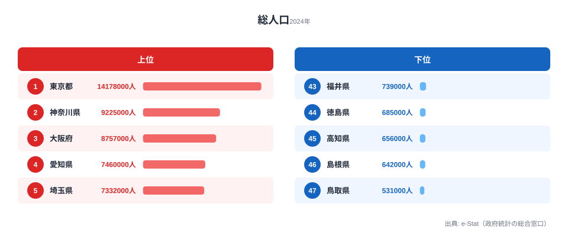

ついにこの日が来ました。Part 1 で `claude --version` を叩き、Part 2 でスキル化を覚え、Part 3-17 で 15 種類のチャートを Claude Code に作らせ、Part 18 で R2 キャッシュを噛ませ、Part 19 でテストを書いた——その総決算が今回の Part 20、**「世に出す」** です。

ローカルで `npm run dev` して綺麗に描画されるチャートを見て満足するのは、エンジニアの自己満足にすぎません。チャートは **URL を持って、検索結果に出て、SNS でシェアされて、初めて社会的な価値** を持ちます。本記事では、これまで連載で作ってきたチャート群を **Next.js App Router + Cloudflare Pages** に乗せ、OG 画像を自動生成し、Google Search Console と Analytics で計測まで仕込んで「公開完了」と言える状態に持っていきます。

所要時間は 2 時間ほどです。Claude Code に頼めば、Next.js のページコンポーネント・OG 画像ジェネレーター・`robots.ts` / `sitemap.ts` の SEO 制御・Cloudflare Pages のビルド設定までを **1 セッションで** 書き上げてくれます。連載 20 本の長旅、最後まで一緒に走り抜けましょう。


## 公開すると、データはどう見えるのか

抽象論の前に、まず「公開するとはどういうことか」を 1 枚の図で掴んでおきましょう。連載で最初に作った Part 3 のチャートは、総務省「人口推計」の都道府県別データを描いたものでした。それを本番の `/ranking/total-population` ページに乗せると、読者は次のような上位・下位の対比を一目で見られるようになります。



2024 年の総人口は東京都が 14,178,000 人で最も多く、神奈川県（9,225,000 人）、大阪府（8,757,000 人）、愛知県（7,460,000 人）、埼玉県（7,332,000 人）と続きます。上位は首都圏・関西圏・中京圏という三大都市圏に集中していて、東京都・神奈川県・埼玉県だけで上位5のうち 3 枠を関東が占めています。これは戦後の高度経済成長期に雇用が都市部へ吸い寄せられ、その流入が世代を超えて固定化したことを反映しています。

下位を見ると、鳥取県が 531,000 人で最も少なく、島根県（642,000 人）、高知県（656,000 人）、徳島県（685,000 人）、福井県（739,000 人）が続きます。山陰・四国の県が並ぶのは、平野が狭く大規模な雇用の受け皿が育ちにくかったことに加え、若年層が進学・就職で都市圏へ転出する流れが長く続いてきたためです。最多の東京都と最少の鳥取県では人口がおよそ 26.7 倍も開いており、「同じ 1 県」という単位がいかに当てにならないかが、この 1 枚から読み取れます。

<source-link href="/ranking/total-population">都道府県別 総人口ランキングをもっと見る</source-link>

> [!NOTE]
> このチャートが描くのは総務省「人口推計」（e-Stat 経由）の各年 10 月 1 日時点の総人口です。住民基本台帳人口とは集計基準が異なり、外国人を含む常住人口を対象にしている点に注意してください。Part 3 の元データもこの統計を使っています。

公開とは、こうした「上位と下位の対比」「26.7 倍という開き」を、検索から来た見知らぬ誰かが 1 クリックで眺められる状態にすることです。ローカルの `npm run dev` では、この読者にはたどり着けません。ここからは、その状態を Claude Code でどう作るかを順に見ていきます。


## なぜ Cloudflare Pages なのか

Next.js のデプロイ先候補は Vercel・Netlify・AWS Amplify・Cloudflare Pages など複数ありますが、stats47.jp は **Cloudflare Pages** を選んでいます。理由は次の 3 つです。

- **帯域が無料**: Vercel は月 100GB を超えると帯域課金が発生しますが、Cloudflare Pages の転送量は実質無制限・無料です。統計サイトは画像や JSON の配信量が読めないので、ここが定額なのは安心材料になります。
- **D1 / R2 がそのまま使える**: Part 18 で R2 にキャッシュした e-Stat JSON を、同じ Cloudflare アカウント内で読みに行けます。認証も IAM も追加で組む必要がなく、`env.STATS_DATA_BUCKET` を `wrangler.toml` に書くだけで済みます。
- **すべてがエッジ実行**: Vercel の Edge Functions が一部機能に限定されるのに対し、Cloudflare は Workers ですべてのリクエストをエッジで処理します。無料枠も Workers 100K req/day と個人サイトには十分です。

弱点はビルドがやや遅いこと（CI 完走で 5-7 分ほど）ですが、連載のゴールは「個人の趣味で 47 都道府県データを公開する」レベルなので、許容範囲です。決定打は **「帯域が無料」** と **「D1 / R2 がそのまま使える」** の 2 点で、stats47 は Cloudflare 一択で問題ありませんでした。


## Next.js App Router のページ構成

連載では Pages Router ではなく **App Router** を使ってきました。理由は (a) Server Components で R2 fetch をサーバー側に閉じ込められること、(b) `opengraph-image.tsx` で OG 画像が宣言的に作れること、(c) `metadata` export で SEO 設定が型安全になること、の 3 点です。

ディレクトリ構造はこのようになります。

```text
apps/web/src/app/
├── layout.tsx                       # ルート layout（Header/Footer）
├── page.tsx                         # トップページ
├── robots.ts                        # robots.txt 自動生成
├── sitemap.ts                       # sitemap.xml 自動生成
├── opengraph-image.tsx              # サイト全体の OG 画像
└── charts/
    ├── page.tsx                     # チャート一覧
    └── [slug]/
        ├── page.tsx                 # 個別チャートページ
        ├── opengraph-image.tsx      # チャート別 OG 画像
        └── loading.tsx              # Suspense fallback
```

`[slug]` 部分が動的ルーティングです。`/charts/population-bar`、`/charts/aging-heatmap` のように、Part 3-17 で作った 15 種類のチャートがそれぞれ URL を持ちます。

Claude Code に頼むときは、この構造を最初に伝えておくと迷子になりません。

```text
あなた → claude:
  apps/web/src/app/charts/[slug]/page.tsx を作って。
  R2 の app/charts/[slug]/data.json を fetch して、
  packages/visualization の BarChart に流す。
  generateStaticParams で 15 個の slug を静的生成。
  generateMetadata で title/description を frontmatter から拾う。
```


## Step 1: 静的生成 vs ISR vs CSR の選択

ページを書く前に、**レンダリング戦略** を決めます。Next.js App Router では (a) Static（ビルド時生成）、(b) ISR（Incremental Static Regeneration）、(c) Dynamic（リクエスト時 SSR）、(d) Client-only の 4 つから選べます。それぞれの向き不向きは次のとおりです。

- **Static（SSG）**: 統計データやブログ記事に向きます。TTFB が最速で、更新はビルド時のみ。Cloudflare Pages にフル対応しています。
- **ISR**: 頻繁に更新される一覧に向きます。`revalidate` 秒数で再生成しますが、Cloudflare Pages では一部に制約があります。
- **Dynamic（SSR）**: ユーザー固有データに向きます。リクエストごとに Workers 経由で生成され、TTFB は中程度です。
- **Client（CSR）**: インタラクティブ UI に向きます。JS 待ちで初期表示は遅いものの、リアルタイム性が高く制約はありません。

連載のチャートは **e-Stat の年次データ** なので、データ更新は年 1-2 回程度です。よって **SSG 一択** になります。`generateStaticParams` で 15 個の slug を返し、ビルド時に静的 HTML + JSON を生成します。

```tsx
// apps/web/src/app/charts/[slug]/page.tsx
import { notFound } from "next/navigation";
import { fetchChartData } from "@/lib/r2";
import { ChartRenderer } from "@/components/ChartRenderer";

const CHART_SLUGS = [
  "population-bar",
  "aging-heatmap",
  "medical-cost-choropleth",
  "income-scatter",
  "birthrate-line",
  "bar-chart-race",
  "radar-prefecture",
  "wage-box-plot",
  "tourism-stacked",
  "energy-area-chart",
  "crime-small-multiple",
  "commerce-bubble",
  "edu-slope-graph",
  // ...
] as const;

export async function generateStaticParams() {
  return CHART_SLUGS.map((slug) => ({ slug }));
}

export const dynamicParams = false; // CHART_SLUGS 以外は 404

export async function generateMetadata({
  params,
}: {
  params: Promise<{ slug: string }>;
}) {
  const { slug } = await params;
  const data = await fetchChartData(slug);
  if (!data) return {};
  return {
    title: `${data.title}｜stats47`,
    description: data.description,
    openGraph: {
      images: [`/charts/${slug}/opengraph-image`],
    },
  };
}

export default async function ChartPage({
  params,
}: {
  params: Promise<{ slug: string }>;
}) {
  const { slug } = await params;
  const data = await fetchChartData(slug);
  if (!data) notFound();
  return (
    <article className="mx-auto max-w-3xl px-4 py-8">
      <h1 className="text-2xl font-bold">{data.title}</h1>
      <p className="mt-2 text-slate-600">{data.description}</p>
      <ChartRenderer type={data.chartType} data={data.values} />
    </article>
  );
}
```

ポイントは 3 つあります。

1. **`generateStaticParams`** で 15 個の slug を返し、`dynamicParams = false` で範囲外を 404 にします
2. **`params` が Promise** になっています（Next.js 15 以降の仕様変更）。`await params` を忘れると runtime error になります
3. **`generateMetadata`** で OG 画像 URL を `/charts/[slug]/opengraph-image` に向けます（次の Step で自動生成されます）

Claude Code に「Next.js 15 の App Router でチャートページを書いて」と頼むと、Next.js 14 流の `params: { slug: string }` を返してくることがあります。**「Next.js 15 系を使うので params は Promise」** と明示するのが事故防止のコツです。


## Step 2: チャート JSON を R2 から fetch（Part 18 と連携）

`fetchChartData` の中身は Part 18 で作った R2 reader を呼び出すだけです。

```ts
// apps/web/src/lib/r2.ts
import { getCloudflareContext } from "@opennextjs/cloudflare";

export type ChartData = {
  title: string;
  description: string;
  chartType: "bar" | "line" | "scatter" | "choropleth" | "heatmap";
  values: unknown;
};

export async function fetchChartData(
  slug: string,
): Promise<ChartData | null> {
  const { env } = getCloudflareContext();
  const key = `app/charts/${slug}/data.json`;
  const obj = await env.STATS_DATA_BUCKET.get(key);
  if (!obj) return null;
  const json = await obj.json<ChartData>();
  return json;
}
```

R2 のキーパス規約（`.claude/rules/r2-storage-design.md`）に従って `app/charts/[slug]/data.json` に統一しています。`all.json` モノリスを作らず、URL 1 個 = JSON 1 個 の原則で並べておくと、(a) Cloudflare のエッジキャッシュが効きやすい、(b) 1 ページの fetch が小さい（典型 5-50 KB）、(c) snapshot 更新時の差分が読みやすい、というメリットが得られます。

ビルド時に R2 を読みに行く処理は **Cloudflare Pages のビルドコンテナから直接** 実行できます。`@opennextjs/cloudflare` の `getCloudflareContext` が、build / dev / prod すべての環境で同じインターフェースを提供してくれます。


## Step 3: OG 画像を Next.js の opengraph-image.tsx で自動生成

SNS でシェアされたときのカード画像、いわゆる **OG 画像** があります。Twitter / Facebook / Slack で URL を貼ったときに出るあれです。

これを **チャート 1 個ずつ手動で作る** のは現実的ではありません。15 種類 × 47 都道府県 = 705 枚の OG 画像を Photoshop で作るとなると、気力が続きません。

Next.js App Router には `opengraph-image.tsx` という規約があり、**ファイルを置くだけで OG 画像エンドポイントが生える** 仕組みがあります。中身は ImageResponse（Vercel/Edge の Satori ベース）で、JSX を SVG → PNG に変換します。

```tsx
// apps/web/src/app/charts/[slug]/opengraph-image.tsx
import { ImageResponse } from "next/og";
import { fetchChartData } from "@/lib/r2";

export const runtime = "edge";
export const alt = "stats47 チャート";
export const size = { width: 1200, height: 630 };
export const contentType = "image/png";

export default async function OgImage({
  params,
}: {
  params: { slug: string };
}) {
  const data = await fetchChartData(params.slug);
  const title = data?.title ?? "stats47";
  const subtitle = data?.description ?? "47 都道府県の統計データ";

  return new ImageResponse(
    (
      <div
        style={{
          display: "flex",
          flexDirection: "column",
          justifyContent: "space-between",
          width: "100%",
          height: "100%",
          padding: "64px",
          background:
            "linear-gradient(135deg, #0f172a 0%, #1e3a8a 100%)",
          color: "#fff",
          fontFamily: "sans-serif",
        }}
      >
        <div style={{ fontSize: 32, opacity: 0.7 }}>stats47.jp</div>
        <div style={{ display: "flex", flexDirection: "column", gap: 16 }}>
          <div style={{ fontSize: 64, fontWeight: 700, lineHeight: 1.2 }}>
            {title}
          </div>
          <div style={{ fontSize: 28, opacity: 0.85 }}>{subtitle}</div>
        </div>
        <div style={{ fontSize: 24, opacity: 0.6 }}>
          47 都道府県統計データの可視化
        </div>
      </div>
    ),
    size,
  );
}
```

これだけで `/charts/population-bar/opengraph-image` という URL が立ち上がり、1200×630 の PNG が返ってきます。Twitter Card Validator に URL を投げて検証すれば、Claude Code に作らせた OG 画像が綺麗に出ます。

注意点が 3 つあります。

- **`export const runtime = "edge"`** が必須です。Cloudflare Pages では Edge Runtime のみ動きます
- **絶対パスのフォントファイルは読めません**。日本語フォントを使うときは `fetch` で取得して `ImageResponse` の `fonts` オプションに渡します（後述）
- **emoji は別途処理** が要ります。Satori は emoji を CSS background-image でしか扱えません

日本語フォントを使いたい場合は、Google Fonts の Noto Sans JP の subset を R2 に置き、ビルド時に fetch する設計が安定します。

```ts
const font = await fetch(
  `${process.env.NEXT_PUBLIC_BASE_URL}/fonts/NotoSansJP-Bold-subset.woff`,
).then((r) => r.arrayBuffer());

return new ImageResponse(/* ... */, {
  ...size,
  fonts: [{ name: "Noto Sans JP", data: font, weight: 700, style: "normal" }],
});
```

> [!WARNING]
> `opengraph-image.tsx` で `runtime = "edge"` を付け忘れると、Cloudflare Pages のビルドは通っても本番で OG 画像エンドポイントが 500 を返します。ローカルの `next dev`（Node ランタイム）では動いてしまうため気付きにくく、デプロイ後に Twitter Card Validator で初めて発覚しがちな落とし穴です。OG 画像系のファイルは必ず `npm run preview:cf`（後述）で本番に近い環境で確認してください。


## Step 4: robots.ts と sitemap.ts の noindex 制御

新規ページを追加するときに **絶対に忘れてはいけない** のがインデックス制御です。stats47 は過去にここで大事故を起こしました（後述「つまずきポイント」参照）。

App Router では `robots.ts` と `sitemap.ts` をルート直下に置けば、それぞれ `/robots.txt` と `/sitemap.xml` が自動生成されます。

```ts
// apps/web/src/app/robots.ts
import type { MetadataRoute } from "next";

export default function robots(): MetadataRoute.Robots {
  return {
    rules: [
      {
        userAgent: "*",
        allow: "/",
        disallow: [
          "/api/",
          "/admin/",
          "/*/opengraph-image", // ← 重要: OG 画像 URL は noindex
          "/_next/",
        ],
      },
    ],
    sitemap: "https://stats47.jp/sitemap.xml",
  };
}
```

`/*/opengraph-image` の Disallow を入れ忘れると、Google が OG 画像 URL を「ページ」として認識し、GSC に大量の **「クロール済み - インデックス未登録」** が積み上がります。stats47 では 2026 年に 1,453 件発生して気付きました（CLAUDE.md にも警告として書いてあります）。

```ts
// apps/web/src/app/sitemap.ts
import type { MetadataRoute } from "next";

const CHART_SLUGS = [
  "population-bar",
  "aging-heatmap",
  "medical-cost-choropleth",
  // ...
];

export default function sitemap(): MetadataRoute.Sitemap {
  const now = new Date();
  return [
    {
      url: "https://stats47.jp/",
      lastModified: now,
      changeFrequency: "weekly",
      priority: 1.0,
    },
    ...CHART_SLUGS.map((slug) => ({
      url: `https://stats47.jp/charts/${slug}`,
      lastModified: now,
      changeFrequency: "monthly" as const,
      priority: 0.8,
    })),
  ];
}
```

サイトマップには **OG 画像 URL を含めません**（Disallow と矛盾するためです）。新規ページを追加するときは **必ず sitemap.ts にも追記** します。これを忘れると Google にいつまでも発見されません。

Claude Code に「`apps/web/src/app/charts/[slug]/page.tsx` を新規作成」と頼むときは、**プロンプトに「同時に sitemap.ts に追記して」と書く** のがチェックリスト化のコツです。

> [!TIP]
> 公開直後に「インデックスされているか」を確かめたいときは、`site:stats47.jp/charts` で Google 検索するより、GSC の URL 検査ツールに個別 URL を入れるほうが確実です。`site:` 演算子の結果はインデックス状況とタイムラグがあり、未登録でもしばらく表示が残るためです。新規ページの初動確認は URL 検査と「インデックス登録をリクエスト」をセットで使うのが最短です。


## Step 5: Cloudflare Pages デプロイ

ビルドとデプロイは `@opennextjs/cloudflare` 経由で行います。`next build` の出力を Cloudflare Workers 用にトランスパイルしてくれるアダプタです。

```bash
# package.json の scripts
{
  "scripts": {
    "build": "next build",
    "build:cf": "next build && opennextjs-cloudflare build",
    "preview:cf": "opennextjs-cloudflare preview",
    "deploy": "opennextjs-cloudflare deploy"
  }
}
```

ローカルで本番ビルドを確認するなら `npm run preview:cf` を使います。これは Cloudflare の `wrangler pages dev` を内部で叩き、本番に限りなく近い環境でブラウザ確認できます。

デプロイ自体はこの 1 行です。

```bash
npx wrangler pages deploy .open-next/assets \
  --project-name stats47 \
  --branch main
```

CI でやるなら `.github/workflows/deploy.yml` を組みます。

```yaml
name: Deploy to Cloudflare Pages
on:
  push:
    branches: [main]
jobs:
  deploy:
    runs-on: ubuntu-latest
    steps:
      - uses: actions/checkout@v4
      - uses: actions/setup-node@v4
        with:
          node-version: 20
      - run: npm ci
      - run: npm run build:cf
        working-directory: apps/web
        env:
          STATS_DATA_BUCKET: ${{ secrets.STATS_DATA_BUCKET }}
      - uses: cloudflare/wrangler-action@v3
        with:
          apiToken: ${{ secrets.CLOUDFLARE_API_TOKEN }}
          accountId: ${{ secrets.CLOUDFLARE_ACCOUNT_ID }}
          command: pages deploy apps/web/.open-next/assets --project-name=stats47 --branch=main
```

`CLOUDFLARE_API_TOKEN` は Cloudflare ダッシュボード → My Profile → API Tokens で発行します。**「D1 Edit + R2 Storage Edit + Pages Edit + Account Settings Read」** の 4 つで足ります（stats47 では「stats47」という 1 個のトークンに集約しています）。

初回デプロイのチェックリストはこちらです。

1. `wrangler.toml` の `name` がプロジェクト名と一致しているか（`wrangler whoami` で確認）
2. R2 バケットが Cloudflare 上に作成済みか（ダッシュボード → R2 で確認）
3. `_routes.json` で Workers と静的ファイルが正しく振り分けられているか（`.open-next/_routes.json` を grep）
4. 環境変数（`NEXT_PUBLIC_BASE_URL` 等）が Cloudflare Pages 側にも登録されているか（ダッシュボード → Pages → Settings → Environment variables で確認）
5. カスタムドメインの DNS が Cloudflare に向いているか（`dig stats47.jp` で Cloudflare の IP が返るか確認）
6. デプロイ後の URL で `/robots.txt` と `/sitemap.xml` が 200 を返すか（`curl -I https://stats47.jp/robots.txt` で確認）

ここまで通れば、本番に出ています。`https://stats47.jp/charts/population-bar` を開いてチャートが描画されたら、**シリーズ累計 20 本の集大成が世に出た瞬間** です。


## Step 6: Analytics と Search Console 設定

公開は完了ではありません。**どれだけ見られているかを計測** する仕組みを入れて初めて運用が始まります。

### Google Analytics 4

GA4 は Next.js の `next/script` で `afterInteractive` を指定して読み込むだけです。Cloudflare Pages でも普通に動きます。

```tsx
// apps/web/src/app/layout.tsx
import Script from "next/script";

const GA_ID = process.env.NEXT_PUBLIC_GA_ID;

export default function RootLayout({ children }: { children: React.ReactNode }) {
  return (
    <html lang="ja">
      <body>
        {children}
        {GA_ID && (
          <>
            <Script
              src={`https://www.googletagmanager.com/gtag/js?id=${GA_ID}`}
              strategy="afterInteractive"
            />
            <Script id="ga-init" strategy="afterInteractive">
              {`
                window.dataLayer = window.dataLayer || [];
                function gtag(){dataLayer.push(arguments);}
                gtag('js', new Date());
                gtag('config', '${GA_ID}', { send_page_view: true });
              `}
            </Script>
          </>
        )}
      </body>
    </html>
  );
}
```

Consent Mode を使うなら `gtag('consent', 'default', ...)` を先に置きます。stats47 では Consent Mode v2 を入れていますが、今回は割愛します。

### Google Search Console

GSC への登録は 2 ステップです。

1. **ドメイン所有権の確認**: DNS TXT レコードで認証します。Cloudflare DNS なら 1 分で完了します
2. **サイトマップの送信**: GSC の「サイトマップ」メニューに `https://stats47.jp/sitemap.xml` を貼り付けます

サイトマップ送信から **2-7 日で初期インデックス** が走ります。GSC の「ページ」レポートに「インデックスに登録済み」が増えてくれば成功です。

`/charts/[slug]` が GSC で **「クロール済み - インデックス未登録」** になっている場合は、(a) コンテンツが薄い、(b) noindex が誤って付いている、(c) 内部リンクが少ない、のいずれかが原因です。Part 1-19 までの記事から該当チャートへ内部リンクを張れば、ほとんどは解消します。冒頭のチャートのように本番ページへの導線（[人口ランキング](https://stats47.jp/ranking/total-population) など）を本文から張っておくと、クロールも回遊も改善します。


## つまずきポイント

連載 20 本の中で stats47 が実際に踏んだ地雷を 4 つ紹介します。

### 1. cookies() / headers() in layout で SSG 崩壊

**最大の地雷** です。`apps/web/src/app/layout.tsx` または layout 配下の Server Component で `cookies()` や `headers()` を呼ぶと、**全ページが SSG から外れて Dynamic Rendering** になります。Cloudflare Pages では Edge Worker が毎リクエスト発火するので、(a) TTFB が劇的に悪化し、(b) Workers 無料枠を圧迫し、(c) Lighthouse スコアが 90 から 50 に転落する、という三重苦が起きます。

stats47 では Experiment EXP-004 / EXP-005 で 2 回踏んだので、**`.claude/rules/nextjs-ssg-preservation.md`** に「Server Component で cookies/headers を呼ぶな」と明文化してあります。Cookie が必要なら **Client Component に閉じ込めて `document.cookie` を読む**、もしくは Route Handler 経由で取る、の 2 択になります。

Claude Code に「ヘッダーに今日の日付を表示して」と頼んだら勝手に `headers()` を呼んできた、ということもあるので、**生成されたコードを必ず grep** します。

```bash
grep -rn "from \"next/headers\"" apps/web/src/app/layout.tsx \
  apps/web/src/components/ -l
```

### 2. Edge Runtime の制約

Cloudflare Pages では **Node.js 標準ライブラリの大半が動きません**。`fs` `path` `crypto`（一部）`stream`（一部）が NG です。`opengraph-image.tsx` で `runtime = "edge"` を指定するのは、これに合わせる必要があるからです。

`@opennextjs/cloudflare` がいくつかの Node API を polyfill してくれますが、**ビルド時 fetch でデータを取り込む** か、**Edge 互換のライブラリだけ使う** のが安全です。`p-limit` `zod` `date-fns` あたりは Edge で動きます。`sharp`（画像処理）や `puppeteer` は動きません。

### 3. Image 最適化と Cloudflare の罠

Next.js の `<Image>` コンポーネントは Vercel の Image Optimization を前提に設計されています。Cloudflare Pages では **`next.config.ts` で `images.unoptimized: true`** にするか、Cloudflare Images（有料）を使う必要があります。

stats47 では、(a) OG 画像は `opengraph-image.tsx` で都度生成、(b) サムネイルは事前に WebP 化して R2 配置、(c) 通常の `` は直接配信、の 3 段構えで `next/image` を一切使っていません。Edge 環境で画像最適化を頑張るより、**事前に最適化済みアセットを R2 に置く** ほうが運用が楽になります。

### 4. SSG 時の fetch エラーがビルドを止める

`generateStaticParams` 中の R2 fetch が失敗すると、**ビルド全体がコケます**。snapshot がまだ生成されていない slug を返してしまうと、`generateMetadata` の `fetchChartData` が null を返し、ビルドエラーになります。

対策は次のとおりです。

```ts
export async function generateStaticParams() {
  const slugs = await listAvailableSlugs(); // R2 にデータが存在するものだけ
  return slugs.map((slug) => ({ slug }));
}

async function listAvailableSlugs(): Promise<string[]> {
  const { env } = getCloudflareContext();
  const list = await env.STATS_DATA_BUCKET.list({
    prefix: "app/charts/",
    delimiter: "/",
  });
  return list.delimitedPrefixes
    .map((p) => p.replace("app/charts/", "").replace("/", ""))
    .filter(Boolean);
}
```

R2 をビルド時に `list` して **存在するものだけ静的生成** します。これで「データが揃わないとビルドできない」というフラジリティが消えます。


## デプロイの全体像

連載のチャートが本番に出るまでの流れは、次のように一本道です。

1. **ローカルの Claude Code セッション**で `/fetch-estat-data` を叩き、e-Stat から JSON を取得します
2. snapshot 生成スクリプトが `wrangler r2 object put` で R2 へアップロードし、**`app/charts/[slug]/data.json`** に並びます
3. `git push origin main` で GitHub に上がり、PR merge を契機に `workflows/deploy.yml` が発火します
4. Cloudflare Pages ビルダーが `npm run build:cf`（Next.js build + opennextjs-cloudflare）を走らせ、**R2 から fetch して静的 HTML を生成** します
5. 出力は Cloudflare CDN の 200 以上のエッジロケーションに配信され、`stats47.jp/charts/population-bar` でユーザーに届きます

URL 構造も把握しておくと、Claude Code に追加ページを頼むときに迷子になりません。App Router のディレクトリと URL は次のように対応します。

- `/` がトップ、`/charts` がチャート一覧、`/charts/[slug]` が個別チャート（15 種、例: `/charts/population-bar`、`/charts/aging-heatmap`）です
- `/blog/[slug]` がブログ記事、`/ranking/[rankingKey]` がランキング、`/category/[categoryKey]` がカテゴリ、`/areas/[areaCode]` が都道府県別ページです
- `/robots.txt` は `robots.ts` から、`/sitemap.xml` は `sitemap.ts` から自動生成されます

このディレクトリと URL の 1 対 1 対応こそが App Router の最大の利点で、Claude Code に「この URL のページを足して」と頼めば、置くべきファイルが一意に決まります。


## シリーズまとめ — 何が変わるか

連載 20 本を貫いて主張してきたのは **「Claude Code は試行錯誤の速度を 1 桁変える」** という 1 点に尽きます。チャート 1 本を作って公開するまでの各工程が、手書きスクリプト時代と Claude Code 時代でどう変わったかを並べてみます。

- **e-Stat 統計表の探索**: 以前はブラウザとメモで 30 分。いまは `/search-estat` で 1 分です
- **データ取得スクリプト**: 以前は 1-2 時間。いまはプロンプト 30 秒 + 実行 1 分です
- **チャート設計**: 以前は D3 のドキュメントと格闘して 2 時間。いまは「散布図にして」で 5 分です
- **エラー対応**: 以前はスタックトレース読解。いまはエラーを貼り付けて自動修正です
- **キャッシュ実装**: 以前は半日。いまは Part 18 のレシピで 30 分です
- **テスト**: 以前は 1 日。いまは Part 19 で 1 時間です
- **デプロイ**: 以前は 2-3 日。いまは本記事の手順で 2 時間です
- **合計（チャート 1 本）**: 以前は約 1 ヶ月。いまは約 1 日です

「1 ヶ月 → 1 日」が単なる時短ではなく、**「やる気が続いている間に完結する」** という意味で本質的です。エンジニアの個人開発で頓挫する最大の理由は「途中で飽きる」「土日が潰れて気力が削られる」ことにあります。Claude Code はこれを **「思いついたその日に公開まで持っていける」** スピード感に変えます。

20 本を通して見てきた Claude Code 活用の **5 つの原則** を最後にまとめます。

1. **頻出処理はスキル化する** — Part 2 の `/search-estat` のように、何度も使うものは `.claude/skills/` に固定します
2. **データ取得とチャート描画を分離する** — Part 18 の R2 キャッシュで取得層を独立させます
3. **Server Component で fetch、Client Component で描画する** — Next.js App Router の原則です
4. **SEO 制御は最初から仕込む** — robots.ts / sitemap.ts / OG 画像はページ作成と同時に用意します
5. **ビルドエラーで止まらない設計にする** — R2 list で存在するものだけ静的生成します

これさえ守れば、Claude Code は **「47 都道府県の任意の統計指標を、思いついたその日に Web 公開できるパートナー」** になります。stats47.jp 自体が、その実証実験の 1 年分の成果です。

> [!TIP]
> この連載をなぞる場合は、最初の 1 本を「データが小さく、上位・下位の対比が明確な指標」（冒頭で扱った総人口のような指標）から始めるのがおすすめです。値の桁が揃っていてチャートが破綻しにくく、公開後に GSC でクリックが付くかどうかも早く分かるため、最初の成功体験を得やすくなります。


## 連載完走バッジ — Part 1 〜 Part 19 まとめ

ここまで読み切ってくれた方、本当にお疲れさまでした。シリーズ全 20 本のリンクをまとめて置いておきます。途中の Part を飛ばしている人は、興味のあるところから戻ってもらえれば大丈夫です。

### 環境・基盤編

- [Part 1 環境構築と API キー取得](https://stats47.jp/blog/cc-estat-01-setup) — Claude Code インストール + e-Stat API キー
- [Part 2 検索スキル化（/search-estat）](https://stats47.jp/blog/cc-estat-02-search-skill) — 統計表検索を 1 コマンド化

### チャート作成編（15 本）

- [Part 3 人口バーチャート](https://stats47.jp/blog/cc-estat-03-population-bar)
- [Part 4 高齢化率ヒートマップ](https://stats47.jp/blog/cc-estat-04-aging-heatmap)
- [Part 5 医療費コロプレスマップ](https://stats47.jp/blog/cc-estat-05-medical-cost-choropleth)
- [Part 6 県民所得スキャッタープロット](https://stats47.jp/blog/cc-estat-06-income-scatter)
- [Part 7 出生率折れ線グラフ](https://stats47.jp/blog/cc-estat-07-birthrate-line)
- [Part 8 人口推移バーチャートレース](https://stats47.jp/blog/cc-estat-08-bar-chart-race)
- [Part 9 県民性レーダーチャート](https://stats47.jp/blog/cc-estat-09-radar-prefecture)
- [Part 10 賃金格差ボックスプロット](https://stats47.jp/blog/cc-estat-10-wage-box-plot)
- [Part 11 観光客スタックドエリア](https://stats47.jp/blog/cc-estat-11-tourism-stacked)
- [Part 12 産業構成ツリーマップ](https://stats47.jp/blog/cc-estat-12-industry-treemap)
- [Part 13 人口増減コロプレス](https://stats47.jp/blog/cc-estat-13-popchange-choropleth)
- [Part 14 エネルギー消費エリアチャート](https://stats47.jp/blog/cc-estat-14-energy-area-chart)
- [Part 15 犯罪率 Small Multiple](https://stats47.jp/blog/cc-estat-15-crime-small-multiple)
- [Part 16 商業バブルチャート](https://stats47.jp/blog/cc-estat-16-commerce-bubble)
- [Part 17 大学進学率スロープグラフ](https://stats47.jp/blog/cc-estat-17-edu-slope-graph)

### 運用・最適化編

- [Part 18 R2 キャッシュ設計](https://stats47.jp/blog/cc-estat-18-cache-r2) — e-Stat API レスポンスを R2 に永続化
- [Part 19: 20本の図を毎週自動更新｜Skill チェーンと GitHub Actions Claude Code](https://stats47.jp/blog/cc-estat-19-skill-pipeline) — 連載で作ったチャートを cron で再生成

### 公開編（本記事）

- **Part 20 Next.js + Cloudflare Pages デプロイ ← いまここ**

連載のテーマをエンジニア以外にも広げた入門編として、[Claude Code で47都道府県分析を自動化｜公務員のための AI × 統計 7 ステップ](https://stats47.jp/blog/ai-claude-code-pref-analysis) も本連載と相互補完します。サイト全体を Claude Code でどう作っているかは [stats47 について](https://stats47.jp/about) にまとめてあります。

---

連載シリーズはここで一旦完結します。次のテーマは未定ですが、(a) **Cloudflare D1 と Drizzle ORM で 47 都道府県のリレーショナル分析**、(b) **Remotion で統計データを動画化して YouTube に上げる**、(c) **Claude Code で SEO 改善を回す** あたりを検討中です。リクエストがあれば stats47 の問い合わせフォームからどうぞ。

20 本完走、お疲れさまでした。Claude Code と e-Stat の組み合わせで、あなたの「気になる 47 都道府県データ」もぜひ公開してみてください。`claude` と打って、開発の楽しさを思い出す——それが本連載で一番伝えたかったことです。

それでは、また次の連載で。


## データ出典

- 総務省「人口推計」（2024年・各年10月1日時点の総人口）。e-Stat 経由で整備
- 本文中のチャートおよびランキング数値は上記統計に基づく
