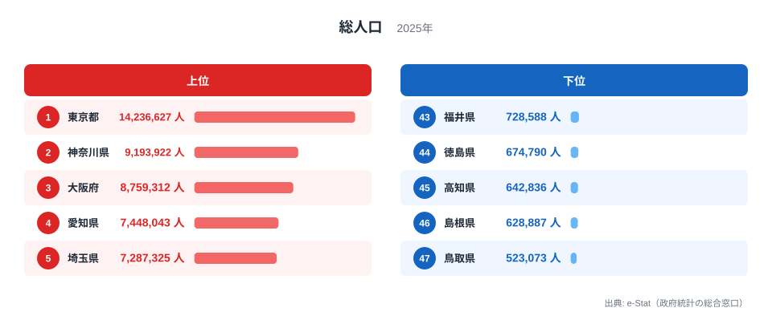

ついにこの日が来ました。Part 1 で `claude --version` を叩き、Part 2 でスキル化を覚え、Part 3-17 で 15 種類のチャートを Claude Code に作らせ、Part 18 で R2 キャッシュを噛ませ、Part 19 で毎週の自動更新を組みました。その総決算が今回の Part 20、「**世に出す**」です。

ローカルで `npm run dev` して綺麗に描画されるチャートを見て満足するのは、エンジニアの自己満足にすぎません。チャートは **URL を持って、検索結果に出て、SNS でシェアされて、初めて社会的な価値** を持ちます。本記事では、これまで連載で作ってきたチャート群を **Next.js App Router + Cloudflare Workers** に乗せ、OG 画像を自動生成し、Google Search Console と Analytics で計測まで仕込んで「公開完了」と言える状態に持っていきます。

Claude Code に頼めば、Next.js のページコンポーネント・OG 画像ジェネレーター・`robots.ts` / `sitemap.ts` の SEO 制御・Cloudflare のデプロイ設定まで、たたき台を一気に書いてもらえます。ただし、ホスティングの仕様は版ごとに変わるので、出てきたコードは公式ドキュメントと突き合わせてください。本記事も、仕様に触れる箇所には公式ドキュメントの URL と確認日（2026-10-07）を添えました。連載 20 本の長旅、最後まで一緒に走り抜けましょう。


## 公開すると、データはどう見えるのか

抽象論の前に、まず「公開するとはどういうことか」を 1 枚の図で掴んでおきましょう。連載で最初に作った Part 3 のチャートは、総務省統計局「国勢調査」の都道府県別人口を描いたものでした。それを本番の `/ranking/total-population` ページに乗せると、読者は次のような上位・下位の対比を一目で見られるようになります。



2025 年の総人口は東京都が 14,236,627 人で最も多く、神奈川県は 9,193,922 人、大阪府は 8,759,312 人、愛知県は 7,448,043 人、埼玉県は 7,287,325 人と続きます。上位 5 都府県のうち、東京都・神奈川県・埼玉県の 3 つは関東にあります。背景には、仕事や進学の機会が都市部に集まってきたことがあるのかもしれませんが、この図は 2025 年の人口だけを並べたものなので、理由までは確かめられません。

下位を見ると、鳥取県が 523,073 人で最も少なく、島根県は 628,887 人、高知県は 642,836 人、徳島県は 674,790 人、福井県は 728,588 人です。山陰・四国・北陸の県が並びますが、並ぶ理由もこの図だけでは分かりません。最多の東京都と最少の鳥取県では人口がおよそ 27.2 倍も開いています。47 都道府県を同じ目盛りで並べるときは、この開きを前提に図の形を選ぶ必要があります。

<source-link href="/ranking/total-population">都道府県別 総人口ランキングをもっと見る</source-link>

> [!NOTE]
> この図の 2025 年の値は、総務省統計局「国勢調査」（令和 7 年）の結果です。国勢調査のない年のランキングには、人口推計の値（千人単位）が入ります。同じ「総人口」の指標でも、年によって元の調査が違うので、年をまたいで比べるときは、図の年と元の調査を確かめてください。

公開とは、こうした「上位と下位の対比」「27.2 倍という開き」を、検索から来た見知らぬ誰かが 1 クリックで眺められる状態にすることです。ローカルの `npm run dev` では、この読者にはたどり着けません。ここからは、その状態を Claude Code でどう作るかを順に見ていきます。

なお、以降のコード例に出てくる `/charts/[slug]` は、本記事で新しく作る例のルートで、stats47.jp に実在する URL ではありません（stats47.jp の既存ルートは `/ranking/[rankingKey]` などです）。ドメインは `example.com` に置き換えて書いてあるので、自分のドメインに読み替えてください。


## なぜ Cloudflare Workers なのか

Next.js のデプロイ先候補は Vercel・Netlify・AWS Amplify・Cloudflare など複数ありますが、stats47.jp は **Cloudflare Workers** に Next.js を載せています。連載の Part 18 と Part 19 には「Cloudflare Pages」という表記が残っていますが、stats47 の配信先は Pages ではなく Workers です。OpenNext の Cloudflare アダプタが対象にしているのは Workers です（[OpenNext 公式「Get Started」](https://opennext.js.org/cloudflare/get-started)、2026-10-07 確認）。Cloudflare の公式ガイドでも、Pages は静的エクスポートの配信先として案内されています（[Cloudflare Docs「Next.js」](https://developers.cloudflare.com/workers/framework-guides/web-apps/nextjs/)、2026-08-25 更新、2026-10-07 確認）。選んだ理由は次の 3 つです。

- **静的ファイルの配信が無料・無制限**: Workers の静的アセットへのリクエストは無料で、回数の上限もありません。一方、Worker のスクリプトが動くリクエスト（SSR など）は Workers の料金で課金されます（[Cloudflare Docs「Static Assets Billing and Limitations」](https://developers.cloudflare.com/workers/static-assets/billing-and-limitations/)、2026-10-07 確認）。統計サイトは画像や JSON の配信量が読めないので、静的に配れる部分に追加料金がかからないのは安心材料になります。
- **R2 などをバインディングで読める**: Part 18 で R2 にキャッシュした e-Stat JSON を、同じ Cloudflare アカウント内で読みに行けます。設定ファイルにバインディングを宣言すると、コードから `getCloudflareContext().env` 経由で使えます（[OpenNext 公式「Bindings」](https://opennext.js.org/cloudflare/bindings)、2026-10-07 確認）。
- **Next.js の主要な機能が動く**: Cloudflare の OpenNext アダプタのページは、App Router・SSG・SSR・ISR・Server Actions・ミドルウェアなどを対応機能として挙げています（[Cloudflare Docs「OpenNext adapter」](https://developers.cloudflare.com/workers/framework-guides/web-apps/opennext/)、2026-10-07 確認）。

弱点は 2 つあります。1 つ目は無料プランの上限で、Workers の無料プランは 1 日 10 万リクエストまでです（[Cloudflare Docs「Limits」](https://developers.cloudflare.com/workers/platform/limits/)、2026-10-07 確認）。2 つ目は Worker のサイズで、上限は圧縮後の大きさで、無料プランは 3 MiB、有料プランは 10 MiB です（[OpenNext 公式「Overview」](https://opennext.js.org/cloudflare)、2026-10-07 確認）。自分の Next.js アプリが上限に収まるかどうかは、Step 5 の `opennextjs-cloudflare build` を実行して確かめてください。

もう 1 点、Cloudflare の公式ガイドは、Workers に Next.js を載せる既定の方法として vinext（Vite のプラグインとして Next.js の API を再実装したもの。ベータ版です）を勧め、OpenNext は既存アプリの保守向けと案内しています（[Cloudflare Docs「Next.js」](https://developers.cloudflare.com/workers/framework-guides/web-apps/nextjs/)、[Cloudflare Docs「OpenNext adapter」](https://developers.cloudflare.com/workers/framework-guides/web-apps/opennext/)、どちらも 2026-08-25 更新、2026-10-07 確認）。stats47 は OpenNext で動いているので、本記事は OpenNext の手順で書きます。これから新しく始める場合は、vinext も候補に入れて比べてください。


## Next.js App Router のページ構成

連載では Pages Router ではなく **App Router** を使ってきました。理由は (a) Server Components で R2 の読み出しをサーバー側に閉じ込められること、(b) `opengraph-image.tsx` で OG 画像が宣言的に作れること、(c) `metadata` export で SEO 設定が型安全になること、の 3 点です。

本記事で追加するファイルは、次の配置になります。

```text
apps/web/
├── open-next.config.ts              # OpenNext の設定（Step 1）
├── wrangler.toml                    # Workers の設定と R2 バインディング（Step 2）
├── data/
│   └── charts/<slug>/data.json      # R2 に置く前のチャートデータ（Step 2）
├── assets/
│   ├── NotoSansJP-Bold-subset.otf   # OG 画像用のフォント（Step 3）
│   └── og-chars.txt                 # フォントに入れる文字の一覧（Step 3 で生成）
├── scripts/
│   └── og-font-chars.mjs            # og-chars.txt を作るスクリプト（Step 3）
└── src/
    ├── lib/
    │   ├── chart-slugs.ts           # 15 個の slug の一覧（Step 1）
    │   └── r2.ts                    # R2 から読む関数（Step 2）
    └── app/
        ├── layout.tsx               # ルート layout（metadataBase と GA 読み込み。Step 3・Step 6）
        ├── robots.ts                # robots.txt 自動生成（Step 4）
        ├── sitemap.ts               # sitemap.xml 自動生成（Step 4）
        └── charts/
            └── [slug]/
                ├── page.tsx                 # 個別チャートページ（Step 1）
                └── opengraph-image.tsx      # チャート別 OG 画像（Step 3）
```

`[slug]` 部分が動的ルーティングです。`/charts/population-bar`、`/charts/aging-heatmap` のように、Part 3-17 で作った 15 種類のチャートがそれぞれ URL を持ちます。

Claude Code に頼むときは、この構造と、守ってほしい前提を最初に伝えておくと迷子になりません。

```text
あなた → claude:
  apps/web/src/app/charts/[slug]/page.tsx を作って。
  Next.js 15 の App Router なので、params は Promise にして。
  データは apps/web/src/lib/r2.ts の fetchChartData で読んで（Step 2 で作る）、
  packages/visualization の BarChart などに流す。
  slug の一覧は apps/web/src/lib/chart-slugs.ts の CHART_SLUGS を
  generateStaticParams で返す。
  generateMetadata の title / description は、data.json の値から作る。
```


## Step 1: 静的生成 vs ISR vs CSR の選択

最初に、必要なパッケージを入れます。連載の `apps/web` のように、Next.js 15 の App Router で作ったアプリがすでにある前提で、足すのは OpenNext のアダプタと wrangler です。コマンドは、OpenNext 公式「Get Started」と Cloudflare Docs「OpenNext adapter」に載っている形です（どちらも 2026-10-07 確認）。

```bash
cd apps/web
npm install @opennextjs/cloudflare@latest
npm install --save-dev wrangler@latest typescript@5
```

`typescript@5` を足したのは、版を固定するためです。TypeScript の最新版 7.0.2 を入れた状態で Next.js 15.5.27 をビルドしたところ、`Failed to load next.config.ts`（`Cannot read properties of undefined (reading 'fileExists')`）で止まりました。TypeScript 5.9.3 では通りました。

動作確認した版は次のとおりです（2026-10-07 に npm から入った版です）。

- **Next.js 15.5.27**: `next@15` で入る最新の版です。Next.js 16 系では試していません
- **@opennextjs/cloudflare 1.20.9**: peerDependencies は next が `>=15.5.27 <16 || >=16.3.8`、wrangler が `^4.125.0` です
- **wrangler 4.148.0**: Step 2 の `remote = true` が使えるのは 4.36.0 以降で、それより古い wrangler では別のキー（`experimental_remote`）になります（[OpenNext 公式「Bindings」](https://opennext.js.org/cloudflare/bindings)、2026-10-07 確認）
- **TypeScript 5.9.3**

確かめた範囲も書いておきます。ローカルの擬似 R2 にデータを 1 件置き、`opennextjs-cloudflare build` が通って、静的な HTML と OG 画像の PNG ができるところまで、この版の組み合わせで動かしました。本物の R2 を読むビルド、Cloudflare へのデプロイ、GitHub Actions の実行は、手元に認証情報がなく、確かめていません。

次に、ページを書く前に、**レンダリング戦略** を決めます。Next.js App Router では (a) Static（ビルド時生成）、(b) ISR（Incremental Static Regeneration）、(c) Dynamic（リクエスト時 SSR）、(d) Client-only の 4 つから選べます。OpenNext で Cloudflare に載せるときの向き不向きは次のとおりです。

- **Static**（SSG）: 統計データやブログ記事に向きます。HTML をビルド時に作るので、更新は再ビルドして再デプロイしたときです。OpenNext は静的なサイトなら、キューとタグキャッシュを使わずに、Workers の静的アセットを使う読み取り専用の incremental cache で動かせます。
- **ISR**: 頻繁に更新される一覧に向きます。`revalidate` の秒数で再生成しますが、OpenNext では既定では動かず、incremental cache（R2 や KV）とキューの設定が必要です。
- **Dynamic**（SSR）: ユーザー固有データに向きます。リクエストごとに Worker で生成します。OpenNext では、キャッシュ設定なしで動きます。
- **Client**（CSR）: インタラクティブ UI に向きます。初期表示は JS の読み込みを待ちます。

OpenNext の記述は、公式の [Caching](https://opennext.js.org/cloudflare/caching) のページに沿っています（2026-10-07 確認）。

連載のチャートは **e-Stat の年次データ** が中心で、データが変わるのは統計が公表されたときだけです。そこで **SSG を選びます**。`generateStaticParams` で slug を返し、ビルド時に静的 HTML を作ります。SSG のサイトに必要な `open-next.config.ts` は、公式の例にならった次の 1 ファイルです。

```ts
// apps/web/open-next.config.ts
import { defineCloudflareConfig } from "@opennextjs/cloudflare";
import staticAssetsIncrementalCache from "@opennextjs/cloudflare/overrides/incremental-cache/static-assets-incremental-cache";

export default defineCloudflareConfig({
  incrementalCache: staticAssetsIncrementalCache,
  enableCacheInterception: true,
});
```

次に、slug の一覧を 1 ファイルにまとめます。page・OG 画像・sitemap の 3 か所が同じ一覧を読むので、チャートを足したときの追記先はここだけになります。

```ts
// apps/web/src/lib/chart-slugs.ts
export const CHART_SLUGS = [
  "population-bar", // Part 3
  "aging-heatmap", // Part 4
  "medical-cost-choropleth", // Part 5
  "income-scatter", // Part 6
  "birthrate-line", // Part 7
  "bar-chart-race", // Part 8
  "radar-prefecture", // Part 9
  "wage-box-plot", // Part 10
  "tourism-stacked", // Part 11
  "housing-treemap", // Part 12
  "agri-sankey", // Part 13
  "energy-area-chart", // Part 14
  "crime-small-multiple", // Part 15
  "commerce-bubble", // Part 16
  "edu-slope-graph", // Part 17
] as const;

export type ChartSlug = (typeof CHART_SLUGS)[number];
```

そのうえで、個別チャートのページを書きます。

```tsx
// apps/web/src/app/charts/[slug]/page.tsx
import { notFound } from "next/navigation";
import { CHART_SLUGS } from "@/lib/chart-slugs";
import { fetchChartData } from "@/lib/r2";
// Part 3-17 のチャートを chartType で切り替えて描く部品（本記事では省略）
import { ChartRenderer } from "@/components/ChartRenderer";

export async function generateStaticParams() {
  return CHART_SLUGS.map((slug) => ({ slug }));
}

export const dynamicParams = false; // CHART_SLUGS 以外は 404

type Props = { params: Promise<{ slug: string }> };

export async function generateMetadata({ params }: Props) {
  const { slug } = await params;
  const data = await fetchChartData(slug);
  if (!data) return {};
  return {
    title: `${data.title}｜stats47`,
    description: data.description,
  };
}

export default async function ChartPage({ params }: Props) {
  const { slug } = await params;
  const data = await fetchChartData(slug);
  if (!data) notFound();
  return (
    <article className="mx-auto max-w-3xl px-4 py-8">
      <h1 className="text-2xl font-bold">{data.title}</h1>
      <p className="mt-2 text-slate-600">{data.description}</p>
      <ChartRenderer type={data.chartType} data={data.values} />
    </article>
  );
}
```

ポイントは 3 つあります。

1. **`generateStaticParams`** で全 slug を返し、`dynamicParams = false` で範囲外を 404 にします。`generateStaticParams` が返したパスだけが配信され、それ以外は 404 になります（[Next.js「generateStaticParams」](https://nextjs.org/docs/app/api-reference/functions/generate-static-params)、2026-10-01 更新、2026-10-07 確認）
2. **`params` が Promise** になっています。Next.js 15 で `page`・`layout`・`generateMetadata` の `params` は非同期になりました（[Next.js「Upgrading: Version 15」](https://nextjs.org/docs/app/guides/upgrading/version-15)、2026-10-02 更新、2026-10-07 確認）。15 では同期アクセスも当面は許されていますが、公式は将来廃止すると書いているので（[Next.js「Dynamic Route Segments」](https://nextjs.org/docs/app/api-reference/file-conventions/dynamic-routes)、2026-06-09 更新）、`await params` と書いておきます
3. **OG 画像のタグは書きません**。同じフォルダに `opengraph-image.tsx` を置くと、`og:image` などのタグが自動で付きます（次の Step で作ります）

Claude Code に「Next.js 15 の App Router でチャートページを書いて」と頼むと、Next.js 14 流の `params: { slug: string }` を返してくることがあります。「**Next.js 15 系を使うので params は Promise**」と明示するのが事故防止のコツです。


## Step 2: チャート JSON を R2 から fetch（Part 18 と連携）

`fetchChartData` は、Part 18 で決めた命名規約 `app/<page-type>/<key>/<resource>.json` に沿って R2 を読みます。この規約に当てはめて、page-type を `charts`、key をチャートの slug、resource を `data` にしたものが、本記事で使うキー `app/charts/<slug>/data.json` です。Part 18 と Part 19 の本文には、`charts` も `data.json` も出てきません。あとで示す `ChartData`（title・description・chartType・values）の形も、本記事で初めて決めるものです。

Part 18 の `wrangler.toml` では、R2 のバインディング名を `R2`、バケット名を `stats47-cache` にしていました。ここでもその名前をそのまま使います。まず、Part 18 の `wrangler.toml` に OpenNext 用の設定を足します。

```toml
# apps/web/wrangler.toml（Part 18 の設定に、「追加」と書いた行を足した形）
name = "stats47"
main = ".open-next/worker.js"            # 追加: OpenNext が作る Worker
compatibility_date = "2026-06-01"
compatibility_flags = ["nodejs_compat", "global_fetch_strictly_public"]  # 追加

[assets]                                 # 追加: 静的ファイルの置き場
directory = ".open-next/assets"
binding = "ASSETS"

[[r2_buckets]]
binding = "R2"                           # Part 18 と同じ名前
bucket_name = "stats47-cache"
remote = true                            # 追加: ビルド中も本物の R2 を読む
```

Part 18 の `wrangler.toml` に `binding` などほかの行があれば、そのまま残します。ただし、`preview_bucket_name = "stats47-cache-preview"` の行だけは消します。Cloudflare の公式は、`preview_bucket_name` があると `wrangler dev` がその名前のバケットを使うと書いています（[Cloudflare Docs「Configuration」](https://developers.cloudflare.com/workers/wrangler/configuration/)、2026-10-07 確認）。OpenNext は、ビルドのときに wrangler の `getPlatformProxy` でバインディングを読みます。ローカルの擬似 R2 で試すと、この行が残っているかぎり、`stats47-cache` に置いたデータが読めず、データを置いたはずのページも「見つかりません」で焼き込まれました。`remote = true` のときも、wrangler 4.148.0 のソースは `preview_bucket_name` を優先する実装でしたが、本物の R2 では確かめていません。本番の `stats47-cache` を読ませたいので、行を消しておくのが安全です。

追加した `main`・`[assets]`・`compatibility_flags` は、OpenNext 公式と Cloudflare のガイドの設定例にならっています。`nodejs_compat` は Node.js の API を使えるようにするフラグ、`global_fetch_strictly_public` はアプリ内から URL を `fetch` できるようにするフラグです（[OpenNext 公式「Get Started」](https://opennext.js.org/cloudflare/get-started)、[Cloudflare Docs「OpenNext adapter」](https://developers.cloudflare.com/workers/framework-guides/web-apps/opennext/)、どちらも 2026-10-07 確認）。なお、Cloudflare の Node.js 互換のページは、互換日が 2026-08-04 以降なら `nodejs_compat` が既定で有効になると書いています（[Cloudflare Docs「Node.js compatibility」](https://developers.cloudflare.com/workers/runtime-apis/nodejs/)、2026-08-12 更新、2026-10-07 確認）。

引っかかりやすいのは、静的生成のあいだの R2 です。OpenNext の公式は、`getCloudflareContext()` を静的生成のルートで呼べるのは async モード（`getCloudflareContext({ async: true })`）だけだと書いています。しかも、静的生成中のバインディングにはローカル開発用の擬似値が使われます（[OpenNext 公式「Bindings」](https://opennext.js.org/cloudflare/bindings)、2026-10-07 確認）。stats47 が使っている OpenNext 1.20.2 のソースも、同期モードで静的ルートから呼ぶとエラーを投げる実装でした。ローカルの擬似 R2 は空なので、本物の R2 を読ませるには、Cloudflare のリモートバインディング（バインディングに `remote = true` を付ける）を使います（[Cloudflare Docs「Local development」](https://developers.cloudflare.com/workers/local-development/#remote-bindings)、2026-10-07 確認）。OpenNext の公式も、リモートバインディングはビルド中にも使われ、本番のデータを静的生成に使えると書いています。裏返せば、ビルドが本番の R2 を読むということです。ローカルで動かすときも、アプリのコードは本物の R2 に接続します。リモートバインディング経由の R2 の操作には、通常の料金がかかります（同じ Cloudflare Docs の記述）。

読み出しの関数は次のとおりです。

```ts
// apps/web/src/lib/r2.ts
import { getCloudflareContext } from "@opennextjs/cloudflare";

export type ChartData = {
  title: string;
  description: string;
  chartType: string; // ChartRenderer が描き分けに使う識別子
  values: unknown;
};

// 静的生成中でもリクエスト中でも動くよう、async モードで取り出す
async function getBucket() {
  const { env } = await getCloudflareContext({ async: true });
  return env.R2;
}

export async function fetchChartData(
  slug: string,
): Promise<ChartData | null> {
  const bucket = await getBucket();
  const obj = await bucket.get(`app/charts/${slug}/data.json`);
  if (!obj) return null;
  return obj.json<ChartData>();
}
```

`env.R2` の型は、`npx wrangler types --env-interface CloudflareEnv` で生成します（[OpenNext 公式「Bindings」](https://opennext.js.org/cloudflare/bindings)）。`wrangler.toml` を変えるたびに、このコマンドを実行し直してください。R2 の `get` は、キーが無ければ `null` を返します（[Cloudflare Docs「R2 Workers API」](https://developers.cloudflare.com/r2/api/workers/workers-api-reference/)、2026-10-07 確認）。

次に、最初のデータを R2 に置きます。読むだけのコードがあっても、バケットが空なら、Step 1 の `CHART_SLUGS` で作る全ページが「見つかりません」の静的ページ（status 404・noindex）になるからです。Part 3 の人口データを、次の形の `data/charts/population-bar/data.json` に整えます。整形は、`ChartData` の型を見せたうえで Claude Code に頼めば書いてもらえます。紙面では 47 都道府県のうち先頭の 3 件だけを示します。`values` には残りの都道府県が同じ形で続きます。

```json
{
  "title": "都道府県別 総人口（2025年）",
  "description": "総務省統計局「国勢調査」にもとづく、47都道府県の総人口です。",
  "chartType": "bar",
  "values": [
    { "areaName": "東京都", "value": 14236627 },
    { "areaName": "神奈川県", "value": 9193922 },
    { "areaName": "大阪府", "value": 8759312 }
  ]
}
```

このファイルを、`wrangler r2 object put` で本物のバケットに置きます。

```bash
npx wrangler r2 object put stats47-cache/app/charts/population-bar/data.json \
  --file ./data/charts/population-bar/data.json \
  --content-type application/json \
  --remote
```

`--remote` を付け忘れないでください。wrangler 4.148.0 は、`--remote` なしで実行すると `Resource location: local` と表示して、ローカルの擬似バケットに書き込みます。「Upload complete.」と出ても、本物のバケットは空のままです。Part 18 の `wrangler r2 object put` の例には `--remote` がありませんが、wrangler 4 で本物のバケットに置くときは付けます。実行には、`wrangler login` で Cloudflare にログインしているか、Step 5 で使う `CLOUDFLARE_API_TOKEN` と `CLOUDFLARE_ACCOUNT_ID` の環境変数が要ります。置けたかどうかは、次のコマンドで確かめます。

```bash
npx wrangler r2 object get stats47-cache/app/charts/population-bar/data.json --remote --pipe
```

ここで手元で動かして確かめたのは、`--remote` を `--local` に替えた形（ローカルの擬似バケットへの書き込みと読み出し）までです。本物のバケットへの書き込みは、認証情報が無く、確かめていません。

Claude Code には、前提を渡して頼みます。

```text
あなた → claude:
  apps/web/src/lib/r2.ts を作って。
  getCloudflareContext は静的生成中にも呼ばれるので { async: true } で取り出す。
  R2 のバインディング名は R2、キーは app/charts/<slug>/data.json。
```

キーを `app/charts/[slug]/data.json` に統一し、`all.json` のようなモノリスを作らず、URL 1 個につき JSON 1 個の形で並べておく理由は、Part 18 で説明したので割愛します。


## Step 3: OG 画像を Next.js の opengraph-image.tsx で自動生成

SNS やチャットで URL を貼ったときに出るカード画像、いわゆる **OG 画像** があります。チャートが増えるたびに手作業で作るのは現実的ではありません。

Next.js App Router には `opengraph-image.tsx` という規約があり、**ファイルを置くだけで OG 画像のエンドポイントができ、`og:image` などのタグも自動で付きます**（[Next.js「opengraph-image」](https://nextjs.org/docs/app/api-reference/file-conventions/metadata/opengraph-image)、2026-07-09 更新、2026-10-07 確認）。画像は `ImageResponse` で作ります。Satori と Resvg を使って、HTML と CSS を PNG に変換する仕組みです（[Next.js「ImageResponse」](https://nextjs.org/docs/app/api-reference/functions/image-response)、2026-08-06 更新、2026-10-07 確認）。

```tsx
// apps/web/src/app/charts/[slug]/opengraph-image.tsx
import { readFile } from "node:fs/promises";
import { join } from "node:path";
import { ImageResponse } from "next/og";
import { CHART_SLUGS } from "@/lib/chart-slugs";
import { fetchChartData } from "@/lib/r2";

export const alt = "stats47 チャート";
export const size = { width: 1200, height: 630 };
export const contentType = "image/png";

// 静的に生成するので、page.tsx と同じ slug をここでも返す
export function generateStaticParams() {
  return CHART_SLUGS.map((slug) => ({ slug }));
}

// フォントはリクエストに依存しないので、モジュールの先頭で 1 回だけ読む
const font = await readFile(
  join(process.cwd(), "assets/NotoSansJP-Bold-subset.otf"),
);

export default async function OgImage({
  params,
}: {
  params: Promise<{ slug: string }>;
}) {
  const { slug } = await params;
  const data = await fetchChartData(slug);
  const title = data?.title ?? "stats47";
  const subtitle = data?.description ?? "47 都道府県の統計データ";

  return new ImageResponse(
    (
      <div
        style={{
          display: "flex",
          flexDirection: "column",
          justifyContent: "space-between",
          width: "100%",
          height: "100%",
          padding: "64px",
          background:
            "linear-gradient(135deg, #0f172a 0%, #1e3a8a 100%)",
          color: "#fff",
          fontFamily: "Noto Sans JP",
        }}
      >
        <div style={{ fontSize: 32, opacity: 0.7 }}>stats47.jp</div>
        <div style={{ display: "flex", flexDirection: "column", gap: 16 }}>
          <div style={{ fontSize: 64, fontWeight: 700, lineHeight: 1.2 }}>
            {title}
          </div>
          <div style={{ fontSize: 28, opacity: 0.85 }}>{subtitle}</div>
        </div>
        <div style={{ fontSize: 24, opacity: 0.6 }}>
          47 都道府県統計データの可視化
        </div>
      </div>
    ),
    {
      ...size,
      fonts: [
        { name: "Noto Sans JP", data: font, weight: 700, style: "normal" },
      ],
    },
  );
}
```

これで `/charts/<slug>/opengraph-image` の形の URL ができ、1200×630 の PNG が返ります。本番では、URL の末尾にハッシュが付いて配信されます（[Next.js「Metadata Files」](https://nextjs.org/docs/app/api-reference/file-conventions/metadata)、2025-10-17 更新、2026-10-07 確認）。このコードは、OG 画像をビルド時に静的生成する前提です。リクエストのたびに Workers 上で生成する構成は、本記事では扱いません。

ただし、このコードだけでは `og:image` の URL が壊れます。`opengraph-image.tsx` が作る `og:image` のタグは、相対パスから絶対 URL を組み立てるときに `metadataBase` を使います。ルートの `layout.tsx` に `metadataBase` が無いと、`next build` は「metadataBase property in metadata export is not set ... using "http://localhost:3000"」という警告を出し、ビルドでできた HTML の `og:image` も `http://localhost:3000/charts/population-bar/opengraph-image?…` になりました。これでは SNS のカードに画像が出ません。Next.js の公式は、`metadataBase` を通常はルートの `app/layout.tsx` に置くと書いています（[Next.js「generateMetadata」](https://nextjs.org/docs/app/api-reference/functions/generate-metadata)、2026-08-19 更新、2026-10-07 確認）。`layout.tsx` に、次の `metadata` を足します。

```tsx
// apps/web/src/app/layout.tsx（Step 6 の完成形にも、同じ記述が入っています）
import type { Metadata } from "next";

export const metadata: Metadata = {
  metadataBase: new URL("https://example.com"), // 自分のドメインに置き換える
};
```

足したあとは、同じビルドで `og:image` が `https://example.com/charts/population-bar/opengraph-image?…` になることを確かめました。

注意点が 3 つあります。

- **`export const runtime = "edge"` は付けません**。OpenNext の公式は、edge ランタイムは未対応なので、付いていれば取り除くよう案内しています（[OpenNext 公式「Get Started」](https://opennext.js.org/cloudflare/get-started)、2026-10-07 確認）。OpenNext で動かすアプリは Node.js ランタイムを使います（[OpenNext 公式「Overview」](https://opennext.js.org/cloudflare)）。この指定は、`@cloudflare/next-on-pages` のように edge ランタイムだけを対応するアダプタ向けの書き方で、Claude Code が生成した OG 画像のコードに入っていることがあります。入っていたら取り除いてください
- **フォントは `ttf`・`otf`・`woff` だけ読めます**。`woff2` は読めません。しかも `ImageResponse` のバンドルは、JSX・CSS・フォント・画像をすべて含めて 500KB が上限です。日本語のフォントは、使う文字だけに絞ったサブセットを `assets/` に置きます（作り方は次の節に書きました）。絵文字は `emoji` オプション（既定は `twemoji`）で描き方を選べます
- **`params` の型は Promise にして `await` します**。Next.js のドキュメントの Version History は、`opengraph-image` の `params` が Promise になったのを v16.0.0 としています。手元の Next.js 15.5.27 のソース（`next-metadata-route-loader.js`）では、通常のオブジェクトを渡していました。`await` はどちらでも動くので、Promise として書いておけば 15 でも 16 でも通ります

OG 画像用のフォント `assets/NotoSansJP-Bold-subset.otf` は、自分で作ります。ファイルが無いと、`next build` は `ENOENT: no such file or directory` で止まります（`/charts/[slug]/opengraph-image` の「Failed to collect page data」）。作り方は 3 段階です。

1. 元のフォントとして、Noto Sans JP の Bold を、noto-cjk リポジトリの `Sans/SubsetOTF/JP/` から取ります。同じリポジトリの README が、地域別の Subset OTF を置くフォルダとして案内している `SubsetOTF` の中の、日本向けのフォルダです（[googlefonts/noto-cjk の Sans の README](https://github.com/googlefonts/noto-cjk/blob/main/Sans/README.md)、2026-10-07 確認）。ライセンスは SIL Open Font License 1.1 です（同じ `Sans/LICENSE`）。約 4.6 MB あるので、リポジトリの外に置きます
2. OG 画像に出す文字を、`data/charts/*/data.json` の title と description、`opengraph-image.tsx` に直接書いた文字から集めます
3. その文字だけを残したフォントを、fonttools の `pyftsubset` で作ります

```bash
# 1. 元のフォントを取る（リポジトリの外の ~/fonts に置く）
mkdir -p ~/fonts
curl -L -o ~/fonts/NotoSansJP-Bold.otf \
  https://raw.githubusercontent.com/googlefonts/noto-cjk/main/Sans/SubsetOTF/JP/NotoSansJP-Bold.otf

# 2. 文字の一覧 assets/og-chars.txt を作る（スクリプトは下）
node scripts/og-font-chars.mjs

# 3. サブセットを作る
pip install fonttools
pyftsubset ~/fonts/NotoSansJP-Bold.otf \
  --text-file=assets/og-chars.txt \
  --unicodes="U+0020-007E,U+3000-303F,U+3040-309F,U+30A0-30FF,U+FF01-FF5E" \
  --output-file=assets/NotoSansJP-Bold-subset.otf
```

2 で使うスクリプトは次のとおりです。

```js
// apps/web/scripts/og-font-chars.mjs
import { readdirSync, readFileSync, writeFileSync } from "node:fs";

const dir = "data/charts"; // チャートごとに <slug>/data.json を置いたフォルダ
// opengraph-image.tsx に直接書いてある文字
let text = "stats47.jp47都道府県統計データの可視化";
for (const slug of readdirSync(dir)) {
  const data = JSON.parse(readFileSync(`${dir}/${slug}/data.json`, "utf8"));
  text += data.title + data.description;
}
writeFileSync("assets/og-chars.txt", [...new Set(text)].join(""));
```

`--unicodes` の範囲は、英数字・日本語の記号・ひらがな・カタカナ・全角の英数字と記号です。漢字は `og-chars.txt` の分だけが入ります。この条件で、漢字を入れない場合は 111,308 バイト、この記事の本文から取った漢字 300 字を足した場合は 180,188 バイトでした。`ImageResponse` のバンドルの上限は JSX や CSS を含めて 500KB なので、`ls -l assets` で大きさを見ておきます。

チャートを足して題名に新しい漢字が増えたら、2 と 3 をやり直します。フォントに無い文字は、OG 画像の中で正しく描かれません。Step 4 の最後に書く `chart-slugs.ts` への追記と、このフォントの作り直しは、チャートを足すときの 2 つの作業です。

デプロイの前には、次の 3 つを確かめます。

- `npm run preview`（Step 5 で作ります）で Workers のランタイムに近い環境を起動し、OG 画像の URL を開いて、PNG が返ることを確かめます
- ビルドでできた HTML の `og:image` が、自分のドメインの絶対 URL になっているかを確かめます。`localhost` が見えたら、`metadataBase` が効いていません。`opennextjs-cloudflare build` のあとなら、次のコマンドで見られます。公開後は、`curl -s https://example.com/charts/population-bar` の出力に同じ `grep` をかけます

```bash
grep -o '<meta property="og:image"[^>]*>' .next/server/app/charts/population-bar.html
```

- 公開したあとで、実際にその URL を SNS に貼り、カードに画像が出ることを確かめます。Step 4 で `/*/opengraph-image` を robots.txt の Disallow に入れているため、SNS のクローラーがカード画像を取れるかどうかは、公式の資料では確かめられませんでした。Meta の公式ページは、FacebookExternalHit がセキュリティや整合性の確認のときに robots.txt を無視することがある、とだけ書いています（[Meta for Developers の Web クローラーのページ](https://developers.facebook.com/docs/sharing/webmasters/web-crawlers)、2026-10-07 確認）。X の公式ページは、取得できませんでした。画像が出ないときは、Disallow から外すか、そのクローラー向けのグループで許可するかを選びます。外すと、Step 4 で見る「クロール済み - インデックス未登録」が増えるおそれがあります


## Step 4: robots.ts と sitemap.ts によるインデックス制御

新規ページを追加するときに **絶対に忘れてはいけない** のがインデックス制御です。stats47 は、OG 画像 URL の Disallow 漏れと noindex の未設定が重なって、GSC に「クロール済み - インデックス未登録」が 1,453 件たまったことがあります（リポジトリの `.claude/rules/coding-standards.md` の記録です）。

App Router では `robots.ts` と `sitemap.ts` を `app` 直下に置けば、それぞれ `/robots.txt` と `/sitemap.xml` が自動生成されます（[Next.js「robots.txt」](https://nextjs.org/docs/app/api-reference/file-conventions/metadata/robots)、2026-05-01 更新、[Next.js「sitemap.xml」](https://nextjs.org/docs/app/api-reference/file-conventions/metadata/sitemap)、2026-08-25 更新、どちらも 2026-10-07 確認）。

```ts
// apps/web/src/app/robots.ts
import type { MetadataRoute } from "next";

export default function robots(): MetadataRoute.Robots {
  return {
    rules: [
      {
        userAgent: "*",
        allow: "/",
        disallow: [
          "/api/",
          "/admin/",
          "/*/opengraph-image", // ← 重要: OG 画像 URL はクロールさせない
        ],
      },
    ],
    sitemap: "https://example.com/sitemap.xml", // 自分のドメインに置き換える
  };
}
```

`/*/opengraph-image` の Disallow を入れ忘れると、OG 画像の URL が Google のクロール対象になり、GSC の「クロール済み - インデックス未登録」に積み上がる可能性があります。パスの中のワイルドカード `*` は、Google の robots.txt の仕様で使えます（[Google「robots.txt の仕様」](https://developers.google.com/search/docs/crawling-indexing/robots/robots_txt)、2026-08-31 更新、2026-10-07 確認）。stats47 の実際の robots.txt（`https://stats47.jp/robots.txt`）も、同じ `/*/opengraph-image` を Disallow しています。この Disallow が SNS のカード画像の取得に影響しないかどうかは、Step 3 の最後の確認項目のとおり、公開後に確かめてください。

一方、`/_next/` は Disallow に入れません。Google の JavaScript SEO のガイドは、ブロックされたファイルやページの JavaScript を Google 検索は描画しない、と説明しています（[Google「JavaScript SEO の基本」](https://developers.google.com/search/docs/crawling-indexing/javascript/javascript-seo-basics)、2026-03-04 更新、2026-10-07 確認）。Next.js の JS ファイルは `/_next/` の下から配信されるので、ここを塞ぐと描画に必要なファイルまで塞ぐことになります。

```ts
// apps/web/src/app/sitemap.ts
import type { MetadataRoute } from "next";
import { CHART_SLUGS } from "@/lib/chart-slugs";

export default function sitemap(): MetadataRoute.Sitemap {
  return [
    { url: "https://example.com/" },
    ...CHART_SLUGS.map((slug) => ({
      url: `https://example.com/charts/${slug}`,
    })),
  ];
}
```

Step 1 と同じ `CHART_SLUGS` を読むので、チャートを足したときの追記先は `chart-slugs.ts` の 1 か所だけです。サイトマップには **OG 画像 URL を含めません**（Disallow と矛盾するためです）。Google は、サイトマップを URL を発見してもらう重要な手段だと説明しています（[Google「再クロールのリクエスト」](https://developers.google.com/search/docs/crawling-indexing/ask-google-to-recrawl)、2025-12-10 更新、2026-10-07 確認）。

Claude Code に「`apps/web/src/app/charts/[slug]/page.tsx` を新規作成」と頼むときは、**プロンプトに「同時に `chart-slugs.ts` にも追記して」と書く** のがチェックリスト化のコツです。

> [!TIP]
> 公開直後に「インデックスされているか」を確かめたいときは、`site:` 検索より、GSC の URL 検査ツールに個別 URL を入れるほうが確実です。Google は、`site:` 演算子が指定した範囲のインデックス済み URL をすべて返すとは限らないと説明し、URL が出てこないときは URL 検査ツールで確かめてインデックス登録をリクエストするよう案内しています（[Google「site: 演算子」](https://developers.google.com/search/docs/monitor-debug/search-operators/all-search-site)、2025-12-10 更新、2026-10-07 確認）。ただし、リクエストしても、すぐに、あるいは必ず登録されるとは限りません。


## Step 5: Cloudflare Workers デプロイ

ビルドとデプロイは、OpenNext の CLI（`opennextjs-cloudflare`）で行います。`next build` の出力を Workers で動く形に変換するアダプタです。`package.json` の scripts は、Cloudflare の OpenNext ガイドの形に合わせます（[Cloudflare Docs「OpenNext adapter」](https://developers.cloudflare.com/workers/framework-guides/web-apps/opennext/)、2026-10-07 確認）。

```json
{
  "scripts": {
    "build": "next build",
    "preview": "opennextjs-cloudflare build && opennextjs-cloudflare preview",
    "deploy": "opennextjs-cloudflare build && opennextjs-cloudflare deploy"
  }
}
```

`npm run preview` は、アプリをビルドして Workers のランタイムでローカルに起動します。本番に近い環境でブラウザ確認できます。デプロイは `npm run deploy` の 1 コマンドで、ビルドから Workers へのデプロイまでを行います。

CI でやるなら `.github/workflows/deploy.yml` を組みます。Cloudflare の公式ガイドは `cloudflare/wrangler-action` を使う例を示していますが（[Cloudflare Docs「GitHub Actions」](https://developers.cloudflare.com/workers/ci-cd/external-cicd/github-actions/)、2026-09-18 更新、2026-10-07 確認）、ここでは OpenNext のビルドが要るので、`npm run deploy` を直接実行します。

```yaml
name: Deploy to Cloudflare Workers
on:
  push:
    branches: [main]
  workflow_run:
    workflows: ["Weekly Refresh"] # Part 19 の weekly-refresh.yml の name と同じ文字列にする
    types: [completed]
  workflow_dispatch: # 手動で再デプロイしたいとき
jobs:
  deploy:
    # Part 19 の更新が成功した週だけデプロイする（push と手動実行はそのまま通す）
    if: github.event_name != 'workflow_run' || github.event.workflow_run.conclusion == 'success'
    runs-on: ubuntu-latest
    timeout-minutes: 20
    steps:
      - uses: actions/checkout@v6
      - uses: actions/setup-node@v7
        with:
          node-version: 22
      - run: npm ci
      - name: Build and deploy
        run: npm run deploy
        working-directory: apps/web
        env:
          CLOUDFLARE_API_TOKEN: ${{ secrets.CLOUDFLARE_API_TOKEN }}
          CLOUDFLARE_ACCOUNT_ID: ${{ secrets.CLOUDFLARE_ACCOUNT_ID }}
          NEXT_PUBLIC_GA_ID: ${{ vars.NEXT_PUBLIC_GA_ID }}
```

このワークフローが起動する条件は 3 つあります。`push`（main）は、コードを変えたときです。`workflow_dispatch` は、手動で再デプロイしたいときです。そして `workflow_run` が、Part 19 の毎週の更新とデプロイをつなぐ条件です。Part 19 の `weekly-refresh.yml` は `name: Weekly Refresh` で、毎週日曜 JST 20:00 に R2 のデータを更新します。その workflow が終わると、`workflows: ["Weekly Refresh"]` に当てはまって、この `deploy.yml` が起動します。`if` の行で、更新が成功した週だけデプロイするようにしています。

`push` だけでは、毎週のデプロイは起動しません。Part 19 の workflow は最後に metrics を `git push` しますが、`actions/checkout` に token を指定していないので、`GITHUB_TOKEN` による push になります。GitHub の公式は、`GITHUB_TOKEN` が起こしたイベントは、`workflow_dispatch` と `repository_dispatch` などの例外を除いて、新しい workflow run を作らないと説明しています（[GitHub Docs「GITHUB_TOKEN」](https://docs.github.com/en/actions/concepts/security/github_token)、2026-10-07 確認）。

`workflow_run` には、守る点が 3 つあります（[GitHub Docs「Events that trigger workflows」](https://docs.github.com/en/actions/reference/workflows-and-actions/events-that-trigger-workflows)、2026-10-07 確認）。1 つ目は、この `deploy.yml` がデフォルトブランチ（main）に入っていないと、起動しないことです。2 つ目は、`workflows:` の文字列を、Part 19 の `name:` と同じにすることです。3 つ目は、起動したデプロイが、デフォルトブランチの最新のコミットで動くことです。Part 19 の workflow が最後に push した metrics のコミットも、そこに入っています。

更新が失敗した週は、`conclusion == 'success'` を満たさないので、デプロイは走りません。チャートのページは前の週の HTML のままで、Part 19 が起票する失敗の Issue が、その知らせになります。原因を直して Part 19 の workflow を再実行し（`gh workflow run weekly-refresh.yml -f stage=all`）、成功すれば、続けてデプロイが走ります。デプロイだけをやり直したいときは、`gh workflow run deploy.yml` で手動起動できます。この `workflow_run` の部分は、`actionlint` 1.7.12 で書き方を確かめましたが、GitHub 上での実行は確かめていません。

`CLOUDFLARE_API_TOKEN` と `CLOUDFLARE_ACCOUNT_ID` は、リポジトリではなく GitHub の secrets に保存します。トークンは、Cloudflare のダッシュボードの Account API tokens で Create Token を押し、Custom の「Edit Cloudflare Workers」を選んで発行します。公式は、トークンの対象をデプロイ先のアカウントだけに絞るよう勧めています（同じ GitHub Actions のガイド）。ビルド中のリモートバインディングは本物の R2 に接続するので、同じ環境変数をそのまま渡します。権限が足りなければ、ビルドかデプロイの段階でエラーになるので、そのときに足してください。

初回デプロイのチェックリストはこちらです。

1. `wrangler.toml` の `main` と `[assets]` の `directory` が、`opennextjs-cloudflare build` の出力（`.open-next/worker.js` と `.open-next/assets`）と一致しているか（`ls .open-next` で確認）。`.open-next` はビルド出力なので、`.gitignore` に入れます
2. `wrangler whoami` で、意図した Cloudflare アカウントにログインしているか
3. R2 バケットが Cloudflare 上に作成済みか（`npx wrangler r2 bucket list` に `stats47-cache` が出るか確認）
4. `NEXT_PUBLIC_` で始まる環境変数が、ビルドのときに渡されているか。これらはビルド時にブラウザ向けの JS へ埋め込まれ、ビルド後に変えても反映されません（[Next.js「Environment Variables」](https://nextjs.org/docs/app/guides/environment-variables)、2026-08-25 更新、2026-10-07 確認）。CI では build ステップの `env` に書きます
5. カスタムドメインを Worker に割り当てたか。ダッシュボードの Settings → Domains & Routes → Add → Custom Domain で追加するか、設定ファイルの `routes` に `custom_domain = true` を書きます（[Cloudflare Docs「Custom Domains」](https://developers.cloudflare.com/workers/configuration/routing/custom-domains/)、2026-10-07 確認）。割り当てたら `dig example.com` で名前が解決できるか確認します
6. デプロイ後の URL で `/robots.txt` と `/sitemap.xml` が 200 を返すか（`curl -I https://example.com/robots.txt` で確認）
7. 毎週の更新とデプロイがつながっているか。`deploy.yml` を main に入れたあと、Part 19 の workflow を一度手動で実行し（`gh workflow run weekly-refresh.yml -f stage=all`）、終わったあとに Actions の画面で `Deploy to Cloudflare Workers` が起動したことを確かめます

ここまで通れば、本番に出ています。自分のドメインの `/charts/population-bar` を開いてチャートが描画されたら、**シリーズ累計 20 本の集大成が世に出た瞬間** です。


## Step 6: Analytics と Search Console 設定

公開は完了ではありません。**どれだけ見られているかを計測** する仕組みを入れて初めて運用が始まります。

### Google Analytics 4

GA4 は Next.js の `next/script` で読み込みます。戦略の `afterInteractive` は既定値で、タグマネージャーや解析スクリプトに向くと公式が書いています（[Next.js「Script」](https://nextjs.org/docs/app/api-reference/components/script)、2026-08-25 更新、2026-10-07 確認）。

```tsx
// apps/web/src/app/layout.tsx（Step 3 で足した metadata も入れた完成形）
import type { Metadata } from "next";
import Script from "next/script";

export const metadata: Metadata = {
  metadataBase: new URL("https://example.com"), // 自分のドメインに置き換える
};

const GA_ID = process.env.NEXT_PUBLIC_GA_ID;

export default function RootLayout({ children }: { children: React.ReactNode }) {
  return (
    <html lang="ja">
      <body>
        {children}
        {GA_ID && (
          <>
            <Script
              src={`https://www.googletagmanager.com/gtag/js?id=${GA_ID}`}
              strategy="afterInteractive"
            />
            <Script id="ga-init" strategy="afterInteractive">
              {`
                window.dataLayer = window.dataLayer || [];
                function gtag(){dataLayer.push(arguments);}
                gtag('js', new Date());
                gtag('config', '${GA_ID}', { send_page_view: true });
              `}
            </Script>
          </>
        )}
      </body>
    </html>
  );
}
```

`NEXT_PUBLIC_GA_ID` は `NEXT_PUBLIC_` 付きなので、Step 5 のチェックリストのとおり、ビルドのときに渡します（CI の yaml に書いてあります）。同意（Consent）の扱いには、`gtag('consent', 'default', ...)` を `config` より前に置く方法があります。stats47 では `analytics_storage` と `ad_storage` の初期値をこの形で設定しています（リポジトリの `GoogleAnalytics.tsx` の実装です）。同意まわりの設計は、今回は割愛します。

### Google Search Console

GSC への登録は 2 ステップです。

1. **ドメイン所有権の確認**: DNS の TXT レコードで認証します。レコードを追加してから Google に見えるまで、数分から数日かかることがあります。確認できたあとも、レコードは消さないでください（[Search Console ヘルプ「DNS レコードによる確認」](https://support.google.com/webmasters/answer/9008080)、2026-10-07 確認）
2. **サイトマップの送信**: GSC の「サイトマップ」メニューに `https://example.com/sitemap.xml` を貼り付けます

Google は、クロールに数日から数週間かかることがあると説明しています（Step 4 と同じ[「再クロールのリクエスト」](https://developers.google.com/search/docs/crawling-indexing/ask-google-to-recrawl)、2026-10-07 確認）。GSC の「ページ」レポートに「インデックスに登録済み」が増えてくれば成功です。

`/charts/[slug]` が GSC で「**クロール済み - インデックス未登録**」になっている場合、Google の定義（英語版の訳）は「ページはクロールされたが、インデックスされていない。今後インデックスされるかもしれないし、されないかもしれない。再送信の必要はない」です（[Search Console ヘルプ「ページのインデックス登録レポート」](https://support.google.com/webmasters/answer/7440203)、2026-10-07 確認）。理由は書かれていないので、ページごとに確かめます。(a) コンテンツが薄い、(b) 内部リンクが少ない、といった可能性が考えられます。noindex を付けたページは、別の区分（英語表記は URL marked 'noindex'）に分類されます。

Part 1-19 から該当チャートへ内部リンクを張ることも、見つけてもらう手段の一つです。本記事の冒頭の図のように、本番ページへの導線（[人口ランキング](https://stats47.jp/ranking/total-population) など）を本文に置いておくと、読者の回遊の入り口にもなります。


## つまずきポイント

stats47 の運用で記録に残っている落とし穴と、公式ドキュメントに書かれている制約を、4 つ紹介します。

### 1. cookies() / headers() in layout で SSG 崩壊

**最大の地雷** です。Next.js の公式は、`cookies()` を layout や page で使うと、そのルートは動的レンダリングになると説明しています（[Next.js「cookies」](https://nextjs.org/docs/app/api-reference/functions/cookies)、2026-06-09 更新、2026-10-07 確認）。`headers()` も `cookies()` と同じく、リクエストの情報に依存する非同期の API です（Step 1 で挙げた Upgrading のページ）。layout で呼べば、配下のページがまとめて静的生成から外れます。

stats47 では 2026-05-10 の実験（EXP-004）で、layout に `cookies()` を入れたところ、ランキング詳細のページが 500 を返しました。2026-05-16 の実験（EXP-005）は、layout の中で描画される Server Component から `cookies()` を呼ぶ設計で、EXP-004 と同じ結果になる形だったため、公開前に未然に防いだ記録です。リポジトリの **`.claude/rules/nextjs-ssg-preservation.md`** に「layout から描画される Server Component で cookies/headers を呼ぶな」と明文化してあります。Cookie が必要なら **Client Component に閉じ込めて `document.cookie` を読む**、もしくは Route Handler 経由で取る、の 2 択になります。

Claude Code に「ヘッダーに今日の日付を表示して」と頼んだら勝手に `headers()` を呼んできた、ということもあるので、**生成されたコードを必ず grep** します。ヒットしたファイルが、layout から描画される位置にないかを確かめてください。

```bash
grep -rln 'from "next/headers"' apps/web/src
```

### 2. Workers のランタイムは Node.js そのものではない

Workers は Node.js ではなく、Cloudflare の Workers ランタイムで動きます。Node.js の API は、ランタイムに組み込まれた実装と、Wrangler が足すポリフィル（呼び出すとエラーになるものを含みます）の 2 通りで、一部だけが提供されます（[Cloudflare Docs「Node.js compatibility」](https://developers.cloudflare.com/workers/runtime-apis/nodejs/)、2026-08-12 更新、2026-10-07 確認）。OpenNext は、この Node.js 互換の上で、アプリを Node.js ランタイムとして動かす前提です。

ライブラリを足す前に、そのライブラリが使う Node.js の API が対応状況の一覧にあるかを確かめます。足したあとは `npm run preview` で、Workers のランタイムで動くことを確かめます。

### 3. Image 最適化と Cloudflare の罠

Next.js の `<Image>` は、既定では `/_next/image` で画像を最適化して配信します。OpenNext で Workers に載せる場合、最適化は Cloudflare Images の `IMAGES` バインディングを wrangler の設定ファイルに設定して使えます（本記事は `wrangler.toml` で書いていますが、公式の例は `wrangler.jsonc` です）。ただし、追加の料金がかかる場合があると、公式が注意しています（[OpenNext 公式「Image Optimization」](https://opennext.js.org/cloudflare/howtos/image)、2026-10-07 確認）。使わないなら、`next.config.ts` の `images.unoptimized: true` で最適化を止めて、元の画像をそのまま配信します（[Next.js「Image」](https://nextjs.org/docs/app/api-reference/components/image#unoptimized)、2026-09-28 更新、2026-10-07 確認）。

stats47 は後者で、`next.config.ts` に「Workers では `/_next/image` が使えない（404 や 400 になる）ので、元画像を直接配信する」とコメントして `unoptimized: true` にしています。そのうえで、(a) テーマページの OG 画像は `opengraph-image.tsx` で生成、(b) ブログのサムネイルは事前に WebP 化して R2 に配置、(c) `next/image` の画像は最適化なしで直接配信、という分担です。Workers 上で画像最適化を頑張るより、**事前に最適化済みのアセットを R2 に置く** ほうが運用が楽になると判断しました。

### 4. ビルド時に R2 が空だと、「見つかりません」が静的ページとして固まる

Step 2 で見たとおり、静的生成のあいだのバインディングは、既定ではローカルの擬似環境を指し、R2 の中身は空です。`generateStaticParams` が返した slug に対して `fetchChartData` が `null` を返すと、`notFound()` の結果がそのまま静的ページとして焼き込まれます。ビルドは成功するので、本番に出てから気づきます。

stats47 では、R2 を読むランキング詳細のページで同じ形の事故が起きました。ビルド時の描画が「見つかりません」で固まり、再デプロイするまで、そのまま配信され続けました（2026-06-22。リポジトリの `.claude/rules/nextjs-ssg-preservation.md` に記録しています）。stats47 は、R2 に依存するページから `generateStaticParams` を外すことで対処しました。本記事のように静的生成を選ぶ場合は、次の 3 つを組み合わせます。

- Step 2 の `remote = true` で、ビルド中も本物の R2 を読む（`preview_bucket_name` の行は消しておきます）
- `generateStaticParams` を、R2 に実際にデータがある slug だけに絞る（下のコード）
- デプロイの前に、ビルド結果の HTML に「見つかりません」が混ざっていないかを調べます。stats47 は `.github/scripts/check-prerender-notfound.sh` で prerender 済みの HTML の `<title>` を走査し、見つかればデプロイを止めています

```ts
// apps/web/src/lib/r2.ts に追加
import { CHART_SLUGS, type ChartSlug } from "@/lib/chart-slugs";

// R2 にデータがある slug だけを返す（1 回の list は最大 1000 件。15 件なら十分です）
export async function listPublishedSlugs(): Promise<ChartSlug[]> {
  const bucket = await getBucket();
  const prefix = "app/charts/";
  const listed = await bucket.list({ prefix, delimiter: "/" });
  const found = new Set(
    listed.delimitedPrefixes.map((p) => p.slice(prefix.length).replace(/\/$/, "")),
  );
  return CHART_SLUGS.filter((slug) => found.has(slug));
}
```

`page.tsx` と `opengraph-image.tsx` の `generateStaticParams`、`sitemap.ts` の一覧を、`CHART_SLUGS` から `listPublishedSlugs()` に差し替えます。

```ts
// page.tsx / opengraph-image.tsx
export async function generateStaticParams() {
  const slugs = await listPublishedSlugs();
  return slugs.map((slug) => ({ slug }));
}
```

`sitemap.ts` は `async function` にして、同じ一覧を `await` します。`list` が返す `delimitedPrefixes` は、公式の R2 Workers API のページ（Step 2 と同じ）に記載があります。この関数は `remote = true` が前提です。ローカルの擬似 R2 が空だと一覧が空になり、`dynamicParams = false` のページがすべて 404 になります。


## デプロイの全体像

連載のチャートが本番に出るまでの流れは、次のように一本道です。

1. Part 19 のスキルチェーン（`/fetch-estat-data` → `/transform-snapshots` → `/render-charts` → `/push-r2`）が、e-Stat のデータを整形して R2 に置きます。置き先のキーは、Part 18 の命名規約に当てはめて、本記事で **`app/charts/[slug]/data.json`** と決めました。Part 18 と Part 19 の本文には、このキーも `ChartData` の形も出てきません。この連載の続きとして動かすときは、Part 19 の `/transform-snapshots` と `/push-r2` の出力契約に、「`ChartData` の形の JSON を作る」「`app/charts/<slug>/data.json` に置く」の 2 つを足します
2. Part 19 の `Weekly Refresh`（毎週日曜 JST 20:00）が R2 の更新を終えると、Step 5 の `deploy.yml` が `workflow_run` で起動します。コードを変えて `git push origin main` したときも、同じ workflow が起動します
3. workflow が `npm run deploy` を実行し、ビルド中に `remote = true` の R2 バインディングから `data.json` を読んで、**静的な HTML を生成** します
4. 生成物は Workers にデプロイされ、静的ファイルは Workers の静的アセットとして配信されます

ここで見落としやすいのが、**R2 のデータだけを更新しても、静的生成済みのページは変わらない** ことです。ビルド時に焼いた HTML が配信され続けるので、反映には再デプロイが要ります。stats47 では、ブログ 162 記事の一括是正で R2 の `article.md` を上書きしたところ、本番は旧内容のままでした（2026-07-24 の実測。`.claude/rules/nextjs-ssg-preservation.md` に記録しています）。本記事の SSG の構成では、Part 19 の毎週の更新で `/push-r2` まで動かしても、デプロイを走らせなければチャートのページには出ません。だから Step 5 で、更新が終わったらデプロイが走るようにつなぎました。つながないまま運用すると、R2 には最新のデータがあるのに、チャートのページは最後にデプロイした日の値のままになり、毎週の更新が表に出ません。つないだあとも、更新が失敗した週は前の週の HTML が出続けるので、Part 19 の失敗の Issue を見逃さないようにします。更新のたびにデプロイを走らせたくない場合の選択肢は Step 1 の ISR ですが、incremental cache とキューの設定が要るので、本記事では扱いません。

URL 構造も把握しておくと、Claude Code に追加ページを頼むときに迷子になりません。App Router のディレクトリと URL は次のように対応します。

- 本記事で作る例のルートは、`/charts/[slug]` の個別チャート（15 種、例: `/charts/population-bar`、`/charts/aging-heatmap`）です。`/` のトップや `/charts` の一覧は、本記事では作りません
- stats47.jp に実在するルートは、`/blog/[slug]` がブログ記事、`/ranking/[rankingKey]` がランキング、`/category/[categoryKey]` がカテゴリ、`/areas/[areaCode]` が都道府県別ページです
- `/robots.txt` は `robots.ts` から、`/sitemap.xml` は `sitemap.ts` から自動生成されます

このディレクトリと URL の 1 対 1 対応は App Router の利点の一つで、Claude Code に「この URL のページを足して」と頼めば、置くべきファイルが一意に決まります。


## シリーズまとめ — 何が変わるか

連載 20 本で繰り返し見えてきたのは、Claude Code が **「試して直す」の 1 周を短くする** ということです。チャート 1 本を作って公開するまでの各工程で、何が変わったかを並べてみます。所要時間は計測していないので、時間ではなく作業の中身で書きます。

- **e-Stat 統計表の探索**: ブラウザとメモで探していた作業が、`/search-estat` の 1 コマンドになります（Part 2）
- **データ取得スクリプト**: 手書きしていた取得コードを、プロンプトで書いてもらい、実行して確かめます（Part 3）
- **チャート設計**: D3 のドキュメントを読み込んで試す代わりに、「散布図にして」と頼んで、出てきた図を直します（Part 6）
- **エラー対応**: スタックトレースを読み解く代わりに、エラーを貼り付けて修正案を出してもらいます
- **キャッシュ実装**: Part 18 のレシピに沿って、R2 に置きます
- **更新の自動化**: 毎週の手作業を、Part 19 の Skill チェーンと GitHub Actions に任せます。更新が終わったあとのデプロイは、Step 5 の `workflow_run` でつなぎます
- **デプロイ**: 本記事の手順で、OpenNext と Wrangler を使います

ただし、「速い」ことと「正しい」ことは別です。この記事の手順も、公式ドキュメントや実際の設定と突き合わせて確かめる作業が欠かせませんでした。出力を鵜呑みにせず、公式の URL と確認日を残しておくと、半年後に読み返したときに「いつの仕様か」が分かります。個人開発では、思いついたその日に公開まで持っていけるかどうかで、続くかどうかが変わると筆者は感じています。Claude Code は、そこを助けてくれる道具です。

20 本を通して見てきた Claude Code 活用の **5 つの原則** を最後にまとめます。

1. **頻出処理はスキル化する** — Part 2 の `/search-estat` のように、何度も使うものは `.claude/skills/` に固定します
2. **データ取得とチャート描画を分離する** — Part 18 の R2 キャッシュで取得層を独立させます
3. **Server Component で fetch、Client Component で描画する** — Next.js App Router の原則です
4. **SEO 制御は最初から仕込む** — robots.ts / sitemap.ts / OG 画像はページ作成と同時に用意します
5. **ビルド時に R2 を読めることを確かめ、R2 を更新したらデプロイも走らせる** — `remote = true` と、データのある slug だけの静的生成で、空のページを焼かないようにします。R2 だけを更新しても静的な HTML は変わらないので、更新の workflow が終わったら、デプロイの workflow が起動するようにつなぎます

この 5 つを押さえておけば、Claude Code は「**47 都道府県の任意の統計指標を、思いついたその日に Web 公開できるパートナー**」になってくれます。stats47.jp は、その実践の場です。

この連載をなぞる場合は、最初の 1 本を「上位・下位の対比がはっきりしていて、図を見ただけで読み取れる指標」から始めるのがおすすめです。冒頭で扱った総人口のように、東京都と鳥取県で 27.2 倍も開いている指標なら、図を見ただけで違いが伝わります。


## 連載完走バッジ — Part 1 〜 Part 19 まとめ

ここまで読み切ってくれた方、本当にお疲れさまでした。シリーズ全 20 本のリンクをまとめて置いておきます。途中の Part を飛ばしている人は、興味のあるところから戻ってもらえれば大丈夫です。

### 環境・基盤編

- [Part 1 環境構築と API キー取得](https://stats47.jp/blog/cc-estat-01-setup) — Claude Code インストール + e-Stat API キー
- [Part 2 検索スキル化（/search-estat）](https://stats47.jp/blog/cc-estat-02-search-skill) — 統計表検索を 1 コマンド化

### チャート作成編（15 本）

- [Part 3 人口バーチャート](https://stats47.jp/blog/cc-estat-03-population-bar)
- [Part 4 高齢化率ヒートマップ](https://stats47.jp/blog/cc-estat-04-aging-heatmap)
- [Part 5 医療費コロプレスマップ](https://stats47.jp/blog/cc-estat-05-medical-cost-choropleth)
- [Part 6 県民所得と教育費の散布図](https://stats47.jp/blog/cc-estat-06-income-scatter)
- [Part 7 出生率折れ線グラフ](https://stats47.jp/blog/cc-estat-07-birthrate-line)
- [Part 8 製造品出荷額のバーチャートレース](https://stats47.jp/blog/cc-estat-08-bar-chart-race)
- [Part 9 県民性レーダーチャート](https://stats47.jp/blog/cc-estat-09-radar-prefecture)
- [Part 10 賃金格差ボックスプロット](https://stats47.jp/blog/cc-estat-10-wage-box-plot)
- [Part 11 観光客数の積み上げ棒グラフ](https://stats47.jp/blog/cc-estat-11-tourism-stacked)
- [Part 12 住宅着工ツリーマップ](https://stats47.jp/blog/cc-estat-12-housing-treemap)
- [Part 13 農業産出額サンキー](https://stats47.jp/blog/cc-estat-13-agri-sankey)
- [Part 14 電力消費の積み上げ面グラフ](https://stats47.jp/blog/cc-estat-14-energy-area-chart)
- [Part 15 犯罪発生率 Small Multiple](https://stats47.jp/blog/cc-estat-15-crime-small-multiple)
- [Part 16 商業販売額バブルチャート](https://stats47.jp/blog/cc-estat-16-commerce-bubble)
- [Part 17 学力テストの順位変化スロープグラフ](https://stats47.jp/blog/cc-estat-17-edu-slope-graph)

### 運用・最適化編

- [Part 18 R2 キャッシュ設計](https://stats47.jp/blog/cc-estat-18-cache-r2) — チャートデータを R2 に置く JSON 分割と命名規約
- [Part 19: 15本の図を毎週ほったらかしで最新化｜Skillチェーン×GitHub Actions](https://stats47.jp/blog/cc-estat-19-skill-pipeline) — 連載で作ったチャートを cron で再生成

### 公開編（本記事）

- **Part 20 Next.js + Cloudflare Workers デプロイ ← いまここ**

連載のテーマをエンジニア以外にも広げた入門編として、[なぜ公務員の統計づくりは半日かかるのか（Claude Code で 47 都道府県の分析を自動化する 7 ステップ）](https://stats47.jp/blog/ai-claude-code-pref-analysis) も本連載と相互補完します。運営者の情報とお問い合わせフォームは [stats47 について](https://stats47.jp/about) にあります。

---

連載シリーズはここで一旦完結します。次のテーマは未定です。リクエストがあれば、お問い合わせフォームからどうぞ。

20 本完走、お疲れさまでした。Claude Code と e-Stat の組み合わせで、あなたの「気になる 47 都道府県データ」もぜひ公開してみてください。`claude` と打って、開発の楽しさを思い出す──それが本連載で一番伝えたかったことです。

それでは、また次の連載で。
