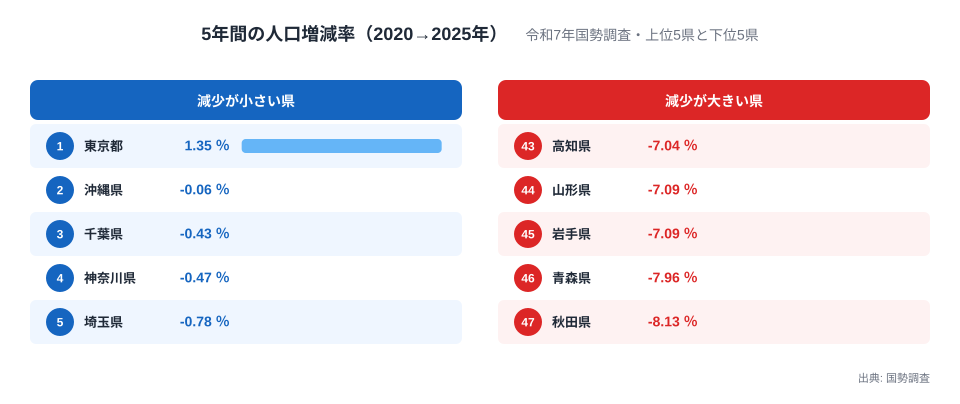
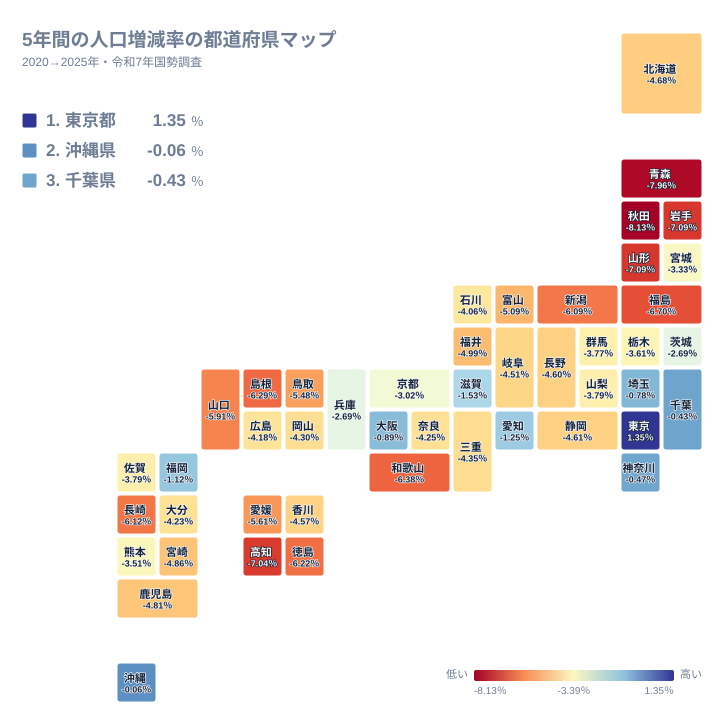

「日本の人口は減っている」と言われて久しいですが、都道府県ごとに5年前と比べた実績を並べると、その減り方は驚くほど不均一です。2026年9月29日に公表された令和7年国勢調査の確定値では、2020年から2025年にかけて人口が増えた都道府県は東京都だけでした。増減率は+1.35％です。

いちばん減ったのは秋田県の-8.13％で、東京都との差は9.48ポイントに達します。2位の沖縄県でさえ-0.06％とわずかに減っており、47都道府県のうち46道府県がマイナスでした。この記事では、2050年の推計ではなく、確定した直近5年の実績だけを使って、減少がどこに集まり、どこで抑えられたのかを読み解きます。

## 増えたのは東京都だけ、上位と下位の顔ぶれ

<source-link href="/ranking/census-population-change-rate-5y">5年間の人口増減率ランキングをもっと見る</source-link>

上位の顔ぶれを見ると、1位が東京都の+1.35％、2位が沖縄県の-0.06％、3位が千葉県の-0.43％、4位が神奈川県の-0.47％、5位が埼玉県の-0.78％です。東京都だけがプラスで、2位以下はすべてマイナスですが、沖縄県は実質的に横ばいと言える水準に踏みとどまりました。千葉県、神奈川県、埼玉県はいずれも東京都に隣接しており、減少が小さい側の上位に東京圏の1都3県がそろって入っています。

一方の下位は、47位が秋田県の-8.13％、46位が青森県の-7.96％です。45位の岩手県と44位の山形県はどちらも-7.09％で並び、43位の高知県は-7.04％でした。下位5県のうち4県が東北、1県が四国という構成で、5年間に人口の7％以上を失った県が東北に集中していることになります。

全体の分布を確かめておくと、24位にあたる三重県の-4.35％が中央の値です。増減率が-5％を下回った県は15県ある一方、-3％より減少が小さい県は11県にとどまります。減少幅の大きい県が多数派で、東京圏と大阪、愛知、福岡といった大都市圏の県だけが集団から抜け出している形です。

> [!NOTE]
> ここでの増減率は、2025年の国勢調査の人口を、2025年10月1日現在の市区町村の境域に組み替えた2020年の国勢調査の人口と比べたものです。合併などで境域が変わった地域も、同じ範囲で比較しています。年次の人口推計に基づく増減率とは、期間も出典も異なります。

## 地図で見る減少の濃淡、大都市圏だけが浮かぶ

地図に置き換えると、減少が小さい県は東京圏、愛知県、大阪府、福岡県、沖縄県という限られた地域に集中しています。6位の大阪府は-0.89％、7位の福岡県は-1.12％、8位の愛知県は-1.25％、9位の滋賀県は-1.53％で、ここまでが-2％より減少が小さい側です。10位の茨城県は-2.69％、11位の兵庫県は-2.69％と、いったん-2％台後半まで幅が開きます。

上位11県を除いた36道府県は、-3％より大きく減った側にあります。中位の静岡県は-4.61％、北海道は-4.68％、長野県は-4.60％と、-4％台後半に多くの県が並びます。人口が減る点ではほとんどの県が共通していて、その中で大都市圏がわずかに減少を抑えた、というのが5年間の実績です。

減少が大きい側は、東北だけでなく日本海側や四国、紀伊半島に広がっています。新潟県は-6.09％、島根県は-6.29％、和歌山県は-6.38％、福島県は-6.70％と続き、下位10県のうち東北以外の県は長崎県、徳島県、島根県、和歌山県、高知県の5県です。

なぜ東京都だけがプラスに転じたのかについて、この確定値だけから原因を断定することはできません。人口の増減は、出生と死亡の差である自然増減と、転入と転出の差である社会増減に分けて考える必要があります。分解には人口動態統計と住民基本台帳人口移動報告の値が要るため、この記事では扱いません。自然増減の地域差は[出生と死亡の差を県別に比べた記事](/blog/natural-increase-rate-prefecture-gap)で確認できます。

## 県の内側でも割れる、市区町村の増減

都道府県の値は、内部のばらつきをならしたものです。同じ国勢調査から作った市区町村別の値を見ると、1,741の市区町村のうち人口が増えたのは169です。全体の約1割にとどまり、大多数の自治体では人口が減っています。

増加率が最も大きかったのは福島県の大熊町で+80.99％、次いで富岡町が+36.00％、浪江町が+33.85％、楢葉町が+22.26％と、上位4つを福島県の町が占めました。続いて北海道の占冠村が+13.78％、茨城県のつくば市が+11.25％です。福島県の4町は2020年の人口がごく小さかったために率が大きく出ている可能性があります[仮説]。検証には、各町の2020年の人口と避難指示の解除時期を確認する必要があります。

減少率の側では、石川県の珠洲市が-34.57％、輪島市が-28.28％で、沖縄県の渡名喜村が-32.66％、北海道の夕張市が-23.51％と続きます。珠洲市と輪島市の落ち込みには2024年の能登半島地震の影響が関係している可能性がありますが[仮説]、この確定値だけでは因果を確かめられません。石川県の県全体の値が-4.06％で19位にとどまることを考えると、県の平均が地域ごとの大きな変動を覆い隠していることがよく分かります。

東京都の内部でも同じことが言えます。62の区市町村のうち人口が増えたのは31で、ちょうど半数です。台東区が+7.85％、中央区が+7.48％、江東区が+5.57％と伸びる一方で、三宅村は-12.63％、檜原村は-11.93％、奥多摩町は-11.45％でした。唯一のプラスである東京都も、都心部の増加が島しょ部や西部の減少を上回った結果であり、都内のすべての地域で人口が増えたわけではありません。

> [!WARNING]
> 市区町村の増減率は、もともとの人口が小さい町村ほど少人数の変動で大きく振れます。ランキングの上位や下位に小規模な自治体が並びやすい点に注意してください。

## 2050年の推計ではなく、確定した5年の実績として

直近5年の実績としては、東京都以外のすべての道府県で人口が減り、減少の深さには最大で9.48ポイントの開きがありました。大都市圏が減少を小さく抑え、東北や四国の県が7％前後の減少に沈むという配置は、将来推計が示す方向と重なります。推計側の見立ては[2050年の人口増減率を県別に比べた記事](/blog/future-population-change-rate-2050-prefecture-gap)や、[東京のパラドックスを扱った記事](/blog/future-population-tokyo-paradox)で確認できます。

市区町村の単位で人口減少の深さを段階に分けて見るなら、[人口減少の段階別に自治体を分けた記事](/blog/municipality-population-decline-tiers)が参考になります。自分の住む県が全国の中でどの位置にあるかは、[人口カテゴリの一覧](/category/population)からほかの指標とあわせて調べられます。

まとめると、令和7年国勢調査の確定値では次の点が読み取れます。

- 2020年から2025年に人口が増えたのは東京都の+1.35％だけです。
- 最も減ったのは秋田県の-8.13％で、東京都との差は9.48ポイントです。
- 2位の沖縄県は-0.06％で、上位は東京圏と大阪府、愛知県、福岡県が占めます。
- 下位5県は秋田県、青森県、岩手県、山形県、高知県で、7％以上減りました。
- 県の値は内部のばらつきをならしており、福島県の大熊町の+80.99％から石川県の珠洲市の-34.57％まで市区町村では大きく割れています。

## データについて

- 指標は令和7年国勢調査 人口等基本集計（2026年9月29日公表）から、2020年と2025年の人口の変化率を取ったものです。統計表は[e-Statの統計表](https://www.e-stat.go.jp/dbview?sid=0004065882)で確認できます。
- 2020年の人口は2025年10月1日現在の境域に組み替えた値で、増減率は小数第2位で丸めて表記しています。
- 市区町村の数え方は、政令指定都市を市全体の1として数え、その区は含めません。東京の特別区は23区を別々に数え、集計行の「特別区部」は除きます。この数え方で1,741になります。
- 岩手県と山形県は小数第3位以下で差があるため、順位は岩手県が45位、山形県が44位です。
