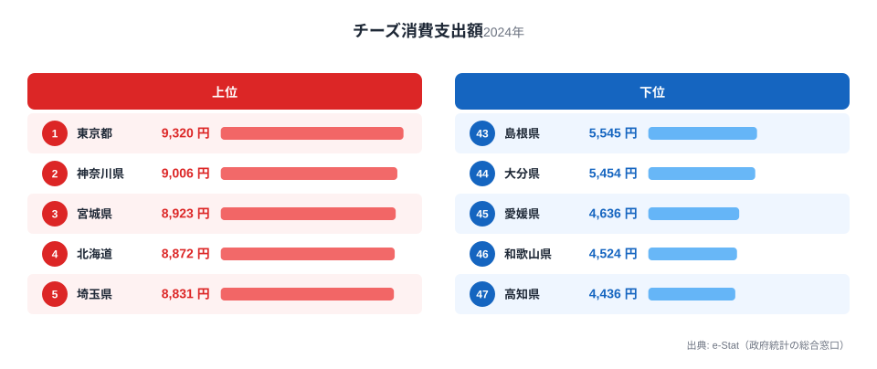
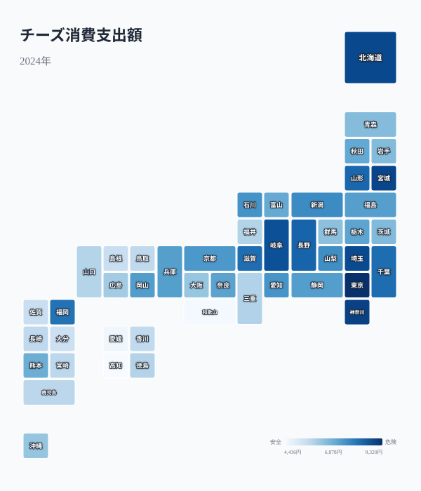

チーズは家計調査の品目のひとつで、年間の消費支出額が都道府県庁所在市ごとに公表されています。2024年のデータを見ると、1位の東京都は9,320円、最下位の高知県は4,436円と、実に2.1倍の開きがあります。同じ日本でも、住む場所によってチーズにかけるお金がこれほど違うのはなぜでしょうか。

結論から言うと、上位には東京都・神奈川県・埼玉県といった首都圏勢に加え、生産地の北海道、そして仙台市を抱える宮城県が並びます。一方で下位は四国・九州・和歌山県など西日本に集中しています。この記事では、上位・下位の具体的な数字を確認しながら、チーズが「洋食文化」「都市型消費」とどう結びついているのかを見ていきます。

> [!NOTE]
> このデータは総務省「家計調査」の品目別支出額で、対象は**都道府県庁所在市（政令指定都市含む）の二人以上世帯**です。県全体の平均ではなく、各県の代表都市（県庁所在地）における消費傾向を示す点に注意してください。

## チーズ支出額が多い都道府県

<source-link href="/ranking/cheese-consumption-expenditure">チーズ消費支出額ランキングをもっと見る</source-link>

2024年のチーズ消費支出額で1位となったのは東京都で9,320円でした。2位は神奈川県9,006円、3位は宮城県8,923円、4位は北海道8,872円、5位は埼玉県8,831円と続きます。上位5県のうち3県（東京都・神奈川県・埼玉県）が首都圏に属しており、都市部での消費の多さがはっきり表れています。

[東京都](/areas/13000)・[神奈川県](/areas/14000)・埼玉県が上位に入る背景には、パン食やパスタ、洋菓子といった「洋食文化」への親和性の高さがあります。チーズはバターやワインと同じく西洋食の代表的な食材で、外食産業やスーパーでの取り扱い品目が多い都市部ほど、家庭での購入機会も増える傾向があります。加えて、共働き世帯が多い都市部では、調理の手間が少なく子どものおやつにもなるチーズが選ばれやすいという事情も考えられます。東京都は9,320円と、下位5県の平均（5,354円）の1.7倍にあたる水準です。

一方で[北海道](/areas/01000)が4位に入っているのは、他の上位県とは異なる理由です。北海道は日本最大の生乳・乳製品の産地であり、地元産チーズの選択肢が豊富で、スーパーでの取り扱いも手厚いことが背景にあります。産地であることが必ずしも消費量の1位に直結するわけではありませんが、上位には確実に食い込んでいます。宮城県が3位に入っているのは、県庁所在地である仙台市が東北最大の都市であり、都市型消費のパターンが北海道・首都圏と近いことを示しています。6位以降は岐阜県8,713円、長野県8,340円、山形県8,283円と続きます。首都圏や政令市を抱える県が上位を固める一方で、6〜8位には政令指定都市を持たない中規模県も食い込んでおり、チーズ消費は大都市だけの現象ではなく、東日本・北日本に広く根づいた食習慣であることがうかがえます。

> [!TIP]
> チーズ消費支出額と似た傾向を示す指標に、バターやヨーグルトの消費支出額があります。「洋食化の進み方」を県ごとに比較したい場合は、乳製品全体のランキングを横断的に見比べると分析の解像度が上がります。

## チーズ支出額が少ない都道府県

下位を見ると、44位大分県5,454円、45位愛媛県4,636円、46位[和歌山県](/areas/30000)4,524円、そして47位（最下位）[高知県](/areas/39000)4,436円と、西日本・四国勢が並んでいます。42位佐賀県5,552円、43位島根県5,545円も含めると、下位10県のうち7県が中国・四国・九州地方に集中しています。

西日本・四国で消費が少ない理由として、まず食文化の違いが挙げられます。西日本は和食・魚介中心の食文化が根強く、乳製品全般の消費量が東日本・北日本よりも低い傾向が各種家計調査で確認されています。また、高知県・愛媛県・和歌山県はいずれも人口規模の小さい県庁所在市であり、大型スーパーや輸入食品店の集積度が首都圏や政令指定都市に比べて限られることも、購入機会の少なさにつながっている可能性があります。特に高知県は最下位の東京都比で47.6%の水準にとどまり、47都道府県の中で唯一支出額が5,000円を下回っています。

> [!WARNING]
> このランキングは県庁所在市の家計調査サンプルに基づくもので、県内全域の消費実態を代表するとは限りません。都市部と郡部で消費パターンが異なる可能性があるため、県全体の傾向として一般化する際は注意が必要です。

## 発見: バター・洋食文化との重なり

<source-link href="/ranking/cheese-consumption-expenditure">47都道府県の全データを見る</source-link>

地図で見ると、青の濃い（支出額が多い）エリアが首都圏・東北・北海道に集まり、色の薄いエリアが四国・中国・九州に広がっていることが一目で分かります。チーズの支出額ランキングを俯瞰すると、上位は「首都圏＋北日本の都市」、下位は「西日本・四国の地方都市」という構図が浮かび上がります。これは日本の食文化における東西差、特に洋食化の進み方の違いを反映していると考えられます。明治以降、乳製品を含む洋食文化は港湾都市や首都圏から広がった経緯があり、その伝播の名残が現代の消費データにも表れている可能性があります。

この東西差は、同じ乳製品であるバターでも共通して見られます。[バター消費支出額のランキング](/blog/butter-vs-margarine-expenditure)では神奈川・京都・東京といった都市部・洋食文化圏が上位を占めており（首位は1,894円）、チーズと同じ購買構造が確認できます。逆に地方圏では、植物油ベースで安価なマーガリンの比重が相対的に高まる傾向があり、乳製品全体で「都市＝バター・チーズ、地方＝マーガリン」という購買構造の違いがうかがえます。チーズ単体ではなく乳製品というくくりで見ると、東日本・都市部の洋食化がより立体的に見えてきます。

もうひとつの発見は、「生産地＝消費量1位」ではないという点です。北海道はチーズの一大産地でありながら、支出額では4位にとどまり、1位は生産地ではない東京都でした。これは、消費者が近くで作られているかどうかよりも、食文化・購買力・小売店の充実度によってチーズを選んでいることを示唆しています。

[仮説] 都市部でチーズ支出が多いのは、可処分所得の高さと洋食メニューへの接触頻度の両方が影響している可能性があります。厳密にどちらの寄与が大きいかを分離するには県民所得ランキングとの相関分析が必要ですが、現時点では「所得の高さ」と「輸入食品店・大型スーパーの集積」という2つの都市要因が重なってチーズ支出を押し上げている、と理解するのが妥当でしょう。産地の近さよりも都市の消費環境が効くという構図は、バターや紅茶など他の西洋由来の嗜好品にも共通してみられる特徴です。

## まとめ

- 1位は東京都9,320円、2位は神奈川県9,006円、3位は宮城県8,923円
- 最下位は高知県4,436円で、1位東京都との差は2.1倍
- 上位は首都圏（東京・神奈川・埼玉）と北海道・宮城県など都市部・北日本が中心
- 下位は高知県・愛媛県・和歌山県・大分県など西日本・四国に集中
- 生産地の北海道は支出額で4位にとどまり、産地と消費量トップが一致しない点が特徴的

家計消費に関する他の指標は[家計・所得カテゴリ](/category/economy)でまとめて確認できます。

## データ出典

総務省「家計調査」（品目別支出額、都道府県庁所在市の二人以上世帯）をもとに、e-Stat（政府統計の総合窓口）経由で集計した2024年データを使用しています。
